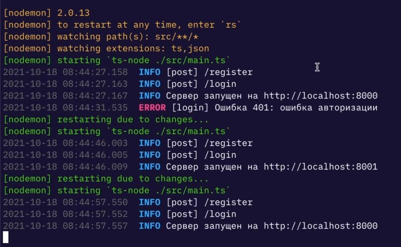
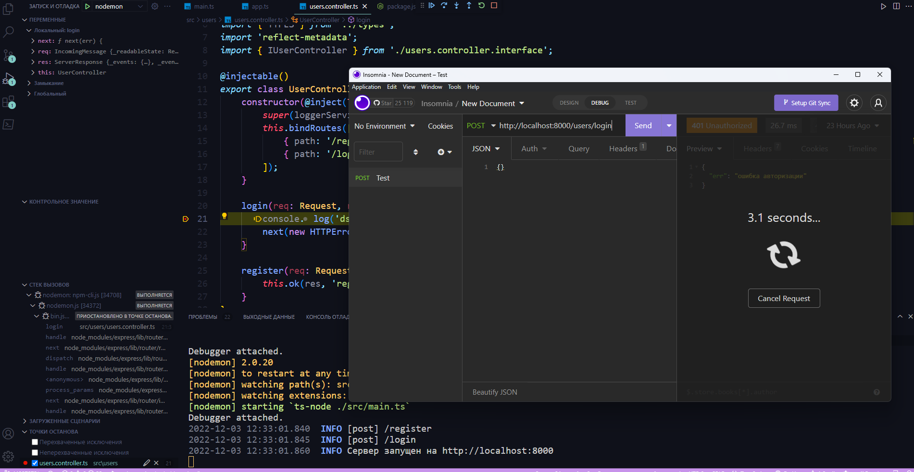
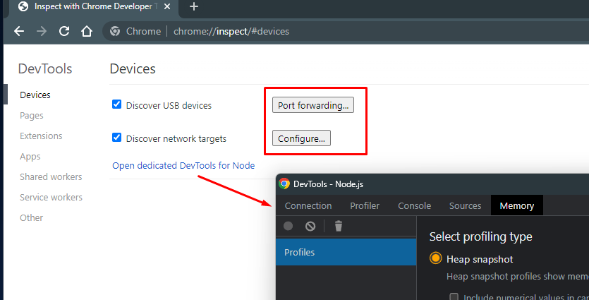
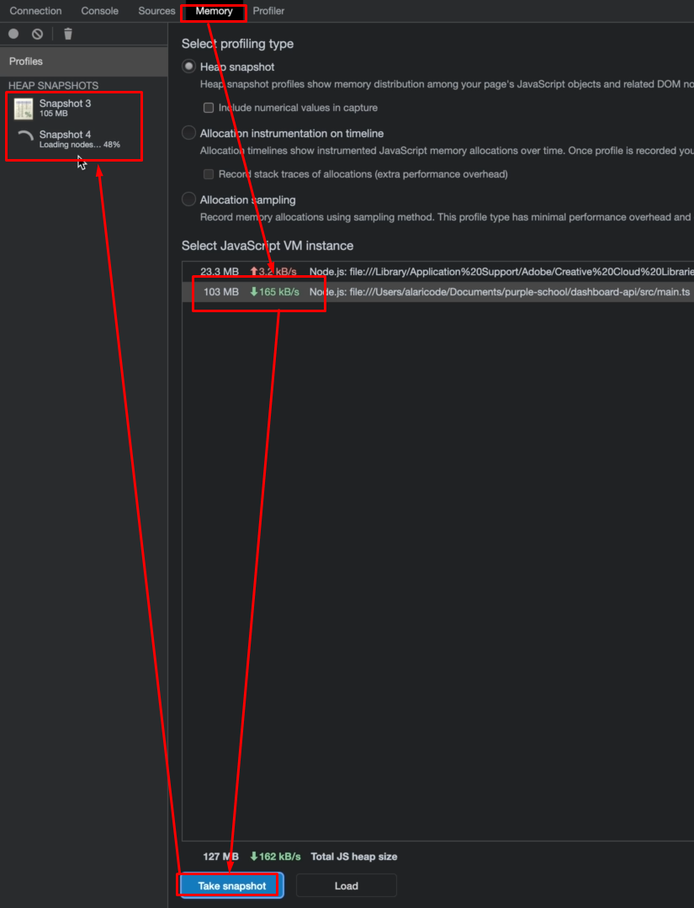
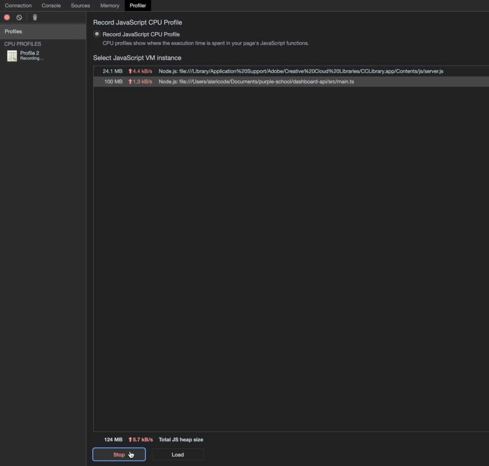
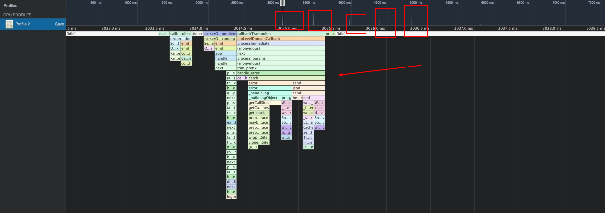
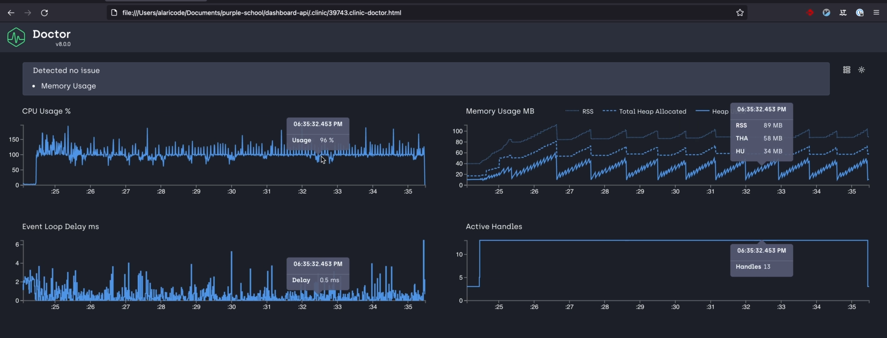
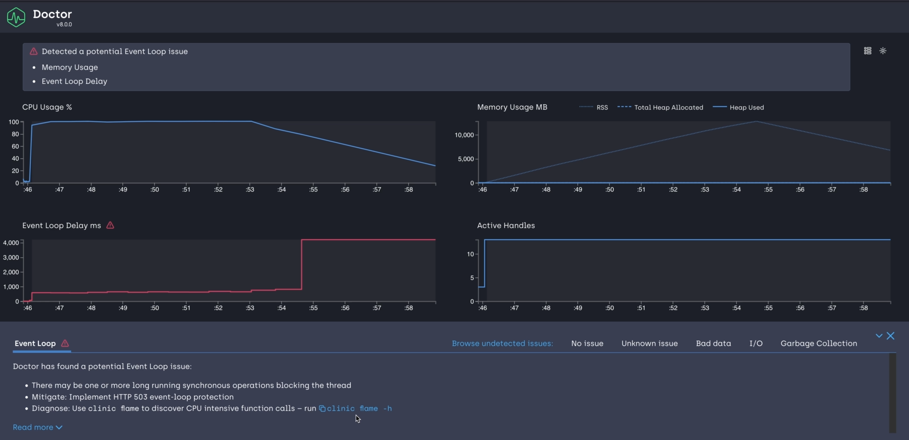

## 073 Eslint и prettier

Установим `prettier` и `eslint` вместе с плагинами, парсерами и конфигами

```bash
npm i -D eslint @typescript-eslint/parser @typescript-eslint/eslint-plugin prettier eslint-config-prettier eslint-plugin-prettier typescript
```

- одиночные кавычки
- висячая `,`
- использование табов
- `;` в конце
- пробелы между фигурными скобочками
- максимальная длина
- конечная строка: автоматически

`.prettierrc`

```JSON
{
	"singleQuote": true,
	"trailingComma": "all",
	"useTabs": true,
	"semi": true,
	"bracketSpacing": true,
	"printWidth": 100,
	"endOfLine": "auto"
}
```

- `no-unused-vars` - не используемые переменные (включая функции и объекты) - отключено у нас
- `explicit-function-return-type` - нужно явно указывать, что возвращает функция
- `no-explicit-any` - запрещает использовать `any` - убираем эту настройку

`.eslintrc`

```JSON
{
	"root": true,
	"parser": "@typescript-eslint/parser",
	"plugins": [
		"@typescript-eslint"
	],
	"extends": [
		"eslint:recommended",
		"plugin:@typescript-eslint/eslint-recommended",
		"plugin:@typescript-eslint/recommended",
		"plugin:prettier/recommended"
	],
	"rules": {
		"@typescript-eslint/ban-types": "off",
		"@typescript-eslint/no-unused-vars": [
			"off"
		],
		"@typescript-eslint/no-explicit-any": "off",
		"@typescript-eslint/explicit-function-return-type": [
			"warn"
		],
		"prettier/prettier": [
			"error",
			{
				"singleQuote": true,
				"useTabs": true,
				"semi": true,
				"trailingComma": "all",
				"bracketSpacing": true,
				"printWidth": 100,
				"endOfLine": "auto"
			}
		]
	}
}
```

Если мы будем работать в VSCode, то нужно будет сохранить эти настройки. Тут мы устанавливаем в качестве форматтиера `eslint` и форматирование будет происходить при сохранении

`.vscode > settings.json`

```JSON
{
	"[typescript]": {
		"editor.defaultFormatter": "dbaeumer.vscode-eslint"
	},
	"editor.codeActionsOnSave": {
		"source.fixAll.eslint": true
	}
}
```

Далее нам нужно добавить эти два скрипта линтера, чтобы он форматировал все файлы в проекте

```JSON
"scripts": {
		"lint": "eslint ./src/**",
		"lint:fix": "eslint ./src/** --fix"
	},
```

Далее нам нужно будет протипизировать возвраты функции

```TS
export interface IBootstrapReturn {
	app: App;
	appContainer: Container;
}

function bootstrap(): IBootstrapReturn {
	const appContainer = new Container();
	appContainer.load(appBindings);
	const app = appContainer.get<App>(TYPES.Application);
	app.init();
	return { appContainer, app };
}
```

Так же нужно будет проставить все невозвратные функции `void`

```TS
useRoutes(): void {
		this.app.use('/users', this.userController.router);
	}
```

Тут уже, так как функция асинхронная `async`, то она возвращает `Promise<void>`

```TS
public async init(): Promise<void> {
		this.useRoutes();
		this.useExeptionFilters();
		this.server = this.app.listen(this.port);
		this.logger.log(`Сервер запущен на http://localhost:${this.port}`);
	}
```

## 074 Подключение nodemon

`ts-node` - это плагин, который позволяет запускать приложения непосредственно на TS (компиляция происходит уже под капотом)

`nodemon` - это плагин, который будет перезагружать node-приложение после каждого сохранения изменений (работает почти как webpack, но на стороне сайта)

```bash
npm i -D nodemon ts-node
```

- `watch` - это та папка, за которой будет следить монитор
- `ext` - это расширения, за изменениями которых будет следить плагин
- `ignore` - указывает на то, что нужно игнорировать при перезапуске
- `exec` - путь до нашего основного файла приложения (а именно для его запуска)

`nodemon.json`

```JSON
{
	"watch": [
		"src"
	],
	"ext": "ts,json",
	"ignore": [
		"src/**/*.spec.ts"
	],
	"exec": "ts-node ./src/main.ts"
}
```

Так же данная строка в скриптах будет запускать сам монитор нод-приложения:

`package.json`

```JSON
"scripts": {
		"dev": "nodemon"
	},
```

И теперь при каждом изменении одного из файлов проекта будет перезагружаться наш сервер



## 075 Отладка

Первым делом, чтобы нормально отлаживать приложение, нужно в конфиге ТСа добавить компиляцию карт, чтобы отладчик понимал, к какой части приложения он сейчас обращается

`tsconfig.json`

```JSON
{
	"sourceMap": true,
}
```

Далее, если мы работаем в VSCode, то нужно указать данные настройки для отладчика

`.vscode > launch.json`

```JSON
{
	"version": "0.2.0",
	"configurations": [
		{
			"type": "node",
			"request": "launch",
			"name": "nodemon",
			"runtimeExecutable": "${workspaceFolder}/node_modules/nodemon/bin/nodemon.js",
			"restart": true,
			"console": "integratedTerminal",
			"internalConsoleOptions": "neverOpen"
		}
	]
}
```

Во вкладке отладки после настроек должен находиться наш `nodemon`


Далее нам нужно поставить точку останова в нужное место приложения и запустить приложение через команду `npm run dev`. После этих приготовлений, мы наконец-то сможем отправить запрос на сервер, что и триггернёт дебаггер на работу



## 076 Анализ памяти

- `-e` - экстеншены, которые мы хотим запускать
- `--exec` - наш файл запуска
- `--inspect` - подключает наш отладчик к определённому хосту
- `-r` - подключает дополнительный обработчик

`package.json`

```JSON
"scripts": {
		"dev:inspect": "nodemon -e ts,json --exec node --inspect=localhost:9222 -r ts-node/register src/main.ts"
	},
```

Далее переходим в хроме по ссылке в `about:inspect` и там настраиваем наше подключение



Дальше мы можем перейти во вкладку **Memory**, где мы можем посмотреть, сколько памяти съедает наше приложение и сделать снэпшот того, какие компоненты и сколько съедают



В самом снэпшоте можно просмотреть дерево компонентов и сколько они в отдельности съедают памяти


Далее у нас идёт профилировщик. В нём мы конкретно можем посмотреть, что происходит во время запросов на сервер.
Сначала нужно запустить профилировщик, затем отправить запросы на сервер и уже потом остановить профилировщик, чтобы просмотреть подробно, какие данные и в каком промежутке отправлялись




Тут мы можем увидеть flame graph с блоками выполняемых задач. Чем длиннее будет блок, тем больше времени тратится на его выполнение. Длинные блоки стоит оптимизировать .


## 077 Мониторинг производительности

Далее идёт удобный инструмент, который позволит нам мониторить наше приложение, его потребляемые ресурсы и производительность


Первым делом нужно установить саму клинику. Так же в пару с ней модуль имитации нагрузки на систему.

```bash
npm install -g clinic autocannon
```

- `clinic` - вызываем пакет
- `doctor` - определяем какой именно инструмент будем использовать
- `--on-port` - определяем настройки
- `autocannon` - через модуль нагрузки
- `-m` - метод запроса
- `POST` - отправка сообщения на сервер
- `localhost...` - куда будем стучаться
- Дальше нужно вызвать нодовскую команду, которая запустит конечное приложение

```bash
clinic doctor --on-port 'autocannon -m POST localhost:8000/users/register' -- node dist/main.js
```

После запуска инструмента сформируется папка `.clinic` с отчётом о производительности системы. Конкретно тут показан хороший график.



Далее немного нагрузим систему тяжёлым запросом, который будет сохранять в массив прочтённый файл видео

```TS
const data = [];

register(req: Request, res: Response, next: NextFunction): void {
		data.push(readFileSync('../../1.mp4'));
		this.ok(res, 'register');
	}
```

И попробуем выполнить запрос. Тут мы уже получили плохой график, который явно указывает на огромный рост длительности выполнения ивент лупа.


