## Установка

Установка Composer

```bash
curl -sS https://getcomposer.org/installer | php
mv composer.phar /usr/local/bin/composer
```

Установка проекта через `composer`

```bash
composer create-project --prefer-dist yiisoft/yii2-app-basic папка
```

И далее нужно будет для композера указать сгенерированный токен

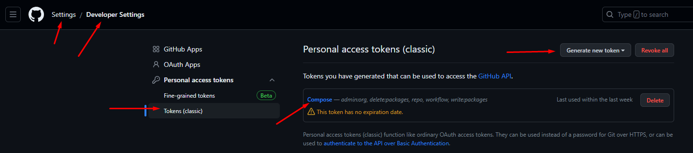
## Структура

В качестве входного скрипта выступает фронт-контроллер, который находится в `web/index.php`, в котором подгружается конфигурация, фреймворк Yii и собирается объект приложения

Далее запрос попадает в приложение, где определяется маршрут и создаётся контроллер, по которому пойдёт запрос

Внутри контроллера запрос проходит проверки на валидность, выполняется загрузка данных из базы (данные определяются их моделью) и далее эти данные преобразуются в тот ответ, который ожидает увидеть пользователь - вид (например, нам нужно получить от полей с созданным пользователем ещё и обогащённые данные в нужном формате - отправили все данные по пользователю в разнобой, но получили полный ответ, где идут его комментарии, место работы и так далее)

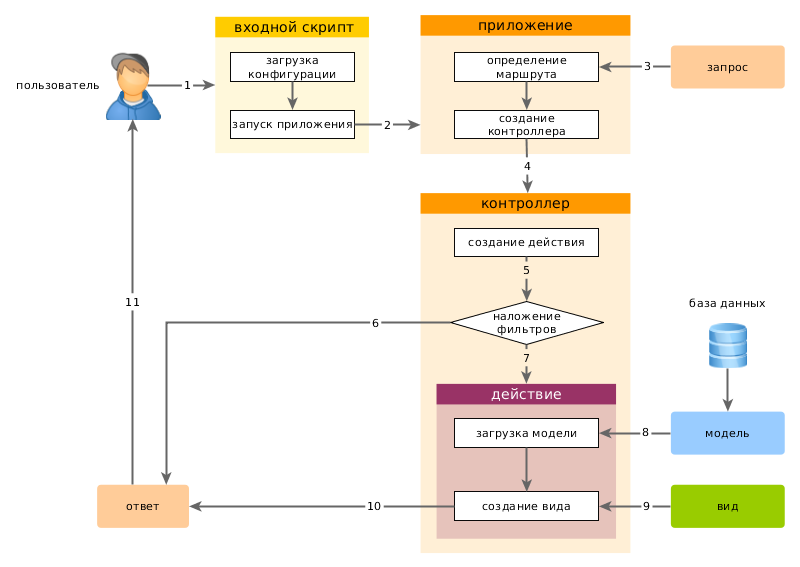

- web - это публичная папка, которая представляет доступ к страницам, стилям, изображениям. Её не стоит закрывать от пользователей.
- widgets - это папка с переиспользуемым кодом внутри приложения
- assets - папка с пакетами ресурсов для приложения
- commands - команды для работы из консоли с приложением
- config - папка с конфигами, в которой можно настроить подключение к базе или работу с web
- **controllers** - папка с контроллерами приложения
- mail - папка с шаблонами писем для отправки пользователям
- **models** - папка с моделями данных
- runtime - папка с логами и кешем
- test - папка с тестами приложения
- vendor - папка с зависимостями
- **views** - папка с шаблонами и видами (layout хранит шаблоны, site хранит виды)

## Контроллеры

### Общее

Контроллеры в Yii2 представляют собой классы, которые обрабатывают входящие запросы от пользователя и выполняют определенные действия. Они служат посредниками между моделями данных и представлениями, управляя потоком данных и логикой приложения.

Вот основные аспекты работы контроллеров в Yii2:

1. **Маршрутизация**: Контроллеры связаны с конкретными маршрутами (URL-адресами). Веб-приложение Yii2 использует маршрутизацию для определения, какой контроллер должен быть вызван для обработки запроса.
2. **Действия (Actions)**: Контроллеры содержат публичные методы, называемые действиями (actions), которые соответствуют конкретным операциям, выполняемым пользователем. Например, действие `actionIndex()` может отображать главную страницу, а `actionCreate()` может создавать новую запись в базе данных.
3. **Входные данные**: Контроллеры могут получать данные от пользователя через параметры URL, GET или POST запросы, а также через формы или JSON данные. Эти данные передаются в действия контроллера в качестве аргументов метода.
4. **Обработка запросов**: Контроллеры обрабатывают входящие запросы, выполняют необходимую логику и взаимодействуют с моделями данных для получения или изменения данных. Они могут использовать различные методы доступа к данным, такие как ActiveRecord или QueryBuilder.
5. **Результаты**: После обработки запроса контроллер должен вернуть результат пользователю. Это может быть представление (View), которое отображается пользователю, или данные в формате JSON или XML, отправляемые клиенту.
6. **Фильтры и события**: Yii2 предоставляет возможность применять фильтры для контроля доступа, кэширования, логирования и других аспектов обработки запросов. Контроллеры могут использовать события для выполнения дополнительных операций до или после обработки запросов.

```PHP
namespace app\controllers;

use yii\web\Controller;

class SiteController extends Controller
{
    public function actionIndex()
    {
        // Логика действия
        $message = 'Привет, мир!';

        // Отображение представления с передачей данных
        return $this->render('index', ['message' => $message]);
    }

    public function actionCreate()
    {
        // Обработка POST запроса и создание новой записи в базе данных

        // Перенаправление на другую страницу
        return $this->redirect(['site/index']);
    }
}
```

В этом примере `SiteController` содержит два действия: `actionIndex()` и `actionCreate()`. `actionIndex()` отображает представление "index" с передачей переменной `$message`, а `actionCreate()` обрабатывает POST-запрос и перенаправляет пользователя на главную страницу.

### Создание контроллера

В папке с контроллерами нам нужно создавать одноимённые контроллеры, которые будут обозначать определённый маршрут. В них мы вкладываем функции, которые начинаются с `action` и уже дальше будет идти имя роута, который мы вызываем в url-строке

`controllers / PostCommentController.php`
```PHP
<?php

namespace app\controllers;

use yii\web\Controller;

class PostCommentController extends Controller
{
    public function actionIndex() {
        return __METHOD__;
    }
}
```

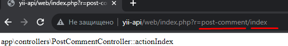

Так же мы можем отделять контроллеры в отдельные модули. Тут нам нужно будет указать папку дополнительно в неймспейсе `\admin`

`controllers / admin / MyController.php`
```PHP
<?php

namespace app\controllers\admin;

use yii\web\Controller;

class MyController extends Controller
{

    public function actionIndex() {
        return __METHOD__;
    }

}
```

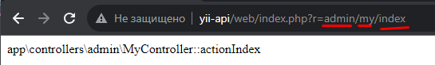

Так же мы можем не указывать имя метода контроллера, если он `Index` или если мы запишем в качестве дефолтного контроллера другой через `$defaultAction` 

`controllers / TestController.php`
```PHP
<?php

namespace app\controllers;

use yii\web\Controller;

class TestController extends Controller {

    public $defaultAction = 'my-test';

    public function actionIndex() {
        return 'Main Worker';
    }

    public function actionMyTest() {
        return __METHOD__;
    }

}
```

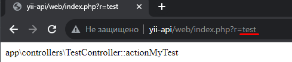

Таким образом мы можем просто передавать параметры в контроллер через Get-запрос

`controllers / TestController.php`
```PHP
<?php

namespace app\controllers;

use yii\web\Controller;

class TestController extends Controller {

    public $defaultAction = 'my-test';

    public function actionIndex($name, $age = 30) {
        return $name . ' ' . $age;
    }

    public function actionMyTest() {
        return __METHOD__;
    }

}
```

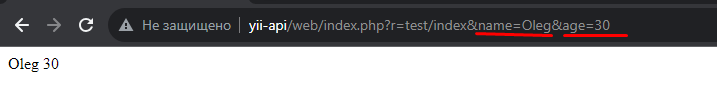

### Вызов экшенов

Так же внутри контролерров в методе `actions()` мы можем присваивать определённым роутам контроллеров выполнение определённых функций. Тут в контроллере `test` по роуту `test` будет выводиться текст `'Action runner'`

`components / HelloAction.php`
```PHP
<?php

namespace components;

use yii\base\Action;

class HelloAction extends Action
{
    public function run() {
        return 'Action runner';
    }
}
```

`controllers / TestController.php`
```PHP
<?php

namespace app\controllers;

use yii\web\Controller;

class TestController extends Controller {

    public $defaultAction = 'my-test';

    public function actions() {
        return [
            'test' => 'app\components\HelloAction'
        ];
    }

    public function actionIndex($name, $age = 30) {
        return $name . ' ' . $age;
    }

    public function actionMyTest() {
        return __METHOD__;
    }

}
```

## Представления (Виды - View)

### Общее

Представления (Views) в Yii2 отвечают за отображение данных пользователю. Они содержат HTML-код, который определяет структуру и внешний вид пользовательского интерфейса. Представления могут быть использованы для отображения результатов действий контроллеров или для отображения статических страниц.

Вот основные аспекты работы с представлениями в Yii2:

1. **Шаблоны представлений**: Yii2 поддерживает использование шаблонов представлений для обеспечения единообразия внешнего вида приложения. Шаблоны позволяют определить общую структуру страницы с различными блоками, которые могут быть заполнены данными из действий контроллеров.
2. **Виджеты**: Виджеты являются многоразовыми компонентами, которые упрощают создание повторяющихся элементов пользовательского интерфейса. Yii2 предоставляет множество готовых виджетов, таких как кнопки, формы, навигационные меню и т. д. Можно также создавать собственные виджеты для повторного использования.
3. **Передача данных**: Контроллеры передают данные в представления через массив параметров. Эти данные могут быть доступны в представлении для отображения или использования в логике шаблона.
4. **Использование логики**: В представлениях можно использовать PHP-код для выполнения простых операций или циклов. Однако для сложной бизнес-логики рекомендуется ограничивать использование PHP-кода и переносить его в контроллеры или компоненты.
5. **Отображение данных**: Представления используются для отображения данных, полученных из контроллеров или других источников. Можно использовать различные теги и функции Yii2 для форматирования и отображения данных, таких как `<?= $variable ?>` для вывода переменной или `<?php foreach ($items as $item): ?>` для отображения элементов массива.
6. **Многоязычность**: Yii2 имеет встроенную поддержку многоязычности, позволяющую создавать представления на разных языках. Можно использовать специальные функции для перевода текстовых строк на нужный язык.

```PHP
<?php

use yii\helpers\Html;

// Использование шаблона
$this->layout = 'main';

// Заголовок страницы
$this->title = 'Главная страница';

// Добавление стилей и скриптов
$this->registerCssFile('/css/style.css');
$this->registerJsFile('/js/script.js');

?>

<h1><?= Html::encode($this->title) ?></h1>

<p>Добро пожаловать на главную страницу!</p>

<?php foreach ($items as $item): ?>
    <div class="item">
        <?= Html::encode($item->name) ?>
    </div>
<?php endforeach; ?>
```

В этом примере представление использует шаблон `main`, устанавливает заголовок страницы и подключает стили и скрипты. Затем оно отображает заголовок и параграф, а также перебирает элементы массива `$items` и выводит их в виде блоков `<div>`. Функция `Html::encode()` используется для безопасного отображения данных, чтобы избежать возможности XSS-атак.

### Использование View

Yii предоставляет нам возможность рендерить страницы пользователю на основе определённых видов.

Конкретно у нас есть 4 методя для реализации данной задумки:
- render - отрисовывает заранее заданный вид
- renderAjax - отрисовывает страницу по AJAX запросу и подключает JS/CSS к файлу
- renderPartial
- renderFile - отрисовывает файл

Если нам нужно отрендерить элемент, то мы должны в подцеплённый к виду контроллер вписать метод, который будет соответствовать имени вида, который он рендерит

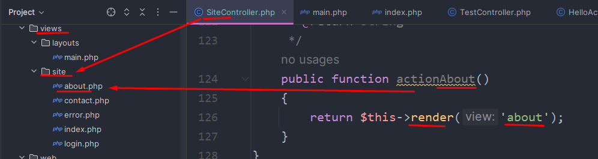

И тут нам нужно сразу поговорить про то, что все виды мы вставляем в шаблоны, которые принимают в себя виды. Вверху вид хедера, снизу - футер, а в центре - изменяемая контентная часть

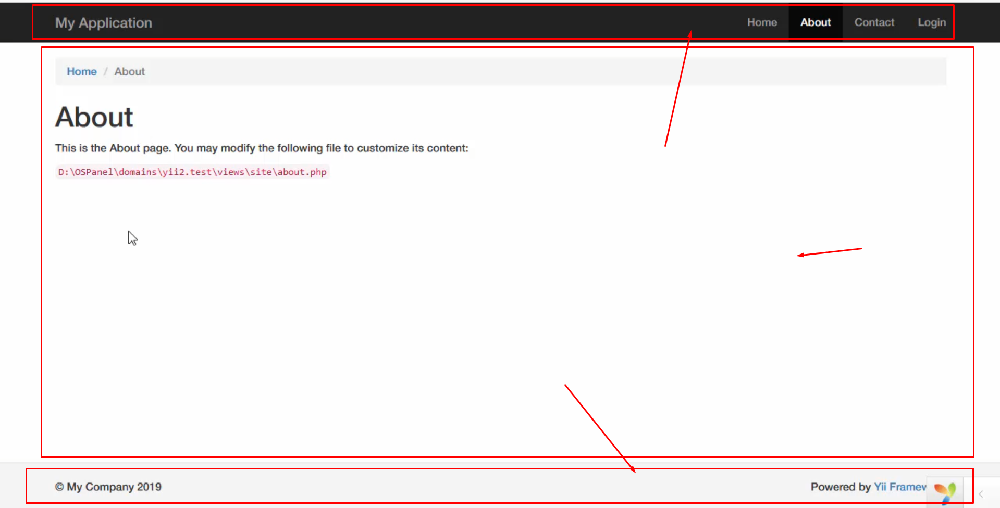

И таким образом мы в тестовом контроллере сделали `actionIndex()`, который будет по роуту `\test` вызывать 

`controllers / TestController.php`
```PHP
<?php

namespace app\controllers;

use yii\web\Controller;

class TestController extends Controller {

//    public function actions() {
//        return [
//            'test' => 'app\components\HelloAction'
//        ];
//    }

    public function actionIndex() {
        return $this->render('index');
    }

    public function actionMyTest() {
        return __METHOD__;
    }

}
```

`views / test / index.php`
```PHP
<h1>Hello, man</h1>
```

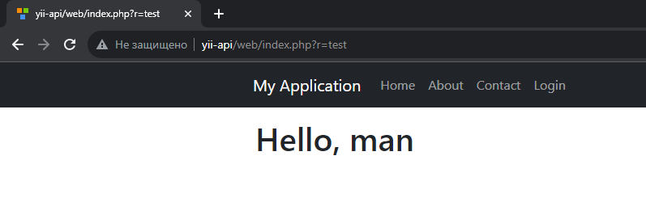

### Рендер View во View

Так же мы можем рендерить одни вью в других вью

`views / test / inc.php`
```PHP
<p>
    <code>
        <?= __FILE__ ?>
    </code>
</p>
```

`views / test / index.php`
```PHP
<h1>Hello, man</h1>
<?= this->render('inc') ?>
```

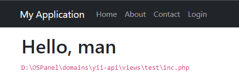

### Передача параметров внутрь View из контроллеров

Таким образом мы можем передавать данные во вью:

первый вариант:
`controllers / TestController.php`
```PHP
<?php

namespace app\controllers;

use yii\web\Controller;

class TestController extends Controller {

    public function actionIndex() {
        return $this->render('index', [
            'name' => 'Alex',
            'age' => 34
        ]);
    }

    public function actionMyTest() {
        return __METHOD__;
    }

}
```
Второй вариант:
```PHP
public function actionIndex($name = 'Guest', $age = 30) {
	return $this->render('index', compact('name', 'age'));
}
```

`views / test / index.php`
```PHP
<h1>Hello, man</h1>
<?= $name ?>
<?= $age ?>
```

Отличия при использовании слешей при обращении к виду:

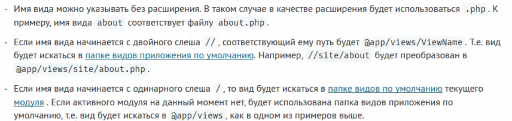

И по вышеописанному алгоритму мы можем подключить любой другой файл с использованием наших заветных `//`

`views / test / index.php`
```PHP
<h1>Hello, man</h1>  
<?= $this->render('inc') ?>  
<?= $this->render('//data/about.html') ?>  
<?= $name ?>  
<?= $age ?>
```

`views / data / about.html`
```PHP
<h2>No words about me</h2>  
<p>So close...</p>
```

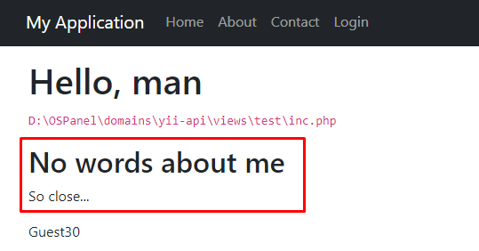

Так же у нас есть возможность передавать данные из контроллера во вью в обход прямой передачи 

`controllers / TestController.php`
```PHP
<?php

namespace app\controllers;

use yii\web\Controller;

class TestController extends Controller {

    public $score = 1200;

    public function actionIndex() {
        \Yii::$app->view->params['title'] = 'Title';

        return $this->render('index', [
            'name' => 'Alex',
            'age' => 34
        ]);
    }

    public function actionMyTest() {
        return __METHOD__;
    }

}
```

`views / test / index.php`
```PHP
<h1>Hello, man</h1>
<p><?= $this->context->score ?></p>
<p><?= $this->params['title'] ?></p>
```

## Ресурсы

В Yii2 ресурсы представляют собой файлы CSS, JavaScript, изображений и других статических файлов, используемых в приложении. Работа с ресурсами упрощает организацию и управление внешним видом и функциональностью вашего приложения.

Yii2 предоставляет специальный механизм для работы с ресурсами, который называется ассеты (Assets). Ассеты позволяют объединять и минимизировать файлы, кэшировать их, а также автоматически подключать зависимости.

Вот основные шаги для работы с ассетами в Yii2:

1. **Создание класса ассета**: Создайте класс ассета, который будет представлять группу связанных файлов. Класс ассета должен наследоваться от `yii\web\AssetBundle` и определять свойство `basePath`, указывающее на папку с файлами ассета.

```PHP
namespace app\assets;

use yii\web\AssetBundle;

class AppAsset extends AssetBundle
{
    public $basePath = '@webroot';
    public $baseUrl = '@web';
    public $css = [
        'css/style.css',
    ];
    public $js = [
        'js/script.js',
    ];
    public $depends = [
        'yii\web\YiiAsset',
        'yii\bootstrap\BootstrapAsset',
    ];
}
```

2. **Подключение ассета**: В контроллерах или представлениях можно подключить ассет следующим образом:

```PHP
use app\assets\AppAsset;

// Подключение ассета в контроллере
public function actionIndex()
{
    AppAsset::register($this->view);
    // ...
}

// Подключение ассета в представлении
<?php
    AppAsset::register($this);
    $this->registerCssFile('/path/to/other/css/file.css');
    $this->registerJsFile('/path/to/other/js/file.js');
?>
```

3. **Использование ресурсов**: После подключения ассета его файлы становятся доступными для использования. Например, вы можете использовать функцию `registerCssFile()` или `registerJsFile()` для явного подключения дополнительных файлов CSS или JavaScript.

```PHP
<?php foreach ($items as $item): ?>
    <div class="item"><?=$item->name?></div>
<?php endforeach; ?>

<?php $this->registerCss("
    .item {
        color: red;
        font-weight: bold;
    }
"); ?>
```

## Работа с форамами

1. Создание модели данных:

```PHP
namespace app\models;

use yii\base\Model;

class ContactForm extends Model
{
    public $name;
    public $email;
    public $message;

    public function rules()
    {
        return [
            [['name', 'email', 'message'], 'required'],
            ['email', 'email'],
        ];
    }
}
```

2. Создание представления (view):

```PHP
<?php

use yii\helpers\Html;
use yii\widgets\ActiveForm;

$form = ActiveForm::begin(); ?>

    <?= $form->field($model, 'name') ?>
    
    <?= $form->field($model, 'email') ?>
    
    <?= $form->field($model, 'message')->textarea() ?>

    <div class="form-group">
        <?= Html::submitButton('Submit', ['class' => 'btn btn-primary']) ?>
    </div>

<?php ActiveForm::end(); ?>
```

3. Обработка отправки формы в контроллере:

```PHP
namespace app\controllers;

use Yii;
use app\models\ContactForm;
use yii\web\Controller;

class SiteController extends Controller
{
    public function actionContact()
    {
        $model = new ContactForm();

        if ($model->load(Yii::$app->request->post()) && $model->validate()) {
            // Данные прошли валидацию, выполняем нужные действия
            // Например, сохраняем данные в базу данных
            return $this->redirect(['success']);
        }

        return $this->render('contact', [
            'model' => $model,
        ]);
    }

    public function actionSuccess()
    {
        // Отображение страницы успешного выполнения операции
        return $this->render('success');
    }
}
```

Отображение сообщений об успехе в представлении 'success':

```PHP
<h1>Success!</h1>
<p>Your form has been submitted successfully.</p>
```

## Валидация


## AJAX


## Модели (Model)


## Active Record


## Связи моделей


## Виджеты


## ЧПУ


