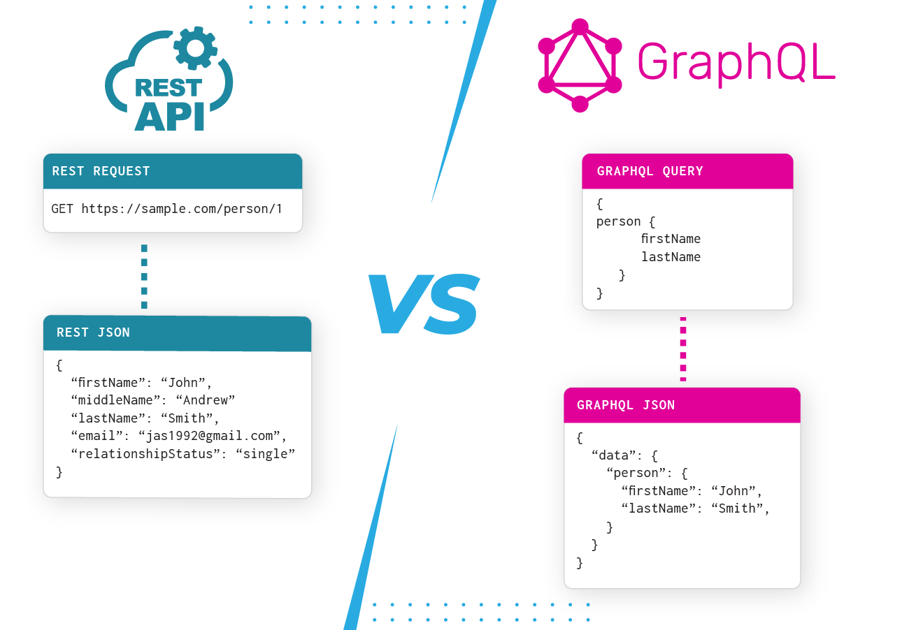
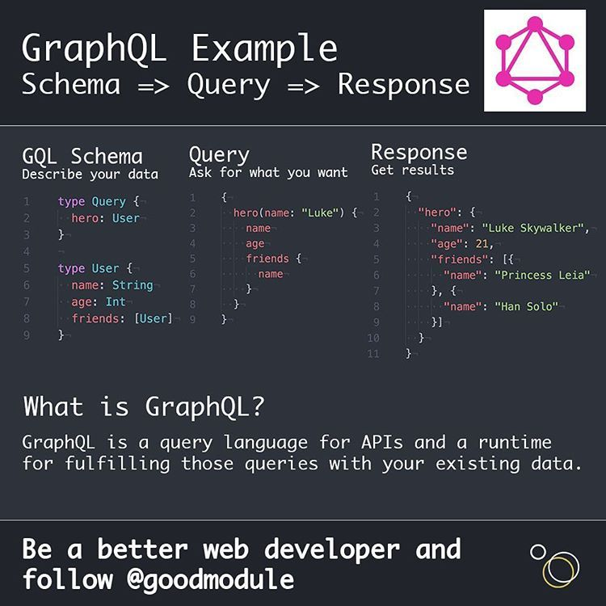
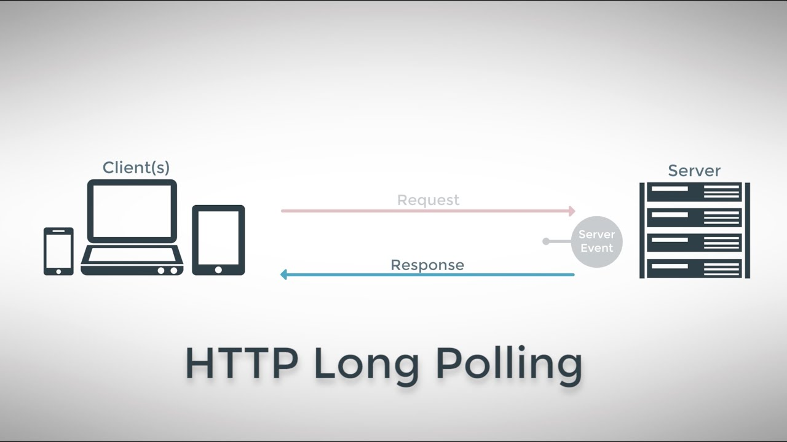
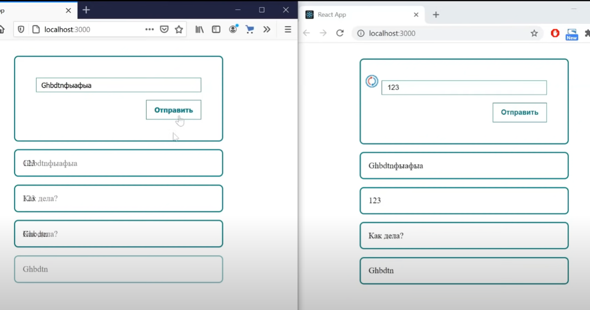
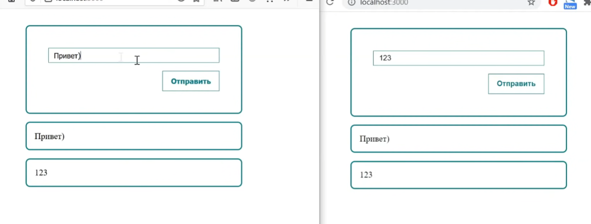
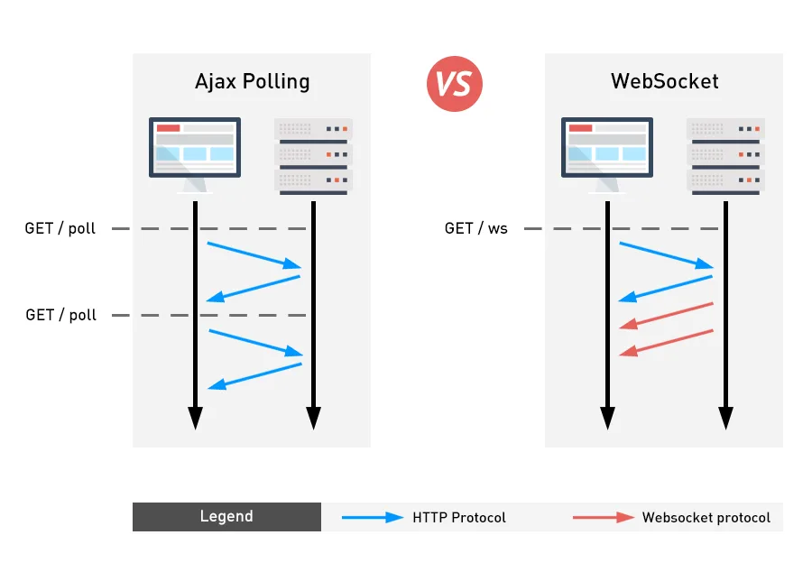
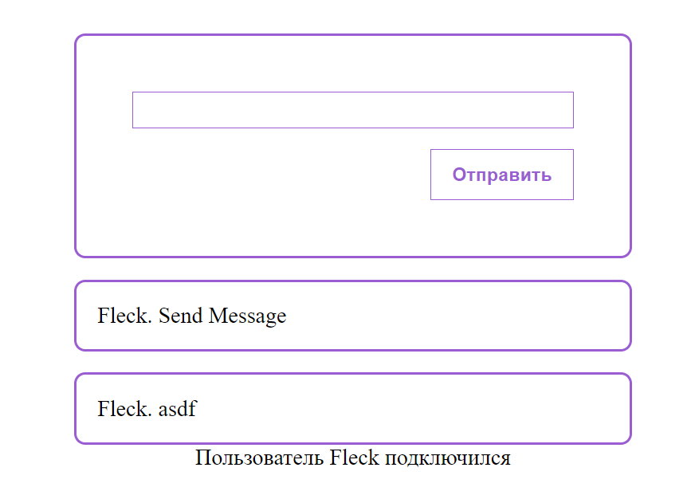

---
tags:
  - http
  - restapi
  - websockets
  - rpc
  - grpc
  - trpc
  - soap
  - graphql
  - apollo
  - concepts
---

## Клиент-серверная архитектура

В самом базовом представлении, мы имеем: 
1. Клиент - приложение, через которое клиент общается с сервером
2. Сервер - приложение, которое принимает запросы и отвечает на них, база данных и остальные обвязки


Сервер исполняет (или нет) действия, которые запросил у него клиент


Клиентом может быть как браузер или мобильное приложение, так и другой сервер. 

Сервер - это поставщик данных. Клиент - это потребитель данных. 


---
## HTTP

HTTP - это протокол сетевого уровня для передачи информации. Является самым универсальным и широкораспространённым. 


HTTP является самым верхним уровнем модели OSI


Любой HTTP запрос состоит из: 
- стартовой строки - метода, url (пути запроса) и версии протокола
- заголовков - данные,  которые влияют на запрос (авторизация, тип отправляемых данных, хост и так далее)
- тела (опционально) - пейлод от клиента


Основные методы запросов: 
- GET - получение данных
- POST - передача данных / создание ресурса
- PUT - обновление ресурса
- PATCH - частичное обновление ресурса
- DELETE - удаление ресурса

Строка статуса `HTTP/1.1 200`

Статус коды: 
- 1xx - информационные ответы
- 2xx - успех
	- 200
	- успех
	- 201
	- успех
- 3xx - редиректы
- 4xx - ошибки на стороне клиента
	- 400
	- некорректный
	- 404
	- ресурс
- 5xx - ошибки на стороне сервера
	- 500
	- ошибка


---
## RestAPI

API (application programming interface) - интерфейс для общения с программой


REST API - это архитектурный стиль, который описывает, как строить правильный и удобный API и правильно использовать возможности HTTP (его семантику)

Есть 6 принципов, которыми мы должны руководствоваться

1. Клиент-серверная модель (client-server model) - есть потребитель и провайдер данных;
2. Отсутствие состояния (statelessness) - сервер не должен запоминать промежуточные состояния между запросом и ответом. При каждом обращении клиента к серверу, их общение начинается как в первый раз;
3. Кэширование (cacheability) - возможность закэшировать результат выполнения операции. Такое состояние сохраняют только POST и GET запросы - остальные кэшировать нельзя;
4. Единообразие интерфейса (uniform interface) - все сущности должны выполнять консистентные операции в рамках одного приложения. Так же правильнее называть сущности во множественном числе, а для деления операции использовать правильные методы запросов;
  
5. Многоуровневая система (layered system) - система должна иметь возможность состоять из большого количества слоёв (прокси, обработчики и так далее);
6. Код по требованию (code on demand) — необязательно.

> **Идемпотентность** - это свойство запроса, который при нескольких повторениях будет возвращать один и тот же результат. Такими могут быть только методы GET, PUT и DELETE.

> Форматом обмена данными преимущественно является JSON, но так же им может быть и XML

Версионирование. Так же принято использовать версионирование в рамках REST, когда для обновления интерфейса, создаётся другой хэндлер с прописанной версией:
- `access/check`
- `access/check/v2`


Документирование. Средтством документирования API обычно является:
- спецификация OpenAPI
- и инструмент его имплементации - Swagger 


---
## SOAP

SOAP - это протокол обмена структурированными сообщениями. Применим для любого протокола прикладного уровня (SMTP, FTP, HTTP)

> Можно в на одном бэкэнде написать как REST, так и SOAP ручки

Для описания веб-сервисов и доступа к ним использует язык WSDL, который описывает:

- какие операции предоставляет сервис
- какие типы данных используются
- где находится сервис (endpoint)

Простой WSDL-файл для сервиса, который возвращает данные о пользователе:

```XML
<definitions xmlns="http://schemas.xmlsoap.org/wsdl/"
             xmlns:soap="http://schemas.xmlsoap.org/wsdl/soap/"
             xmlns:xs="http://www.w3.org/2001/XMLSchema"
             xmlns:tns="http://example.com/userservice"
             targetNamespace="http://example.com/userservice">

  <!-- Типы данных -->
  <types>
    <xs:schema targetNamespace="http://example.com/userservice">
      <xs:element name="GetUserRequest">
        <xs:complexType>
          <xs:sequence>
            <xs:element name="UserId" type="xs:int"/>
          </xs:sequence>
        </xs:complexType>
      </xs:element>

      <xs:element name="GetUserResponse">
        <xs:complexType>
          <xs:sequence>
            <xs:element name="Id" type="xs:int"/>
            <xs:element name="Name" type="xs:string"/>
          </xs:sequence>
        </xs:complexType>
      </xs:element>
    </xs:schema>
  </types>

  <!-- Сообщения -->
  <message name="GetUserRequest">
    <part name="parameters" element="tns:GetUserRequest"/>
  </message>
  <message name="GetUserResponse">
    <part name="parameters" element="tns:GetUserResponse"/>
  </message>

  <!-- Операции -->
  <portType name="UserServicePortType">
    <operation name="GetUser">
      <input message="tns:GetUserRequest"/>
      <output message="tns:GetUserResponse"/>
    </operation>
  </portType>

  <!-- Привязка -->
  <binding name="UserServiceBinding" type="tns:UserServicePortType">
    <soap:binding transport="http://schemas.xmlsoap.org/soap/http" style="document"/>
    <operation name="GetUser">
      <soap:operation soapAction="http://example.com/userservice/GetUser"/>
      <input>
        <soap:body use="literal"/>
      </input>
      <output>
        <soap:body use="literal"/>
      </output>
    </operation>
  </binding>

  <!-- Сервис -->
  <service name="UserService">
    <port name="UserServicePort" binding="tns:UserServiceBinding">
      <soap:address location="http://localhost:8080/userservice"/>
    </port>
  </service>

</definitions>
```

Если RESTAPI представляет собой множество разных окон для общения, то SOAP описывает одно окно для общения, в которое мы передаём запрашиваемую для выполнения процедуру

Запрос процедуры состоит из 3 обязательных блоков: 
- Envelope - блок для определения начала и конца сообщения с данными для адресации
- Header - хранит вспомогательную информацию по запросу
- Body - хранит в себе наименование целевой процедуры и payload запроса

```XML
<soapenv:Envelope xmlns:soapenv="http://schemas.xmlsoap.org/soap/envelope/"
                  xmlns:ex="http://example.com/">
   <soapenv:Header/>
   <soapenv:Body>
      <ex:GetUserRequest>
         <ex:UserId>123</ex:UserId>
      </ex:GetUserRequest>
   </soapenv:Body>
</soapenv:Envelope>
```


---
## GraphQL
### Что такое GraphQL

GraphQL - это язык запросов для общения между клиентом и сервером. Он отличается от базового RestAPI полным указанием нужных полей, которые нам нужно вернуть с сервера.

Apollo - это платформа, которая позволяет удобно работать с GraphQL



GraphQL - это технология, которая позволяет на сервере описать схему данных, а на клиенте из этой схемы выбрать только нужные для конкретного запроса данные. 

Это крайне удобно, так как в разных местах, например, по продукту нам нужная подробная информация с описанием и характеристиками, а в другом только название и цена. 

Если REST описывает схему и формат возвращаемых данных с сервера, то GQL говорит описать формат на сервере, а на клиенте позволяет выбрать нужные данные из схемы. 

### Виды запросов

Для осуществления запросов на сервер, нам потребуется описать:

- схема

- интерфейсы
- **Query** - запрос на сервер, который вернёт определённые данные



#### Query

Query (GET) - запрос на получение данных

- описываем схему
- отправляем запрос
- получаем ответ по схеме

```
# Schema
type Query { hero: Character}

# Request
{
  hero {
    name
  }
}

# Response
{
  "data": {
    "hero": {
      "name": "R2-D2"
    }
  }
}
```


##### Fragment

Fragments позволяют нам объединить несколько query и собрать из них один запрос, переиспользовав query

```GraphQL
query {
  leftComparison: hero(episode: EMPIRE) {
    ...comparisonFields
  }
  rightComparison: hero(episode: JEDI) {
    ...comparisonFields
  }
}

fragment comparisonFields on Character {
  name
  appearsIn
  friends {
    name
  }
}
```

И ответ будет представлен таким образом

```JSON
{
  "data": {
    "leftComparison": {
      "name": "Luke Skywalker",
      "appearsIn": [
        "NEWHOPE",
        "EMPIRE",
        "JEDI"
      ],
      "friends": [
        {
          "name": "Han Solo"
        },
        {
          "name": "Leia Organa"
        },
        {
          "name": "C-3PO"
        },
        {
          "name": "R2-D2"
        }
      ]
    },
    "rightComparison": {
      "name": "R2-D2",
      "appearsIn": [
        "NEWHOPE",
        "EMPIRE",
        "JEDI"
      ],
```

#### Mutation

**Mutation** уже позволяет какие-либо данные добавить, обновить или перезаписать (аналог `post`/`put` запросов)

Конкретно тут вызвана мутация `updateHumanName`, по которой мы:
- отправляем на сервер `id` и `name` определённого персонажа
- по этим параметрам мы находим персонажа и изменяем его имя
- просим вернуть его новые `id` и `name` этого персонажа

```
# Schema
type Mutation { updateHumanName(id: ID!, name: String!): Human}

# Request
## Operation
mutation UpdateHumanName($id: ID!, $name: String!) { 
  updateHumanName(id: $id, name: $name ) {
    id
    name
  }
}
## Vars
{
  "id": "1000",
  "name": "Luke Starkiller"
}

# Response
{
  "data": {
    "updateHumanName": {
      "id": "1000",
      "name": "Luke Starkiller"
    }
  }
}
```

#### Subscription

И третий вид запросов - **Subscription** (подписки) - клиент слушает изменения в БД в режиме реального времени

Этот тип запроса реализован поверх протокола WebSocket

```graphql
subscription StoryLikeSubscription($input: StoryLikeSubscribeInput) {
	storyLikeSubscribe(input: $input) {
		story {
			likers {
				count
			}
			likeSentence {
				text
			}
		}
	}
}
```

#### Преимущества

- Самодокументация (по эндпоинту доступна документация, где описаны все поля)
- Кодогенерация (можем сгенерировать для фронта типы по GQL `npx apollo codegen:generate --localSchemaFile=grapql-schema.json --target=typescript`)
- Клиент запрашивает только нужные данные
- 

### Реализация

#### Сервер

Устанавливаем зависимости

```bash
npm i express-graphql graphql
```

Далее нам нужно будет описать схему наших сущностей на сервере

Как выглядит описание сущностей:

- Мы описываем объекты User и Post (через `[Post]` указываем вложенность от другой сущности)
- Описываем возможные инпуты, которые придут к нам на сервер (через `!` указываем обязательность поля)
- Определяем мутации и запросы в схеме

`schema.js`

```JS
const {buildSchema} = require('graphql')

const schema = buildSchema(`

    type User {
        id: ID
        username: String
        age: Int
        posts: [Post]
    }
    type Post {
        id: ID
        title: String
        content: String
    }

    input UserInput {
        id: ID
        username: String!
        age: Int!
        posts: [PostInput]
    }
    input PostInput {
        id: ID
        title: String!
        content: String!
    }

    type Query {
        getAllUsers: [User]
        getUser(id: ID): User
    }
    type Mutation {
        createUser(input: UserInput): User
    }

`)

module.exports = schema
```

Затем реализовать сервер, на котором у нас будет эндпоинт с graphql

В него нам нужно будет передать rootValue (методы, которые будут работать с описанными запросами GraphQL) и нашу схему

`index.js`
```JS
const express = require('express')
const {graphqlHTTP} = require('express-graphql')
const cors = require('cors')
const schema = require('./schema')

const users = [{id: 1, username: "Vasya", age: 25}]

const app = express()
app.use(cors())

const createUser = (input) => {
    const id = Date.now()
    return {
        id, ...input
    }
}
const root = {
    getAllUsers: () => {
        return users
    },
    getUser: ({id}) => {
        return users.find(user => user.id == id)
    },
    createUser: ({input}) => {
        const user = createUser(input)
        users.push(user)
        return user
    }
}


app.use('/graphql', graphqlHTTP({
    graphiql: true,
    schema,
    rootValue: root
}))

app.listen(5000, () => console.log('server started on port 5000'))
```

#### Клиент

Устанавливаем граф и клиент аполло для более удобного взаимодействия с сервером

```bash
npm i graphql @apollo/client
```

Тут мы уже должны использовать Apollo клиент, который будет общаться с graphql сервером, кэшировать и провайдить данные

`index.js`

```JS
import React from 'react';
import ReactDOM from 'react-dom';
import App from './App';
import { ApolloProvider, ApolloClient, InMemoryCache } from '@apollo/client'

const client = new ApolloClient({
    uri: 'http://localhost:5000/graphql',
    cache: new InMemoryCache()
})

ReactDOM.render(
    <ApolloProvider client={client}>
        <App />
    </ApolloProvider>,
  document.getElementById('root')
);
```

Опишем схемы для запросов данных

`query / user.js`

```JS
import {gql} from '@apollo/client'

export const GET_ALL_USERS = gql`
    query {
        getAllUsers {
            id, username, age
        }
    }

`

export const GET_ONE_USER = gql`
    query getUser($id: ID){
        getUser(id: $id) {
            id, username
        }
    }

`
```

Опишем схемы для изменения данных

`mutations / user.js`

```JS
import {gql} from '@apollo/client'

export const CREATE_USER = gql`
    mutation createUser($input: UserInput) {
        createUser(input: $input) {
            id, username, age
        }
    }
`
```

И далее используем клиент на нашем вебе

Для отправки запросов мы должны воспользоваться хуками:

- useQuery, в который мы первым аргументом передаём схему запроса, а вторым пропсы
- useMutation, в который мы передаём наши мутации и на выходе получаем функцию-триггер запроса

`App.js`

```JSX
import React, {useEffect, useState} from 'react';
import './App.css'
import {useMutation, useQuery} from "@apollo/client";
import {GET_ALL_USERS, GET_ONE_USER} from "./query/user";
import {CREATE_USER} from "./mutations/user";

const App = () => {
    const [users, setUsers] = useState([])
    const [username, setUsername] = useState('')
    const [age, setAge] = useState(0)

    const {data, loading, error, refetch} = useQuery(GET_ALL_USERS)
    const {data:oneUser, loading: loadingOneUser} = useQuery(GET_ONE_USER, {
        variables: {
            id: 1
        }
    })
    const [newUser] = useMutation(CREATE_USER)

    console.log(oneUser)

    useEffect(() => {
        if (!loading) {
            setUsers(data.getAllUsers)
        }
    }, [data])

    const addUser = (e) => {
        e.preventDefault()
        newUser({
            variables: {
                input: {
                    username, age
                }
            }
        }).then(({data}) => {
            console.log(data)
            setUsername('')
            setAge(0)
        })
    }
    const getAll = e => {
        e.preventDefault()
        refetch()
    }

    if (loading) {
        return <h1>Loading...</h1>
    }

    return (
        <div>
            <form>
                <input value={username} onChange={e => setUsername(e.target.value)} type="text"/>
                <input value={age} onChange={e => setAge(e.target.value)} type="number"/>
                <div className="btns">
                    <button onClick={(e) => addUser(e)}>Создать</button>
                    <button onClick={e => getAll(e)}>Получить</button>
                </div>
            </form>
            <div>
                {users.map(user =>
                    <div className="user">{user.id}. {user.username} {user.age}</div>
                )}
            </div>
        </div>
    );
};

export default App;
```


---
## WebSockets

WebSockets - это протокол, который позволяет установить между клиентом и сервером постоянную (дуплексную) связь для обмена данными

Это самый надёжный и real-time вариантов соединения, который используется для: 
- стримингового потока видео (twitch)
- в чатах
- на холстах с несколькими пользователями (miro, figma)
- в новостях
- на биржах с непрерывным изменением стоимости акций

И у нас есть несколько способов реализации real-time взаимодействия кроме WS

### Long polling

Это способ, при котором мы с клиента отправляем запрос на сервер, который висит ровно до тех пор, пока сервер не ответит на него. Если время ожидания закончилось, то мы с клиента отправляем запрос заново.

Если сервер нам что-нибудь вернёт, то мы опять отправляем запрос на получение данных с сервера.

Этот способ самый простой и требует от нас просто постоянно запрашивать данные с клиента на сервер



Тут пользователь отправляет get-запрос, но мы не возвращаем ему ответ (ответ мы забиндили в событие). Взамен мы ждём, когда другой участник чата отправит сообщение и уже только после этого событие в get-запросе вызываем, после чего всем участникам чата возвращается ответ

На сервере мы имеем:

- пост-запрос, который вызывает функцию внутри гет-запроса
- гет-запрос, который хранит в себе ивент, срабатываемый, когда на сервер отправляют запрос с данными

```JS
const express = require('express');
const cors = require('cors');
const events = require('events');
const PORT = 5000;

// инициализируем эмиттер событий
const emitter = new events.EventEmitter();

const app = express();

app.use(cors());
app.use(express.json());

// будет возвращать новые сообшения
app.get('/get-messages', (req, res) => {
	// если пользователь отправил сообщение, то остальных пользователей чата нужно осведомить о доставке сообщения
	emitter.once('newMessage', (message) => {
		// всем пользователям, у кого висит подключение, отправяем сообщение
		res.json(message);
	});
});

// будет
app.post('/new-messages', (req, res) => {
	const message = req.body;
	// тут мы вывзаем событие из get, после того, как мы получили новое сообщение
	emitter.emit('newMessage', message);
	res.status(200);
});

// прослушиваем порт
app.listen(PORT, () => console.log(`server started on PORT ${PORT}`));
```

На клиенте нам нужно написать функцию, которая будет отправлять постоянно запрос на получение данных `subscribe()` и функцию, которая будет отправлять эти данные `sendMessage()`. Уже только тогда после отправки сообщения триггернётся гет на сервере и отдаст сообщения

```JSX
import React, { useEffect, useState } from 'react';
import './styles.css';
import axios from 'axios';

const LongPulling = () => {
	const [messages, setMessages] = useState([]);
	const [value, setValue] = useState('');

	useEffect(() => {
		subscribe();
	}, []);

	const subscribe = async () => {
		try {
			// тут мы получаем ответ от сервера и связь пропадает
			const { data } = await axios.get('http://localhost:5000/get-messages');
			setMessages((prev) => [data, ...prev]);
			// тут мы переоформляем подписку, чтобы связь не пропадала
			await subscribe();
		} catch (e) {
			// если произойдёт ошибка, то нам нужно будет просто переоформить подписку
			setTimeout(() => {
				subscribe();
			}, 500);
		}
	};

	const sendMessage = async () => {
		await axios.post('http://localhost:5000/new-messages', {
			message: value,
			id: Date.now(),
		});
	};

	return (
		<div>
			<div>
				<h2>LongPulling</h2>

				<div className='form'>
					<input value={value} onChange={(e) => setValue(e.target.value)} type='text' />
					<button onClick={sendMessage}>Отправить</button>
				</div>
				<div className='messages'>
					{messages.map((mess) => (
						<div className='message' key={mess.id}>
							{mess.message}
						</div>
					))}
				</div>
			</div>
		</div>
	);
};

export default LongPulling;
```

И теперь в двух разных браузерах мы реализовали чат в реальном времени



### event soursing (server sent events)

Второй варинат взаимодействия - это event soursing, который подразумевает под собой, чтобы было установлено постоянно одностороннее соединение с сервера к клиенту.

Клиент только получает ответы от сервера на изменённые данные и больше ничего не происходит.

Строится данный подход на базе обычного https


На сервере мы создаём специальный заголовок, который определит, что наши запросы имеют постоянный характер и создаём многоповторный ивент, который будет записывать ответ специальным образом

```JS
const express = require('express');
const cors = require('cors');
const events = require('events');
const PORT = 5000;

const emitter = new events.EventEmitter();

const app = express();

app.use(cors());
app.use(express.json());

app.get('/connect', (req, res) => {
	// тут мы задаём заголовок, что связь у нас будет постоянная
	res.writeHead(200, {
		Connection: 'keep-alive',
		'Content-Type': 'text/event-stream',
		'Cache-Control': 'no-cache',
	});

	// этот же ивент может срабатывать множество раз, поэтому меняем once на on
	emitter.on('newMessage', (message) => {
		// тут мы обязательно оборачиваем строку в такой шаблон, чтобы она принялась классом EventSource
		res.write(`data: ${JSON.stringify(message)} \n\n`);
	});
});

app.post('/new-messages', (req, res) => {
	const message = req.body;
	emitter.emit('newMessage', message);
	res.status(200);
});

app.listen(PORT, () => console.log(`server started on PORT ${PORT}`));
```

На клиенте нужно поменять функцию `subscribe()`, которая будет работать с классом `EventSource`, который, в свою очередь, уже будет отслеживать получение сообщений

```JSX
import React, { useEffect, useState } from 'react';
import './styles.css';
import axios from 'axios';

const EventSourcing = () => {
	const [messages, setMessages] = useState([]);
	const [value, setValue] = useState('');

	useEffect(() => {
		subscribe();
	}, []);

	const subscribe = async () => {
		// создаём ивентсурс с ссылкой на коннекшн-контроллер
		const eventSource = new EventSource(`http://localhost:5000/connect`);

		// тут мы каждый раз при получении сообщения выполняем действие
		eventSource.onmessage = function (event) {
			const message = JSON.parse(event.data);
			setMessages((prev) => [message, ...prev]);
		};
	};

	const sendMessage = async () => {
		await axios.post('http://localhost:5000/new-messages', {
			message: value,
			id: Date.now(),
		});
	};

	return (
		<div>
			<div>
				<h2>EventSourcing</h2>

				<div className='form'>
					<input value={value} onChange={(e) => setValue(e.target.value)} type='text' />
					<button onClick={sendMessage}>Отправить</button>
				</div>
				<div className='messages'>
					{messages.map((mess) => (
						<div className='message' key={mess.id}>
							{mess.message}
						</div>
					))}
				</div>
			</div>
		</div>
	);
};

export default EventSourcing;
```

И наш чат всё так же продолжает работать, но теперь посредством передачи сырых данных



### WebSockets

Это самый мощный способ организовать взаимодействие между клиентом и сервером и требует поднятия отдельного вебсокет-сервера



Изначально нам нужно поднять отдельный сервер вебсокетов

Далее мы описываем события, при которых будут срабатывать сокеты.

WebSocket создаётся для одного человека на одно подключение и сообщение по-умолчанию будет передаваться только самому пользователю. Чтобы оно отправлялось сразу обоим людям в чате, нужно создать широковещатель `broadcastMessage()`.

```JS
const ws = require('ws');

// запускаем сервер вебсокетов
const wss = new ws.Server(
	{
		port: 5000,
	},
	() => console.log(`Server started on 5000`)
);

// при подлючении сокета
wss.on('connection', function connection(ws) {
	// при отпрвке сообщения
	ws.on('message', function (message) {
		// мы получаем сообщение с клиента
		message = JSON.parse(message);

		// и при разных событиях в сообщении (есть событие подключения и просто отправки сообщения), будем выполнять "разные" действия
		switch (message.event) {
			case 'message':
				broadcastMessage(message);
				break;
			case 'connection':
				broadcastMessage(message);
				break;
		}
	});
});

// распространяем сообщение по пользователям
function broadcastMessage(message, id) {
	// перебираем всех клиентов
	wss.clients.forEach((client) => {
		// каждый клиент является вебсокетом и можно каждому отправить сообщение
		client.send(JSON.stringify(message));
	});
}
```

На клиенте нужно уже будет описать подключение к сокетам и описать реакции сокета на его разные состояния (ошибка, подключение и так далее)

```JSX
import React, { useEffect, useRef, useState } from 'react';
import axios from 'axios';

const WebSock = () => {
	const [messages, setMessages] = useState([]);
	const [value, setValue] = useState('');
	const [connected, setConnected] = useState(false);
	const [username, setUsername] = useState('');

	// чтобы не потерять сокет при перерендере, присваиваем его в реф
	const socket = useRef();

	function connect() {
		// присваиваем сюда сокет
		socket.current = new WebSocket('ws://localhost:5000');

		// при открытии сокета
		socket.current.onopen = () => {
			setConnected(true);

			// сообщение о подключении пользователя к сокетам
			const message = {
				event: 'connection',
				username,
				id: Date.now(),
			};

			// отправит сообщение на сервер
			socket.current.send(JSON.stringify(message));

			console.log('Socket подключен');
		};

		// при получении сообщения от сокета
		socket.current.onmessage = (event) => {
			const message = JSON.parse(event.data);
			setMessages((prev) => [message, ...prev]);
		};

		// при закрытии сокета
		socket.current.onclose = () => {
			console.log('Socket закрыт');
		};

		// при ошибке в сокете
		socket.current.onerror = () => {
			console.log('Socket произошла ошибка');
		};
	}

	const sendMessage = async () => {
		const message = {
			username,
			message: value,
			id: Date.now(),
			event: 'message',
		};
		socket.current.send(JSON.stringify(message));
		setValue('');
	};

	if (!connected) {
		return (
			<div className='center'>
				<div className='form'>
					<input
						value={username}
						onChange={(e) => setUsername(e.target.value)}
						type='text'
						placeholder='Введите ваше имя'
					/>
					<button onClick={connect}>Войти</button>
				</div>
			</div>
		);
	}

	return (
		<div className='center'>
			<div>
				<div className='form'>
					<input value={value} onChange={(e) => setValue(e.target.value)} type='text' />
					<button onClick={sendMessage}>Отправить</button>
				</div>
				<div className='messages'>
					{messages.map((mess) => (
						<div key={mess.id}>
							{mess.event === 'connection' ? (
								<div className='connection_message'>
									Пользователь {mess.username} подключился
								</div>
							) : (
								<div className='message'>
									{mess.username}. {mess.message}
								</div>
							)}
						</div>
					))}
				</div>
			</div>
		</div>
	);
};

export default WebSock;
```




---
## RPC (gRPC, tRPC)

RPC - remote produce call - это технология, которая релизуется как удалённый вызов метода, который имплементирован на бэкэнде

В таком случае взаимодействия, мы на клиенте вызываем не запросы, а реализованные на бэкэнде функции через объект `stub` 


### Protobuf

Это строготипизированный язык и формат сериализации данных

Такой подход заставляет сервер сериализовывать данные, а клиенту десериализовывать их

Основным преимуществом данного формата является максимальное сжатие данных и минимизация потоков по сети

Схема описывается в формате `.proto` и прогоняется через компилятор `protoc` с дальнейшим переводом в любой нужный нам язык

```proto
message User {
  int32 id = 1;
  string name = 2;
}
```


### gRPC

gRPC - это современное представление технологии от Google

Преимущества gRPC:

- Использует HTTP2 вместо HTTP1/1
- Работает в разы быстрее
- Использует бинарную передачу данных (protobuf) для более сильного сжатия данных
- удобный вызов процедур
- простой и быстрый стриминг данных
- инструментарий из коробки 
	- генерация кода
	- аутентификация
	- потоковая

Пример описанного proto

```proto
syntax = "proto3";

option java_multiple_files = true;
option java_package = "io.grpc.examples.helloworld";
option java_outer_classname = "HelloWorldProto";
option objc_class_prefix = "HLW";

package helloworld;

// Определение Greeter сервиса
service Greeter {
  // Sends a greeting
  rpc SayHello (HelloRequest) returns (HelloReply) {}

  rpc SayHelloStreamReply (HelloRequest) returns (stream HelloReply) {}
}

// Запрос с именем пользователя
message HelloRequest {
  string name = 1;
}

// Сообщение с ответом
message HelloReply {
  string message = 1;
}
```

Пример сервера

```JS
var PROTO_PATH = __dirname + '/../../protos/helloworld.proto';

var grpc = require('@grpc/grpc-js');
var protoLoader = require('@grpc/proto-loader');
var packageDefinition = protoLoader.loadSync(
    PROTO_PATH,
    {
	    keepCase: true,
	    longs: String,
	    enums: String,
	    defaults: true,
	    oneofs: true
    }
);
    
var hello_proto = grpc.loadPackageDefinition(packageDefinition).helloworld;

// имплементация метода приветствия 
function sayHello(call, callback) {
  callback(null, {message: 'Hello ' + call.request.name});
}

// запуск сервера, который будет получать запросы Greeter сервиса 
function main() {
  var server = new grpc.Server();
  server.addService(hello_proto.Greeter.service, {sayHello: sayHello});
  server.bindAsync(
	'0.0.0.0:50051', 
	grpc.ServerCredentials.createInsecure(), 
	(err, port) => {
		if (err != null) {
		  return console.error(err);
		}
		console.log(`gRPC listening on ${port}`)
	}
  );
}

main();
```

Клиентская сторона

```TS
var PROTO_PATH = __dirname + '/../../protos/helloworld.proto';

var parseArgs = require('minimist');
var grpc = require('@grpc/grpc-js');
var protoLoader = require('@grpc/proto-loader');

var packageDefinition = protoLoader.loadSync(
    PROTO_PATH,
    {keepCase: true,
     longs: String,
     enums: String,
     defaults: true,
     oneofs: true
    });
var hello_proto = grpc.loadPackageDefinition(packageDefinition).helloworld;

function main() {
  var argv = parseArgs(process.argv.slice(2), {
    string: 'target'
  });
  var target;
  if (argv.target) {
    target = argv.target;
  } else {
    target = 'localhost:50051';
  }
  var client = new hello_proto.Greeter(target,
                                       grpc.credentials.createInsecure());
  var user;
  if (argv._.length > 0) {
    user = argv._[0];
  } else {
    user = 'world';
  }
  client.sayHello({name: user}, function(err, response) {
    console.log('Greeting:', response.message);
  });
}

main();
```

### tRPC

tRPC - typesafety RPC - более простое в реализации представление RPC, которое имеет удобный синтаксис для TS

#### Сервер

Сервер `express` + `tRPC`:

`server.ts`
```TS
import express from "express";
import { inferAsyncReturnType, initTRPC } from "@trpc/server";
import * as trpcExpress from "@trpc/server/adapters/express";
import cors from "cors";

// контекстные опции Express
const createContext = ({ req, res }: trpcExpress.CreateExpressContextOptions) => ({});
type Context = inferAsyncReturnType<typeof createContext>;

// инициализация контекста
const t = initTRPC.context<Context>().create();

// Роутер с методами
const appRouter = t.router({
  // процедура получения пользователя
  getUser: t.procedure
    .input((val: unknown) => {
      if (typeof val === "number") return val;
      throw new Error("Invalid input");
    })
    .query(({ input }) => {
      return { id: input, name: "Valery" };
    }),

  // добавить пользователя
  add: t.procedure
    .input((val: unknown) => {
      if (typeof val === "object" && val && "a" in val && "b" in val) {
        return val as { a: number; b: number };
      }
      throw new Error("Invalid input");
    })
    .mutation(({ input }) => {
      return { sum: input.a + input.b };
    }),
});

// тип роутера
export type AppRouter = typeof appRouter;

const app = express();
app.use(cors());

// подключение tRPC middleware с префиксом /trpc
app.use(
  "/trpc",
  trpcExpress.createExpressMiddleware({
    router: appRouter,
    createContext,
  }),
);

// запуск сервера
app.listen(4000, () => {
  console.log("🚀 tRPC server running on http://localhost:4000/trpc");
});
```

#### Клиент

На клиенте нужно будет инициализировать прокси клиент tRPC и описать типы его методов. Тут методы мы стянем напрямую с сервера.

`client.ts`
```TS
import { createTRPCProxyClient, httpBatchLink } from "@trpc/client";
import type { AppRouter } from "../server"; // Импортируем типы с сервера

export const trpc = createTRPCProxyClient<AppRouter>({
  links: [
    httpBatchLink({
      url: "http://localhost:4000/trpc",
    }),
  ],
});
```

И далее мы уже сможем напрямую вызывать процедуры с сервера прямо в `useEffect` 

`App.tsx`
```TSX
import { useEffect, useState } from "react";
import { trpc } from "./client";

function App() {
  const [user, setUser] = useState<{ id: number; name: string } | null>(null);
  const [sum, setSum] = useState<number | null>(null);

  useEffect(() => {
    // Пример запроса
    // вызываются через query
    trpc.getUser.query(123).then((res) => setUser(res));

    // Пример мутации
    // изменения данных вызываются через mutate
    trpc.add.mutate({ a: 5, b: 7 }).then((res) => setSum(res.sum));
  }, []);

  return (
    <div style={{ padding: 20 }}>
      <h1>tRPC React + Express Example</h1>

      {user && (
        <p>
          👤 User: {user.name} (id: {user.id})
        </p>
      )}

      {sum !== null && <p>➕ Sum: {sum}</p>}
    </div>
  );
}

export default App;
```

#### Интеграции на клиенте

Зависимости клиента

```bash
npm install @trpc/client @trpc/react-query @tanstack/react-query
```

Инициализация tRPC для React

`trpc.ts`
```TS
import { createTRPCReact } from "@trpc/react-query";
import type { AppRouter } from "../server"; // импорт типов с бэкенда

// Инициализация React-хуков
export const trpc = createTRPCReact<AppRouter>();
```

Инициализация клиента

`client.ts`
```TS
import { httpBatchLink } from "@trpc/client";
import { trpc } from "./trpc";

export const trpcClient = trpc.createClient({
  links: [
    httpBatchLink({
      url: "http://localhost:4000/trpc", // backend URL
    }),
  ],
});
```

Обёртки

`main.tsx`
```TSX
import React from "react";
import ReactDOM from "react-dom/client";
import App from "./App";
import { trpc, trpcClient } from "./client";
import { QueryClient, QueryClientProvider } from "@tanstack/react-query";

const queryClient = new QueryClient();

ReactDOM.createRoot(document.getElementById("root")!).render(
  <trpc.Provider client={trpcClient} queryClient={queryClient}>
    <QueryClientProvider client={queryClient}>
      <App />
    </QueryClientProvider>
  </trpc.Provider>
);
```

Мутации с ипользованием хуков

`App.tsx`
```TSX
import { trpc } from "./trpc";

function App() {
  // Автоматический типобезопасный запрос
  const { data: user, isLoading: userLoading, error: userError } = trpc.getUser.useQuery(123);

  // Мутация с invalidate cache
  const utils = trpc.useUtils();
  const addMutation = trpc.add.useMutation({
    onSuccess: () => {
      utils.invalidate(); // перезапросить данные, если надо
    },
  });

  return (
    <div style={{ padding: 20 }}>
      <h1>tRPC React + Express Example</h1>

      {userLoading && <p>Загружаем пользователя...</p>}
      {userError && <p>Ошибка: {userError.message}</p>}
      {user && <p>👤 {user.name} (id: {user.id})</p>}

      <button onClick={() => addMutation.mutate({ a: 5, b: 7 })}>
        Сложить 5 + 7
      </button>

      {addMutation.isLoading && <p>Считаем...</p>}
      {addMutation.data && <p>➕ Результат: {addMutation.data.sum}</p>}
    </div>
  );
}

export default App;
```
