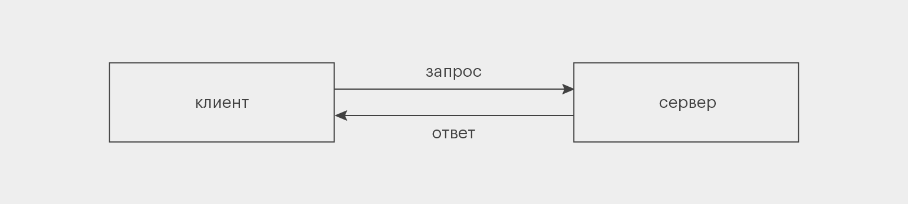
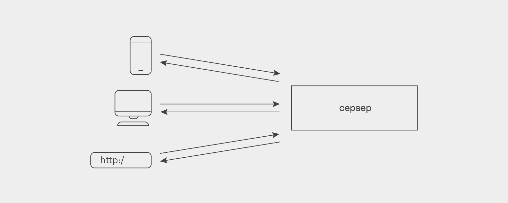
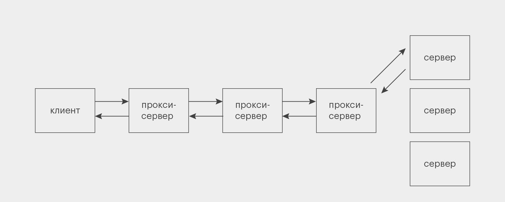

# Что такое REST API

#RestAPI #Express #API

Когда вы заходите на сайт, браузер отправляет запрос на сервер, получает от него ответ и выводит нужную страницу. Но у всех сайтов — разные серверы, информация на которых хранится по-разному.

Чтобы браузер понимал, что именно ему нужно запросить, а сервер — что ответить, используют API, или программные интерфейсы приложений. Если вы не знаете или не помните, что это такое и что такое архитектурные стили вообще, рекомендуем сначала прочитать [эту статью](https://skillbox.ru/media/code/chto_takoe_api/).

API могут быть разными. Самый востребованный из них — REST. О нём и пойдёт речь в этой статье.

## Что такое REST API

**REST API** — это архитектурный подход, который устанавливает ограничения для API: как они должны быть устроены и какие функции поддерживать. Это позволяет стандартизировать работу программных интерфейсов, сделать их более удобными и производительными.

Слово REST — акроним от Representational State Transfer, что переводится на русский как «передача состояния представления», «передача репрезентативного состояния» или «передача „самоописываемого“ состояния».

В отличие от, например, SOAP API, REST API — не протокол, а простой список рекомендаций, которым можно следовать или не следовать. Поэтому у него нет собственных методов. С другой стороны, его автор Рой Филдинг создал ещё и [протокол HTTP](https://skillbox.ru/media/code/chto-takoe-http-i-zachem-on-nuzhen/), так что они очень хорошо сочетаются, и REST обычно используют в связке с HTTP. Хотя новичкам нужно помнить: **REST — это не только HTTP, а HTTP — не только REST**.

Иногда, помимо акронима REST, можно встретить слово **RESTful**. Это не термин, но в сообществе его применяют к веб-сервисам, которые соответствуют REST-архитектуре. RESTful используют как прилагательное.

## Как работает REST API: 6 принципов архитектуры

Всего в REST есть шесть требований к проектированию API. Пять из них обязательные, одно — опциональное:

- Клиент-серверная модель (client-server model).
- Отсутствие состояния (statelessness).
- Кэширование (cacheability).
- Единообразие интерфейса (uniform interface).
- Многоуровневая система (layered system).
- Код по требованию (code on demand) — необязательно.

Чтобы разобраться в них подробнее, нужно понимать, что в вебе называют ресурсами. **Ресурсы** — это любые данные: текст, изображение, видео, аудио, целая программа. Например, [HTML веб-страницы](https://skillbox.ru/media/code/chto_takoe_html/), на которой вы сейчас находитесь, — тоже ресурс.

### Клиент-серверная модель

Это требование отделяет друг от друга два понятия: клиент и сервер.

**Сервер** — программа, в которой хранятся и обрабатываются ресурсы. Сервер может располагаться на одном или нескольких компьютерах; но даже в одном компьютере может быть несколько виртуальных серверов. Допустим, изначально HTML-код этой статьи хранился где-то на серверах Skillbox.

**Клиент** — программа, которая запрашивает у сервера доступ к ресурсам. Для этого она использует API. Когда ваш браузер запрашивает у сервера Skillbox эту веб-страницу, он выступает в роли клиента.

Получается структура, при которой клиент направляет к серверу запрос, а в ответ получает ресурсы. Такое разделение позволяет создавать клиент и сервер независимо друг от друга, что ускоряет и упрощает разработку.

_Изображение: Майя Мальгина для Skillbox Media_

Представим, что вы делаете сервис для учёта деловых переписок. Сами переписки хранятся на сервере, а доступ к ним можно получить из мобильного приложения. Оно не будет хранить никаких данных — только отправлять запросы на сервер, получать ответы и отображать их на экране смартфона.

Если вы когда-нибудь захотите полностью изменить логику работы сервера, то это никак не отразится на мобильном приложении. До тех пор, пока они понимают запросы и ответы друг друга, конечно.

А чтобы дать доступ к сервису из десктопного приложения и личного сайта, достаточно написать два новых клиента — а на сервере ничего менять не надо. Такая вот гибкость.

_Изображение: Майя Мальгина для Skillbox Media_

### Отсутствие состояния

Второй принцип настолько важен, что даже отражён в названии архитектурного стиля — **Representational State Transfer**. Это значит, что на сервере не хранится никаких данных о прошлых взаимодействиях с клиентом — каждый запрос должен содержать всю информацию для его обработки.

Например, кто-то запросил последнее сообщение от ООО «Рога и копыта». В этом запросе содержится вся информация, которая нужна серверу, чтобы дать корректный ответ.

Если клиент потом хочет получить предпоследнее сообщение, то он не может просто сказать: «Дай мне соседний ресурс» — ему нужно заново составить полный запрос по всем правилам.

Это снижает нагрузку на сервер, что особенно полезно, если к нему подключено одновременно много клиентов. Не нужно хранить дополнительную информацию о прошлых обращениях каждого из них. Достаточно обработать каждый запрос в отдельности.

Даже если какой-то из предыдущих запросов потеряется, это не сломает логику взаимодействия клиента и сервера, потому что каждый запрос самодостаточен.

### Кэширование

Иногда клиент запрашивает с сервера одни и те же данные по несколько раз — например, вы постоянно обращаетесь к какому-нибудь важному письму в сервисе для учёта деловых переписок.

Если при каждом таком запросе сервер будет с нуля собирать нужные данные и отправлять их клиенту, нагрузка на систему повысится — особенно когда таких повторов много. Решением проблемы в REST API стало **кэширование**, то есть сохранение части данных у клиента или на промежуточных серверах.

Однако тут тоже важно подойти к делу без излишнего фанатизма и не кэшировать всю информацию подряд. Во-первых, для этого потребовались бы слишком большие объёмы памяти. Во-вторых, какие-то данные (скажем, количество исходящих писем) со временем могут устаревать — зачем же держать этот неактуальный хлам в кэше? Именно поэтому в каждом ответе сервера на запрос есть пометка о том, можно ли его кэшировать.

### Единообразие интерфейса

Должен быть **единый способ обращения** к каждому ресурсу. Например, мы хотим добавить в наш сервис новую функциональность для просмотра данных о денежных переводах. Понятно, что логика интерфейса для обращения к ним должна быть такой же, как и для всего, что было в сервисе раньше.

Файлы обычно передаются клиенту не в том виде, в котором хранятся на сервере. В вебе их часто преобразуют в JSON или XML и только потом отправляют клиенту. Ответ на запросы к новому ресурсу должен приходить в том же формате, что и к старым, и сразу же содержать дополнительную информацию: что разрешается делать с ресурсом, можно ли его изменять и удалять на сервере и так далее.

Для реализации единообразного интерфейса в REST API используется принцип **HATEOAS** (Hypermedia as the Engine of Application State).

### Многоуровневая система

До сих пор мы рассматривали сервер как единую сущность. Но его структура куда сложнее. Между ним и клиентом есть несколько промежуточных узлов, выполняющих вспомогательные функции, — **прокси-серверы**.

Они используются для кэширования, обеспечения безопасности, дополнительной обработки данных. Если основных серверов несколько, то дополнительные серверы-балансировщики могут распределять нагрузку между ними и решать, в какой из них направлять запрос:

_Изображение: Майя Мальгина для Skillbox Media_

Никто из участников цепочки не знает всего пути, который проходит запрос, — только своих «соседей» справа и слева. Ни клиент, ни один из прокси-серверов не знает, к кому он обращается — к основному сервису или к другому прокси. В REST API это работает в обе стороны: никакие серверы (ни основные, ни прокси) не знают, кому отправляют ответ и уходит ли он куда-то дальше.

### Код по требованию (необязательно)

Этот принцип означает, что сервер в ответ на запрос может **отправить исходный код**, который выполняется уже на стороне клиента. Благодаря этому можно передавать целые сценарии. Например, динамические элементы пользовательского интерфейса, написанные на JavaScript.

В REST API требование необязательно, потому что не всем сайтам и сервисам нужно умение работать с готовыми скриптами.

## Методы REST API

Так как REST — архитектурный подход, а не протокол, в нём не заложено никаких конкретных методов. Но чаще всего его применяют вместе со стандартом **HTTP**, в котором заложены собственные методы.

Если кратко, то в HTTP прописан набор действий, который можно описать аббревиатурой **CRUD**: create — «создать», read — «прочитать», update — «обновить», delete — «удалить».

Для каждого такого действия существуют один или несколько глаголов — это и есть методы. Например, GET для чтения, а PUT и PATCH — для разных видов обновления. Глагол-метод применяется к URL-адресу нужного ресурса, который в «предложении» выполняет роль существительного.

Подробнее о работе протокола HTTP и его методов вы можете прочесть в [нашей статье](https://skillbox.ru/media/code/chto-takoe-http-i-zachem-on-nuzhen/).

## Для чего используют REST API

Архитектурный стиль REST — самый распространённый подход к проектированию API. Вот в каких случаях его применяют:

- пропускная способность соединения с сервером ограничена;
- нужно соединить мобильные приложения с серверными;
- проект разбит на микросервисы;
- сервис предоставляет свои возможности другим разработчикам;
- используется AJAX;
- известно, что систему нужно будет масштабировать.

## Итоги

Как мы видим, REST API не случайно стал таким популярным. Повторим основные его отличия:

- **REST — это архитектурный стиль API.** Он не ограничивается никакими протоколами и не имеет собственных методов. Но обычно в RESTful-сервисах используют стандарт HTTP, а файлы передают в формате JSON или XML.
- Есть **шесть принципов**, на которых строится REST: клиент-серверная модель, отсутствие состояния, кэширование, единообразие интерфейса, многоуровневая система, код по требованию. Последний из них необязателен.
- **REST-подход к архитектуре** позволяет сделать сервисы отказоустойчивыми, гибкими и производительными, а при их масштабировании и внесении изменений не возникает больших сложностей.
