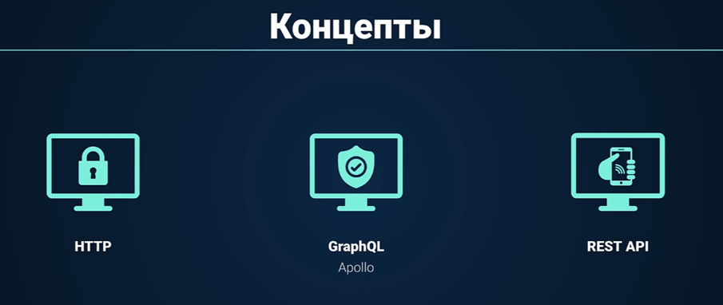

#GraphQL #RestAPI #HTTP #HTTPS

**GraphQL** позволяет настроить вызов только тех данных с фронтэнда, которые нам нужны в данный момент. **Rest** **API** позволяет настроить клиент-серверное взаимодействие. **HTTP/\***S\*\* – это протокол, с который желательно понимать для работы с интернет-приложениями

Материал:
[REST API](REST%20API.md)
