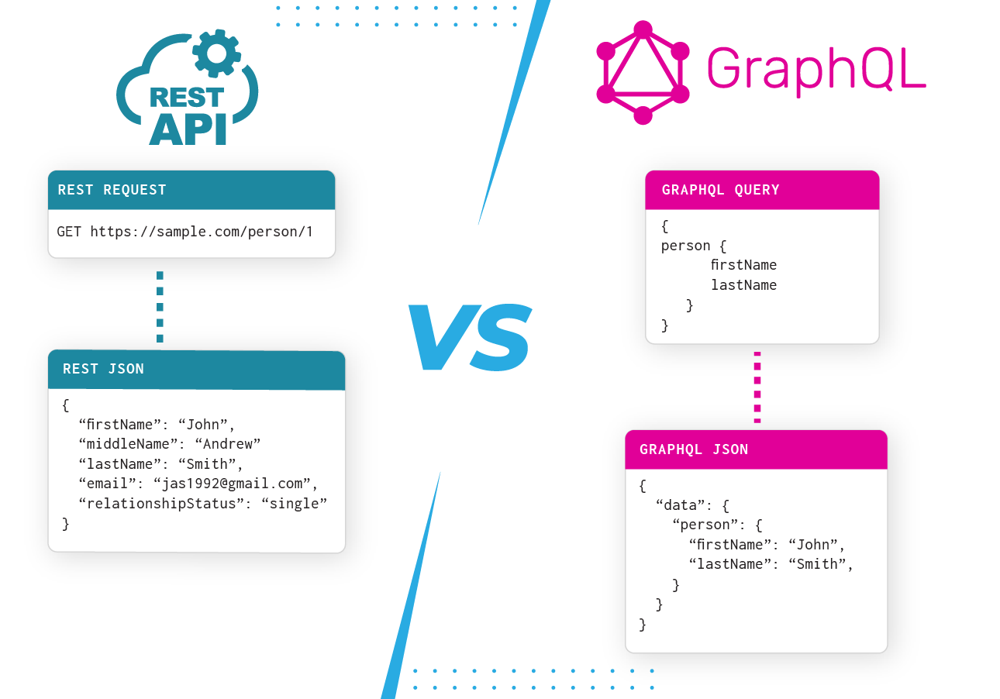
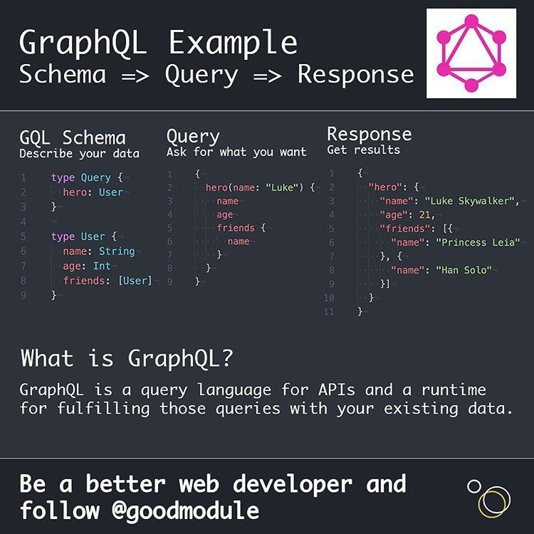
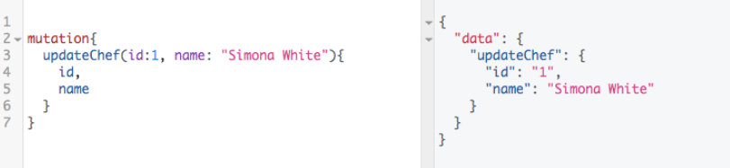

#GraphQL #Apollo

## Что такое GraphQL

GraphQL - это язык запросов для общения между клиентом и сервером. Он отличается от базового RestAPI полным указанием нужных полей, которые нам нужно вернуть с сервера.

Apollo - это платформа, которая позволяет удобно работать с GraphQL



## Виды запросов

Для осуществления запросов на сервер, нам потребуется написать:

- **Schema** - схема данных, которые находятся на сервере (грубо говоря - интерфейсы)
- **Query** - запрос на сервер, который вернёт определённые данные

И уже **response** - это сам ответ от сервера



**Mutation** уже позволяет какие-либо данные добавить, обновить или перезаписать (аналог `post`/`put` запросов)

Конкретно тут вызвана мутация, по которой мы отправляем на сервер `id` и `name` определённого персонажа и просим вернуть его `id` и `name`



И третий вид запросов - Subscription (подписки) - клиент слушает изменения в БД в режиме реального времени

```graphql
subscription StoryLikeSubscription($input: StoryLikeSubscribeInput) {
	storyLikeSubscribe(input: $input) {
		story {
			likers {
				count
			}
			likeSentence {
				text
			}
		}
	}
}
```

### Реализация

### Сервер

Устанавливаем зависимости

```bash
npm i express-graphql graphql
```

Далее нам нужно будет описать схему наших сущностей на сервере

Как выглядит описание сущностей:

- Мы описываем объекты User и Post (через `[Post]` указываем вложенность от другой сущности)
- Описываем возможные инпуты, которые придут к нам на сервер (через `!` указываем обязательность поля)
- Определяем мутации и запросы в схеме

`schema.js`

```JS
const {buildSchema} = require('graphql')

const schema = buildSchema(`

    type User {
        id: ID
        username: String
        age: Int
        posts: [Post]
    }
    type Post {
        id: ID
        title: String
        content: String
    }

    input UserInput {
        id: ID
        username: String!
        age: Int!
        posts: [PostInput]
    }
    input PostInput {
        id: ID
        title: String!
        content: String!
    }

    type Query {
        getAllUsers: [User]
        getUser(id: ID): User
    }
    type Mutation {
        createUser(input: UserInput): User
    }

`)

module.exports = schema
```

Затем реализовать сервер, на котором у нас будет эндпоинт с graphql

В него нам нужно будет передать rootValue (методы, которые будут работать с описанными запросами GraphQL) и нашу схему

`index.js`

```JS
const express = require('express')
const {graphqlHTTP} = require('express-graphql')
const cors = require('cors')
const schema = require('./schema')

const users = [{id: 1, username: "Vasya", age: 25}]

const app = express()
app.use(cors())

const createUser = (input) => {
    const id = Date.now()
    return {
        id, ...input
    }
}
const root = {
    getAllUsers: () => {
        return users
    },
    getUser: ({id}) => {
        return users.find(user => user.id == id)
    },
    createUser: ({input}) => {
        const user = createUser(input)
        users.push(user)
        return user
    }
}


app.use('/graphql', graphqlHTTP({
    graphiql: true,
    schema,
    rootValue: root
}))

app.listen(5000, () => console.log('server started on port 5000'))
```

### Клиент

Устанавливаем граф и клиент аполло для более удобного взаимодействия с сервером

```bash
npm i graphql @apollo/client
```

Тут мы уже должны использовать Apollo клиент, который будет общаться с graphql сервером, кэшировать и провайдить данные

`index.js`

```JS
import React from 'react';
import ReactDOM from 'react-dom';
import App from './App';
import { ApolloProvider, ApolloClient, InMemoryCache } from '@apollo/client'

const client = new ApolloClient({
    uri: 'http://localhost:5000/graphql',
    cache: new InMemoryCache()
})

ReactDOM.render(
    <ApolloProvider client={client}>
        <App />
    </ApolloProvider>,
  document.getElementById('root')
);
```

Опишем схемы для запросов данных

`query / user.js`

```JS
import {gql} from '@apollo/client'

export const GET_ALL_USERS = gql`
    query {
        getAllUsers {
            id, username, age
        }
    }

`

export const GET_ONE_USER = gql`
    query getUser($id: ID){
        getUser(id: $id) {
            id, username
        }
    }

`
```

Опишем схемы для изменения данных

`mutations / user.js`

```JS
import {gql} from '@apollo/client'

export const CREATE_USER = gql`
    mutation createUser($input: UserInput) {
        createUser(input: $input) {
            id, username, age
        }
    }
`
```

И далее используем клиент на нашем вебе

Для отправки запросов мы должны воспользоваться хуками:

- useQuery, в который мы первым аргументом передаём схему запроса, а вторым пропсы
- useMutation, в который мы передаём наши мутации и на выходе получаем функцию-триггер запроса

`App.js`

```JSX
import React, {useEffect, useState} from 'react';
import './App.css'
import {useMutation, useQuery} from "@apollo/client";
import {GET_ALL_USERS, GET_ONE_USER} from "./query/user";
import {CREATE_USER} from "./mutations/user";

const App = () => {
    const [users, setUsers] = useState([])
    const [username, setUsername] = useState('')
    const [age, setAge] = useState(0)

    const {data, loading, error, refetch} = useQuery(GET_ALL_USERS)
    const {data:oneUser, loading: loadingOneUser} = useQuery(GET_ONE_USER, {
        variables: {
            id: 1
        }
    })
    const [newUser] = useMutation(CREATE_USER)

    console.log(oneUser)

    useEffect(() => {
        if (!loading) {
            setUsers(data.getAllUsers)
        }
    }, [data])

    const addUser = (e) => {
        e.preventDefault()
        newUser({
            variables: {
                input: {
                    username, age
                }
            }
        }).then(({data}) => {
            console.log(data)
            setUsername('')
            setAge(0)
        })
    }
    const getAll = e => {
        e.preventDefault()
        refetch()
    }

    if (loading) {
        return <h1>Loading...</h1>
    }

    return (
        <div>
            <form>
                <input value={username} onChange={e => setUsername(e.target.value)} type="text"/>
                <input value={age} onChange={e => setAge(e.target.value)} type="number"/>
                <div className="btns">
                    <button onClick={(e) => addUser(e)}>Создать</button>
                    <button onClick={e => getAll(e)}>Получить</button>
                </div>
            </form>
            <div>
                {users.map(user =>
                    <div className="user">{user.id}. {user.username} {user.age}</div>
                )}
            </div>
        </div>
    );
};

export default App;
```
