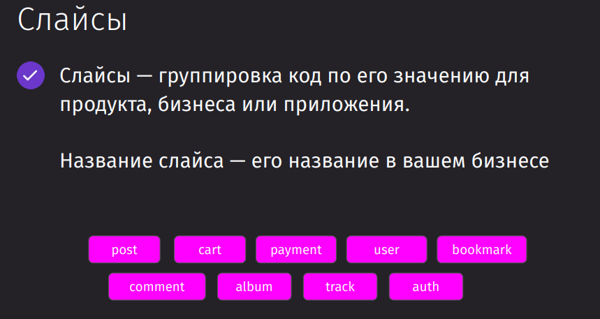
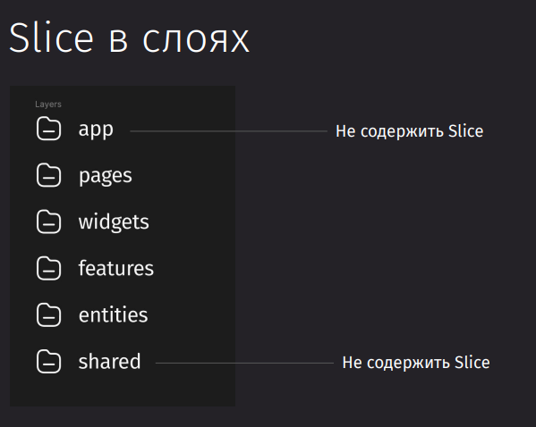
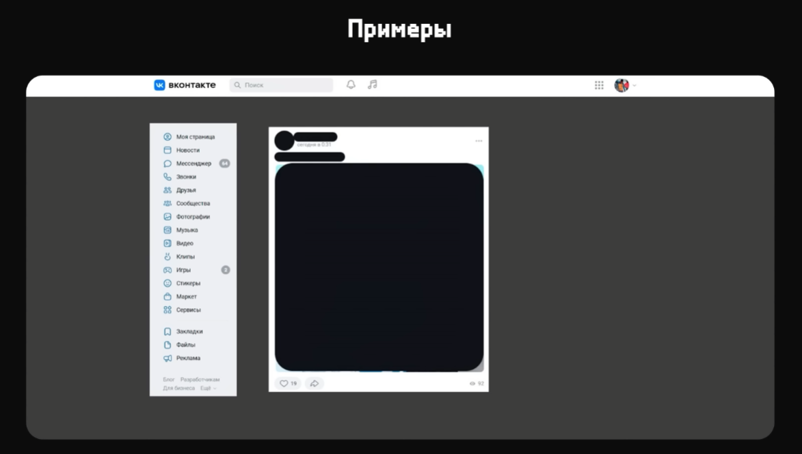

## Введение

Feature Slice Design — архитектурная методология для проектирования фронт-энд приложений

Является набором правил и соглашений для организации кода.

Этот подход очень удобен, так как призван: 
- позволять легко масштабировать проект
- повысить качество кода
- упростить поддержку и погружение в код новых разработчиков
- коннектить код и бизнес-логику

Важным отличием от других подходов является то, что мы отталкиваемся не от вида или назначения компонента, а от доменной области, в рамках которой мы решаем проблемы.

В отличие от классического подхода, когда мы организуем код как: `components`, `pages`, `views`, `hooks` - тут мы применяем фиксированный набор слоёв (app, process, pages, widgets, features, entities, shared), поделённых на сегменты. Сегменты включают три уровня: слои (layers), слайсы (slices) и сегменты (segments). 

## Окружение

## Введение в FSD

FSD позволяет следовать всем канонам ООП за счёт своей структуры. 
Public API предоставляет доступ только к нужным файлам из нашей целевой папки

### Layers

1. `shared` — переиспользуемый код, не имеющий отношения к специфике приложения/бизнеса.(например, UIKit, libs, API)
2. `entities` (сущности) — бизнес-сущности.(например, User, Product, Order)
3. `features` (фичи) — взаимодействия с пользователем, действия, которые несут бизнес-ценность для пользователя.(например, SendComment, AddToCart, UsersSearch)
4. `widgets` (виджеты) — композиционный слой для соединения сущностей и фич в самостоятельные блоки(например, IssuesList, UserProfile).
5. `pages` (страницы) — композиционный слой для сборки полноценных страниц из сущностей, фич и виджетов.
6. `processes` (процессы, устаревший слой) — сложные сценарии, покрывающие несколько страниц.(например, авторизация)
7. `app` — настройки, стили и провайдеры для всего приложения.

Модули на одном слое могут взаимодействовать лишь с модулями, находящимися на слоях строго ниже.

### Slices

### Segments

Сегменты группируют код по его назначению
Название сегмента — описание кода, который там лежит

## Pages и App

В идеале, она должна состоять просто из виджетов, которые уже в своих рамках реализуют нужную функциональность для пользователя

Слой приложения хранит в себе чисто все нужные компоненты, которые отвечают за entry-point или входную точку приложения

### О слое App
### Старт проекта
### Подготовка слоя App
### Обзор проекта
### О слое Pages
### Структура роутинга
### Выделение slice
### Создание первой страницы
### Добавление стилей
### Layout

## Shared

Shared вмещает в себя весь переиспользуемый контент по приложению. В него стоит поместить конфиги, инстансы API, ассеты, утилиты, хуки, константы и разного вида кнопки, инпуты, свитчеры в ui

## Инструменты FSD

## Entities

## Features

Фича - это отдельная функциональность, которая приводит к определённому результату (кнопка, которая получает состояние подписки и позволяет отписаться или подписаться, лайк/убрать лайк, дизлайк/убрать дизлайк, тугглер темы или свитчер языка) 

Он так же может хранить те же самые сегменты, что и остальные модули

## Widgets

Они представляют собой отдельные части страницы - хедер, футер, сайдбар, отдельный пост

## Работа с фреймворками
### Next
### Vue
### Nuxt
### Angular
### Sveltekit

## Примечания

Так выглядит структура папок уже у конкретной сущности 
Она хранит свои компоненты, константы, хелперы, которые нужны только ей и отдаёт наружу только компоненты, которые могут пригодиться в слоях выше
Мапперы подготавливают данные для отправки на сервер или для вывод на фронтенде

Как можно определить, к какому слою должен относиться компонент?

А тут уже располагаются примеры тех компонентов, которые могут находиться в определённых слоях:
- shared - переиспользуемые отдельные блоки, которые мы можем вынести в другое приложение
- entity - общий компонент пост, который подходит под посты пользователей, групп и который имеет место под текст, фавиконку и не имеет фичей (тех же лайков и пересылки сообщений), потому что они могут отличаться по реализации в зависимости от разных постов
- features - бизнес-действия пользователя - лайк, репост, удалить, изменить комментарий, добавить его
- widgets - блок с соединённой сущностью и фичёй
- pages - цельная страница, которая должна состоять из виджетов

