---
tags:
  - "#MVP"
  - "#MVC"
  - "#MVVM"
description: MV-подобные паттерны
---

>[!info] Основная суть MV-образных паттернов заключается в разделении бизнес-логики от интерфейса.

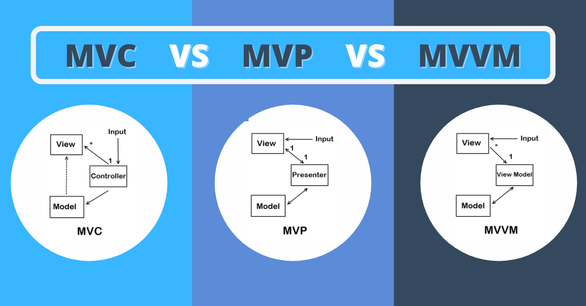

## MVC

### Что такое MVC

Представим такую ситуацию, что у нас есть приложение, которому нужно будет заменить интерфейс и сохранить как прошлое, так и новое отображение интерфейса. Но до этого мы реализовывали приложение в полной связности с бизнес-логикой. То есть BL находится прямо внутри UI и неразрывно с ним связана.

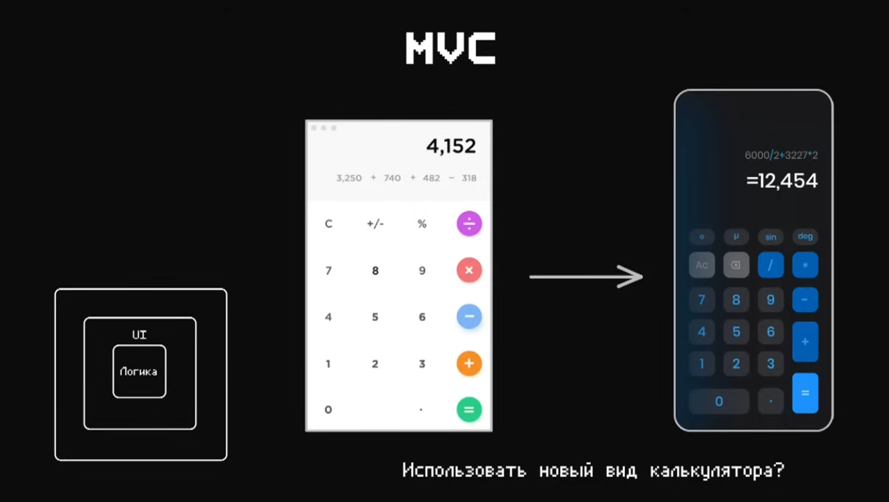

MVC же подразумевает то, что мы заранее выделили логику подсчёта всех значений (cos, sin, pow) в отедльной сущности (aka ==model==), а уже будем вызывать эту логику из самого интерфейса (aca ==view==) через связующее звено (aka ==controller==) 

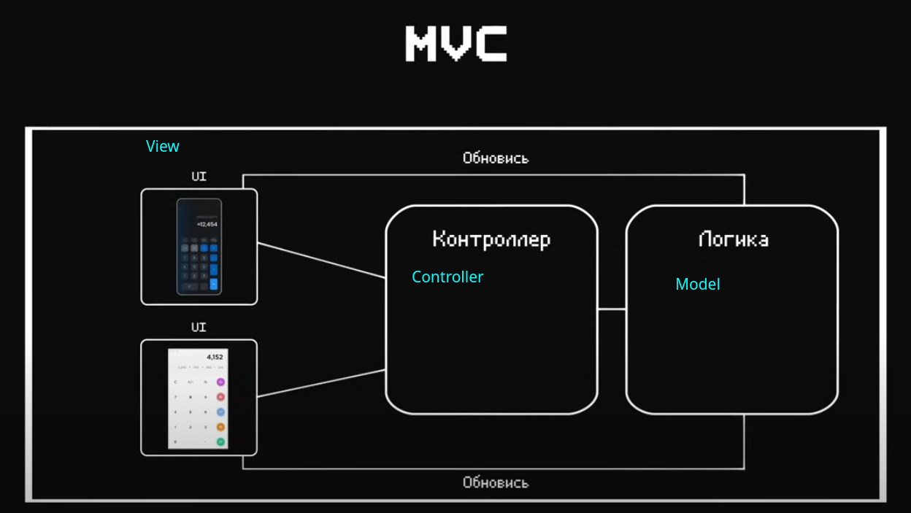

Если приводить пример из реальной жизни, то когда мы взаимодействуем с банком, то обращение идёт не напрямую с деньгами, а через определённых посредников.

- View - сотрудник банка или банкомат, через который мы делаем определённые запросы на операции в банке
- Controller - посредник для банкомата или сотрудника банка, через которых они отправляют запросы на выполнение операций 
	- банкомат вызывает заранее подгтовленные функции по выполнению операций над нашим счётом
	- работник обращается к корпоративному приложению для выполнения операции
- Model - внутреннее устройство банка, которое выполняет все операции над счётом клиента 

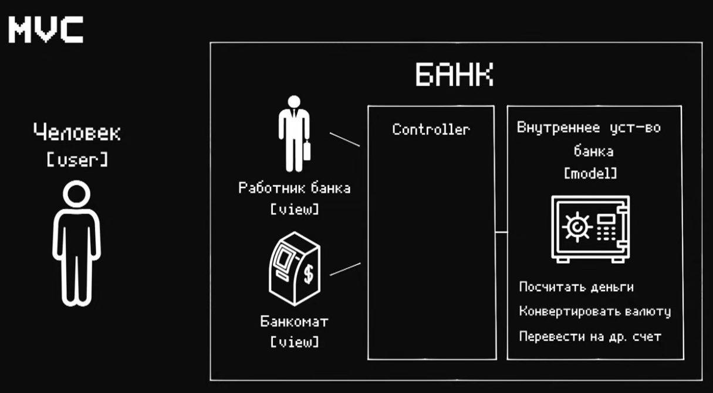
 
MVC подход используется у нас на любом этапе приложения. Начиная от клиент-серверного взаимодействия и бэкэнда, заканчивая архитектурой приложения на клиенте (web, мобильного, декстопного)

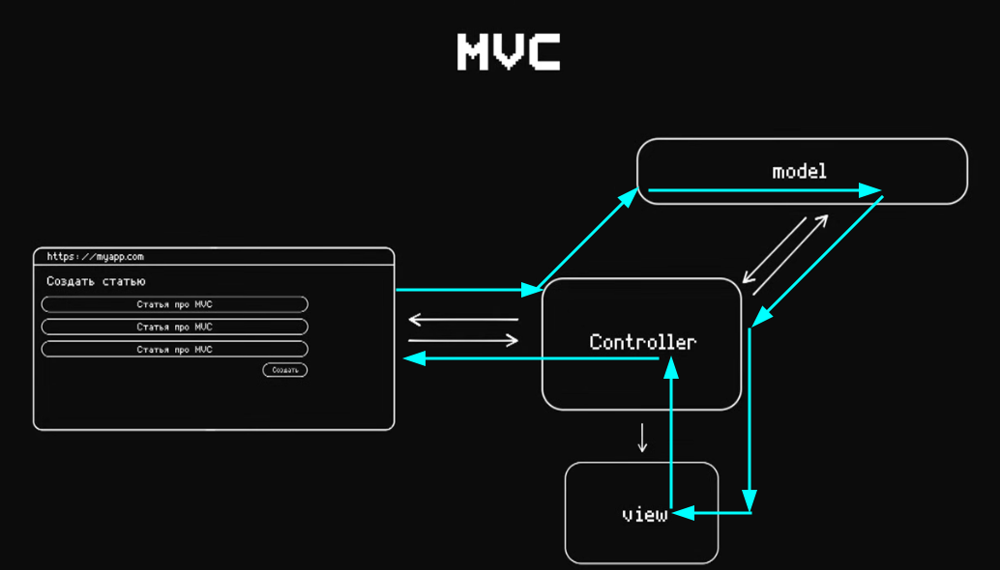

### Пример MVC на NodeJS

Реализуем приложение на Express и шаблонизаторе HandleBars

```bash
bun install express hbs nodemon
```

Первое, что мы сделаем - это во view напишем логику отображения в шаблонизаторе.

`view / user.hbs`
```html
<!DOCTYPE html>
<html>
<head>
    <title>Пользователи</title>
    <meta charset="utf-8" />
</head>
<body>
<h1>Создать нового пользователя</h1>
<form action="/users/create" method="POST">
    <label>Имя</label>
    <input name="username" /><br><br>
    <label>Возраст</label>
    <input name="age" type="number" min="1" max="110" /><br><br>
    <input type="submit" value="Отправить" />
</form>
<h1>Список пользователей</h1>
{{#each users}}
    <div style="border: 1px solid green; padding: 15px">
        <h3>Username - {{this.username}}</h3>
        <p>Возраст - {{this.age}}</p>
        <button onclick="removeById({{this.id}})">
            Удалить
        </button>
    </div>
{{/each}}
<script>
    function removeById(id)  {
        fetch(`http://localhost:5000/users/remove?id=${id}`, {
            method: 'DELETE'
        }).then(() => window.location.reload())
    }
</script>
</body>
<html>
```

`view / user-error.hbs`
```HTML
<!DOCTYPE html>
<html>
<head>
    <title>Пользователи</title>
    <meta charset="utf-8" />
</head>
<body>
<h1>Произошла ошибка. {{message}}</h1>
<a href="/users">Вернуться на страницу пользователей</a>
</body>
<html>
```

Далее нам нужно будет описать модель пользователя, в которой находится интерфейс этого пользователя и прямые методы для работы с ним. Тут находится только логика работы с пользователем.

`domain / user / model.js`
```JS
// aka DB
let users = [
    { id: '1', username: 'Ulbi TV', age: 23 }
]

// Методы для работы конкретно с пользователем
module.exports = {
	// создаём пользователя
    create: ({ username, age }) => {
        const newUser = {
            username,
            age,
            id: String(Date.now())
        }

        if(!users.find(user => user.username === users)) {
            users.push(newUser)
        } else {
            throw new Error('Пользователь уже существует')
        }

        return newUser;
    },
    // удаление по ID
    removeById: ({ id }) => {
        const userIndex = users.findIndex(user => user.id === String(id));

        if(userIndex === -1) {
            throw new Error('Пользователь не найден')
        }

        users.splice(userIndex, 1);

        return id;
    },
    // удаление по имени пользователя
    removeByUsername: ({ id }) => {},
    // Получаем всех
    getAll: () => {
        return users;
    },
    // получаем по ID
    getById: ({id}) => {
        return users.find(user => user.id === id);
    },
}
```

Далее опишем контроллер для работы с моделью. Он будет давать нам контролируемую обёртку над моделью, в которой будут находиться все проверки и взаимодействие с внешним миром.

`domain / user / controller.js`
```JS
// использует в себе модель
const userModel = require('./model');

/**
 * все методы контроллера принимают в себя Reqest и Response
 * Так как он работает непосредственно с запросами
 */
module.exports = {
	// получение всех пользователей
    getAll: (req, res) => {
        return res.render('users.hbs', {
            users: userModel.getAll()
        })
    },
    // создание пользователей с валидацией и проверкой
    create: (req, res) => {
        try {
            const { age, username} = req.body;

            if(!age || !username) {
                throw new Error('Не указан username или возраст');
            }

            userModel.create({ age, username })

            return res.redirect('/users')
        } catch (e) {
            return res.render('users-error.hbs', {
                message: e.message
            });
        }

    },
    // удаление пользователя с валидацией и проверкой
    removeById: (req, res) => {
        try {
            const id = req.query.id;

            if(!id) {
                throw new Error('id не указан');
            }

            userModel.removeById({ id })

            res.render('users-view.hbs', {
                users: userModel.getAll()
            })
        } catch (e) {
            return res.render('users-error.hbs', {
                message: e.message
            });
        }
    }
}
```

Ну и так же мы можем реализовать множество различных способов взаимодействия с нашей моделью. Модель просто является источником истины, которую можно провайдить различными способами через наш контроллер: с помощью [REST API](../../edge/Клиент-сервер/REST%20API.md), [SOAP](../../edge/Клиент-сервер/SOAP.md) или того же [GraphQL](../../edge/Клиент-сервер/Apollo%20+%20GraphQL.md)

`domain / user / rest-controller.js`
```JS
const userModel = require('./model');

module.exports = {
    getAll: (req, res) => {
        return res.json(userModel.getAll())
    },
}
```

`domain / user / soap-controller.js`
```JS
const userModel = require('./model');

module.exports = {
    getAll: (req, res) => {
        const xmlUsers = XML.parse(userModel.getAll());
        return res.send(xmlUsers);
    },
}
```

Ну и далее нам остаётся только поднять сервер

`server.js`
```TS
const express = require('express')
const path = require('path');
const userController = require('./domain/users/controller')

const PORT = 5000;

const app = express();

// добавляем поддержку hbs
app.set("view engine", "hbs");
app.set('views', path.resolve(__dirname, 'views'));
app.use(express.urlencoded({ extended: false }));

// подцепляем контроллер под роуты
app.get('/users', userController.getAll)
app.post('/users/create', userController.create)
app.delete('/users/remove', userController.removeById)

// вызываем сервер
app.listen(PORT,() => console.log('server started on PORT = ' + PORT))
```

### Пример клиентского приложения с MVC

Корневой HTML, в который подключаются скрипты

`index.html`
```HTML
<!DOCTYPE html>
<html lang="en">
  <head>
    <meta charset="UTF-8" />
    <link rel="icon" type="image/svg+xml" href="/vite.svg" />
    <meta name="viewport" content="width=device-width, initial-scale=1.0" />
    <title>Vite + TS</title>
  </head>
  <body>
    <div id="counter1"></div>
    <div id="counter2"></div>
    <div id="counter3"></div>
    <div id="users"></div>
    <script type="module" src="/src/main.ts"></script>
  </body>
</html>
```

Описываем интерфейсы для View, Model, Controller

`types / controller.ts`
```TS
import {Model} from "./model";

export interface Controller {
    model: Model;
}
```

`types / model.ts`
```TS
export interface Model {}
```

`types / view.ts`
```TS
import {Controller} from "./controller";

export interface View {
    mount: () => void;
    controller: Controller;
}
```

#### Общение через контроллер

Первый модуль у нас будет общаться по стандартной схеме, когда все потоки данных между View и Model контролирует Controller

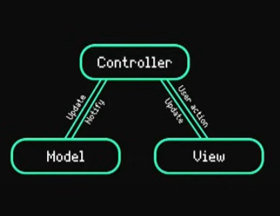

Вот сама модель счётчика

`modules / counterTwo / CounterTwoModel.ts`
```TS
import {Model} from "../../types/model";

export class CounterTwoModel implements Model {
    value: number;

    constructor() {
        this.value = 0;
    }

    increment() {
        this.value += 1;
        return this.value;
    }

    decrement() {
        this.value -= 1;
        return this.value;
    }

    multipleAndDivide() {
        this.value *= 5;
        this.value /= 3;
        this.value = Math.ceil(this.value);
        return this.value;
    }
}
```

Тут уже находится контроллер, который дёргает запросы из модели

`modules / counterTwo / CounterTwoController.ts`
```TS
import {CounterTwoModel} from "./CounterTwoModel";
import {Controller} from "../../types/controller";

export class CounterTwoController implements Controller {
    model: CounterTwoModel;

    constructor() {
        this.model = new CounterTwoModel();
    }

    handleIncrement() {
        console.log('increment', this.model)
        return this.model.increment();
    }

    handleDecrement() {
        console.log('handleDecrement')
        return this.model.decrement();
    }

    handleMultiply() {
        console.log('handleMultiply')
        return this.model.multipleAndDivide();
    }
}
```

А тут уже во View мы вызываем только методы контроллера

`modules / counterTwo / CounterTwoView.ts`
```TS
import {CounterTwoController} from "./CounterTwoController";
import {View} from '../../types/view'

export class CounterTwoView implements View {
    controller: CounterTwoController;
    root: HTMLElement;

    private title: HTMLElement;
    private incrementButton: HTMLElement;
    private decrementButton: HTMLElement;
    private multipleButton: HTMLElement;

    constructor(root: HTMLElement) {
        this.root = root;
        this.controller = new CounterTwoController();

        this.title = document.createElement('h1');
        this.title.innerText = 'Value = 0';

        this.incrementButton = document.createElement('button');
        this.incrementButton.innerText = 'increment';
        this.decrementButton = document.createElement('button');
        this.decrementButton.innerText = 'decrement';
        this.multipleButton = document.createElement('button');
        this.multipleButton.innerText = 'multiply';

        this.bindListeners();
    }

    private onIncrementClick = () => {
        this.updateTitle(this.controller.handleIncrement())
    }

    private onDecrementClick = () => {
        this.updateTitle(this.controller.handleDecrement())
    }

    private onMultiplyClick = () => {
        this.updateTitle(this.controller.handleMultiply())
    }

    private bindListeners() {
        this.incrementButton.addEventListener('click', this.onIncrementClick);
        this.decrementButton.addEventListener('click', this.onDecrementClick);
        this.multipleButton.addEventListener('click', this.onMultiplyClick);
    }

    public updateTitle(value: number) {
        this.title.innerText = `Value = ${value}`;
    }

    public mount() {
        this.root.appendChild(this.title);
        this.root.appendChild(this.incrementButton);
        this.root.appendChild(this.decrementButton);
        this.root.appendChild(this.multipleButton);
    }
}
```

#### Общение по кругу

В этом примере Controller отдаёт данные из Model во View, а View, в свою очередь, передаёт данные напрямую в Model

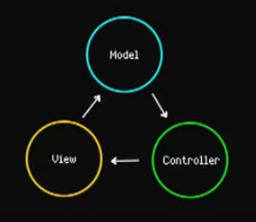

Это модель счётчика. Она уже заранее знает про существование View и уже работает непосредственно с данными, которые находятся внутри View.

Основной особенностью тут является то, что Model изменяет данные внутри себя и уведомляет View о том, что эти данные изменились. 

`modules / counter / CounterModel.ts`
```TS
import {CounterView} from "./CounterView";

export class CounterModel {
    view: CounterView;
    value: number;

    constructor(view: CounterView) {
        this.value = 0;
        this.view = view;
    }

    increment() {
        this.value += 1;
        this.view.updateTitle()
    }

    decrement() {
        this.value -= 1;
        this.view.updateTitle()
    }

    multipleAndDivide() {
        this.value *= 5;
        this.value /= 3;
        this.value = Math.ceil(this.value);
        this.view.updateTitle()
    }
}
```

Это контроллер, который оборачивает в себе логику модели. Он принимает в себя модель и вызывает напрямую его методы

`modules / counter / CounterController.ts`
```TS
import {CounterModel} from "./CounterModel";

export class CounterController {
    model: CounterModel;

    constructor(model: CounterModel) {
        this.model = model
    }

    handleIncrement() {
        console.log('increment', this.model)
        this.model.increment();
    }

    handleDecrement() {
        console.log('handleDecrement')
        this.model.decrement();
    }

    handleMultiply() {
        console.log('handleMultiply')
        this.model.multipleAndDivide();
    }
}
```

Это View, в котором мы передаём методы Model в Controller

`modules / counter / CounterView.ts`
```TS
import {CounterController} from "./CounterController";
import {CounterModel} from "./CounterModel";

export class CounterView {
    controller: CounterController;
    model: CounterModel;
    root: HTMLElement;

    private title: HTMLElement;
    private incrementButton: HTMLElement;
    private decrementButton: HTMLElement;
    private multipleButton: HTMLElement;

    constructor(root: HTMLElement) {
        this.root = root;
        this.model = new CounterModel(this);
        this.controller = new CounterController(this.model);

        this.title = document.createElement('h1');
        this.title.innerText = 'Value = 0';

        this.incrementButton = document.createElement('button');
        this.incrementButton.innerText = 'increment';
        this.decrementButton = document.createElement('button');
        this.decrementButton.innerText = 'decrement';
        this.multipleButton = document.createElement('button');
        this.multipleButton.innerText = 'multiply';

        this.bindListeners();
    }

    private bindListeners() {
        this.incrementButton.addEventListener('click', this.controller.handleIncrement.bind(this));
        this.decrementButton.addEventListener('click', this.controller.handleDecrement.bind(this));
        this.multipleButton.addEventListener('click', this.controller.handleMultiply.bind(this));
    }

    public updateTitle() {
        this.title.innerText = `Value = ${this.model.value}`;
    }

    public render() {
        this.root.appendChild(this.title);
        this.root.appendChild(this.incrementButton);
        this.root.appendChild(this.decrementButton);
        this.root.appendChild(this.multipleButton);
    }
}
```

#### Общение View и Controller с Model

Далее опишем модель, где и View, и Controller общаются с Model напрямую

Тут мы уже делаем максимально валидный пример, когда в Controller мы передаём Model, а во View Controller. По такой регрессии мы реализуем полностью заменяемые модули, которые должны соответствовать просто по интерфейсам для взаимного переиспользования.

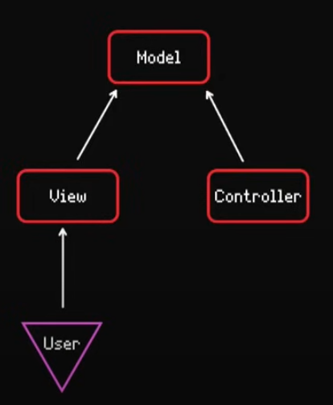

Далее опишем модель пользователя, внутри которой будет логика работы с пользователем и фильтрации списка пользователей

`modules / user / UserModel.ts`
```TS
import {delay} from "../../helpers";

export interface User {
    id: string;
    username: string;
    age: number;
    createdAt: string;
}

export type SortOrder = 'asc' | 'desc';
export type SortField = 'age' | 'username';

export class UsersModel {
    users: User[];
    searchValue: string;
    sortOrder: SortOrder;
    sortField: SortField;

    constructor() {
        this.users = [];
        this.searchValue = '';
        this.sortOrder = 'asc';
        this.sortField = 'username';
    }

	// запрос пользователей с aka сервера
    async fetchUsers(): Promise<User[]> {
        try {

            return this.users;
        } catch (e) {
            this.users = [];
            return [];
        }
    }

	// создание пользователей
    createUser(username: string, age: number) {
        if(this.users.find(user => user.username === username)) {
            throw Error('Пользователь уже существует')
        }

        const newUser: User = {
            id: String(Math.random()),
            username,
            age,
            createdAt: Date.now().toString(),
        }

        this.users.push(newUser)
        return newUser;
    }

	// сортировка пользователей
    sortUsers(field: SortField, order: SortOrder) {
        const sortedUsers = [...this.users.sort((a, b) => {
            if(order === "asc") {
                return a[field] > b[field] ? 1 : -1;
            }
            return a[field] < b[field] ? 1 : -1;
        })]

        this.users = sortedUsers;

        return sortedUsers;
    }
}
```

Контроллер же оборачивает логику модели и предоставляет её нашей вюшке

`modules / user / UserController.ts`
```TS
import {SortField, SortOrder, UsersModel} from "./UsersModel";

export class UsersController {
    model: UsersModel;

    constructor(model: UsersModel) {
        this.model = model
    }

	// создание пользователя
    public handleCreate(username: string, age: number) {
        console.log('handleCreate')
        if(!username || !age) {
            throw Error('Укажите username и age');
        }
        return this.model.createUser(username, age);
    }

	// сортировка пользователя
    public handleSort(field: SortField, order: SortOrder) {
        console.log('handleSort')
        if(!field) {
            throw Error('Укажите поле сортировки');
        }
        return this.model.sortUsers(field, order);
    }
}
```

А тут уже находится логика View, которая в себе использует контроллер и методы из модели пользователя.

- через контроллер мы получаем актуальные значения из модели
- через методы модели мы заносим новые значения

`modules / user / UserView.ts`
```TS
import {UsersController} from "./usersController";
import {SortField, SortOrder, User} from "./UsersModel";
import './user.css';

export class UsersView {
    controller: UsersController;
    root: HTMLElement;

    private form: HTMLDivElement;
    private users: HTMLElement;
    private usernameInput: HTMLInputElement;
    private ageInput: HTMLInputElement;
    private createButton: HTMLButtonElement;

    private sortSelectors: HTMLDivElement;
    private fieldSelect: HTMLSelectElement;
    private orderSelect: HTMLSelectElement;
    private sortButton: HTMLButtonElement;

    constructor(root: HTMLElement, controller: UsersController) {
        this.root = root;
        this.controller = controller;


        this.createUserForm()
        this.createSortSelectors()
        this.createUsersList();

        this.bindListeners();

    }

    private onCreateClick = () => {
        try {
            const newUser = this.controller.handleCreate(this.usernameInput.value, Number(this.ageInput.value))
            this.renderNewUser(newUser);
        } catch (e) {
            this.showError((e as Error).message)
        }
    }

    private onSortClick = () => {
        const newUsers = this.controller.handleSort(this.fieldSelect.value as SortField, this.orderSelect.value as SortOrder)
        this.renderUsers(newUsers);
    }

    private bindListeners() {
        this.createButton.addEventListener('click', this.onCreateClick)
        this.sortButton.addEventListener('click', this.onSortClick)
    }

    private showError(message: string) {
       alert(message);
    }

    private getUserElement(user: User) {
        return `
                 <div class="user">
                    <h3>Username = ${user.username}</h3>
                    <h5>Age = ${user.age}</h5>
                </div>
            `
    }

    private renderNewUser(user: User) {
        const userNode = document.createElement('div');
        userNode.innerHTML = this.getUserElement(user);

        this.users.appendChild(userNode)
    }

    private renderUsers(users: User[]) {
        const usersElements = users.map(user => {
            return this.getUserElement(user);
        })

        this.users.innerHTML = usersElements.join('')
    }

    private createUsersList() {
        this.users = document.createElement('div');
    }

    private createSortSelectors() {
        this.sortSelectors = document.createElement('div');

        this.fieldSelect = document.createElement('select');
        const usernameOption = document.createElement('option');
        usernameOption.value = 'username';
        usernameOption.innerText = 'Имя пользователя';
        const ageOption = document.createElement('option');
        ageOption.value = 'age';
        ageOption.innerText = 'Возраст';

        this.fieldSelect.add(usernameOption);
        this.fieldSelect.add(ageOption);

        this.orderSelect = document.createElement('select');
        const ascOption = document.createElement('option');
        ascOption.value = 'asc';
        ascOption.innerText = 'По возрастанию';
        const descOption = document.createElement('option');
        descOption.value = 'desc';
        descOption.innerText = 'по убыванию';

        this.orderSelect.add(ascOption);
        this.orderSelect.add(descOption);

        this.sortButton = document.createElement('button');
        this.sortButton.innerText = 'сортировать';

        this.sortSelectors.appendChild(this.fieldSelect)
        this.sortSelectors.appendChild(this.orderSelect)
        this.sortSelectors.appendChild(this.sortButton)
    }

    private createUserForm() {
        this.form = document.createElement('div');
        this.usernameInput = document.createElement('input');
        this.usernameInput.placeholder = 'Введите имя пользователя'
        this.ageInput = document.createElement('input');
        this.ageInput.placeholder = 'Введите возраст'
        this.createButton = document.createElement('button');
        this.createButton.innerText = 'Создать'
        this.form.appendChild(this.usernameInput)
        this.form.appendChild(this.ageInput)
        this.form.appendChild(this.createButton)
    }

    public mount() {
        this.root.innerHTML = `
            <h1>Пользователи</h1>
        `
        this.root.appendChild(this.sortSelectors)
        this.root.appendChild(this.form)
        this.root.appendChild(this.users)
    }
}
```

Тут мы уже собираем наше приложение со всеми моделями и контроллерами. Основной метод `mount()` в каждом из них монтирует View на странице

`mount.ts`
```TS
import {CounterTwoView} from "./modules/counterTwo/CounterTwoView";
import {UsersView} from "./modules/users/UsersView";
import {UsersController} from "./modules/users/usersController";
import {UsersModel} from "./modules/users/UsersModel";

const counterView = new CounterTwoView(document.getElementById('counter1')!)

counterView.mount();

const usersModel = new UsersModel();
const usersController = new UsersController(usersModel)
const usersView = new UsersView(
    document.getElementById('users')!,
    usersController
)

usersView.mount();
```

### Итог

MVC представляет из себя подход, в котором мы делим бизнес-логику и представление. Это деление позволяет нам легко заменять разные части приложения друг другом.

- Модель - является единственным источником истины для приложения
- Контроллер - является интерфейсом, которым пользуется представление, для обработки и передачи данных в модель
- Представление - это непосредственно логика интерфейса пользователя, которая пользуется контроллером.
## MVVM

Этот паттерн применим только к графическим интерфейсам

Тут у нас появляется сущность ViewModel вместо Controller

То есть такой подход говорит нам связывать данные напрямую из view с model с помощью двустороннего связывания (как v-bind во Vue или банан в коробке `[()]` Angular)

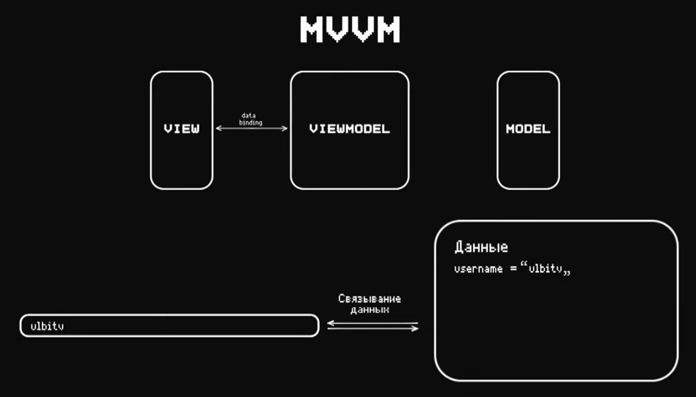

И последовательность в таком приложении достаточно короткая - связываем данные из View с ViewModel, где VM общается по обновлению и уведомлению с Model, чтобы связанные данные обновили интерфейс View

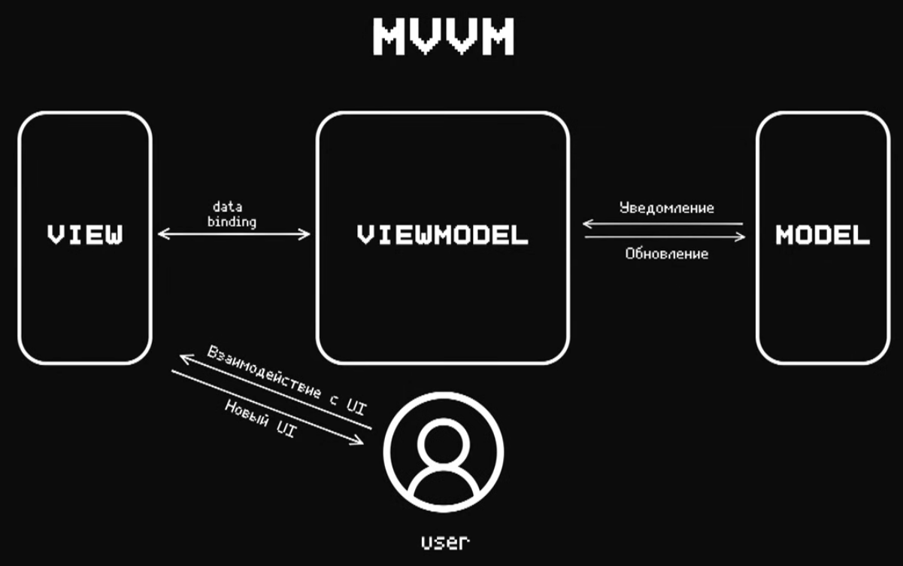

## MVP

MVP - это паттерн в котором мы полностью убираем логику из View и вызываем обновления изнутри Presenter

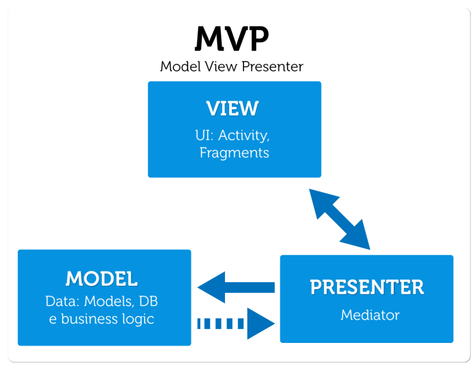

Презентер полностью управляет взаимодействием модели и представления. Представление отправляет события (например, нажатие кнопки) в презентер, который затем взаимодействует с моделью и обновляет представление.
