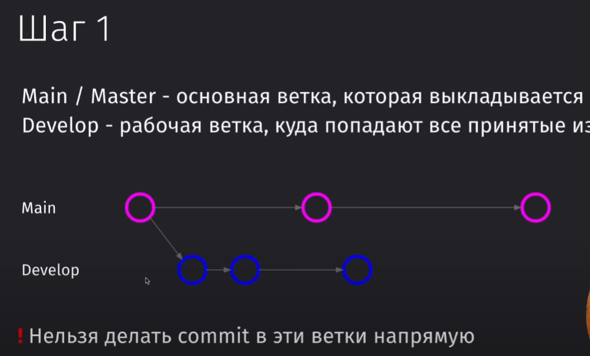
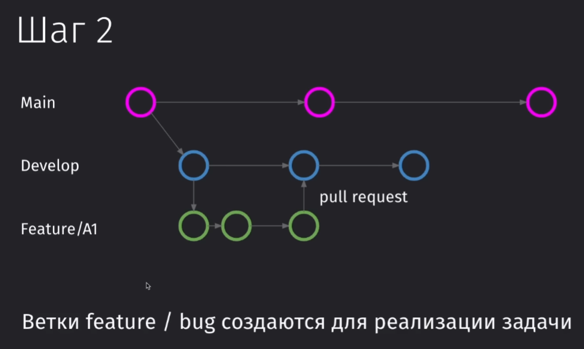
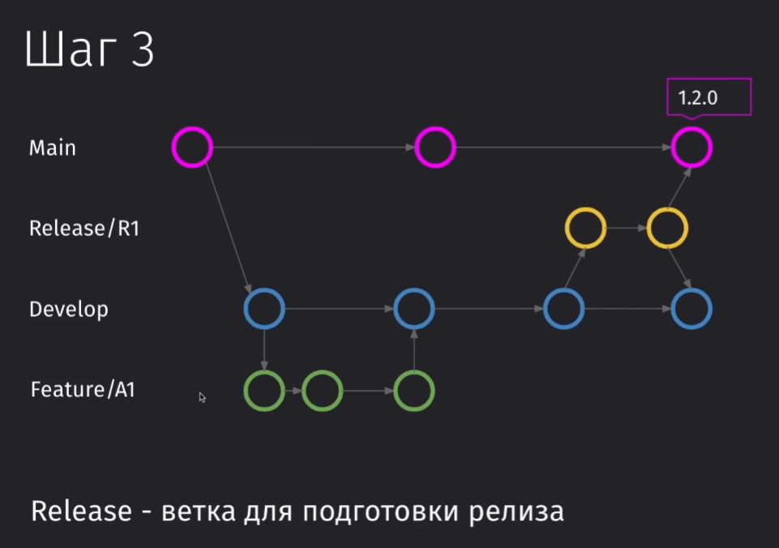
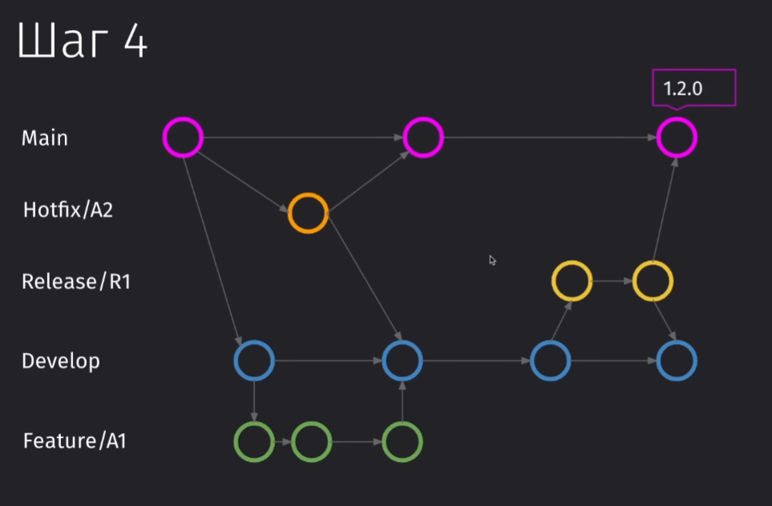

---
tags:
  - cs
  - git
---
#Git #GitHub

> [!tip] [Гайд](https://githowto.com/ru/setup)

## Введение

Git - это инструмент для контроля версий кодовой базы

Зачем нужен контроль версий?

- Проблема
- Неэффективность
    - Сложности с возвратом к предыдущим версиям при работе над одним файлом.
- Решение: Система контроля версий GIT позволяет эффективно отслеживать изменения, сокращая необходимость хранения копий.


Есть много ралзичных интуитивных версий контроля версий файлов:

- Копировать файл
- Вносить все изменения в один файл
- Контролировать изменения внутри файла от версии к версии


Само же использование git предоставляет большое количество плюсов:


Git сейчас нужен всем: от разработчиков до девопсов. Любые системы контроля версий (далее СКВ) практически незаменимы и нужны в любом проекте. Без них никуда не деться. Они позволяют кооперироваться за счёт удалённых репозиториев с другими разработчками, подвязать выполняемые CD пайплайны, отслеживать изменения по задаче в каждой отдельной ветке в последовательности времени.

Основные возможности GIT:

- Локальный контроль версий: Позволяет легко отслеживать и возвращаться к предыдущим изменениям.
- Распределенное хранилище кода:
    - Локальные и удаленные репозитории (например, на GitHub).
    - Удобство параллельной работы над проектом через систему веток и слияний.

## Базовые команды

### Командная строка  
  
Графические приложения (GUI) - интерфейс с визуальными элементами управления (кнопки, поля ввода).  
  
Консольные приложения (CLI) - интерфейс командной строки, где вводятся текстовые команды для выполнения операций.  
  
Польза командной строки заключается в том, что она позволяет быстро выполнять задачи, необходимые при разработке, такие как компиляция кода, работа с сервером и GIT.  
  
  
  
Терминал - это приложение для ввода команд, позволяющее взаимодействовать с операционной системой.  
  
Shell - это оболочка, обрабатывающая вводимые команды в терминале. Различные Shell (BASH, ZSH, FISH) имеют свои команды и особенности в зависимости от операционной системы.  
  
  
  
macOS и Linux взаимозаменяемы для многих задач благодаря синтаксису и идентичным доступным оболочкам (в частности, ZSH)  
  
Windows использует другие команды и имеет свои оболочки (CMD, PowerShell). Однако, можно использовать дополнительные инструменты, такие как Windows Subsystem for Linux или Git Bash, для работы с командами, привычными пользователям Unix-подобных систем.  
  
  
  
### Linux & Mac  
  
Основные команды:  
  
- вывод  
- `pwd` - показывает текущую директорию.  
- `cd` - Перемещение между папками.  
  - Поддержка абсолютных и относительных путей.  
- `mkdir` - Создание новой папки.  
- `touch` - Создание нового файла.  
- `rm` - Удаление файлов и папок (с флагом -r для папок).  
- `cp` - Копирование файлов и папок (с флагом -r для папок).  
- `move` - Перемещение файлов и папок.  
- `clear` - Очищение терминала, сохраняя историю команд.  
- `cat` - Вывод содержимого файла в консоль.  
  
Работа с командами:  
  
- Флаги: Использование флагов (например, `-l` для `ls`) для изменения поведения команд.  
- Документация: Использование `man` для просмотра документации по командам и их флагам.  
  
Подсказки:  
  
- Использование Tab для автодополнения: Упрощение ввода команд и путей  
  
### Windows  
  
Открытие консоли:  
  
1. Command Prompt (CMD): Традиционный способ доступа к консоли.  
2. Windows PowerShell: Расширенный Shell с дополнительными функциями.  
3. Терминал Windows: Новое приложение, поддерживающее множество окон и настройку внешнего вида.  
  
Основные команды для работы с файловой системой:  
  
- Просмотр директорий: Использовать `dir` или `ls` для отображения содержимого текущей директории.  
- Перемещение между папками: `cd <путь>` для навигации по файловой системе. Использование `..` позволяет вернуться на уровень выше.  
- Создание папки: `mkdir <название>` для создания новой директории.  
- Создание файла: Вместо `touch`, в Windows для создания файла используется комбинация `echo <текст> > <имя_файла>`.  
- Просмотр содержимого файла: `cat <имя_файла>` позволяет просмотреть текст файла.  
- Удаление файла: `rm <имя_файла>` удаляет указанный файл.  
- Копирование и перемещение: `cp <исходный_путь> <конечный_путь>` для копирования и `move <исходный_путь> <конечный_путь>` для перемещения папок/файлов.


---
## Начало работы с Git

### Базовые понятия  
  
Основной задачей гита является - хранение и отслеживание изменений в проекте (на примере папки с файлами main.go и go.mod, которые являются как файлами, так и представляют из себя отслеживаемый объект, внутри которого меняется код).  
  
==Commit== – это "слепок" проекта на определенный момент времени, содержащий только изменения по сравнению с предыдущим состоянием, а не полную копию файла.  
Пример: Создание первого _commit_ с файлами, изменение типа данных в файле `main.go` и фиксация изменений во втором _commit_.  
  
  
  
Но сами по себе _коммиты_ не висят в воздухе. Они привязаны к такой вещи, как _ветка_.  
  
==Ветка== – это направление развития проекта, начиная с основной (по умолчанию _main_).  
Ветки позволяют разрабатывать новые функции или вносить изменения без воздействия на основной проект до их слияния.  
  
Сама по себе _ветка_ тоже не висит в вакууме. Она уже подвязана под _репозиторий_.  
  
==Репозиторий== – это место, где Git отслеживает изменения в проекте. Инициализация репозитория включает в себя начало отслеживания изменений.  
  
Сам проект не является репозиторием. Репозиторий - это все те файлы, в которых хранятся ветки, коммиты и все остальные побочные элементы гита.  
  
  
  
Множество вещей в репозитории репрезентируют то, что находится в нём.  
  
```bash  
ls .git```  
  
  
  
Репозиторий хранится в скрытой папке `.git`. Внутри `.git` хранятся данные о коммитах, ветках и истории изменений проекта.  
  
Веток может быть много. Обычно создаются разные ветки под разные задачи и доменные области. Есть различные [соглашения о коммитах](../Соглашение%20о%20коммитах%201.0.0.md) и [GitFlow](../GitFlow.md)  
  
  
  
## Установка  
  
Всё по поводу установки можно найти [тут](https://git-scm.com/book/en/v2/Getting-Started-Installing-Git)  
  
## Создание репозитория  
  
Команда для инициализации репозитория проекта. После инициализации гит будет следить за всеми файлами внутри папки и во вложенных папках.  
  
```bash  
git init```  
  
Далее представлена команда, которая выведет текущее состояние.  
  
```bash  
git status```  
  
Пока что все наши файлы в проекте являются непроиндексированными, так как мы их не добавили в список отслеживаемых.  
  
  
  
## Git config  
  
Команда `git config` позволяет сконфигурировать вашу рабочую среду гита в системе.  
  
Обязательно нужно будет заполнить поля имени и почты, чтобы вас могли идентифицировать другие пользователи.  
  
```bash  
git config --global user.name "Имя_пользователя" # имя пользователяgit config --global user.email "Почта_пользователя" # почта пользователяgit config --global core.editor "vim" # установка дефолтного редактора```  
  
Чтобы просмотреть все сконфигурированные поля, можно воспользоваться данной командой  
  
```bash  
git config --list```  
  
Ну и так же список глобального конфига можно просмотреть просто через вывод файла `.gitconfig` внутри домашнего каталога  
  
  
  
## Первый коммит  
  
Первым делом, когда мы создали новый файл внутри проекта, нужно его подцепить под репозиторий, чтобы гит отслеживал все изменения в файле  
  
  
  
Для добавление файла в отслежиываемые гитом, нужно воспользоваться командой `git add`. Она индексирует и стейджит все файлы, подгатавливая их к коммиту. Индексация добавит файл в репозиторий, а стейдж подготовит информацию о всех изменениях файла (создание/редактирование) в коммит.  
  
```bash  
git add README.mdgit add .```  
  
  
  
Ну и так же мы можем удалить файл из отслеживаемых через `git rm`  
  
```bash  
git rm --cached README.md```  
  
Чтобы зафиксировать изменения в отслежиываемых файлах, нужно воспользоваться командой `git commit`. Эта команда откроет редактор vim/nano и попросит ввести описание коммита. Можно воспользоваться флагом `-m` и ввести только тайтл коммита. Либо мы можем несколько раз передать `-m` с разными сообщениями, чтобы получить на выходе многострочный коммит.  
  
```bash  
git commit -m "тайлт коммита"git commit -m "Title коммита" -m "Body коммита" -m "Footer коммита"```  
  
## Git log и checkout  
  
Для того, чтобы просмотреть историю изменений по проекту, мы можем воспользоваться командой `git log`  
  
```bash  
git log```  
  
Она показывает нам идентификатор коммита, на какой ветке он расположен, автора, дату создания и сообщение коммита  
  
  
  
Далее попробуем добавить новый файл `index.md`, проиндексировать его через `git add .` и изменить наш старый `README.md`. До того, как мы заново совершили индексацию, гит просто отображал нам, что у нас есть новый файл (который готов к коммиту) и то, что у нас есть изменения в другом файле (который не был проиндексирован), который не был готов к коммиту.  
  
> [!info] Индексация в целом вносит изменения по созданию и изменению файлов и заносит их все в коммит!  
  
  
  
После того, как мы сделали ещё один коммит, у нас он появится в истории  
  
  
  
Мы можем перейти на интересующий нас коммит или ветку через `git checkout`  
  
```bash  
git checkout 60654d12f13292ff1048a613d718e06896220733```  
  
И теперь все наши новые файлы, которые мы создали в новом коммите, пропали. Так же мы не видим и новых коммитов, которые мы сделали - ничего нет.  
  
  
  
Чтобы вернуться обратно в самый верх наших изменений и увидеть всю историю коммитов, можно просто чекаутнуться обратно в нашу ветку  
  
```bash  
git checkout master```

# Ветки и изменения

## Ветки

Ветки нам нужны для того, чтобы вести разработку нескольких фич в разных версиях проекта. Так же под ветки можно подвязать с помощью инструментов CI/CD различные пайплайны, которые будут выполняться перед пушем, во время пуша и после пуша. Например, сборка проекта и выкладка на сервер.

Данная команда выведет все ветки проекта. Текущая ветка помечается звёздочкой.

```bash
git branch
```


Далее нам нужно создать новую ветку. При создании новой ветки, мы копируем коммиты текущей ветки в новую и присваиваем ей другое название. Чтобы создать ветку, нам нужно воспользоваться следующей командой:

```bash
git branch dev
```

Чтобы перейти к нужной ветке, нужно воспользоваться чекаутом

```bash
git checkout dev
```

Так же можно сразу создать и перейти в другую ветку одной командой

```bash
git checkout -b dev
```

При совершении изменений в проекте, мы увидим, что в данной ветке у нас HEAD располагается на последнем коммите нашего бранча. Но так же мы имеем и все прошлые коммиты из стартового бранча на момент создания текущей ветки.

Все новые коммиты этой ветки остаются только в этой ветке.


### Слияния

Слияние - это механизм объединения веток в гите. Он позволяет нам соединить изменеия, которые мы выполнили в одной ветке с другой. Грубо говоря, мы переносим коммиты из нашей рабочей ветки в целевую с проектом.


Цель: слияние веток dev и master.

Чтобы влить изменения в нужную нам ветку, нужно сначала в неё перейти.
И далее нам нужно будет воспользоваться командой `merge`, которая объединит ветки

```bash
git checkout master
git merge dev
```

После этого можно будет увидеть, что HEAD веток master и dev находятся на одном и том же коммите


### HEAD

HEAD – это указатель в Git, который показывает на текущий коммит в репозитории. Это коммит, от которого будут создаваться дальнейшие изменения или коммиты.


Когда мы переключаемся между ветками с помощью `git checkout`, HEAD автоматически указывает на последний коммит выбранной ветки. То есть тут происходит неявное перемещение указателя на заголовный коммит ветки.


Так же у HEAD есть состояние Detached, которое появляется в том случае, когда мы чекаутимся на определённый коммит, а не ветку.


Так же посмотреть на то, где находится сейчас HEAD можно с помощью просмотра содержания файлика HEAD


После чекаута в ветку наш HEAD теперь смотрит на последний коммит нашего бранча


### Теги

Теги - это лейблы, привязываемые к конкретным коммитам.

Они используются для аннотации коммитов с дополнительной информацией или наименованием версий.

Теги часто применяются для сборки релизов в проектах с настроенной интеграцией и доставкой (CI/CD).

Например, мы можем использовать теги для:

- сбора релиза может использоваться определённый тег.
- автоматизационных утилит, которые могут привязываться к тегам, а не к веткам или названиям коммитов

Чтобы добавить автоматически тег на наш последний коммит, мы можем воспользоваться следующей командой:

```bash
git tag 1.0.0
```


Чтобы получить список тегов, можно воспользоываться:

```bash
git tag
```


Так же ничто нам не мешает чекаутнуться к тегу. Однако у нас так же будет Detached HEAD из-за того, что мы перейдём к определённому коммиту.

```bash
git checkout 1.0.0
```

### Switch

Так же существует команда чисто для чекаута между ветками

```bash
git switch <branch>
```

Так же мы можем переключаться с помощью этой команды и по тегам между коммитами

```bash
git switch --detach <tag>
```

Так же с помощью флага `-c` мы сможем создать новый бранч

```bash
git switch -c new-feature
```


---
## Удаление

### Базовое удаление

Чтобы удалить файл из нашего репозитория, мы можем удалить файл руками. В таком случае при просмотре `git status` наш файл будет помечен как удалённый. Далее мы индексируем изменения, коммитим и пушим их.


### Восстановление файла

Далее мы случайно удалили уже другой файл вместе с предыдущим. Его удалять мы не хотели.

Чтобы восстановить файл обратно, мы можем воспользоваться командой `restore`.

1. Если мы не проиндексировал изменения, то можем воспользоваться просто `restore`
2. Если мы воспользовались уже `git add .`, то нам нужно будет воспользоваться рестором сначала с флагом `--staged`, а потом повторно без флага. В первый раз мы убираем из зафиксированных изменений удаление, а во второй раз восстанавливаем удалённый файл.

```bash
git restore README.md
```


### Быстрое удаление

Первым делом, познакомимся с командой, которая выводит файлы, которые трекает гит. `ls-files` выведет файлы из структуры проекта, которые отслеживает гит.

```bash
git ls-files
```

Команда `rm` позволяет быстро удалить файл из проекта и из репозитория сразу с занесением в staged (aka использование `add .` из коробки)

```bash
git rm README.md
```

И мы получаем примерно такую структуру, когда файл сразу удаляется и изменение записывается в репозиторий.


### Откат изменений

Команда `restore` восстанавливает файл до тех изменений, которые были совершены после последнего коммита. Грубо говоря, он отменяет совершённые изменения над файлом.

Такую же силу имеет и выполнение над файлом команды `checkout`

```bash
git restore <файл>
git checkout <файл>
```

Например, мы поменяли файл `docs/project-doc.md`


И теперь можем откатить новые изменения через

```bash
git checkout ./docs/project-doc.md
git restore ./docs/project-doc.md
```

Так же если дёрнуть просто `.`, то мы откатим все изменения до последнего коммита

```bash
git checkout .
```

Так же мы можем очистить в директории все те изменения, которые мы не застейджили (`add`) с помощью команды `clean`

С помощью флагов `-dn` можно посмотреть, что будет удалено
С помощью `-df` можно удалить сами незатреканные файлы

Если мы уже затрекали файл, то нам останется только

```bash
git clean
```


### Vim

Вся навигация по виму описана [тут](../../../tools/Terminal.md)

Установка в качестве дефолтного редактора

```bash
git config --global core.editor "vim"
```

Для перехода к редактированию сообщения через vim, нужно будет воспользоваться командой коммита без параметров

```bash
git commit
```

### Amend

Команда `amend` позволяет изменить сообщение последнего коммита, который не был отправлен на удалённый репозиторий.

Если бы мы его уже отправили, то нужно было бы использовать `push --force`

Лог нам выводит такое последнее сообщение:


Выполняем операцию обновления коммита

```bash
git commit --amend -m "create new file of docs"
```

И имеем обновлённое описание


Далее, если мы занесём изменения в сам файл, но не хотим менять сообщение коммита, то можно сделать так:

```bash
git commit --amend --no-edit
```

Сейчас мы _изменили сам файл_ (с документацией) и добавили его к изменениям в прошлом коммите


`amend` позволяет обновить как сообщение, так и изменения, которые мы внесли в файлы последнего коммита

### Reset

Команда `reset` позволяет откатить коммит тремя разными способами

- Обычный откат. Сохранит изменения и сделает их все _unstaged_ (нужно будет вызвать `add`)
- `--soft` - мягко откатывает. Сохраняет изменения, но удаляет сам коммит. Сами по себе изменения останутся в _staged_
- `--hard` - жёстко откатывает. Удаляет и изменения и коммиты.

Сразу нужно сказать, что все операции над коммитами и свичём между ними можно выполнять не с помощью задания хеша коммита, но и с помощью конструкции `HEAD~<количество>`, которая откатит на определённое количество коммитов от `HEAD`.

Добавили и закоммитили файл


Выполняем просто `reset` до прошлого коммита и наши изменения остались в проекте а коммит удалился

```bash
git reset HEAD~1
```


Далее деляем мягкий `--soft` откат, который сохранил изменения в стейдже и удалил ветку

```bash
get reset --soft HEAD~1
```


Далее выполяем `--hard`, который сотрёт сам коммит и изменения, которые в нём были

```bash
git reset --hard HEAD~1
```


### Удаление веток

Для удаления ветки нужно воспользоваться командой `branch` с тегом `-d`/`--delete`

```bash
git branch --delete ВЕТКА
```


После удаления ветки, удаляются и все коммиты связанные с ней. Обычно мы удаляем ветки, когда выполнили связанную с ней задачу, влили в мастер и теперь она нам не нужна. Важно удалять своевременно ветки, чтобы не сорить в проекте и поддерживать чистоту.

### Detached commit

Явление, как `Detached commit` исходит из `Detached HEAD` и происходит тогда, когда от отсоединённого хеда мы делаем коммит.

Первым делом нам нужно перейти в интересующий нас коммит

```bash
git checkout 12efdf77531b129728f71188642e5afb5386934c
```

И все инстурменты говорят нам, что мы находимся в режиме отцеплённой головы


Попробуем добавить новый файл и закоммитить его и получаем отцеплённый коммит


После свича в мастер, гит нас предупреждает, чтобы не потерять изменения, нужно будет создать ветку по коммиту временной ветки, которую создал гит для отцеплённого HEAD


Добавляем ветку по отцеплённому HEAD

```bash
git branch chore/added-docs-file 8284994
```

И получаем новую ветку с нашими изменениями


И теперь можно будет смёрджить ветку с нужной нам

```bash
git merge chore/added-docs-file
```

### Решение конфликтов

Конфликт - это ситуация, когда в обоих коммитах был изменён один и тот же файл и гит не понимает, какой из них нужно принять. В данном случае нам нужно будет выбрать, какой файл оставить либо объединить файлы самостоятельно ручками и перенести нужные нам участки кода туда, где они должны распологаться в итоговом файле.

Если мы смёрджили ветки, но не хотим решать конфликты, то можно откатить последний мёрдж

```bash
git merge --abort
```

И далее, чтобы решить конфлиты, нам нужно будет удалить маркеры и оставить только те изменения, которые нам нужно оставить в файле. Верхний маркер `<<<` показывает изменения из родительской ветки, через `===` мы делим изменения из двух веток, а уже последний маркер `>>>` показывает окончания новых изменений, которые прилетели нам извне.

Решать конфликты удобно через редакторы и IDE, которые покажут удобный вывод, но так же можно и через консоль их решить, если мы сами удалим все маркеры и расставим код, как нужно нам.


После удаления маркера конфликта и стейджа изменений, конфликт оказался решён отдельным коммитом


Так же мы можем решить конфликт с помощью GUI-утилиты из гита

```bash
git mergetool
```

### Gitignore

`.gitignore` - это файл, который описывает игнорируемые файлы и папки проекта.

`.gitignore`

```bash
node_modules # будет игнорировать папку и все вложенные файлы
log.txt # будет игнорировать определённый файл
/*.txt # будет игнорировать все файлы с расширением .txt в первом уровне проекта (во вложенных папках игнорировать не будет)
/logs/* # будет игнороировать все файлы в папке, но не саму папку
!/logs/*.md # удаляет из игнорирования все файлы из папки по паттерну `*.md`

# ! - инвертирует выделение файлов
```


### Gitkeep

`.gitkeep` - это искусственный файл, который создают разработчики для сохранения пустых папок.

Самым простым решением, которое приходит людям в голову - это создать файл `fake.txt` за счёт которого не будет удаляться папка, но это приводит к тому, что не понятно для чего существует этот файл в папке.

Среди разработчиков пошла договорённость создавать файл `.gitkeep`, который мы добавляем в исключения `.gitignore` и уже с помощью него мы сохраняем пустые папки.

Сами по себе пустые папки иногда нужно сохранить, когда она нужна для других механизмов приложения, но в режиме разработки в ней ничего нет. Обычно такие папки добавляют, когда какие-то инструменты ломаются при отсутствии папки (не предусмотрена проверка наличия и создания папки).


---
## Продвинутая работа

### Stash

`stash` - это команда, которая позволит сохранить внесённые в проект изменения без отдельного коммита

Применить стеш можно только в том случае, когда у нас `status` полностью чист (текущие изменения закоммичены)

```bash
# создание стеша
git stash # сохранит изменения в стеш
git stash push -m "Work in progress..." # сохранит в стеш с комментарием

# вывод списка
git stash list # выведет список стешей

# применение стеша
git stash apply # применит самый последний стэш
git stash apply 1 # применит стеш по определённому идентификатору

# очистка стеша
git stash pop 1 # применит и удалит стеш
git stash clear # очистит все стеши
```

Индексируется каждая запись сверху вниз, то есть самая новая получает индекс 0 и автоматически применяется при `apply`.


> [!summary] Стеш нужен для перемещения изменений из одной ветки в другую или временно их убирать.

### Reflog

Все потерянные коммиты, которые были созданы в detached HEAD или были удалены через `reset --hard` - не теряются. Всех их можно найти через `reflog`.

> [!note] Reflog хранит список всех действий из гитом в текущем репозитории.

Например, после отката через `--hard` мы не теряем коммит прямо сейчас и насовсем. Git хранит удалённые изменения в течение 30и дней и даёт нам возможность их восстановить.

```bash
git reflog
```


Чтобы восстановить удалённый коммит, мы можем воспользоваться командой сброса, но добавив в конец хэш с нашим коммитом. Это восстановит удалённый коммит.

```bash
git reset --hard 9743fd7
```

Так же мы можем восстановить целиковую удалённую ветку. Восстановить её нам удастся, если мы перейдём на её последний коммит, попадём в detached HEAD и создадим от него новую ветку. Что описано [тут](5.%20Удаление.md).


### Fast-forward merge

FFMerge - это событие, когда мы вливаем изменения из дочерней в родительскую, когда в родительской не было никаких новых изменений и коммитов. В таком случае из дочерней ветки будут перемещаться коммиты сверх родительского и нам самый свежий поставится HEAD


И в результате такого слияния, будет написано сообщение об FF merge


Так же мы можем отключить `--no-ff` слияние

```bash
git merge --no-ff ВЕТКА
```

### Recursive merge

Рекурсивный мёрдж - это уже событие, когда в родительской ветке, куда мы сливаем изменения, уже есть коммиты после того, что был в дочернем.


В таком случае уже будет создаваться отдельный коммит, на который и повесится HEAD.


В таком случае, merge будет осуществлён по `ort` стратегии


### Squash

Squash - это объединение нескольких коммитов в один. Этим иснтрументом мы можем объединить излишние коммиты в один и не мусорить в истории репозитория

То есть мы подтянем все изменения из другой ветки в нашу, но они попадут не в качестве коммитов, а просто в виде изменений, которые нам нужно будет потом закоммитить

```bash
git merge --squash ВЕТКА
```

И примерно таким образом будет выглядеть работа с получением новых данных:


### Rebase

Rebase - это механизм, который переносит историю одной ветки в другую. Позволяет перенести изменения в другую ветку более чистым образом не прибегая к излишнему ветвлению и замусориванию истории.

Это может понадобится в случае, когда нам нужно будет базировать все наши будущие коммиты на новом коммите из родительской ветки


Rebase позволит нам перенести базовый коммит из ветки с нужным коммитом в нашу и базировать следующие коммиты на нужном нам коммите


Но чтобы новый коммит базировался на нужном нам коммите, мы должны пересоздать последний коммит (3) с теми же изменениями и с новым идентификатором


Примерно так выглядит история коммитов в дочерней ветке


Совершаем `rebase` с мастера в этой ветке

```bash
git rebase master
```

И теперь у нас до последнего коммита идёт самый последний коммит из мастера. Тут стоит обратить внимание, что идентификатор коммита изменился, так как гит пересоздал его полностью.


И сейчас при мёрдже у нас произошёл FFMerge, а не рекурсивный, так как наш последний коммит в дочерней ветке базируется на последем родительским.


> [!danger] Однако если мы работаем с удалённым репозиторием, то `rebase` будет в целом перезаписывать историю изменений, что может стереть множество коммитов. Данный механизм работы присущ для локальной работы.

### Cherry-pick

Cherry-pick - это мехнизм выборочного применения коммитов из одной ветки в другую, избегая необходимости слияния всех изменений.

В процессе внесения изменений в ветку разработки, мы поняли, что нам нужно перенести коммит 3 в main, но пока коммит 4 нельзя переносить


В таком случае, нам может пригодиться cherry-pick, которым мы перенесём в main только один коммит, а не сразу все изменения из другой ветки.


Представим такую ситуацию:

Мы работали в ветке, но потом нам потребовалось перенести коммит _master fix_ в ветку `master`


Далее переходим в мастер и выполняем команду черри-пика

```bash
git cherry-pick [идентификатор коммита]
```

Которая перенесёт определённый коммит в нужную нам ветку


Мастер получил нужный коммит, но у него теперь поменялся идентификатор


---
## Удалённый репозиторий

### Удалённые репозитории

Удалённый репозиторий - это сервис, который будет хранить все изменения не локально на нашем компьютере, а на удалённом устройстве.

Это даёт нам:

- Дополнительную безопасность в том случае, если мы сотрём проект на нашем локальном устройстве
- Возможность разрабатывать совместно в несколько лиц


### Создание репозитория

При создании репозитория можно выбрать:

- Владельца (профиль/организация)
- Имя репозитория (уникальное для владельца)
- Описание
- Доступность видимости
- Начальный README\
- Начальный гитигнор
- Выбор типа лицензии


Дабы подключиться к интересующему нас репозиторию, нам нужно будет выполнить команду над удалённым репозиторием `remote` и добавить `add` сам репозиторий по имени `origin`, который будет распологаться по ссылке, указывающей на этот удалённый репозиторий.

```bash
git remote add origin https://github.com/ZeiZel/git-demonstration.git
```

Далее нам нужно будет воспользоваться командой для отправки репозитория на удалённый сервер `push`, в которой нужно будет указать основное имя удалённого репозитория `origin` а затем указать имя отправляемой ветки

```bash
git push -u origin master
```

Но, если мы создали приватный репозиторий, то доступа отправлять на него запросы по https - у нас нет.


### Создание SSH-ключа

SSH-ключи нужны для безопасного взаимодействия между локальным и удалённым репозиторием. SSH предоставляет [доступ и права](../../../devops/linux/os/_lessons/Доступ%20и%20права.md) для безопасного выполнения команд на удалённой машине.

- SSH-ключ: состоит из приватной и публичной части, позволяет безопасно отправлять изменения в удаленные репозитории.
- Приватный ключ: хранится на локальной машине и используется для аутентификации.
- Публичный ключ: размещается на сервере или сервисе (например, GitHub), подтверждает, что изменения отправлены именно вами.

Первым делом нужно создать новый ключ. Сгенерировать его можно с помощью дефолтной утилиты системы.

```bash
ssh-keygen
```

При создании ключа стоит сохранить его с предлагаемым наименованием (обычно `id_rsa` или `id_ed`) для удобства.

Можно пропустить ввод парольной фразы (passphrase) для простоты, хотя она добавляет дополнительный уровень безопасности на случай того, если наш секретный ключ узнали.


Публичная часть ключа (`id_ed.pub`) может делиться с сервисами типа GitHub для идентификации
Приватная часть (`id_ed`) остаётся у вас и не должна передаваться никому.

На примере гитхаба, создание SSH-ключа будет выглядеть следующим образом:


И в поле ==key== при создании ключа, мы должны будем добавить сгенерированный fingerprint (который есть в выводе сверху)


После всех действий мы наконец можем клонировать проекты по SSH и пушить в них изменения


> [!danger] **Важно**: Если публичный ключ мы можем предоставлять любому сервису, то уже с приватной частью ключа следует обращаться аккуратно, не распространять и не хранить в общем доступе.

### Git Remote

Команда `get remote` позволяет работать с удалёнными репозиториями

Первым делом получим список удалённых репозиториев. Пока что мы тут получим только _origin_

```bash
git remote
```

Далее узнаем url на свой репозиторий. Тут у нас стоит пока https-соединение, которое нужно будет заменить на ssh.

```bash
git remote get-url origin
```

А уже потом заменим подключение на ssh, чтобы работать полностью в рамках него, а не только через ssh-ключик.

```bash
git remote set-url origin git@github.com:ZeiZel/git-demonstration.git
```


И теперь у нас есть доступ к пушу изменений на удалённый репозиторий

```bash
git push -u origin master
```


### Отправка новых изменений

При создании нового коммита можно заметить, что у нас добавилась новая ветка `origin/master`, которая уже отвечает за ветку, совместимую с нашей, но которая находится на удалённом репозитории.


С помощью команды `push`, мы отправляем наши сделанные коммиты на удалённый репозиторий `origin` (который мы определили ранее)

```bash
git push
```

И все коммиты находятся в нашей истории коммитов


С помощью `branch` с флагом `--all` можно просмотреть так же и удалённые ветки

```bash
git branch -a
```


### RTB - Remote tracking branches

Прцоесс отправки локальных изменений в удалённый репозиторий происходит не простым копированием из локального репозитория на удалённый. Всё происходит через посредника в виде tracking branch.

tracking branch (TB) - это представление удалённого репозитория локально.
`remote` - удалённая / `origin` - название удалённого репозитория / `master` - наша основная ветка. Из этого представления изменения отправляются на удалённый сервер ==remote==

Когда мы пушим через `git push`, мы закидываем изменения в TB, который отправляет изменения на сервер.

Когда мы выполняем `git pull` (подтягиваем изменения с сервера), мы подтягиваем список изменений в наш TB и потом объединяем изменения с локальным репозиторием.
Когда мы выполняем `git pull`, то у нас под капотом выполняются `git fetch` на первом этапе (подтягивание изменений с ==remote==), а потом `git merge` (объединение списка изменений с нашим локальным репозиторием).

Сам TB отслеживает изменения и сообщает о конфликтах


##### Пуш новой ветки

Когда мы попытаемся запушить дев ветку в первый раз на удалённый репозиторий, нам там так же придётся создавать представление dev ветки для нашего удалённого репозитория

```bash
git push origin dev
```


##### Подтягивание удалённых изменений

Представим, что другой разработчик создал новую ветку и работает теперь в ней. Чтобы просмотреть изменения по веткам, нужно будет воспользоваться командой для отслеживания изменений в RTM

```bash
git fetch
```


### LTB - Local tracking branches

LTB находятся локально и связаны с другими удалёнными ветками для реализации бесшовного пула и пуша.


Флаг `-vv` позволит вывести боллее подробную информацию по веткам.

```bash
git branch -vv
```

После идентификатора ветки идёт его отношение к LTB, который и общается с RTB.


##### Отслеживание новых созданных веток в удалённом репозитории

И для того, чтобы научиться создавать локальные ветки, которые будут тречить удалённые изменения, нам нужно воспользоваться

```bash
git branch --track ВЕТКА origin/ВЕТКА
```


### Upstream

У нас есть более простой метод для связывания локальной ветки с удалённой через специальный флаг и указания имени удалённого репозитория

```bash
git push --set-upstream origin dev

# либо

git push --u origin dev
```

Таким образом мы легко создадим нужную нам LTB, которая будет бесшовно общаться с RTB


### Клонирование репозитория

Для клонирования репозитория с удалённого ресурса существует `git clone`

```bash
git clone ССЫЛКА [имя целевой папки | опционально]

git clone git@github.com:ZeiZel/git-demonstration.git git-repo
```

Сейчас все наши локальные ветки пропали и подтянулись с удалённого репозитория только RTB и ветка master


Но чтобы автоматически создать LTB по нашим RTB, можно просто чекаутнуться в существующую на удалённом репозитории ветку и она автоматически подхватится без `git branch --track`


И вот в списке веток у нас автоматически созданные LTB


### Удаление веток

И таким образом мы можем удалить удалённую ветку по её наименованию

```bash
git branch -D --remote НАЗВАНИЕ_РЕПОЗИТОРИЯ/ВЕТКА

git branch -D --remote origin/dev
```

Через эту команду можно посмотреть все удалённые ветки

```bash
git ls-remote
```

Однако после локального удаления удалённой ветки, при поптыке пула изменений с удалённого репозитория, мы будем получать эту ветку обратно


Если мы хотим удалить удалённую ветку, то нам нужно будет запушить ивент по удалению определённой ветки через `push` с флагом `--delete`

```bash
git push РЕПОЗИТОРИЙ --delete ВЕТКА
```


### Force Push

Представим ситуацию, когда нам нужно удалить коммит не только локально, но и на удалённом репозитории

Для этого нам не достаточно будет просто откатить и запушить изменения, потому что при пуле мы получим этот коммит обратно

А при попытке запушить всю эту историю, нам TB высветит, что мы пушим неактуальные изменения


Чтобы обойти это ограничение и всё-таки запушить это изменение, мы можем отправить изменения с флагом `--force`

```bash
git push --force
```


---
## Подходы

### Gitflow

В начальной своей версии наш проект имеет две ветки:

- main
- dev

В эти ветки запрещено вносить изменения без пулл реквеста и вносить их туда напрямую и не нужно



Чтобы реализовать определённую фичу, мы должны отделиться от дев-ветки и уже в отдельной ветке фичи её реализовывать. По окончанию разработки коммит нужно будет слить в dev через pull request



Дальше у нас идёт Release-ветка. В неё мы сливаем те изменения, которые сделали в дев-ветке и которые уже можно пробовать заливать в мастер в качестве отдельной фичи.

В неё мы можем коммитить дополнительные изменения, но это будут только фиксы, если вдруг тестировщики обнаружат, что что-то отвалилось



Если у нас появилась такая проблема, что у нас что-то резко сломалось, то мы можем напрямую отделиться от мэина и реализовать свой хотфикс, который нужно будет залить как в мэин, так и в дев ветку (чтобы не потерять изменения)

Дев ветка должна хранить все изменения проекта !!



> [!info] Преимущества
>
> - Удобный процесс для код ревью
> - Подходит для редких релизов
> - Подходит для работы с несколькими командами

> [!warning] Недостатки
>
> - Много merge конфликтов
> - Много merge коммитов
> - Сложный путь до релиза

### Соглашение о коммитах

#### Главное

Спецификация «Соглашение о коммитах» — простое соглашение о том, как нужно писать сообщения коммитов. Оно описывает простой набор правил для создания понятной истории коммитов, а также позволяет проще разрабатывать инструменты автоматизации, основанные на истории коммитов. Данное соглашение совместимо с [Семантическим Версионированием](https://semver.org/lang/ru/), описывая новые функции, исправления и изменения, нарушающие обратную совместимость в сообщениях коммитов.

Сообщения коммитов должны быть следующей структуры:


```
<тип>[необязательный контекст]: <описание>

[необязательное тело]

[необязательная(ые) сноска(и)]
```

Коммит содержит следующие структурные элементы для передачи намерений пользователям вашей библиотеки:

1. **fix:** коммит *типа* `fix` исправляет баг в вашем коде (соответствует [`PATCH`](https://semver.org/lang/ru/#%D0%BA%D1%80%D0%B0%D1%82%D0%BA%D0%BE) в Cемантическом Версионировании).
2. **feat:** коммит *типа* `feat` добавляет новую функцию в ваш код (соответствует [`MINOR`](https://semver.org/lang/ru/#%D0%BA%D1%80%D0%B0%D1%82%D0%BA%D0%BE) в Cемантическом Версионировании).
3. **BREAKING CHANGE:** коммит, который имеет *сноску* `BREAKING CHANGE` или коммит, заканчивающийся восклицательным знаком (`!`) после *типа* или *контекста*, вводящий изменение(я), нарушающие обратную совместимость (соответствует [`MAJOR`](https://semver.org/lang/ru/#%D0%BA%D1%80%D0%B0%D1%82%D0%BA%D0%BE) в Cемантическом Версионировании). `BREAKING CHANGE` может быть частью коммита любого *типа*.
4. Другие *типы* коммитов разрешены. Например, [@commitlint/config-conventional](https://github.com/conventional-changelog/commitlint/tree/master/%40commitlint/config-conventional) (основан на [соглашении Angular](https://github.com/angular/angular/blob/22b96b9/CONTRIBUTING.md#-commit-message-guidelines)) рекомендует `build`, `chore`, `ci`, `docs`, `style`, `refactor`, `perf`, `test` и другие.
5. Другие *сноски* коммитов могут быть аналогичны соглашению [git trailer format](https://git-scm.com/docs/git-interpret-trailers).

Дополнительные *типы* не требуются «Соглашению о коммитах» и не имеют неявного эффекта в семантическом версионировании (если только они не включают `BREAKING CHANGE`). *Контекст* может быть добавлен к *типу* коммита, чтобы предоставить дополнительную контекстную информацию; она содержится в скобках. Например, `feat(parser): add ability to parse arrays`.

#### Примеры

##### Сообщение коммита с *описанием* и *сноской* `BREAKING CHANGE`

```
feat: allow provided config object to extend other configs

BREAKING CHANGE: `extends` key in config file is now used for extending other config files
```

##### Сообщение коммита с `!` для привлечения внимания к `BREAKING CHANGE`

```
feat!: send an email to the customer when a product is shipped
```

##### Сообщение коммита с *контекстом* и `!` для привлечения внимания к `BREAKING CHANGE`

```
feat(api)!: send an email to the customer when a product is shipped
```

##### Сообщение коммита вместе с `!` и *сноской* `BREAKING CHANGE`

```
chore!: drop support for Node 6

BREAKING CHANGE: use JavaScript features not available in Node 6.
```

##### Сообщение коммита без *тела*

```
docs: correct spelling of CHANGELOG
```

##### Сообщение коммита с *контекстом*

```
feat(lang): add polish language
```

##### Сообщение коммита с *телом* из нескольких абзацев и несколькими *сносками*

```
fix: prevent racing of requests

Introduce a request id and a reference to latest request. Dismiss
incoming responses other than from latest request.

Remove timeouts which were used to mitigate the racing issue but are
obsolete now.

Reviewed-by: Z
Refs: #123
```

#### Спецификация

Слова «MUST», «MUST NOT», «REQUIRED», «SHALL», «MAY» и «OPTIONAL» в данном документе должны интерпретироваться как в [RFC 2119](https://www.ietf.org/rfc/rfc2119.txt).

1. Коммиты должны (MUST) начинается с *типа*, который является существительным: `feat`, `fix` и т.д. За ним следует необязательный (OPTIONAL) *контекст*, необязательный (OPTIONAL) восклицательный знак (`!`) и обязательные (REQUIRED) двоеточие (`:`) и пробел ( ).
2. *Тип* `feat` должен (MUST) использоваться, когда коммит добавляет новый функционал в ваше приложение или вашу библиотеку.
3. *Тип* `fix` должен (MUST) использоваться, когда коммит исправляет баг в вашем приложении или вашей библиотеке.
4. *Контекст* может (MAY) следовать после *типа*. *Контекст* должен (MUST) быть существительным, заключённым в круглые скобки, описывающий часть кодовой базы, которую затронул коммит. Например, `fix(parser)`.
5. *Описание* должно (MUST) следовать сразу за двоеточием (`:`) и пробелом ( ) после *типа* или *контекста*. *Описание* представляет собой краткое изложение изменений кода. Например, `fix: array parsing issue when multiple spaces were contained in string`.
6. *Тело* коммита может (MAY) следовать после короткого *описания*, добавляя дополнительную контекстную информацию об изменениях в коде. *Тело* должно (MUST) отделяться от *описания* одной пустой строкой.
7. *Тело* коммита имеет произвольную форму и может (MAY) состоять из любого количества абзацев, разделённых новой строкой.
8. В одной или нескольких *сносках* может (MAY) быть одна пустая строка после *тела*. Каждая *сноска* должна (MUST) состоять из токена слова, за которым следует разделитель `:<пробел>` или `<пробел>#`, за которым следует строковое значение (основано на [git trailer format](https://git-scm.com/docs/git-interpret-trailers)).
9. Токен *сноски* должен (MUST) использовать `-` вместо пробельных символов. Например, `Acked-by` (это помогает отличить раздел *сноски* от его *тела*, состоящего из нескольких абзацев). Исключение составляет `BREAKING CHANGE`, которое может (MAY) также использоваться как токен.
10. *Сноска* может (MAY) содержать пробелы и символы новой строки, а считывание должно (MUST) завершаться при обнаружении следующей допустимой пары токен-разделитель *сноски*.
11. Критические изменения должны (MUST) быть указаны в *типе*, *контексте* или *сноске* коммита.
12. Если `BREAKING CHANGE` включено в *сноску*, то оно должно (MUST) состоять из прописного текста `BREAKING CHANGE`, за которым следует двоеточие (`:`), пробел ( ) и *описание*. Например, `BREAKING CHANGE: environment variables now take precedence over config files`.
13. Если критические изменения находятся в *типе* или *контексте*, то они должны (MUST) быть обозначены восклицательным знаком (`!`), непосредственно перед двоеточием (`:`). Если используется восклицательный знак (`!`), то `BREAKING CHANGE` может (MAY) быть опущен в *сноске*, а *описание* коммита должно (SHALL) использоваться для описания критического изменения.
14. В ваших сообщениях коммитов могут (MAY) использоваться *типы*, отличные от `feat` и `fix`. Например, `docs: updated ref docs`.
15. Единицы информации, которые составляют «Соглашение о коммитах», не должны (MUST NOT) обрабатываться разработчиками как чувствительные к регистру, за исключением `BREAKING CHANGE`, которое должно (MUST) быть прописными.
16. `BREAKING-CHANGE` должен (MUST) быть синонимом `BREAKING CHANGE` при использовании в качестве токена в *сноске*.

#### Зачем использовать «Соглашение о коммитах»

- Автоматическое создание списков изменения.
- Автоматическое определение семантического повышения версии (на основе *типов* совершённых коммитов).
- Информирование товарищей по команде, общественности и других заинтересованных сторон о характере изменений.
- Запуск процессов сборки и публикации.
- Упрощать людям участие в ваших проектах, позволив им изучить более структурированную историю коммитов.
