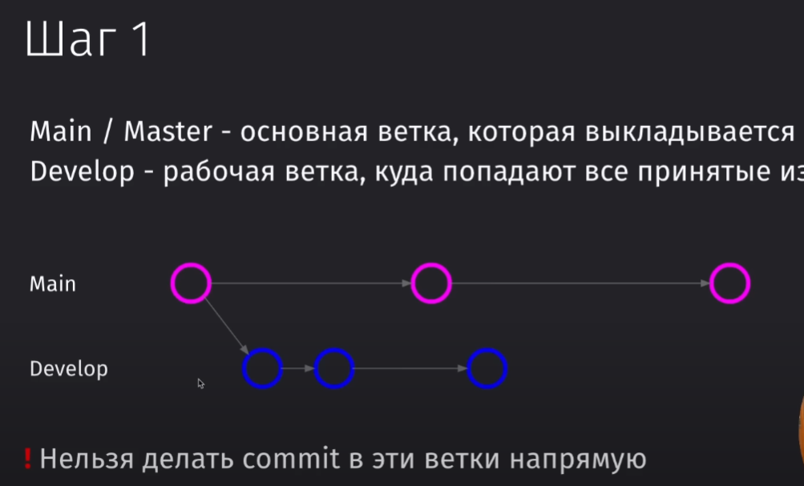
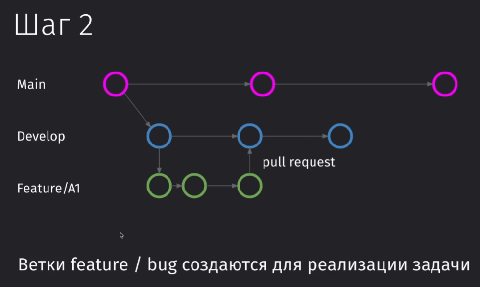
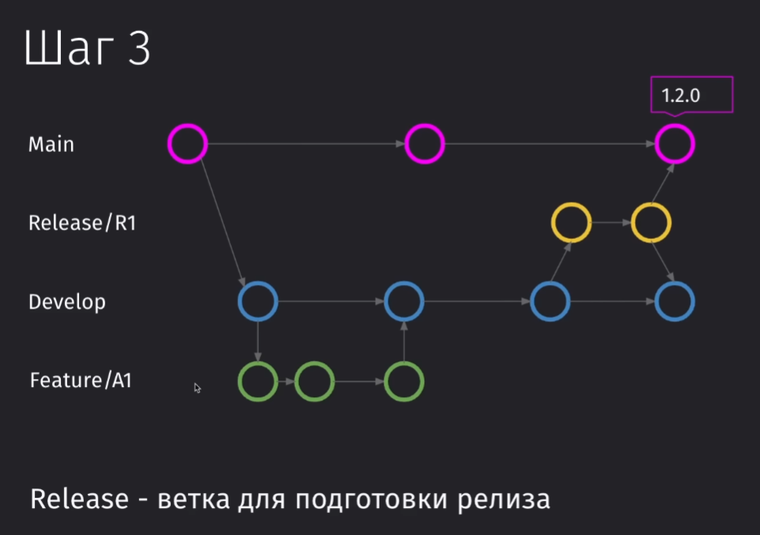
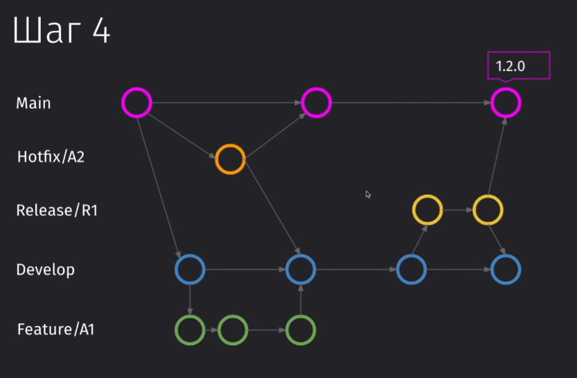

---
tags:
    - '#Git'
    - '#gitflow'
---

В начальной своей версии наш проект имеет две ветки:

- main
- dev

В эти ветки запрещено вносить изменения без пулл реквеста и вносить их туда напрямую и не нужно

Чтобы реализовать определённую фичу, мы должны отделиться от дев-ветки и уже в отдельной ветке фичи её реализовывать. По окончанию разработки коммит нужно будет слить в dev через pull request

Дальше у нас идёт Release-ветка. В неё мы сливаем те изменения, которые сделали в дев-ветке и которые уже можно пробовать заливать в мастер в качестве отдельной фичи.

В неё мы можем коммитить дополнительные изменения, но это будут только фиксы, если вдруг тестировщики обнаружат, что что-то отвалилось

Если у нас появилась такая проблема, что у нас что-то резко сломалось, то мы можем напрямую отделиться от мэина и реализовать свой хотфикс, который нужно будет залить как в мэин, так и в дев ветку (чтобы не потерять изменения)

Дев ветка должна хранить все изменения проекта !!

> [!info] Преимущества
>
> - Удобный процесс для код ревью
> - Подходит для редких релизов
> - Подходит для работы с несколькими командами

> [!warning] Недостатки
>
> - Много merge конфликтов
> - Много merge коммитов
> - Сложный путь до релиза
