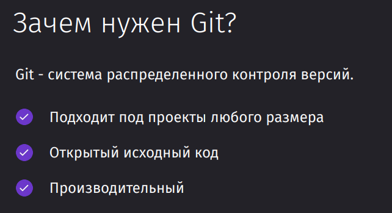
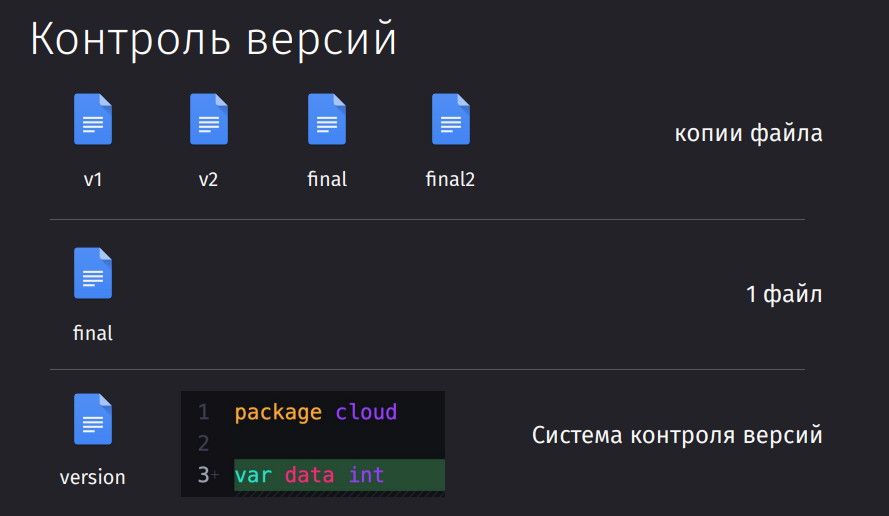
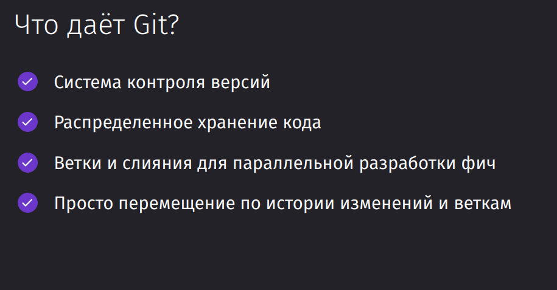

Git - это инструмент для контроля версий кодовой базы

Зачем нужен контроль версий?

- Проблема:
    - Неэффективность хранения копий файлов при изменениях.
    - Сложности с возвратом к предыдущим версиям при работе над одним файлом.
- Решение: Система контроля версий GIT позволяет эффективно отслеживать изменения, сокращая необходимость хранения копий.

Есть много ралзичных интуитивных версий контроля версий файлов:

- Копировать файл
- Вносить все изменения в один файл
- Контролировать изменения внутри файла от версии к версии

Само же использование git предоставляет большое количество плюсов:

Git сейчас нужен всем: от разработчиков до девопсов. Любые системы контроля версий (далее СКВ) практически незаменимы и нужны в любом проекте. Без них никуда не деться. Они позволяют кооперироваться за счёт удалённых репозиториев с другими разработчками, подвязать выполняемые CD пайплайны, отслеживать изменения по задаче в каждой отдельной ветке в последовательности времени.

Основные возможности GIT:

- Локальный контроль версий: Позволяет легко отслеживать и возвращаться к предыдущим изменениям.
- Распределенное хранилище кода:
    - Локальные и удаленные репозитории (например, на GitHub).
    - Удобство параллельной работы над проектом через систему веток и слияний.
