## Базовые понятия

Основной задачей гита является - хранение и отслеживание изменений в проекте (на примере папки с файлами main.go и go.mod, которые являются как файлами, так и представляют из себя отслеживаемый объект, внутри которого меняется код).

==Commit== – это "слепок" проекта на определенный момент времени, содержащий только изменения по сравнению с предыдущим состоянием, а не полную копию файла.
Пример: Создание первого _commit_ с файлами, изменение типа данных в файле `main.go` и фиксация изменений во втором _commit_.

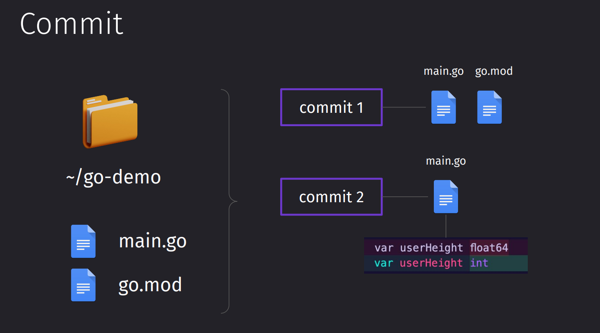

Но сами по себе _коммиты_ не висят в воздухе. Они привязаны к такой вещи, как _ветка_.

==Ветка== – это направление развития проекта, начиная с основной (по умолчанию _main_).
Ветки позволяют разрабатывать новые функции или вносить изменения без воздействия на основной проект до их слияния.

Сама по себе _ветка_ тоже не висит в вакууме. Она уже подвязана под _репозиторий_.

==Репозиторий== – это место, где Git отслеживает изменения в проекте. Инициализация репозитория включает в себя начало отслеживания изменений.

Сам проект не является репозиторием. Репозиторий - это все те файлы, в которых хранятся ветки, коммиты и все остальные побочные элементы гита.

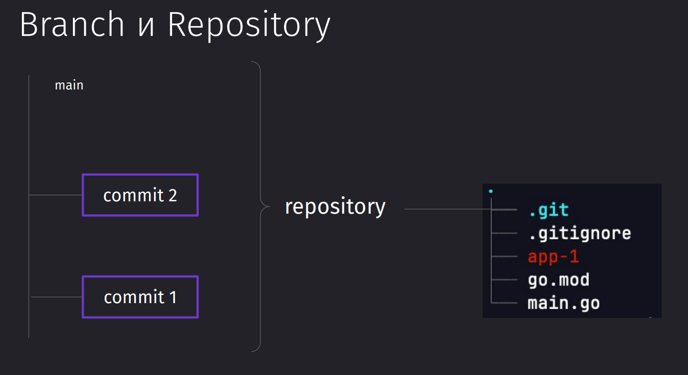

Множество вещей в репозитории репрезентируют то, что находится в нём.

```bash
ls .git
```

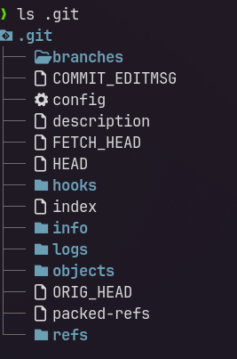

Репозиторий хранится в скрытой папке `.git`. Внутри `.git` хранятся данные о коммитах, ветках и истории изменений проекта.

Веток может быть много. Обычно создаются разные ветки под разные задачи и доменные области. Есть различные [соглашения о коммитах](../Соглашение%20о%20коммитах%201.0.0.md) и [GitFlow](../GitFlow.md)

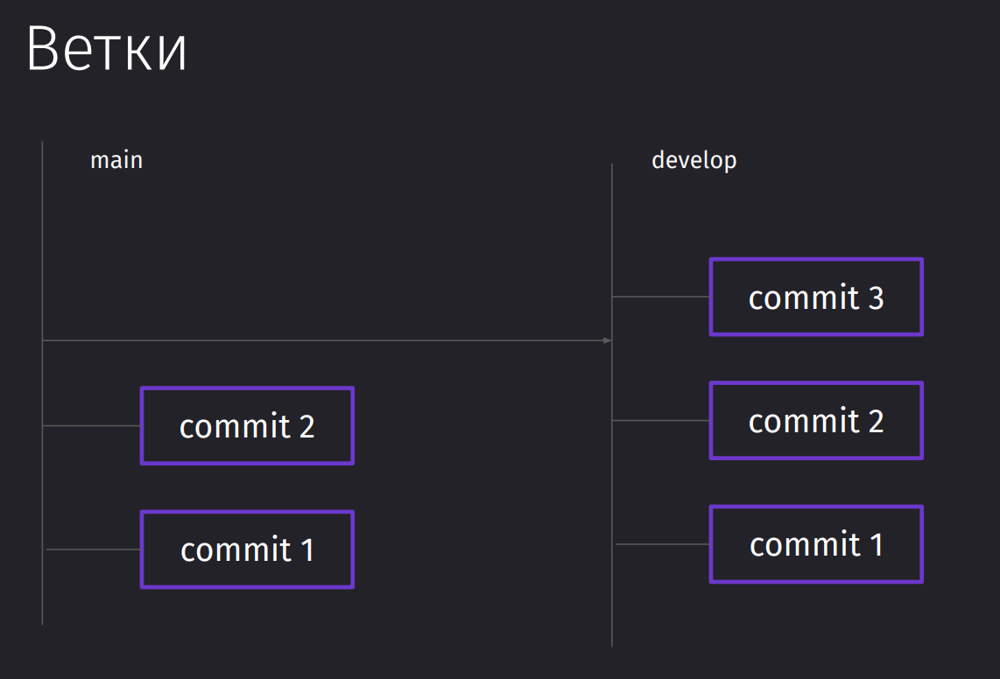

## Установка

Всё по поводу установки можно найти [тут](https://git-scm.com/book/en/v2/Getting-Started-Installing-Git)

## Создание репозитория

Команда для инициализации репозитория проекта. После инициализации гит будет следить за всеми файлами внутри папки и во вложенных папках.

```bash
git init
```

Далее представлена команда, которая выведет текущее состояние.

```bash
git status
```

Пока что все наши файлы в проекте являются непроиндексированными, так как мы их не добавили в список отслеживаемых.

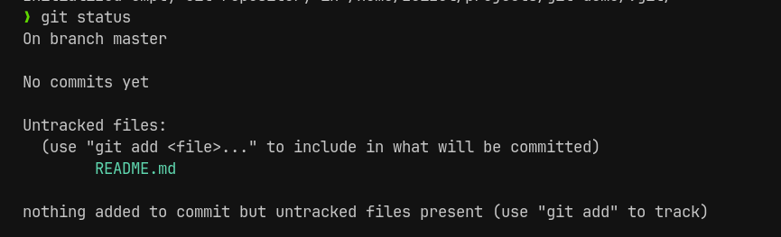

## Git config

Команда `git config` позволяет сконфигурировать вашу рабочую среду гита в системе.

Обязательно нужно будет заполнить поля имени и почты, чтобы вас могли идентифицировать другие пользователи.

```bash
git config --global user.name "Имя_пользователя" # имя пользователя
git config --global user.email "Почта_пользователя" # почта пользователя
git config --global core.editor "vim" # установка дефолтного редактора
```

Чтобы просмотреть все сконфигурированные поля, можно воспользоваться данной командой

```bash
git config --list
```

Ну и так же список глобального конфига можно просмотреть просто через вывод файла `.gitconfig` внутри домашнего каталога

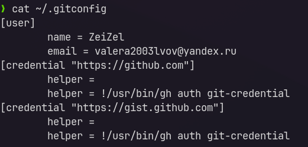

## Первый коммит

Первым делом, когда мы создали новый файл внутри проекта, нужно его подцепить под репозиторий, чтобы гит отслеживал все изменения в файле

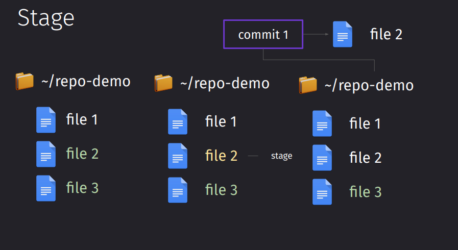

Для добавление файла в отслежиываемые гитом, нужно воспользоваться командой `git add`. Она индексирует и стейджит все файлы, подгатавливая их к коммиту. Индексация добавит файл в репозиторий, а стейдж подготовит информацию о всех изменениях файла (создание/редактирование) в коммит.

```bash
git add README.md
git add .
```

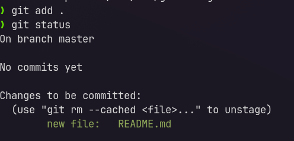

Ну и так же мы можем удалить файл из отслеживаемых через `git rm`

```bash
git rm --cached README.md
```

Чтобы зафиксировать изменения в отслежиываемых файлах, нужно воспользоваться командой `git commit`. Эта команда откроет редактор vim/nano и попросит ввести описание коммита. Можно воспользоваться флагом `-m` и ввести только тайтл коммита. Либо мы можем несколько раз передать `-m` с разными сообщениями, чтобы получить на выходе многострочный коммит.

```bash
git commit -m "тайлт коммита"
git commit -m "Title коммита" -m "Body коммита" -m "Footer коммита"
```

## Git log и checkout

Для того, чтобы просмотреть историю изменений по проекту, мы можем воспользоваться командой `git log`

```bash
git log
```

Она показывает нам идентификатор коммита, на какой ветке он расположен, автора, дату создания и сообщение коммита

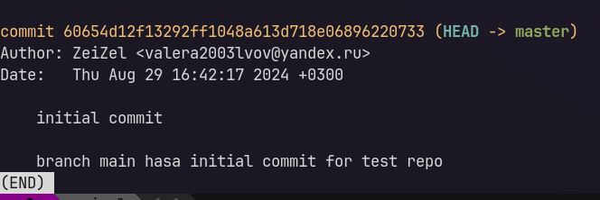

Далее попробуем добавить новый файл `index.md`, проиндексировать его через `git add .` и изменить наш старый `README.md`. До того, как мы заново совершили индексацию, гит просто отображал нам, что у нас есть новый файл (который готов к коммиту) и то, что у нас есть изменения в другом файле (который не был проиндексирован), который не был готов к коммиту.

> [!info] Индексация в целом вносит изменения по созданию и изменению файлов и заносит их все в коммит!

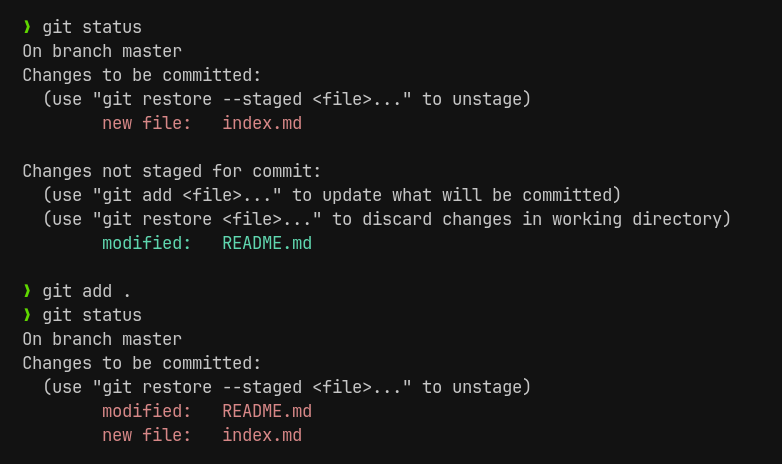

После того, как мы сделали ещё один коммит, у нас он появится в истории

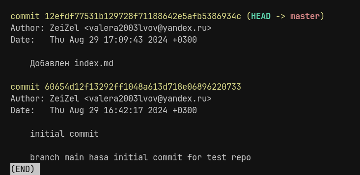

Мы можем перейти на интересующий нас коммит или ветку через `git checkout`

```bash
git checkout 60654d12f13292ff1048a613d718e06896220733
```

И теперь все наши новые файлы, которые мы создали в новом коммите, пропали. Так же мы не видим и новых коммитов, которые мы сделали - ничего нет.

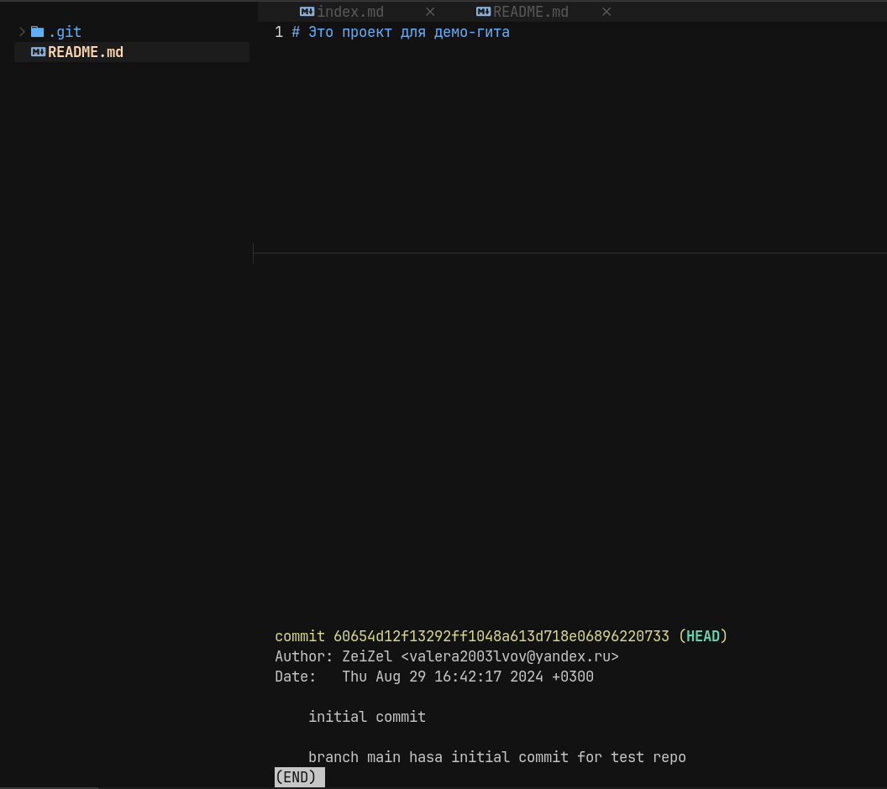

Чтобы вернуться обратно в самый верх наших изменений и увидеть всю историю коммитов, можно просто чекаутнуться обратно в нашу ветку

```bash
git checkout master
```
