## Ветки

Ветки нам нужны для того, чтобы вести разработку нескольких фич в разных версиях проекта. Так же под ветки можно подвязать с помощью инструментов CI/CD различные пайплайны, которые будут выполняться перед пушем, во время пуша и после пуша. Например, сборка проекта и выкладка на сервер.

Данная команда выведет все ветки проекта. Текущая ветка помечается звёздочкой.

```bash
git branch
```

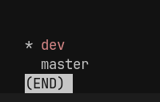

Далее нам нужно создать новую ветку. При создании новой ветки, мы копируем коммиты текущей ветки в новую и присваиваем ей другое название. Чтобы создать ветку, нам нужно воспользоваться следующей командой:

```bash
git branch dev
```

Чтобы перейти к нужной ветке, нужно воспользоваться чекаутом

```bash
git checkout dev
```

Так же можно сразу создать и перейти в другую ветку одной командой

```bash
git checkout -b dev
```

При совершении изменений в проекте, мы увидим, что в данной ветке у нас HEAD располагается на последнем коммите нашего бранча. Но так же мы имеем и все прошлые коммиты из стартового бранча на момент создания текущей ветки.

Все новые коммиты этой ветки остаются только в этой ветке.

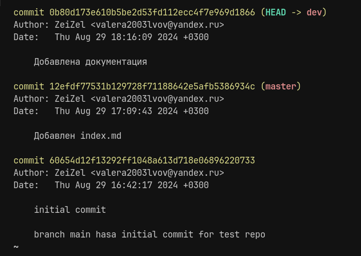

## Слияния

Слияние - это механизм объединения веток в гите. Он позволяет нам соединить изменеия, которые мы выполнили в одной ветке с другой. Грубо говоря, мы переносим коммиты из нашей рабочей ветки в целевую с проектом.

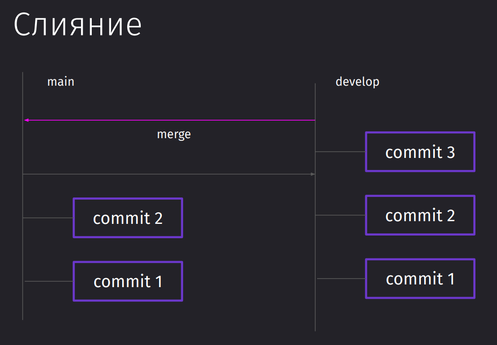

Цель: слияние веток dev и master.

Чтобы влить изменения в нужную нам ветку, нужно сначала в неё перейти.
И далее нам нужно будет воспользоваться командой `merge`, которая объединит ветки

```bash
git checkout master
git merge dev
```

После этого можно будет увидеть, что HEAD веток master и dev находятся на одном и том же коммите

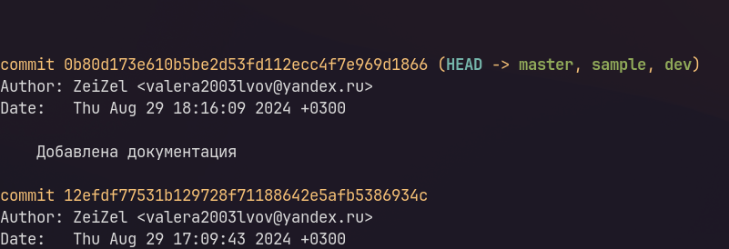

## HEAD

HEAD – это указатель в Git, который показывает на текущий коммит в репозитории. Это коммит, от которого будут создаваться дальнейшие изменения или коммиты.

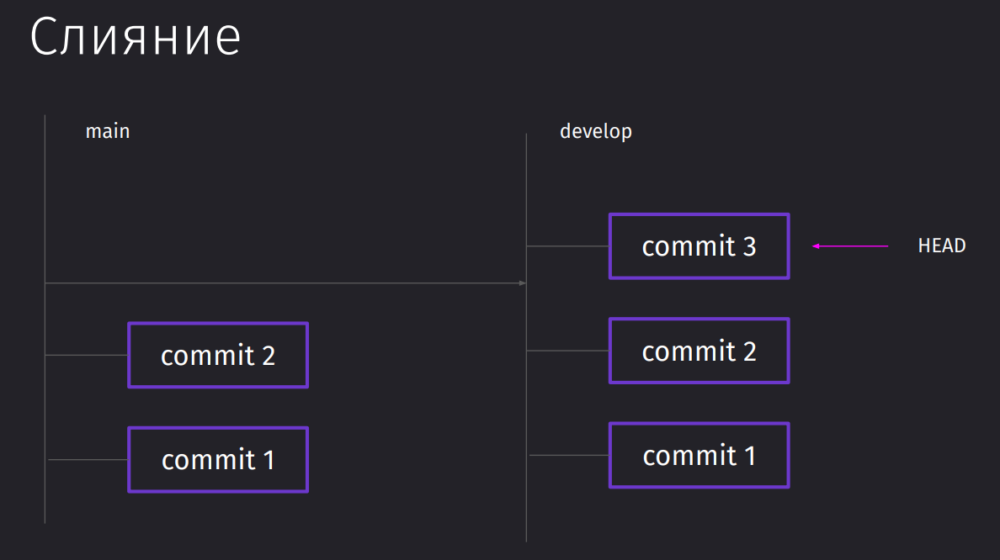

Когда мы переключаемся между ветками с помощью `git checkout`, HEAD автоматически указывает на последний коммит выбранной ветки. То есть тут происходит неявное перемещение указателя на заголовный коммит ветки.

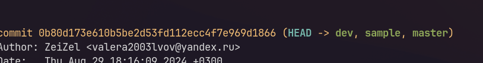

Так же у HEAD есть состояние Detached, которое появляется в том случае, когда мы чекаутимся на определённый коммит, а не ветку.

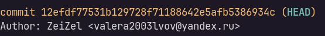

Так же посмотреть на то, где находится сейчас HEAD можно с помощью просмотра содержания файлика HEAD

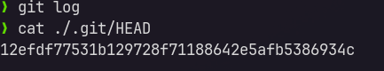

После чекаута в ветку наш HEAD теперь смотрит на последний коммит нашего бранча

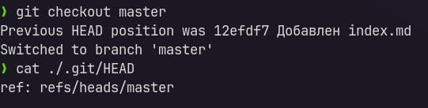

## Теги

Теги - это лейблы, привязываемые к конкретным коммитам.

Они используются для аннотации коммитов с дополнительной информацией или наименованием версий.

Теги часто применяются для сборки релизов в проектах с настроенной интеграцией и доставкой (CI/CD).

Например, мы можем использовать теги для:

- сбора релиза может использоваться определённый тег.
- автоматизационных утилит, которые могут привязываться к тегам, а не к веткам или названиям коммитов

Чтобы добавить автоматически тег на наш последний коммит, мы можем воспользоваться следующей командой:

```bash
git tag 1.0.0
```

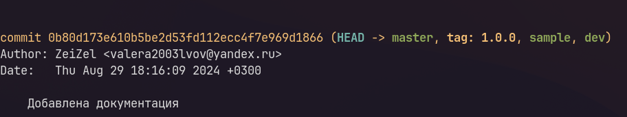

Чтобы получить список тегов, можно воспользоываться:

```bash
git tag
```

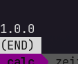

Так же ничто нам не мешает чекаутнуться к тегу. Однако у нас так же будет Detached HEAD из-за того, что мы перейдём к определённому коммиту.

```bash
git checkout 1.0.0
```

## Switch

Так же существует команда чисто для чекаута между ветками

```bash
git switch <branch>
```

Так же мы можем переключаться с помощью этой команды и по тегам между коммитами

```bash
git switch --detach <tag>
```

Так же с помощью флага `-c` мы сможем создать новый бранч

```bash
git switch -c new-feature
```
