## Удаление

### Базовое удаление

Чтобы удалить файл из нашего репозитория, мы можем удалить файл руками. В таком случае при просмотре `git status` наш файл будет помечен как удалённый. Далее мы индексируем изменения, коммитим и пушим их.

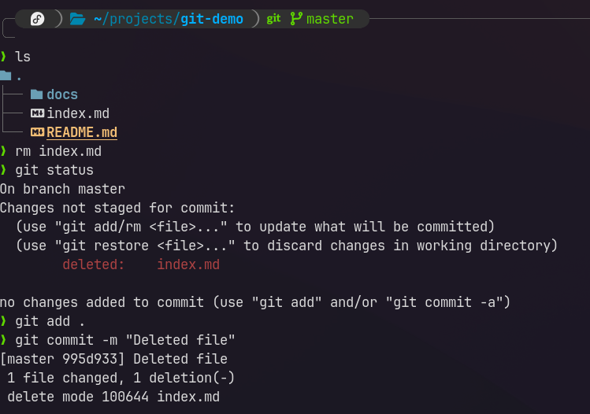

### Восстановление файла

Далее мы случайно удалили уже другой файл вместе с предыдущим. Его удалять мы не хотели.

Чтобы восстановить файл обратно, мы можем воспользоваться командой `restore`.

1. Если мы не проиндексировал изменения, то можем воспользоваться просто `restore`
2. Если мы воспользовались уже `git add .`, то нам нужно будет воспользоваться рестором сначала с флагом `--staged`, а потом повторно без флага. В первый раз мы убираем из зафиксированных изменений удаление, а во второй раз восстанавливаем удалённый файл.

```bash
git restore README.md
```

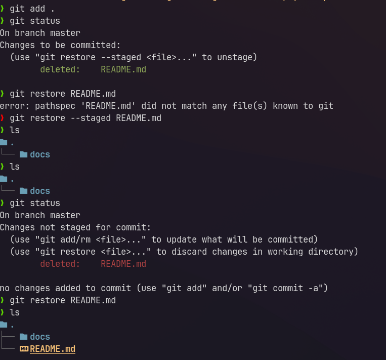

### Быстрое удаление

Первым делом, познакомимся с командой, которая выводит файлы, которые трекает гит. `ls-files` выведет файлы из структуры проекта, которые отслеживает гит.

```bash
git ls-files
```

Команда `rm` позволяет быстро удалить файл из проекта и из репозитория сразу с занесением в staged (aka использование `add .` из коробки)

```bash
git rm README.md
```

И мы получаем примерно такую структуру, когда файл сразу удаляется и изменение записывается в репозиторий.

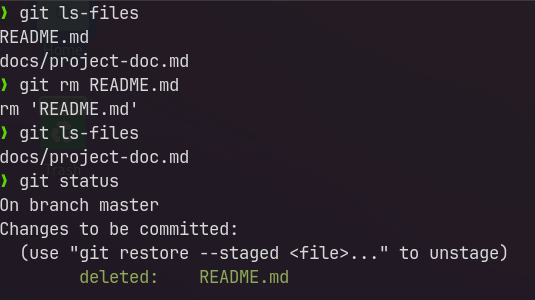

## Откат изменений

Команда `restore` восстанавливает файл до тех изменений, которые были совершены после последнего коммита. Грубо говоря, он отменяет совершённые изменения над файлом.

Такую же силу имеет и выполнение над файлом команды `checkout`

```bash
git restore <файл>
git checkout <файл>
```

Например, мы поменяли файл `docs/project-doc.md`

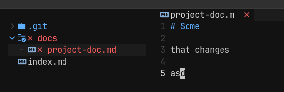

И теперь можем откатить новые изменения через

```bash
git checkout ./docs/project-doc.md
git restore ./docs/project-doc.md
```

Так же если дёрнуть просто `.`, то мы откатим все изменения до последнего коммита

```bash
git checkout .
```

Так же мы можем очистить в директории все те изменения, которые мы не застейджили (`add`) с помощью команды `clean`

С помощью флагов `-dn` можно посмотреть, что будет удалено
С помощью `-df` можно удалить сами незатреканные файлы

Если мы уже затрекали файл, то нам останется только

```bash
git clean
```

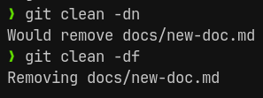

## Vim

Вся навигация по виму описана [тут](../../../tools/Terminal.md)

Установка в качестве дефолтного редактора

```bash
git config --global core.editor "vim"
```

Для перехода к редактированию сообщения через vim, нужно будет воспользоваться командой коммита без параметров

```bash
git commit
```

## Amend

Команда `amend` позволяет изменить сообщение последнего коммита, который не был отправлен на удалённый репозиторий.

Если бы мы его уже отправили, то нужно было бы использовать `push --force`

Лог нам выводит такое последнее сообщение:

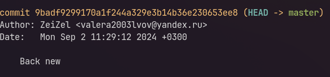

Выполняем операцию обновления коммита

```bash
git commit --amend -m "create new file of docs"
```

И имеем обновлённое описание

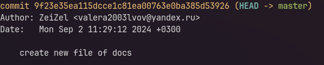

Далее, если мы занесём изменения в сам файл, но не хотим менять сообщение коммита, то можно сделать так:

```bash
git commit --amend --no-edit
```

Сейчас мы _изменили сам файл_ (с документацией) и добавили его к изменениям в прошлом коммите

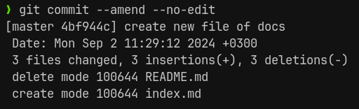

`amend` позволяет обновить как сообщение, так и изменения, которые мы внесли в файлы последнего коммита

## Reset

Команда `reset` позволяет откатить коммит тремя разными способами

- Обычный откат. Сохранит изменения и сделает их все _unstaged_ (нужно будет вызвать `add`)
- `--soft` - мягко откатывает. Сохраняет изменения, но удаляет сам коммит. Сами по себе изменения останутся в _staged_
- `--hard` - жёстко откатывает. Удаляет и изменения и коммиты.

Сразу нужно сказать, что все операции над коммитами и свичём между ними можно выполнять не с помощью задания хеша коммита, но и с помощью конструкции `HEAD~<количество>`, которая откатит на определённое количество коммитов от `HEAD`.

Добавили и закоммитили файл

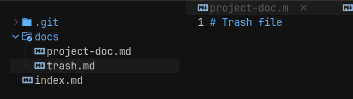

Выполняем просто `reset` до прошлого коммита и наши изменения остались в проекте а коммит удалился

```bash
git reset HEAD~1
```

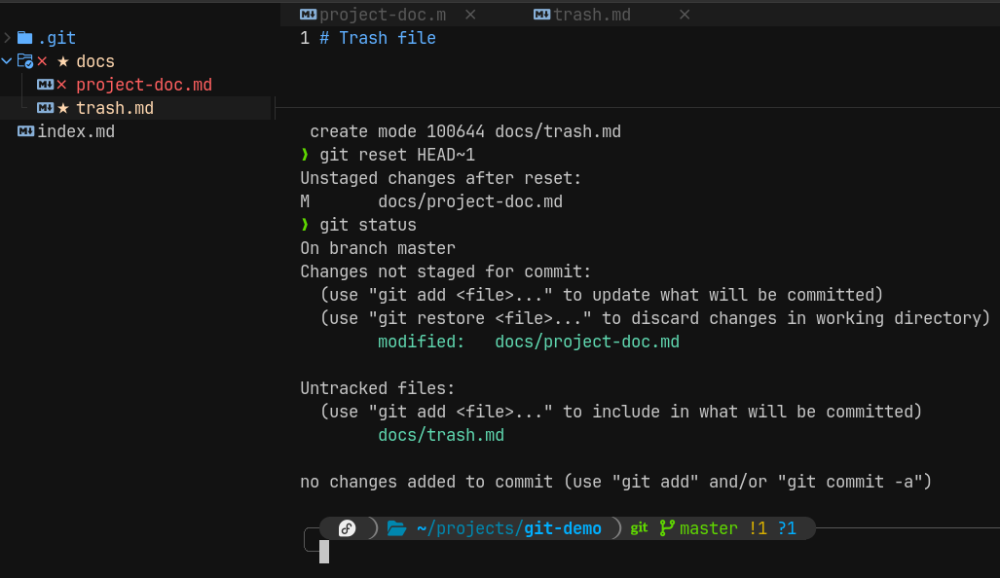

Далее деляем мягкий `--soft` откат, который сохранил изменения в стейдже и удалил ветку

```bash
get reset --soft HEAD~1
```

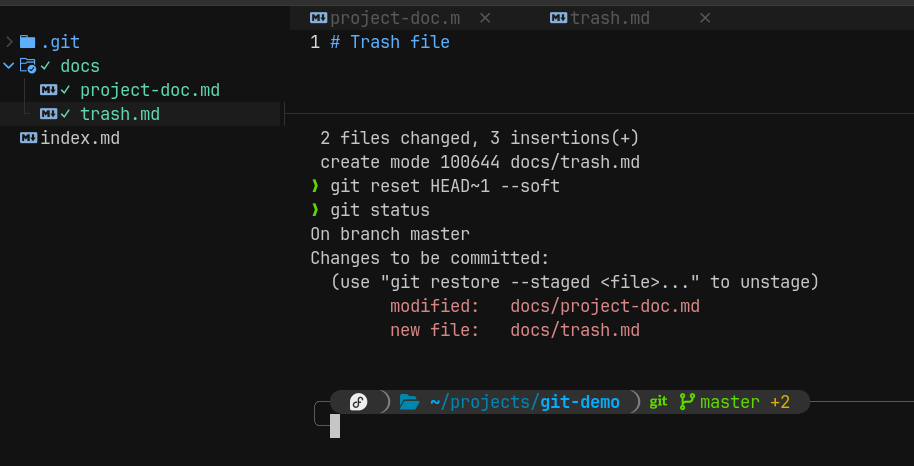

Далее выполяем `--hard`, который сотрёт сам коммит и изменения, которые в нём были

```bash
git reset --hard HEAD~1
```

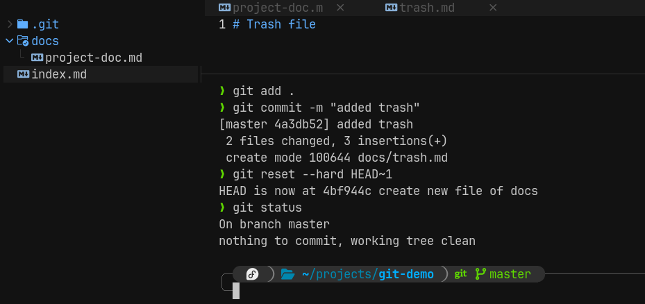

## Удаление веток

Для удаления ветки нужно воспользоваться командой `branch` с тегом `-d`/`--delete`

```bash
git branch --delete ВЕТКА
```

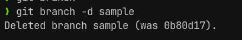
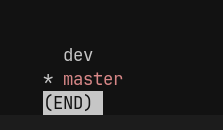

После удаления ветки, удаляются и все коммиты связанные с ней. Обычно мы удаляем ветки, когда выполнили связанную с ней задачу, влили в мастер и теперь она нам не нужна. Важно удалять своевременно ветки, чтобы не сорить в проекте и поддерживать чистоту.

## Detached commit

Явление, как `Detached commit` исходит из `Detached HEAD` и происходит тогда, когда от отсоединённого хеда мы делаем коммит.

Первым делом нам нужно перейти в интересующий нас коммит

```bash
git checkout 12efdf77531b129728f71188642e5afb5386934c
```

И все инстурменты говорят нам, что мы находимся в режиме отцеплённой головы

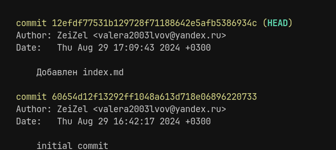

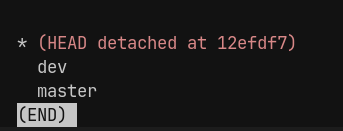

Попробуем добавить новый файл и закоммитить его и получаем отцеплённый коммит

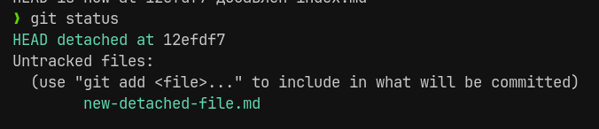

После свича в мастер, гит нас предупреждает, чтобы не потерять изменения, нужно будет создать ветку по коммиту временной ветки, которую создал гит для отцеплённого HEAD

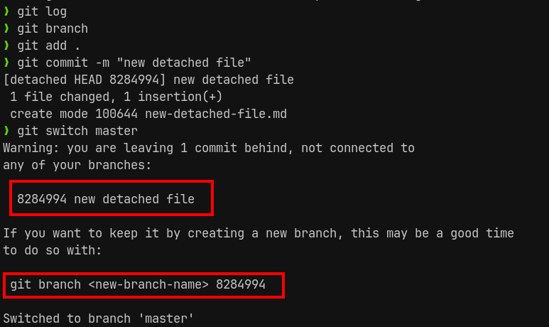

Добавляем ветку по отцеплённому HEAD

```bash
git branch chore/added-docs-file 8284994
```

И получаем новую ветку с нашими изменениями

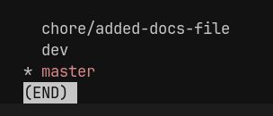

И теперь можно будет смёрджить ветку с нужной нам

```bash
git merge chore/added-docs-file
```

## Решение конфликтов

Конфликт - это ситуация, когда в обоих коммитах был изменён один и тот же файл и гит не понимает, какой из них нужно принять. В данном случае нам нужно будет выбрать, какой файл оставить либо объединить файлы самостоятельно ручками и перенести нужные нам участки кода туда, где они должны распологаться в итоговом файле.

Если мы смёрджили ветки, но не хотим решать конфликты, то можно откатить последний мёрдж

```bash
git merge --abort
```

И далее, чтобы решить конфлиты, нам нужно будет удалить маркеры и оставить только те изменения, которые нам нужно оставить в файле. Верхний маркер `<<<` показывает изменения из родительской ветки, через `===` мы делим изменения из двух веток, а уже последний маркер `>>>` показывает окончания новых изменений, которые прилетели нам извне.

Решать конфликты удобно через редакторы и IDE, которые покажут удобный вывод, но так же можно и через консоль их решить, если мы сами удалим все маркеры и расставим код, как нужно нам.

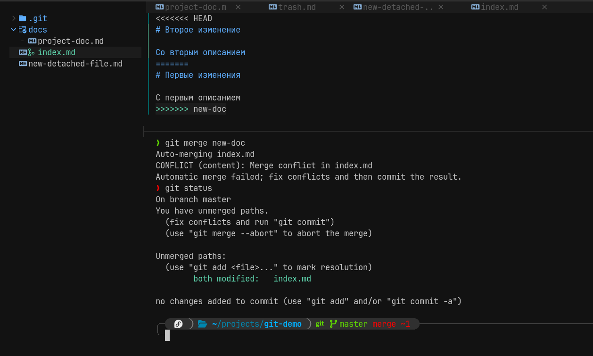

После удаления маркера конфликта и стейджа изменений, конфликт оказался решён отдельным коммитом

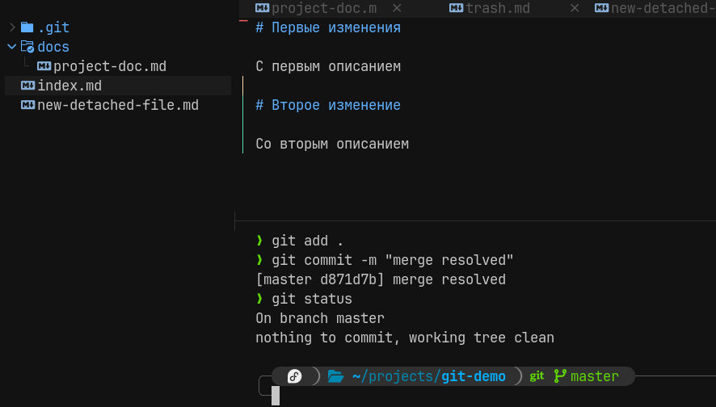

Так же мы можем решить конфликт с помощью GUI-утилиты из гита

```bash
git mergetool
```

## Gitignore

`.gitignore` - это файл, который описывает игнорируемые файлы и папки проекта.

`.gitignore`

```bash
node_modules # будет игнорировать папку и все вложенные файлы
log.txt # будет игнорировать определённый файл
/*.txt # будет игнорировать все файлы с расширением .txt в первом уровне проекта (во вложенных папках игнорировать не будет)
/logs/* # будет игнороировать все файлы в папке, но не саму папку
!/logs/*.md # удаляет из игнорирования все файлы из папки по паттерну `*.md`

# ! - инвертирует выделение файлов
```

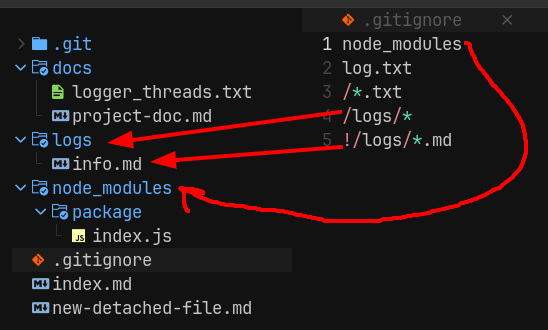

## Gitkeep

`.gitkeep` - это искусственный файл, который создают разработчики для сохранения пустых папок.

Самым простым решением, которое приходит людям в голову - это создать файл `fake.txt` за счёт которого не будет удаляться папка, но это приводит к тому, что не понятно для чего существует этот файл в папке.

Среди разработчиков пошла договорённость создавать файл `.gitkeep`, который мы добавляем в исключения `.gitignore` и уже с помощью него мы сохраняем пустые папки.

Сами по себе пустые папки иногда нужно сохранить, когда она нужна для других механизмов приложения, но в режиме разработки в ней ничего нет. Обычно такие папки добавляют, когда какие-то инструменты ломаются при отсутствии папки (не предусмотрена проверка наличия и создания папки).

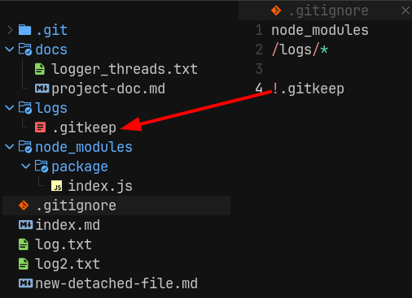
