## Stash

`stash` - это команда, которая позволит сохранить внесённые в проект изменения без отдельного коммита

Применить стеш можно только в том случае, когда у нас `status` полностью чист (текущие изменения закоммичены)

```bash
# создание стеша
git stash # сохранит изменения в стеш
git stash push -m "Work in progress..." # сохранит в стеш с комментарием

# вывод списка
git stash list # выведет список стешей

# применение стеша
git stash apply # применит самый последний стэш
git stash apply 1 # применит стеш по определённому идентификатору

# очистка стеша
git stash pop 1 # применит и удалит стеш
git stash clear # очистит все стеши
```

Индексируется каждая запись сверху вниз, то есть самая новая получает индекс 0 и автоматически применяется при `apply`.


> [!summary] Стеш нужен для перемещения изменений из одной ветки в другую или временно их убирать.

## Reflog

Все потерянные коммиты, которые были созданы в detached HEAD или были удалены через `reset --hard` - не теряются. Всех их можно найти через `reflog`.

> [!note] Reflog хранит список всех действий из гитом в текущем репозитории.

Например, после отката через `--hard` мы не теряем коммит прямо сейчас и насовсем. Git хранит удалённые изменения в течение 30и дней и даёт нам возможность их восстановить.

```bash
git reflog
```

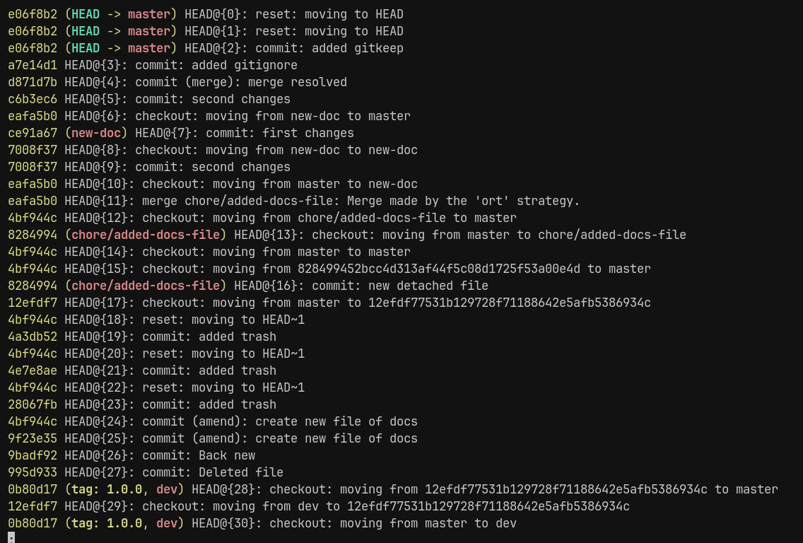

Чтобы восстановить удалённый коммит, мы можем воспользоваться командой сброса, но добавив в конец хэш с нашим коммитом. Это восстановит удалённый коммит.

```bash
git reset --hard 9743fd7
```

Так же мы можем восстановить целиковую удалённую ветку. Восстановить её нам удастся, если мы перейдём на её последний коммит, попадём в detached HEAD и создадим от него новую ветку. Что описано [тут](5.%20Удаление.md).


## Fast-forward merge

FFMerge - это событие, когда мы вливаем изменения из дочерней в родительскую, когда в родительской не было никаких новых изменений и коммитов. В таком случае из дочерней ветки будут перемещаться коммиты сверх родительского и нам самый свежий поставится HEAD


И в результате такого слияния, будет написано сообщение об FF merge

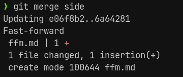

Так же мы можем отключить `--no-ff` слияние

```bash
git merge --no-ff ВЕТКА
```

## Recursive merge

Рекурсивный мёрдж - это уже событие, когда в родительской ветке, куда мы сливаем изменения, уже есть коммиты после того, что был в дочернем.


В таком случае уже будет создаваться отдельный коммит, на который и повесится HEAD.


В таком случае, merge будет осуществлён по `ort` стратегии

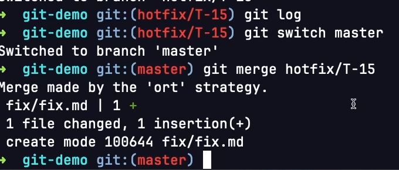

## Squash

Squash - это объединение нескольких коммитов в один. Этим иснтрументом мы можем объединить излишние коммиты в один и не мусорить в истории репозитория

То есть мы подтянем все изменения из другой ветки в нашу, но они попадут не в качестве коммитов, а просто в виде изменений, которые нам нужно будет потом закоммитить

```bash
git merge --squash ВЕТКА
```

И примерно таким образом будет выглядеть работа с получением новых данных:

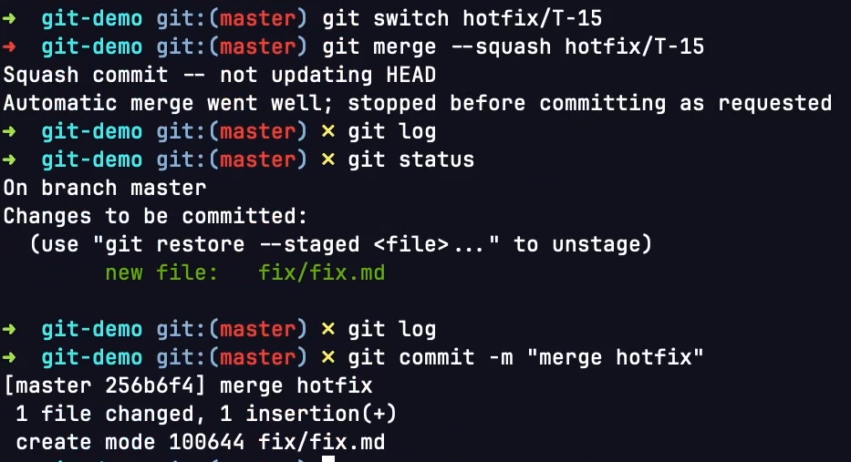

## Rebase

Rebase - это механизм, который переносит историю одной ветки в другую. Позволяет перенести изменения в другую ветку более чистым образом не прибегая к излишнему ветвлению и замусориванию истории.

Это может понадобится в случае, когда нам нужно будет базировать все наши будущие коммиты на новом коммите из родительской ветки


Rebase позволит нам перенести базовый коммит из ветки с нужным коммитом в нашу и базировать следующие коммиты на нужном нам коммите


Но чтобы новый коммит базировался на нужном нам коммите, мы должны пересоздать последний коммит (3) с теми же изменениями и с новым идентификатором

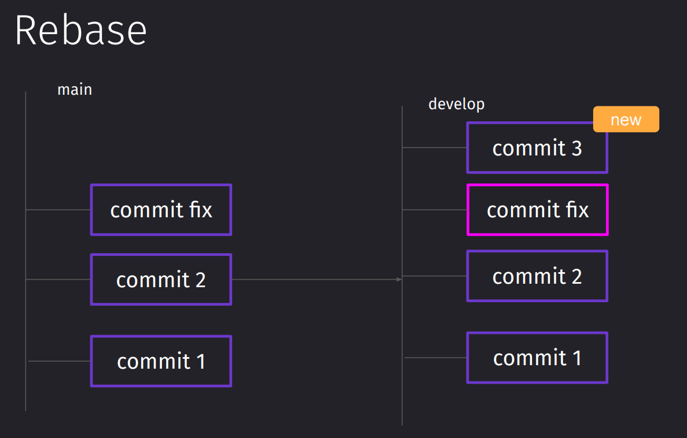

Примерно так выглядит история коммитов в дочерней ветке

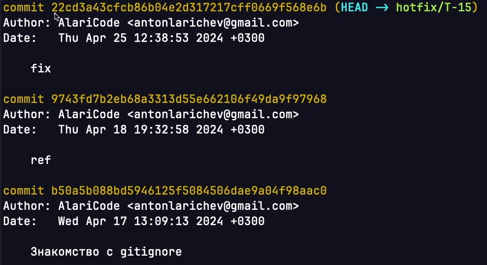

Совершаем `rebase` с мастера в этой ветке

```bash
git rebase master
```

И теперь у нас до последнего коммита идёт самый последний коммит из мастера. Тут стоит обратить внимание, что идентификатор коммита изменился, так как гит пересоздал его полностью.

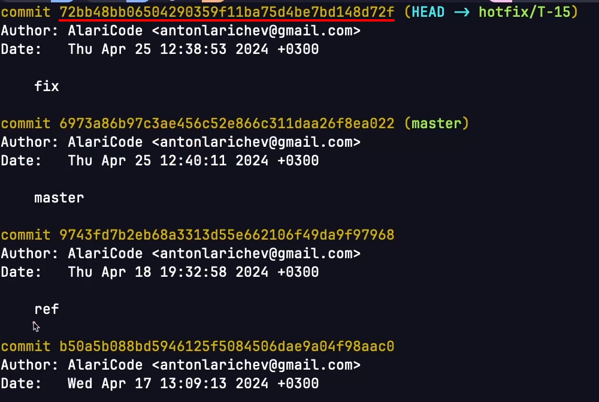

И сейчас при мёрдже у нас произошёл FFMerge, а не рекурсивный, так как наш последний коммит в дочерней ветке базируется на последем родительским.


> [!danger] Однако если мы работаем с удалённым репозиторием, то `rebase` будет в целом перезаписывать историю изменений, что может стереть множество коммитов. Данный механизм работы присущ для локальной работы.

## Cherry-pick

Cherry-pick - это мехнизм выборочного применения коммитов из одной ветки в другую, избегая необходимости слияния всех изменений.

В процессе внесения изменений в ветку разработки, мы поняли, что нам нужно перенести коммит 3 в main, но пока коммит 4 нельзя переносить

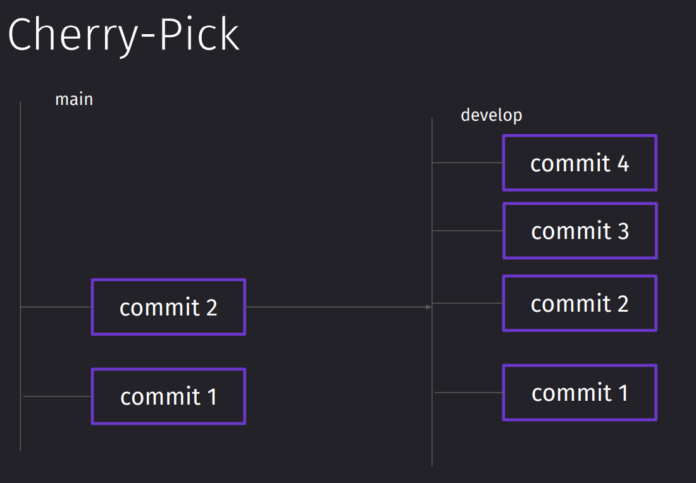

В таком случае, нам может пригодиться cherry-pick, которым мы перенесём в main только один коммит, а не сразу все изменения из другой ветки.

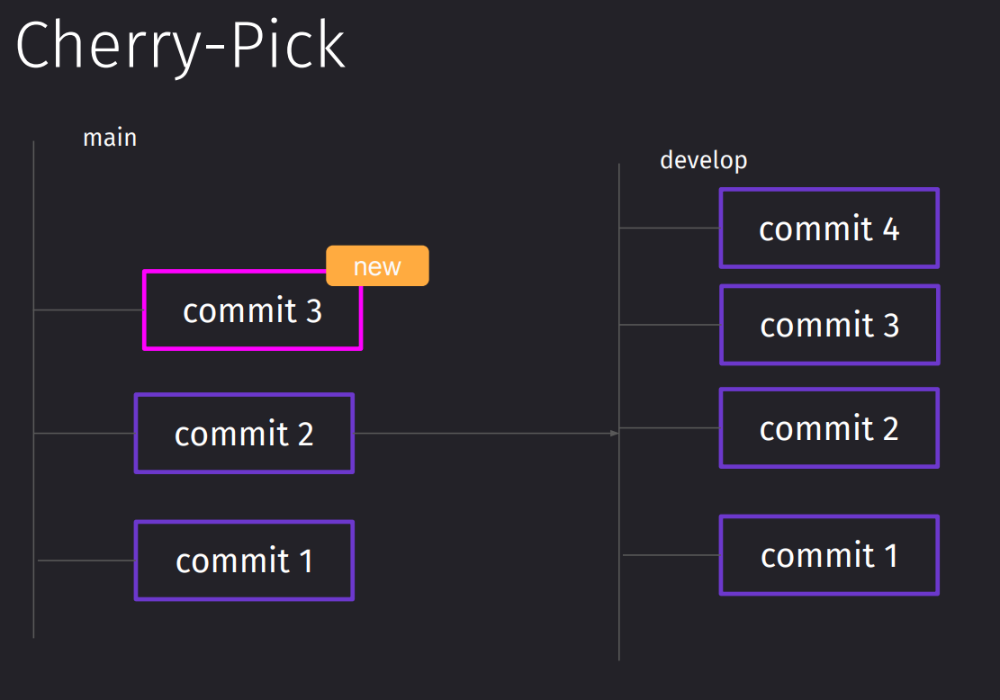

Представим такую ситуацию:

Мы работали в ветке, но потом нам потребовалось перенести коммит _master fix_ в ветку `master`

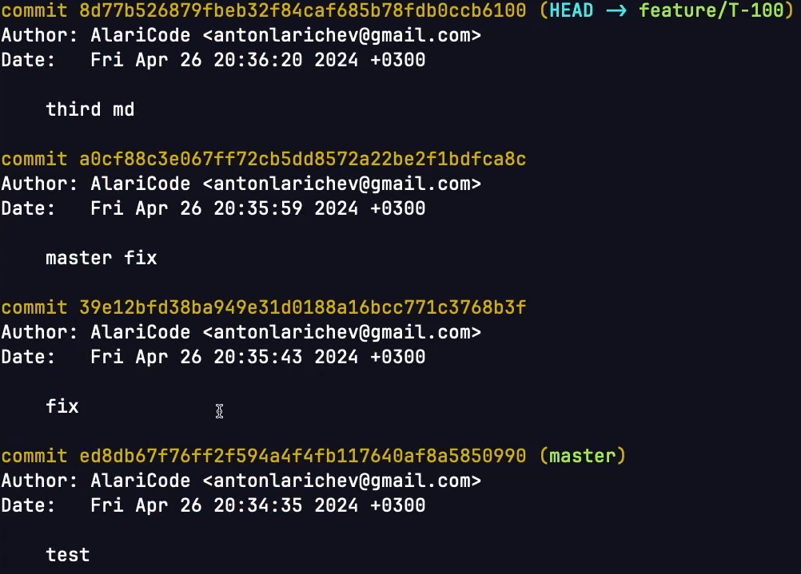

Далее переходим в мастер и выполняем команду черри-пика

```bash
git cherry-pick [идентификатор коммита]
```

Которая перенесёт определённый коммит в нужную нам ветку


Мастер получил нужный коммит, но у него теперь поменялся идентификатор

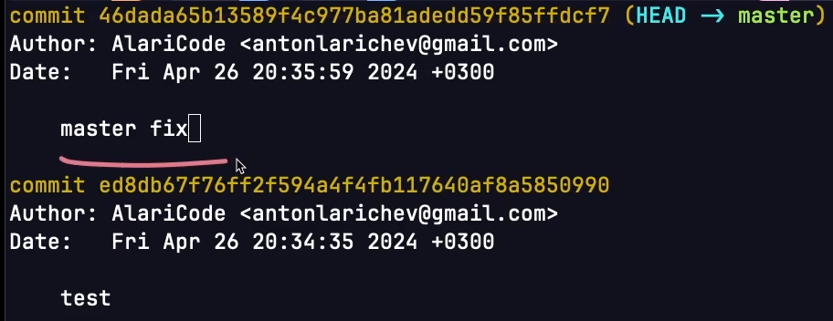
