## Удалённые репозитории

Удалённый репозиторий - это сервис, который будет хранить все изменения не локально на нашем компьютере, а на удалённом устройстве.

Это даёт нам:
- Дополнительную безопасность в том случае, если мы сотрём проект на нашем локальном устройстве
- Возможность разрабатывать совместно в несколько лиц

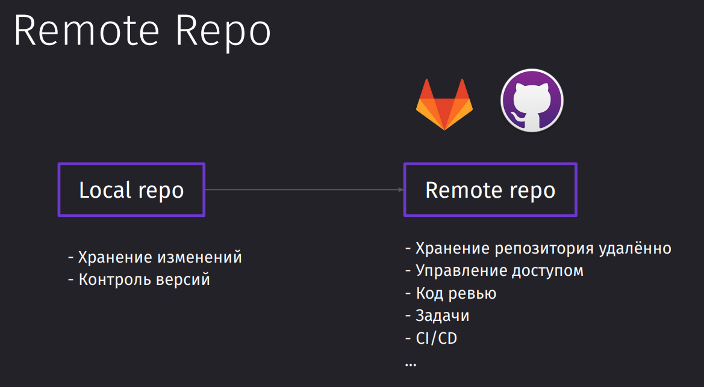

## Создание репозитория

При создании репозитория можно выбрать:
- Владельца (профиль/организация)
- Имя репозитория (уникальное для владельца)
- Описание
- Доступность видимости
- Начальный README\
- Начальный гитигнор
- Выбор типа лицензии

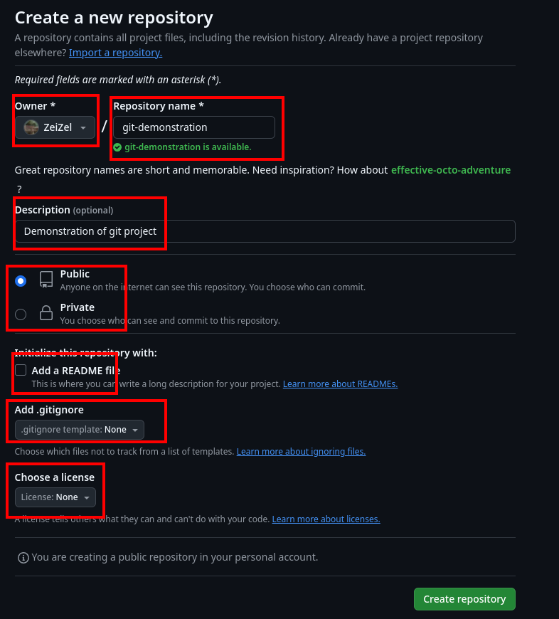

Дабы подключиться к интересующему нас репозиторию, нам нужно будет выполнить команду над удалённым репозиторием `remote` и добавить `add` сам репозиторий по имени `origin`, который будет распологаться по ссылке, указывающей на этот удалённый репозиторий.

```bash
git remote add origin https://github.com/ZeiZel/git-demonstration.git
```

Далее нам нужно будет воспользоваться командой для отправки репозитория на удалённый сервер `push`, в которой нужно будет указать основное имя удалённого репозитория `origin` а затем указать имя отправляемой ветки

```bash
git push -u origin master
```

Но, если мы создали приватный репозиторий, то доступа отправлять на него запросы по https - у нас нет.

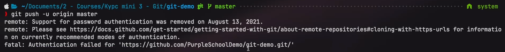

## Создание SSH-ключа

SSH-ключи нужны для безопасного взаимодействия между локальным и удалённым репозиторием. SSH предоставляет [доступ и права](../../../devops/Linux/OS/_lessons/Доступ%20и%20права.md) для безопасного выполнения команд на удалённой машине.

- SSH-ключ: состоит из приватной и публичной части, позволяет безопасно отправлять изменения в удаленные репозитории.
- Приватный ключ: хранится на локальной машине и используется для аутентификации.
- Публичный ключ: размещается на сервере или сервисе (например, GitHub), подтверждает, что изменения отправлены именно вами.

Первым делом нужно создать новый ключ. Сгенерировать его можно с помощью дефолтной утилиты системы.

```bash
ssh-keygen
```

При создании ключа стоит сохранить его с предлагаемым наименованием (обычно `id_rsa` или `id_ed`) для удобства.

Можно пропустить ввод парольной фразы (passphrase) для простоты, хотя она добавляет дополнительный уровень безопасности на случай того, если наш секретный ключ узнали.

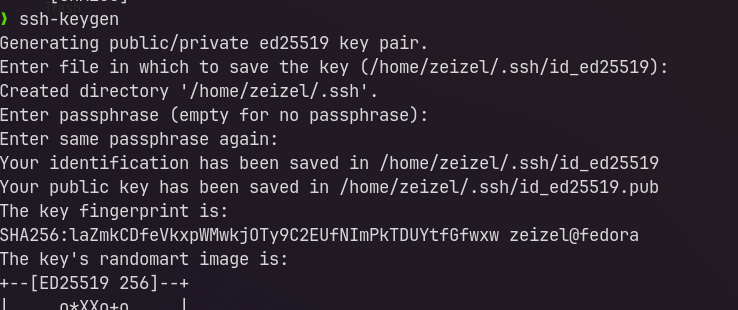

Публичная часть ключа (`id_ed.pub`) может делиться с сервисами типа GitHub для идентификации
Приватная часть (`id_ed`) остаётся у вас и не должна передаваться никому.

На примере гитхаба, создание SSH-ключа будет выглядеть следующим образом:

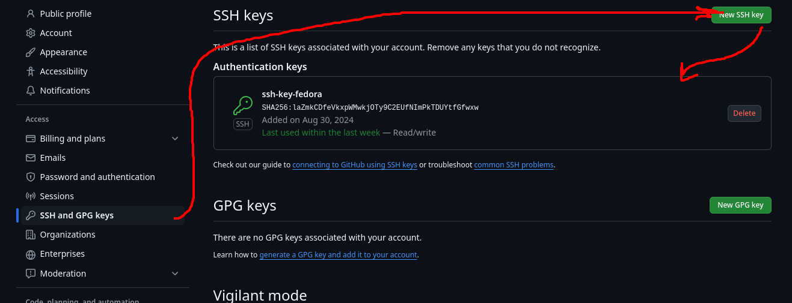

И в поле ==key== при создании ключа, мы должны будем добавить сгенерированный fingerprint (который есть в выводе сверху)

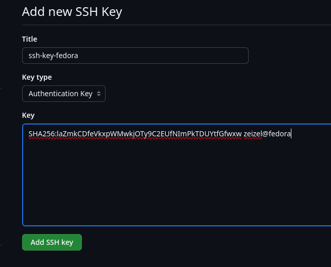

После всех действий мы наконец можем клонировать проекты по SSH и пушить в них изменения

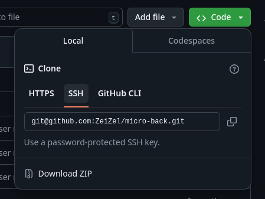

> [!danger] **Важно**: Если публичный ключ мы можем предоставлять любому сервису, то уже с приватной частью ключа следует обращаться аккуратно, не распространять и не хранить в общем доступе.

## Git Remote

Команда `get remote` позволяет работать с удалёнными репозиториями

Первым делом получим список удалённых репозиториев. Пока что мы тут получим только *origin*

```bash
git remote
```

Далее узнаем url на свой репозиторий. Тут у нас стоит пока https-соединение, которое нужно будет заменить на ssh.

```bash
git remote get-url origin
```

А уже потом заменим подключение на ssh, чтобы работать полностью в рамках него, а не только через ssh-ключик.

```bash
git remote set-url origin git@github.com:ZeiZel/git-demonstration.git
```

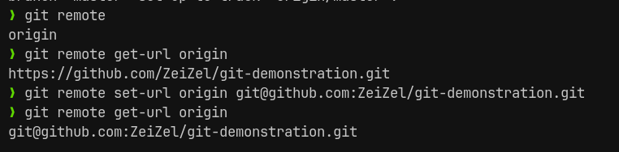

И теперь у нас есть доступ к пушу изменений на удалённый репозиторий

```bash
git push -u origin master
```

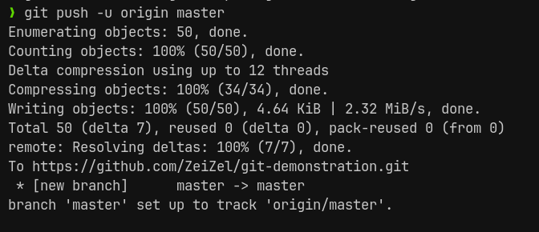

## Отправка новых изменений

При создании нового коммита можно заметить, что у нас добавилась новая ветка `origin/master`, которая уже отвечает за ветку, совместимую с нашей, но которая находится на удалённом репозитории.

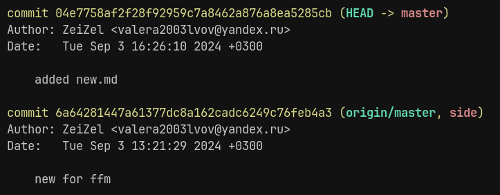

С помощью команды `push`, мы отправляем наши сделанные коммиты на удалённый репозиторий `origin` (который мы определили ранее) 

```bash
git push
```

И все коммиты находятся в нашей истории коммитов

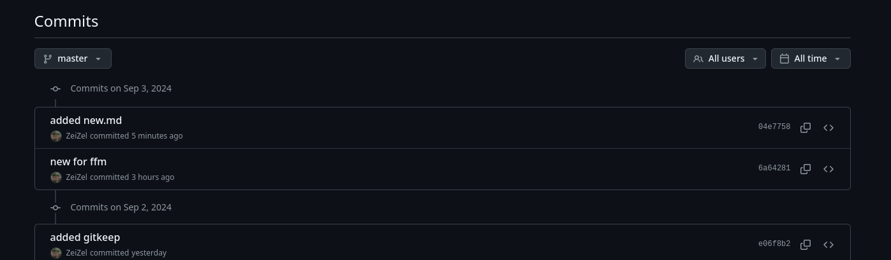

С помощью `branch` с флагом `--all` можно просмотреть так же и удалённые ветки

```bash
git branch -a
```

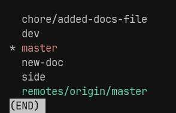

## RTB - Remote tracking branches

Прцоесс отправки локальных изменений в удалённый репозиторий происходит не простым копированием из локального репозитория на удалённый. Всё происходит через посредника в виде tracking branch.

tracking branch (TB) - это представление удалённого репозитория локально.
`remote` - удалённая / `origin` - название удалённого репозитория / `master` - наша основная ветка. Из этого представления изменения отправляются на удалённый сервер ==remote== 

Когда мы пушим через `git push`, мы закидываем изменения в TB, который отправляет изменения на сервер.

Когда мы выполняем `git pull` (подтягиваем изменения с сервера), мы подтягиваем список изменений в наш TB и потом объединяем изменения с локальным репозиторием. 
Когда мы выполняем `git pull`, то у нас под капотом выполняются `git fetch` на первом этапе (подтягивание изменений с ==remote==), а потом `git merge` (объединение списка изменений с нашим локальным репозиторием).

Сам TB отслеживает изменения и сообщает о конфликтах

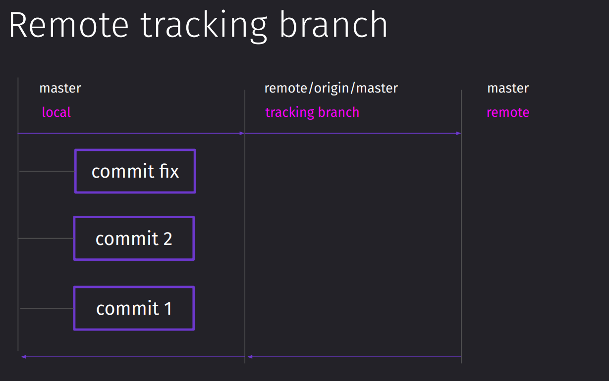

#### Пуш новой ветки

Когда мы попытаемся запушить дев ветку в первый раз на удалённый репозиторий, нам там так же придётся создавать представление dev ветки для нашего удалённого репозитория 

```bash
git push origin dev
```

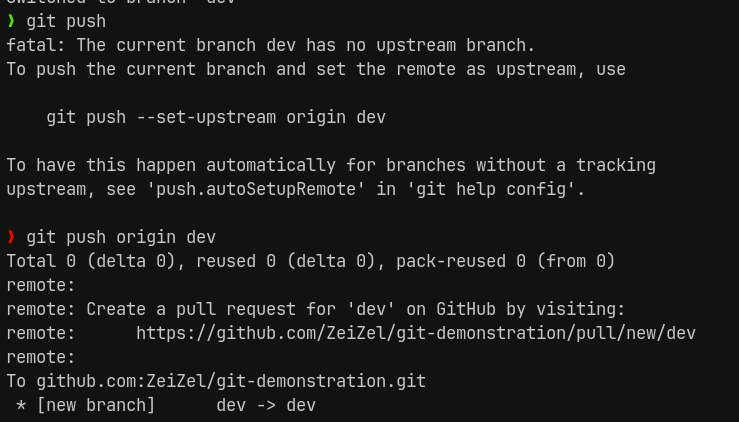

#### Подтягивание удалённых изменений

Представим, что другой разработчик создал новую ветку и работает теперь в ней. Чтобы просмотреть изменения по веткам, нужно будет воспользоваться командой для отслеживания изменений в RTM

```bash
git fetch
```

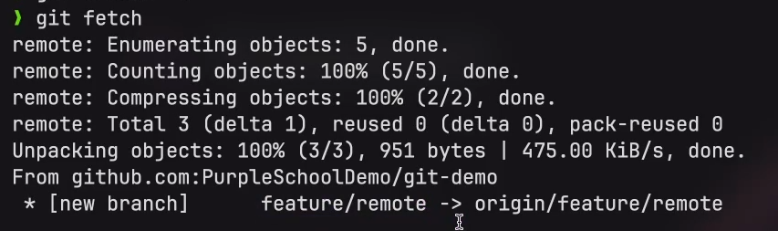

## LTB - Local tracking branches

LTB находятся локально и связаны с другими удалёнными ветками для реализации бесшовного пула и пуша.

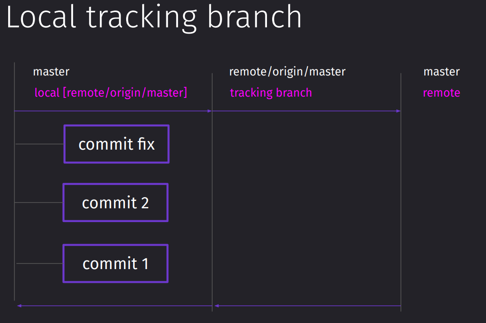

Флаг `-vv` позволит вывести боллее подробную информацию по веткам. 

```bash
git branch -vv
```

После идентификатора ветки идёт его отношение к LTB, который и общается с RTB.

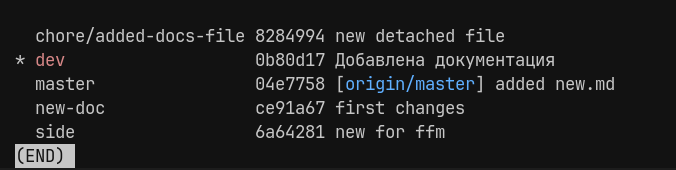

#### Отслеживание новых созданных веток в удалённом репозитории

И для того, чтобы научиться создавать локальные ветки, которые будут тречить удалённые изменения, нам нужно воспользоваться

```bash
git branch --track ВЕТКА origin/ВЕТКА
```

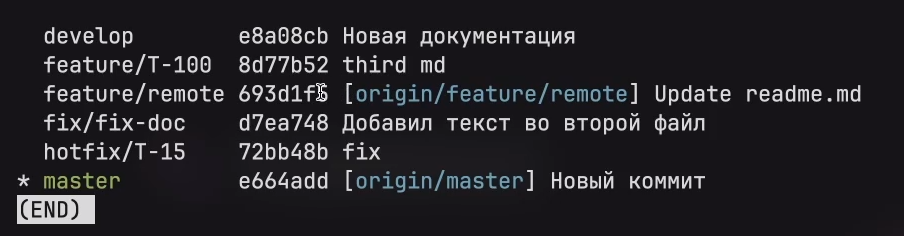

## Upstream

У нас есть более простой метод для связывания локальной ветки с удалённой через специальный флаг и указания имени удалённого репозитория

```bash
git push --set-upstream origin dev

# либо

git push --u origin dev
```

Таким образом мы легко создадим нужную нам LTB, которая будет бесшовно общаться с RTB

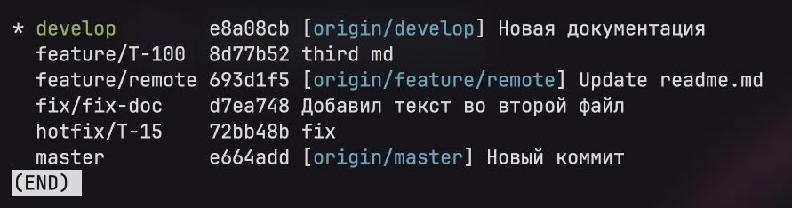

## Клонирование репозитория

Для клонирования репозитория с удалённого ресурса существует `git clone`

```bash
git clone ССЫЛКА [имя целевой папки | опционально]

git clone git@github.com:ZeiZel/git-demonstration.git git-repo
```

Сейчас все наши локальные ветки пропали и подтянулись с удалённого репозитория только RTB и ветка master

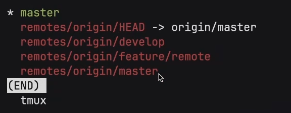

Но чтобы автоматически создать LTB по нашим RTB, можно просто чекаутнуться в существующую на удалённом репозитории ветку и она автоматически подхватится без `git branch --track`

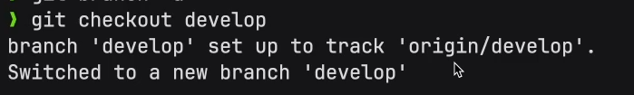

И вот в списке веток у нас автоматически созданные LTB

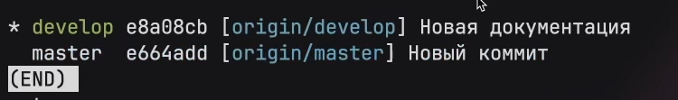

## Удаление веток

И таким образом мы можем удалить удалённую ветку по её наименованию

```bash
git branch -D --remote НАЗВАНИЕ_РЕПОЗИТОРИЯ/ВЕТКА

git branch -D --remote origin/dev
```

Через эту команду можно посмотреть все удалённые ветки

```bash
git ls-remote
```

Однако после локального удаления удалённой ветки, при поптыке пула изменений с удалённого репозитория, мы будем получать эту ветку обратно

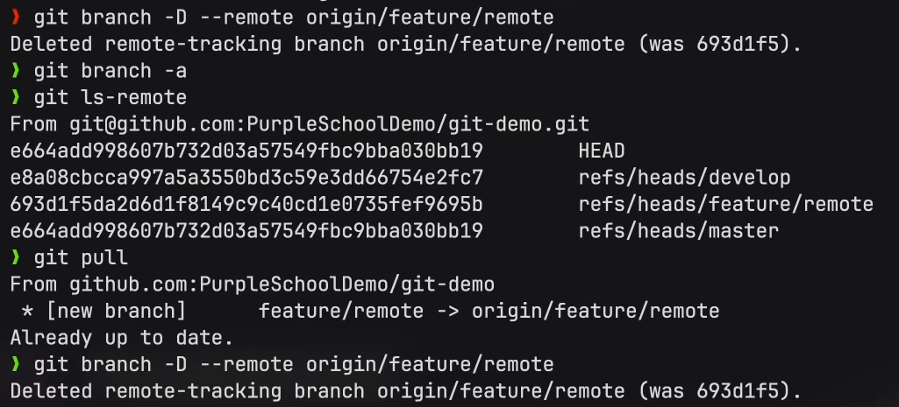

Если мы хотим удалить удалённую ветку, то нам нужно будет запушить ивент по удалению определённой ветки через `push` с флагом `--delete`

```bash
git push РЕПОЗИТОРИЙ --delete ВЕТКА
```

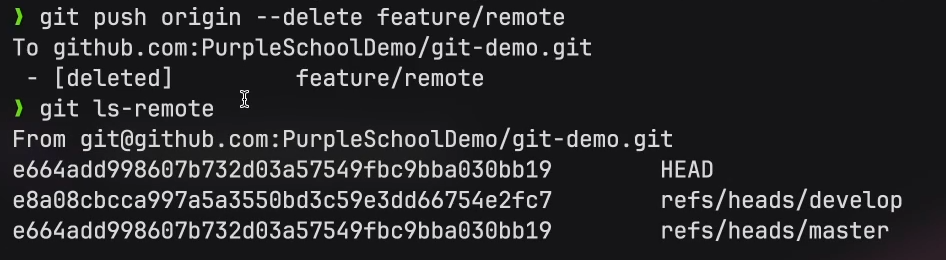

## Force Push

Представим ситуацию, когда нам нужно удалить коммит не только локально, но и на удалённом репозитории

Для этого нам не достаточно будет просто откатить и запушить изменения, потому что при пуле мы получим этот коммит обратно

А при попытке запушить всю эту историю, нам TB высветит, что мы пушим неактуальные изменения

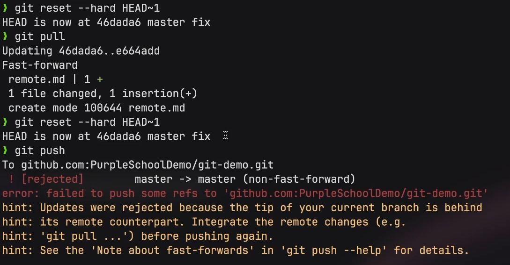

Чтобы обойти это ограничение и всё-таки запушить это изменение, мы можем отправить изменения с флагом `--force`

```bash
git push --force
```

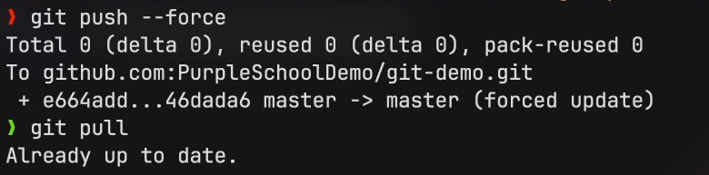
