---
tags:
  - datastructures
  - algorithms
  - array
  - graph
  - lionkedlist
  - set
  - map
  - binarytree
  - stack
  - heap
---

## Структуры данных

1. Массивы (Arrays)
2. Стек (Stack, LIFO)
3. Очередь (Queue, FIFO)
4. Связанные списки (Linked List)
    - Односвязный
    - Двусвязный
    - Циклический
5. Set (Множество)
6. Map / HashMap (Словарь, отображение)
7. Бинарное дерево (Binary Tree, BST)
8. n-арное дерево (N-ary Tree)
9. Heap (Куча, Priority Queue)
10. ? Trie (Префиксное дерево)
11. ? Union-Find (DSU, система непересекающихся множеств)
12. ? Segment Tree (Сегментное дерево)
13. ? Fenwick Tree (Дерево Фенвика, Binary Indexed Tree)
14. Графы (Graphs)

## Алгоритмы

- ! Поиск
    - Линейный поиск
    - Бинарный поиск
    - Поиск в хэш-таблице
    - Поиск в деревьях (BST, Trie)
- ! Сортировки
    - Bubble Sort (пузырьковая)
    - Insertion Sort (вставками)
    - Selection Sort (выбором)
    - Merge Sort (слиянием)
    - Quick Sort (быстрая)
    - Heap Sort (кучей)
    - Counting Sort (подсчётом)
    - Radix Sort (поразрядная)
- Рекурсивные
    - ! Факториал
    - ! Числа Фибоначчи
    - Обход дерева (preorder, inorder, postorder)
    - Ханойские башни
    - Генерация перестановок и комбинаций
- ? Обход деревьев
    - DFS (preorder, inorder, postorder)
    - BFS (level-order traversal)
- Алгоритмы на графах
    - ! Алгоритм Дейкстры
    - ! DFS (поиск в глубину)
    - ! BFS (поиск в ширину)
    - Алгоритм Беллмана–Форда
    - Алгоритм Флойда–Уоршелла
    - Топологическая сортировка
- ? Жадные алгоритмы
    - Алгоритм Крускала (MST)
    - Алгоритм Прима (MST)
- ? Кэширование и динамическое программирование
    - ! Мемоизация
    - Табуляция
    - LRU Cache (Least Recently Used)
    - LFU Cache (Least Frequently Used)
    - Knapsack (задача о рюкзаке)
    - LIS (наибольшая возрастающая подпоследовательность)
    - LCS (наибольшая общая подпоследовательность)
- ? Backtracking (поиск решений)
    - N-Queens
    - Генерация всех перестановок
    - Решение судоку

## Что такое алгоритм? Оценка сложности

Алгоритм - это набор последовательных действий, которые решают какую-либо задачу.

### Big O notation

Каждый алгоритм имеет свою сложность. Сложность алгоритма высчитывают через O(n), где n - количество действий для выполнения операции. Чем меньше действий, тем лучше.

| Сложность  | Пример алгоритма                         | Объяснение                               |
| ---------- | ---------------------------------------- | ---------------------------------------- |
| O(1)       | Доступ к элементу массива по индексу     | Константное время, не зависит от n       |
| O(log n)   | Бинарный поиск                           | Делим задачу пополам на каждом шаге      |
| O(n)       | Линейный поиск                           | Нужно просмотреть все элементы           |
| O(n log n) | Быстрая сортировка, MergeSort            | Разделяем и сортируем                    |
| O(n²)      | Пузырьковая сортировка                   | Двойной вложенный цикл                   |
| O(2^n)     | Рекурсивные задачи (например, Фибоначчи) | Количество ветвей растёт экспоненциально |
| O(n!)      | Перебор всех перестановок                | Факториальный рост                       |

На графе ниже представлено отображение, где чем большее количество элементов охватывает операция, тем лучше

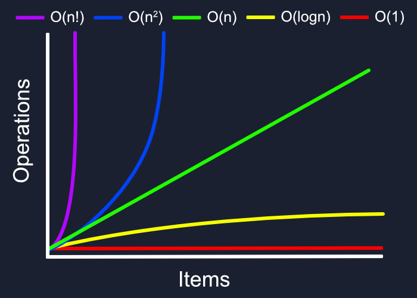

Пример: Мы ищем число 7 внутри отсортированного массива из десяти элементов. Если мы будем пользоваться линейным поиском и искать перебирая все элементы слева направо, то потратим 7 действий, а если будем искать через бинарный (двоичный) поиск, то нам потребуется всего 3 действия, так как мы два раза поделим массив пополам

Бинарный поиск имеет сложность O(log2n). То есть на два элемента в поиске, нам понадобится 2 операции, а на 1024 элементов - 11 операций, когда как в линейном до 1024 операций. 

| Количество операций | Линейный | Бинарный |
| ------------------- | -------- | -------- |
| 2                   | 2        | 2        |
| 16                  | 16       | 5        |
| 1024                | 1024     | 11       |
| 1048576             | 1048576  | 21       |

Если мы перебираем 1 элемент за 1мс, то линейный поиск будет проходиться по 100000 элементов 11 дней, а бинарный поиск с той же задачей справится за 32мс

| Количество элементов | Линейный | Бинарный |
| -------------------- | -------- | -------- |
| 100                  | 100 мс   | 7 мс     |
| 10000                | 10 сек   | 14 мс    |
| 1000000              | 11 дней  | 32 мс    |

### Time Complexity

Временная сложность показывает, **как количество операций растёт с увеличением размера входных данных (n)**. Обычно обозначается как O(f(n)), где f(n) — функция, описывающая рост числа операций.

1. Худший случай (Worst-case)
	- Обозначается: **O(f(n))**
	- Показывает **максимальное количество операций**, которое алгоритм может совершить для любого входа размера n.

Пример:
- Линейный поиск: ищем элемент в массиве длиной n, элемент отсутствует → придётся пройти весь массив.  
	→ Временная сложность: **O(n)**
- Сортировка пузырьком: если массив отсортирован в обратном порядке, придётся делать максимальное количество сравнений и перестановок → **O(n²)**

2. Лучший случай (Best-case)
	- Обозначается: Ω(f(n))
	- Показывает **минимальное количество операций**, которое алгоритм совершает на "самом удачном" входе.

Пример:
- Линейный поиск: нужный элемент находится в начале массива → **Ω(1)**
- Сортировка пузырьком с оптимизацией (выход, если не было перестановок): массив уже отсортирован → **Ω(n)**

3. Средний случай (Average-case)
	- Обозначается: Θ(f(n)) (иногда пишут как O, если точная функция неизвестна)
	- Показывает **среднее количество операций** по всем возможным входам размера n.

**Пример:**
- Линейный поиск: искомый элемент встречается где-то посередине → **Θ(n/2) ≈ O(n)**
- Быстрая сортировка (QuickSort) при случайном порядке элементов → **Θ(n log n)**

### Space Complexity

Пространственная сложность показывает, сколько памяти использует алгоритм в зависимости от размера входных данных.

1. Рекурсивный алгоритм Фибоначчи:
	- Временная сложность: O(2^n)
	- Пространственная сложность: O(n) (глубина рекурсии)

```TS
function fib(n: number) {
	if (n <= 1) return n;
	else return fib(n-1) + fib(n-2);
} 
```

2. Сортировка слиянием (MergeSort)
	- Временная сложность: O(n log n)
	- Пространственная сложность: O(n) (дополнительный массив для слияния)

### Общее

Тут находится шпаргалка с описанием скоростей выполнения различных операций

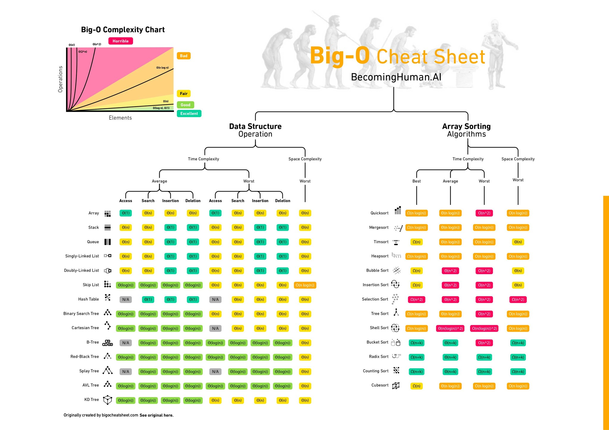

## Линейный поиск

Линейный поиск представляет собой перебор всех элементов массива, начиная с самого начала

Линейный алгоритм всегда имеет количество действий ==O(n)== - линейное количество

```JS
const array = [1, 2, 3, 4, 5, 6, 7, 8, 9, 10];
let count = 0;

function linearSearch(array, item) {
	for (let i = 0; i < array.length; i++) {
		count += 1;

		if (array[i] === item) {
			return i;
		}
	}

	return null;
}

console.log(linearSearch(array, 8));
console.log('Количество итераций = ', count); // = 8, т.е. O(n)

console.log(linearSearch(array, 10));
console.log(linearSearch(array, 324));
```

> Перебор идёт каждого элемента !
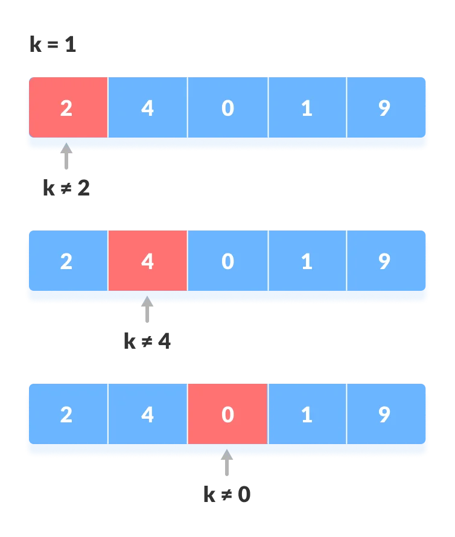

## Бинарный поиск. Итеративный подход (цикл)

Бинарный поиск - это поиск внутри остортированного массива посредством выборки среднего значения из представленных 

Данный поиск представляет из себя деление всего массива на два и откидывание лишних значений. Если мы ищем 4 среди 10 элементов, то сначала выберится 5, потом, так как 5 больше 4, то откинется половина массива после 5, потом выберится 3, откинется всё до 3 и у нас останется 3 - 4- 5, где серединой останется искомое 4

Сложность у данного алгоритма ==O(log2n)== - логарифмическая сложность

```JS
const array = [1, 2, 3, 4, 5, 6, 7, 8, 9, 10, 11, 12, 13, 14, 15, 16, 17, 18];
let count = 0;

function binarySearch(array, item) {
	let start = 0; // начальная точка
	let end = array.length; // конечная точка - длина массива
	let middle; // середина списка
	let found = false; // найден ли элемент
	let position = -1; // позиция курсора для поиска

	while (found === false && start <= end) {
		count += 1;
		middle = Math.floor((start + end) / 2);

		if (array[middle] === item) {
			found = true;
			position = middle;
			return position;
		}

		if (item < array[middle]) {
			end = middle - 1;
		} else {
			start = middle + 1;
		}
	}

	return position;
}

console.log(binarySearch(array, 8));
console.log('Количество итераций = ', count); // = 4, т.е. O(log2n)
```

Способ решения через рекурсию:

```JS
function recursiveBinarySort(array, item, start, end) {
	let middle = Math.floor((start + end) / 2);

	if (item === array[middle]) 
		return middle;
	if (item < array[middle]) 
		return recursiveBinarySort(array, item, start, middle - 1);
	if (item > array[middle]) 
		return recursiveBinarySort(array, item, middle + 1, end);
}

console.log(recursiveBinarySort(array, 12, 0, array.length));
```


## Сортировка выбором. SelectionSort

Сортировка выбором представляет из себя сортировку, при которой сначала находится самый меньший элемент и он подставляется в начало, заменяя начальный

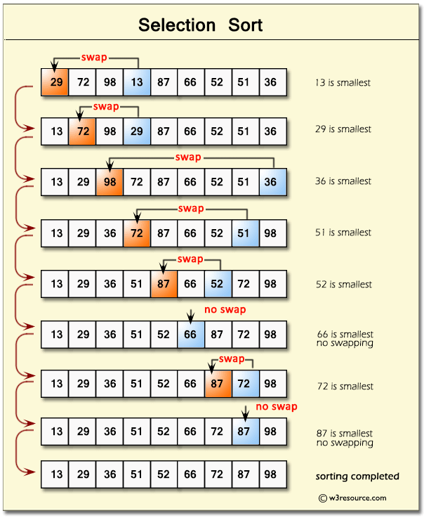

Сложность данного алгоритма равна ==O(n^2)==, так как мы имеем 1/2 от n^2 - 276 итераций на 24 элемента

```JS
const array = [5, 6, 1, 3, 2, 4, 9, 7, 8, 6, 5, 3, 10, 16, 17, 18, -2, -3, -1, -15, 24, 26, 34, 33];
let count = 0;

function selectionSort(array) {
	for (let i = 0; i < array.length; i++) {
		// индекс минимального числа
		let indexMin = i;

		// тут мы ищем индекс минимального числа
		for (let j = i + 1; j < array.length; j++) {
			if (array[j] < array[indexMin]) {
				indexMin = j;
			}
			count += 1;
		}

		// переставляем местами найденные переменные
		let tmp = array[i];
		array[i] = array[indexMin];
		array[indexMin] = tmp;
	}

	return array;
}

console.log(selectionSort(array));
console.log('Количество итераций = ', count); // = 276, т.е. O(n^2)
```

## Сортировка пузырьком. BubbleSort

Сортировка пузырьком - переставление элемента больше правее, на место элемента меньшего порядка

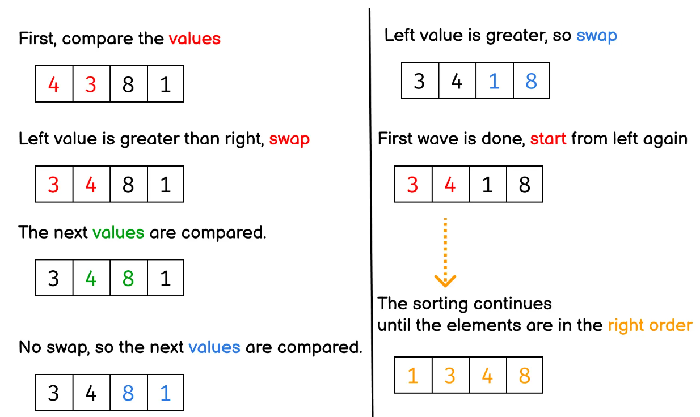

Этот же алгоритм ==является самым неэффективным==, так как он имеет сложность ровно ==O(n^2)==. Тут на 24 элемента массива было совершено 576 итераций, что = 24^2 

```JS
const array = [5, 6, 1, 3, 2, 4, 9, 7, 8, 6, 5, 3, 10, 16, 17, 18, -2, -3, -1, -15, 24, 26, 34, 33];
let count = 0;

function bubbleSort(array) {
	for (let i = 0; i < array.length; i++) {
		for (let j = 0; j < array.length; j++) {
			if (array[j + 1] < array[i]) {
				let tmp = array[j];
				array[j] = array[j + 1];
				array[j + 1] = tmp;
			}
			count += 1;
		}
	}

	return array;
}

console.log('длина массива = ', array.length);
console.log(bubbleSort(array));
console.log('Количество итераций = ', count); // = 576, т.е. O(n^2)
```

## Рекурсия. Рекурсивные функции. Факториал. Числа Фибоначчи

Рекурсия - это алгоритм, при котором функция зацикливает своё выполнение ровно до тех пор, пока она не достигнет финального результата

Примером является вычисление факториала, который представляет из себя умножение самого на себя число меньшего на 1 до 1 или поиск числа Фибоначчи, которое представляет из себя сложение всех сумм цифр числа  

```JS
// вычисление факториала
const factorial = (n) => {
	if (n === 1) {
		return 1;
	}

	return n * factorial(n - 1);
};

console.log(factorial(5)); // = 120

// Вычисление числа Фибоначчи 
const fibonacci = (n) => {
	if (n === 1 || n === 2) {
		return 1;
	}

	return fibonacci(n - 1) + fibonacci(n - 2);
};

console.log(fibonacci(8)); // = 21
```

## Быстрая сортировка. Сортировка Хоара

Быстрая сортировка предполагает под собой рекурсивное разделение массива данных на две части для поиска опорных чисел и сортировки 

> Это самый быстрый способ сортировки

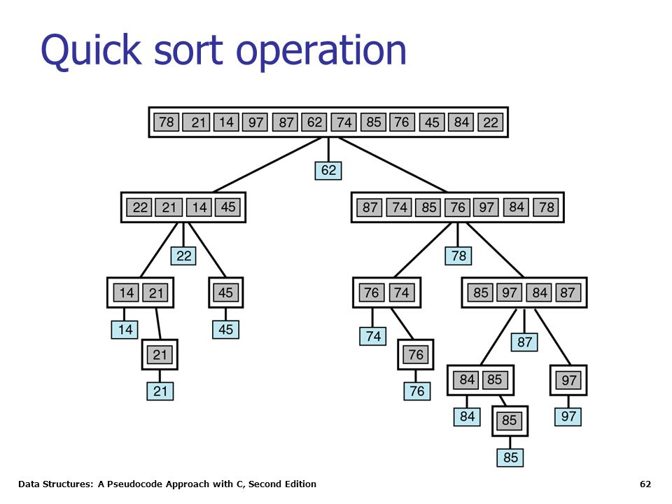

Сложность алгоритма равна ==O(log2n * n)==. На 24 элемента количество итераций равно 104 - то есть наименьшее число действий.

```JS
const array = [5, 6, 1, 3, 2, 4, 9, 7, 8, 6, 5, 3, 10, 16, 17, 18, -2, -3, -1, -15, 24, 26, 34, 33];
let count = 0;

function quickSort(array) {
	if (array.length <= 1) {
		return array;
	}

	let indexPivot = Math.floor(array.length / 2); // тут находится индекс центрального элемента массива
	let pivot = array[indexPivot]; // сам опорный элемент
	let less = []; // элементы меньше опорного числа
	let greater = []; // элементы больше опорного числа

	for (let i = 0; i < array.length; i++) {
		count += 1;
		if (i === indexPivot) continue; // пропускаем сортировку опорной точки
		if (array[i] < pivot) less.push(array[i]); // помещаем в меньший массив
		if (array[i] > pivot) greater.push(array[i]); // помещаем в больший массив
	}

	return [...quickSort(less), pivot, ...quickSort(greater)];
}

console.log('длина массива = ', array.length);
console.log(quickSort(array));
console.log('Количество итераций = ', count);
```

## Графы. Поиск в ширину

Поиск в ширину представляет собой поиск пути по графу от начальной точки до целевой и возможность в принципе найти данный путь

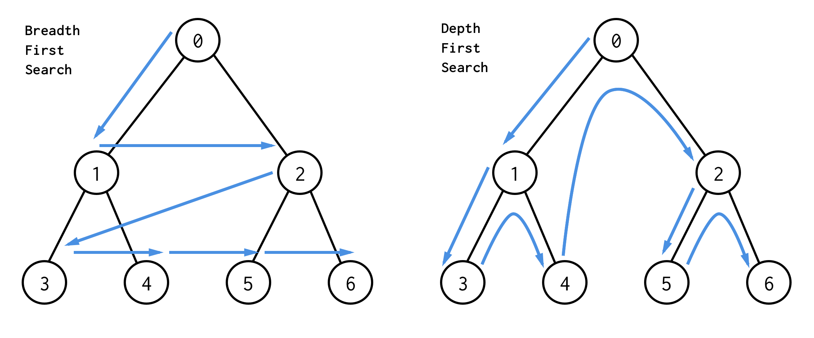

Основная суть задачи - узнать, существует ли путь из точки A в точку G

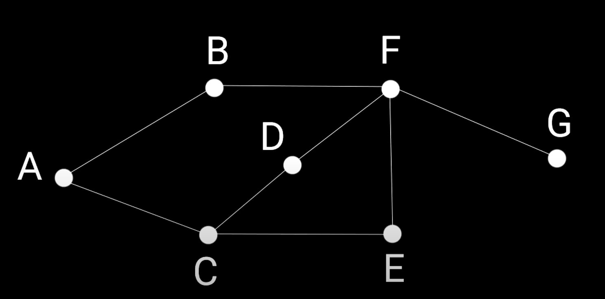

## Структура данных Очередь

Для реализации алгоритма поиска по графу, будет использоваться структура данных - Очередь. Основной её особенностью является то, что мы добавляем элемент в конец и достаём из начала 

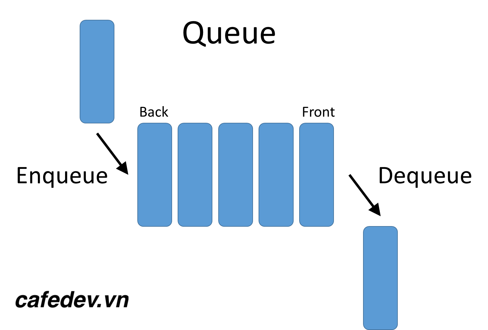

Тут уже представлен простейший алгоритм очереди, где мы перебираем массив массивов точек графа

```JS
// сами значения графа
const graph = {};
graph.a = ['b', 'c'];
graph.b = ['f'];
graph.c = ['d', 'e'];
graph.d = ['f'];
graph.e = ['f'];
graph.f = ['g'];

function breadthSearch(graph, start, end) {
	let queue = []; // сама очередь
	queue.push(start); // добавляем сразу стартовую вершину

	// пока в очереди есть хотя бы один элемент
	while (queue.length > 0) {
		// достаём первый элемент из массива
		const current = queue.shift();

		// если после этого элемента ничего нет, то дальше в графе нет возможности проходиться - вершина конечная
		if (!graph[current]) {
			graph[current] = []; // выставляем после него пустоту
		}

		// если в графе по текущей вершине массив содержит конечную точку
		if (graph[current].includes(end)) {
			return true;
		} else {
			// если не содержит, то разворачиваем вершины графа к вершинам очереди
			queue = [...queue, ...graph[current]];
		}
	}
	return false;
}

console.log(breadthSearch(graph, 'a', 'g')); // true
console.log(breadthSearch(graph, 'a', 's')); // false
```

## Матрица смежности

Матрица смежности - это способ представления графа в виде квадратной матрицы, где строки и столбцы матрицы соответствуют вершинам графа, а ячейки содержат информацию о том, есть ли ребро между этими двумя вершинами или нет.

Для взвешенного графа, вместо 0 или 1 в ячейках используются числа, которые обозначают вес или стоимость ребра между соответствующими вершинами.

Матрица смежности может быть использована для быстрого определения, есть ли связь между двумя вершинами, и получения информации о структуре графа. Однако, если количество вершин графа очень большое, то матрица смежности занимает много памяти, и может быть неэффективной в использовании.

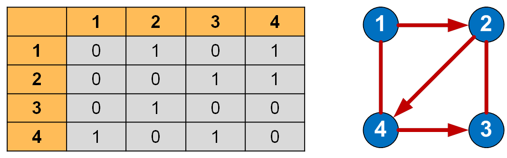

```JS
const matrix = [
	[0, 1, 1, 0, 0, 0, 0],
	[0, 0, 0, 0, 1, 0, 0],
	[0, 0, 0, 1, 0, 1, 0],
	[0, 0, 0, 0, 1, 0, 0],
	[0, 0, 0, 0, 0, 0, 1],
	[0, 0, 0, 0, 1, 0, 0],
	[0, 0, 0, 0, 0, 0, 0],
];
```

## Алгоритм Дейкстры для поиска кратчайшего пути

Алгоритм Дейстры представляет из себя поиск кратчайшего пути в графе, когда в учёт между точками ещё берётся ещё и расстояние между ними 

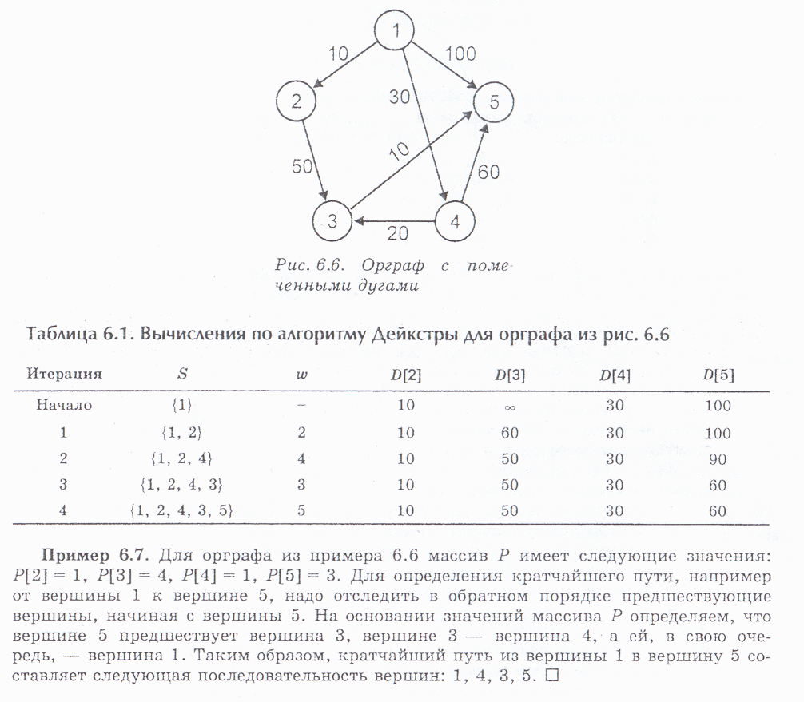

1. Создается объект `graph`, который представляет ваш взвешенный граф. Каждый ключ этого объекта соответствует вершине графа, а значение - объект, который содержит пары "соседняя вершина: расстояние до нее".
2. Определена функция `shortPath(graph, start, end)`, которая принимает три параметра: `graph` - ваш взвешенный граф, `start` - начальная вершина и `end` - конечная вершина. Функция возвращает объект `costs`, который содержит кратчайший путь от начальной вершины `start` до конечной вершины `end`.
3. Объявляются три переменные: `costs`, `processed` и `neighbors`. Начальное значение переменной `costs` - это пустой объект, который будет использоваться для хранения стоимости кратчайшего пути до каждой вершины графа от начальной вершины. Переменная `processed` - это массив, который будет содержать все узлы, которые были уже проверены. Это нужно, чтобы убедиться, что мы не рассмотрим узел дважды. Переменная `neighbors` - это объект, который будет содержать всех соседей узла, который мы в данный момент рассматриваем.
4. Цикл `forEach` используется для итерации по списку ключей графа. Для каждого узла графа, кроме начального узла, заполняется таблица `costs` записью: имя узла в качестве ключа, а значение - расстояние от начальной вершины до этого узла. Если расстояние не определено (нет соединения между текущим узлом и начальным узлом), то значение устанавливается на достаточно большое число (1000000).
5. Функция `findNodeLowestCost(costs, processed)` используется для поиска узла с наименьшей стоимостью пути из таблицы `costs`. Она ищет наименьшее число пути и возвращает соответствующий узел, который еще не был обработан.
6. В основном цикле `while`, мы используем функцию `findNodeLowestCost()` для нахождения узла с наименьшей стоимостью пути. Затем мы получаем все соседние вершины этого узла и итерируемся по ним, чтобы проверить, можем ли мы добраться до соседней вершины через текущий узел по более короткому пути. Если мы можем, то обновляем таблицу `costs` с новой стоимостью пути. Мы также добавляем проверенный узел в массив `processed`. Затем мы повторяем цикл до тех пор, пока не достигнем конечной точки или не будет больше узлов для обработки.
7. В конце функция `shortPath()` возвращает объект `costs`, который содержит кратчайший путь от начальной вершины `start` до конечной вершины `end`.

```JS
// Поиск кратчайшего пути в графе

const graph = {};
graph.a = { b: 2, c: 1 };
graph.b = { f: 7 };
graph.c = { d: 5, e: 2 };
graph.d = { f: 2 };
graph.e = { f: 1 };
graph.f = { g: 1 };
graph.g = {};

function shortPath(graph, start, end) {
	const costs = {}; // таблица с кратчайшими путями
	const processed = []; // сюда мы добавляем проверенные узлы
	let neighbors = {}; // тут находятся соседние вершины конкретного узла

	// далее итерируемся по списку ключей
	Object.keys(graph).forEach((node) => {
		if (node !== start) {
			let value = graph[start][node]; // тут мы получаем расстояние от стартовой точки графа
			costs[node] = value || 1000000; // если расстояние есть, то добавляем его в пути, а если нет, то оно бесконечно далеко
		}
	});

	// далее нам нужно найти вершину, в которую можно попасть из начальной с наименьшим расстоянием пути
	let node = findNodeLowestCost(costs, processed);

	while (node) {
		const cost = costs[node]; // записываем стоимость вершины
		neighbors = graph[node]; // добавляем соседние вершины к целевым нодам, чтобы по ним можно было проитерироваться

		// тут мы ищем новую стоимость, когда путь будет короче
		Object.keys(neighbors).forEach((neighbor) => {
			let newCost = cost + neighbors[neighbor];
			if (newCost < costs[neighbor]) {
				costs[neighbor] = newCost;
			}
		});

		processed.push(node);
		node = findNodeLowestCost(costs, processed);
	}
	return costs;
}

function findNodeLowestCost(costs, processed) {
	let lowestCost = 10000000; // тут будет находиться минимальное число пути
	let lowestNode; // нода, которую нужно найти

	Object.keys(costs).forEach((node) => {
		let cost = costs[node]; // записываем длину пути ноды

		// если путь меньше меньшей стоимости и ноды нет в обработанных нодах
		if (cost < lowestCost && !processed.includes(node)) {
			// то присваиваем меньшие значения данным нодам
			lowestCost = cost;
			lowestNode = node;
		}
	});

	return lowestNode;
}

console.log(shortPath(graph, 'a', 'g'));
```

## Рекурсивный обход дерева n-размерности

Деревья - это рекурсивная структура данных, где каждый узел является так же деревом

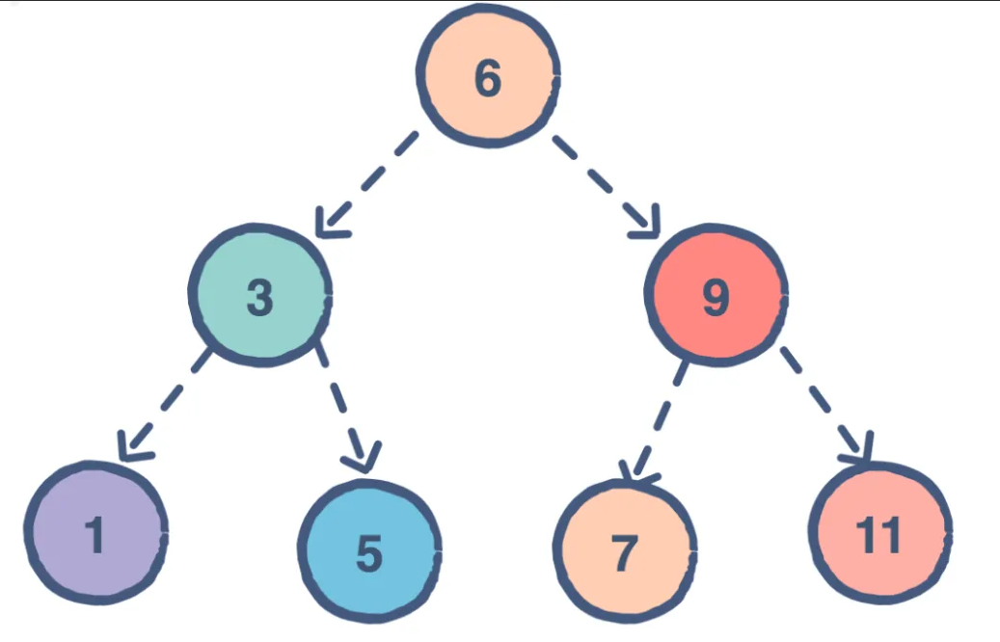

Таким образом можно представить дерево

Оно же будет использоваться для следующих примеров

```JS
const tree = [
	{
		v: 5,
		c: [
			{
				v: 10,
				c: [
					{
						v: 11,
					},
				],
			},
			{
				v: 7,
				c: [
					{
						v: 5,
						c: [
							{
								v: 1,
							},
						],
					},
				],
			},
		],
	},
	{
		v: 5,
		c: [
			{
				v: 10,
			},
			{
				v: 15,
			},
		],
	},
];
```

Рекурсивный обход дерева выглядит следующим образом: 

```JS
const recursive = (tree) => {
	let sum = 0;

	tree.forEach((node) => {
		sum += node.v;

		if (!node.c) return node.v;

		sum += recursive(node.c);
	});

	return sum;
};
```

## Структура данных Стек

Стек подразумевает под собой сбор самого свежего вошедшего элемента. Если при FIFO уходит первый пришедший, то тут, LIFO - уходит последний пришедший 

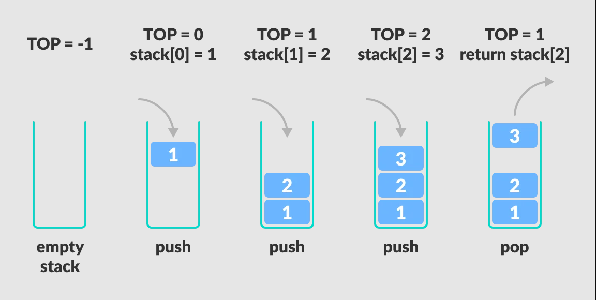

## Итеративный обход дерева n-размерности

Данная функция `iteration` представляет собой итеративный алгоритм обхода дерева, где каждый узел представлен объектом, содержащим его значение `v` и массив его дочерних узлов `c`.

Алгоритм начинается с проверки наличия элементов в дереве. Если дерево пустое, то функция возвращает 0.

Затем создается переменная `sum`, которая будет хранить сумму значений всех узлов дерева. Также создается массив `stack`, в который помещаются все узлы первого уровня дерева.

Далее запускается цикл `while`, который будет выполняться до тех пор, пока `stack` не станет пустым. На каждой итерации цикла извлекается последний узел из `stack` и добавляется его значение к `sum`. Затем проверяется наличие дочерних узлов у текущего узла. Если дочерние узлы есть, то они добавляются в конец `stack`.

После того как все узлы дерева будут обработаны, функция вернет сумму значений всех узлов.

Таким образом, данная функция реализует обход дерева в глубину (Depth-First Search) при помощи стека.

```JS
const iteration = (tree) => {
	if (!tree.length) return 0;

	let sum = 0;
	let stack = [];

	tree.forEach((node) => stack.push(node));

	while (stack.length) {
		const node = stack.pop();

		sum += node.v;

		if (node.c) {
			node.c.forEach((child) => stack.push(child));
		}
	}

	return sum;
};
```

## Кеширование вычислений

Алгоритм кеширования вычислений подразумевает под собой, что мы должны закешировать результат вычисления

Конкретно тут идёт проверка по введённому аргументу, если аргумент есть в кеше, то просто возвращается его результат, если переданного `n` нет в объекте `cache`, то вычисления происходят снова и они записываются в кеш

```JS
function cacheFunction(fn) {
	const cache = {};

	return function (n) {
		if (cache[n]) {
			console.log('Значение взято из кеша ', cache[n]);
			return cache[n];
		}

		let res = fn(n);
		console.log('Посчитано функцией ', res);
		cache[n] = res;
		return res;
	};
}

function factorial(n) {
	let result = 1;

	while (n != 1) {
		result *= n;
		n -= 1;
	}

	return result;
}

const cacheFactorial = cacheFunction(factorial);

cacheFactorial(5);
cacheFactorial(5);
cacheFactorial(4);
cacheFactorial(3);
```

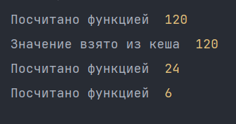

## Массивы. Сложность основных операций

Массив

Его плюсом является то, что мы знаем, где располагается каждый элемент и он имеет константное время для получения элемента

Его минусом является то, что массив фиксированный и у него заранее определён размер, и чтобы добавить новый элемент в массив, нужно будет создать новый, перенести все значения и удалить старый массив 

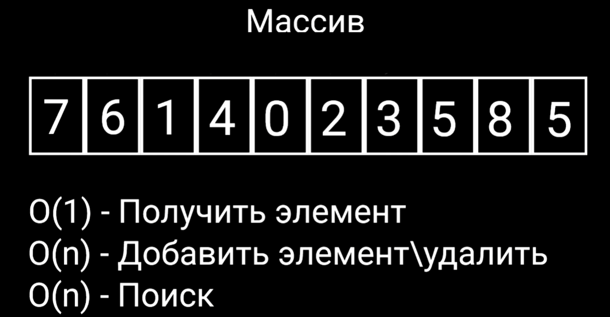

## Связный список. Простая реализация и теория

Связанный список представляет из себя структуру данных, где каждый элемент занимает свою ячейку памяти и хранит в себе ссылку на положение следующего элемента в списке.

Чтобы найти следующий элемент, нужно проитерироваться по всему списку и как в массивах быстро найти элемент не получится. Зато в список легко добавить новый элемент в любое место.

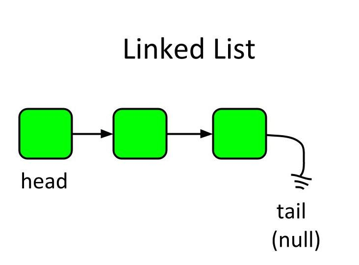

Данный код представляет реализацию простого связанного списка на JavaScript.

Класс `LinkedList` (связный список) имеет три метода:

- конструктор, который инициализирует размер списка (`size`) и корневой элемент (`root`);
- метод `add`, который добавляет новый элемент в связный список;
- метод `print`, который выводит все значения элементов связного списка.

`add(value)` - добавляет новый элемент в спискок. Если список пуст, то создается корневой элемент (Node) со значением переданным в качестве аргумента. В противном случае, происходит проход по всем элементам списка до тех пор, пока не будет найден последний элемент, после чего создается новый элемент и он добавляется в конец списка.

`getSize()` - метод, который возвращает размер связного списка.

`print()` - метод, который выводит все элементы связного списка в виде массива.

Класс `Node` (узел) используется для хранения значений элементов, которые добавляются в связанный список. Он имеет два свойства: `value`, который хранит значение элемента, и `next`, который хранит ссылку на следующий элемент в связанном списке.

В конце кода создается экземпляр класса LinkedList, вызываются методы `add()` для добавления нескольких элементов в связный список, а затем вызывается метод `print()`, чтобы вывести значения всех элементов связного списка в консоль.

```JS
class LinkedList {
	constructor() {
		this.size = 0; // размер списка
		this.root = null; // корень
	}

	// добавление элемента
	add(value) {
		// если списка пока нет, то добавляем стартовую ноду
		if (this.size === 0) {
			this.root = new Node(value);
			this.size += 1;
			return true;
		}

		let node = this.root;

		while (node.next) {
			node = node.next;
		}

		let newNode = new Node(value);

		node.next = newNode;

		this.size += 1;
	}

	// получение размера
	getSize() {
		return this.size;
	}

	// вывод
	print() {
		let result = [];
		let node = this.root;
		while (node) {
			result.push(node.value);
			node = node.next;
		}
		console.log(result);
	}
}

class Node {
	constructor(value) {
		this.value = value; //  значение ноды
		this.next = null; // ссылка на следующий элемент
	}
}

const list = new LinkedList();

list.add(5);
list.add(6);
list.add(7);
list.add(4);
list.add(3);

list.print(); // [5, 6, 7, 4, 3]
```

## Бинарное дерево поиска. Простая реализация и теория

Бинарное дерево поиска - это структура данных, которая состоит из узлов, каждый из которых содержит значение и два потомка: левого и правого. Значения в этих узлах упорядочены таким образом, что для любого узла в левом поддереве его значения будут меньше, чем значение узла, а для любого узла в правом поддереве - больше.

Принцип работы бинарного дерева поиска заключается в том, чтобы искать элемент путем последовательного сравнения значения элемента со значением текущего узла и перехода в левое или правое поддерево в зависимости от результата этого сравнения.

Представление бинарного дерева поиска может быть рекурсивным или итеративным. Рекурсивное представление определяет дерево как объединение корня, левого поддерева и правого поддерева, каждое из которых является бинарным деревом поиска. Итеративное представление использует стек для сохранения текущего узла и продвижения по дереву.

Бинарные деревья поиска используются для быстрого поиска, вставки и удаления элементов из упорядоченных коллекций данных. Кроме того, они могут быть использованы для решения нескольких других задач, таких как поиск наибольшего и наименьшего элементов или подсчет количества элементов в дереве.

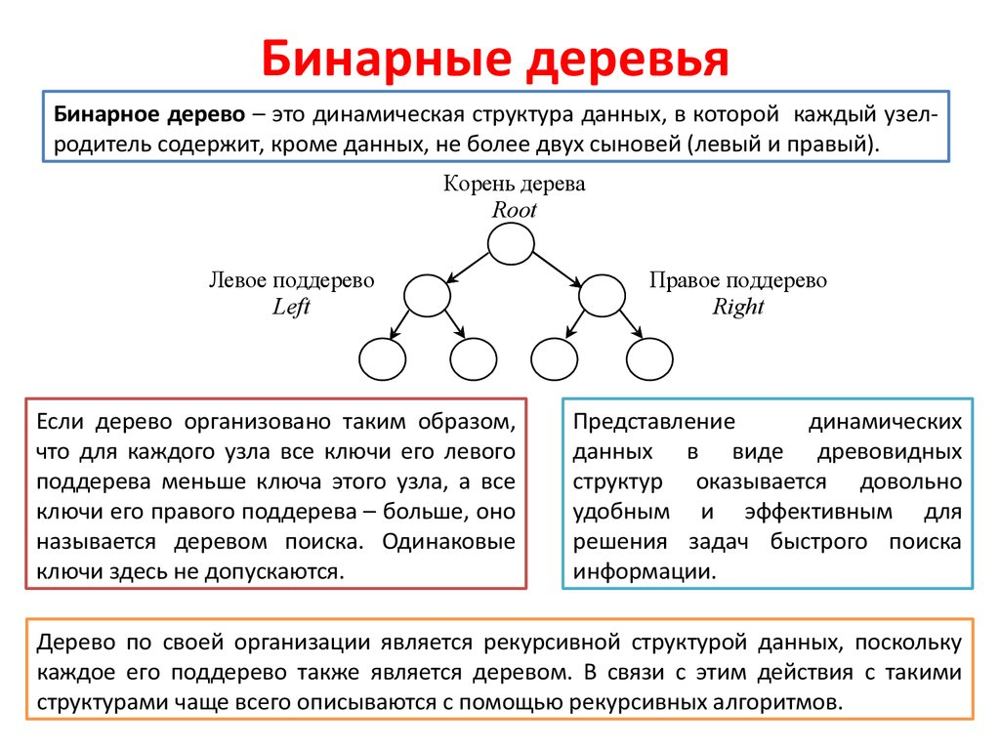

Данный код реализует бинарное дерево поиска, которое позволяет хранить и быстро находить значения в отсортированном порядке.

Класс `BinaryTree` имеет метод `add`, который принимает значение и добавляет его в дерево. Если дерево пустое, то создается новый узел с переданным значением и ставится в корень дерева. В противном случае происходит поиск места для нового узла путем обхода дерева начиная от корня.

Метод `print` класса `BinaryTree` осуществляет обход дерева в предпорядке (корень левое поддерево правое поддерево) и выводит значения узлов на экран.

Класс `TreeNode` представляет узел дерева и имеет свойства `value`, `left` и `right`, которые представляют значение узла и ссылки на левого и правого потомков.

В конце кода создается новый экземпляр дерева и к нему последовательно добавляются значения 5, 2, 6, 2, 1. Затем вызывается метод `print`, который выводит значения узлов дерева в следующем порядке: 5, 2, 1, 6.

```JS
class BinaryTree {
	constructor() {
		this.root = null; // корень дерева
	}

	add(value) {
		if (!this.root) {
			// если дерево пустое, создаем узел и ставим его в корень
			this.root = new TreeNode(value);
		} else {
			let node = this.root; // начинаем обход дерева с корня
			let newNode = new TreeNode(value); // создаем новый узел со значением value

			// продолжаем поиск места для нового узла, пока не достигнем конца дерева
			while (node) {
				// если значение больше текущего узла, идем вправо
				if (value > node.value) { 
					// если нет правого потомка, то это место для нового узла
					if (!node.right) {
						break;
					}
					node = node.right; // переходим к следующему узлу правой ветви
				} else {
					// если значение меньше или равно текущему узлу, идем влево
					if (!node.left) {
						// если нет левого потомка, то это место для нового узла
						break;
					}
					node = node.left; // переходим к следующему узлу левой ветви
				}
			}
			if (value > node.value) {
				// добавляем новый узел в правый потомок, если значение больше последнего узла
				node.right = newNode;
			} else {
				// добавляем новый узел в левый потомок, если значение меньше или равно последнему узлу
				node.left = newNode;
			}
		}
	}

	print(root = this.root) {
		// обход дерева в предпорядке (корень левое поддерево правое поддерево)
		if (!root) {
			// базовый случай - достигли конца дерева
			return true;
		}
		console.log(root.value); // выводим значение текущего узла на экран
		this.print(root.left); // рекурсивно вызываем метод print для левого потомка
		this.print(root.right); // рекурсивно вызываем метод print для правого потомка
	}
}

class TreeNode {
	constructor(value) {
		this.value = value; // значение узла
		this.left = null; // ссылка на левый потомок
		this.right = null; // ссылка на правый потомок
	}
}

const tree = new BinaryTree(); // создаем новый инстанс дерева

tree.add(5);
tree.add(2);
tree.add(6);
tree.add(2);
tree.add(1);

tree.print();
```

## Set и Map

[03 - Дополнительные основы JavaScript](../frontend/React/_lessons/03%20-%20Дополнительные%20основы%20JavaScript.md) 

Map -  это объект, ключом которого может быть и символ и другой объект и любой другой тип данных

Set - это массив, значения которого всегда уникальны

```JS
// Map
const map = new Map();
const objKey = { id: 5 };
map.set(objKey, 'ulbi tv');

console.log(map.get(objKey));

// Set

const set = new Set();

set.add(5);
set.add(5);
set.add(5);
set.add(5);
set.add(5);
set.add(4);
set.add(3);

console.log(set);
```
