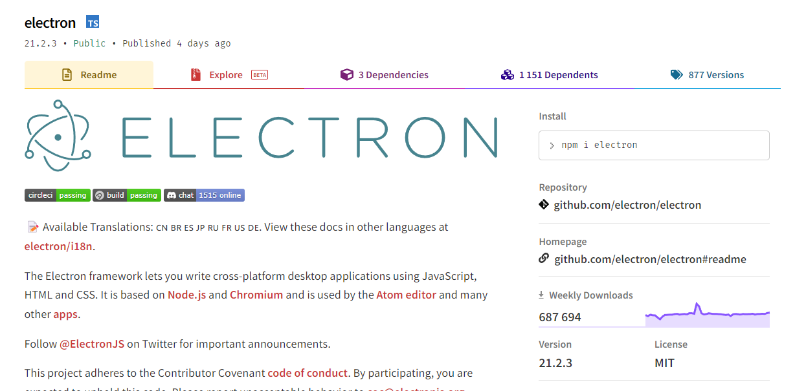
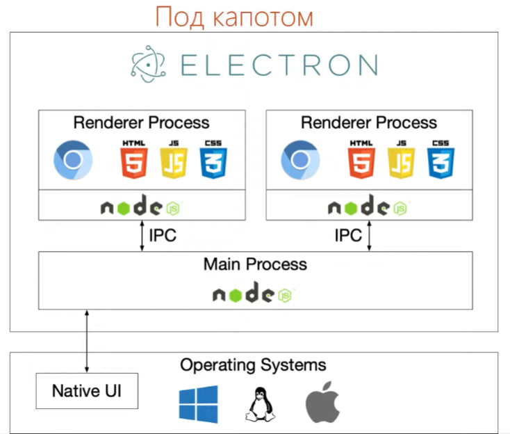
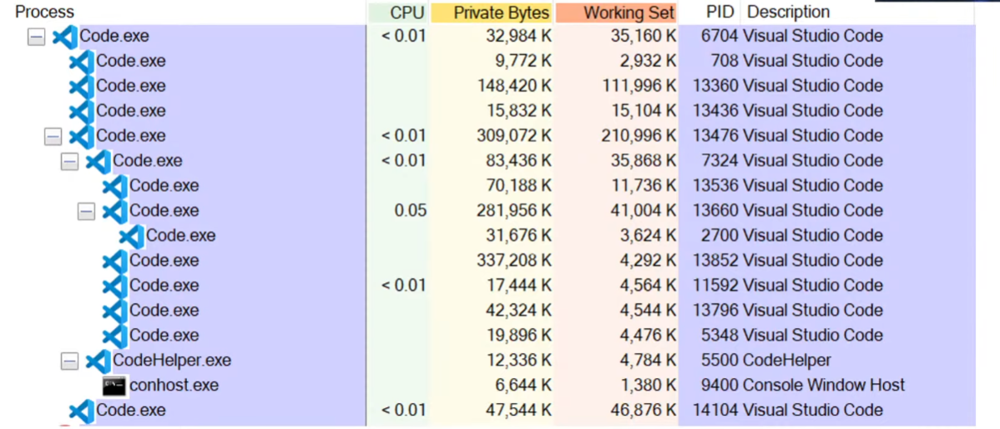
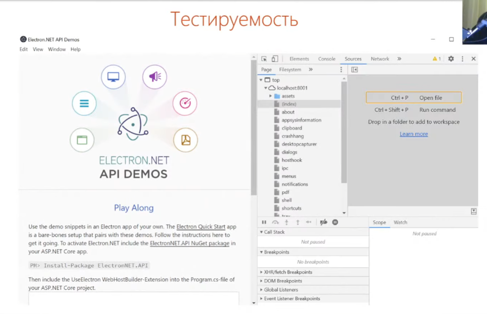
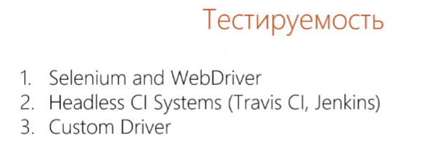

## Зачем выбирать Electron?

Учить морально-устаревшие и плохоподдерживаемые системы по типу JavaFX или WPF, на проекты по которым почти не могут собрать людей - уже имеет мало смысла. Обычно люди могут писать программы на C++, но нужно учить как сам язык так и многие его библиотеки.

Поэтому на помощь приходит Electron, с которым справится даже начинающий FrontEnd-девелопер.
На нём написаны: Microsoft Teams/Skype, WhatsApp, Spotify, VSCode и много других приложений.

Поддерживается и разработан электрон в гитхабе и имеет достаточно большое коммюнити.

## Что из себя представляет Electron?

Это npm пакет, который позволяет нам сбилдить приложение, которое будет спокойно работать автономно и иметь в себе все нужные компоненты для работы.
Установка продукта, сделанного с помощью данного пакета, производится буквально в один клик и так же продукт будет кросс-платформенным.

## Основные преймущества Electron

1. Его браузерная природа.
   1.1. Некоторые веб-приложения имеют ограничения на уровне браузера (например, на максимальное отображаемое разрешение изображений) и нужно сделать такую версию приложения, чтобы оно себя прекрасно чувствовало.
   1.2. Так же мы можем запрячь работать веб-разработчиков, так как мы имеем те же самые инструменты разработки, ивенты и методики, что и в браузере.
2. Кросс-платформенность.
   Мы можем независимо от платформы спокойно писать код, но так же мы можем допиливать функционал под разные ОС (получая их наименования и модифицируя приложения прямо внутри его логики или сразу готовя разные приложения)

## Работа Electron под капотом

Работает под капотом приложение достаточно просто:

- Одно приложение запускает один свой Main Process, который выполняет запуск рендереров и связывает их с операционной системой
- Main Process может запустить несколько Renderer Process, которые представляют из себя окна хромиума, уже которые рендерят страницу
- Связывание запросов от условного сервера и клиента происходит через IPC коммуникацию

## Производительность

Мы платим за использование встроенной ноды (70 мб) и хромиума (140 мб) определённым количеством оперативной памяти, которое обычное приложение, скорее всего, бы не потратило просто так, но это в современных реалиях не такой большой оверхед для полноценного приложения, которое сразу можно написать на все операционные системы.

То есть потребляет приложение ресурсов как обычная страница в браузере

Если нам недостаточно того функционала, который предоставляет нам электрон для работы с операционной системой, то мы можем запускать дочерние процессы из ==Node.JS==

Так же можно упомянуть про то, что мы можем запустить ==.NET==-процесс из нашего электрон-приложения, подцепив внутрь него ещё и БД (например, тот же SQLite)

Так же ==Node== позволяет производить нам **native addon** (подключать C/C++ библиотеки)

## Тестрируемость Electron

Тестировать мы можем отдельно как рендерер-процесс, так и основной процесс

**Инфроструктурные тесты**
Так как мы создаём десктоп-приложение, то нам нужно отвечать за установку, доставку, обновление и удаление приложения
**Тесты приложения**
Электрон поддерживается многими фреймворками, поэтому можно легко найти информацию по тому, как тестировать его

## Сообщество

Так как электрон - это очень актуальная и быстроразвивающаяся платформа, то она имеет много проблем со своей версионностью (где-то может поменяться что-то критичное и в нашем приложении уже наш функционал может не работать или сломаться).

Очень много ответов на вопросы по электрону можно найти на гитхабе, нежели чем на stackoverflow.

У электрона очень хорошая документация и так же есть userland, где находятся всякие билдеры и дополнения для более эффективной работы с электроном:

- [Документация электрона](https://www.electronjs.org/)
- [Страница ленда на Github](https://github.com/electron-userland)
- [Electron сайт](https://www.electronjs.org/userland)

## Заключение

> [!info] Особенности:
>
> 1. Электрон - это кроссплатформенный фреймворк для генерации десктоп-приложений
> 2. Он очень хорошо расширяется навтиными модулями и подпроцессами
> 3. Не требует глубокого понимания системы разработки (подойдёт начинающий фронтэндер)
> 4. Полностью совместим с TypeScript
> 5. Имеет достаточно коммьюнити и обширную библиотеку вспомогательных пакетов
