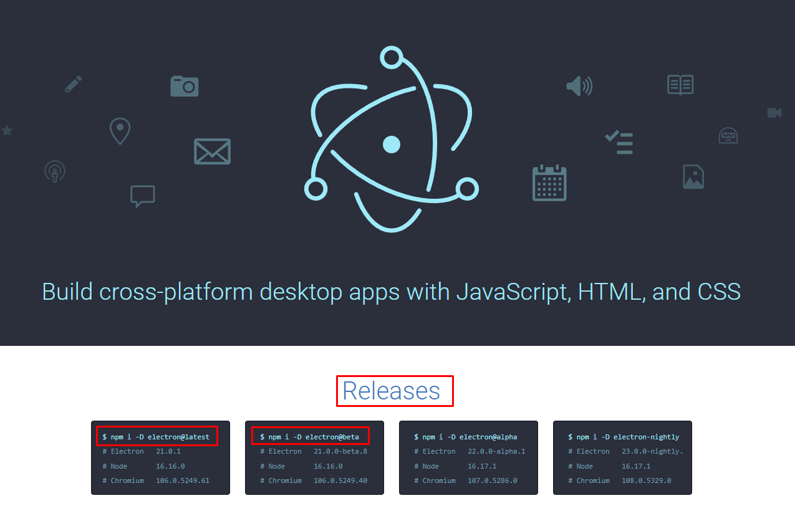
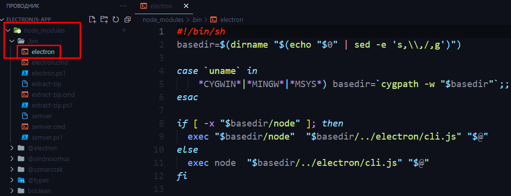
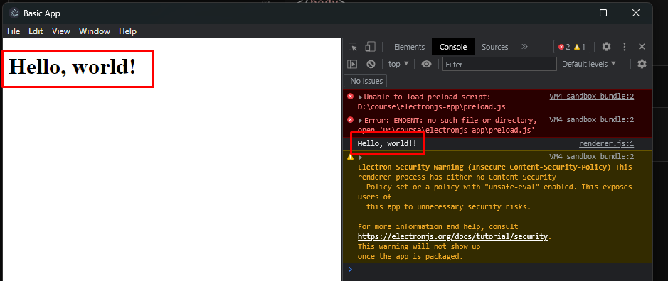
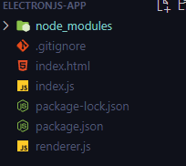

Для начала нужно установить ==Node.js== и `nmv` 

Далее нужно установить ==AVN== - пакет для автоматической смены версии ноды для каждого разрабаватывемого приложения (выбирает версию ноды, которое поддерживает приложение)

```bash
npm install -g avn avn-nvm avn-n
avn setup
```

Далее создадим файл, в котором впишем версию ноды, и который зафиксирует эту версию для проекта через ==avn== 
`.nvmrc`
```code
18.9.0
```

Найти установщики через npm можно на официальном сайте ==electron==

```bash
npm i -D electron@beta
```


Конкретно этот бинарник электрона в папке электрона является компилятором программы в целом



Добавляем в `json` проекта команду `start`, которая запустит компиляцию приложения через бинарник электрона

`package.json`
```JSON
"scripts": {
    "test": "echo \"Error: no test specified\" && exit 1",
    "start": "npx electron index.js"
  },
```

Чтобы запустить процесс компиляции приложения, пишем команду:

```bash
npm start
```

Это файл самой логики нашего приложения, который срабатывает автоматически при включении нашей программы.
- Тут импортируются компоненты электрона 
- Создаётся инстанс окна через функцию `createWindow()` 
- Создаётся это самое окно, когда загружается приложение `whenReady()`

`index.js`
```JS
// Импорт через деструктуризацию определённых компонентов в систему
const { app, BrowserWindow } = require("electron");
const path = require("path");

// Эта функция создаёт браузерное окно из импортированного модуля
function createWindow() {
	// создаём инстанс окна
	const win = new BrowserWindow({
		width: 1200,
		height: 800,
		webPreferences: {
			preload: path.join(__dirname, "preload.js"),
		},
	});

	// в окно загружается файл с нашим html-файлом
	win.loadFile("index.html");

	// откроет окно разработчика при запуске программы
	win.webContents.openDevTools();
}

// эта функция запускает окно нашего браузера, когда приложение загрузилось
app.whenReady().then(() => {
	createWindow();

	// Эта настройка предназначена для macOS, чтобы запускать новое окно, когда все окна закрыты
	app.on("activate", () => {
		if (BrowserWindow.getAllWindows().length === 0) {
			createWindow();
		}
	});
});

// когда все окна приложения закрыты необходимо сделать что-то - выйти из приложения
app.on("window-all-closed", () => {
	if (process.platform !== "darwin") {
		app.quit(); // выход из системы
	}
});

```

Основной файл, который подгружается при первом включении

`index.html`
```HTML
<!DOCTYPE html>
<html lang="en">

<head>
	<meta charset="UTF-8">
	<meta http-equiv="X-UA-Compatible" content="IE=edge">
	<meta name="viewport" content="width=device-width, initial-scale=1.0">
	<title>Basic App</title>

</head>

<body>
	<h1>Hello, world!</h1>
	<script src="renderer.js"></script>
</body>

</html>
```

`renderer.js`
```JS
console.log("Hello, world!!");
```

Так выглядит, собственно, запущенное приложение на JS



И закономерно нужно закрыть вывод папки модулей на гитхаб
`.gitignore`
```text
node_modules
```

Примерно так выглядит структура конечного приложения:

