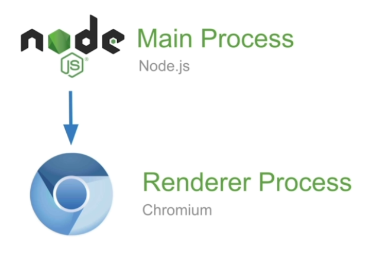
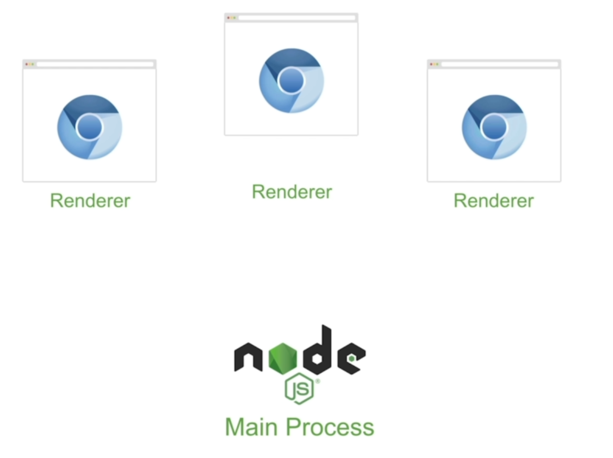
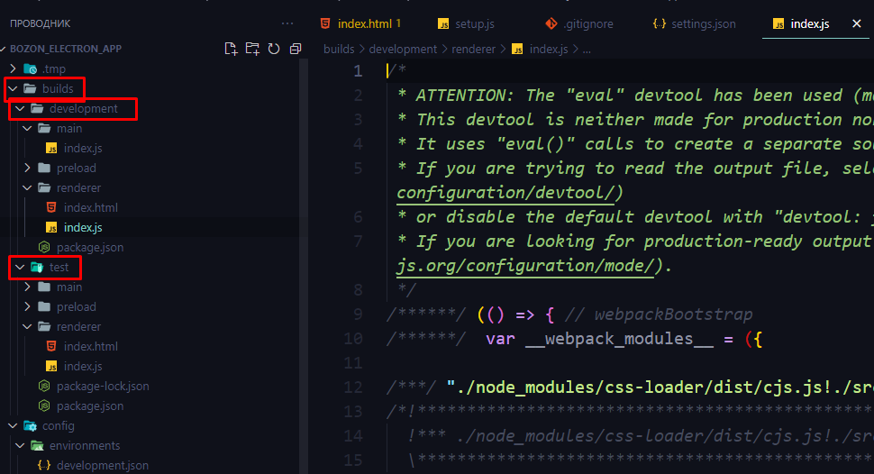
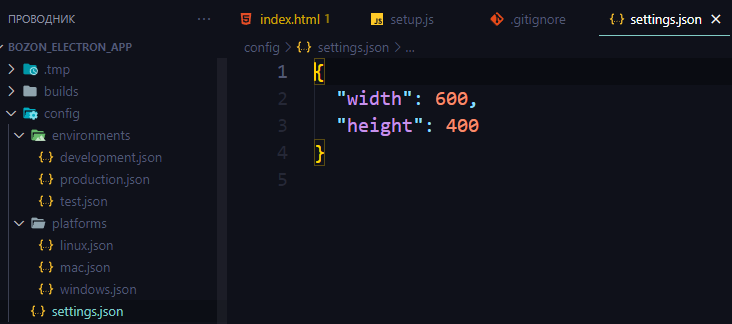
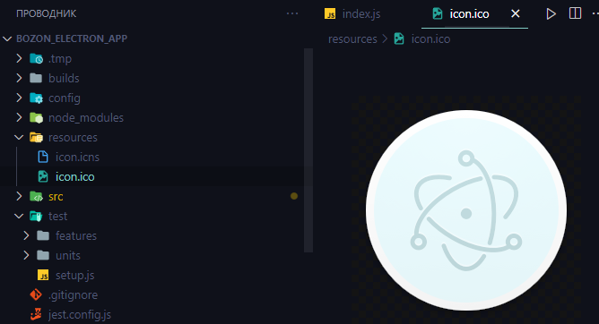
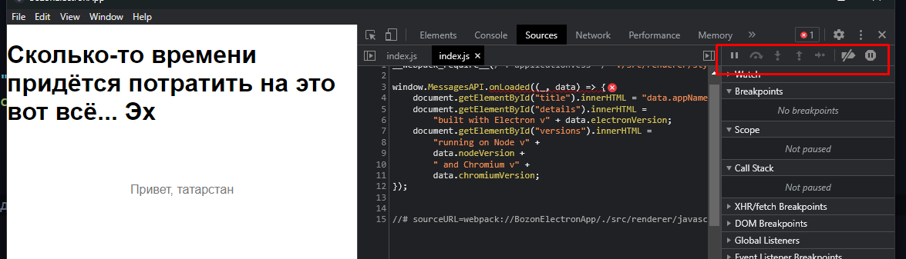
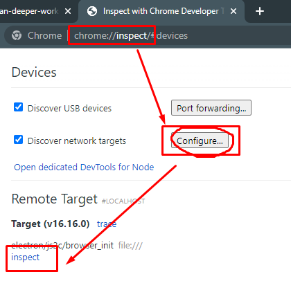
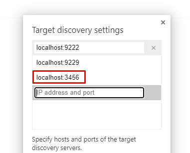
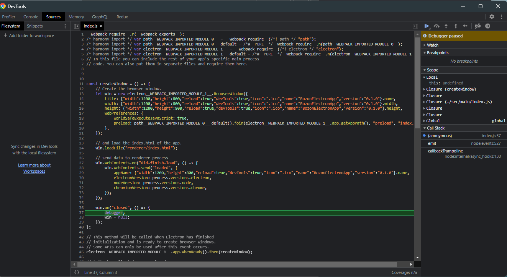
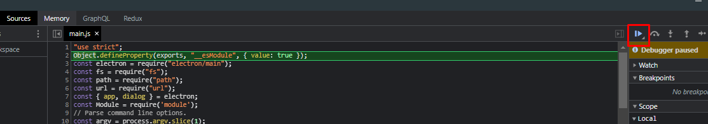

## 007 Архитектура приложения

==Electron== - это оболочка для выполнения веб-логики

Он создаёт один основной процесс на одно приложение - ==Main Process==, который и выполняет всю логику приложения. Представляет из себя NodeJS-процесс.
Дальше основной процесс создаёт Renderer Process, который запускает окно браузера в качестве видимой части приложения



Уже рендерер процессов может быть сколько угодно много. Генерируется один такой процесс на каждое отдельное окно приложения.
При закрытии такого окна - закрывается один рендерер-процесс. Закрытие окна никак не влияет на основной процесс. Даже если закрыть все окна, то основной процесс продолжит работать



Можно сказать, что рендерер-процесс - это клиентская сторона программы, а основной процесс - это серверная часть программы. Однако тут клиентская сторона вызывается самим сервером

**Для основного процесса (Node.JS API)**
Исходя из вышесказанного, мы можем пользоваться стандартными технологиями ==Node.JS==:

- File System
- Process
- Streams
- Node modules
- И так далее

**Для рендерер-процесса (Browser API)**
Так же мы можем использовать фронт-енд технологии для видимой части нашего приложения:

- Фреймворки
- LocalStorage
- Coockies
- Service Workers
- Notifications
- И так далее

> [!note] Но самым главным плюсом является то, что нам не нужно беспокоиться о кросс-браузерности, так как у нас используются последние версии хромиума со всеми новыми фишками

Однако тут нужно учитывать, что мы можем столкнуться с ==Memory Leak== (явление, когда ==garbage collector== не удаляет переменную, так как на неё есть ссылка), если в глобальной области видимости будем создавать переменные и никак их не удалять, так как они будут сохраняться в нашем основном процессе и съедать очень много памяти.

```JS
let win;

function createWindow() {
	win = new BrowserWindow({
		width: 1200,
		height: 800,
		webPreferences: {
			preload: path.join(__dirname, "preload.js"),
		},
	});
	win.loadFile("index.html");
	win.webContents.openDevTools();

	// Эта функция позволит почистить память после закрытия рендерера
	win.on("close", () => {
		win = null;
	});
}
```

## 008 Создание структуры проекта с помощью bozon

==Bozon== - это инструмент для работы с ==Electron-приложениями==. Построен на базе Webpack. Он позволяет генерировать проект, запускать, тестировать и паковать его.

Установка `bozon`

```bash
npm install -g bozon
```

Создаст новый проект

```bash
bozon new имя_проекта
```

Скомпилирует проект

```bash
bozon start
```

Запустит внутреннее unit-тестирование приложения

```bash
bozon test
```

Изначально проект представляет собой несколько папок, которые уже сконфигурированы под дальнейшую разработку на электроне:

- `.tmp` - временно хранит в себе сгенерированный проект
- `build` - хранит в себе сборку программы во время разработки (development) и итоговый проект
  
- `config` - хранит в себе конфигурации нашей системы. Есть общая конфигурация `settings.json`, так и общие конфигурации по энвайрментам и платформам. Во время генерации проекта, все конфиги компилируются в один итоговый файл
  
- В папке `resources` находятся иконки для нашего приложения, которые можно поменять
  
- В папке `src` хранятся исходники нашего приложения
- А уже в папке `test` будут храниться тесты нашего приложения

Эта команда запустит автоматическую компиляцию изменений в приложении (hot reload). Однако нужно упомянуть, что изменения могут встать на паузу в дебаггере и нужно их снять с паузы, чтобы они отображались (окно браузера может стать просто белым до снятия с паузы)

```bash
bozon start --reload
```



## 009 Отладка приложения

Эта команда позволяет открыть нам девтулз при запуске приложения (если запускать скрипт в основном процессе). И при включении девтулз остановится на точке, где мы напишем в коде `debugger`

```JS
win.webContents.openDevTools();
```

Так же мы можем подключить инспектор напрямую из гугл хрома/
Нам нужно запустить инспектор по своему порту, который ничем не занят

```bash
bozon start --inspect=3456
```

Далее переходим в хроме во вкладку настройки инспектора и конфигурируем его. После следующего пункта с конфигурацией, мы должны открыть инспектор по порту. Нажимая на `inspect`, мы запускаем девтулз в хроме - запускать его нужно после запуска команды



Нужно будет вписать в `configure` значение того порта, которое мы выбрали



Ставим точку останова (дебага) внутри нашего кода

```JS
win.on("closed", () => {
		debugger;
		win = null;
	});
```

И теперь при закрытии приложения, у нас включается эта точка в девтулз



Так же есть вторая команда, которая сразу запускает точку останова с первой строчки кода

```bash
bozon start --inspect-brk=3456
```

Далее, после запуска команды, нам нужно заново открыть девутлз через `inspect` и уже можно будет пользоваться остальными кнопками справа


