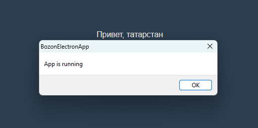
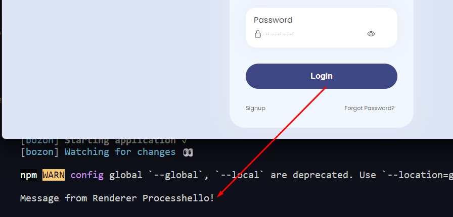
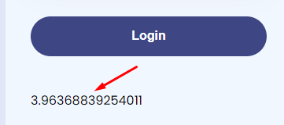
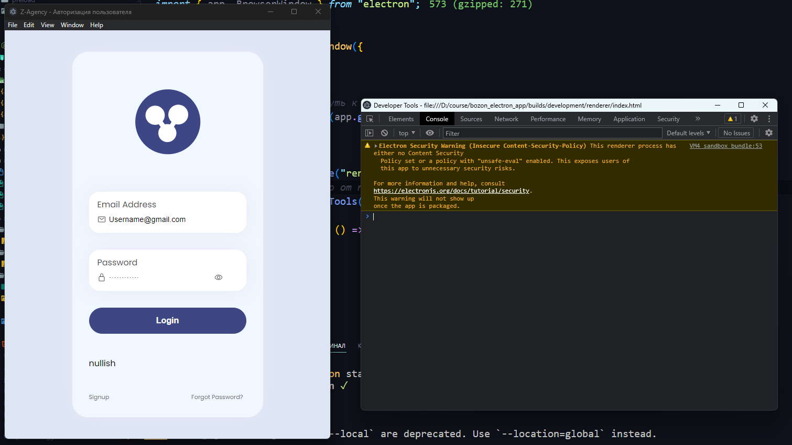
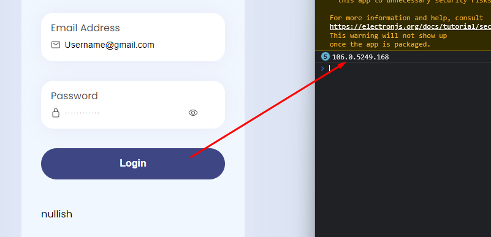
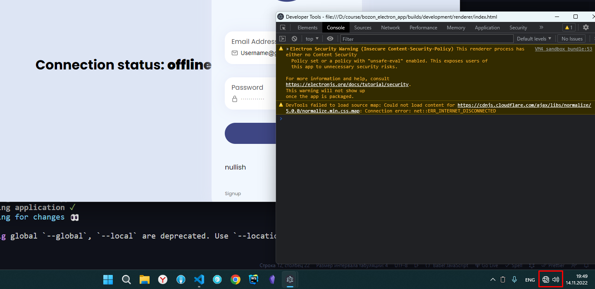
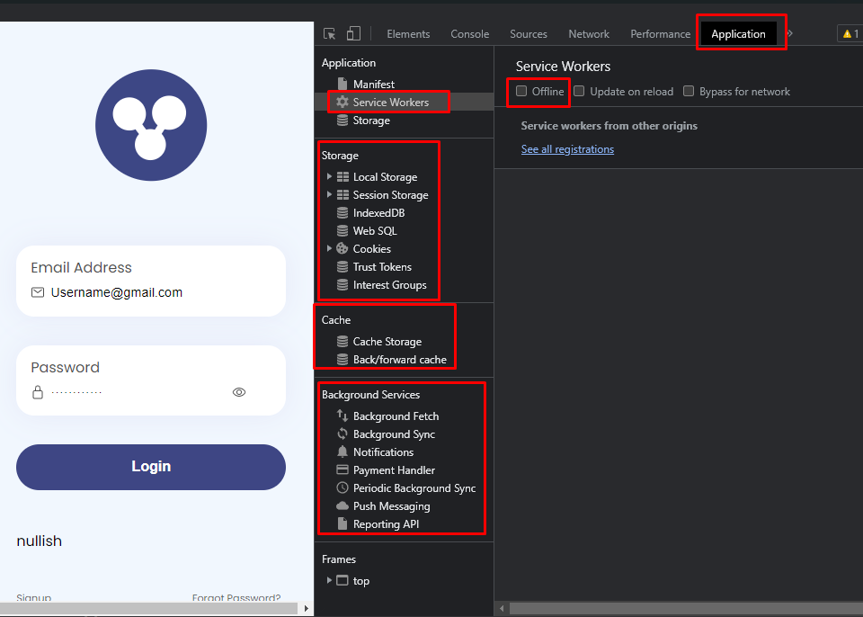
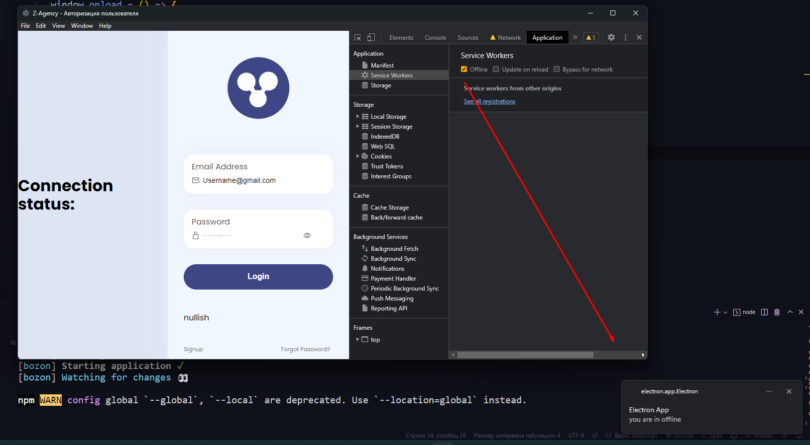

## 014 Коммуникация между процессами [IPC](https://www.electronjs.org/docs/latest/api/ipc-main)

#### Реализуем получение данных на фронте от мэин-процесса

Электрон предоставляет нам глобальную шину IPC (Item Process Communication), которая реализует общение серверной и клиентской части приложения. Практически любой процесс может открыть канал, который будут слушать все подписанные на этот канал процессы

Сообщения с бэка в рендерер-процесс могут быть посланы через `webContents.send`. Уже через `ipcRenderer` можно отправить запрос из рендерер-процесса на бэк (в основной процесс) либо слушать сообщения по какому-то каналу.

Попробуем отправить сообщение из мэин-процесса в рендерер-процесс:
Тут нужно отметить, что мы создаём канал для конкретного окна `window.webContents.send` - тут окно `window`

`main > index.js`

```JS
import { app, BrowserWindow } from "electron";

app.on("ready", () => {
	let window = new BrowserWindow({
		width: 1280,
		height: 720,
		webPreferences: {
			nodeIntegration: true,
			contextIsolation: false,
		},
	});

	window.webContents.loadFile("renderer/index.html");

	// отправляем сообщение по нашему каналу
	window.webContents.on("did-finish-load", () => {
		window.webContents.send("mainchannel", { message: "App is running" });
	});

	window.on("ready-to-show", () => {
		window.show();
	});
});
```

`ipcRenderer` тут принимает в себя два аргумента: `event` - информация о самом событии (сообщении) и `data` - само переданное сообщение

`renderer > index.js`

```JS
import { ipcRenderer } from "electron";
require("application.css");

ipcRenderer.on("mainchannel", (event, data) => {
	alert(data.message);
});
```



#### Реализуем получение данных от рендерер-процесса на мэин-процессе

Тут нам уже понадобится общая шина на все рендерер-процессы, из которой можно будет подписаться в мэйне. Конкретно этим модулем будет `ipcMain`

Тут уже главное отличие заключается в том, что мы создаём канал через `ipcRenderer`

Создаём канал в рендерер-процессе, из которого отправим данные на "сервер"
`renderer > index.js`

```JS
import { ipcRenderer } from "electron";
require("application.css");

ipcRenderer.on("mainchannel", (event, data) => {
	alert(data.message);
});

// срабатывание функции при загрузке приложения
window.onload = () => {
	const action = document.querySelector(".login");
	action.addEventListener("click", () => {
		ipcRenderer.send("action", { message: "hello!" });
	});
};
```

`main > index.js`

```JS
import { app, BrowserWindow, ipcMain } from "electron";

ipcMain.on("action", (event, data) => {
	console.log("Message from Renderer Process" + data.message);
});
```



#### Реализуем систему запросов и ответов между основным и рендерер-процессом

Конкретно нам нужно:

- с фронта отправить запрос на бэк
- чтобы бэк обработал информацию
- и вернул нам этот запрос обратно
- на фронте мы должны получить и вывести эти данные пользователю

В коде ниже представлена реализация отправки данных. По нажатию на кнопку мы вызываем метод `loadAndDisplayData`, внутри которого данные отправятся и примутся через определённый промежуток времени. Внутри `loadAndDisplayData` мы вызываем `loadData` и тут сталкиваемся с проблемой, что нам нужно получить данные, которые приходят в метод листенера - а именно в `ipcRenderer.once()`.

`renderer > index.js`

```JS
import { ipcRenderer } from "electron";
require("application.css");

ipcRenderer.on("mainchannel", (event, data) => {
	alert(data.message);
});

const loadAndDisplayData = () => {
	loadData();
};

const loadData = () => {
	// создаём канал loaddata
	ipcRenderer.send("loaddata");
	// получаем данные только однажды, так как срабатывание происходит при нажатии кнопки
	// мы так же могли использовать по отдельности методы: on и removeListener, но так как срабатывание нам нужно однажды, то используем once
	ipcRenderer.once("data", (event, data) => {
		//// return data // мы не можем так вернуть данные в loadAndDisplayData
	});
};

// срабатывание функции при загрузке приложения
window.onload = () => {
	const action = document.querySelector(".login");
	action.addEventListener("click", loadAndDisplayData);
};

```

Чтобы решить проблему, нам нужно воспользоваться `Promise API`, который и вернёт нам вызванные данные

`renderer > index.js`

```JS
import { ipcRenderer } from "electron";
require("application.css");

// Этот метод отправляет запрос на получение данных в loadData и выводит полученное значение на экран
const loadAndDisplayData = () => {
	// примет данные из resolve прошлой функции
	loadData().then((data) => {
		// вставляем сразу полученные данные в нашу форму
		document.querySelector(".backedMessage").innerHTML = data.number;
	});
};

// Этот метод занимается только получением данных из основного процесса
const loadData = () => {
	// тут мы возвразаем промис, из которого можно сразу получить результат в днругой функции
	return new Promise((resolve, reject) => {
		ipcRenderer.send("loaddata");
		ipcRenderer.once("data", (event, data) => resolve(data));
	});
};

// срабатывание функции при загрузке приложения
window.onload = () => {
	// получаем доступ к кнопке
	const action = document.querySelector(".login");
	// кнопка будет активировать функцию загрузки и вывода
	action.addEventListener("click", loadAndDisplayData);
};
```

В основном процессе генерируем новое значение и возвращаем его в рендерер процесс

`main > index.js`

```JS
import { app, BrowserWindow, ipcMain } from "electron";

app.on("ready", () => {
	let window = new BrowserWindow({
		width: 1280,
		height: 720,
		webPreferences: {
			nodeIntegration: true,
			contextIsolation: false,
		},
	});

	window.webContents.loadFile("renderer/index.html");

	window.on("ready-to-show", () => {
		window.show();
	});

	// Реализуем притяние данных данных из renderer
	ipcMain.on("loaddata", () => {
		const number = Math.random() * 10;
		// отправляем обратно в renderer по каналу data, так как по нему renderer слушает сообщения
		window.webContents.send("data", { number }); // передаём число
	});
});

```



Так же хорошей практикой будет прописывать обработку ошибок на случай непредвиденных ситуаций

`renderer > index.js`

```JS
const loadAndDisplayData = () => {
	loadData().then((data) => {
		document.querySelector(".backedMessage").innerHTML = data.number;
	}).catch(error => {
		console.log("Сообщение не было получено" + error.message);
	});
};
```

## 015 Модуль remote

> [!danger] На данный момент этот модуль полностью закрыт в новых версиях Electron. Вместо `remote` нужно использовать ==preload-скрипты==

С помощью модуля `remote`, мы можем пользоваться определёнными модулями из основного процесса

```JS
// импортируем модуль remote
import { remote } from "electron";
require("application.css");

// получаем из него только нужные для нас процессы основного процесса
const { dialog } = remote;

window.onload = () => {
	const action = document.querySelector(".login");
	action.addEventListener("click", () => {
		// выводим сообщение
		dialog.showMessageBox({ message: "You have clicked the button" });
		// Выводим сообщение об ошибке
		// заголовок и текст
		dialog.showErrorBox("Error", "Unknown error");
	});
};
```


Ну и так же можно получить остальные элементы

```JS
import { remote } from "electron";
const { app, dialog, BrowserWindow } = remote;
require("application.css");

window.onload = () => {
	const action = document.querySelector(".login");
	action.addEventListener("click", () => {
		// при нажатии на кнопку будет создаваться новое окно
		let win = new BrowserWindow({
			width: 500,
			height: 500,
		});

		// тут сработает выход
		app.quit();
	});
};
```

## 016 Preload Script

Эта настройка откроет devTools отдельным окном

```JS
window.webContents.openDevTools({ mode: "detach" });
```



Как и упоминалось ранее - использовать открытого доступа к файловой системе из инструментов разработчика - не есть хорошая практика. Вместо этого стоит использовать ==preload==-скрипт, который уже, в свою очередь, предоставит нам нужный функционал нашей системе.
Уберём свойство `nodeIntegration` и заменим его подключением `preload`

`main > index.js`

```JS
import path from "path";
import { app, BrowserWindow } from "electron";

app.on("ready", () => {
	let window = new BrowserWindow({
		width: 1280,
		height: 720,
		webPreferences: {
			// Тут указываем путь к прелоаду: путь к программе - папка прелоада - js в прелоаде
			preload: path.join(app.getAppPath(), "preload", "index.js"),
		},
	});

	window.webContents.loadFile("renderer/index.html");
	// откроем девтулз отдельно от приложения
	window.webContents.openDevTools({ mode: "detach" });

	window.on("ready-to-show", () => {
		window.show();
	});
});

```

Самое главное, что мы получили сейчас - это отсутствие доступа к модулям nodejs и файловой системе из devTools


Предназначен этот модуль для создания узких, контролируемых интерфейсов через которые `renderer` сможет взаимодействовать с Node.js API

#чекер_сети
Конкретно сейчас мы реализуем возможность определять, подключено ли приложение к сети. В `preload` мы запишем функционал, который будет создавать два канала, оповещающих о том, что приложение подключено к интернету. В `main` процессе мы будем подписываться на эти два канала и выводить сообщение о том, что приложение подключено или отключено от интернета

Чтобы проверить работоспособность, кликни сюда: #devtools

`preload > index.js`

```JS
import { ipcRenderer } from "electron";

document.addEventListener("DOMContentLoaded", () => {
	window.addEventListener("offline", () => {
		ipcRenderer.send("offline");
	});
	window.addEventListener("online", () => {
		ipcRenderer.send("online");
	});
});

```

`main > index.js`

```JS
import path from "path";
import { app, BrowserWindow, ipcMain } from "electron";

ipcMain.on("offline", () => {
	console.log("App is offline");
});

ipcMain.on("online", () => {
	console.log("App is online");
});
```

Так же мы можем настраивать логику работы приложения, если у пользователя нет интернета.
Например, когда пользователь что-то делает на компьютере, то мы сохраняем данные на компьютер, а когда интернет появляется, мы можем синхронизировать эти данные с сервером.
_Это, по сути, пример использования API renderer процесса в main процессе с помощью preload скрипта_

`main > index.js`

```JS
import path from "path";
import { app, BrowserWindow, ipcMain } from "electron";

let online;

ipcMain.on("offline", () => {
	online = false;
	console.log("App is offline");
});

ipcMain.on("online", () => {
	online = true;
	console.log("App is online");
});

const createWindow = () => {
	let window = new BrowserWindow({
		width: 1280,
		height: 720,
		webPreferences: {
			preload: path.join(app.getAppPath(), "preload", "index.js"),
		},
	});

	window.webContents.loadFile("renderer/index.html");
	window.webContents.openDevTools({ mode: "detach" });

	window.on("ready-to-show", () => {
		window.show();
	});
};

app.on("ready", () => {
	createWindow();
	if(online) {
		// что-то делать
	} else {
		// сообщить пользователю, что нет интернета
	}
});

```

_Теперь передаём процессы из `preload` в `renderer` процесс._
В прелоад подключим `contextBridge`, который позволит создать псевдоним для передаваемых функций и вложим в эти свойства функции, которые доступны только на бэке (в ноде).

`preload > index.js`

```JS
import { shell, contextBridge } from "electron";

// и сюда вкладываем функции
// первым аргументом идёт тот объект, который попадёт в рендерер-процесс
// прямого доступа к функциям ноды в рендерере не будет - только доступ к нашим функциям
contextBridge.exposeInMainWorld("URLWorker", {
	// будет просто показывать версию
	node: () => process.versions.node,
	chrome: () => process.versions.chrome,
	electron: () => process.versions.electron,
	// будет открывать ссылки в браузере
	openURL: (url) => shell.openExternal(url),
});
```

`renderer > index.js`

```JS
require("application.css");

window.onload = () => {
	const button = document.querySelector(".login");
	button.addEventListener("click", () => {
		// выведет версию испольхуемого хрома
		// вызвается функция при обращении к нашему заданному псевдониму в прелоаде
		console.log(URLWorker.chrome());
		// откроет ссылку в браузере
		// URLWorker.openURL('https://ru.reactjs.org/docs');
	});
};
```



## 017 API Браузера

В `renderer` процессе мы имеем доступ ко всем функциям браузера, которые мы можем писать в нативном JS

```JS
require("application.css");

const updateOnlineStatus = () => {
	document.getElementById("status").innerHTML = navigator.onLine
		? "online"
		: "offline";
};

window.addEventListener("online", updateOnlineStatus);
window.addEventListener("offline", updateOnlineStatus);

updateOnlineStatus();
```



#devtools

> [!warning] Тут можно эмулировать отключение интернета
> Так же нужно сказать, что так как мы работаем с бнраузерным API, то у нас есть доступ к веб SQL, локальному кэшу и остальным уникальным функциям браузеров



Объект `Notification` создаёт системное уведомление. Мы можем вызывать его как API браузера на нашем ПК.

```JS
require("application.css");

window.onfocus = () => {
	window.addEventListener("online", () => {
		const alert = new Notification("Electron App", {
			body: "you are in online",
			// уведомление будет без звукового сопровождения
			silent: true,
		});
	});

	window.addEventListener("offline", () => {
		const alert = new Notification("Electron App", {
			body: "you are in offline",
		});
	});
};
```



> [!note] Так как мы пишем приложение в одном браузере, то, как упомяналось ранее, мы работаем только над одним проектом и можем не думать над кросс-браузерностью
