## Примечание

### 1 ошибка

> Если вылазят такие ошибки, то это означает, что у нас используется неправильный импорт

Неправильный пример:
`preload.js`

```JS
const contextBridge = require("electron");
```

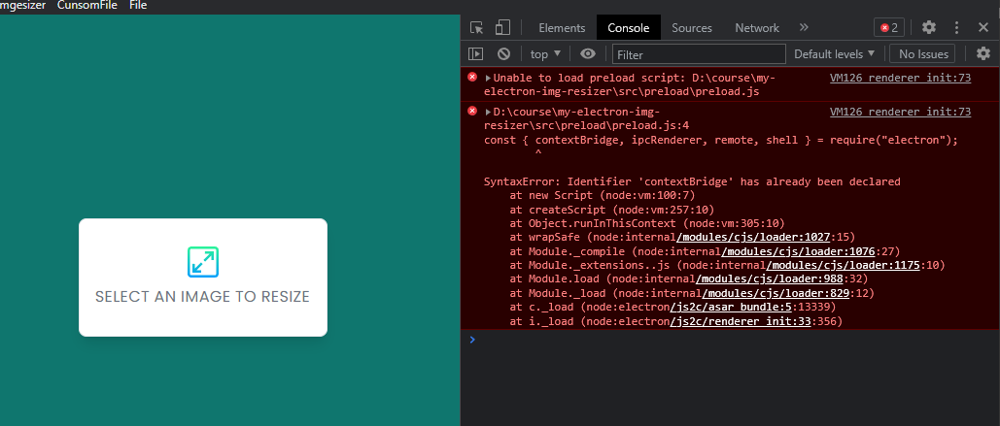

Правильный пример: нужно закидывать модули через `{ }`
`preload.js`

```JS
const { contextBridge, ipcRenderer, remote, shell } = require("electron");
```

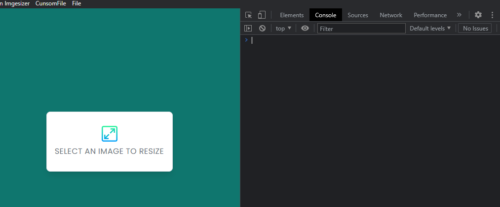

### 2 ошибка

> В `renderer.js` может автоматически произвестись импорт функции, которую мы подключили через `preload`. Нужно следить, чтобы в рендерере не было импортов модулей из электрона и ноды

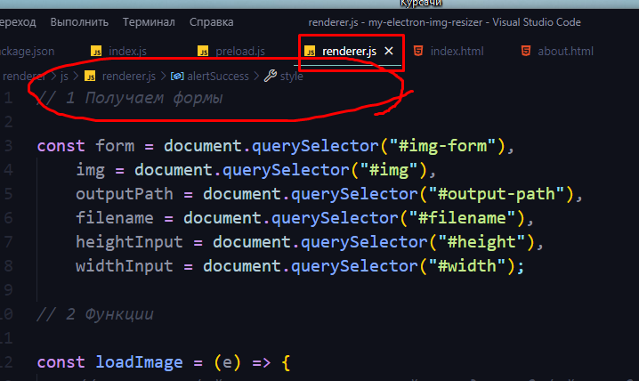

## Генерация проекта Electron-приложения

Через npm-пакет ==electron-app== создадим шаблон electron-приложения
Дальше установим плагин для уведомлений на ОС и сам изменитель разрешений изобаржений
И командой `npx electronmon .` мы будем запускать нормальное обновление приложения при каждом изменении кода (оно будет перезагружаться, если будем менять JS-код и обновлять страницу браузера, если будем корректировать фронт)

```bash
npm init electron-app@latest my-electron-img-resizer

npm i toastify-js resize-img --save-dev

npx electronmon .
```

## Пишем начальную работу окон (main process)

Самая начальная часть - основная логика нашего приложения, которая представляет из себя `main` процесс. Он воплощает собой бэкэнд нашего сайта, который создаёт сами окна приложения, реализует определённый функционал по обработке, созданию и измению файлов на нашем компьютере.

1. Импорты. Тут можно импортировать как сами модули электрона, так и модули ноды.
2. Отслеживание сред. Тут мы проверяем, в какой среде разработки мы находимся и на какой операционной системе. В зависимости от результатов, приложение будет себя вести по разному.
3. Через инстанс `BrowserWindow` создаётся новое окно приложения, которое представляет из себя окно браузера
4. Далее было создано окно "о приложении" через ещё один инстанс окна браузера
5. Далее идёт блок кода, который срабатывает при запуске приложения
6. Тут мы запускаем рендер нашего основного окна
7. Далее мы присваиваем ему новое меню
8. Новое меню создаётся через формирование своего собственного шаблона этой панели
9. Далее мы создадим условие, которое не даст запустить повторно новый инстанс приложения
10. И последним блоком условия мы закрываем само приложение, если закрыты все его окна (актуально на маке)

```JS
// 1

// основные библиотеки электрона
const { app, BrowserWindow, Menu } = require("electron");
// библиотеки ноды
// модуль работы с путями на компьютере
const path = require("path");

// 2

// проверяем, находимся ли мы в режиме разработчика
const isDev = process.env.NODE_ENV !== "production";
// проверяет, является ли система маком
const isMac = process.platform !== "darwin";

// 8

// Шаблон нашего собственного меню приложения (находится в самом верху)
const menu = [
	// так же мы можем вставить название меню по условию ...(условие ? [одно меню] : [пустой либо другое меню])
	// если мы пользуемся маком, то выведем меню с названием нашего приложения
	...(isMac
		? [
				{
					label: app.name,
					submenu: [
						{ label: "About", click: () => createAboutWindow() },
					],
				},
		  ]
		: []),
	// мы можем создать наше кастомное меню
	{
		// название группы меню
		label: "CunsomFile",
		// подменю
		submenu: [
			{
				// название подменю
				label: "Quit",
				// функция этого подменю
				click: () => app.quit(),
				// быстрые сочетания клавиш для срабатывания функции
				accelerator: "Ctrl+W",
			},
		],
	},
	// а можем добавить встроенные функции меню
	{
		role: "fileMenu",
	},
	// если сидим не на маке, то создадим пункт Help
	...(!isMac
		? [
				{
					label: "Help",
					submenu: [
						{ label: "About", click: () => createAboutWindow() },
					],
				},
		  ]
		: []),
];

if (require("electron-squirrel-startup")) {
	app.quit();
}

// 3

// функция для создания нового основного окна браузера
const createMainWindow = () => {
	// создаём окно
	const mainWindow = new BrowserWindow({
		// если мы находимся в режиме разработчика, то делаем окно шире (для девтулза)
		width: isDev ? 1100 : 600,
		height: 600,
		webPreferences: {
			// подключаем прелоад - пишем актуальный путь до него от этого файла
			preload: path.join(__dirname, "../preload/preload.js"),
		},
	});

	// загружаем браузерную страницу - основное окно браузера
	mainWindow.loadFile(path.join(__dirname, "../renderer/index.html"));

	// если мы находимся в режиме разработки, то открываем инструменты разработчика
	if (isDev) {
		mainWindow.webContents.openDevTools();
	}
};

// 4

// функция для создания окна о приложении
const createAboutWindow = () => {
	// создаём окно
	const aboutWindow = new BrowserWindow({
		width: 300,
		height: 300,
		autoHideMenuBar: true,
		webPreferences: {
			// подключаем прелоад - пишем актуальный путь до него от этого файла
			preload: path.join(__dirname, "../preload/preload.js"),
		},
	});

	// загружаем браузерную страницу - основное окно браузера
	aboutWindow.loadFile(path.join(__dirname, "../renderer/about.html"));
};

// 5

// когда приложение будет готово, запустим рендер окна
app.whenReady().then(() => {

	// 6

	// запускаем функцию создания окна
	createMainWindow();

	// 7

	// Подставляем в приложение наше собственное меню
	const mainMenu = new Menu.buildFromTemplate(menu);
	Menu.setApplicationMenu(mainMenu);

	// 9

	// если приложение активно, то не даём запустить новый инстанс приложения
	app.on("activate", () => {
		if (BrowserWindow.getAllWindows().length === 0) {
			createWindow();
		}
	});
});

// 10

// если мы сидим на маке, то отключаем инстанс приложения при закрытии окна
app.on("window-all-closed", () => {
	if (isMac) {
		app.quit();
	}
});

```

Как итог наше приложение запускается в режиме разработчика шире и с девтулзом

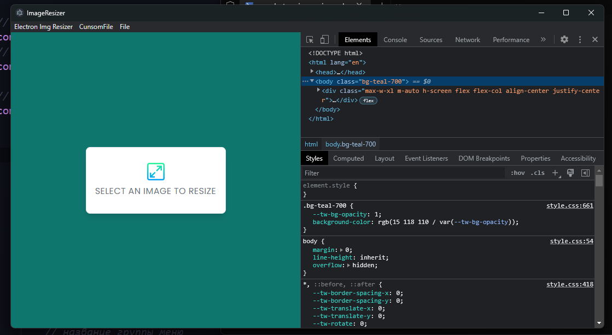

Мы можем кликнуть по окну "О приложении"

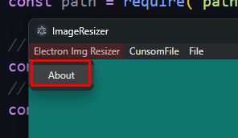

И это окно вызовется

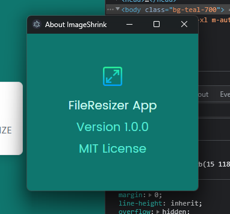

И так же закрыть приложение через наше кастомное меню

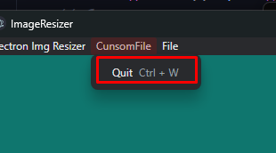

## Пишем фронт (renderer процесс)

Непосредственно `renderer` процесс представляет из себя самый обычный JS файл, который мы можем подцепить к нашей странице и начать в нём писать фронт-энд логику

1. Мы получаем элементы с нашей страницы
2. Мы создаём функцию загрузки изображения
3. Мы вызываем ивенты

```JS
// 1 Получаем формы

const form = document.querySelector("#img-form"),
	img = document.querySelector("#img"),
	outputPath = document.querySelector("#output-path"),
	filename = document.querySelector("#filename"),
	heightInput = document.querySelector("#height"),
	widthInput = document.querySelector("#width");

// 2 Функции

const loadImage = (e) => {
	// получаем файл из инпута, который находится в файлах ивента
	const file = e.target.files[0];

	// проверяем, является ли импортнутый файл изображением
	if (!isFileImage(file)) {
		// не продолжаем выполнять код, так как приложение не получило изображение
		return;
	}

	// Получаем оригинальные размеры
	// создаём инстанс изображеия по нашему объекту
	const image = new Image();
	image.src = URL.createObjectURL(file);
	// и далее нужно из полученного изображения выцепить размеры
	// тут используем ~обязательно~ анонимную функцию
	image.onload = function () {
		widthInput.value = this.width;
		heightInput.value = this.height;
	};

	// отображаем интерфейс изменения размеров изображения
	form.style.display = "block";
	// выведем название нашего изображения
	filename.innerText = file.name;
};

// Функция, которая проверяет, является ли файл изображением
const isFileImage = (file) => {
	// типы, которые мы поддерживаем
	const acceptedImageTypes = ["image/png", "image/gif", "image/jpeg"];

	// возвращает true, если содержимое переменной file.type = одному из значений массива с нужными типами
	return file && acceptedImageTypes.includes(file["type"]);
};

// 3 Ивенты

img.addEventListener("change", loadImage);

```

В итоге, сейчас мы можем закинуть фотографию в приложение и получить его имя и размеры высоты и ширины

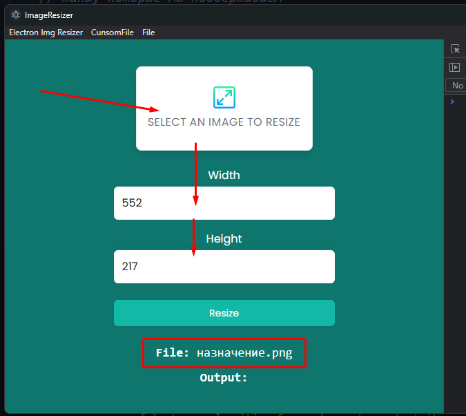

## Пишем мост между браузерным АПИ и ОС (preload процесс)

`preload` позволяет нам пользоваться функциями ноды в `renderer` процессе. А конкретно, нам нужно произвести все нужные импорты, которые нужно было бы осуществить в `renderer` процесс

Первым делом нужно подключить `preload` файл в наш `main.js`

`main.js`

```JS
// функция для создания нового основного окна браузера
const createMainWindow = () => {
	// создаём окно
	const mainWindow = new BrowserWindow({
		// если мы находимся в режиме разработчика, то делаем окно шире (для девтулза)
		width: isDev ? 1100 : 600,
		height: 600,
		webPreferences: {
			// подключаем прелоад - пишем актуальный путь до него от этого файла
			preload: path.join(__dirname, "../preload/preload.js"),
		},
	});

/// ... код
```

Дальше в самом `preload` нужно произвести сами ипорты нужных модулей и экспортировать их через `contextBridge.exposeInMainWorld()`, в который первым аргументом передадим имя объекта, который хранит функции, а вторым аргументом сам объект с функциями, которые нужно перенести.

`preload.js`

```JS
const os = require("os");
const path = require("path");
const { contextBridge } = require("electron");

// тут будем пользоваться функцией получения домашнего пути компьютера
contextBridge.exposeInMainWorld("os", {
	homedir: () => os.homedir(),
});

// тут дублируем работу функции path.join(передаём аргументы в порядке обычной работы этой функции)
contextBridge.exposeInMainWorld("path", {
	join: (...args) => path.join(...args),
});
```

И уже тут мы можем непосредственно пользоваться теми функциями, которые мы передали из `preload`

`renderer.js`

```JS
const loadImage = (e) => {
	const file = e.target.files[0];

	if (!isFileImage(file)) {
		return;
	}

	const image = new Image();
	image.src = URL.createObjectURL(file);
	image.onload = function () {
		widthInput.value = this.width;
		heightInput.value = this.height;
	};

	form.style.display = "block";
	filename.innerText = file.name;

	//! Тут уже будет использоваться функция из preload
	// получаем конечный путь до сгенерированного файла
	outputPath.innerText = path.join(os.homedir(), "imageresizer");
};
```

## toastify-js

Модуль `toastify-js` позволяет нам выводить уведомления пользователю об ошибке или успешном выполнении операции

Все сторонние модули в `renderer` процесс нужно подключать через `preload`. Поэтому для начала передадим сюда функцию создания уведомления.

```JS
const os = require("os");
const path = require("path");
const Toastify = require("toastify-js"); // сам модуль сообщения
const { contextBridge } = require("electron");

contextBridge.exposeInMainWorld("os", {
	homedir: () => os.homedir(),
});

contextBridge.exposeInMainWorld("path", {
	join: (...args) => path.join(...args),
});

//! тут непосредственно передаём функцию вывода сообщения из модуля Toastify
contextBridge.exposeInMainWorld("Toastify", {
	toast: (options) => Toastify(options).showToast(),
});
```

Далее нам нужно реализовать сам вызов данной функции в целях оповещения пользователя

`renderer.js`

```JS
const loadImage = (e) => {
	const file = e.target.files[0];

	if (!isFileImage(file)) {
		//! Если загрузилось не изображение, то мы выведем сообщение об ошибке результате
		alertError("Please, select the image");
		return;
	}

	const image = new Image();
	image.src = URL.createObjectURL(file);
	image.onload = function () {
		widthInput.value = this.width;
		heightInput.value = this.height;
	};

	form.style.display = "block";
	filename.innerText = file.name;
	outputPath.innerText = path.join(os.homedir(), "imageresizer");

	//! Если изображение удачно загрузилось, то мы можем вывести сообщение о положительном результате
	alertSuccess("Image has been success loaded!");
};

//! Функция вывода сообщения об ошибке
const alertError = (message) => {
	Toastify.toast({
		text: message,
		duration: 5000,
		close: false,
		style: {
			background: "red",
			color: "white",
			textAlign: "center",
		},
	});
};

//! Функция вывода сообщения об успешной загрузке
const alertSuccess = (message) => {
	Toastify.toast({
		text: message,
		duration: 5000,
		close: false,
		style: {
			background: "green",
			color: "white",
			textAlign: "center",
		},
	});
};
```

При попытке загрузить любой файл помимо фото, у нас выходит ошибка

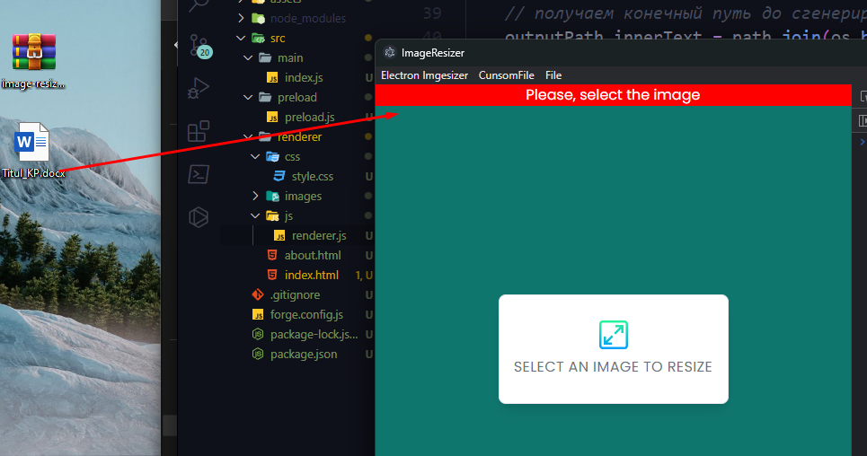

Когда загружаем фотографию, выходит положительное уведомление

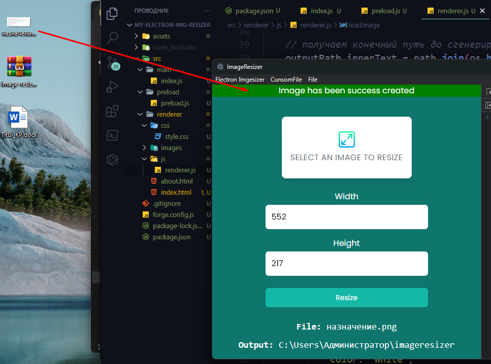

## IPC Renderer (Send) + IPC Main (Recieve)

Модуль ==IPC== внутри электрона обеспечивает создание канала общения и передачи уведомлений между `main` и `renderer` процессами

Для начала, нам нужно передать в `renderer` процесс саму функцию `ipcRenderer`, чтобы ей воспользоваться

`preload.js`

```JS
// импортируем ipcRenderer
const { contextBridge, ipcRenderer, remote, shell } = require("electron");

// передаём в рендерер-процесс функцию ipcRenderer
contextBridge.exposeInMainWorld("ipcRenderer", {
	send: (channel, data) => ipcRenderer.send(channel, data),
	on: (channel, func) =>
		ipcRenderer.on(channel, (event, ...args) => func(...args)),
});
```

Сейчас нам нужно реализовать ==Form Submit Handler== (форму отправки), которая будет осуществлять отправку изображения на бэк. В ней мы отправляем на бэк данные о пути до изображения, ширине изображения и высоте используя функцию `ipcRenderer()` (отправка изображения) по каналу `"image:resize"`

`renderer.js`

```JS
// Функция отправки изображения в мэин процесс
const sendImage = (e) => {
	e.preventDefault();

	// введённая высота и ширина в поля
	const width = widthInput.value;
	const height = heightInput.value;
	// получаем путь до расположения изображения
	const imgPath = img.files[0].path;

	// если было закинуто не изображение, то выведем ошибку
	if (!img.files[0]) {
		alertError("Please, load an image");
		return;
	}

	// если попытаемся указать ширину или высоту изображения меньше 1px, то получим ошибку
	if (width == "" || height == "") {
		alertError("Image is not corrected");
		return;
	}

	// ! отправляем через ipcRenderer опции изображения
	ipcRenderer.send("image:resize", {
		imgPath,
		width,
		height,
	});
};

// осуществляем отправку изображения на бэк через кнопку формы
form.addEventListener("submit", sendImage);
```

И в `main` процессе принимаем по каналу `"image:resize"` полученное изображение из нашего `renderer` процесса

`main.js`

```JS
const { app, BrowserWindow, Menu, ipcMain } = require("electron");

// получаем изображение с рендерер-процесса
ipcMain.on("image:resize", (e, options) => {
	console.log(options);
});
```

В итоге, мы видим в консоли опции изображения, которые мы передали в бэк

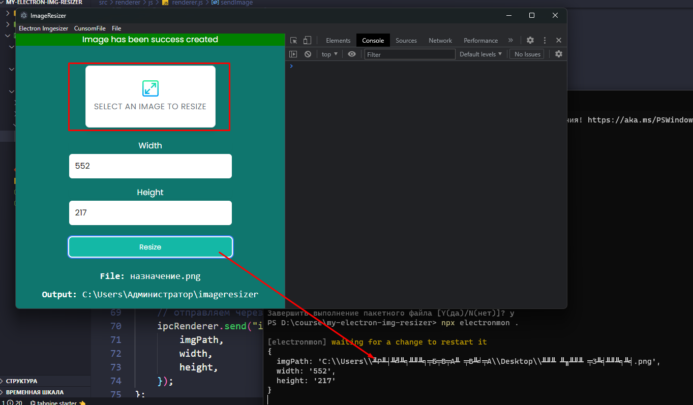

## Resize Image

Изменять размер изображения мы можем с помощью модуля ==Node.JS==.
Последовательность такая:

1. Подключаем модуль `resize-img`
2. Получаем уведомление из `renderer` процесса через модуль `ipcMain` и в нём же триггерим функцию `resizeImage()`
3. Функция `resizeImage()` генерирует изображение по заданным опциям, создаёт папку для изображений и туда сохраняет готовое изображение

`main.js`

```JS
// основные библиотеки электрона
// Menu - позволяет создать кастомное меню
// ipcMain - позволяет открыть канал отправки сообщений в рендерер-процесс
// shell - позволяет работать с проводником
const { app, BrowserWindow, Menu, ipcMain, shell } = require("electron");
// библиотеки ноды
// модуль работы с путями на компьютере
const path = require("path");
// работает с ОС
const os = require("os");
// позволяет создавать файлы, папки и работать с файловой системой
const fs = require("fs");
// Это сам модуль для изменения разрешения изображения
const resizeImg = require("resize-img");


// получаем изображение с рендерер-процесса
ipcMain.on("image:resize", (e, options) => {
	// укажем путь, куда должно быть сгенерировано фото
	options.dest = path.join(os.homedir(), "imageresizer");
	// производим изменение размера
	resizeImage(options);
});


// функция изменения размера изображения
const resizeImage = async ({ imgPath, height, width, dest }) => {
	try {
		// если всё нормально то реализуем изменение изображения
		const newPath = await resizeImg(fs.readFileSync(imgPath), {
			// добавляем ширину и высоту, переводя их в числовые значения через оператор "+"
			width: +width,
			height: +height,
		});

		// создаст имя файла
		const filename = path.basename(imgPath);

		// создаём папку назначения, если она не существует
		if (!fs.existsSync(dest)) {
			fs.mkdirSync(dest);
		}

		// и уже создаём файл в папке, которую создали выше
		fs.writeFileSync(path.join(dest, filename), newPath);

		// и отправляем уведомление обратно в редерер-процесс о том, что изображение создано
		mainWindow.webContents.send("image:done");

		// открываем папку с изображением
		shell.openPath(dest);
	} catch (error) {
		// и при ошибке будет выводиться ошибка
		console.log(error);
	}
};
```

## Catch Message In Renderer

Тут мы отправляем из функции `resizeImage` уведомление (просто создав канал `image:done`) в `renderer` процесс

`main.js`

```JS
// функция изменения размера изображения
const resizeImage = async ({ imgPath, height, width, dest }) => {
	try {

		/// ... код

		// и отправляем уведомление обратно в редерер-процесс о том, что изображение создано
		mainWindow.webContents.send("image:done");

		/// ... код

	} catch (error) {
		// и при ошибке будет выводиться ошибка
		console.log(error);
	}
};
```

В `renderer` процессе создаём `ipcRenderer`, который сработает при получении сигнала от канала `image:done` из `main` процесса

`renderer.js`

```JS
// Функция отправки изображения в мэин процесс
const sendImage = (e) => {
	/// ... код
};

// Ловим событие image:done с готовым изображением
ipcRenderer.on("image:done", () => {
	alertSuccess(`Image is rendered to ${widthInput.value} x ${heightInput.value}!`);
});
```

## Make mainWindow Global

> Это очень важная часть, так как функция изменения изображения требует глобального доступа к основному окну (а иначе мы не сможем обратиться к нему для отправки уведомления)

`main.js`

```JS
// ! Делаем главное окно глобальным, чтобы воспользоваться им в функции изменения размера изображения
let mainWindow;


const createMainWindow = () => {
	mainWindow = new BrowserWindow({
		width: isDev ? 1100 : 600,
		height: 600,
		webPreferences: {
			contextIsolation: true,
			nodeIntegration: true,
			enableRemoteModule: true,
			// подключаем прелоад - пишем актуальный путь до него от этого файла
			preload: path.join(__dirname, "../preload/preload.js"),
		},
	});

	mainWindow.loadFile(path.join(__dirname, "../renderer/index.html"));

	if (isDev) {
		mainWindow.webContents.openDevTools();
	}
};


app.whenReady().then(() => {
	createMainWindow();

	const mainMenu = new Menu.buildFromTemplate(menu);
	Menu.setApplicationMenu(mainMenu);

	// ! уничтожает mainWindow при закрытии, так как самостоятельно он не уничтожится
	mainWindow.on("closed", () => {
		mainWindow = null;
	});

	app.on("activate", () => {
		if (BrowserWindow.getAllWindows().length === 0) {
			createWindow();
		}
	});
});
```

## Test Production Mode

Тут можно поменять режим разработки (изначально он `development`)

`main.js`

```JS
// тут мы можем поменять режим разработки
process.env.NODE_ENV = "production";


// проверяем, находимся ли мы в режиме разработчика
const isDev = process.env.NODE_ENV !== "production";
// проверяет, является ли система маком
const isMac = process.platform !== "darwin";
```

## Упаковка приложения

Эта команда собирает приложение и его установщик

```bash
npm run make
```

## Результат!

Мы закидываем изображение, меняем размер, нажимаем ==resize==

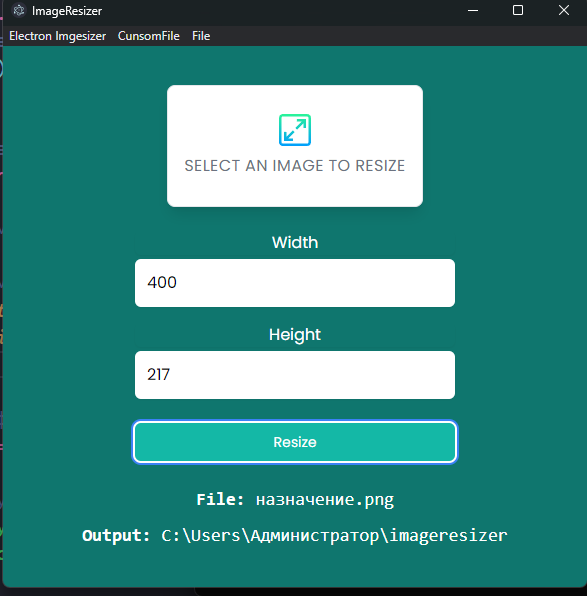

И автоматически открывается папка со сгенерированным изображением

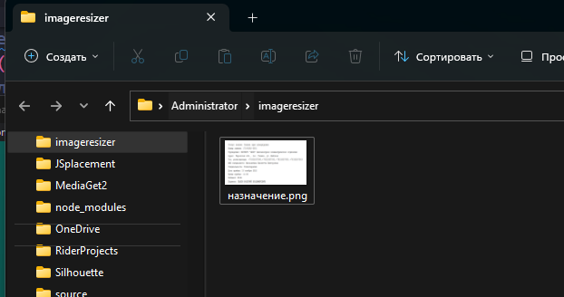

## Код и структура папок

`main.js`

```JS
// основные библиотеки электрона
// Menu - позволяет создать кастомное меню
// ipcMain - позволяет открыть канал отправки сообщений в рендерер-процесс
// shell - позволяет работать с проводником
const { app, BrowserWindow, Menu, ipcMain, shell } = require("electron");
// библиотеки ноды
// модуль работы с путями на компьютере
const path = require("path");
// работает с ОС
const os = require("os");
// позволяет создавать файлы, папки и работать с файловой системой
const fs = require("fs");
// Это сам модуль для изменения разрешения изображения
const resizeImg = require("resize-img");

// тут мы можем поменять режим разработки
process.env.NODE_ENV = "production";

// проверяем, находимся ли мы в режиме разработчика
const isDev = process.env.NODE_ENV !== "production";
// проверяет, является ли система маком
const isMac = process.platform !== "darwin";

// Шаблон нашего собственного меню приложения (находится в самом верху)
const menu = [
	// так же мы можем вставить название меню по условию ...(условие ? [одно меню] : [пустой либо другое меню])
	// если мы пользуемся маком, то выведем меню с названием нашего приложения
	...(isMac
		? [
				{
					label: app.name,
					submenu: [
						{ label: "About", click: () => createAboutWindow() },
					],
				},
		  ]
		: []),
	// мы можем создать наше кастомное меню
	{
		// название группы меню
		label: "CunsomFile",
		// подменю
		submenu: [
			{
				// название подменю
				label: "Quit",
				// функция этого подменю
				click: () => app.quit(),
				// быстрые сочетания клавиш для срабатывания функции
				accelerator: "Ctrl+W",
			},
		],
	},
	// а можем добавить встроенные функции меню
	{
		role: "fileMenu",
	},
	// если сидим не на маке, то создадим пункт Help
	...(!isMac
		? [
				{
					label: "Help",
					submenu: [
						{ label: "About", click: () => createAboutWindow() },
					],
				},
		  ]
		: []),
];

if (require("electron-squirrel-startup")) {
	app.quit();
}

// ! Делаем главное окно глобальным, чтобы воспользоваться им в функции изменения размера изображения
let mainWindow;

// функция для создания нового основного окна браузера
const createMainWindow = () => {
	// создаём окно
	mainWindow = new BrowserWindow({
		// если мы находимся в режиме разработчика, то делаем окно шире (для девтулза)
		width: isDev ? 1100 : 600,
		height: 600,
		webPreferences: {
			contextIsolation: true,
			nodeIntegration: true,
			enableRemoteModule: true,
			// подключаем прелоад - пишем актуальный путь до него от этого файла
			preload: path.join(__dirname, "../preload/preload.js"),
		},
	});

	// загружаем браузерную страницу - основное окно браузера
	mainWindow.loadFile(path.join(__dirname, "../renderer/index.html"));

	// если мы находимся в режиме разработки, то открываем инструменты разработчика
	if (isDev) {
		mainWindow.webContents.openDevTools();
	}
};

// функция для создания окна о приложении
const createAboutWindow = () => {
	// создаём окно
	const aboutWindow = new BrowserWindow({
		width: 300,
		height: 300,
		autoHideMenuBar: true,
	});

	// загружаем браузерную страницу - основное окно браузера
	aboutWindow.loadFile(path.join(__dirname, "../renderer/about.html"));
};

// когда приложение будет готово, запустим рендер окна
app.whenReady().then(() => {
	// запускаем функцию создания окна
	createMainWindow();

	// Подставляем в приложение наше собственное меню
	const mainMenu = new Menu.buildFromTemplate(menu);
	Menu.setApplicationMenu(mainMenu);

	// уничтожает mainWindow при закрытии, так как самостоятельно он не уничтожится
	mainWindow.on("closed", () => {
		mainWindow = null;
	});

	// если приложение активно, то не даём запустить новый инстанс приложения
	app.on("activate", () => {
		if (BrowserWindow.getAllWindows().length === 0) {
			createWindow();
		}
	});
});

// получаем изображение с рендерер-процесса
ipcMain.on("image:resize", (e, options) => {
	// укажем путь, куда должно быть сгенерировано фото
	options.dest = path.join(os.homedir(), "imageresizer");
	// производим изменение размера
	resizeImage(options);
});

// функция изменения размера изображения
const resizeImage = async ({ imgPath, height, width, dest }) => {
	try {
		// если всё нормально то реализуем изменение изображения
		const newPath = await resizeImg(fs.readFileSync(imgPath), {
			// добавляем ширину и высоту, переводя их в числовые значения через оператор "+"
			width: +width,
			height: +height,
		});

		// создаст имя файла
		const filename = path.basename(imgPath);

		// создаём папку назначения, если она не существует
		if (!fs.existsSync(dest)) {
			fs.mkdirSync(dest);
		}

		// и уже создаём файл в папке, которую создали выше
		fs.writeFileSync(path.join(dest, filename), newPath);

		// и отправляем уведомление обратно в редерер-процесс о том, что изображение создано
		mainWindow.webContents.send("image:done");

		// открываем папку с изображением
		shell.openPath(dest);
	} catch (error) {
		// и при ошибке будет выводиться ошибка
		console.log(error);
	}
};

// если мы сидим на маке, то отключаем инстанс приложения при закрытии окна
app.on("window-all-closed", () => {
	if (isMac) {
		app.quit();
	}
});
```

`preload.js`

```JS
const os = require("os");
const path = require("path");
const Toastify = require("toastify-js");
const { contextBridge, ipcRenderer, remote, shell } = require("electron");

// тут будем пользоваться функцией получения домашнего пути компьютера
contextBridge.exposeInMainWorld("os", {
	homedir: () => os.homedir(),
});

// тут дублируем работу функции path.join(передаём аргументы в порядке обычной работы этой функции)
contextBridge.exposeInMainWorld("path", {
	join: (...args) => path.join(...args),
});

// тут непосредственно передаём функцию вывода сообщения из модуля Toastify
contextBridge.exposeInMainWorld("Toastify", {
	toast: (options) => Toastify(options).showToast(),
});

// передаём в рендерер-процесс функцию ipcRenderer
contextBridge.exposeInMainWorld("ipcRenderer", {
	send: (channel, data) => ipcRenderer.send(channel, data),
	on: (channel, func) =>
		ipcRenderer.on(channel, (event, ...args) => func(...args)),
});
```

`renderer.js`

```JS
// 1 Получаем формы

const form = document.querySelector("#img-form"),
	img = document.querySelector("#img"),
	outputPath = document.querySelector("#output-path"),
	filename = document.querySelector("#filename"),
	heightInput = document.querySelector("#height"),
	widthInput = document.querySelector("#width");

// 2 Функции

const loadImage = (e) => {
	// получаем файл из инпута, который находится в файлах ивента
	const file = e.target.files[0];

	// проверяем, является ли импортнутый файл изображением
	if (!isFileImage(file)) {
		//! Если загрузилось не изображение, то мы выведем сообщение об ошибке результате
		alertError("Please, select the image");
		// не продолжаем выполнять код, так как приложение не получило изображение
		return;
	}

	// Получаем оригинальные размеры
	// создаём инстанс изображеия по нашему объекту
	const image = new Image();
	image.src = URL.createObjectURL(file);
	// и далее нужно из полученного изображения выцепить размеры
	// тут используем ~обязательно~ анонимную функцию
	image.onload = function () {
		widthInput.value = this.width;
		heightInput.value = this.height;
	};

	// отображаем интерфейс изменения размеров изображения
	form.style.display = "block";
	// выведем название нашего изображения
	filename.innerText = file.name;

	// получаем конечный путь до сгенерированного файла
	outputPath.innerText = path.join(os.homedir(), "imageresizer");

	//! Если изображение удачно загрузилось, то мы можем вывести сообщение о положительном результате
	alertSuccess("Image has been success created");
};

// Функция отправки изображения в мэин процесс
const sendImage = (e) => {
	e.preventDefault();

	// введённая высота и ширина в поля
	const width = widthInput.value;
	const height = heightInput.value;
	// получаем путь до расположения изображения
	const imgPath = img.files[0].path;

	// если было закинуто не изображение, то выведем ошибку
	if (!img.files[0]) {
		alertError("Please, load an image");
		return;
	}

	// если попытаемся указать ширину или высоту изображения меньше 1px, то получим ошибку
	if (width == "" || height == "") {
		alertError("Image is not corrected");
		return;
	}

	// отправляем через ipcRenderer
	ipcRenderer.send("image:resize", {
		imgPath,
		width,
		height,
	});
};

// Ловим событие image:done с готовым изображением
ipcRenderer.on("image:done", () => {
	alertSuccess(`Image is rendered to ${widthInput.value} x ${heightInput.value}!`);
});

// Функция, которая проверяет, является ли файл изображением
const isFileImage = (file) => {
	// типы, которые мы поддерживаем
	const acceptedImageTypes = ["image/png", "image/gif", "image/jpeg"];

	// возвращает true, если содержимое переменной file.type = одному из значений массива с нужными типами
	return file && acceptedImageTypes.includes(file["type"]);
};

//! Функция вывода сообщения об ошибке
const alertError = (message) => {
	Toastify.toast({
		text: message,
		duration: 5000,
		close: false,
		style: {
			background: "red",
			color: "white",
			textAlign: "center",
		},
	});
};

//! Функция вывода сообщения об успешной загрузке
const alertSuccess = (message) => {
	Toastify.toast({
		text: message,
		duration: 5000,
		close: false,
		style: {
			background: "green",
			color: "white",
			textAlign: "center",
		},
	});
};

// 3 Ивенты

// осуществляем загрузку изображения
img.addEventListener("change", loadImage);
// осуществляем отправку изображения на бэк
form.addEventListener("submit", sendImage);
```

`index.html`

```HTML
<!DOCTYPE html>
<html lang="en">

<head>
  <meta charset="UTF-8" />
  <meta name="viewport" content="width=device-width, initial-scale=1.0" />
  <!-- Нам обязательно нужно вставить модуль безопасности на эту страницу, чтобы не выскакивала ошибка в электроне -->
  <meta http-equiv="Content-Security-Policy" content="script-src 'self' 'unsafe-inline'" />
  <!-- Дальше уже идут подключения шрифтов, стилей и скрипта -->
  <link href="https://fonts.googleapis.com/css2?family=Poppins:wght@300;400;700&display=swap" rel="stylesheet" />
  <link rel="stylesheet" href="css/style.css" />
  <script src="js/renderer.js" defer></script>
  <title>ImageResizer</title>
</head>

<body class="bg-teal-700">
  <div class="max-w-xl m-auto h-screen flex flex-col align-center justify-center">
    <div class="flex flex-col w-full items-center justify-center bg-grey-lighter">
      <label
        class="w-64 flex flex-col items-center px-4 py-7 bg-white text-gray-500 rounded-lg shadow-lg tracking-wide uppercase border border-blue cursor-pointer hover:text-teal-800">
        
        <span class="mt-2 leading-normal">Select an image to resize</span>
        <input id="img" type="file" class="hidden" />
      </label>
    </div>

    <!-- Form -->
    <form id="img-form" class="hidden">
      <div class="mt-6">
        <label
          class="mt-1 block text-white text-center w-80 m-auto py-3 shadow-sm border-gray-300 rounded-md">Width</label>
        <input type="number" name="width" id="width"
          class="mt-1 block w-80 m-auto p-3 shadow-sm border-gray-300 rounded-md" placeholder="Width" />
      </div>

      <div class="mt-4">
        <label
          class="mt-1 block text-white text-center w-80 m-auto py-3 shadow-sm border-gray-300 rounded-md">Height</label>
        <input type="number" name="height" id="height"
          class="mt-1 block w-80 m-auto p-3 shadow-sm border-gray-300 rounded-md" placeholder="Height" />
      </div>

      <!-- Button -->
      <div class="mt-6">
        <button type="submit"
          class="w-80 m-auto flex justify-center py-2 px-4 border border-transparent shadow-sm text-sm font-medium rounded-md text-white bg-teal-500 hover:bg-teal-900 focus:outline-none focus:ring-2 focus:ring-offset-2 focus:ring-blue-500">
          Resize
        </button>

    </form>

    <p class="text-white text-lg text-center font-mono mt-6"><strong>File: </strong><span id="filename"></span></p>
    <p class="text-white text-lg text-center font-mono mt-2"><strong>Output: </strong><span id="output-path"></span></p>
  </div>
</body>
</html>
```

`about.html`

```html
<!DOCTYPE html>
<html lang="en">
	<head>
		<meta charset="UTF-8" />
		<meta name="viewport" content="width=device-width, initial-scale=1.0" />
		<!-- И вставляем этот модуль безопасности и на эту страничку -->
		<meta http-equiv="Content-Security-Policy" content="script-src 'self' 'unsafe-inline'" />
		<link rel="stylesheet" href="css/style.css" />
		<title>About ImageShrink</title>
	</head>

	<body class="bg-teal-700">
		<div class="max-w-xl m-auto h-screen flex flex-col align-center justify-center text-center">
			
			<h2 class="text-xl text-teal-100 text-center">FileResizer App</h2>
			<p class="text-xl text-teal-300 mt-2">Version 1.0.0</p>
			<p class="text-xl text-teal-300 mt-2">MIT License</p>
		</div>
	</body>
</html>
```

Структура папок и файлов

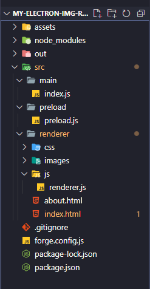
