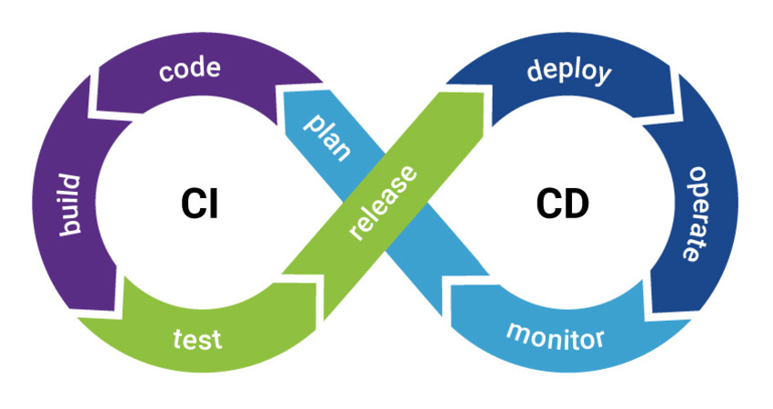
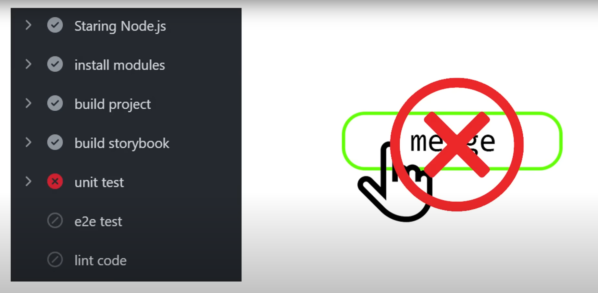
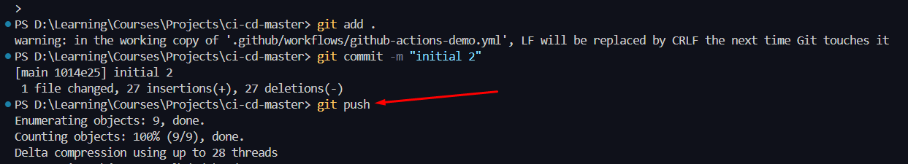
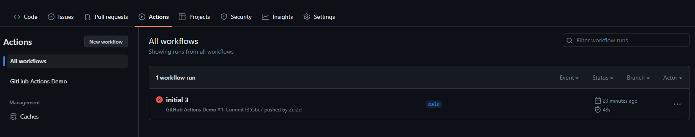
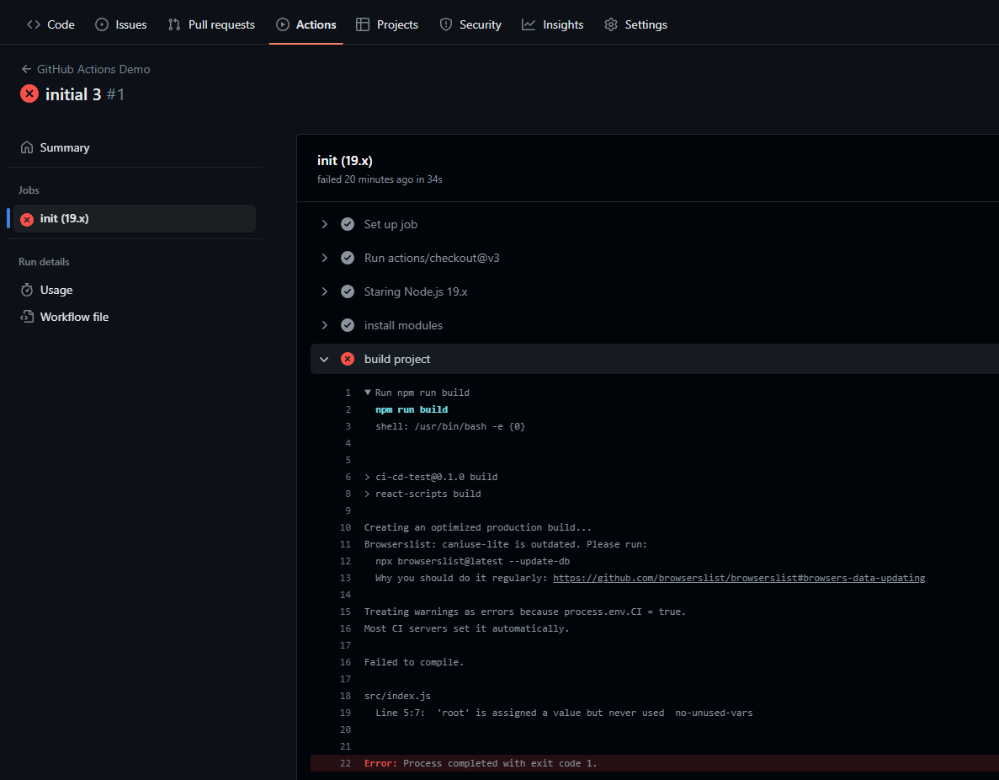
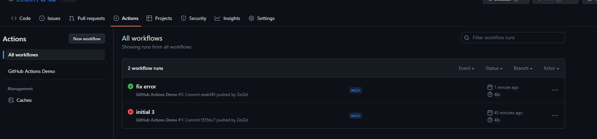
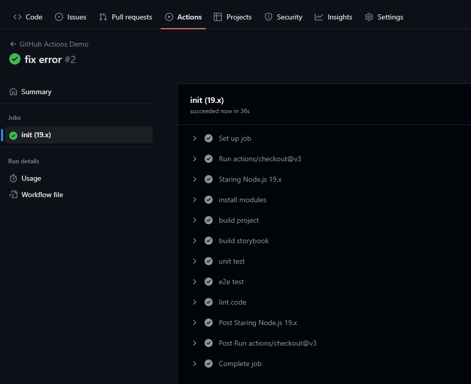
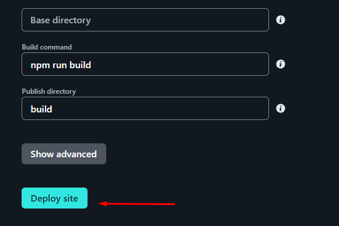
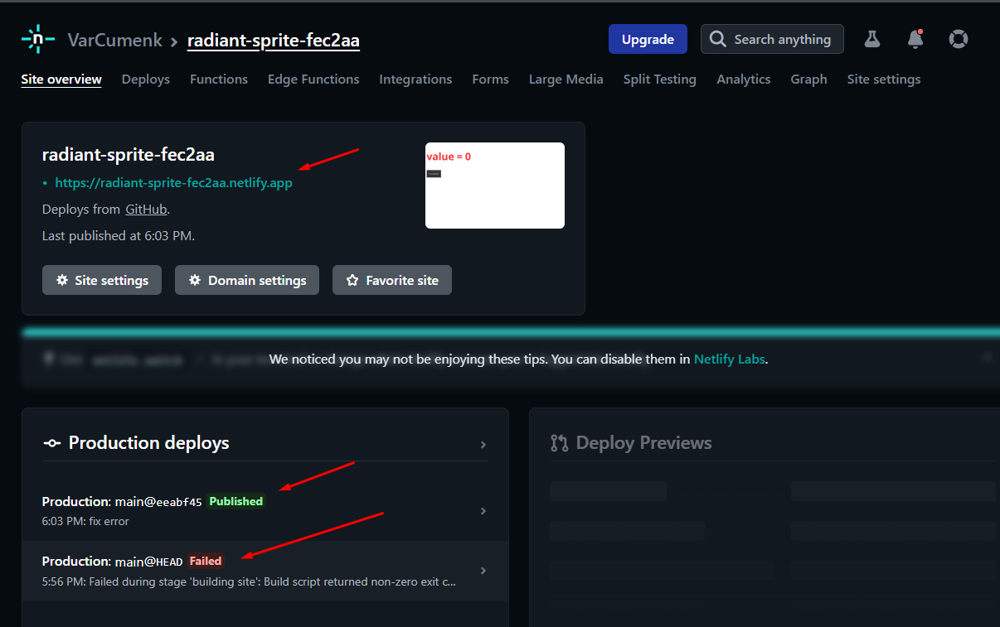
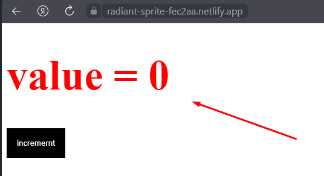

## Теория CI/CD

==CI== - ==Continuous integration== - Непрерывная интеграция
==CD== - ==Continuous delivery== - Непрерывное развёртывание

Пайплайн выглядит следующим образом:
- Планирование 
- Разработка
- Сборка
- Тестирование
- Релиз 
- Развёртывание
- Управление 
- Мониторинг



Пример:
- Менеджер присылает задачу
- Создаём ветку для создания новой фичи проекта
- Пишем код
- Далее создаём `pull`/`merge` `request` и отдаём код на ревью
- Если всё ок, то код можно заливать в мастер

Однако так же нужно было прогнать все проверки и тесты (разные линтеры, юниты, e2e и так далее). Однако это всё процесс очень долгий и выполнять его каждый раз самостоятельно - трудная задача

И тут в дело вступает CI. Она позволяет автоматизировать проведение всех проверок перед тем, как залить определённые изменения в ветку



CD же представляет из себя `merge` всех изменений с основной веткой, сборку приложения и деплой этой сборки

## Рассматриваем реальный пример. Приступаем к практике. CI pipeline. Github actions

CI зачастую реализуется через сервисы по типу GitLab, Jenkins, BitBucket, GitHub Actions. 

Конкретно тут был описан файл, который будет при `push` и `pull` в главную ветку запускать `jobs` по указанной стратегии

Каждый шаг указывается в `steps`

`.github > workflows > github-actions-demo.yml`
```YML
name: GitHub Actions Demo
on:
    push:
        branches: [main]
    pull_request:
        branches: [main]
jobs:
    init:
        runs-on: ubuntu-latest
        strategy:
            matrix:
                node-version: [19.x]
        steps:
            - uses: actions/checkout@v3
            - name: Staring Node.js ${{ matrix.node-version }}
              uses: actions/setup-node@v3
              with:
                  node-version: ${{ matrix.node-version }}
            - name: install modules
              run: npm install
            - name: build project
              run: npm run build
            - name: build storybook
              run: npm run build:storybook
            - name: unit test
              run: npm run test:unit
            - name: e2e test
              run: npm run test:e2e
            - name: lint code
              run: npm run lint
```

Теперь остаётся только залить изменения в ветку



Если мы словим ошибку, то гитхаб нам о ней даст знать





Если коммит пройдёт успешно, то будет указана галочка





## Настраиваем (CD) деплой приложения

Задеплоить приложение можно [сюда](https://app.netlify.com/)

Добавляем новый проект с нашего гитхаба и добавляем его в Нетлифай



Нетлифай берёт доступ к проекту на гитхабе и отслеживает его изменения, чтобы деплоить проект у себя автоматически



И по ссылке можно просмотреть приложение:



