## Учетные записи

- Контроль доступа - это метод аутентификации в системе по логину/паролю
- PAM - модули аутентификации в ПО / службах на линуксе
- Network Security - контролирует службы, взаимодействующие с сетью
- SSH (secure shell) - используется для удалённого доступа к серверу по незащищённой сети. Нужно для авторизованного использования удалённой машины
- SELinux - безопасность для машин в одной сети

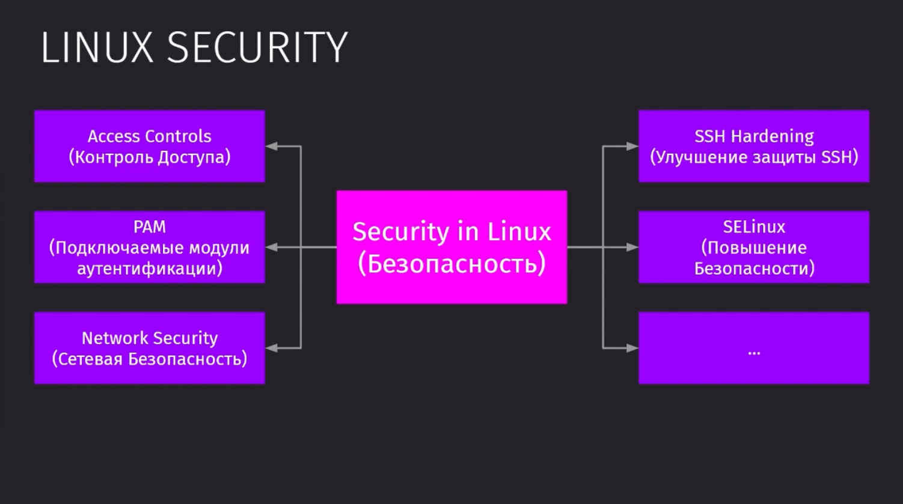

В системе линукс может быть сразу несколько пользователей. Каждый из них имеет свой логин, пароль и уникальный идентификатор (`u(ser)id`), по которому система и различает пользователей.

Информация об учётной записи пользователя находится в `etc/passwd`.

Группа в линуксе - это совокопность пользователей. Служит для организации пользователей на основе общих атрибутов (роли/функции).

Информация о группах хранится в `etc/group`. Группы определяются по `g(roup)id`.

Группы можно использовать например для того, чтобы разделять возможности разных пользователей в системе. Одни пользователи - разработчики, а другие - дизайнеры и всем нужны разные уровни доступа на некоторые файлы.

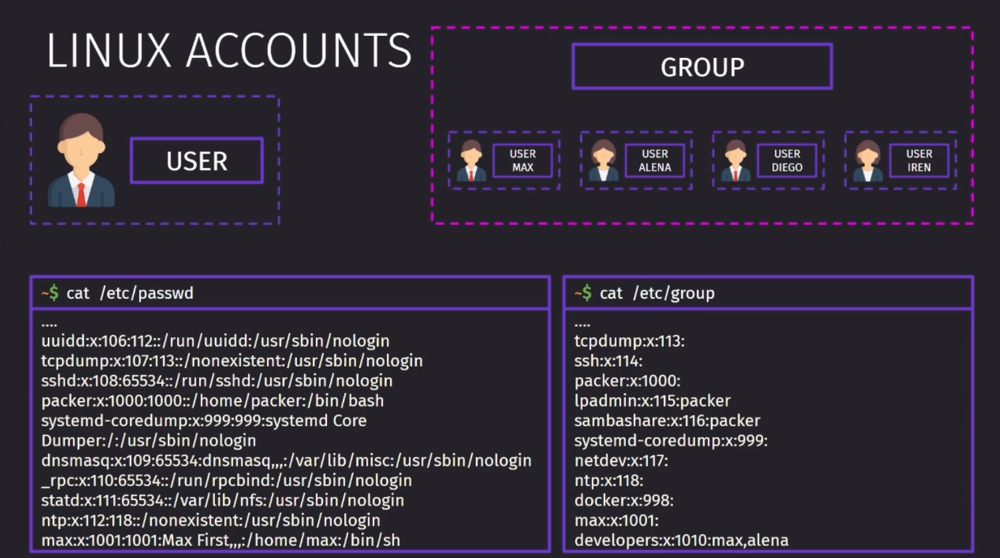

Каждому пользователю присвоен идентификатор и группа. Если при создании пользователя группу не указали, то `gid === uid`.

Так же в информации о пользователе можно найти его дефолтный каталог и информацию о его `shell`

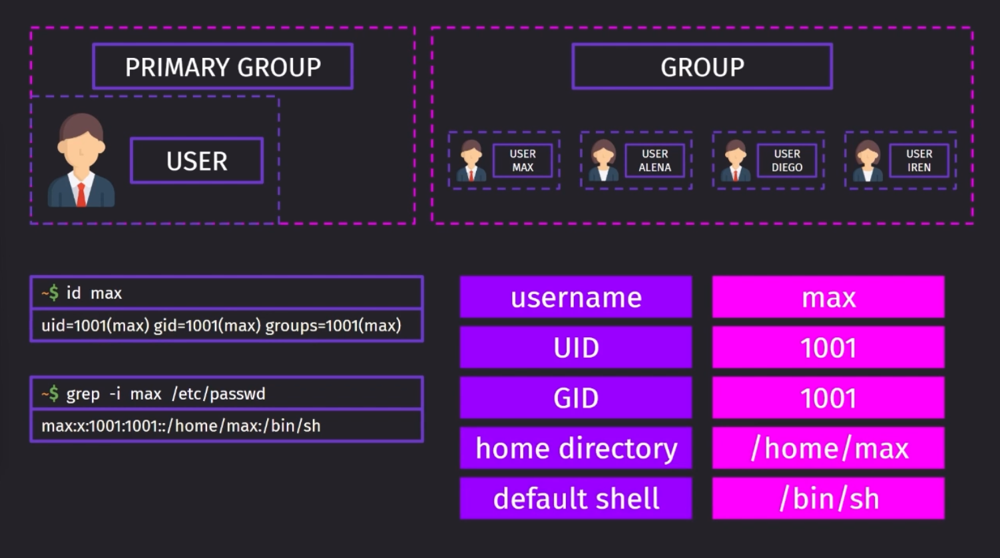

Так же в линуксе существует множество других видов аккаунтов:

- root - суперпользователь, который имеет полный контроль над системой
- системные - это учётные записи с uid от 100 до 500 (или 1000), которые не имеют собственного корневого каталога. Зачастую, это системные либо установленные службы (caddy, docker и так далее), которые запущены в системе
- пользовательские - аккаунты пользователей системы (до 65534)

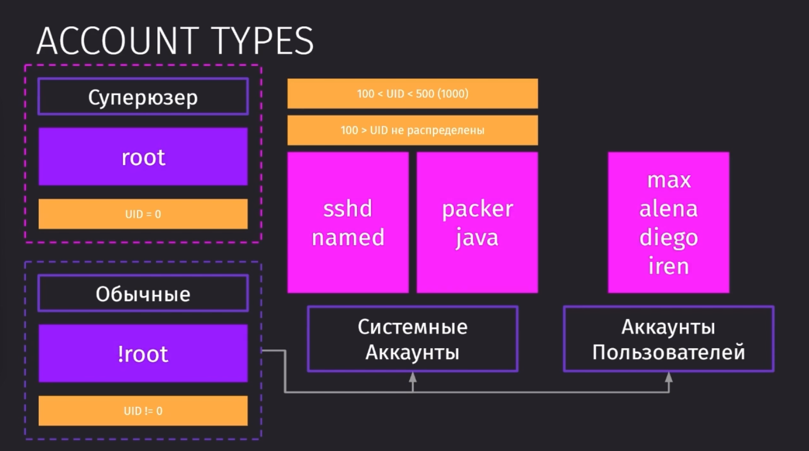

Команды:

- id - информация об определённом пользователе
- who - выведет, кто находится в системе
- w - смесь who и uptime
- last - отображает информацию о последних сеансах входа пользователей

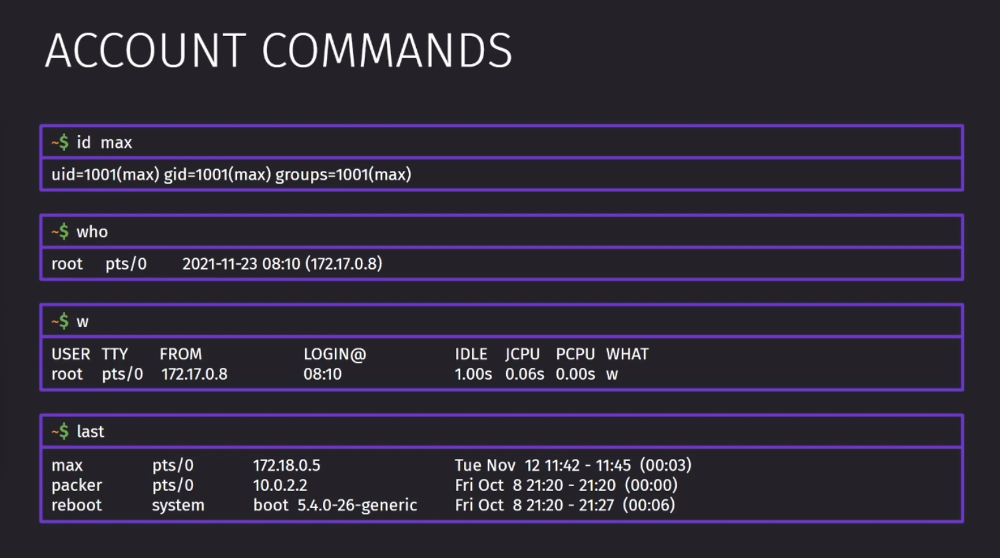

Так же через командную строку мы можем переключать пользователей.

`su` позволит переключиться на любого другого пользователя в системе, включая root (если знать его пароль)

Это не самый удобный способ. Лучше него использовать обычное `sudo` выполнение.

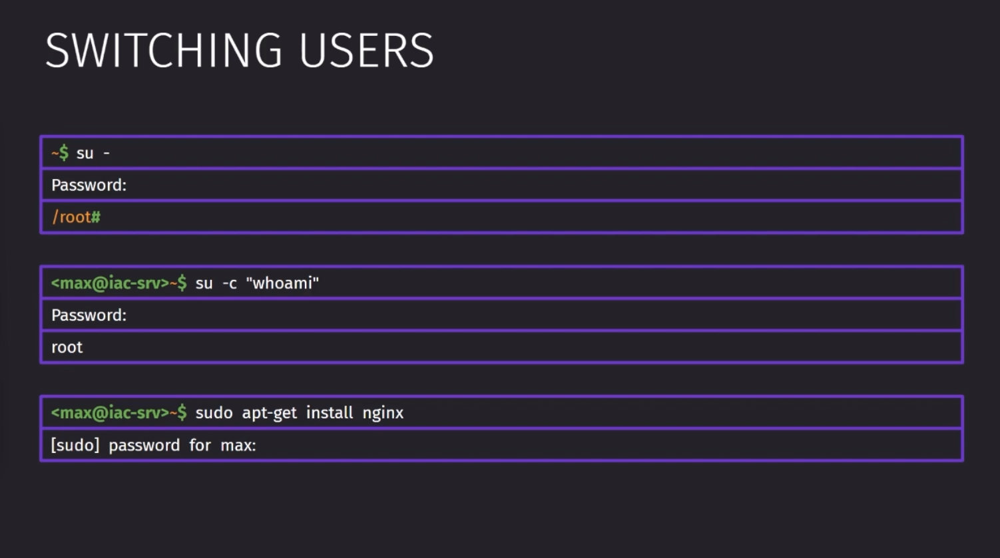

Все конфигурации того, что можно делать с помощью `sudo`, определяются в `etc/sudoers`. Так же там внесены пользователи, которым можно предоставить повышение прав (операция от root) за счёт использования `sudo`.

Настройка `nologin` запретит использование root-прав в системе.

Язык разметки для `sudo` - [EBNF](https://en.wikipedia.org/wiki/Extended_Backus–Naur_form).

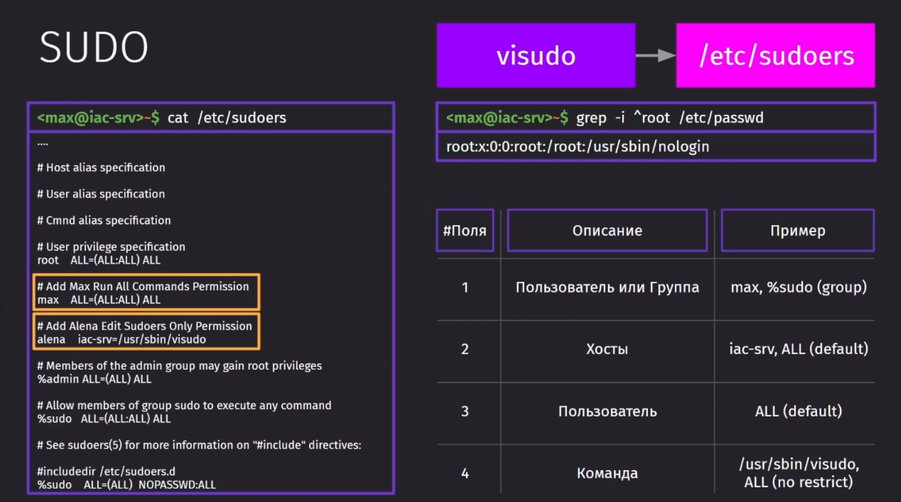

## Управление пользователями

- `useradd` - добавление пользователя
- в `etc/passwd` можно будет увидеть, что был создан пользователь с его группой
- `etc/shadow` - содержит информацию о выделенной системе
- `passwd` - позволит установить пароль пользователю. Если без аргументов, то устанавливаем пароль себе, если с `sudo` и указанием имени юзера, то для другого пользователя
- `whoami` - выведет текущего пользователя

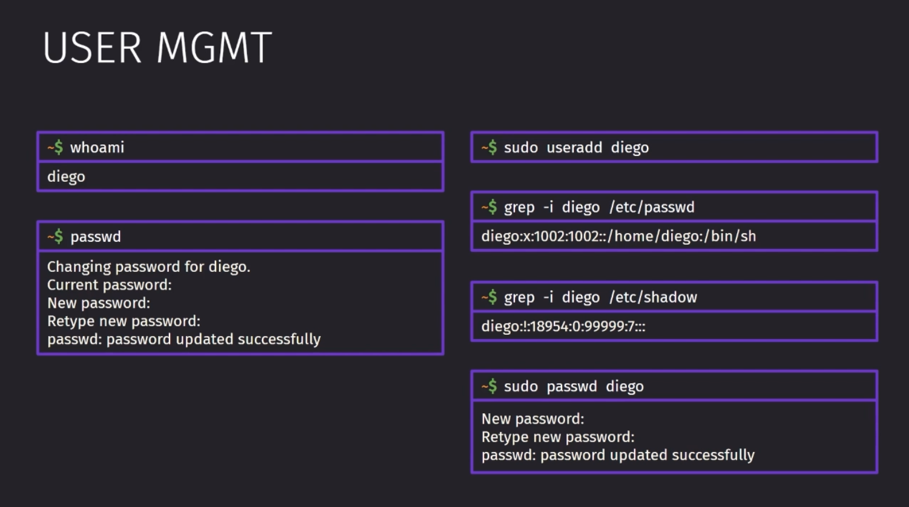

Так же команда `useradd` используется зачастую с дополнительными аргументами, которые позволят настроить группу, идентификатор, корневой каталог и другие параметры

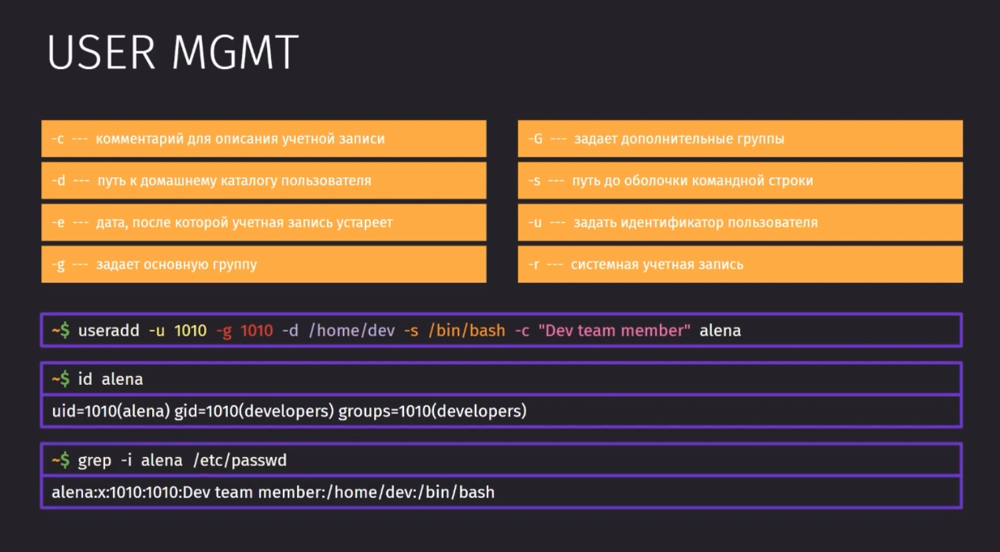

- `userdel` - удалит пользователя из системы
- `groupadd` - позволит создать группу
- `groupdel` - удалит группу

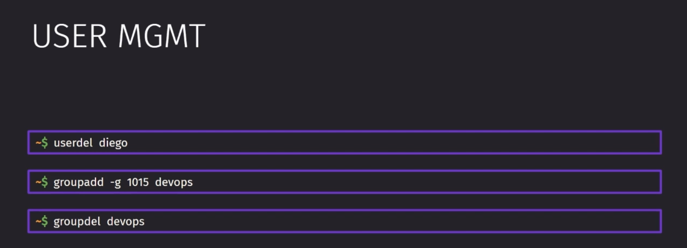

## Файлы управления доступом

Все файлы управления доступом располагаются в `/etc`, которые может просмотреть каждый, но изменить только рут.

`vipw` и `vigr` созданы для просмотра данных доступа в системе

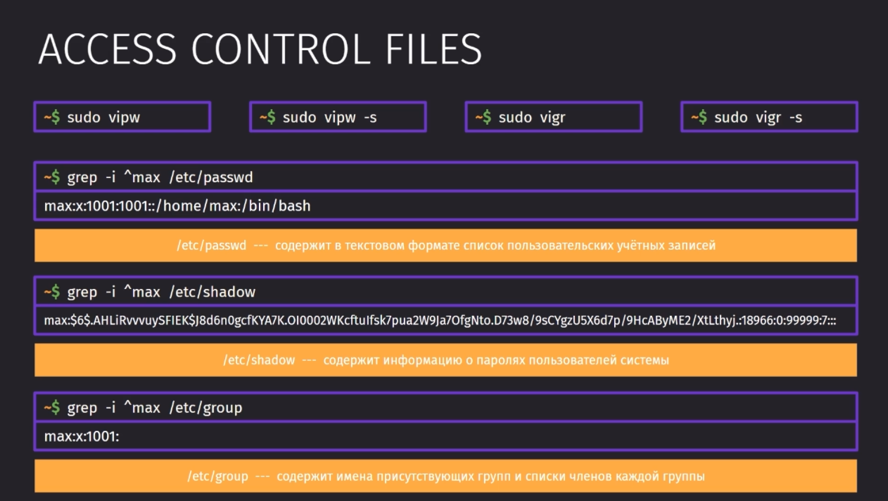

`etc/password`

- `name` - имя пользователя
- `password` - тип пароля (`x` - можно поменять, `!` - нельзя)
- `uid` - идентификатор пользователя
- `gid` - идентификатор группы
- `gecos` - это дополнительная информация о пользователе в формате CSV
- `homedir` - домашная директория
- `shell` - дефолтный шелл

`/etc/shadow`

- `username` - имя пользователя
- `password` - хеш пароля
- `lastchange` - дата последнего изменения
- `minage` - минимальный возраст после которого можно поменять пароль
- `maxage` - максимальный возраст пароля до смены
- `warn` - время уведомления о смене перед сменой пароля
- `inactive` - время отключения учётки при неактивности
- `expdate` - время протухания учётки

`/etc/group`

- `name` - группа
- `password` - тип пароля
- `gid` - идентификатор группы
- `members` - члены группы

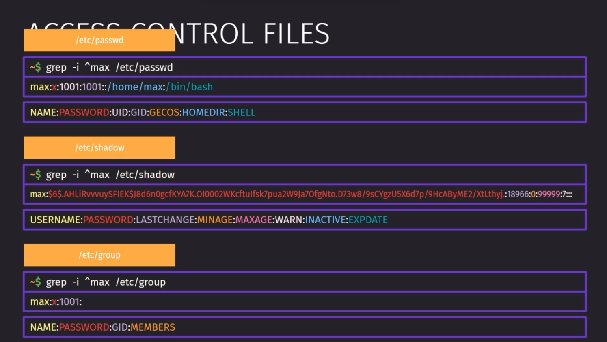

## Разрешения файла

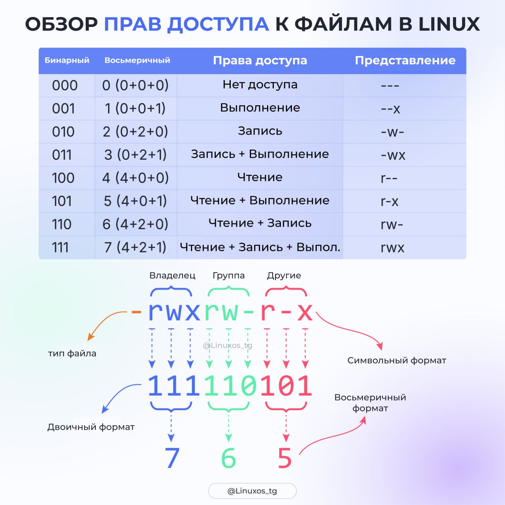

Первый символ - тип файла

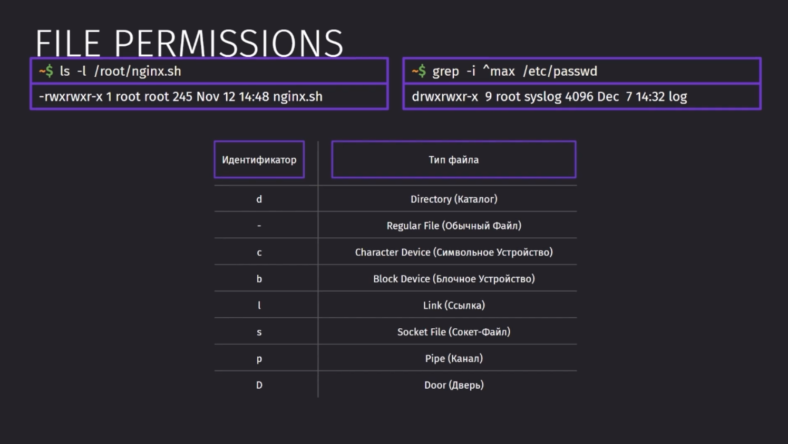

Далее последующие три символа описывают права доступа к файлу

- `r` - просмотреть содержимое
- `w` - изменение (изменить строку в файле / переименовать файл / создать файл)
- `x` - разрешение на исполнение файла (запустить скрипт / получить информацию о файлах)

В Linux всё является файлом. Файл, как есть, файл, а директория - это файл со списком файлов в нём.

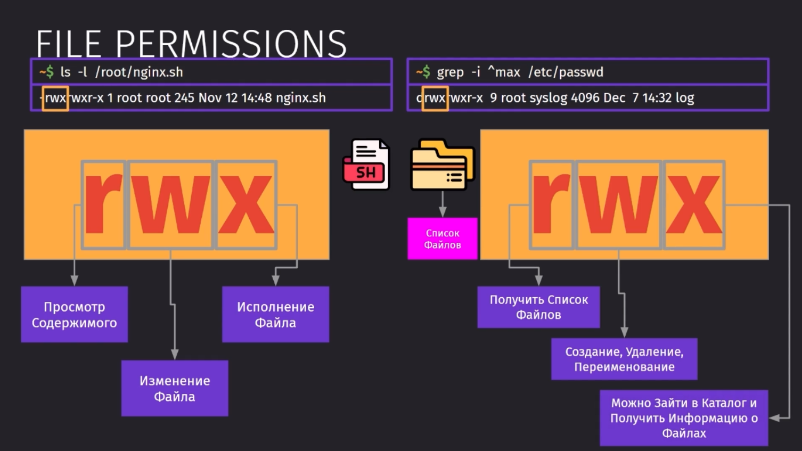

Тут представлены 9 символов + десятый. Десятый отвечает за идентификацию файла. Три предствленные секции на три группы:

- разрешения для владельца
- разрешения группы
- разрешения для других

В данном примере пользователь и группа имеют доступ на запись, а другие пользователи системы не имеют такого доступа. Однако все пользователи системы могут прочесить и выполнить данный файл (`r-x`).

Пробел доступа указывается как `-`

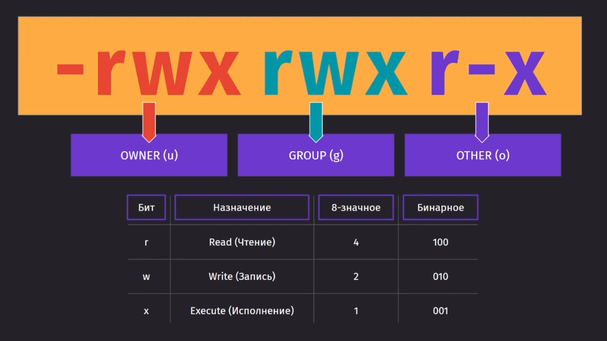

Такие же правила работают и для каталога. Имя доступ только `--x` пользователь может просто перейти в каталог, но не прочитать или записать новые файлы.

Так же все доступы можно представить в виде числового значения. Собирая сумму восьмибитного значения, мы можем получить определённый уровень доступа. Если сложим биты `rwx`, то в итоге получим `7`.

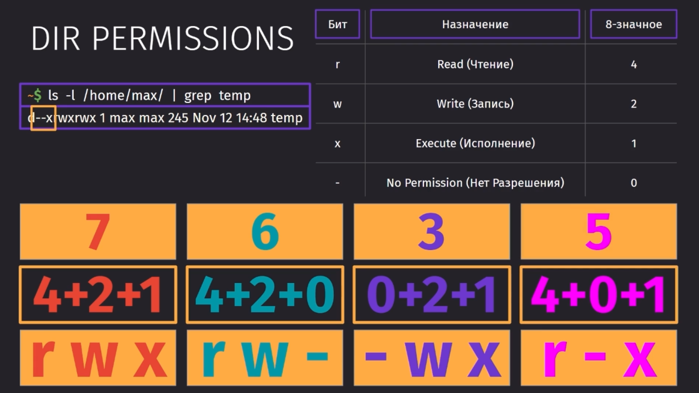

Чтобы поменять уровни доступа для файла или папки, нужно воспользоваться командой `chmod`.

- `u` - владелец
- `g` - группа
- `o` - остальные

- `+` - добавить права
- `-` - удалить права

- `rwx` - сами группы доступа

`u+rwx` - добавит полные права доступа для владельца файла. `g+rw-` - добавит права доступа на чтение и запись для группы. Все строковые права можно записать через запятую, чтобы настроить для каждого отдельно.

- `-R a+` - применение настроек доступа для директории и всех файлов в ней, включая так же все группы пользователей (владелец, группа, остальные)

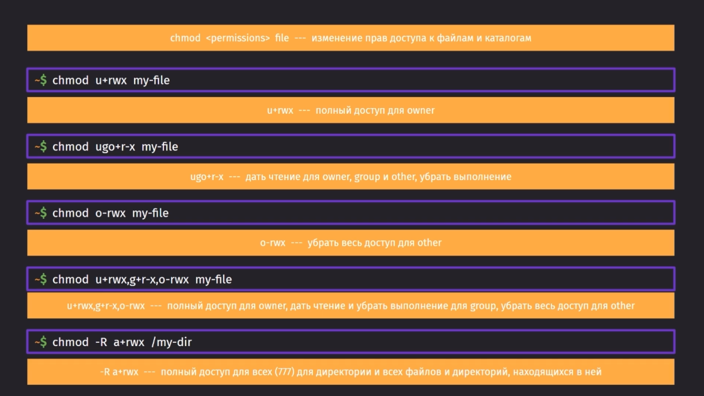

Так же можно задать те же самые права указав числа битовых сложений.

- `7` - `rwx`
- `6` - `rw-`
- `5` - `r-x`
- `0` - `---`

Первое число даёт права владельцу, второе - группе, третье - остальным.

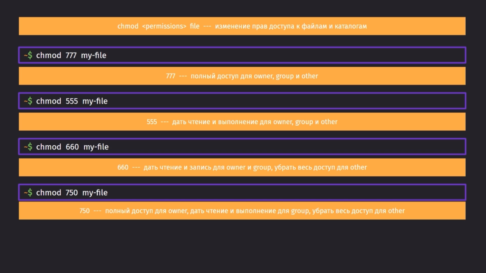

Так же с помощью:

- `chown` - мы можем поменять владельца и группу файла (либо просто владельца без `:`)
- `chgrp` - поменять группу файла

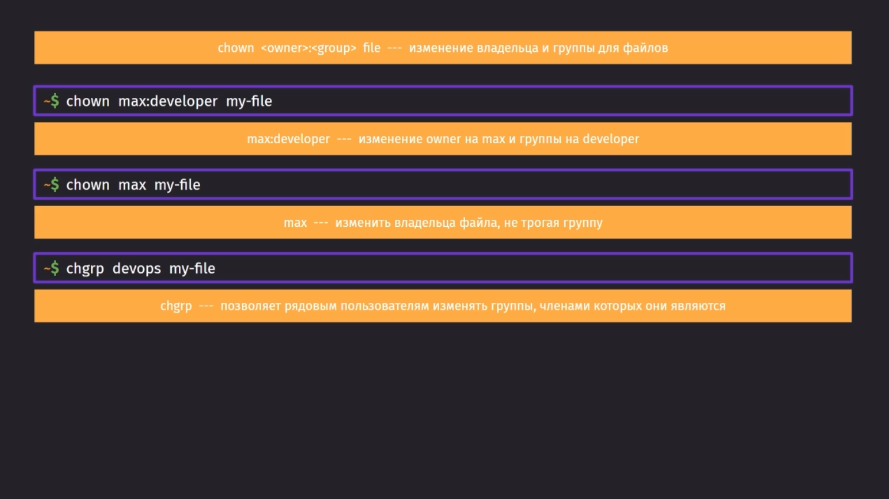

## SSH & SCP

### SSH

SSH (secure shell) - это безопасный терминал для выполнения операций над удалённым компьютером в небезопасной сети.

Команда `ssh` позволяет подключиться к удалённому серверу. Чтобы подключиться, нужно будет написать имя пользователя и хост/ip удалённого сервера. Если попытаться подключиться к серверу в сети без задания имени пользователя, то будет подключён текущий пользователь (если на сервере такой существует).

Дефолтно, каждый раз нужно будет вводить пароль для входа на сервер.

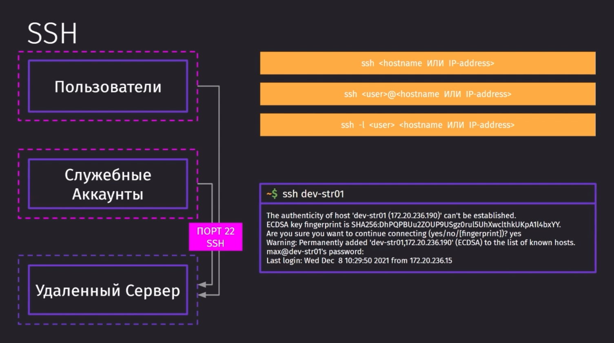

Чтобы не использовать пароль, можно использовать пару ключей (ключ на сервере и ключ на клиенте), которые будут подтверждать пользователя

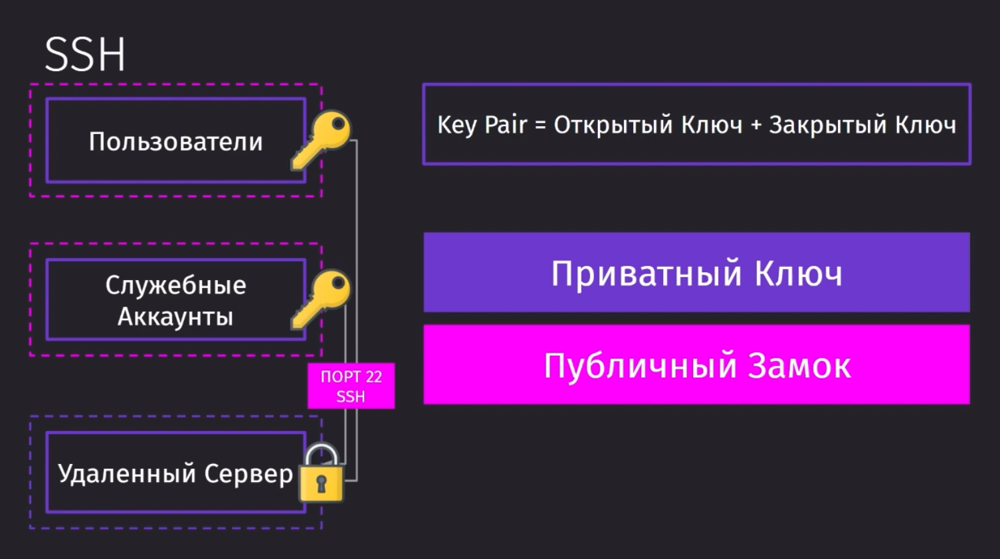

Чтобы сгенерировать ключ, который будет использоваться и на клиенте, и на сервере для авторизации, нужно:

1. Сгенерировать пароль на клиенте (у себя)

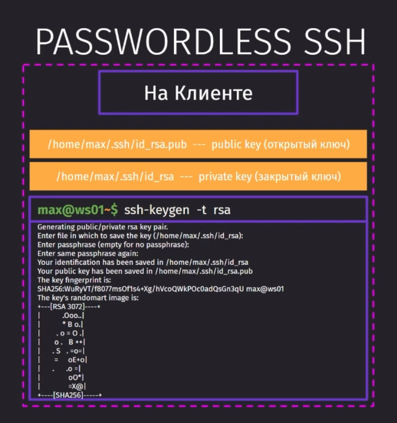

2. Подключиться к серверу через логин/пароль и уже на нём сгенерировать ключ

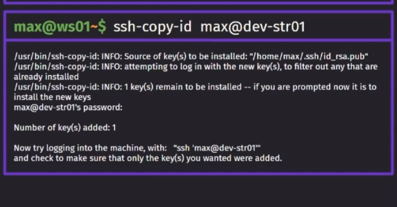

И в результате, теперь получится подключаться к shell сервера без ввода пароля

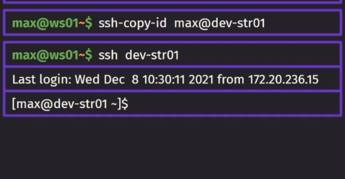

На сервере должен был сгенерироваться ключ для входа в учётную запись

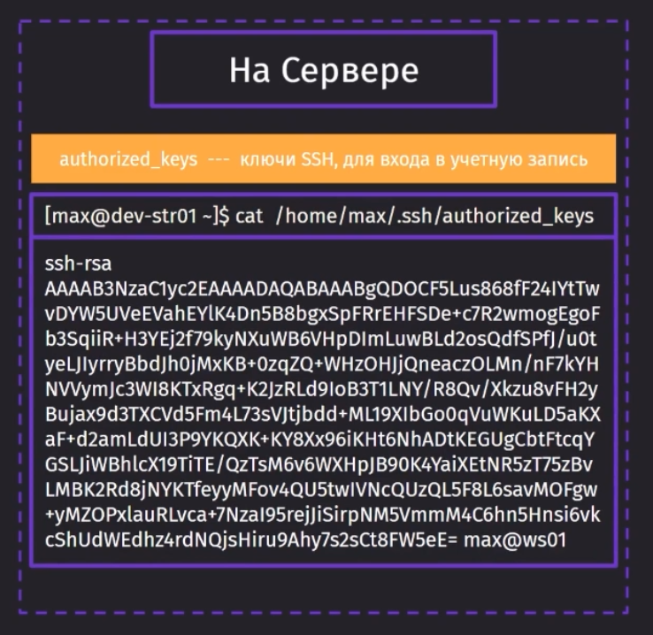

### SCP

Команда `scp` (secure copy) представляет нам возможность безопасно копировать файлы с клиента на сервер. Только тут нужно учесть, что на хосте должны быть права на вставку новых файлов для удалённого пользователя (`rw-`)

`-pr` - позволит скопировать папку

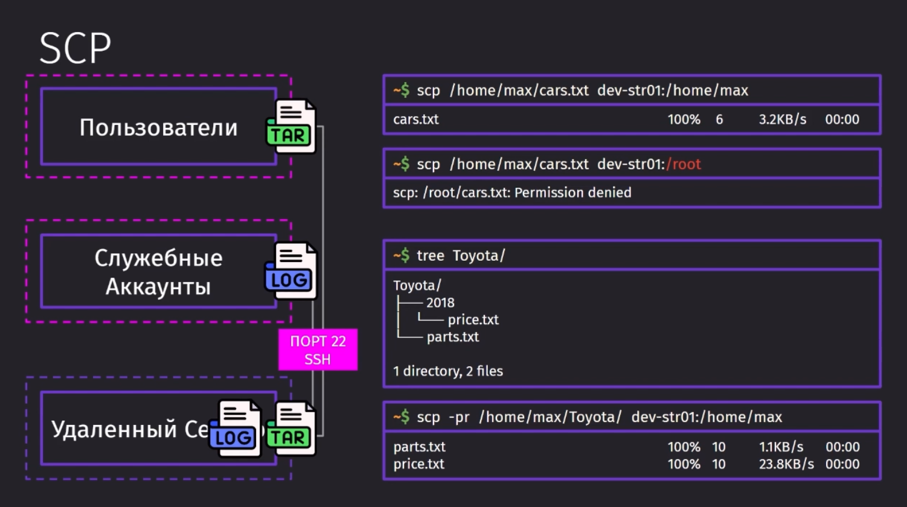

## Про IPTables

Для обеспечения безопасности в огромной сети предприятия используются различного рода фаерволы, которые ограничивают к себе несанкицонированный доступ и не дают сломать критические порты.

Сами по себе фаерволы могут быть как аппаратными, так и программными. Самый частый вариант - программный фаервол, но без аппаратного может появиться уязвимость в системе.

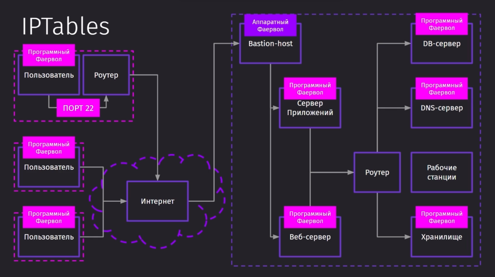

Самым популярным сетевым оборудованием в качестве фаервола может служить CISCO. В качестве программных фаерволов будет достаточно встроенных в линукс `iptables` и `firewalld`.

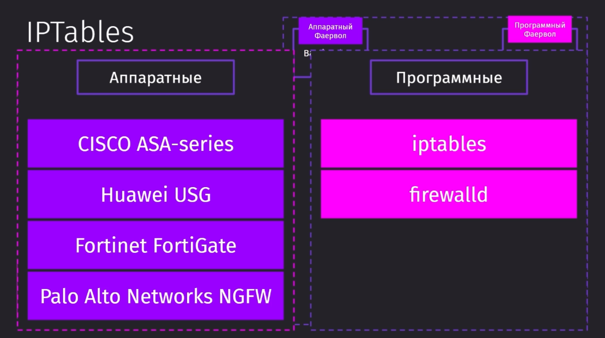

Задача: У нас есть ПК разработчика, сервер базы данных, сервер приложений и сервер репозитория. Разработчик должен иметь возможность подключаться по ssh к серверу приложений, а сервер приложений, в свою очередь, должен иметь возможность иметь доступ к серверу БД и репозитория. Так же сервер приложений, во избежание утечек, не должен иметь доступ в сеть.

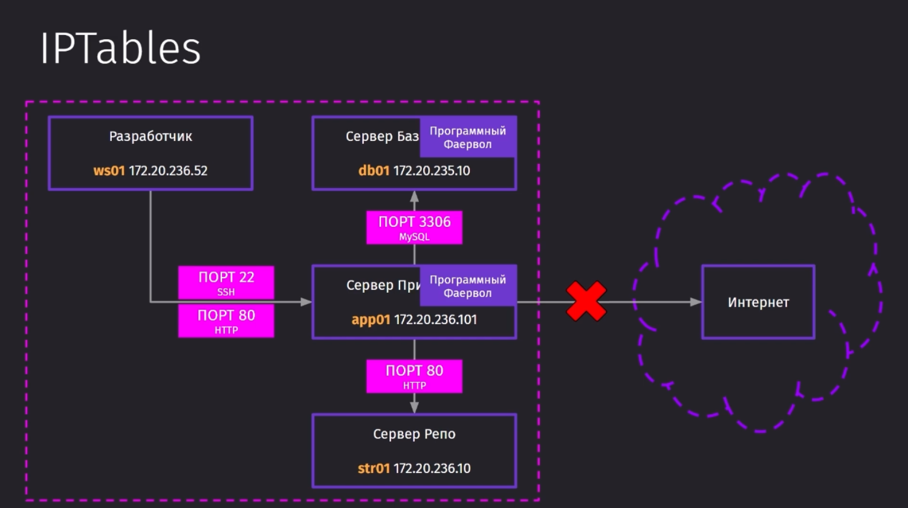

Сами доступы в `iptables` распределяются по цепочкам:

- `input` (входящие). Входящие потоки отвечают за возможность какого-то компьютера подключиться к этому ПК.
- `output` (исходящие). Исходящие отвечают за возможность отправить данные на другой ПК.
- `forward`. Позволяет слушать один порт, но выходить в другой

Если проверить доступы на свежем ПК, то `sudo iptables -L` отобразит `accept` на всех путях портов.

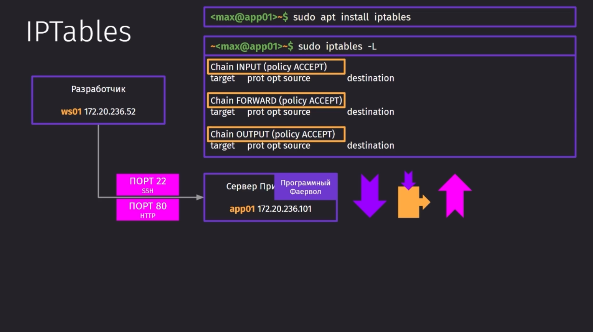

Грубо говоря, пакет работает по цепочке из правил и либо принимает пакет, либо дропает его. Если выполнение не совпало, то выполнение передаётся следующему в цепочке правилу.

В данном примере, если source будет равен `ws01` / `ws02` / `db01`, то пакет примется и попадёт внутрь машины. Если пакет соответствует `ws03` или `any` (любому другому пакету), то мы его должны будем откинуть.

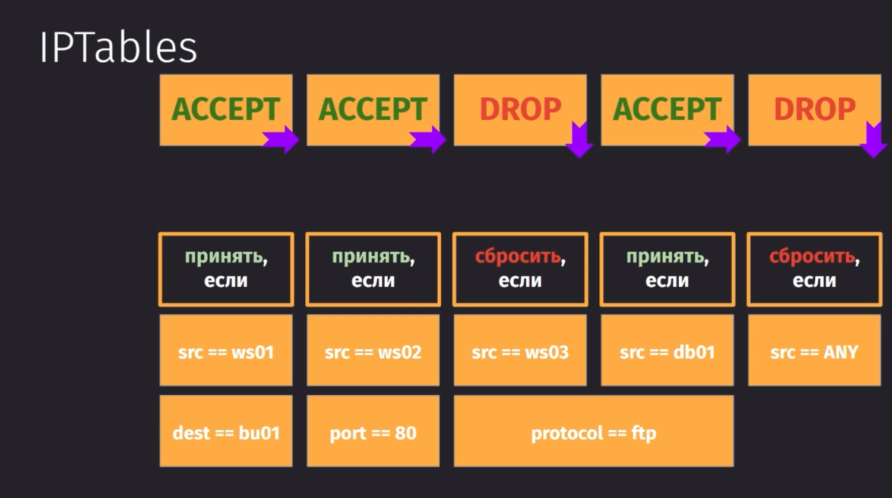

## Настройка IPTables

Открываем доступ серверу для принятия подключения по SSH от компьютера разработчика.

С помощью `iptables` мы добавляем правило (`-A` aka `add`) на принятие (`INPUT`) добавляя протокол (`-p` aka `port`), по которому будет осуществлено подключение (`tcp`) и указываем источник (`-s` aka `source`) в виде порта компьютера разработчика (`<подключаемый_порт>`) в порт на нашем сервере (`--dport` aka `destination port`) с ssh (`22`) и говорим это действие (`-j`) принимать (`ACCEPT`).

Всю эту операцию нужно выполнить на сервере.

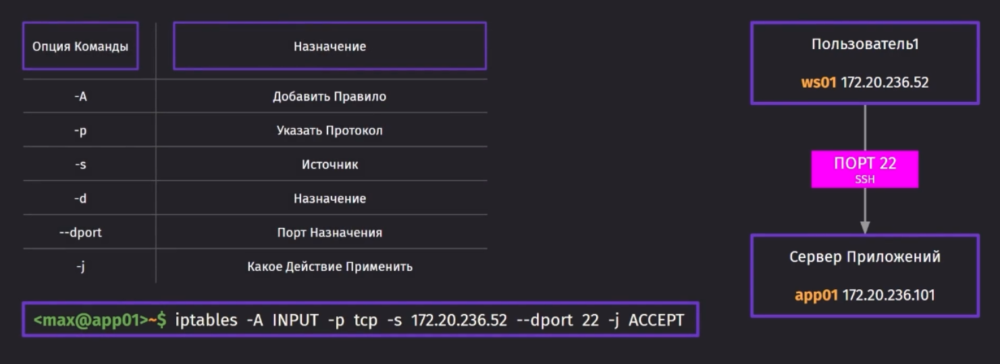

И теперь у нас доступны входящие запросы на подключение по SSH к серверу с рабочего компьютера

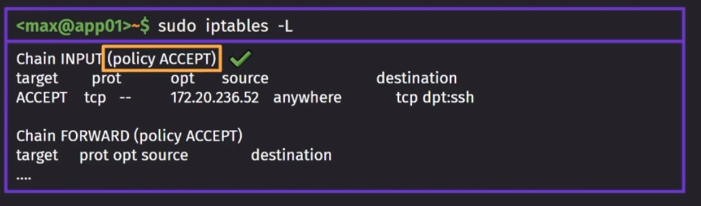

Но сейчас мы только разрешили одному ПК подключаться к серверу через SSH, но оставили доступ другим компьютерам.

Нам нужно добавить в цепочку правило, которое будет запрещать доступ по SSH всем остальным.

Тут операция не будет сложно отличаться. Нам нужно просто будет убрать `-s` и не указывать, откуда должен поступить запрос.

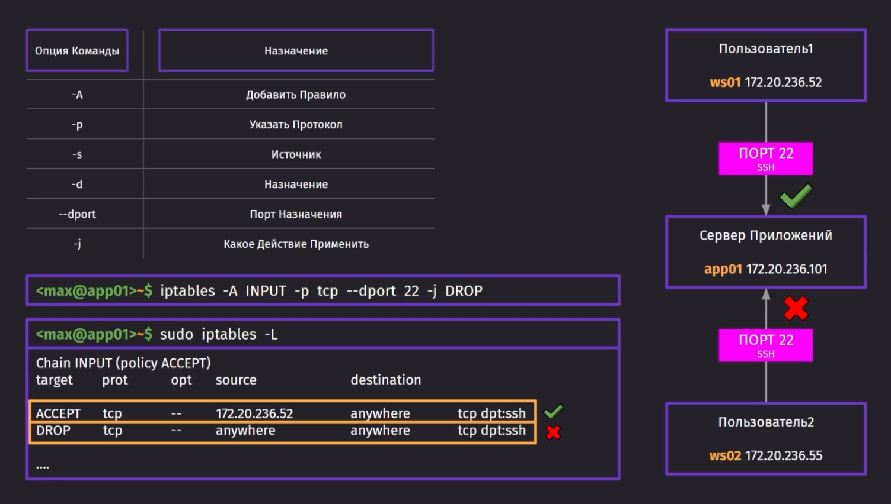

Тут сразу нужно сказать, что порядок расположения правил очень важен, потому что все они применяются сверху вниз. Если мы записали бы правило по блокировке всех источников первым, то проверка на ip компьютера разработчика бы не произошла.

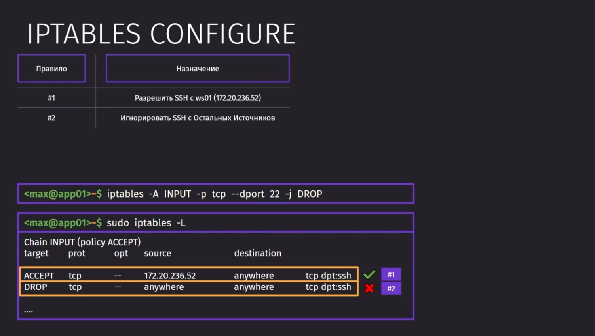

Далее реализуем диаграмму из прошлого урока и задаим правила на выходы и выходы

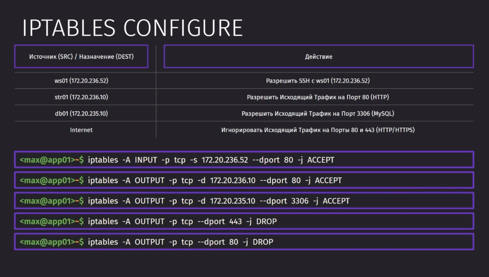

Вписали все правила и теперь в самом низу находятся блокировки http и https. Но тут у нас появилась потребность добавить доступ по https к другому серверу от нашего.

Чтобы добавить правило вверх списка, нужно вписать его не с `-A`, а с `-I`

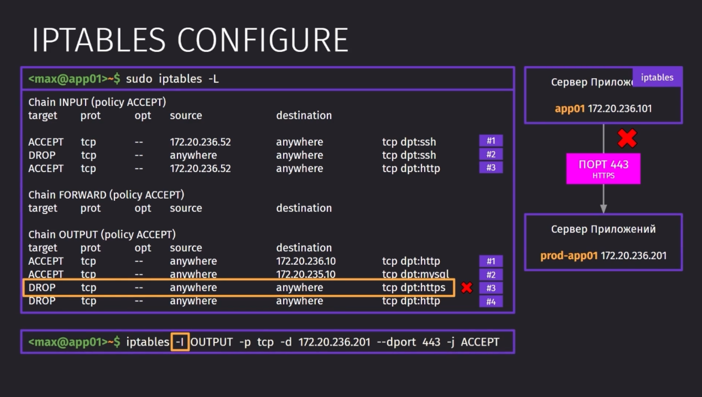

И далее нам нужно разрешить запросы по https, потому что иначе они будут отбрасываться все. Для этого нужно будет удалить пятое правило выхода в таблицах ip нашего сервера.

Для этого мы можем воспользоваться `iptables -D OUTPUT 5`, где

- `-D` удаление
- `OUTPUT` - группа операций
- `5` - порядковый номер правила

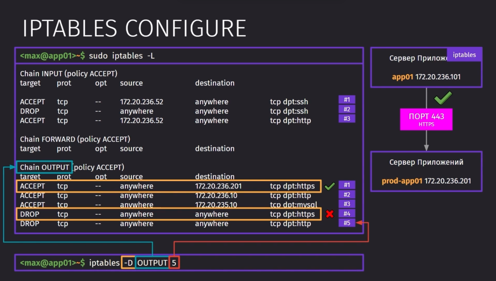

И теперь нам только осталось добавить возможность принимать базой данных запросы от одного сервера - сервера приложения

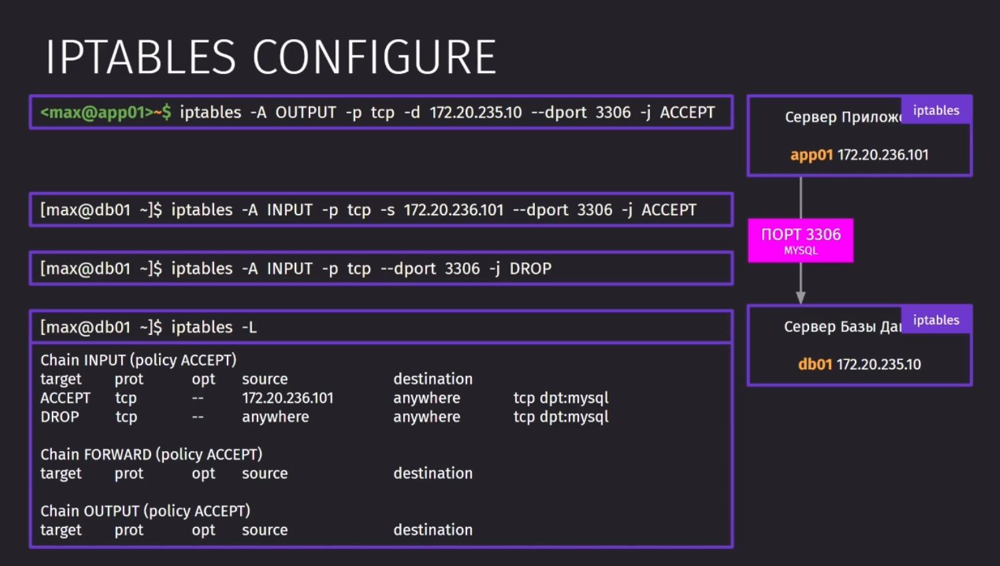

И тут у нас может встать вопрос - нужно ли прописать на сервере приложений правло ввода ответа от базы данных.

Это не потребуется, так как ответ от БД идёт на случайный tcp порт сервера приложений, который попадает в диапазон эфемерных динамических портов.

Исходящий порт для ответов из БД 52000. На сервере приложений мы ограничили только подключение по ssh. Поэтому правила не отобъют ответ от БД.

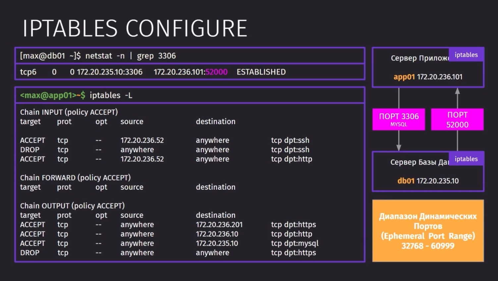
