## Про процессы

Процесс - это программа, которая выполняется в ОС, взаимодействует с другими программами, делится на другие программы, взаимодействует с ОС, запрашивает у неё ресурсы - все эти явления являются процессом

Создаются во всех ОС процессы по-разному. Создание процесса в линуксе выполняется через полное его клонирование. Вызывается клонирование функцией `fork()`, которая передаётся в пространство ядра.

То есть, когда мы запускаем `uptime`, `fork` отправляет запрос в ядро, где клонируется `bash` (создаётся процесс-потом от `bash`) и в этом клоне запускается функция `exec()`, которая меняет код программы оболочки на код программы `uptime` (`bash` поменялся на `uptime`). Путь: `bash` -> `bash` + `bash` -> `bash` + `uptime`.
Далее `uptime` получает данные, выполняется и записывает результат на свой вывод. После этого он запускает системный вызов `exit()`, который уведомляет систему о том, что операция выполнена и процесс можно закрывать. Сам вызов передаёт идентификатор потомка и код возврата родителю этого дочернего процесса (0/1/и тд). Система закроет процесс, вернёт выделенную память, сотрёт процесс из таблицы процессов и пометит процесс завершённым. Если родитель проигнорировал возврат, то процесс останется в таблице процессов со статусом завершённого - такой процесс называется ==процессом зомби==.
Этот код взврата ждёт родитель процесса и специально для этого в начале дочернего процесса запускает системный вызов `wait()`, чтобы синхронизировать выполнение с момента завершения потомка (получает код возврата от дочернего процесса). После получения из системы код возврата родителем, родитель полностью удаляется из системы.

Все процессы находятся в папке `/proc/`. Чтобы посчитать количество процессов, можно посчитать количество записей в папке через `wc -l`

Так же мы можем вывести процессы, которые принадлежат опрдеелённому пользователю через `ls -ld`. Поменять владельца процесса - нельзя.

Есть более удобный вариант вывода процессов - `ps`.

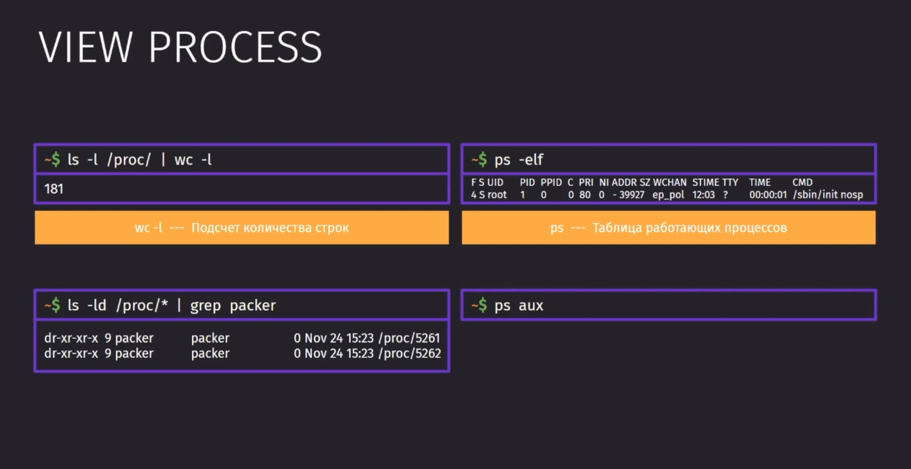

Вывести подробную информацию по процессам можно с помощью `ps -elf`

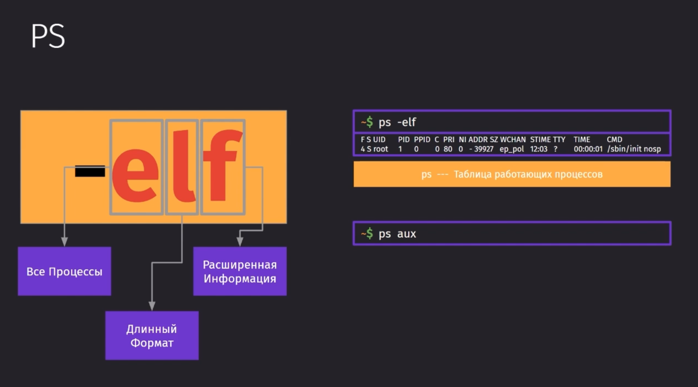

Так же `pstree` выведет дерево процессов

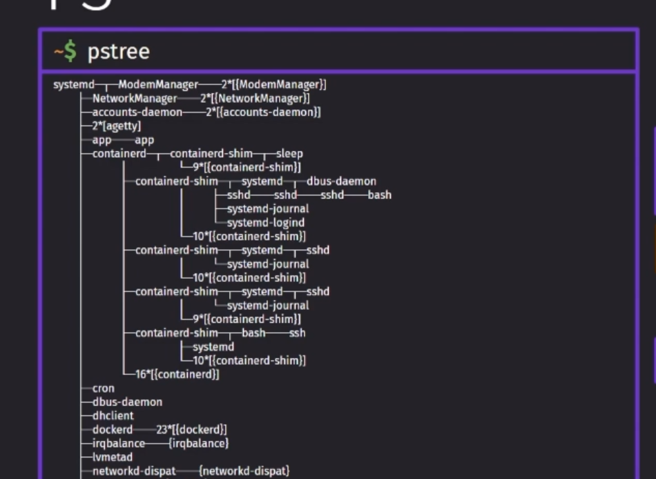

Чтобы найти определённый процесс, можно грепнуть вывод `ps` и увидеть, например, демон-процессы

Процессы-демоны - это процессы, которые срабатывают при триггере какого-либо события. Обычно их используют для более быстрой отработки операции. Тот же eslint_daemon работает постоянно, что позволяет быстрее форматировать код.

Сами демоны срабатывают на какие-либо системные сигналы, например, подключение по определённому порту, чтобы сигнал шёл через ssh.

Всего различных сигналов 28.

Самые распространённые сигналы - это сигналы прерывания процесса.

- 9 - SIGKILL - принудительное завершение процесса со стороны ОС. Эта команда не всемогущая и может не завершить процесс, когда программа ожидает ввод/вывод или когда запущен процесс `init` (`pid=1`).
- 15 - SIGTERM - запуск процесса выхода из программы
- 2 - SIGINT - уведомление процесса о том, что пользователь хочет выйти из процесса (`Ctrl+C` в терминале)

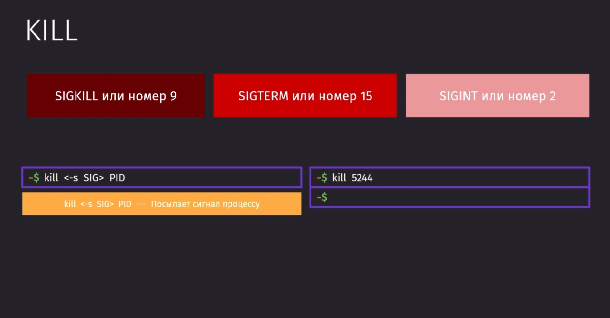

Нужно сразу сказать, что бывает достаточно часто такое, что у дочерных процессов завершают родительский процесс. В таком случае дочерные процессы будут либо закрываться, либо для них родительскими будут искаться более старшие процессы.

Во время запуска системы, запускается процесс `init` с `pid=1`, который остаётся в процессах до перезагрузки. Это корневой процесс, от которого запускаются все остальные процессы.

`p(process)id` - это идентификатор процесса, `p(parent)pid` - идентификатор родителя процесса. `pid=1` имеет процесс `systemd`, который обычно находится в `/sbin/init`. Родителем его процесса является процесс с идентификатором `0`, которого не существует.

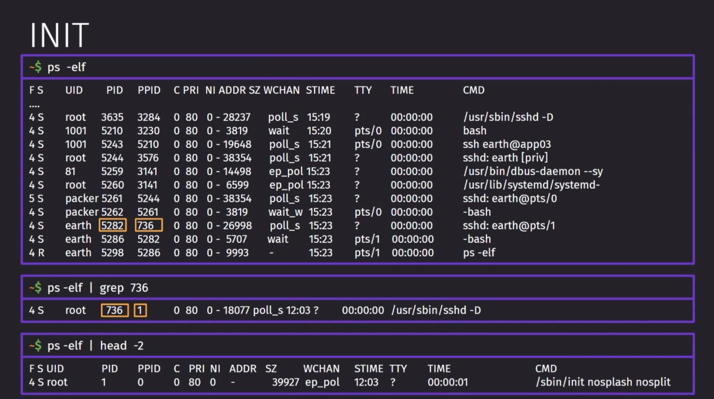

Сам `systemd` - это современный способ запуска системы. Он позволяет достаточно быстро запустить систему за счёт сильного распараллеливания выполняемых операций.

## Создание службы 

`Unit` - это отдельновзятый модуль, который отвечает за точку монтирования файловой системы, работы абстрактных служб, сетевых ресурсов, устройств, изоляции ресурсов и так далее (зачастую, их относят к `systemd` юнитам).
`Traget` - это уровень выполнения, состоящий из нескольких `Units`.

Задача: нам нужно запустить службу на сервере из нашей программы. Сама служба представляет из себя обычную программу, которую мы можем запустить, но служба запускается автоматически и её конфиг мы можем прописать в инит-файле этой службы `/etc/systemd/system/<имя_службы>.service` 

1. Нам нужно проинициализировать службу и дать ей возможность запускаться

В начале нужно задать поле `[Service]`, в котором мы укажем `ExecStart` (запустить процесс) по определённому пути и открыть его на определённом порту.

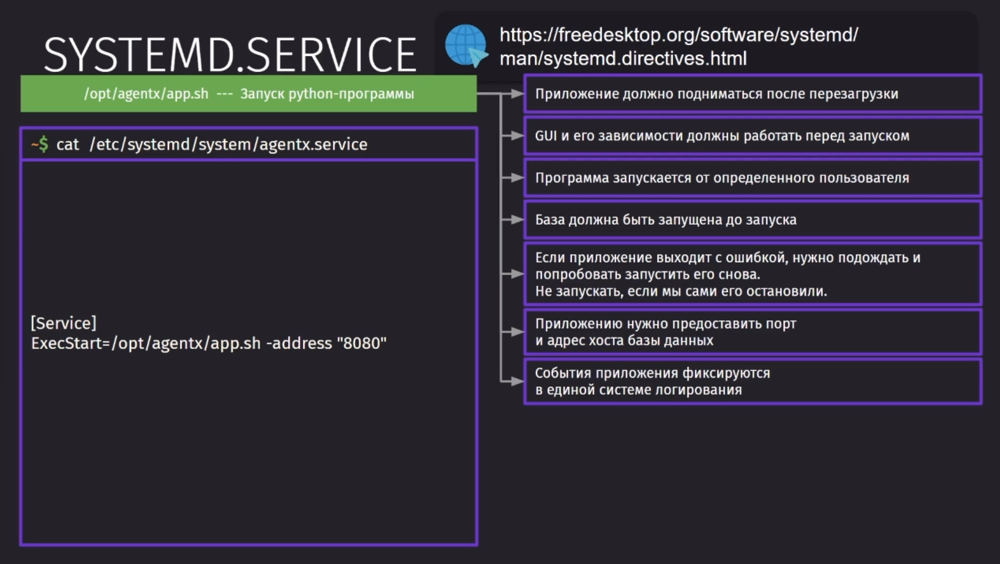

Далее мы можем запустить нашу службу через `systemctl start` и проверить её статус работы через `status`.

Чтобы остановить службу и изменить её параметры в файле, нужно прежде остановить выполнение службы через `stop`. 

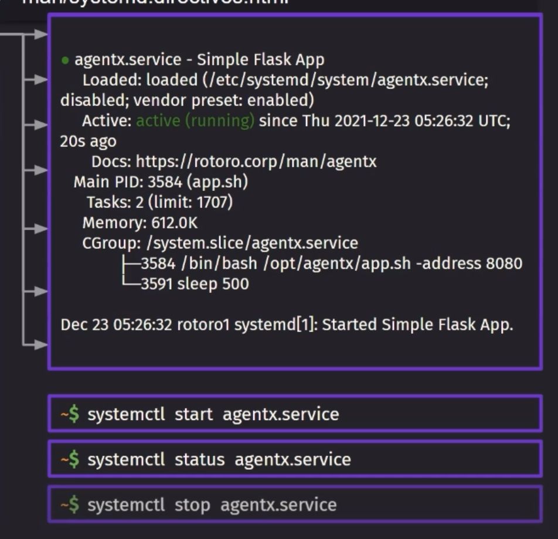

2. Далее мы реализуем старт службы при запуске системы.

Тут мы триггерим событие `[Install]` нашей службы и задаём этому запуску зависимость, что она требует `WantedBy` предварительно запущенную графическую систему `graphical.target`. 

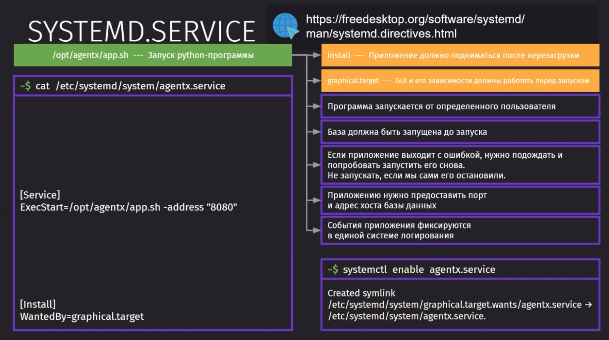

3. Далее нужно указать, от какого пользователя должен запускаться сервис

Эту настройку нужно задавать в поле самого сервиса `[Service]` в поле `User`

4. Сейчас мы укажем в качестве зависимостей для запуска - базу данных

В качестве зависимостей нужно указать юнит базы данных, который запускает `systemd`. То есть в группе `[Unit]` в поле `After` мы должны указать, после чего должен запуститься сервис

5. Далее указываем перезапуск службы при ошибке

Чтобы настроить перезапуск службы, в группе сервиса нужно указать поля `Restart`, в котором оуказать при каком событии должна произойти перезагрузка `on-failure` и указать `RestartSec`, чтобы указать время перезапуска

6. Сейчас нужно предоставить порт адреса БД, чтобы служба о ней знала

Порт адреса так же указывается в группе службы в поле `Environment`, отдкуда служба и будет брать свои переменные окружения

7. Указываем систему логирования для службы

`systemd` автоматически регистрирует все события в службах и собирает с них логи

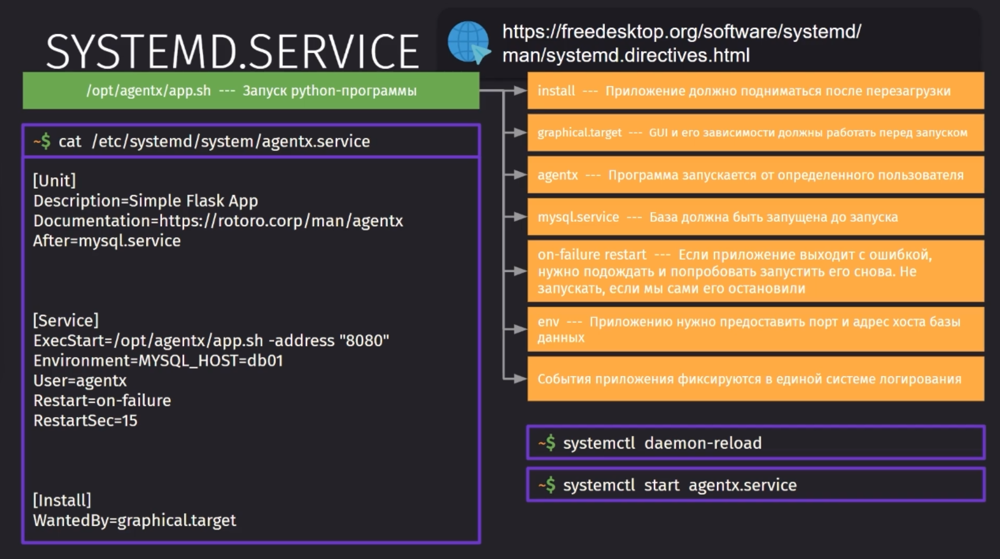

Отдельно хочется упомянуть про поля в группе `[Unit]`, а именно `Description` и `Documentation`. Является хорошим тоном оставлять эти поля в описании сервиса, чтобы понимать, что это за сервис и как им пользоваться.

## Инструменты systemd 

Существует достаточно большое количество инструментов для запуска системы на базе Linux. Сейчас стандартом является SystemD, который имеет:

- Достаточно простой и незапутанный процесс загрузки
- Параллельный запуск задач во время старта системы
- Несложный синтаксис unit-файлов
- Низкий уровень потребления ресурсов
- Отслеживание исполняемого процесса через CGroups
- Понятный механизм зависимостей и служб

Но из минусов у него выделяют то, что 
- Он пытается выполнить большое количество задач в себе, а не делать одну операцию, но хорошо
- Не работает кроссплатформенно
- Не соответствует стандартам POSIX

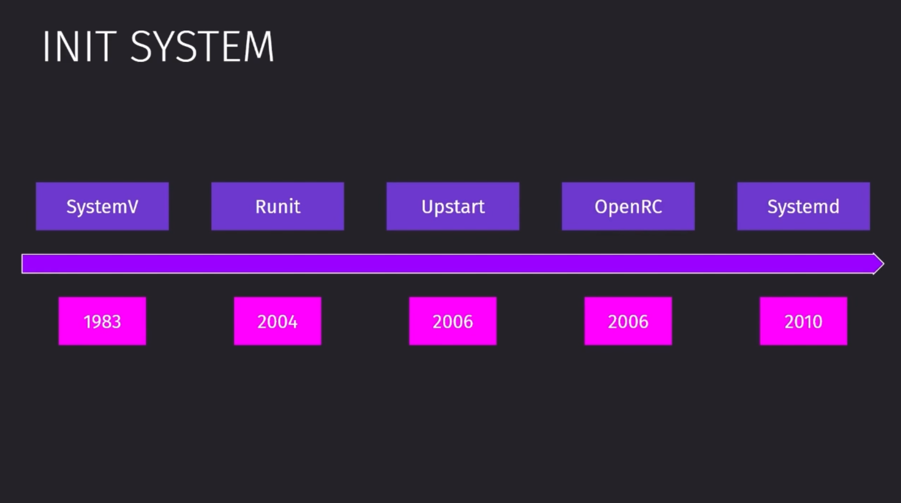

Задачи SystemD:

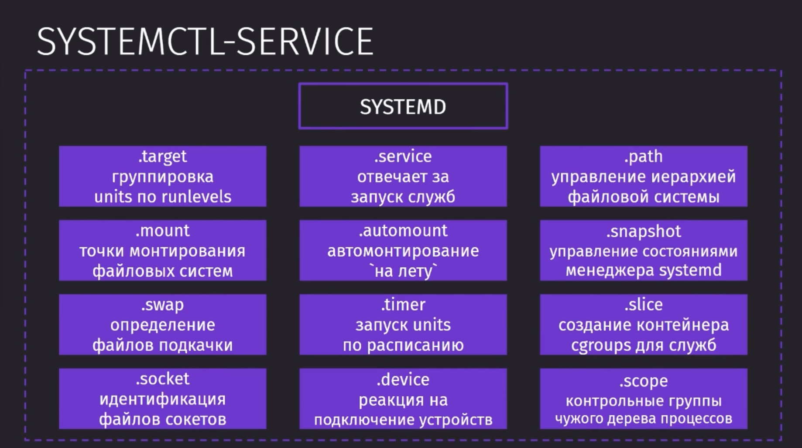

Команда `systemctl` является единой входной точкой для использования возможностей SystemD

Этой командой можно гибко управлять `targets` и `service` сущностями системы. Часть операций над сервисами можно выполнять через команду `service`, но она даёт куда меньше возможностей, чем `systemctl`.

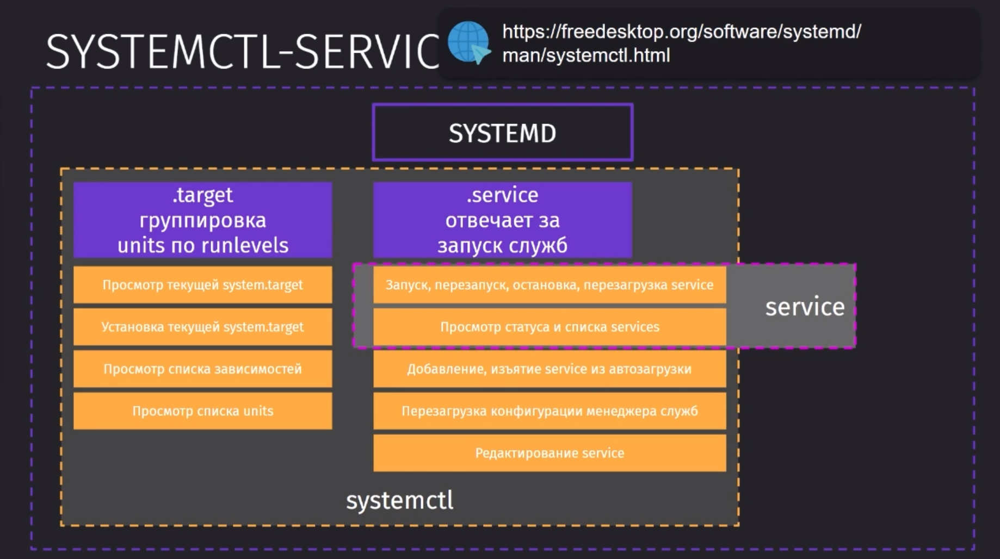

Основной разницей между этими двумя командами является то, что `service` - это просто shell-script, который не зависит от системы инициализации, которая используется в системе.

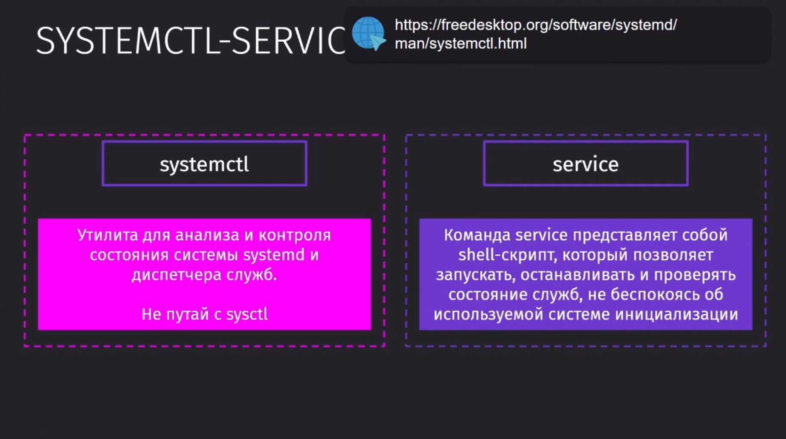

Операции, которые даёт выполнить `systemctl` над службой:
- `start` - запуск службы
- `stop` - остановка службы
- `restart` - перзапуск службы (прошлые две команды)
- `reload` - перезагрузка в целях подтягивания нового конфига
- `enable` - включение службы в автозапуск
- `disable` - отключение службы из автозапуска
- `status` - позволяет просмотреть статус службы. Сами состояния делятся на разные статусы и разные переходные состояния.
	- `active` может быть в трёх разных состояниях, когда служба активна, ожидает что-то и выключается 
	- `failed` говорит об ошибке во время выполнения службы

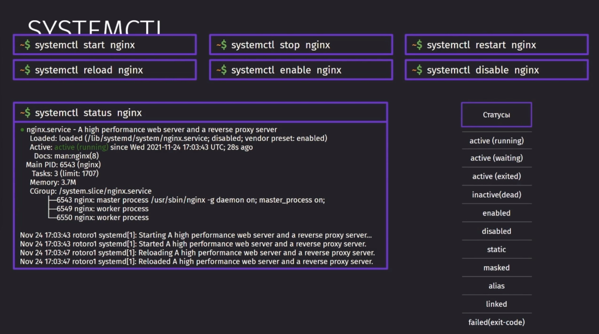

- `daemon-reload` - позволяет внести изменения в исполняемую службу, перезапускает менеджер и сообщает об изменениях в `systemd`. Если служба работала во время перезагрузки, то её стоит перезапустить.
- `edit <служба> --full` - позволяет внести изменения в файл службы через дефолтный текстовый редактор
-  `list-units --type-service` - позволит отобразить список юнитов SystemD по типу служб. Так же можно передать в `systemctl` просто данный флаг с `--type` и вывести список служб. Добавляя к вышесказанному, так же можно добавить флаг `--state`, чтобы взглянуть на операции в определённом состоянии. 

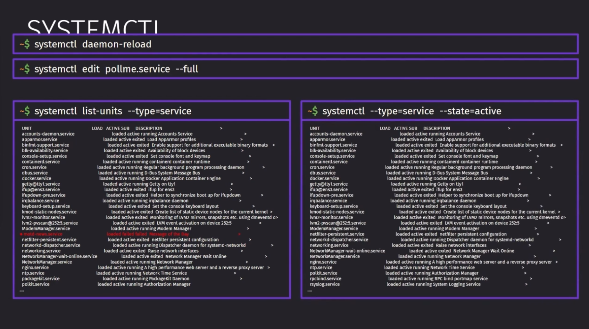

Так же мы можем просто вывести все таргеты через `--all`

Дефолтно у нас в качестве начальной цели, от которой мы смотрим на все службы является наш графический интерфейс `graphical.target`. Её мы можем получить через `get-default`. Установить новую цель мы можем через `set-default`.

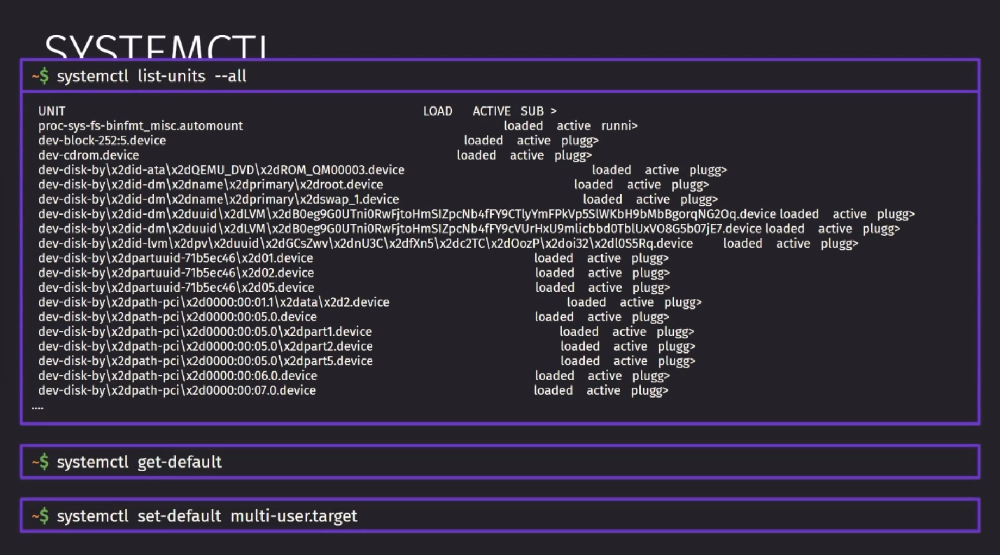

`journalctl` - это команда, которая позволяет нам просматривать логи системы логирования из `systemd`. Обычно её используют, чтобы узнать причины неполадок, которые связаны со сбоями служб.

Обычный вызов команды запросит все записи журнала. `-b` вызовет записи от момента текущей загрузки. `-u` позволит указать юнит, от которого нужно будет взять логи. `-p <значение_начала>..<значение_конца>` позволит вывести логи только по определённой степени важности.

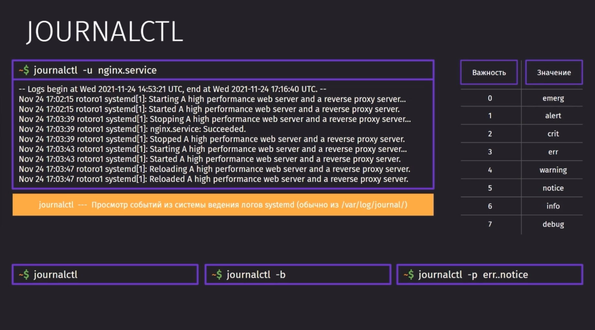
