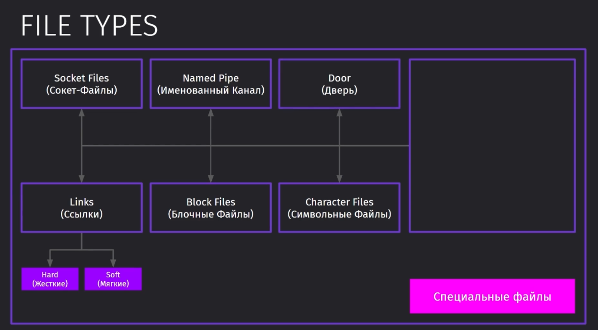

## Ядро Linux 

Ядро - это посредник между железом и выполняемыми процессами в ОС

Изначальные системы шли без ядра и напрямую работали с системными ресурсами. Такой подход был очень неудобен, так как ресурсы могли отбираться другими процессами. ОС с Ядром предоставляли возможность писать приложения не под конкретную ОС, а под определённое ядро, которым пользовалось сразу несколько ОС, что упрощало миграцию приложений.

Во-многом разработка приложений сильно упростилась после перехода операционных систем на использование конкретного ядра, которое могло быть совместимо между системами.

Самый простой и понятный пример использования ядра - это компания, в которой ядром является транспортная компания. Она скрывает под капотом все бизнес-процессы, которые нужны для выполнения операций и не заставляет клиентов обращаться напрямую к различным магазинам и отделам компании по вопросам того, как получить определённый нужный им товар.

Ядро само определяет приоритетные ресурсы, выделяет нужное количество места на диске и само контролирует выделение определённого количества ресурсов для процесса.

Есть несколько типов ядер. Чем ближе драйвер к аппаратному устройству, тем быстрее будут выполняться операции, но тем ниже будет отказоустойчивость.

Так же ядра делятся на несколько типов, которые имеют свои преимущества.

Ядро же самого Linux является монолитным. Оно выполяет все основные операции от управления памятью и процессами до контроля безопасности.

У всех компонентов ядра одно адресное пространство, что привдёт к сбою всей системы, если поломается хотя бы одна часть. 

Но само ядро является модульным, что позволяет расширять функционал системы

Мы можем использовать команду `uname` для определения версии и типа ядра. 

Каждый дистрибутив использует свою версию ядра и все версии находятся на `kernel.org` 

В целом существует множество дистрибутивов, которые предоставляюит разное оригинальное ПО для своих систем, но все построены на базе GNU Linux

Всего ядро делится на два пространства:
- User Space - это пространство, в котором выполняются операции пользователя ОС
- Kernel Space - это пространство, которое занимается менеджментом, выполнением системных операций и общением с железом 

Для выполнения операции по открытию файла, мы должны дёрнуть одну из операций системного вызова linux, которая предоставит нам возможность выполнить определённые действия внутри нашего ПК на железе

Всего linux хранит около 380 различных операций

## POSIX

POSIX - это набор стандартов интерфейсов, которые описывают взаимодействия между ОС и приложением.

Данный интерфейс позволяет нам переносить исходный код между дистрибутивами Linux и компилировать программу под нужный нам дистрибутив, так как он общается по интерфейсу POSIX с ядром.

Нужно сказать, что POSIX - это всего лишь набор правил, по которым должно работать приложение в пространстве пользователя. Сам же стандарт не относится никак к ядру. 

## Работа с железом

Если представит работу с внешним диском в лиуксе, то его можно представить так:
- мы подключаем USB в компьютер
- ядро создаёт ивент
- пространство пользователя его слушает

`dmesk` отображает сообщения из области ядра

Первая команда выведет девайсы устройства, которые видит ядро. Последним параметром было передано имя устройства.

Вторая команда выводит сведения о событиях ядра

`lspci` - выводит список всех PCI устройств

`lsblk` - выводит список физических дисков системы. Так же тут можно увидеть мажорные и минорные номера. Мажорные определяют тип диска, а минорные являются просто идентификаторами мажорных устройств

Вывод данных о процессоре

Вывод памяти

`free` - выведет количество свободной и использованной ОЗУ

`lshw` - команда для вывода информации целиком об оборудовании 

## Порядок Загрузки в Linux 

1. Самотестирование BIOS перед включением
2. Запуск загрузочного кода из Master Boot Record
3. Далее идёт GRUB2, который позволит определить параметры загрузки для последующего шага
4. Инициализация ядра
5. Процесс инициализации. Подготавливает пользовательское пространство и запускает начальные процессы. Зачастую этим занимается даемон systemd, который отвечает за монтирование хоста

Чтобы узнать, какой загрущик использует система, можно воспользоваться командой `ls -l /sbin/init`

## Runlevels 

Runlevels - это метод запуска ОС. Есть несколько режимов запуска системы, но из основных - это N5 (GUI) и N3 (консоль).

Так как линукс зачастую используется на серверах, то и запускать мы можем только командную строку. 

Таким образом можно поменять способ загрузки системы

## Типы Файлов 

Всё в Linux является файлом

Существует глобально три типа файлов:
- Обычные
- Директории
- Специальные файлы

Далее идут специальные файлы:
1. Символьные файлы - хранятся в dev / позволяют обмениваться данными с устройствами ввода / вывода
2. Блочные файлы - так же хранится в dev / считываются блоками используя буфер (ОЗУ/ПЗУ)
3. Ссылки
4. Сокет - обеспечивает связь между двумя процесами
5. Именованый канал - определяет один процесс в качестве входа к другому
6. Дверь - передаёт код из клиентского процесса в серверный

Просмотреть тип файла можно командой `file`

А так же его можно вывести через `ls -ld`

## Ссылки 

Файлы-ссылки в Linux, как упоминалось ранее, делятся на жёсткие и мягкие. Вся информация о положении файла привязана к дескриптору (iNode), к которому привязаны сведения о файле.

Hard link - это имя файла в системе линукс. Используется он как указатель на дескриптор файла.

Таких ссылок может быть несколько на один файл в системе. Несколько их делается для большего удобства в использовании.

Soft link - это ссылка на жёсткую ссылку. Она выступает в роли ярлыка в рабочей системе. 

Создавать жёсткие ссылки можно с использованием `ln`, а мягкие с `ln -s`. Жёсткие не меняют дескриптор памяти и всегда ссылаются только на него. Каждая жёсткая ссылка хранит количество таких же жёстких ссылок. 

Мягкие ссылки создают отдельный дескриптор файла и только отображают, на какую жёсткую ссылку ссылаются.

