## Установка ПО

Есть несколько основных вариантов установки пакетов в линуксе:
1. Установка из исходников. Самостоятельная сборка и установка пакета в линукс без надобности в рутправах.
2. Установка из пакетов. Устанавливаются заранее собранные пакеты (deb, rpm) пакетным менеджером для определённой системы. Все пакеты привязаны к определённому дистрибутиву
3. Установка из репозитория. Тут мы запрашиваем сам пакетный менеджер установить пакет в систему тз открытого репозитория. ПМ сам устанавливает остальные зависимости, которые требуются для пакета. К этому способу относятся подобные команды: `sudo dnf install git neovim nodejs npm`.

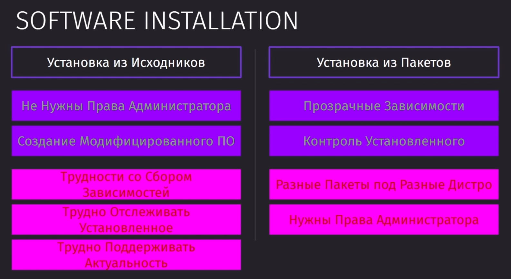

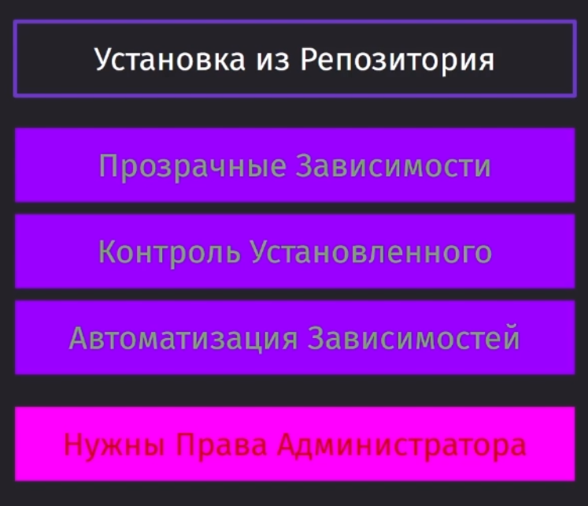

## Пакеты в Linux

На рынке преобладают два основных вида пакетов - `.deb` и `.rpm`

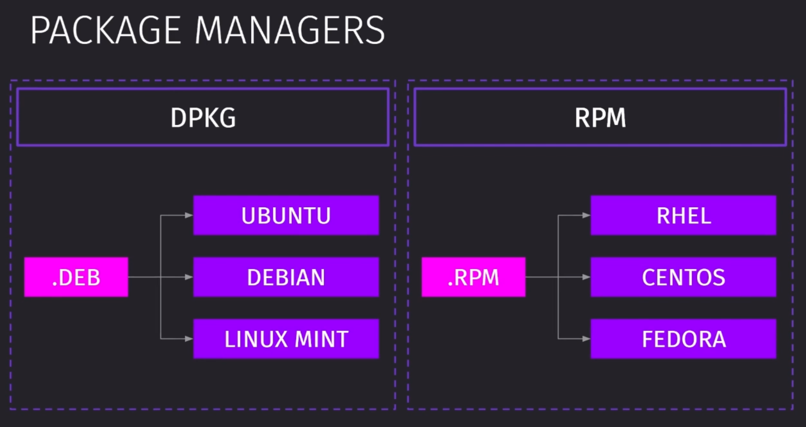

RHEL - корпортативное решение, а CentOS - решение для домашнего пользования на базе RHEL. Первый имеет стабильную работу и обновления для поддержки системы.

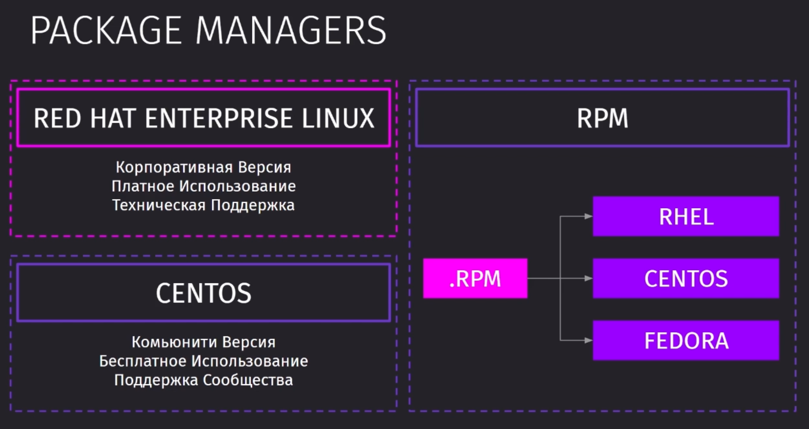

Пакет - это сжатый архив, который хранит все файлы, которые требуются для работы программы.

Сам пакет так же в себе хранит манифест со списком требуемых зависимостей.

Так как каждая оболочка линукса отличается друг от друга достаточно сильно (версия ядра, доступные пакеты и способы работы), то и пакеты зачастую между друг другом несовместимы

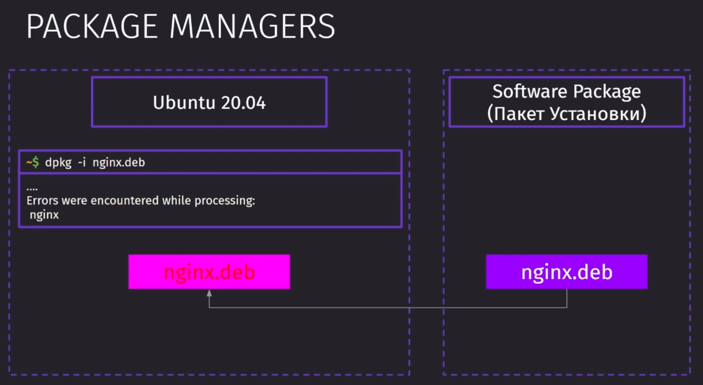

Основными задачами пакетного менеджера являются:
- установка пакета из проверенного источника
- проверка целостности пакетов
- избегания ==адской матрицы пакетов==

`DPKG` и `RPM` - типы менеджеров пакетов
`APT` и `DNF` - интерфейсы над этими типами менеджеров пакетов с расширенным функционалом и упрощённой работой

`dnf` является улучшением над `yum`

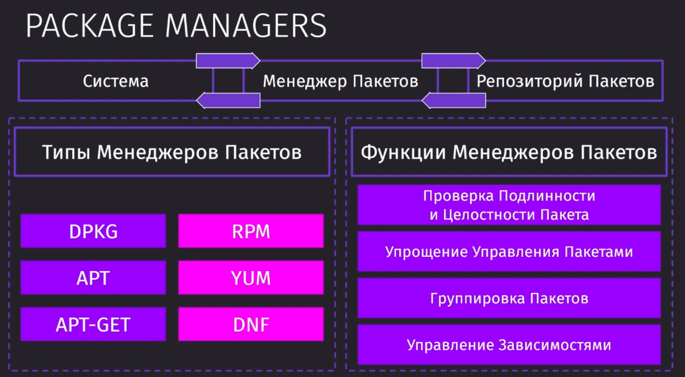

## RPM и YUM

`rpm` - Команда для работа с  `.rpm` пакетами

Первая команда позвоялет нам установить пакет. `-i` - установка пакета, `-v` - проверка пакета, `-h` - сверка хешей

`-e` - удаление пакета из системы
`-q` - позволяет получить информацию о пакете из базы данных rpm-пакетов. База данных хранится в каталоге `/var/lib/rpm`
`-V` - проверяет конечный пакет с информацией из исходного пакета

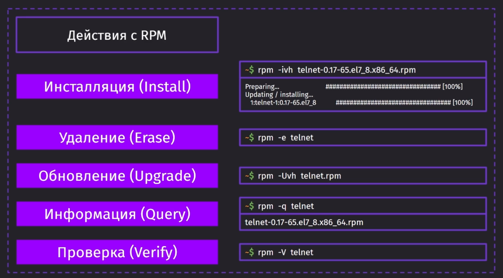

В противовес `rpm` не разрешает самостоятельно зависимости пакетов, поэтому и используют `yum`.

Все доступные репозитории юма сохраняются в `/etc/yum.repos.d`. Туда мы можем добавить любые свои другие списки репозиториев.

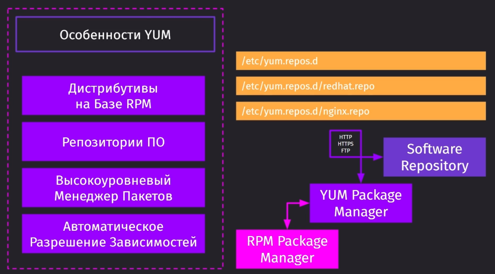

`yum` проверяет пакеты в системе, пытается их зарезолвить, если не нашёл пакет, то предложит его установить из своих репозиториев

> Если добавить флаг `-y`, то дополнительные пакеты установятся без дополнительного подтверждения с помощью `y`

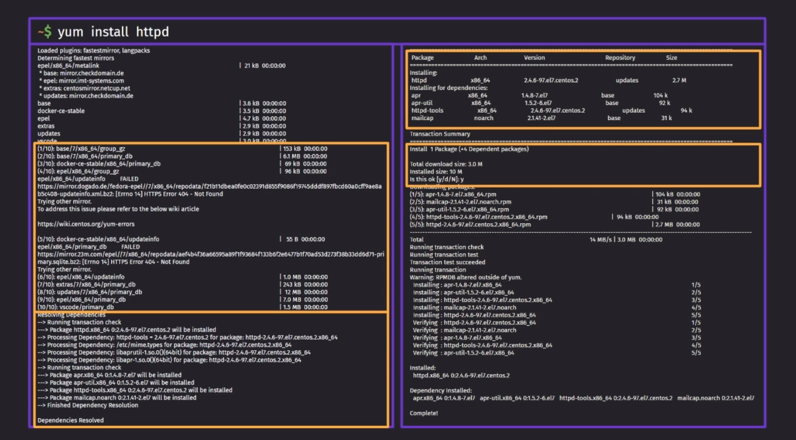

`yum repolist` предоставляет список доступных репозиториев
`yum provides scp` предоставит нам репозитории, которые распротраняют пакет `scp`

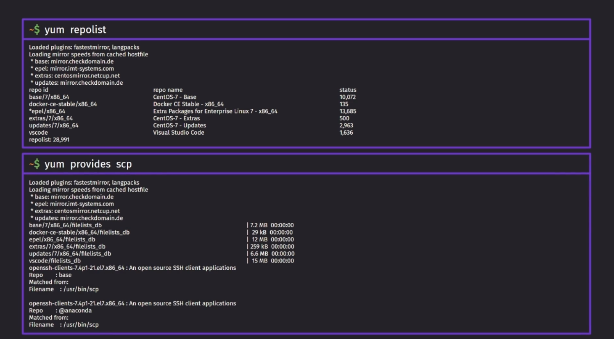

`yum remove httpd` - удалит пакет и его зависимости
`yum update telnet` - обновит пакет `telnet`

Если просто вызывать `yum update`, то мы обновим все пакеты в системе.

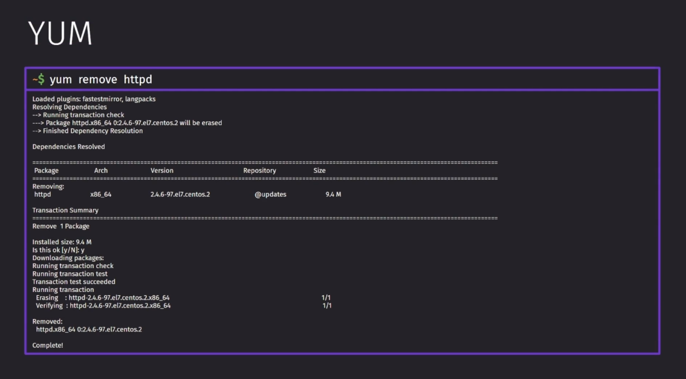

## DPKG и APT

`dpkg` - низкоуровневый пакет для работы с другими пакетами debian-дистрибутивов. Он так же как и `rpm` не умеет работать с требуемыми зависимостями для установки пакета.

`-i` - установка пакета
`-u` - обновление пакета
`-r` - удаление пакета
`-l` - список установленных пакетов
`-s` - отобразит статус пакета, если он установлен в систему
`-V` - проверка пакета

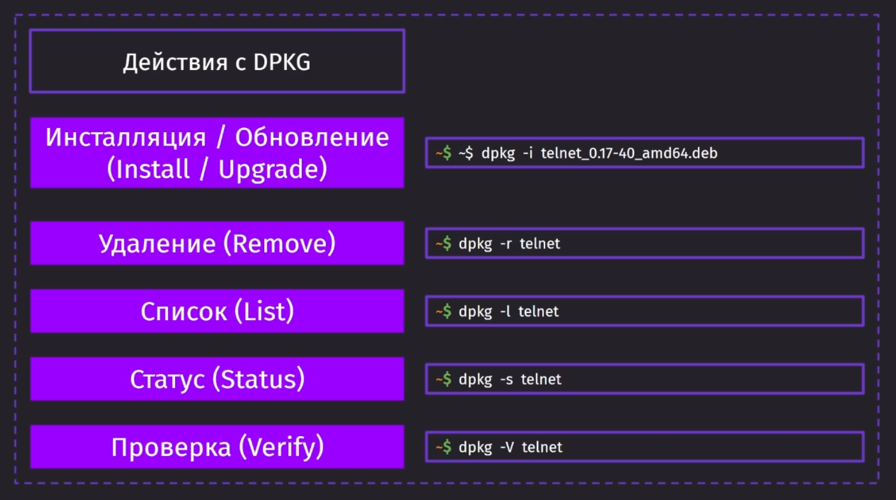

Пример ошибки из-за неразрешения зависимостей

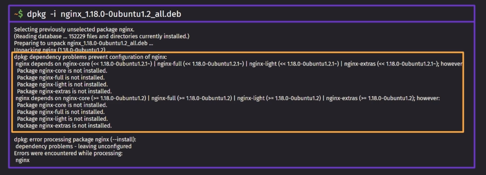

Поэтому для того, чтобы устанавливать пакеты, используются более высокоуровневые пакеты `apt` и `apt-get`, которые используют у себя внутри `dpkg`

У `apt`, так же как и у `yum` используется свой прописанный список репозиториев в `/etc/apt/sources.list`

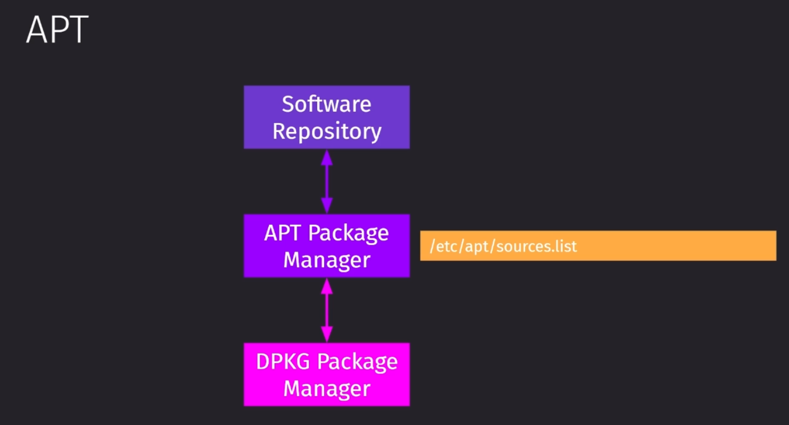

У `apt` достаточно широкий список команд.

Сразу после установки системы стоит обновить список пакетов через `update`, а затем и обновить сами пакеты `upgrade`. 

`edit-sources` позволит быстро перейти в файл репозиториев и отредактировать его

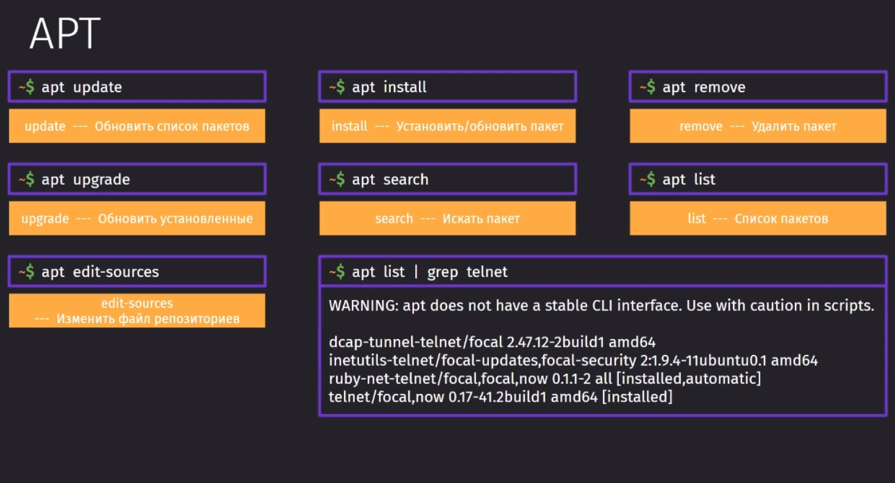

## APT и APT-GET

Изначально стоит сказать, что `apt` - это мощный инструмент, который хранит в себе множество различных операций над пакетами.

Первое, что бросается в глаза - это более приятный глазу вывод в консоль, который более человекочитаем.

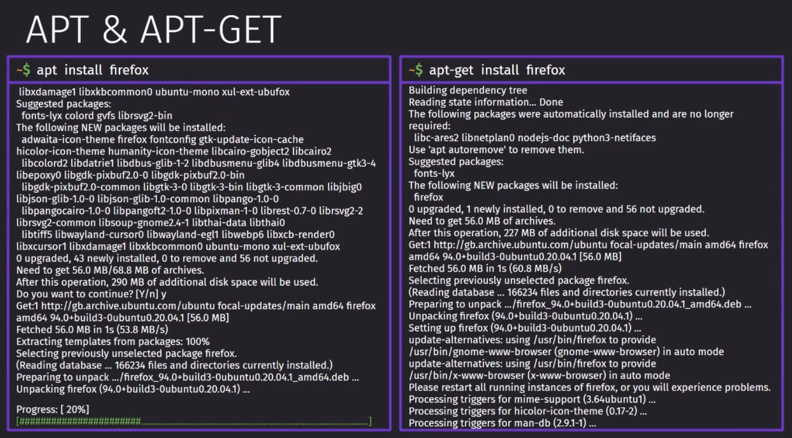

Так же `apt` умеет сам искать пакеты в репозиториях. Отдельно `apt-get` этого не умеет, поэтому вместо него нужно использовать `apt-cache`.

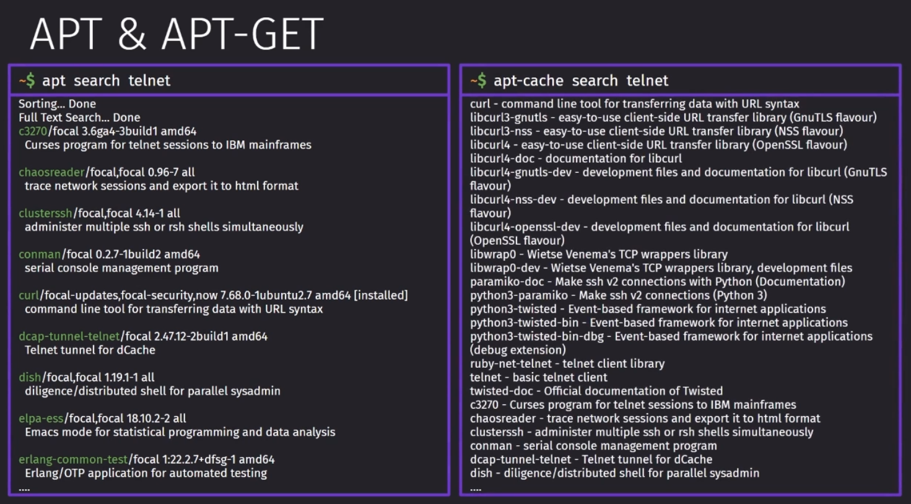
