## Разделы диска

Linux монтирует сразу все образы в свою систему и не делит хранилище на диски. Всё пространство монитруется в корневой директории `/`, из которой идут все остальные директории.

Такое устройство возможно благодаря блочному хранению данных на физическом накопителе.

Блочные файлы - это файлы, данные в которых записываются блоками/порциями.

Грубо говоря, в Linux существует концепиция файлов устройства, которые находятся, где удобно.

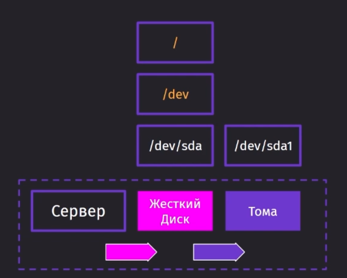

Посмотреть разметку дисков и разделов можно с помощью `lsblk`

Через `ls -l` можно вывести все файлы и информацию по расположению их в дисках и разделах (последняя колонка)

Записи `MAJ:MIN`, как упоминалось ранее в курсе, мажорное и минорное значение. Мажорное отвечает за тип диска (8 - новое и поменчается sd, 3 - старое и помечается hd). Минорная отвечает за идентификацию всех разделов и дисков. 

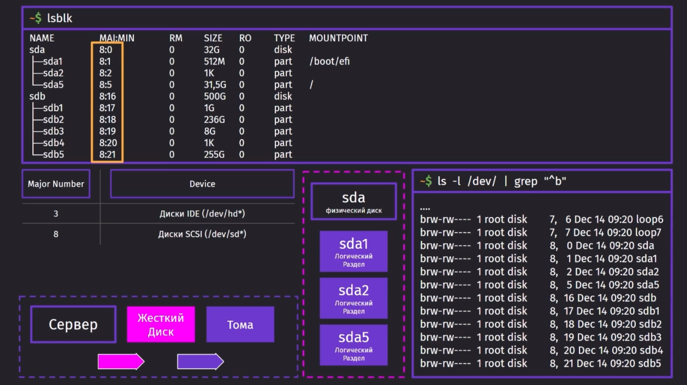

Для распределения всех данных по дискам используется VFS - виртуальная файловая система. Она обеспечивает реализацию интерфейса единой файловой системы в виде файлов устройств.

Для работы с физической файловой системой используются драйвера из Kernel mode.

Старший номер говорит VFS, что младший номер, с которым установлена связь - это диск и нужно отдать запрос определённому драйверу. Младший номер указывает драйверу как работать с этим разделом.

Собственно, само монтирование всех каталогов происходит благодаря данной операции. Во время неё VFS определяет корневую точку всех структур и каталогов, откуда все структуры будут доступны из примонтированного раздела.

`lsblk` так же предоставляет дополнительную информацию по тому, что монтируется в определённом разделе. 

Более подробно можно увидеть данные по таблице разделов с помощью `fdisk -l`.

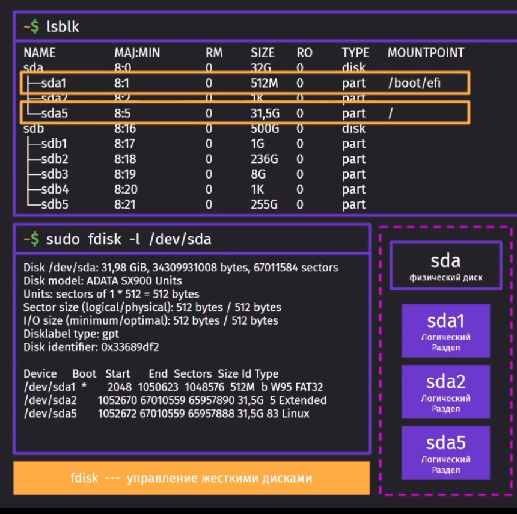

Сами по себе разделы могут быть как физическими, которых может быть до 4ёх штук (до недавнего времени) + расширенный раздел и многого количества виртуальных разделов (внутри самого расширенного раздела).

MBR - запись для загрузчика, как должны разбиваться разделы на диске. Это старая система разбивки дисков на разделы и они имеет достаточно много неудобств, таких как:

- 4 раздела - максимум
- максимальный размер диска - 2ТБ
- повреждение места хранения MBR - сломает систему

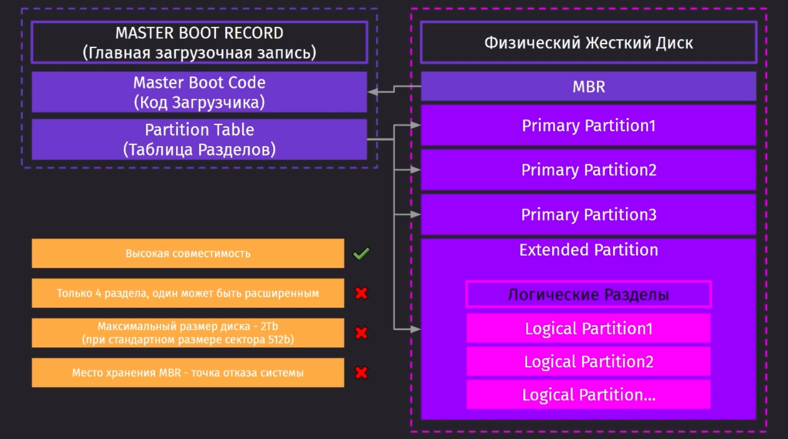

Далее идёт разделение дисков по схеме GPT. Она была разработана для устранения проблем MBR. Она поддерживает деление разделов на такое количество, которое поддерживает ОС и имеет меньшие ограничения, чем её предшественница MBR.

MBR так же присутствует в GPT для обратной совместимости, но оно не всегда работает.

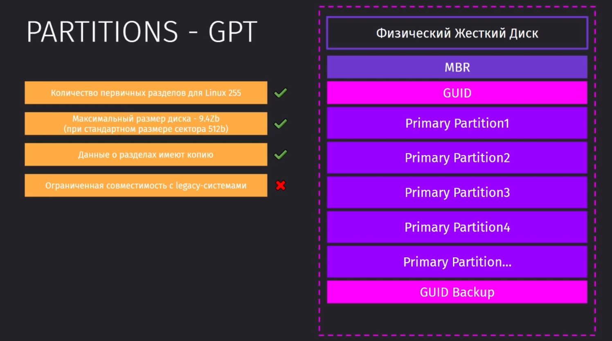

`gdisk` - это команда, которая позволяет работать с разделами на дисках. Это улучшенная версия `fdisk`, которая работает с GPT.

При запуске этой команды и указании директории, мы сразу попадём в операцию создания нового раздела, которую запускаем через `m` (жёлтым выделены команды деления диска на разделы)

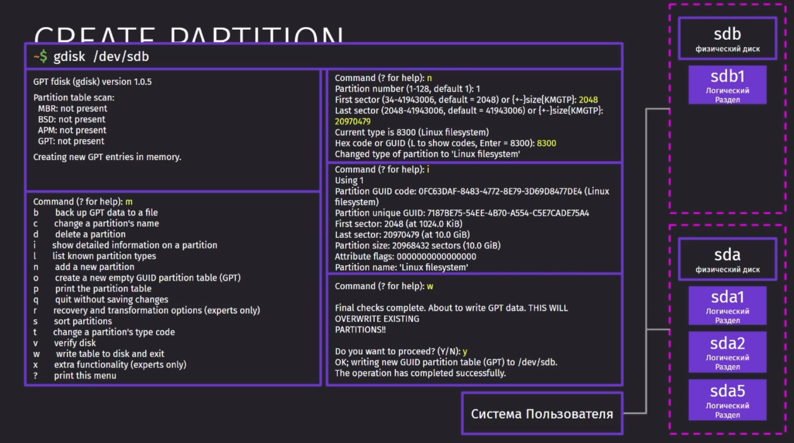

И далее можно через `fdisk` увидеть деление диска.

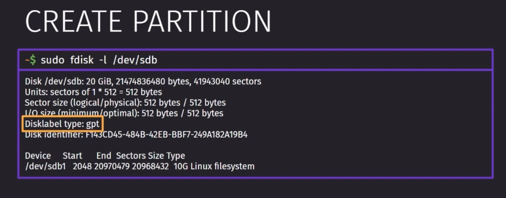

## Файловые системы

Диски и разделы рассматриваются ядром линукс как необработанный диск. Чтобы записать что-то на разделы, сначала нужно создать на них файловую систему. Далее нужно смонтировать диски и связать виртуальную файловую систему с реальной. И уже только потом можно читать или вписывать в ФС какие-либо данные.

Основной файловой системой в Linux явялется ext. Поддерживаются так же все остальные ФС по типу ntfs, xfs, fat и тд.

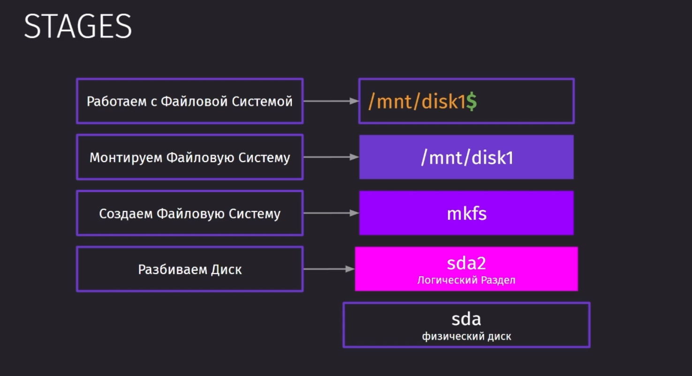

> extfs - extended file system

Большинство флешек монтируются в extfs2

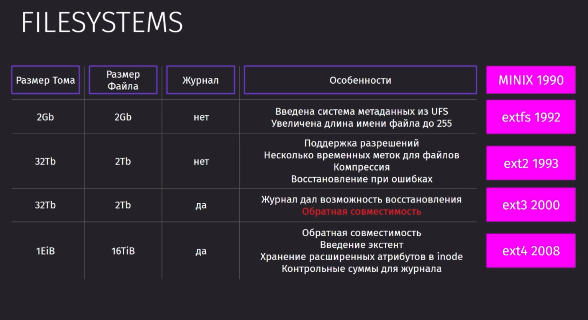

Файл - это место с дополнительной информацией (размеры, разрешение и другие атрибуты) на диске с данными.

Все файлы в ext4 делятся на блоки по 4 кб. Файл может занимать большое количество блоков. На все файлы даны iNode ссылки.

Сами по себе блоки хранят информацию о файле и его атрибутах, но они не хранят в себе названия файлов. Названия хранятся в каталоге (отдельный тип данных Linux, который упоминался ранее).

Если во всех каталогах пропадёт упоминание о файле, то iNode освободятся и файл перестанет существовать на диске (сами по себе данные не пропали и их можно будет восстановить через специальные программы).

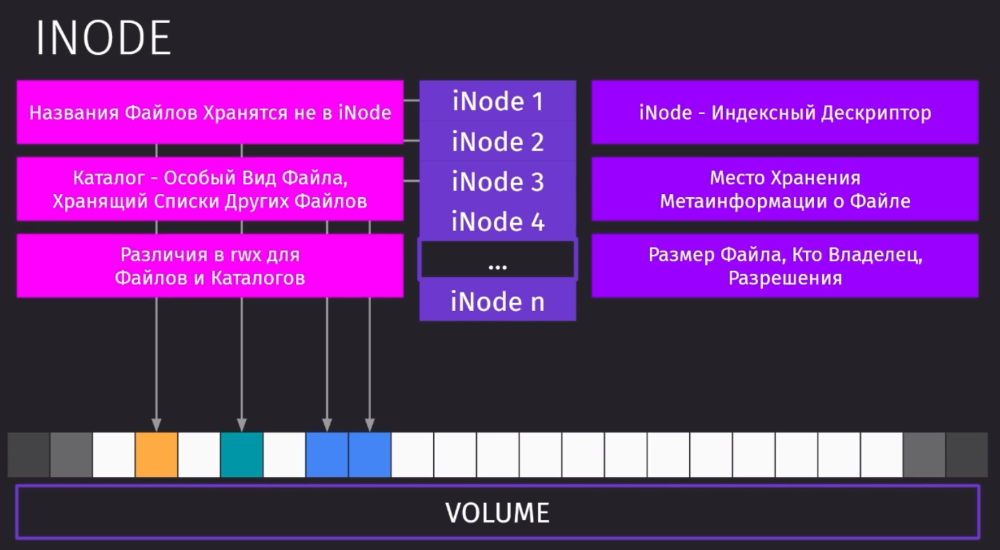

Важно учитывать и количество доступных iNode, так как их в системе только фиксированное количество, которое можно пересоздать после переустановки системы. 
Для большого количества мелких файлов лучше использовать extfs с возможностью добавления iNode.

Для просмотра информации по файлу нужно использовать `stat <имя_файла>`
`ls -li` выведет дескрипторы файлов
`df -i` выведет информацию по дескрипторам устройства

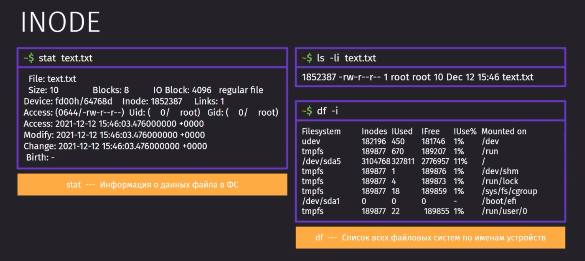

 Чтобы добавить диск в систему и расчертить ФС, нужно воспользоваться командой `mkfs.<расширение> <путь>`. Пример: `mkfs.ext4 /dev/sdb1`. 

И монтирование новой системы происходит с использованием команды `mount`.

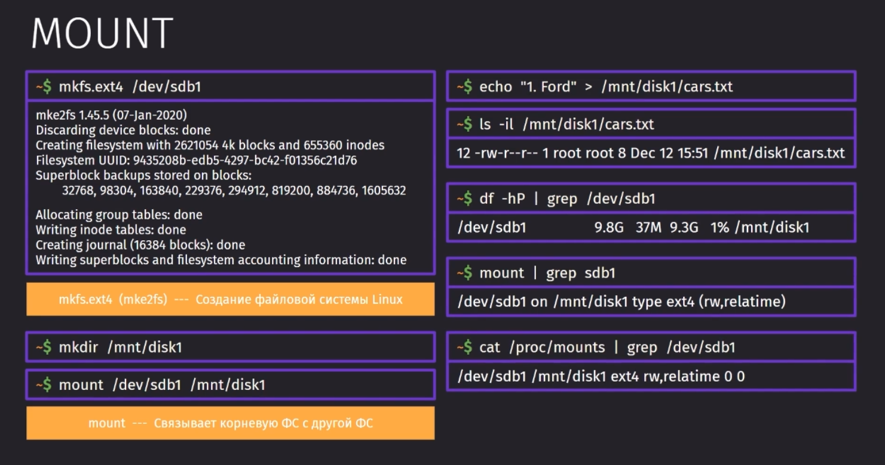

Чтобы сделать монтирование доступным после перезагрузки системы, мы можем занести данную строку в `fstab`

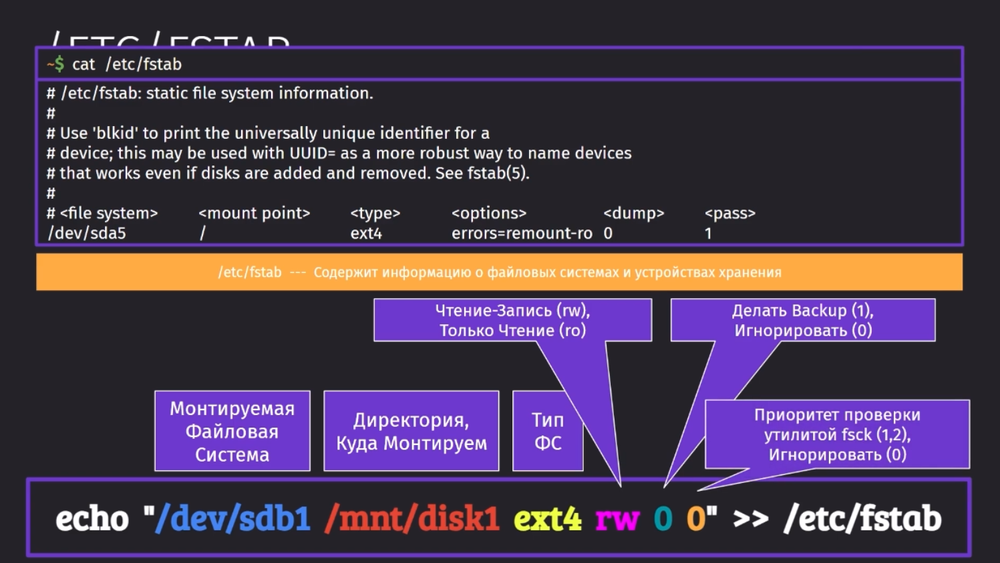

Чтобы отменить монтирование, нужно воспользоваться командой `umount`.

## LVM

LVM - менеджер логических томов

- Он позволяет динамически изменять размеры логических томов
- Позволяет перемонитровать файловые системы, включая корневой

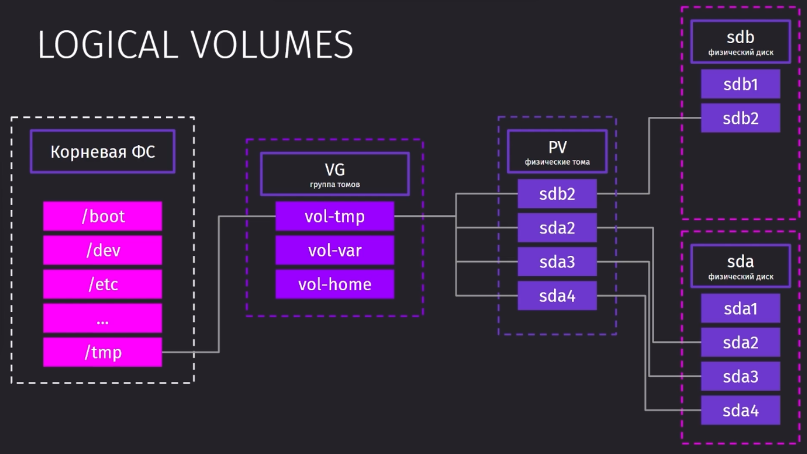

Установить утилиту для работы с логическими дисками можно следующей командой:

```bash
sudo apt update && install lvm2 -y
```

Для создания физического тома, нужно уже будет воспользоваться `pvcreate`, а для группы томов воспользоваться `vgcreate`. `pvdisplay` отобразит физические тома.

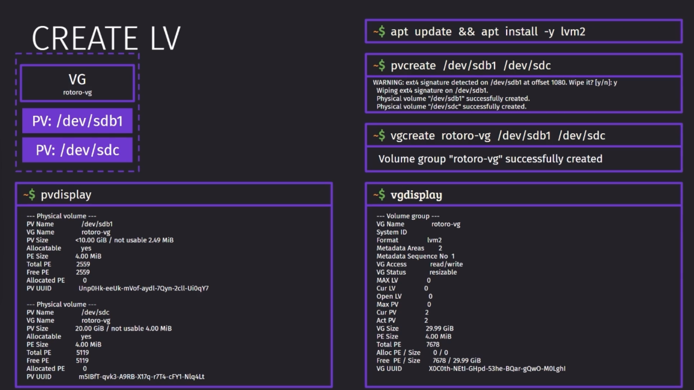

`lvcreate` уже создаёт логические тома. `lvs` отображает список логических томов. Команда `mkfs` создаёт файловую систему. Дальше идёт маунт файловой системы, чтобы была возможность им пользоваться.
`vgs` - выводит список групп томов
`lvresize` - позволяет изменить объём логического тома (размер физического не изменится). 

Проверить размер физического тома можно через `df`

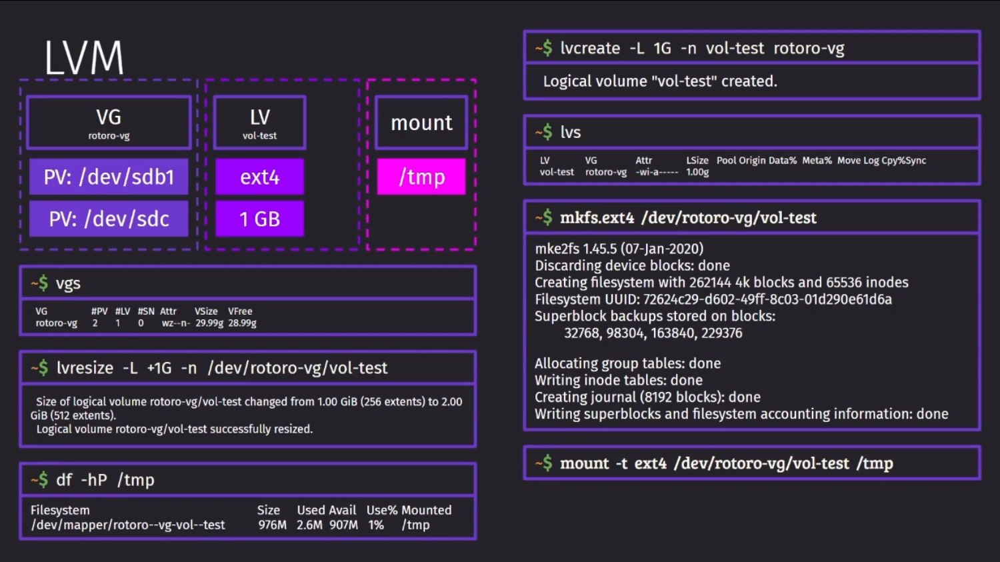

Чтобы изменить размер физического тома, нужно воспользоваться командой `resize2fs`.

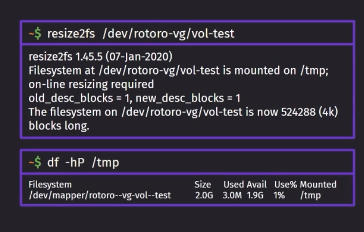

Основным плюсом данного подхода в разметке томов является возможность делать все изменения на лету без перезагрузок. 

Так же в путях можно обнаружить, что добавляется `/mapper`. Это путь LVM, который можно опустить и останется ровно такой путь, который задали мы для тома.

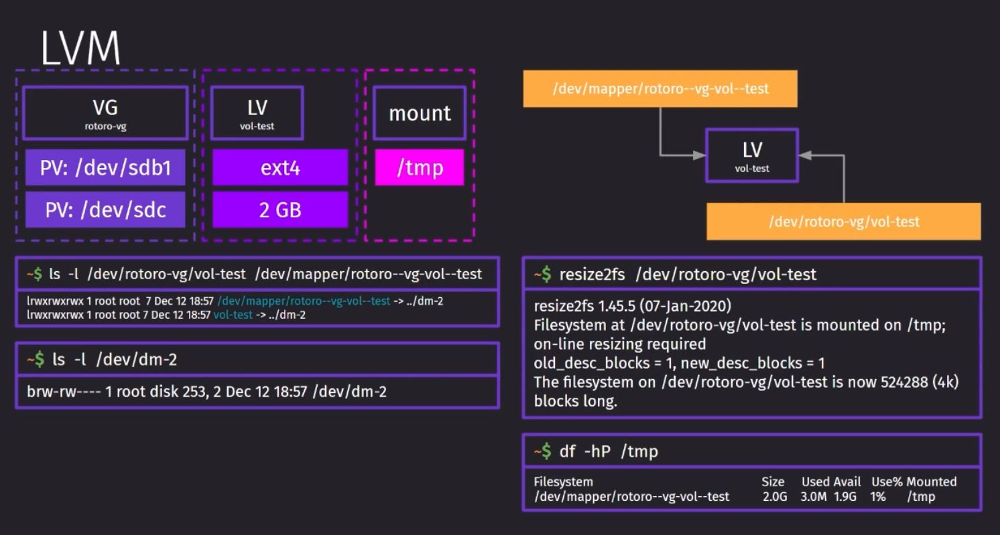
