---
tags:
    - docker
    - dockercompose
    - dockerswarm
    - ansible
    - vagrant
    - devops
---

## Введение

### Введение

Проблемы, которые перед нами встают, когда мы работаем с классической развёрткой приложения:

- загрузка на FTP требует дополнительного времени и сил для обновления (сейчас могут связать подгрузку из гита к серверу)
- конфликтуют версии зависимостей между тем, что использует приложение и тем, что располагается на сервере
- проблемы работы на разных устройствах (на linux одной версии запускается, а на другой уже нет)
- если мы запускаем несколько приложений на одном устройстве, то мы не можем никак гарантировать того, что одно приложение не будет мешать работе другого - отсутствие изоляции
- из вышеописанного пункта идёт ограничение масштабирования


Преимущества ==Docker==:

- Позволяет полностью изолировать приложение в виртуальной машине - изолировать сеть, файловое пространство
- очень просто и быстро можно откатить приложение, если на нём произошла ошибка - мы можем просто откатить image до стабильной версии и приложение будет опять доступно пользователям
- очень легко можно масштабировать приложение на большое количество кластеров, которые не будет конфликтовать портами
- очень легко доставлять приложение на продакшен благодаря тому, что мы просто собираем приложение, пакуем его в образ, выгружаем на сервер и запускаем (нам не нужно развёртывать приложение на удалённом сервере и переустанавливать зависимости)
- удобная работа с сетью
    - отсутствие конфликтов между портами
    - объединение работы разных машин, которые находятся в разных местах, создавая кластер
    - обращение к приложению не по API, а через Service Discovery, который обращает по его имени, где работает внутри DNS


Частые проблемы администрирования систем:

- очень много сложных повторяющихся задач
- вместе с поднятием image в докере приходится создавать дополнительную инфраструктуру, что замедляет доставку приложения и кода на продакшен
- отсутствие единой точки конфигурации серверов - мы не всегда можем сразу просмотреть, где установлены состояния серверов, потому что они находятся либо в самих серверах, либо у человека в голове


==Ansible== же позволяет нам автоматизировать все рутинные задачи, которые приходится выполнять при использовании ==Docker== и поднятии их image


### Обзор проекта

Из браузера будет приходить запрос, NGINX будет перенаправлять запросы, API написано на NestJS, APP на React, обмен сообщениями по сервисами реализован через RMQ


---

## Настройка VM на Linux

> [!info] Всю актуальную информацию по установке докера всегда можно найти в [официальной документации](https://docs.docker.com/engine/install/) а так же шагах [после установки](https://docs.docker.com/engine/install/linux-postinstall/)

### Установка Docker

Устанавливаем сертификаты

```bash
sudo apt-get update
sudo apt-get install ca-certificates curl gnupg
```

Далее устанавливаем ключ докера

```bash
sudo install -m 0755 -d /etc/apt/keyrings

curl -fsSL https://download.docker.com/linux/ubuntu/gpg | sudo gpg --dearmor -o /etc/apt/keyrings/docker.gpg

sudo chmod a+r /etc/apt/keyrings/docker.gpg
```

Устанавливаем репозиторий

```bash
 echo \
  "deb [arch="$(dpkg --print-architecture)" signed-by=/etc/apt/keyrings/docker.gpg] https://download.docker.com/linux/ubuntu \
  "$(. /etc/os-release && echo "$VERSION_CODENAME")" stable" | \
  sudo tee /etc/apt/sources.list.d/docker.list > /dev/null
```

Ещё раз обновляем утилиту установки пакетов

```bash
sudo apt-get update
```

Устанавливаем пакеты докера

```bash
sudo apt-get install docker-ce docker-ce-cli containerd.io docker-buildx-plugin docker-compose-plugin
```

Проверяем работу докера

```bash
sudo docker run hello-world
```

Добавляем группу докера

```bash
sudo groupadd docker
```

Тут мы добавляем себя в группу докера

```bash
sudo usermod -aG docker $USER
```

### Установка виртуалки

Для примера удалённой машины, будет использоваться

- Виртуализация - VirtualBox
- ОС - Ubuntu Server

Под Fedora перед запуском нужно было выполнить следующие команды:

```bash
sudo dnf install -y "kernel-devel-$(uname -r)"
sudo /sbin/vboxconfig
sudo rmmod kvm-intel
```

После запуска виртуалки с образом, у нас идёт самая стандартная установка, во время которой нам нужно будет подтвердить выбор установки OpenSSH и docker.

Далее в VB нужно прокинуть порты с нашей виртуальной машины на хост: Образ -> Настройки -> Сеть -> Дополнительно -> Проброс портов -> указываем нужные порты

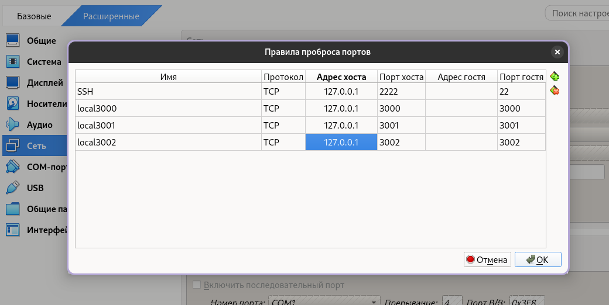

Далее нам не нужно входить на наш сервер каждый раз по логину/паролю. Достаточно указать данную команду для входа:

```bash
ssh <user>@127.0.0.1 -p 2222
```

Далее на хостовой машине получаем публичный ключ

```bash
cat ~/.ssh/id_ed25519.pub
```

И добавляем ключ в виртуалку в файл `authorized_keys`. Этот файл хранит ключи устройств, которые могут к нему подключаться по ssh.

```bash
mkdir ~/.ssh
cd ~/.ssh
nano authorized_keys
```

Теперь нам не нужно будет каждый раз вводить лог/пас для входа.

---

## Базовые понятия Docker

### 002 Архитектура Docker

Докер и виртуальная машина - это две разные вещи. Докер не использует супервизоры и не поднимает полноценную гостевую ОС, чтобы поднять внутри неё контейнезированное приложение.

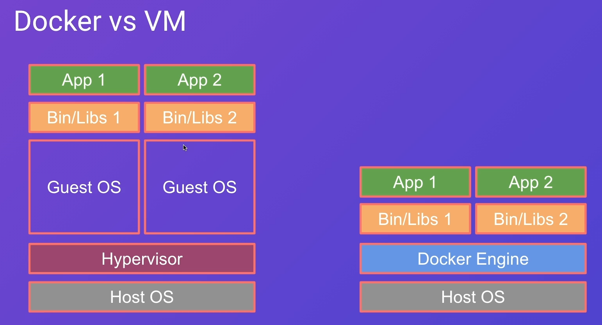

`htop` позволяет просмотреть процессы в linux и управлять ими


При запуске процесса внутри docker, мы запускаем новый namespace, который в себя включается

- Cgroups - определяет ограничения по памяти и ресурсам процессора
- IPC - определяет коммуникацию между процессами
- Network
- Mount - определяет доступность директорий
- PID - свои Process ID
- User
- UTS

Контейнер докера - это изолированный namespace с обвязками докера, который запускается на хостовой машине

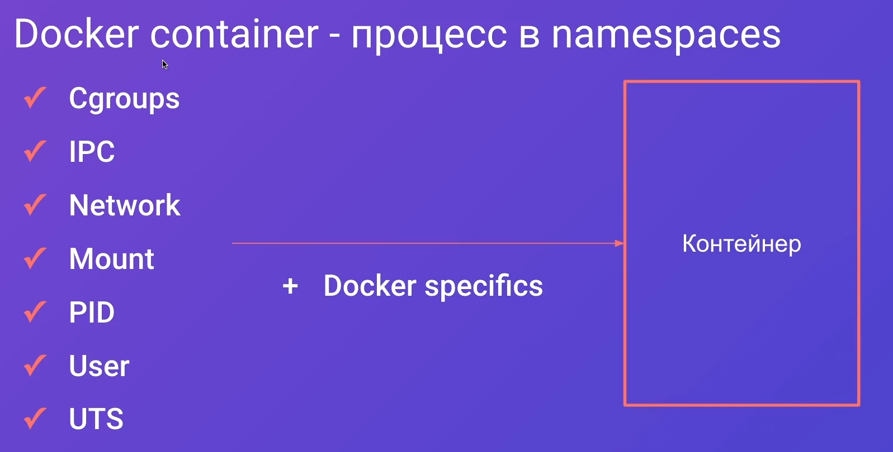

> [!info] Docker использует ядро Linux хоста и image содержит только необходимые бинарные файлы, библиотеки и приложения

Докер делится на две части: клиентская часть CLI и хостовая, которая принимает запросы от CLI и выполняет нужные команды


На клиенте мы отправляем команды в докер по API, который отправляет запрос в докер daemon. Daemon проверяет, есть ли нужный образ локально. Если образ отсутствует, то он обращается в общий registry и подтягивает образ оттуда и потом запускает контейнер


### 003 Управление контейнерами

Для упрощения работы с контейнерами их команды были вынесены наверх

вместо

```bash
docker container start
docker container stop
docker container stats
```

мы можем писать

```bash
docker start
docker stop
docker stats
```


У нас есть достаточное количество команд для контроля ЖЦ контейнера:

- `docker run` - создаст контейнер и запустит его
- `docker create` - создаст контейнер в остановленном виде
- `docker kill / stop` - останавливает работу контейнера
- `docker rm` - удалит контейнер (`--force` убьёт и удалит запущенный контейнер)

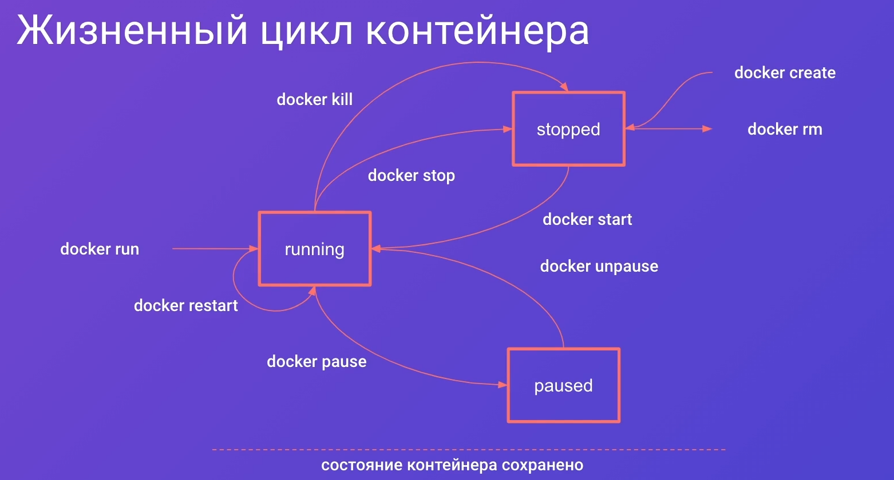

Первая команда показывает запущенные контейнеры. Ключ `-a` покажет все контейнеры, включая остановленные

```bash
docker ps
docker ps -a
```

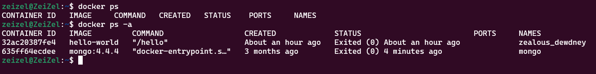

Удаление контейнера

```bash
docker rm имя/id
```

Создаём контейнер из образа `mongo`, который будет с указанными именем `my-mongo`. Флаг `-d` позволяет отцепить процесс от текущего bash и запустить его в отдельной сессии

```bash
docker run --name my-mongo -d mongo
```

Когда мы пользуемся определённой сменой состояния процесса, мы посылаем сигнал


Удаляет все остановленные контейнеры

```bash
docker container prune
```

Переименование контейнера

```bash
docker rename имя_контейнера новое_имя
```

### 004 Логи и статистика работы

Показывает всю статистику занимаемого пространства и ресурсов по контейнерам

```bash
docker stats
```

Показывает всю информацию по нужному контейнеру

```bash
docker inspect имя_контейнера

// покажет, включая занимаемое место
docker inspect -s имя_контейнера

// покажет, одно отдельное свойство
docker inspect -f "{{.Status.State}}" имя_контейнера
```

Позволит вывести логи контейнера

```bash
docker logs контейнер
```

### 005 Команды в контейнере

Докер нам так же предоставляет возможность запускать команды внутри

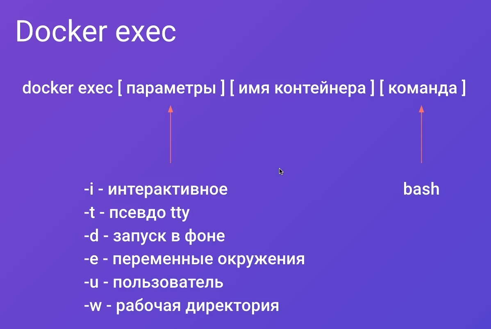

позволяет установить и просмотреть локальные переменные

```bash
docker exec -e MYVAR=1 mongo printenv
```


А тут мы уже залезли внутрь контейнера и можем выполнять различные операции над ним

```bash
docker exec -it mongo bash
```


Так же мы можем вывод из консоли вывести в отдельный файл, если нам потребуется

Тут сразу нужно сказать, что команда вывода и сохранения в новый файл происходит вне контейнера


Если нужно запустить команду внутри контейнера, то можно сделать таким образом:

```bash
docker exec mongo bash -c 'mongo --version > mongo.txt'
```

---

## Docker image

### Что такое image

#### Состав изображения

Для начала скачаем образ nginx с docker hub с помощью docker daemon

```bash
docker pull nginx
```

Как можно заметить, докер скачивает не целиковый образ, а отдельные слои (aka _layers_, из которых состоит образ). Каждый образ подписан уникальным идентификатором. Такой подход позволяет экономить пространство на диске.

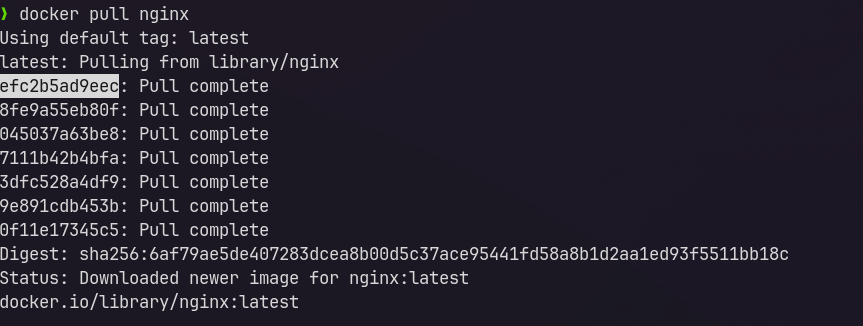

По-факту, каждый слой - это отдельный образ, который доступен только на Read (чтение). После создания контейнера из image, у нас создастся тонкий слой, который будет доступен для записи информации (ReadWrite).

Это приводит к тому, что сколько бы мы не запустили разных контейнеров изображения, image, на котором (например) nginx будет базироваться, останется всегда один.

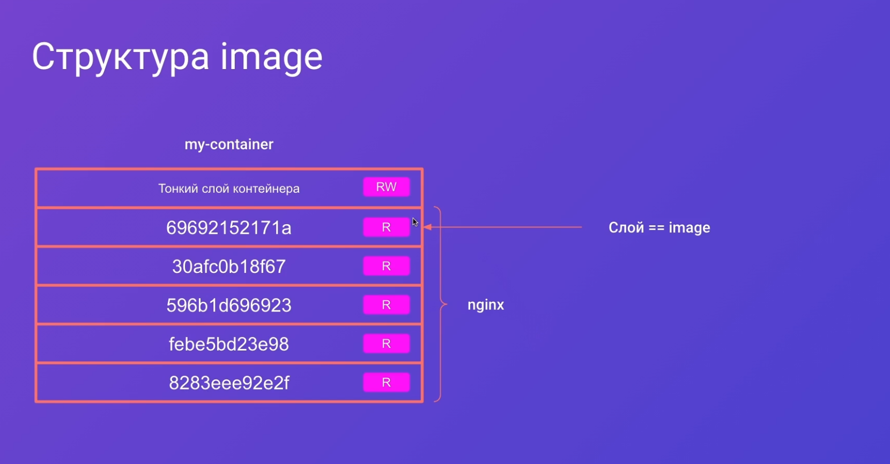

#### Внутрянка image

Теперь мы можем посмотреть, что находится внутри изображения в докере.

Для начала просмотрим список изображений

```bash
docker images
```


Чтобы сохранить архив с внутренними файлами изображения, можно воспользоваться следующей командой

> Сразу можно сказать, что данный способ может пригодиться, когда наша машина не имеет доступа в интернет и в неё можно передать изображение только таким образом.

```bash
docker save --output nginx.tar nginx
mkdir nginx
tar xvf nginx.tar -C nginx
```

Ну и в манифесте можно просмотреть все ссылки на остальные слои изображения.

Структура каждого слоя выглядит похожим образом. Даже можно сказать, что layer - это тоже image, который содержит определённую информацию.

Такая иерархия очень похожа на стандартную работу пакетного менеджера, который собирается из других пакетов.

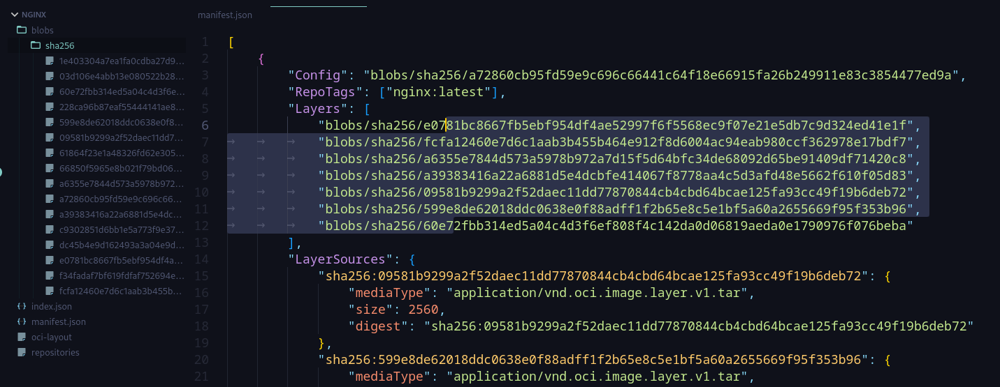

Так же в отдельном слое может находиться и внутренность его файловой системы

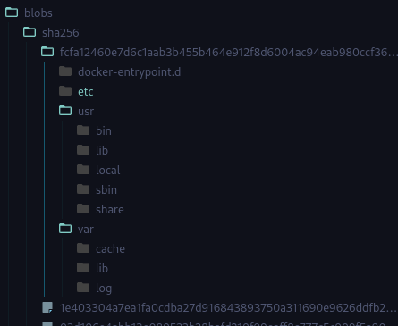

Так же мы можем вывести историю, по которой мы можем понять, как был собран тот или иной image. История снизу вверх идёт и отображает последовательность операций сборки

```bash
docker history <package>
```

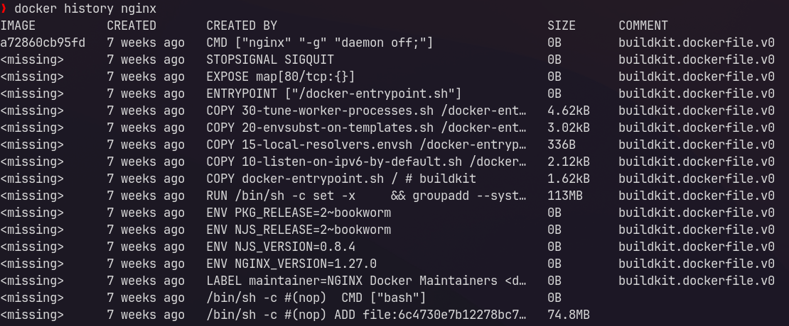

Эффективным это переиспользование является потому, что мы не занимаем на диске место несколькими разными контейнерами. У нас поднимаются отдельные верхние слои, которые используют свои модули и пакеты в процессе работы, а так же ссылаются на общие слои.

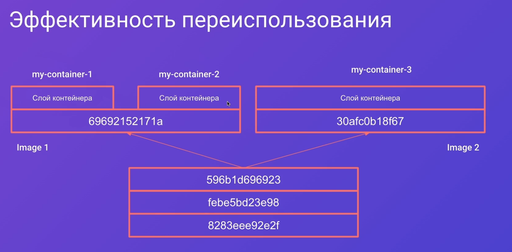

`/var/lib/docker/overlay2` - это группа слоёв изображений, который смёрдживается в одну файловую систему, которая используется в разных контейнерах. Сама по себе она весит немного, так как использует слоёную архитектуру

`/var/lib/docker/containers` - содержит образы контейнеров, которые мы пульнули из хаба. Сейчас тут 54 килобайта nginx

```bash
sudo du -sh /var/lib/docker/overlay2
sudo ls /var/lib/docker/overlay2
```

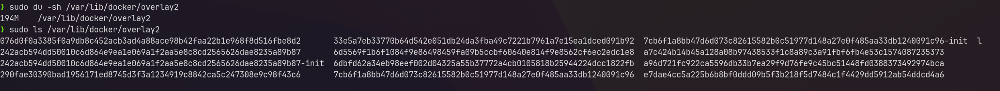

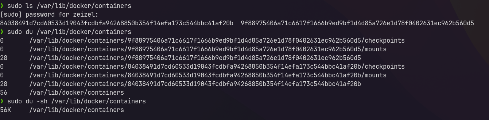

После создания отдельного контейнера, мы создаём на базе изображения nginx второй верхний слой, который будет занимать не так много места

То есть прошлое изображение и новое с 56кб начали весить 120кб

```bash
docker run -d --name nginx2 nginx
```

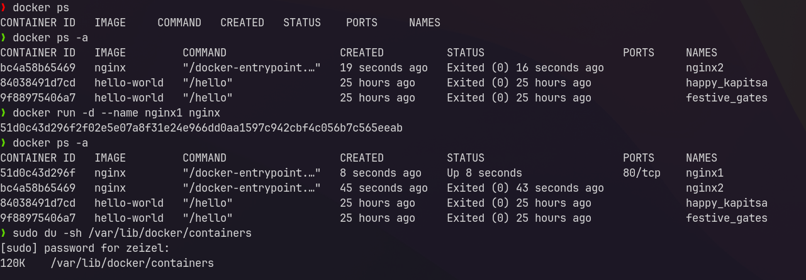

Деление оверлея файловой системы:

- Нижний слой
    - link - ссылка на слой
    - diff - изменения файловой системы образа
- Верхний слой
    - lower - ссылается на нижний слой и может вернуть информацию о том, что там лежит
    - link - ссылка для того, чтобы на этот слой мог ссылаться другой слой, который будет выше
    - diff - показывает разницу относительно прошлого слоя
    - merged - слитый diff с предыдущей файловой системой (diff из нижнего и верхнего слоя). Позволяет собрать правильный слепок файловой системы, на которой будет работать образ
    - work - папка для хранения внутренних данных для оверлея

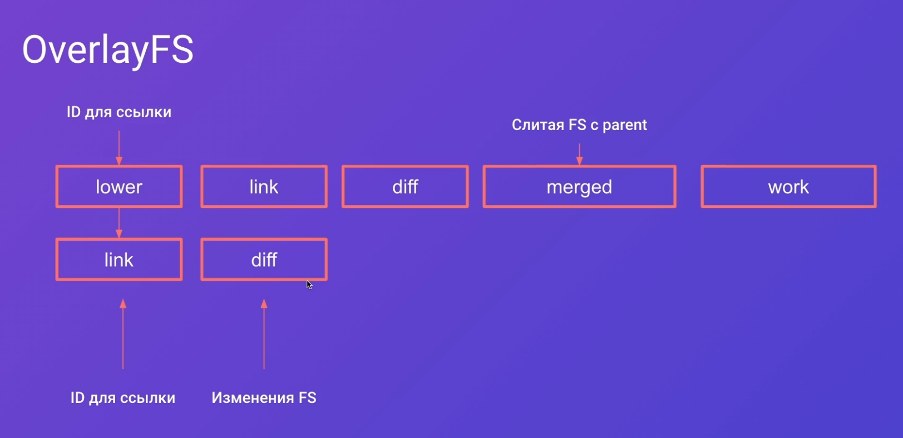

Собственно, все эти папки можно вывести из определённого изображения

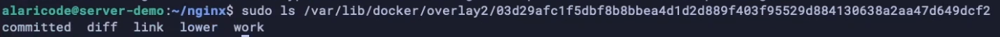

Раньше использовались драйверы OverlayFS1 (предыдущая, менее эффективная версия) и AUFS (этот был устроен сложнее, но выполнял всё то же самое, хоть и медленнее)

### 002 Работа с image

Команды `docker image`:

- `history` - выведет историю по определённому image со всеми командами для сборки образа

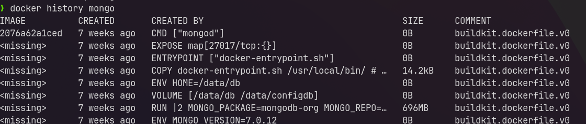

- `inspect` - выведет подробную спеку по image.

`LowerDir` - хранит дифы (blob'ы связанных слоёв)
`MergedDir` - мёрдж всех слоёв с FS текущей системы
`UpperDir` - дифф текущей системы
`WorkDir` - необходимая для OverlayFS директория

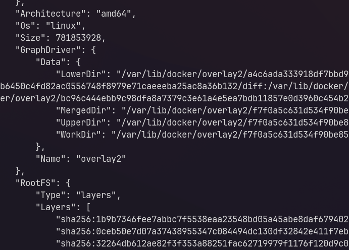

- `import` - это операция, которая позволит руками импортировать image (нужно для систем, у которых нет доступа к интернету)
- `pull` - находит registry с нужным образом docker
- `push` - позволит запушить собранный локально image для того, чтобы потом его скачать
- `ls` - выведет все изображения. Так же он имеет флаги:
    - `--format {{.Tag}}`, который выведет сформатированный ответ
    - `--filter "before=node"`, который отфильтрует по параметрам (изображения, которые идут до ноды)

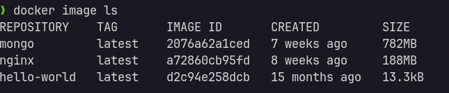

- `rm <image name/id>` - позволит удалить определённый image

Если в удаляемом контейнере используются слои, которые используются в других образах, то докер нас об этом предупредит и даст удалить image только с `--force` флагом либо удалить все контейнеры, которые ссылаются на этот image

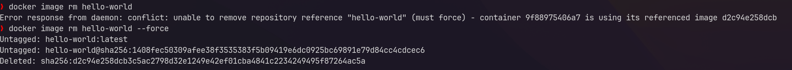

Так же частым бывает случай, когда мы встречаемся с `dangling image` - это изображение без тэга. Такое получается, когда мы меняем тег одного image на другой.

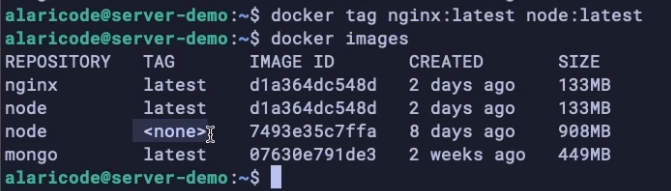

Чтобы решить эту проблему, можно воспользоваться следующей командой:

- `prune` - очистит все image без тэгов

### 003 Dockerfile

#### Сам файл

Dockerfile представляет из себя файл с инструкциями докеру, что он должен сделать, чтобы собрать образ с нашим приложением.

Сразу нужно сказать, что каждая новая команда - это слой. Стоит оптимизировать свои команды, чтобы этих слоёв было минимум. Сам докер имеет ограничение в 127 строк в своём файле. Обходится это multistaged билдами.

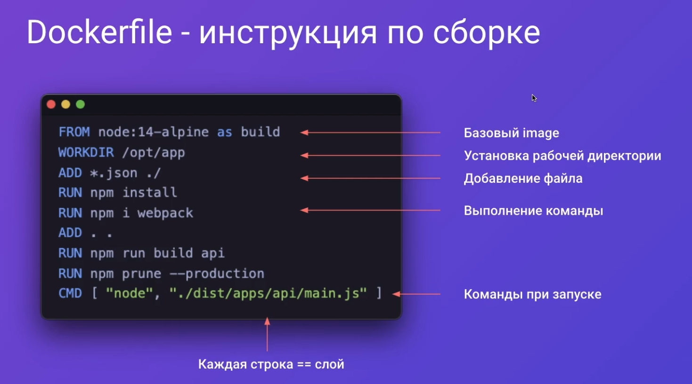

#### Контекст сборки

Во время сборки, мы имеем дело с контекстом сборки. Контекст сборки - это набор файлов, к которым сборка может получить доступ. Когда билд собирает контекст, то он собирает все вложенные файлы нашего проекта, которые нужны для запуска приложения.

Сам контекст поднять нельзя. Если нам нужно будет собрать файл из папки вверх, то нам нужно будет подняться по пути самого билда на папку выше.

`.dockerignore` позволит удалить некоторые файлы из контекста.

#### Команды

- `ARG` - аргументы - это дополнительные параметры, которые можно передать при сборке. Можно передать как заранее определённую переменную со своим значеннием, так и неопределённую, значение которой мы передадим из вне внутри команды `docker build --build-arg`. Второй вариант нужен, когда нам нужно, чтобы значение существовало только в рамках билда, но не попало на прод
- `FROM` - это старт нашего образа. Всегда и все образы базируются на каком-либо другом образе. Если образ не требуется ни на чём базировать, то мы его базируем на `scratch`. Так же через `as` мы задаём alias для билда, чтобы использовать его в последовательности внутри другого билда
- `ONBUILD` - это команда, которая будет выполняться только тогда, когда другой image базируется на этом image, то есть только внутри другого билда во время сборки другого изображения
- `LABEL` - хранит в себе мета-информацию об образе, в котором можно указать версию, автора, компанию и так далее
- `USER` - определяет пользователя, который будет выполнять команды
- `WORKDIR` - рабочая директория, относительно которой будут выполняться команды
- `ADD` - добавляет файлы с хостовой машины в образ. Однако эта команда так же умеет в побочные действия в виде разархивирования в определённую папку и скачивания файла по урлу
- `COPY` - просто копирует файлы в образ. Из побочных действий он умеет копировать файлы из прошлых образов во время multistage-сборки

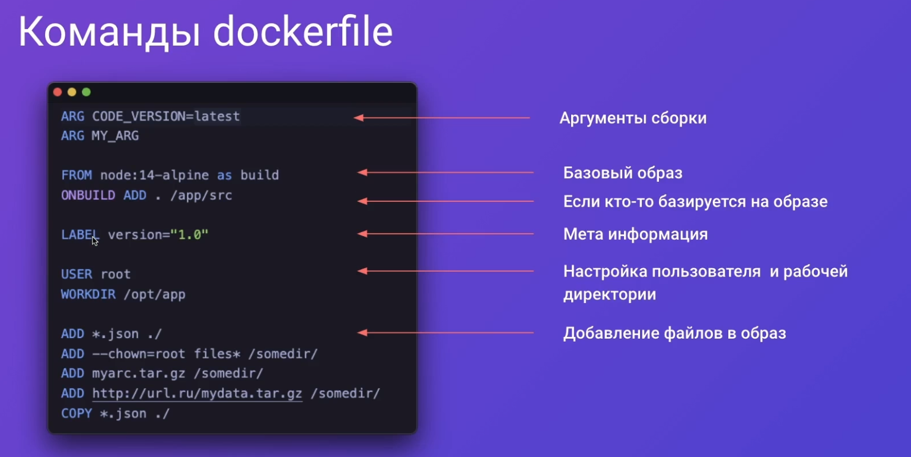

- `SHELL` - установка нужного нам shell
- `RUN` - выполнение команды из оболочки. Самая частая в использовании команда. Для поднятия и сборки билда
- `ENV` - переменная окружения сборки. Чтобы обратиться к переменной, нужно написать `$ПЕРЕМЕННАЯ`. Она будет так же находиться и в финальном образе, поэтому хранить в ней секреты и токены - несекьюрно. Чтобы не сохранять переменную, её можно будет записать с помощью `RUN VAR=data`.
- `VOLUME` -
- `ENTRYPOINT` - это инструкции, которые нужно выполнить после того, как запустится контейнер из этого изображения
- `CMD` - то же самое, что и прошлая команда, но...
- `STOPSIGNAL` - вызов стопсигнала для остановки контейнера
- `EXPOSE` - это документация о том, какой порт мы прокинули и можем получить снаружи вне нашего контейнера. Сама команда пробросом портов не занимается.
- `#` - комментарий внутри изображения. Так же можно туда записать инструкцию для парсера по тому же экранированию

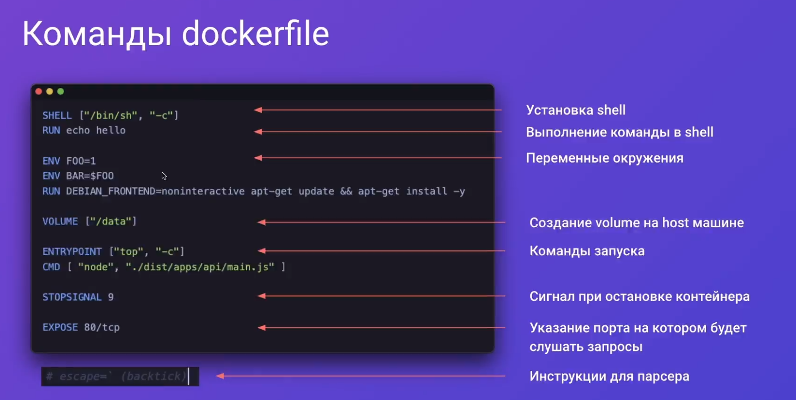

`CMD` и `ENTRYPOINT` вляют друг на друга и ведут себя по-разному в разных обстоятельствах. Если нет ниодного из них, то ничего не произойдёт. Если есть только cmd, то выполнится команда и её аргументы. Если мы запишем только энтрипоинт в виде строки, то он покроет выполнение cmd полностью и будет просто выполняться со своей строкой. Если энтри массив, а cmd строка, то выполнится обе операции. Если этри массив и cmd массив, то cmd будет представлять из себя просто уточняющие операции для entry.

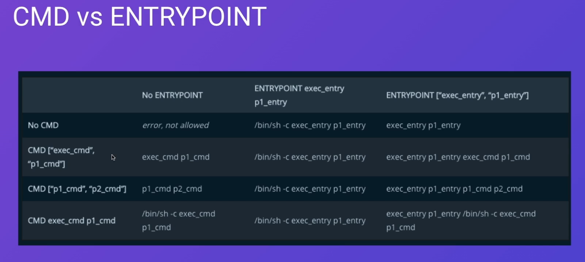

### 004 Создаем свой image

Команда `docker build` собирает нам приложение.

И она принимает в себя несколько флагов:

- `-q` - подавляет вывод сгенерированных файлов докером
- `-f` - позволяет указать путь до Dockerfile. Изначально, билд ищет этот файл в корне контекста, но если его не будет, то вылезет ошибка, поэтому нам и нужно
- `-t` - определяет название и тэг для нашего образа

Опишем проект. Это монорепозиторий с бэкэндом (`api`) и фронтендом (`app`).

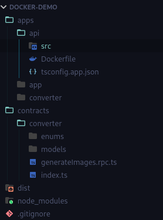

Опишем простой докерфайл, который просто позволит поднять проект. Нам понадобится образ 14 ноды, укажем рабочую директорию как `/opt/app`, добавим туда весь проект, установим все скрипты, сбилдим проект, запустим его через `node`

`apps / api / Dockerfile`

```bash
FROM node:14
WORKDIR /opt/app
ADD . .
RUN npm i
RUN npm run build api
CMD ["node", "./dist/apps/api/main.js"]
```

И тут мы должны будем указать путь до Dockerfile, указать тег, чтобы не потерять образ и указать контекст `.`, чтобы работать со всем проектом

```bash
docker build -f ./apps/api/Dockerfile -t test:latest .
```

Далее нам нужно поднять наш образ с запущенным образом. Отцепляем работу от текущей сессии терминала, указываем имя образа, указываем тег проекта, к которому мы подключились.

```bash
docker run -d --name api test:latest
```

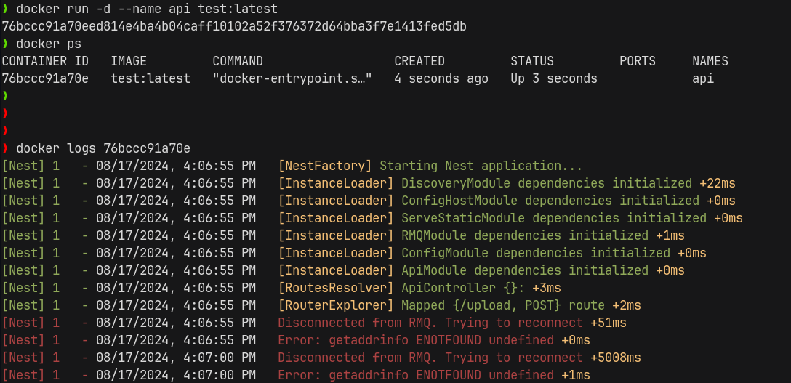

### 005 Улучшаем сборку

Сам образ правильный, он работает и запускается, но вес для обычного маленького проекта - очень большой.

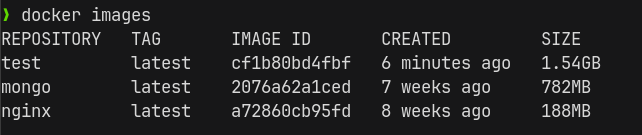

Можно оптимизировать вес образа за счёт правильного использования слоёв.

Сейчас у нас такая ситуация. При повторной сборке, у нас она выполняется за несколько секунд благодаря кэшированию всех этапов.

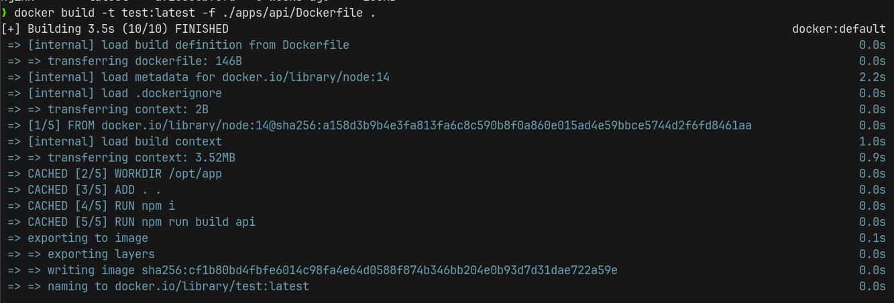

Однако если мы изменим каким-либо образом код, то у нас слетит кэш на этапе установки зависимостей и их придётся ставить в проект заново.

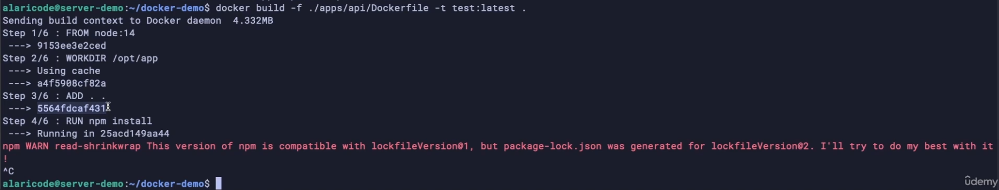

Код у нас меняется чаще, чем зависимости, поэтому нам нужно немного поменять подход к их установке.

Первым делом, нам нужно скопировать `package.json`, затем установить зависимости, а уже только потом собирать проект. Так же более лёгкой версией ноды будет являться не версия на классическом дистрибутиве, а alpine, который весит менее 100 мегабайт. Он отлично подходит для разворачивания приложения

```bash
FROM node:14-alpine3.10
WORKDIR /opt/app
ADD *.json ./
RUN npm i
ADD . .
RUN npm run build api
CMD ["node", "./dist/apps/api/main.js"]
```

И теперь наше изображение стало весить в два раза меньше при тех же вводных, а так же у нас закэшировались все шаги до билда, что позволит пропустить этап с установкой зависимостей при каждой новой сборке приложения.

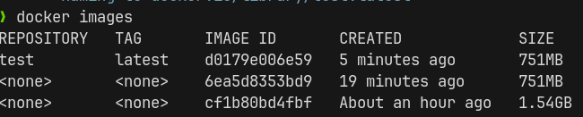

### 006 Анализируем image

Для анализа образов можно воспользоваться утилитой [dive](https://github.com/wagoodman/dive), которая позволяет залезть внутрь образов на каждом этапе сборки.

Эта команда, которая возьмёт наш тестовый образ и построит по его файловой системе граф

```bash
dive test:latest
```

Тут у нас есть информация по каждому слою и отображение Image Details, в котором есть общая информация по возможной оптимизиации образа

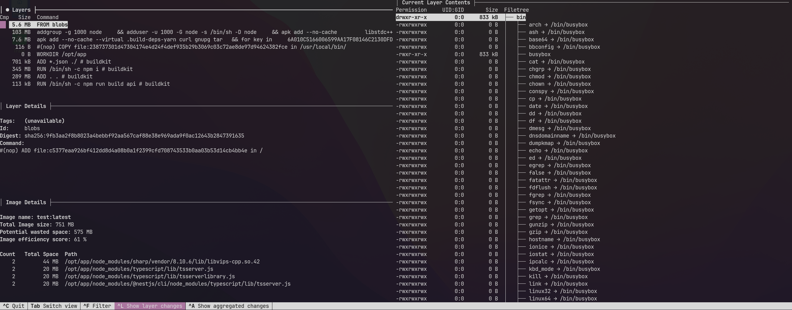

Под каждый шаг мы получаем новые данные о новых файлах

Так из каждого шага мы можем для себя определить, какие слои могут быть больше оптимизированы и урезаны от лишних файлов

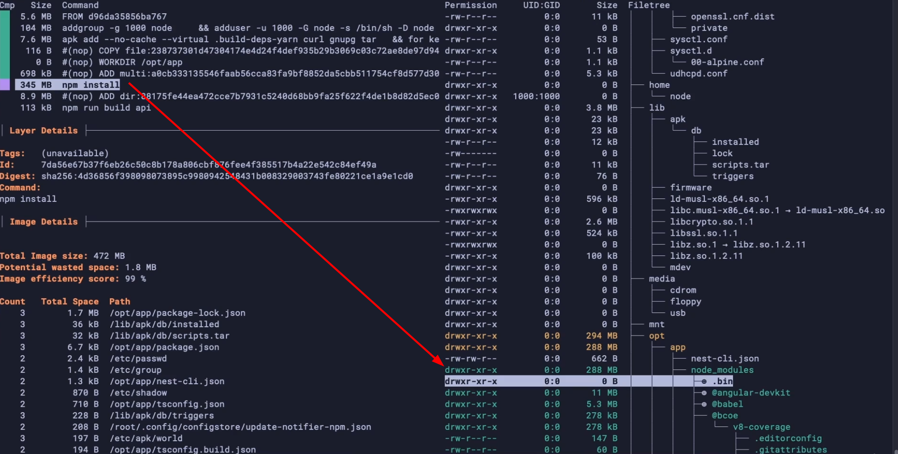

### 007 Многоэтапная сборка

Многоэтапная сборка позволяет нам собрать в одном Dockerfile сразу несколько образов.

Основные плюсы:

1. Позволяет иметь более сжатый конечный билд
2. Позволяет скрыть секреты, которые использовались на первом этапе, но на втором их уже не будет

Поэтому сейчас мы сделаем первый образ, который в себе соберёт приложение. А во втором образе мы возьмём собранное приложение с помощью обращения через `--from=<алиас_сборки>` и установим только prod-зависимости

Так же в команде `COPY` мы можем поменять немного путь расположения

```Dockerfile
FROM node:14-alpine3.10 as build
WORKDIR /opt/app
ADD *.json ./
RUN npm i
ADD . .
RUN npm run build api


FROM node:14-alpine3.10
WORKDIR /opt/app
ADD package.json ./
RUN npm i --only=prod
COPY --from=build /opt/app/dist/apps/api ./dist
CMD ["node", "./dist/main.js"]
```

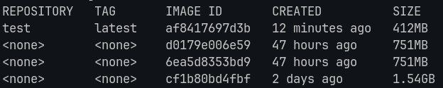

### 008 Упражнение - Сборка go проекта

Сейчас завернём приложение на Go, которое просто выводит сообщение о своём запуске на определённом порту

`go.mod`

```go
module docker-demo-2

go 1.15
```

`main.go`

```go
package main

import (
	"fmt"
	"net/http"
)
func main() {
	fmt.Print("Go проект запущенный в Docker слушает на 9000 порту")
		handler := HttpHandler{}
		http.ListenAndServe(":9000", handler)
}

type HttpHandler struct{}
func (h HttpHandler) ServeHTTP(res http.ResponseWriter, req *http.Request) {
	data := []byte("Hello World!")
	res.Write(data)
}
```

Для начала просто соберём приложение

```bash
brew install go
go build
./docker-demo-2
```

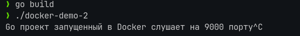

Далее нужно будет его перенести в докер, там собрать и запустить. Для этого воспользуемся `golang:alpine` системой для поднятия образа и уже внутри неё соберём бинарник. Сам по себе бинарник мы собираем под определённую систему, поэтому ничего страшного не будет, если следующий билд мы соберём из `scratch` и в нём просто запустим наш бинарник

```Dockerfile
FROM golang:alpine as build
WORKDIR /go/bin
ADD . .
RUN CGO_ENABLED=0 GOOS=linux GOARCH=amd64 go build

FROM scratch
COPY --from=build ./go/bin/docker-demo-2 ./go/bin/docker-demo-2
ENTRYPOINT ["./go/bin/docker-demo-2"]
EXPOSE 9000
```

Далее остаётся только сбилдить и запустить образ

```bash
docker build -t go-api:latest .
docker run --name go-api-demo -d go-api
```

---

## Сети Docker

#bridge #host #null #dockernetwork

### Устройство сети Docker

За управление сетями в докере отвечает библиотека Libnetwork. Она пользуется функционалом, доступным в Linux для работы с сетями внутри него.

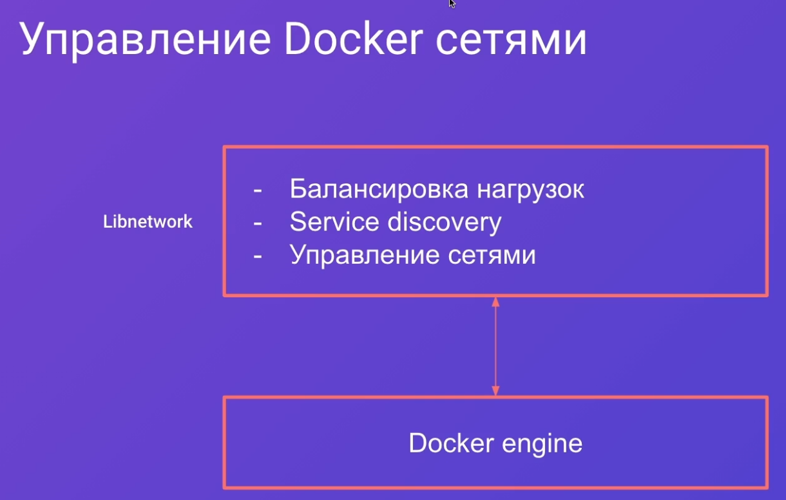

- Она утилизирует неймспейсы сети
- использует виртуальные мосты для соединения одного образа с другим
- виртуализация интернет-подключений
- управляет правилами iptables


Контейнер, при поднятии, создаёт виртуальный интернет-адаптер. Этот адаптер подключается к виртуальному мосту и уже сам мост получает доступ в интернет. Через мост несколько контейнеров могут общаться в рамках одного хоста.

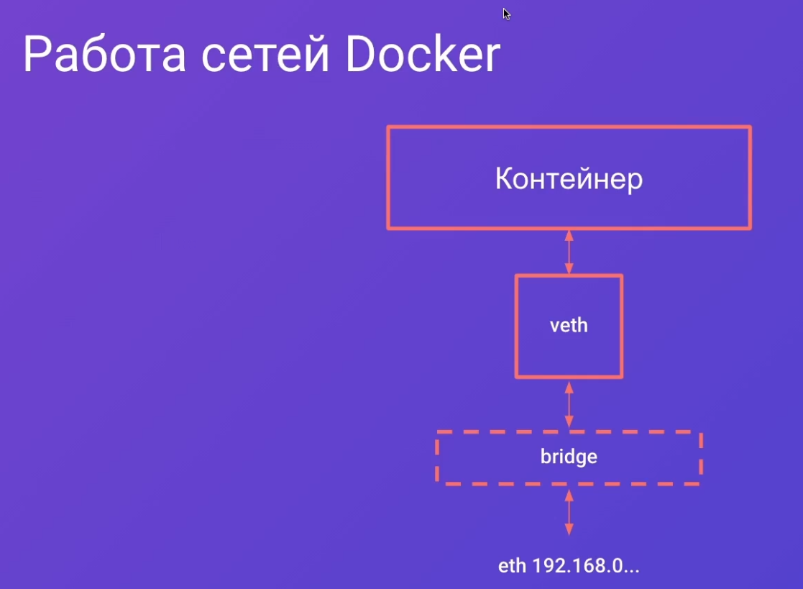

Так как библиотека для работы с сетью достаточно гибкая, то она может предоставить нам возможность работать с несколькими драйверами, которые определяют поведение работы сети.

- `bridge` - изолирует сеть между всеми контейнерами
- `host` - контейнер будет работать напрямую с сетью компьютера без дополнительных слоёв
- `overlay` - соединяет множество хост-машин в одну сеть для взаимодействия контейнеров
- `macvlan` - создаёт новое физическое устройство со своим mac (сильно влияет на перфоманс сети)
- `null` - не даёт сеть контейнеру

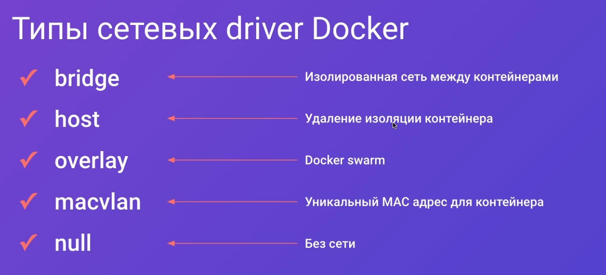

Управляется сеть достаточно просто самыми базовыми командами

- `connect`
- `create` - создаст сеть по определённому типу драйвера
- `disconnect`
- `inspect`
- `ls` - отображает сети
- `rm` - удаляет сеть
- `prune` - удаляет неиспользуемые

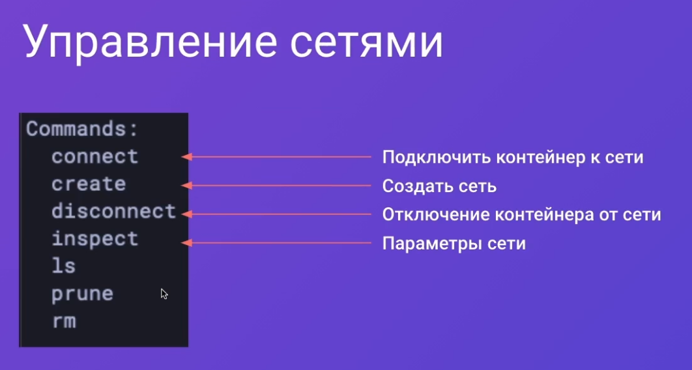

Выведем список доступных сетей докера, которые созданы по-умолчанию

```bash
docker network ls
```

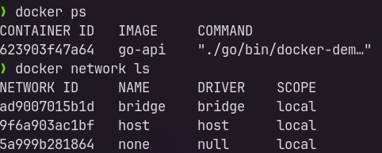

Ну и далее можем проинспектировать любую

- `scope` - текущая область сети (локальная, удалённая)
- `driver` - текущий драйвер
- `EnableIPv6` - так же можно подключить ipv6 на сеть
- `IPAM` - хранит список подсетей и их драйверов для всех контейнеров
- `Containers` - хранит список контейнеров, которые подключены к этой сети. По указанному внутри `IPv4Address` можно пингануть контейнер

```bash
docker network inspect bridge
```

```JSON
[
    {
        "Name": "bridge",
        "Id": "ad9007015b1d9bf9dfd4bddf86c95e3ea89d007de5863818083177ae8ded1288",
        "Created": "2024-08-21T18:55:22.413658685+03:00",
        "Scope": "local",
        "Driver": "bridge",
        "EnableIPv6": false,
        "IPAM": {
            "Driver": "default",
            "Options": null,
            "Config": [
                {
                    "Subnet": "172.17.0.0/16",
                    "Gateway": "172.17.0.1"
                }
            ]
        },
        "Internal": false,
        "Attachable": false,
        "Ingress": false,
        "ConfigFrom": {
            "Network": ""
        },
        "ConfigOnly": false,
        "Containers": {
            "623903f47a64bf7c3add8bad48d8cbfcfdcfcb73a5fa9262da787e137ddafcc3": {
                "Name": "xenodochial_ptolemy",
                "EndpointID": "b77ee64683f51c83a6249fd2258321607ca632e10c91e21edf9ae054a56b005c",
                "MacAddress": "02:42:ac:11:00:02",
                "IPv4Address": "172.17.0.2/16",
                "IPv6Address": ""
            }
        },
        "Options": {
            "com.docker.network.bridge.default_bridge": "true",
            "com.docker.network.bridge.enable_icc": "true",
            "com.docker.network.bridge.enable_ip_masquerade": "true",
            "com.docker.network.bridge.host_binding_ipv4": "0.0.0.0",
            "com.docker.network.bridge.name": "docker0",
            "com.docker.network.driver.mtu": "1500"
        },
        "Labels": {}
    }
]
```

### Драйвер bridge

Bridge позволяет нам объединить в одну сеть несколько контейнеров в рамках одного хоста.

- Очень прост в конфигурации
- Обеспечивает локальный service discovery (обращение одного контейнера к другому по имени)
- работают только на одной хост-машине

Очень удобно поднимать фронт+бэк на одной машине и на продакшенах, где один хост.

#### Схема работы

Контейнер подключается к своему виртуальному интернету, который подклчюается к мостовой сети. Каждый контейнер имеет свой ip. А уже сама мостовая сеть смотрит в мир через один ip.

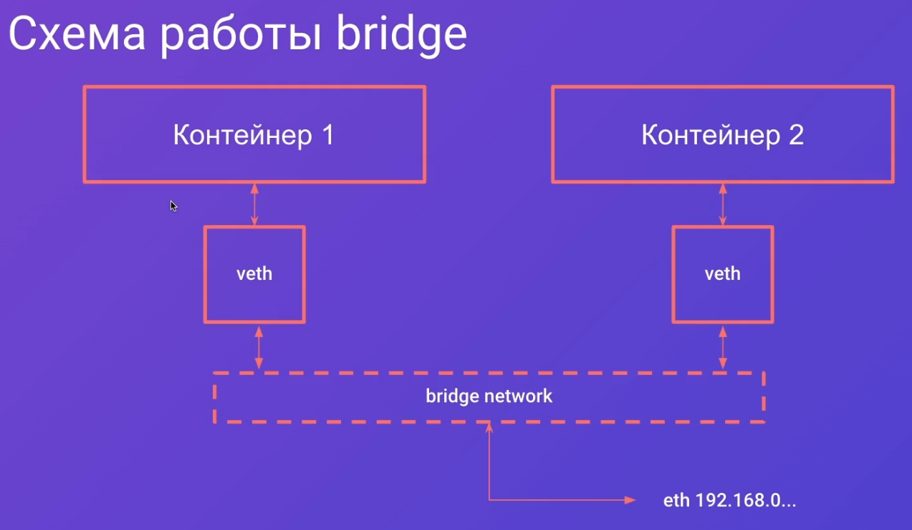

Так же можно выделять связи контейнеров несколькиим бриджами, чтобы разделять их друг от друга. Однако bridge всё так же будет виден из одного ip.

Контейнеры 1 и 2, а так же 2 и 3 - видят друг друга. Контейнеры 1 и 3 никак не могут достучаться друг до друга.

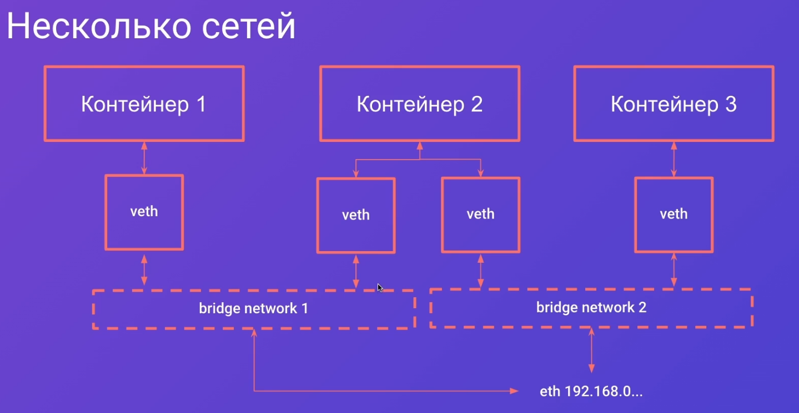

Уже на двух машинах это не будет работать. Только в том случае, если мы напрямую через сеть будем обращаться по определённому ip бриджа на другой локалке.

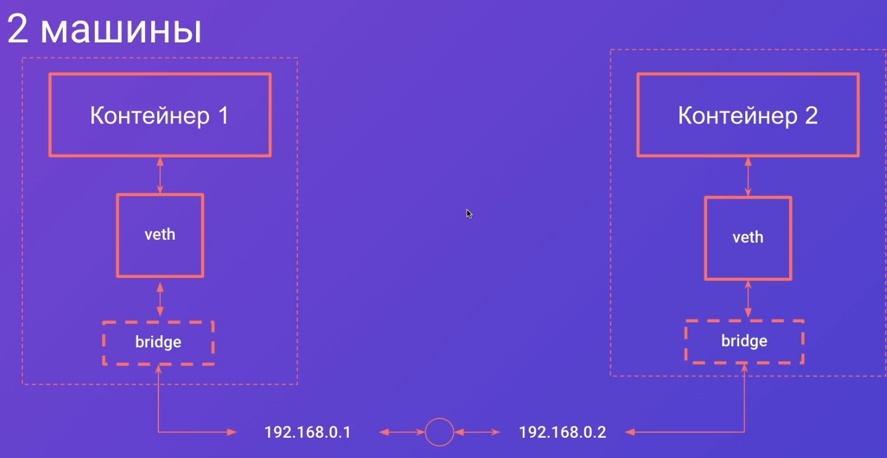

Если нам потребуется получить доступ к определённому порту извне, то мы сможем переадресовать через Port Mapping нас на определённый порт.

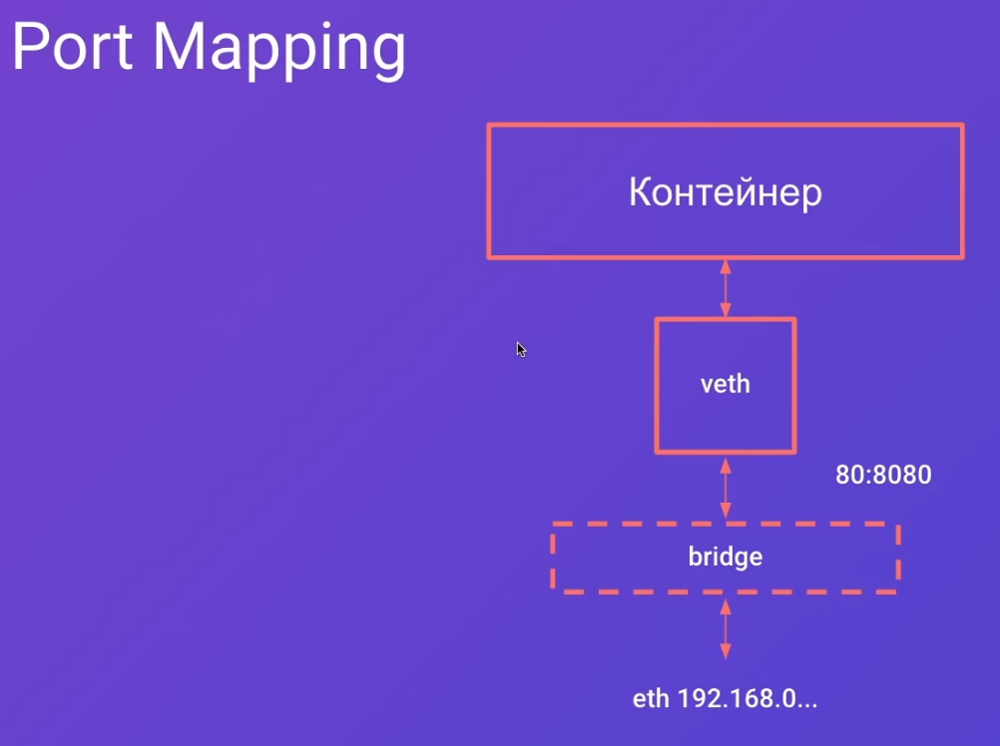

#### Пример

Далее напишем простую утилиту, которая будет выводить список портов ipv4 на устройстве компьютера

```JS
const http = require('http');
const { networkInterfaces } = require('os');

const port = 3000;
const requestHandler = (request, response) => {
	const IPs = getIPs();
	response.end(JSON.stringify(IPs));
}
const server = http.createServer(requestHandler)
server.listen(port, (err) => {
	if (err) {
		return console.log('Ошибка', err)
	}
	console.log(`Сервер запущен на порту ${port}`)
});

const getIPs = () => {
	const nets = networkInterfaces();
	const results = {};

	for (const name of Object.keys(nets)) {
		for (const net of nets[name]) {
			if (net.family === 'IPv4' && !net.internal) {
				if (!results[name]) {
					results[name] = [];
				}
				results[name].push(net.address);
			}
		}
	}
	return results;
}
```

И такой простой докер нам понадобится, в которы мы добавим возможность курлиться

```Dockerfile
FROM node:14-alpine
RUN apk add curl
WORKDIR /opt/app
ADD index.js .
CMD ["node", "./index.js"]
```

Собираем образ и создаём из него два отдельных контейнера

```bash
docker build -t bridge:latest
docker run --name node-1 -d bridge:latest
docker run --name node-2 -d bridge:latest
```

У нас дефолтно есть такие сети `docker network ls`:

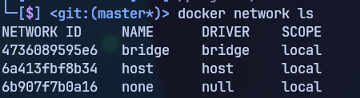

И после инспектинга сети `docker inspect 4736089595e6` (либо `docker network inspect bridge`) можно обнаружить, что в ней находятся оба наших контейнера. Обоим контейнерам были выданы ip из 17ой подсети под местами 0.2 и 0.3

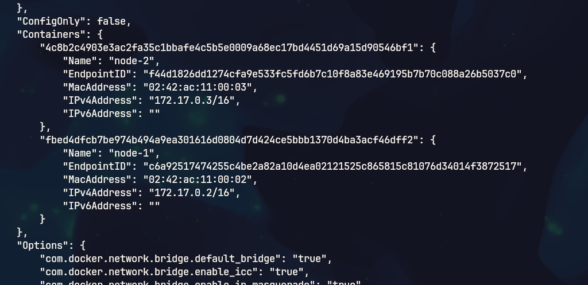

Далее заходим в контейнер `docker exec it <контейнер> sh` и пытаемся достучаться по ip к другому контейнеру через curl. В ответ мы получаем eh0 ip адрес контейнера.

Оба наших контейнера дефолтно положились в bridge сеть, которую создал docker.

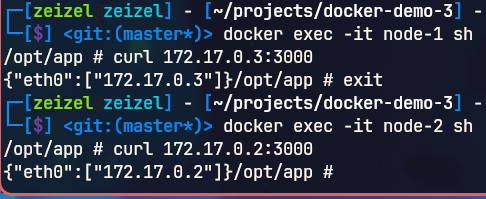

И далее мы хотим сделать так, чтобы контейнер к контейнеру могли обращаться по имени контейнера.

Для начала создадим сеть и добавим в неё наши контейнеры:

```bash
# создаём сеть
docker network create my-b-network

# подключаем к ней интересующие нас контейнеры
docker network connect my-b-network node-1
docker network connect my-b-network node-2

# инспектим нашу сеть и проверяем наличие контейнеров
docker network inspect my-b-network
```

Контейнеры остаются в дефолтной bridge сети и добавляются дополнительно в нашу (воткнули ещё один ethernet в контейнеры). В нашей сети появляется возможность резолвить имена контейнеров и обращаться по ним к другому контейнеру, что даёт при curl такой вывод:

```bash
/opt/app # curl node-2:3000
{"eth0":["172.17.0.3"],"eth1":["172.18.0.3"]}
```

Так же мы сразу при создании контейнера можем указать нужный нетворк. В таком случае контейнер не попадёт в дефолтный bridge, а сразу полетит в my-b-network.

```bash
docker run --name node-3 --network my-b-network -d bridge:latest
```

Чтобы вывести порт контейнера наружу, нам нужно будет запустить контейнер с ключём `-p`, который прокинет на порт `хоста:контейнера` порт

```bash
docker run --name node-4 -p 3000:3000 --network my-b-network -d bridge:latest
```

Теперь мы можем себе позволить запустить curl с локалхоста прямо в нужный контейнер

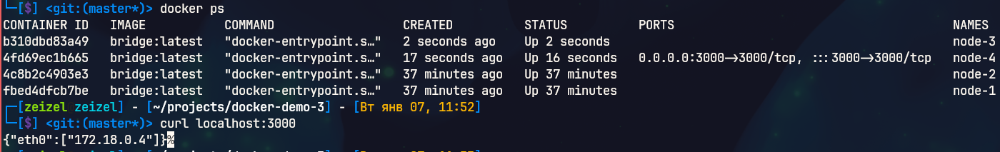

### Драйвера host и null

Host - это сеть, которая убирает абстракцию в виде docker-сетей и пробрасывает всю сеть из хостовой машины в докер-контейнер.

Зачастую такая сеть нужна, когда на нашем хосте стоит только одна программа - та же база данных. Под неё нет смысла возиться и выделять хосты.

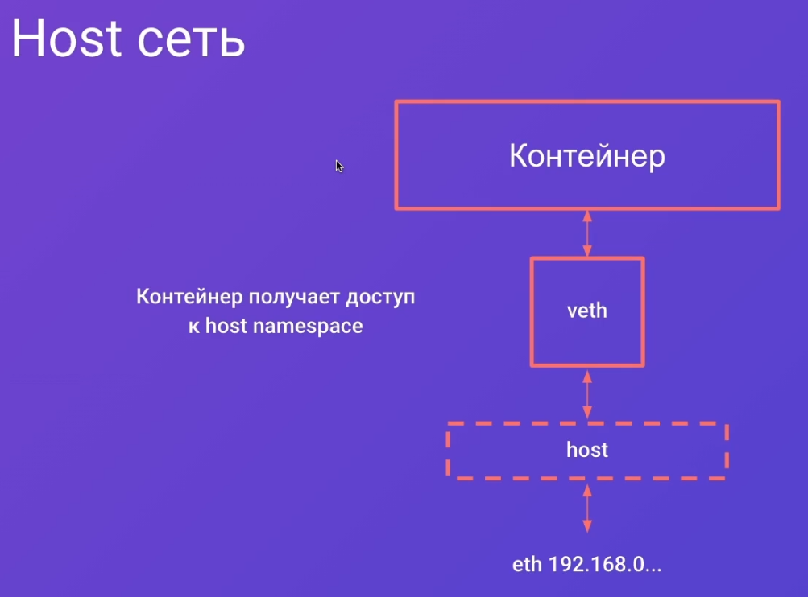

```bash
docker run --name node-6 --network host -d bridge:latest
```

И теперь мы можем спокойно курлиться сами в себя по нашему локальному ip, так как докер прокинул порт 3000 из контейнера прямо на хост

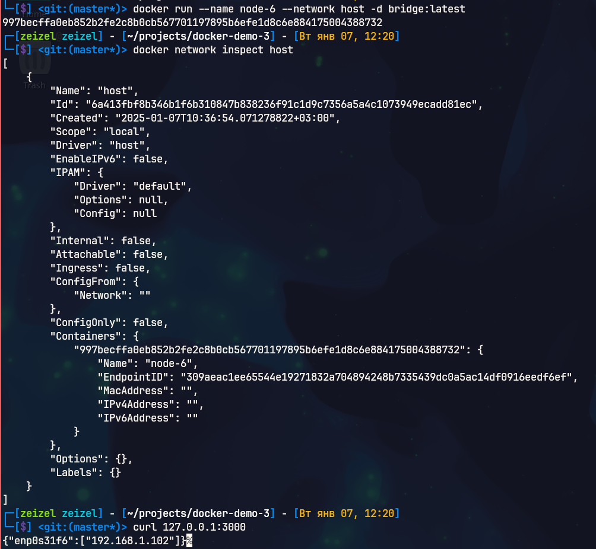

Null - это сеть, которая не предоставляет сетевого доступа.

Зачастую нужна, чтобы просто выполнять какие-то операции над файлами в машине. Выполняется Ad-hoc контейнер, который потом сразу убивается. Рабтает чисто за счёт данных с хост-машины, либо сам генерит какие-то данные.


```bash
docker run --name node-7 --network none -d bridge:latest
```

Эта сеть не имеет никаких подключений

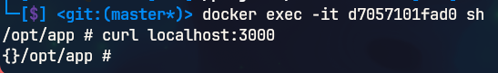

### DNS

DNS - это компьютерная распределённая система для получения информации о доменах. Чаще всего используется для получения ip-адреса по имени хоста.

Чтобы посмотреть адрес DNS у себя либо прямо внутри контейнера docker с alpine, можно чекнуть `/etc/resolv.conf` (обычно этот файл берётся с хостовой машины)

```bash
cat /etc/resolv.conf

# Generated by NetworkManager
nameserver 192.168.1.1
```

Но так же ничто не мешает нам запустить контейнер с кастомным dns

```bash
docker run --name node-9 --dns 8.8.8.8 -d bridge:latest
```

В итоге заменится тот самый `resolv.conf` и dns попадёт в него

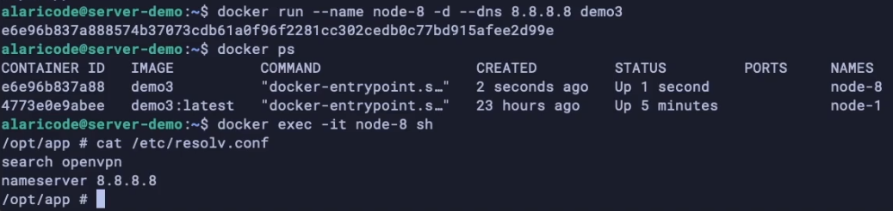

---

## Docker volumes

### Устройство и типы volumes

Volumes - это механизм, который позволяет ссылаться на данные с хостовой машины из контейнера

Мы можем столкнуться с такой проблемой, что при удалении docker-контейнера, мы так же удаляем и данные, которые были в этом контейнере, которые могут быть нам нужны.

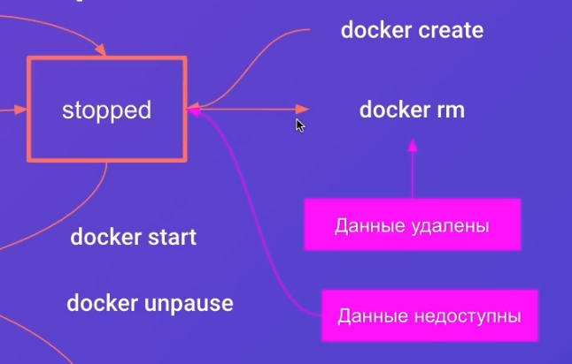

Первы способ - Volumes

Volumes в большинстве случаев используется локально (а не в том же swarm). Она представляет собой подключение области хостовой машины к контейнеру. То есть docker создаёт в своей специальной области директорию, которая биндится к папке на системе пользователя и постоянно обновляется.

Второй способ - Bind mounts

В таком случае мы подклоючаем файловую систему к контейнеру и он будет смотреть целиково на неё.

Третий способ - tmpfs

Создаёт быструю файловую систему и помещает её полностью в память нашего устройства.

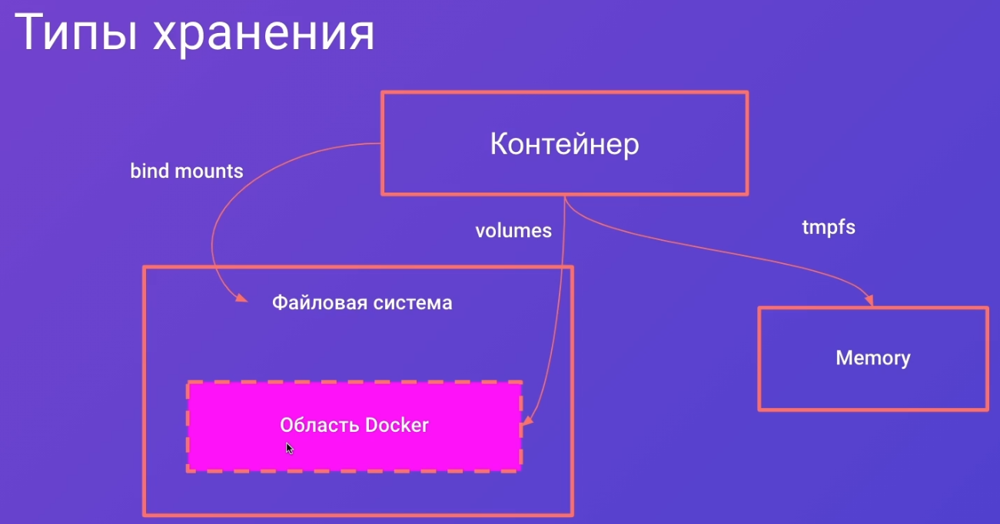

Для чего можно использовать volumes

- Персистентное хранение данных (статичное распределение данных по контейнерам из БД)
- Экспортирование логов (контейнер генерирует данные, которые читает уже другой контейнер)
- Передача конфигов в контейнер
- Share данных между контейнерами

### Использование volumes

Для примера напишем сервер, который будет считывать файлы в нашей папке с данными и возвращать их

`src / index.js`

```JS
const express = require("express");
const { writeFileSync, readFileSync } = require("fs");
const fse = require("fs-extra");

const app = express();
const port = 3000;

app.get("/set", async (request, response) => {
  await fse.ensureDir("data");
  writeFileSync("./data/req", request.query.id);
  response.send("done!");
});

app.get("/get", (request, response) => {
  const res = readFileSync("./data/req");
  response.send(res.toString());
});

app.listen(port, (err) => {
  if (err) {
    return console.log("something bad happened", err);
  }
  console.log(`server is listening on ${port}`);
});
```

Докерфайл выглядит следующим образом:

```Dockerfile
FROM node:14-alpine as build
WORKDIR /opt/app
ADD *.json ./
RUN npm install
ADD . .
CMD ["node", "./src/index.js"]
```

Программа выполняет следующие операции:

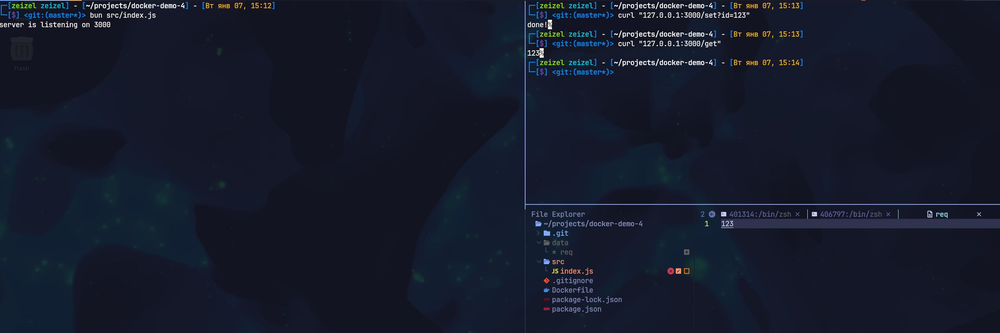

Далее попробуем создать с помощью команды `docker volume` новый volume для наших будущих данных.

Как можно увидеть, все данные для этого пространства располагаются в директории volumes

```bash
$ docker volume create demo
demo

$ docker volume ls
DRIVER    VOLUME NAME
local     demo

$ docker volume inspect demo
[
    {
        "CreatedAt": "2025-01-08T12:21:30+03:00",
        "Driver": "local",
        "Labels": null,
        "Mountpoint": "/var/lib/docker/volumes/demo/_data",
        "Name": "demo",
        "Options": null,
        "Scope": "local"
    }
]
```

Чтобы привязать контейнер докера к определённому пространству, нужно будет запустить следующую команду:

```bash
docker run --name volume-1 -d -v demo:/opt/app/data -p 3000:3000 demo4:latest
```

Когда мы привязываемся к пространству через `-v`, нам нужно указать через `пространство:путь_в_контейнере`, какие именно данные мы хотим связать из контейнера с нашей внешней папкой с данными на хосте. Путь в контейнере мы считаем от `WORKDIR /opt/app`, который мы указали как рабочую папку внутри контейнера. `data` непременно будет находиться в контейнере именно в `/opt/app/data`, так как у нас в проекте она располагается в `<project>/data`.

И теперь мы можем отправить запрос в докер и из пространства получить сразу данные, которые docker из контейнера положил на нашу хост-машину в `/var/lib/docker/volumes/demo/_data`. Все данные из `data` находятся тут, так как мы только их подцепили из докера.

```bash
$ curl "127.0.0.1:3000/set?id=1234"
done!%

$ curl "127.0.0.1:3000/get"
1234%

$ sudo cat /var/lib/docker/volumes/demo/_data/req
1234%
```

Если мы поднимем другой контейнер, но на порту 3001, который так же подцеплен под этот же volume и дёрнем из него запрос, то мы получим тот же самый вывод, так как оба сервера сейчас смотрят на одну и ту же хостовую директорию.

Если два контейнера подцеплены под один и тот же volume, то данные между этими двумя контейнерами будут шейриться.

```bash
$ docker run --name volume-2 -d -v demo:/opt/app/data -p 3001:3000 demo4:latest

$ curl "127.0.0.1:3001/get"
1234%
```

Чтобы удалить volume, нужно будет сначала удалить все связанные с ним контейнеры

```bash
$ docker rm $(docker ps -a -q) -f
8a6d2f71508f

$ docker volume rm demo
demo

$ sudo ls /var/lib/docker/volumes
backingFsBlockDev  metadata.db
```

Так же есть и альтернативная запись создания volumes через флаг `--mount`, где мы должны указать:

- type - тип пространства (volume / bind / tmpfs)
- src - исходный путь хост-машины
- dst - выходной путь контейнера

```bash
docker run --mount type=bind,src=<host-path>,dst=<container-path>
```

### VOLUME в Dockerfile

Так же мы можем напрямую в файле контейнера указать volume, который нам нужно будет подключить

```Dockerfile
FROM node:14-alpine AS build
WORKDIR /opt/app
ADD *.json ./
RUN npm install
ADD . .
VOLUME ["/opt/app/data"]
CMD ["node", "./src/index.js"]
```

После сборки и инспекции контейнера, тут так же можно будет увидеть место пространства и файлы, которые к нему подцеплены

```bash
$ docker build -t demo4:latest .

$ docker image inspect demo4:latest
"Volumes": {
	"/opt/app/data": {}
},
```

И теперь при создании контейнера, мы получаем сгенерированный volume со своим сложным хешем

```bash
$ docker volume ls
DRIVER    VOLUME NAME

$ docker run --name volume-3 -d -p 3000:3000 demo4

$ docker volume ls
DRIVER    VOLUME NAME
local     cb72c2cba4e40437...
```

Он так же будет хранить данные, как и созданный ранее именованный volume

```bash
$ curl "127.0.0.1:3000/set?id=1234"
done!%

$ sudo cat /var/lib/docker/volumes/cb72c2cba4e404379e2af659fa65a3ca495e0cade6aaa0df51718d5e42e45f4d/_data/req
1234%
```

Однако мы сталкиваемся с той проблемой, что при пересоздании контейнера, данные не будут биндиться и каждый раз будет создаваться новый volume, который будет занимать много места. Та же монга может просто два раза занять по 300 мб, вместо использования своего именованного участка.

Поэтому мы можем так же прибиндить наш контейнер к именованному volume.

```bash
$ docker run --name volume-4 -d -v demo:/opt/app/data -p 3000:3000 demo4
d7fdcdaa487eee48...

$ docker volume ls
DRIVER    VOLUME NAME
local     cb72c2cba4e40...
local     demo
```

Чтобы очистить неиспользуемые неименованные volume, мы можем почистить их через `prune`

```bash
$ docker volume prune
WARNING! This will remove anonymous local volumes not used by at least one container.
Are you sure you want to continue? [y/N] y
Deleted Volumes:
cb72c2cba4e404379e2af659fa65a3ca495e0cade6aaa0df51718d5e42e45f4d

Total reclaimed space: 4B
```

### Использование bind mounts

Bind mounts - это биндинг файловой системы в произвольную область нашего хоста (а не внутри докера)

Чтобы подцепить определённую область с нашего хоста, мы можем вместо задания имени volume указать путь на нашей машине и подцепить его под docker.

```bash
docker run --name volume-5 -d -v /home/zeizel/data:/opt/app/data -p 3000:3000 demo4
```

И теперь мы получаем текущую папку на нашей хостовой машине

```bash
$ curl "127.0.0.1:3000/set?id=1234"
done!%

$ cat ~/data/req
1234%
```

> [!question] Для чего это может быть нужно?
> Зачастую такое может понадобиться, когда мы хотим менять какую-нибудь конфигурацию внутри контейнера.

Подсовываем файл - bind mount
Работаем с БД - именованный volume

В списке volume этот тип пространств не появляется

### Использование tmpfs

TempFS - это хранение кусочка файловой системы прямо в память хоста.

В списке volume этот тип пространств так же не появляется

Используется для временного хранения куска данных вне слоя Docker (обычно приватных).

- Не работает в Swarm
- Нельзя шейрить между контейнерами
- Удаляются после остановки контейнера

Для запуска выделенной части данных из контейнера в ОЗУ достаточно указать флаг `--tmpfs` с указанием пути внутри контейнера

```bash
docker run --name volume-6 -d --tmpfs /opt/app/data -p 3000:3000 demo4
```

Вызываем команды программы - результат есть. После перезагрузки контейнера через `stop/start`, мы получаем ошибку, так как файл с данными пропал из оперативной памяти.

```bash
$ curl "127.0.0.1:3000/set?id=1234"
done!%

$ curl "127.0.0.1:3000/get"
1234%

$ docker stop volume-6
volume-6

$ docker start volume-6
volume-6

$ curl "127.0.0.1:3000/get"
<pre>Error: ENOENT: no such file or directory, open
```

Такой подход полезен для хранения секретов, но никак не подходит для персистентных данных.

### Копирование данных

Иногда нам нужно скопировать данные в контейнер без имения какого-либо volume. В этом случае нам поможет `docker cp <host_path> <container>:<container_path>`, который скопирует нам данные с хоста на контейнер.

Данная команда скопирует папку с хоста прямо в докер

```bash
docker cp /home/zeizel/data volume-9:/opt/app/data
```

Если нам нужно наоборот скопировать из контейнера на хост, то пишем команду в обратном порядке

```bash
$ docker cp volume-9:/opt/app/data ~/data
Successfully copied 2.56kB to /home/zeizel/data

$ cat ~/data/req
123
```

Если мы хотим скопировать только содержимое папки, то можно написать через `.`

```bash
docker cp volume-9:/opt/app/data/. ~/data
```

---

## Docker compose

### YAML

YAML (yaml ain't markup language) - это надмножество JSON, которое позволяет в более понятном формате писать людям конфиги

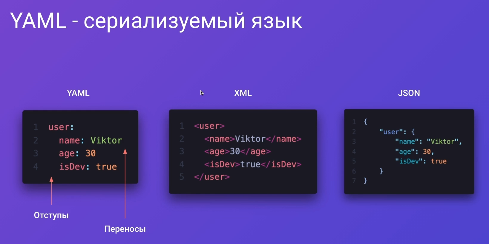

И так примерно мы можем заполнять файл:

`main.yml`

```YAML
# Строки
firstname: 'Olegov'
name: Oleg
surname: "Olegovich \n"

# Числа
version: 1.2.3
age: 23

# boolean
isDev: true
isTest: off # on
isProd: no # yes

# объект
user:
  name: Oleg
  age: 23

# список
users:
  - name: Oleg
    age: 24
  - name: Vera
    age: 22

# список значений
userList:
  - Oleg
  - Vera

# запись в виде массива
userNames: [Oleg, Vera, 1.2.3]

# YML является надмножеством над JSON поэтому такая запись тоже валидна
myObject: {
    "key": "value",
    string: 1.2.3
}

# так же мы можем писать многострочные строки
multiline: |
  Эта строка
  пойдёт на
  несколько
  строк.
  Вопросы?

# если нам нужно записать большую многострочную запись в виде одной строки, мы можем воспользоваться данной конструкцией
singleline: >
  Сколько бы тут не было текста,
  он всегда будет считаться одной строкой

# Такая черта позволит отделить одно описание ямла от другого (создаётся новое пространство имён)
---
name: Oleg
```

### Установка docker compose

Для установки достаточно повторить шаги из [документации](https://docs.docker.com/compose/install/linux/#install-the-plugin-manually). Желательно установить его отдельным плагином Docker, а не standalone.

```bash
docker compose --help
```

### Docker compose

Docker compose - это утилита, которая позволяет заранее описать всё нужное состояние контейнера и запустить его из под конфига

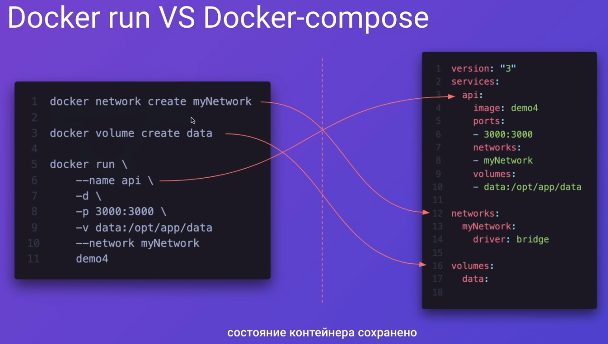

#### Конфигурация

- version - это описание версии текущего композа, фичи которого будут поддерживаться. Сейчас писать эту строку необязательно.
- services - это ключ описания сервисов, которые мы будем поднимать. Внутри него мы создаём объект с сервисами, в которых нужно будет указать параметры для запуска образов.
- networks - описание сетей, которые нужно создать или подключиться к ним
- volumes - описание пространств, которые нужно подготовить для сервисов

`docker-compose.yml`

```yaml
# версия compose
version: '3'

# описание сервисов
services:
  api: # сервис с именем api
    image: demo4 # наше изображение или из registry
    container_name: my-name # имя контейнера, которое не будет работать в swarm
    ports:
      - "3000:3000" # указание проброса портов
    networks:
      - servers # доступные сети
    volumes:
      - data:/opt/app/data # пространства с маппингом

# описание сетей, которые нужно будет создать
networks:
  servers:
    driver: bridge
# ЛИБО можно не создавать, а подключиться к существующей сети
networks:
  default:
    external: true
    name: servers

# описание пространств данных
volumes:
  data:
```

#### Команды

Далее мы можем одной командой поднять все сервисы, описанные в `docker-compose.yml`:

```bash
# поднимает текущий compose
docker compose up

# остановит текущий compose
docker compose stop

# стартанёт обратно текущий compose
docker compose start

# остановит и удалит неиспользуемые элементы (удалит контейнер и сеть, но оставит volume, так как он персистентен)
docker compose down
```

> [!important] Важно понимать, что команды compose - контекстозависимы!
> То есть все операции будут выполняться в первую очередь для текущей папки, опираясь на `docker-compose.yml`

Так же команды:

- restart - перезапуск
- pull / push - пулит и пушит image с registry
- port - выведет занятые порты
- logs - выведет логи из всех контейнеров. Может быть полезно, когда у нас запущены в `-d`.
- images - выведет список используемых образов
- top - покажет запущенные в текущий момент процессы

```bash
[$] docker compose up -d
[+] Running 1/1
 ✔ Container my-name  Started  0.2s

[$] docker compose top
my-name
UID    PID       PPID      C    STIME   TTY   TIME       CMD
root   1210000   1209978   1    18:55   ?     00:00:00   node ./src/index.js

[$] docker compose images
CONTAINER           REPOSITORY          TAG                 IMAGE ID            SIZE
my-name             demo4               latest              1fc568913222        122MB
```

Если нам нужно следить за логами поднятого через `-d` контейнера, нам нужно воспользоваться `-f`

```YML
docker compose logs <контейнер> -f
```

#### Заключение

docker compose - это удобный инструмент для оркестрирования сразу несколькими контейнерами. Он позволяет делать почти всё то же самое, что мы делали, когда собирали, запускали, останавливали и перезапускали образы самостоятельно.

### Оркестрация сервисов

Docker compose позволяет нам удобно оркестрировать множеством сервисов, которые будут подняты одновременно и взаимодействовать друг с другом по описанным нами правилами.

В примере будет использоваться монорепозиторий, где в apps будут находиться проекты: api, app, converter. Каждый из этих проектов содержит в себе Dockerfile, который all-in-one собирает в себе проект. Отдельно серверные сервисы общаются через rabbitmq, который нужно будет поднять отдельным docker-контейнером, чтобы происходило общение внутри compose.

- Здесь нам нужны volumes, так как через них мы будем добавлять `.env` файл в билд приложения. В рамках композа на одной ноде - это хороший вариант. Если мы будем поднимать в swarm, то там уже энвы распространяются через механизм секретов.
- Когда мы запускаем образ через `docker run`, мы можем передать через `-e ENV_NAME=value -e ENV_NAME_2=value_2` переменные окружения. Так же мы можем сделать и внутри compose ключом `environment`
- Для каждого сервиса обязательно нужно **указать либо build, либо image** из которых будет собираться проект. Image мы берём из registry нашей компании или dockerhub. Build принимает в себя множество параметров, основными из которых являются: context (область, которая будет использоваться для создания образа) и dockerfile (сам файл для сборки приложения).

`docker-compose.yml`

```yml
---
# описываем все сервисы
services:
  # сервис апишки
  api:
    container_name: api
	# указываем откуда будем собирать образ
    build:
      context: . # за контекст берём всю директорию проекта
      dockerfile: apps/api/Dockerfile # укаызваем путь до проекта в монорепе
    # перезапускаем всегда при падении
    restart: always
    # указываем путь до .env файла
    volumes: [./.env:/opt/app/.env]
    # укаызваем сеть, в которой будет находиться контейнер
    networks: [my-network]
    # образ зависим от RMQ и запустится уже после него
    depends_on: [rmq]
  app:
    container_name: app
    build:
      context: .
      dockerfile: apps/app/Dockerfile
    restart: always
    volumes: [./.env:/opt/app/.env]
    networks: [my-network]
  converter:
    container_name: converter
    build:
      context: .
      dockerfile: apps/converter/Dockerfile
    restart: always
    volumes: [./.env:/opt/app/.env]
    networks: [my-network]
    depends_on: [rmq]
  # сервис брокера сообщений между сервисами
  rmq:
	# указываем image из registry docker hub
    image: rabbitmq:3-management
    networks: [my-network]
    restart: always
	# передаём переменные окружения для входа
    environment:
	    - RABBITMQ_DEFAULT_USER=admin
	    - RABBITMQ_DEFAULT_PASS=admin

networks:
  my-network:
    driver: bridge

volumes:
  data:
```

После запуска, у нас поднимаются сразу все нужные сервисы

```bash
docker compose up
```

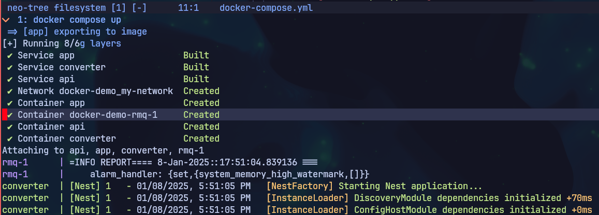

### Профили

Профили - это список в конфиге, котрый позволяет нам группировать контейнеры

```YML
---
services:
  api:
    container_name: api
    build:
      context: .
      dockerfile: apps/api/Dockerfile
    restart: always
    volumes: [./.env:/opt/app/.env]
    networks: [my-network]
    depends_on: [rmq]
    profiles: [backend]
```

Указание профилей позволит нам запускать только те сервисы, которые нам нужны из командной строки. То есть все backend сервисы поднимутся, когда мы укажем `--profile <профиль>`

> Важно указать флаги до `up`

```bash
$ docker compose --profile backend --profile frontend up

# либо можно вызывать нужные профили так
COMPOSE_PROFILES=backend,frontend docker compose up
```

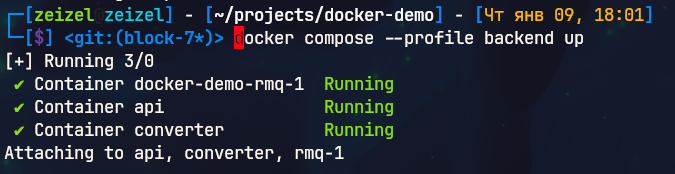

Так же мы можем поднять отдельно выбранный сервис. Поднимется только он и все остальные сервисы, которые мы указали в `depends_on`.

`run` вызывает профили неявно просто благодаря его запуску.

Такой подход может быть полезен, когда нам нужно запустить образы с какой-нибудь миграцией или отдельными скриптами с операциями.

```bash
docker compose run api
```

Однако, если у одного из контейнеров одного профиля есть зависимость из другого профиля, то мы столкнёмся с проблемой

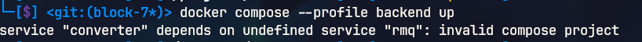

### Переменные окружения

Ко всему прямо внутри файла с конфигом композа, мы можем использовать переменные окружения. Вставлять их можно в строки через `'{$<переменная>}'` либо просто вставляя `$<переменная>`

```YML
services:
  api:
    container_name: '{$API_CONTAINER_NAME}'
    build:
      context: .
      dockerfile: apps/api/Dockerfile
    restart: always
    volumes: [./.env:/opt/app/.env]
    networks: [my-network]
    depends_on: [rmq]
    profiles: [backend]
```

Для этого дела создадим отдельный файл

`.env.compose`

```env
API_CONTAINER_NAME=api
```

И через флаг `--env-file` можно указать путь до энва, который будет использоваться для конфига.

Можно и не указывать флаг и тогда будет использоваться дефолтный файл `.env`.

```bash
docker compose --env-file .env.compose --profile backend up
```

Так же нужно указать возможность вызвать `docker compose config`, который позволяет нам взглянуть на итоговый конфиг, который попдаёт в композ и будет крутиться.

К нему нужно добавить `--env`, чтобы взглянуть на переменные, которые он подставит и обязательно указать `--profile`, если мы задали его для наших контейнеров

```bash
$ docker compose --env-file .env.compose --profile queue config

name: docker-demo
services:
  rmq:
    profiles:
      - queue
    environment:
      RABBITMQ_DEFAULT_PASS: admin
      RABBITMQ_DEFAULT_USER: admin
    image: rabbitmq:3-management
    networks:
      my-network: null
    restart: always
networks:
  my-network:
    name: docker-demo_my-network
    driver: bridge

```

Так же нужно отдельно упомянуть тот факт, что мы можем в сам контейнер передать переменные окружения не только через `environment`, но и через указания файла с энвами в ключе `env_file`

```YML
rmq:
    image: rabbitmq:3-management
    networks: [my-network]
    restart: always
    env_file: [.env.rmq]
    environment:
	    - RABBITMQ_DEFAULT_USER=admin
	    - RABBITMQ_DEFAULT_PASS=admin
    profiles: [queue]
```

Так же мы можем передать переменную окружения `COMPOSE_PROJECT_NAME`, которая заменит название проекта в билде композа с названия папки, в которой находится `docker-compose.yml` на наш, который мы задали

```bash
COMPOSE_PROJECT_NAME=mycompose docker compose --env-file .env.compose --profile backend --profile queue up
```

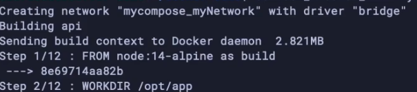

### Упражнение - Выкладываем полное приложение

Схема нашего прилоежния:

- на хосте запущен только браузер
- на иммитации сервера (virtualbox) располагается композ со всеми контейнерами
- браузер долбится по порту 3001 на порт 3001 сервера, а сервер выводит через 3001 порт фронта, который запущен в контейнере на 80 порту
- из браузерного клиента мы отправляем запрос в VB на порт 3002, порт 3002 на сервере смотрит на 3000 порт из контейнера
- API общается с RMQ
- RMQ передаёт сообщения между API и Converter
- API возвращает в браузер ответы, с которыми работает App фронта

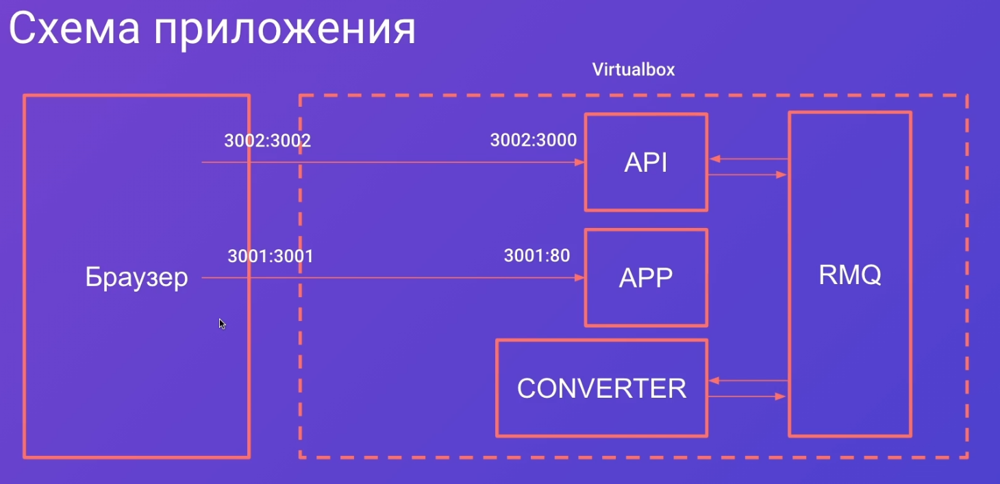

Нужно убедиться, что нужные [порты прокинуты](02%20Настройка%20VM%20на%20Linux.md) из нашей виртуалки на хост.

Далее описываем вслед за схемой все нужные порты для наших контейнеров. Для конвертера нам порты не нужны, потому что он общается только с нашим api, который находится в локальной сети.

`docker-compose.yml`

```YML
services:

  app:
    container_name: app
    build:
      context: .
      dockerfile: apps/app/Dockerfile
    restart: always
    ports: [3001:80]
    networks: [my-network]

  api:
    container_name: api
    build:
      context: .
      dockerfile: apps/api/Dockerfile
    restart: always
    ports: [3002:3000]
    volumes: [./.env:/opt/app/.env]
    networks: [my-network]
    depends_on: [rmq]

  converter:
    container_name: converter
    build:
      context: .
      dockerfile: apps/converter/Dockerfile
    restart: always
    volumes: [./.env:/opt/app/.env]
    networks: [my-network]
    depends_on: [rmq]

  rmq:
    image: rabbitmq:3-management
    networks: [my-network]
    restart: always
    env_file: [.env.rmq]
    environment:
	    - RABBITMQ_DEFAULT_USER=admin
	    - RABBITMQ_DEFAULT_PASS=admin

networks:
  my-network:
    driver: bridge

volumes:
  data:
```

### Shared конфигурации

Так же, когда нам требуется сделать разные `docker-compose.yml` для локальной разработки и деплоя, мы можем поделить нашу конфигурацию на несколько файлов.

#### Композиция из конфигов

И вот пример дополнения прошлого конфига, когда мы открываем порт для менеджер-панели RMQ

`docker-compose.dev.yml`

```YML
---
services:
  rmq:
    ports: [15672:15672]
```

Чтобы скомбинировать эти конфиги и запустить их вместе, нам нужно будет передать через `-f` все доступные наши конфиги

```bash
docker compose -f docker-compose.yml -f docker-compose.dev.yml up
```

#### Extend

Ну и так же мы можем напряму экстендиться от других файлов прямо в конфиге

Опишем конфиг сервиса в одном файле

`docker-compose.api.yml`

```YML
---
services:
  api:
    container_name: api
    build:
      context: .
      dockerfile: apps/api/Dockerfile
    restart: always
    ports: [3002:3000]
    volumes: [./.env:/opt/app/.env]
    networks: [my-network]
```

И заэкстендим этот конфиг из другого файла

`docker-compose.yml`

```YML
services:
  api:
    extends:
      file: docker-compose.api.yml
      service: api
    depends_on: [rmq]
```

> [!note] Экстендить ключ `depends_on` из другого файла - не получится
> Зависимости ищутся в оригинальном файле и, если они не разрезолвятся, мы обязательно получим ошибку отсутсвующей зависимости

#### Заключение

Такой подход с разбитием большого композа на подфайлы позволяет нам проще поддерживать конфигурацию и повышать её читаемость.

---

## Docker registry

### Работа docker-registry

Docker registry - это приложение, которое предоставляет API, с которым можно взаимодействовать для того, чтобы стянуть или положить на него образ.

Когда мы с нашей локальной машины (host) используем изображение для нашего образа без указанного registry, мы дефолтно обращаемся в dockerhub, где стягиваем (pull) по `<image>:<tag>` изображение к нам.

Когда к нашей конструкции образа `registry/image:tag` добавляется `registry`, мы добавляем указание, куда этот образ полетит при пуше и откуда стянется при пулле.

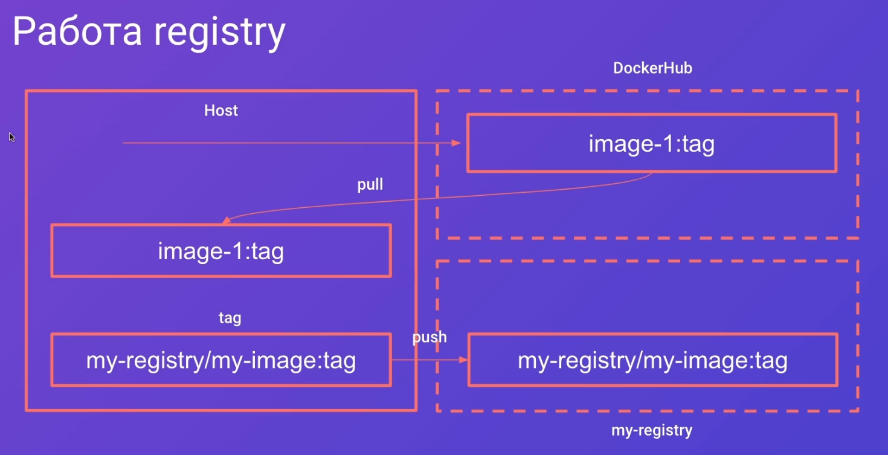

Чтобы опубликовать registry, мы можем:

- залить его на github (+ там имеется возможность залить приватно)
- залить на gitlab (на селфхост решении из коробки есть registry)
- залить на dockerhub
- развернуть registry локально

Сложности в локальном использовании заключаются в том, что нужно:

- покупать доменное имя либо настраивать его локально у себя самому
- иметь подписанные серты для домена

```bash
# запуллит определённый образ
docker pull <image>
# запушит определённый образ
docker push <image>
# тегнет определённый образ
docker tag <image> <tag>

# запуллит все образы, которые описаны в docker-compse.yml
docker compose pull
# опубликует описанные образы
docker compose push

# поиск образов по докерхабу
docker search --no-trunc <image>
```

### GitHub registry

#### Логин и пуллинг

Чтобы у docker была возможность работать с registry, нам нужно создать токен для GH с нужными привилегиями и сохранить его на компьютере

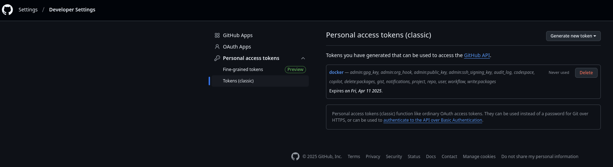

Сохраняем в любом месте хоста, где будет удобно дёрнуть токен

```bash
nvim ~/TOKEN.txt
```

Для авторизации используем вывод токена через pipe и передачу его в `login` докера с флагом `--password-stdin`, который принимает в себя pipe данные

```bash
cat ~/TOKEN.txt | docker login https://ghcr.io -u <github_username> --password-stdin
```

И теперь мы можем позволить себе спуллить из gh любой публичный образ либо наш приватный

```bash
$ docker pull ghcr.io/alaricode/top-api-demo/top-api-test:latest

latest: Pulling from alaricode/top-api-demo/top-api-test
ddad3d7c1e96: Downloading  785.6kB/2.816MB
f845e0f7d73a: Downloading  7.159MB/36.12MB
47d471c4d820: Downloading  801.9kB/2.24MB
1a88008f9c83: Waiting
f7a72abda4da: Waiting
6106deb0d93a: Waiting
0ef759e161b4: Waiting
0ea68650b52d: Waiting
```

#### Пуш

Далее нам нужно затегать наш образ по данной структуре, чтобы gh смог его в себя принять и сохранить

```bash
docker tag <image> ghcr.io/<gh_username>/<repo>/<image_name>:<tag>
```

```bash
docker tag docker-demo-api:latest ghcr.io/alaricode/top-api-demo/top-api-test:latest
docker push ghcr.io/alaricode/top-api-demo/top-api-test:latest
```

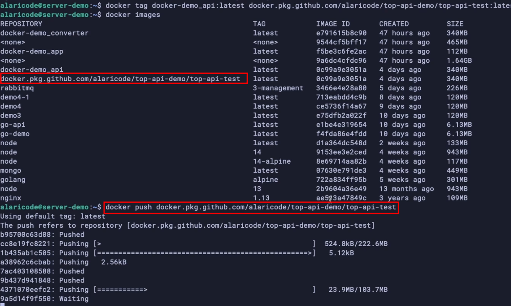

> [!note] Работа с другими registry аналогична той, что есть на гитхабе

### Поднимаем свой registry

[Дока](https://docker-docs.uclv.cu/registry/deploying/)

Преобразуем описанную команду из документации в docker-compse конфигурацию, чтобы быстрее и проще запускать registry

`docker-compse.yml`

```YML
services:
  registry:
    image: registry:2
    container_name: registry
    restart: always
    volumes: [data:/var/lib/registry]
    ports: [5000:5000]
volumes:
  data:
```

Далее нам нужно запустить registry, протегировать нужный нам образ и запушить его в тот же самый registry

> Тегирование образа обязательно проходит с указанием домена в начале образа

```bash
docker compose up -d
docker tag docker-demo-api:latest localhost:5000/api
docker push localhost:5000/api
```

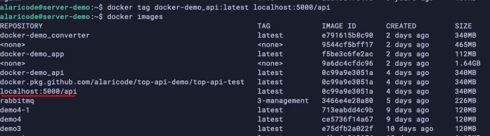

И теперь мы можем спокойно удалить образ с нашей локалки и подтянуть с нашего локально-развёрнутого registry

```bash
docker image rm localhost:5000/api
docker pull localhost:5000/api
```

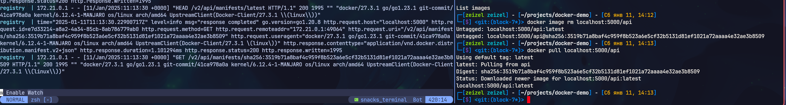

> [!warning] Категорически не стоит использовать в качестве наименования домена ip-адрес
> При переезде сервера, нужно будет так же прописывать старый ip-адрес, но если указать нормальный домен, то никаких подобных проблем не будет и все образы останутся на месте.

Куда больше действий придётся выполнить, когда мы будем работать с реальным доменом и придётся указать адрес, который будет разбирать балансировщик, серты и ключи

```bash
docker run -d \
  --restart=always \
  --name registry \
  -v "$(pwd)"/certs:/certs \
  -e REGISTRY_HTTP_ADDR=0.0.0.0:443 \
  -e REGISTRY_HTTP_TLS_CERTIFICATE=/certs/domain.crt \
  -e REGISTRY_HTTP_TLS_KEY=/certs/domain.key \
  -p 443:443 \
  registry:2
```

---

## Базовые понятия Ansible

#Ansible

Ansible - это утилита для автоматиизации выполнения скриптов.

### Задачи Ansible

Для чего нам нужно его использовать:

1. **Автоматиизирует повторяющиеся задачи**. Сразу позволяет выполнить все нужные операции на большом количестве машин.
2. **Автоматизирует сложные задачи**. Позволяет повторять сложные задачи раз за разом без совершения определённых ошибок.
3. **Поддерживает IAC концепцию** (инфраструктура как код).

Какие задачи он решает:

1. Отметает человеческий фактор при исполнении скриптов.
2. Решает проблему недостатка прозрачности настроек и документации
3. Устраняет сложность повторения определённой операции
4. Экономит кучу времени
5. Повышает переносимость решения

Какие плюсы именно Ansible:

1. Нет доп ПО на сервере - только python
2. Можно легко дописывать свои модули
3. Низкий порог вхождения
4. Возможность интеграции API через AWX (через который можно настроить автоматическое выполнение скриптов и scheduling)

### Схема работы Ansible

1. **YML-конфиг** (то, что мы выполняем). Описывает то состояние, к которому нам нужно привести сервера. Тут мы описываем последовательно состояние, к которому мы должны привести систему.
2. **Инвентарь** (на чём выполняем). Это модуль. Описывает все сервера, их состояния, как к ним подключаться, под какими пользователями выполнять операции, ip и переменные.
3. **Ansible**. Он уже приводит сервера к описанному ранее состоянию.
    1. Первым делом, он собирает **факты о серверах**. Подключается / не подключается, тип ОС, происходит первичный коннект.
    2. **Сборка конфигов с серверов**.
    3. Подключение плагинов
    4. Подключение модулей
4. **Транспиляция YAML в python и исполнение кода**. Все конфигурации разбираются на одной хостовой машине в самом Ansible.


Системы автоматизации обычно делятся на pull и push. Pull требуют наличия агента на серверах, чтобы проверять изменения и подтягивают исполняемый конфиг сами в себя. Push уже требуют, чтобы мы сами запихнули конфиг на сервер, чтобы тот выполнился. Второй вариант является более удобным, так как не требует на сервере никакого дополнительного ПО и агентов.

Когда мы используем Ansible на том же Ubuntu сервере (на котором уже есть python) нам не нужно ничего устанавливать кроме ssh, который позволит исполнять нам удалённо скрипты.

Модули и плагины - это подключаемые к Ansible куски кода.
Сами отличия:

| Модули                      | Плагины                    |
| --------------------------- | -------------------------- |
| Выполняются на клиентах     | Выполняются на host-машине |
| Выполняются при подключении | Выполняются до подключения |

### Установка

Через любой пакетный мендежер (включая `pip`)

```bash
brew install ansible

# Или

sudo [apt|dnf|pacman] install ansible
```

### Inventory

Инвентарь - это описание всех хостов и серверов, на которых будут исполняться команды Ansible и playbooks.

Написать конфиг инвентаря можно с помощью менее многословного `.ini` либо через `.yml`

Когда мы указываем домены `[group]` в квадратных скобках, то мы можем исполнять скрипты на целых группах доменов. Такие группы можно, например, использовать для установки nginx на множество серверов.

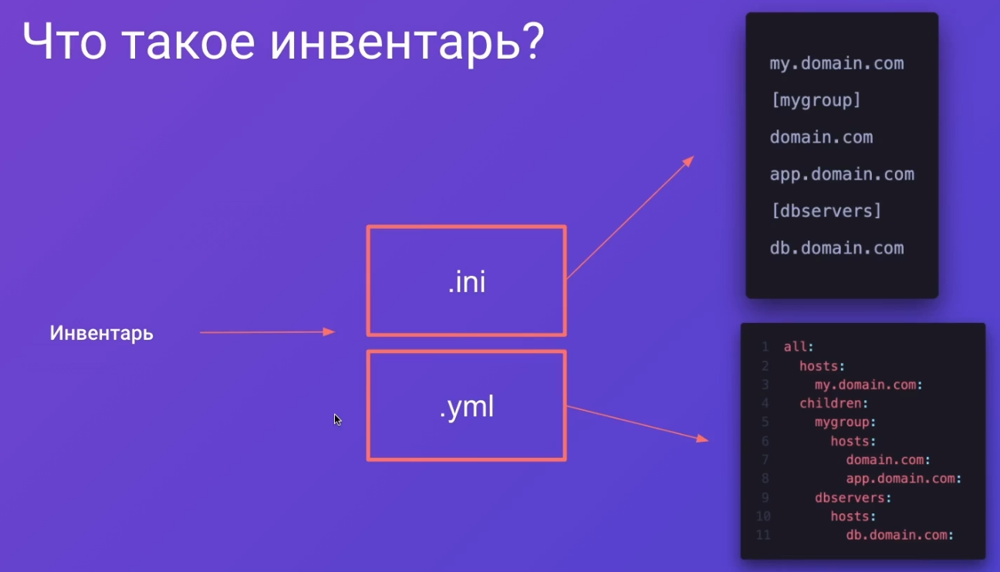

Так же мы можем:

1. Если у машины есть порядковые номера, то можно указать период
2. Можем использовать определённые переменные
3. Так же можно для сервера без названия указать алиас, к которому будет удобно обращаться (так на третьем примере сервер будет называться `coolhost`, а не `192.68...`)

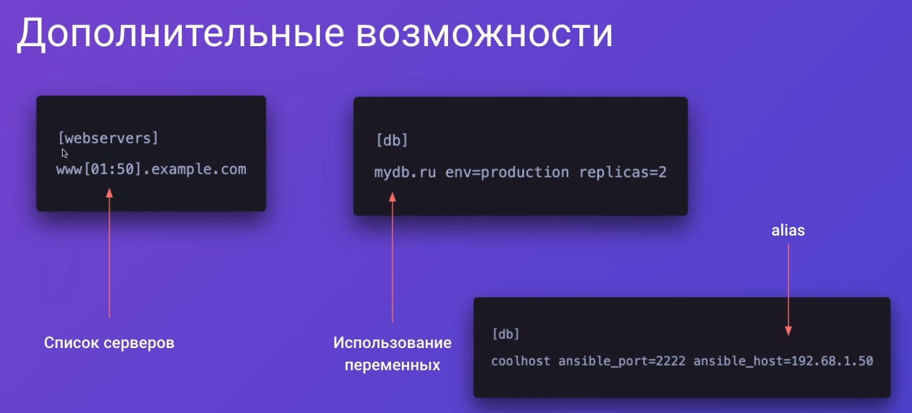

4. Так же можно спокойно указать переменные для группы через `[group:vars]`

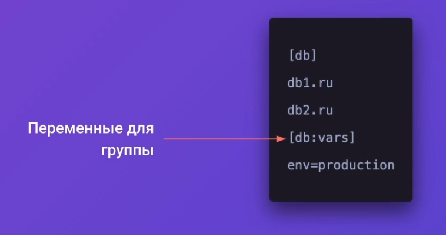

Параметры подключения к хосту состоят из 4ёх блоков:

1. Параметры подключения `ansible_`
    - `connection` - ssh / sftp / scp
    - `host` - имя хоста, к которому подключаемся
    - `port` - порт (тут может понадобится кастомный ssh-порт не 22, а 2222)
    - `user` - имя пользователя
    - `password` - пароль. Используется, если не заданы ssh-ключи для подключения.
2. Параметры ssh / scp / sftp
    - `private_key_file` - путь к приватному ключу, но дефолтно используется файл в `.ssh`
    - `common_args` - общие аргументы для всех типов подключения
    - `extra_args` - дополнительные аргументы
    - `pipelining` - ограничение количества ssh-подключений (чтобы не открывать 100 подключений одновременно)
    - `executable` - дополнительная настройка выполнения
3. Привилегии (применение команды из под sudo)
    - become - нужно ли выполнять от sudo
    - method - метод перехода (su/sudo)
    - exe, flags - настраивает поведение перехода к sudo
4. Настройки shell
    - `shell_type` - выбор shell (bash/zsh)
    - интерпретатор питона
    - екзекутер скрипта

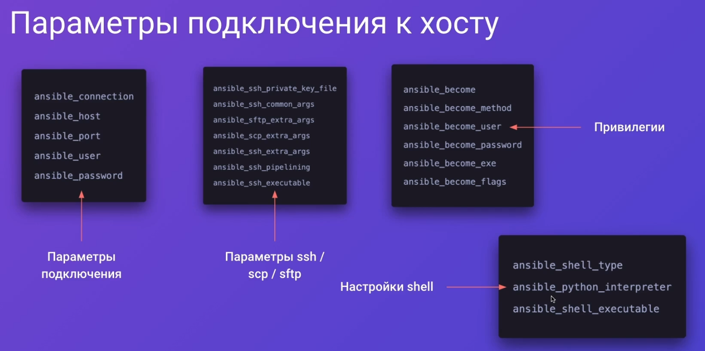

Напишем файл инвентаря нашего клиента. Тут мы описали сервер, который крутится у нас на localhost и подключаемся к нему по заданному пользователю. Порт другой, чтобы не занимать наш корневой ssh.

`hosts.ini`

```
[demo]
127.0.0.1 ansible_user=zeizel ansible_port=2222
```

Далее через `-i` указываем путь к инвентарю и дёргаем модуль `ping` из ansible по всей группе доменов `demo`

```bash
ansible -i hosts.ini -m ping demo
```

И далее нам прилетел ответ с сервера (на котором у нас стоял python, чтобы триггернуть эту операцию)

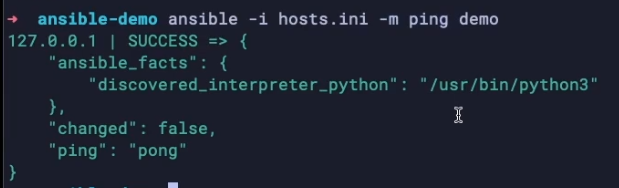

### Modules

Модули - это отдельные блоки кода, которые можно использовать для выполнения команд на хостах и сбора возвращаемых значений.

- `service` - поднимает сервис
- `command` - выполняет команду в shell

```bash
# пример использования модуля service и передачи в него аргументов -a
ansible webservers -m service -a "name=httpd state=started"

# указание модуля -m и аргументов -a
ansible webservers -m command -a "/sbin/reboot -t now"
```

Генерирует документацию

```bash
ansible-doc user
```

### Ad-hoc

Ad-hoc - это команда для быстрого выполнения скрипта, которую мы не хотим сохранять для дальнейшего использования.

Используется для:

- быстрых фиксов (например, упал сервер)
- для получения информации с сервера
- для тестирования отдельных команд

Это аналог `docker run -it sh`, когда мы напрямую попадаем в крутящийся докер и выполняем в нём команды.

Ad-hoc команда выглядит следующим образом:

- инвентарь
- модуль - только один в ad-hoc
- аргументы
- указание хостов (all / ip / группа)

Текущая команда создаст определённого пользователя по `name` на всех хостах

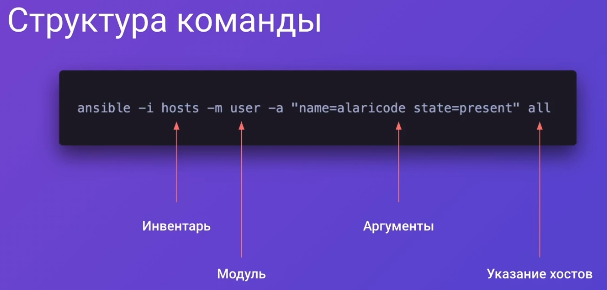

Теперь, после выполнения команды, мы знаем, что пользователь представлен на сервере.

У нас есть несколько типов вывода:

1. Success - Зелёный - операция ничего не изменила
2. Changed - Жёлтый - операция что-то изменила
3. Failed - Красный - операция не выполнена

```bash
➜ ansible -i hosts -m user -a "name=zeizel state=present" localhost

localhost | SUCCESS => {
    "append": false,
    "changed": false,
    "comment": ",,,",
    "group": 1000,
    "home": "/home/zeizel",
    "move_home": false,
    "name": "zeizel",
    "shell": "/usr/bin/zsh",
    "state": "present",
    "uid": 1000
}

```

Чтобы операция выполнилась от sudo, добаляем `become` через `-b` и запрашиваем интерактивно пароль через `-K`. Это первый способ использования sudo.

```bash
➜ ansible -m user -a "name=zeizel state=present" -b -K localhost

BECOME password:
localhost | SUCCESS => {
    "append": false,
    "changed": false,
    "comment": ",,,",
    "group": 1000,
    "home": "/home/zeizel",
    "move_home": false,
    "name": "zeizel",
    "shell": "/usr/bin/zsh",
    "state": "present",
    "uid": 1000
}

```

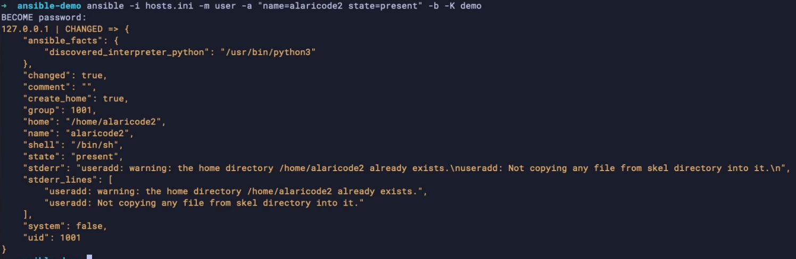

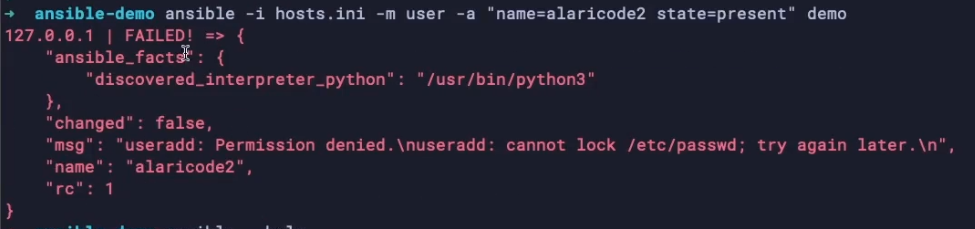

Ну и поменяв параметр на absent мы удаляем пользователя из системы (потому что тут мы декларативно управляем пользователями системы)

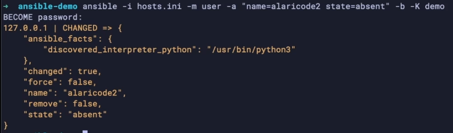

Второй способ - параметры. Так же вместо ключей мы можем просто передать всё параметрами через `-e`

```bash
ansible -i hosts -m user -a "name=zeizel state=absent" -e "ansible_become=true ansible_become_password=123" demo
```

Так же можно пойти третьим способом и выполнить операцию от sudo, передав все параметры сразу в инвентарь.

> [!warning] Это нерекоммендуемый способ, так как в инвентарь класть секретные данные - плохо!
> Положить ip, алиас - это норм. Но работать с паролем и командами - это задача отдельного домена.

`hosts.ini`

```
[demo]
127.0.0.1 ansible_user=zeizel ansible_port=2222 ansible_become=true ansible_become_password=123
```

И дёрнуть

```bash
ansible -i hosts -m user -a "name=zeizel state=absent" demo
```

---

## Ansible playbooks

### Playbook

Ansible Playbook - это описание конфигурации, оркестрации или выкладки. Оно описывает состояние удалённой системы или шаги отдельного процесса.

Это самодокументируемая последовательность операций, которая описана в скрипте. Она сохранятся на компьютере и может повторяться из раза  в раз на всех связанных устройствах.

- `name` - имя плейбука
- `hosts` - машины, на которых должны будут выполниться команды
- `tasks` - это набор ad-hoc команд. В них передаются те же самые параметры, что и в обычные команды ansible.

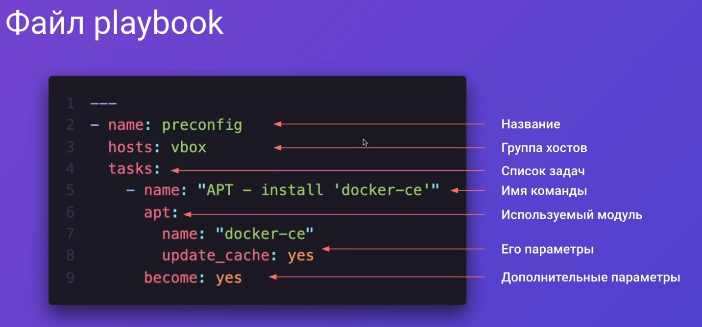

Если нужно запустить команду в том числе и локально, то можно добавить `ansible_connection=local`, чтобы все операции выполнить на нашем ПК

`hosts.ini`

```ini
[demo]
127.0.0.1 ansible_user=zeizel ansible_connection=local
```

А далее напишем скрипт playbook

- name - это имя выполняемой операции
- user - это модуль, который подтянется для выполнения команды

`user.yml`

```YML
---
- name: user
  hosts: demo
  tasks:
	- name: create user
	  become: true # предоставит возможность запросить sudo пароль
      user:
        name: zeizel
        state: present
```

И далее запускаем `ansible-playbook` команду. Добавляем `-K`, чтобы в случае чего запросить `sudo` пароль

```bash
ansible-playbook -i hosts.ini user.yml -K
```

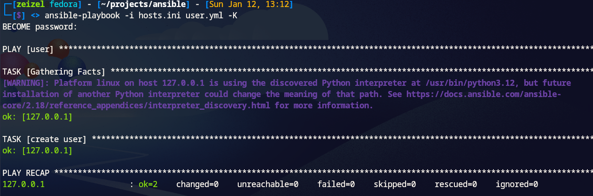

### Переменные

Переменные - это переиспользуемые величины в playbook

- переиспользуются в разных местах
- позволяет агрегировать конфиг в одном месте
- позволяет использовать различные значения для разных окружений и сервисов

В качестве переменных нельзя использовать:

- ключевые слова из python (async)
- зарезервированные слова playbook
- `*myvar` - wildcarts и спецсимволы в начале
- `my var` - пробелы
- `my-var` - дефисы
- `5my_var` - начинать с числа

#### Использование

Перменные можно задавать в: playbook, block, tasks, group_vars, host_vars, inventory, extra_vars

Мы можем задать переменные через ключ `vars` и использовать их через синтаксис `'{{ environment }}'`

##### Модуль

Запись переменной для модуля

```YML
---
- name: user
  hosts: demo
  tasks:
    - name: create user
      vars: # <- переменная модуля
        user: zeizel
      become: true
      user:
        name: '{{ user }}'
        state: present
```

##### Весь плейбук

И запись переменной для всего плейбука

```YML
---
- name: user
  hosts: demo
  vars: # <- переменная плейбука
		user: zeizel
  tasks:
    - name: create user
      become: true
      user:
        name: '{{ user }}'
        state: present
```

##### Задание переменной из промпта

Через `vars_prompt` мы можем указать, какие переменные нас должен попросить ввести playbook в процессе выполнения тасок

```yml
- name: user
  hosts: demo
  vars_prompt:
      - name: user # имя переменной
        prompt: 'Input user name' # выводимый лейбл для ввода переменной
        private: no # скрывать ли вводимое значение
  tasks:
      - name: create user
        become: true
        user:
            name: '{{ user }}'
            state: present
```

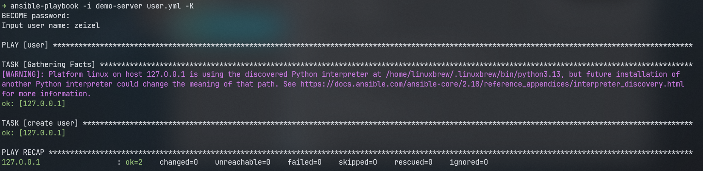

##### Из отдельного файла

Создаём отдельный файл чисто под переменные окружения

`user_vars.yml`

```yml
---
user: zeizel
```

Тут уже мы импортируем через поле `vars_files` список назначений с переменными окружения

```YML
---
- name: user
  hosts: demo
  vars_files: [./user_vars.yml]
  tasks:
    - name: create user
      become: true
      user:
        name: '{{ user }}'
        state: present

```

##### Неявно указание

Так же в ansible присутствует плагин, который неявно берёт переменные по различным группам данных

Вот базовый инвентарь

```ini
[demo]
127.0.0.1 ansible_user=zeizel ansible_connection=local
```

###### По названию группы из описанного инвентаря

1. Из инвентаря берём наименование группы `demo`
2. Создаём папку `group_vars`, в которую помещаем папку с группой и фиксированным именем `vars.yml`

`group_vars / demo / vars.yml`

```yml
---
user: zeizel
```

3. В файле playbook ничего указывать не нужно - просто используем переменную

```yml
---
- name: user
  hosts: demo
  tasks:
      - name: create user
        become: true
        user:
            name: '{{ user }}'
            state: present
```

###### По хостам

1. Из инвентаря берём наименование хоста (можно алиас, если есть) `127.0.0.1`
2. Создаём папку `host_vars`, в которой мы создаём ямл с именем хоста `127.0.0.1.yml`

`host_vars / 127.0.0.1.yml`

```yml
---
user: zeizel
```

3. И переменные так же работают без прямого импорта

##### Задавать переменные прямо в инвентаре

Так же переменная напрямую попадёт в playbook, если мы укажем её прямо в инвентаре

```ini
[demo]
127.0.0.1 ansible_user=zeizel ansible_connection=local user=zeizel
```

#### Объединение инвентарей

Так же ничто нам не мешает вместо одного инвентаря использовать сразу несколько, чтобы складывать большое количество хостов и данных по ним

Создадим папку `demo-server`, в которую поместим просто файл `demo`

`demo-server / demo`

```
[demo]
127.0.0.1 ansible_user=zeizel ansible_connection=local user=zeizel
```

И в качестве инвентаря указываем не отдельный файл, а всю папку целиком, где все инвентари из неё сконкатенируются в один

```bash
ansible-playbook -i demo-server user.yml -K
```

##### Установка переменных в группе инвентарей

При таком подходе, мы можем положить переменные прямо в ту же папку с инвентарём и не пихать их прямо в сам файл с хостами

`group_vars / all.yml`

```yml
---
user: zeizel
```

Получается примерно такая структура папок

```bash
.
├── demo-server
│   ├── group_vars
│   │   └── all.yml
│   └── hosts
└── user.yml
```

##### Установка переменных через extra-vars

Ну и передача переменных прямо в команде через флаг `--extra-vars`

```bash
ansible-playbook -i demo-server user.yml -K --extra-vars "user=zeizel"
```

#### Порядок переменных по приоритету

Переменные автоматически мёрджатся из разных источников. Применяются самые конкретно заданные переменные (группа < хост < роль < блок < таска)

`--extra-vars` - это самые приоритетные переменные из всех.

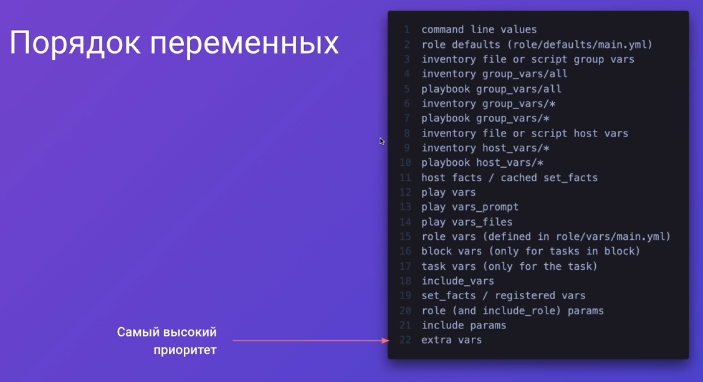

### Отладка

При написании любых скриптов, появляется необходимость дебажить код. 

В Ansible есть несколько способов дебага значений: 

#### Дебаг через плейбук

1. Нам нужно зарегистрировать вывод результатов таски через ключ `register` (грубо говоря, это создание переменной с результатом выполнения)
2. Создать таску, которая проинициализирует дебаг через `debug: var: <name>`

`user.yml`
```YML
---  
- name: user  
  hosts: local  
  tasks:  
    - name: create user  
      user:  
        name: '{{ user }}'  
        state: present  
      become: true  
      register: out  # <- регистрация дебага
    - debug: # <- инициализация дебага 
        var: out
```

Получаем дебаг-значения

```bash
•% ➜  ansible-playbook -i all-servers user.yml -K
BECOME password:

PLAY [user] *****************

TASK [Gathering Facts] *****************
[WARNING]: Host '127.0.0.1' is using the discovered Python interpreter at '/opt/homebrew/bin/python3.14', but future installation of another Python interpreter could cause a different interpreter to be discovered. See https://docs.ansible.com/ansible-core/2.20/reference_appendices/interpreter_discovery.html for more information.
ok: [127.0.0.1]

TASK [create user] ***************
ok: [127.0.0.1]

TASK [debug] ***************
ok: [127.0.0.1] => {
    "out": {
        "append": false,
        "changed": false,
        "comment": "zeizel",
        "failed": false,
        "group": 20,
        "home": "/Users/zeizel",
        "move_home": false,
        "name": "zeizel",
        "shell": "/bin/zsh",
        "state": "present",
        "uid": 501
    }
}

PLAY RECAP ****************
127.0.0.1                  : ok=3    changed=0    unreachable=0    failed=0    skipped=0    rescued=0    ignored=0
```

#### Debugger

Либо мы можем активировать дебаг-режим

Активируется он при включении поля `debugger` в плейбук со значчениями:

- `always` - дебаггер будет отрабатывать всегда
- `never` - никогда не будет отрабатывать
- `on_failed` - только при провале задания
- `on_unreachable` - когда хост недоступен
- `on_skipped` - когда задача пропускается

```YML
---  
- name: user  
  hosts: local  
  tasks:  
    - name: create user  
      user:  
        name: '{{ user }}'  
        state: present  
      become: true  
      debugger: always
```

Находясь в режиме дебага, мы получаем непосредственный доступ к данным текущей выполняемой операции

У нас в доступе появляются команды: 
- `p` - `print` - позволяет вывести определённое значение
- `r` - `retry` - повторит текущую задачу и вернёт в режим дебага (после того, как мы сделали изменения в шаге)
- `u` - полностью перезапустить таску с новыми переменными
- `c` - переходит на следующий шаг выполнения задачи

Доступные значения находятся в документации, но вот некоторые из них: 
- `task` - объект с текущей задачей
	- `name` - имя таски
	- `args` - аргументы запуска таски
	- `vars` - переменные таски
- `task_vars` - все переменные, которые попали в таску

```bash
•% ➜  ansible-playbook -i all-servers user.yml -K

BECOME password:

PLAY [user] ************

TASK [Gathering Facts] **********
[WARNING]: Host '127.0.0.1' is using the discovered Python interpreter at '/opt/homebrew/bin/python3.14', but future installation of another Python interpreter could cause a different interpreter to be discovered. See https://docs.ansible.com/ansible-core/2.20/reference_appendices/interpreter_discovery.html for more information.
ok: [127.0.0.1]

TASK [create user] ************
ok: [127.0.0.1]

[127.0.0.1] TASK: create user (debug)> p task
TASK: create user

[127.0.0.1] TASK: create user (debug)> p task.args
{'_ansible_check_mode': False,
 '_ansible_debug': False,
 '_ansible_diff': False,
 '_ansible_ignore_unknown_opts': False,
 '_ansible_keep_remote_files': False,
 '_ansible_module_name': 'user',
 '_ansible_no_log': False,
 '_ansible_remote_tmp': '~/.ansible/tmp',
 '_ansible_selinux_special_fs': ['fuse',
                                 'nfs',
                                 'vboxsf',
                                 'ramfs',
                                 '9p',
                                 'vfat'],
 '_ansible_shell_executable': '/bin/sh',
 '_ansible_socket': None,
 '_ansible_syslog_facility': 'LOG_USER',
 '_ansible_target_log_info': None,
 '_ansible_tmpdir': '/Users/zeizel/.ansible/tmp/ansible-tmp-1766230032.075149-16637-257421265470080/',
 '_ansible_tracebacks_for': [],
 '_ansible_verbosity': 0,
 '_ansible_version': '2.20.1',
 
 'name': 'zeizel',
 'state': 'present'}
 
[127.0.0.1] TASK: create user (debug)> p task_vars['inventory_hostname']
'127.0.0.1'
```

Так же мы можем напрямую менять значения во время исполнения и повторить операцию `r`, чтобы увидеть, что она выполнилась с изменённым значением

```bash
[127.0.0.1] TASK: create user (debug)> task.args['name']='asdasd'
[127.0.0.1] TASK: create user (debug)> r
changed: [127.0.0.1]

[127.0.0.1] TASK: create user (debug)> task.args['name']='zeizel'
[127.0.0.1] TASK: create user (debug)> r
ok: [127.0.0.1]
```

И далее нам остаётся продолжать выполняемые шаги таски через `c`. А в самом конце можем полностью проверить проходку по всем операциям с нашими новыми переменными через `u`.

>[!info] Такой интерактивный режим очень полезен, так как у нас появляется возможность в моменте настроить нужное значение, повторить операцию и сразу убедиться - прошла она правильно или нет.

### Блоки и отработка ошибок

Все выполняемые задачи и обработку ошибок мы можем сгруппировать в блоки в рамках Ansible и задать одинаковые параметры для них

#### Блоки

Все таски мы можем сгруппировать в `block` для провайда общих параметров

```YML
---  
- name: user  
  hosts: local  
  tasks:  
    - name: Preconfig block  
      become: true  
      block:   
		- name: create user  
		  user:  
			name: '{{ user }}'  
			state: present   
		- name: install curl  
		  apt:  
			name: curl  
			update_cache: yes
```

#### Обработка ошибок

Обработка ошибок происходит с помощью ключа `rescue`. В нём мы должны описать действие, которое должно выполниться, если произойдёт ошибка: откатить сервер, удалить пользователя. 

В ключе `always` мы должны описать то, что должно будет происходить всегда (после ошибки или успешного выполнения тасок). Например, перезагрузка сервера.


##### `rescue` и `always`

Опишем поля `rescue` и `always`. Они представляют собой просто таски, которые будут выполняться.  

```YML
---  
- name: user  
  hosts: local  
  tasks:  
    - name: Preconfig block  
      become: true  
      block:  
        - name: create user  
          register: error  
          user:  
            name: '{{ user }}'  
            state: present  
        - name: install curl  
          register: error  
          apt:  
            name: curl  
            update_cache: yes
      # выполнится при ошибке таски  
      rescue:  
        - name: Error print  
          debug:  
            var: error  
      # этот блок будет выполняться всегда после ошибки или успеха  
      always:  
        - name: Rebooting  
          debug:  
            msg: 'Rebooting pc...'
```

##### Обработка нестандартных ошибок

Так же мы можем обработать ошибку, которая не является классической ошибкой (exit_code !== 0) и определить самим условия ошибки

Поле `failed_when` позволит нам проверить в данном случае, что строка FAILED находится в поле `stdout` объекта `echo_failed`

```YML
---  
- name: user  
  hosts: local  
  tasks:  
    - name: Preconfig block  
      become: true  
      block:  
        - name: create user  
          register: error  
          user:  
            name: '{{ user }}'  
            state: present  
        - name: install curl  
          register: error  
          apt:  
            name: curl  
            update_cache: yes  
        - name: failed on FAILED  
          command: echo "FAILED"  
          register: echo_failed  
          # если в поле stdout переменной echo_failed есть FAILED, то таска выполнилась с ошибкой  
          failed_when: "'FAILED' in echo_failed.stdout"  
      rescue:  
        - name: Error print  
          debug:  
            var: error  
      always:  
        - name: Rebooting  
          debug:  
            msg: 'Rebooting pc...'
```

#### Работа с условиями

Так же мы можем добавить условий в наш блок для выполнения задач:

- `any_errors_fatal` - любая произошедшая ошибка будет валить все дальнейшие таски
- `ignore_errors` - позволяет проигнорировать ошибку в таске

Ключ `when` - самый многофункциональный блок. В нём мы можем пользоваться `register` переменными, фактами, которые собирает ansible и выполнять по условию блоки операций. 
В данном примере мы выполним операцию только тогда, когда нашей целевой системой будет Ubuntu 

```YML
---  
- name: user  
  hosts: local  
  any_errors_fatal: true # любая ошибка будет предотвращать выполнение ansible  
  tasks:  
    - name: Preconfig block  
      become: true  
      when: ansible_facts['distribution'] == 'Ubuntu'  
      block:  
        - name: create user  
          register: error  
          ignore_errors: yes # игнорирование ошибки  
          user:  
            name: '{{ user }}'  
            state: present  
        - name: install curl  
          register: error  
          apt:  
            name: curl  
            update_cache: yes  
        - name: failed on FAILED  
          command: echo "FAILED"  
          register: echo_failed  
          # если в поле stdout переменной echo_failed есть FAILED, то таска выполнилась с ошибкой  
          failed_when: "'FAILED' in echo_failed.stdout"  
      # выполнится при ошибке таски  
      rescue:  
        - name: Error print  
          debug:  
            var: error  
      # этот блок будет выполняться всегда после ошибки или успеха  
      always:  
        - name: Rebooting  
          debug:  
            msg: 'Rebooting pc...'
```

Теперь, так как текущая система не Ubuntu, то все таски в блоке скипаются

```bash
•% ➜  ansible-playbook -i all-servers user.yml -K
BECOME password:

PLAY [user] *********

TASK [Gathering Facts] *********
[WARNING]: Host '127.0.0.1' is using the discovered Python interpreter at '/opt/homebrew/bin/python3.14', but future installation of another Python interpreter could cause a different interpreter to be discovered. See https://docs.ansible.com/ansible-core/2.20/reference_appendices/interpreter_discovery.html for more information.
ok: [127.0.0.1]

TASK [create user] ************
skipping: [127.0.0.1]

TASK [install curl] **********
skipping: [127.0.0.1]

TASK [failed on FAILED] *************************
skipping: [127.0.0.1]

TASK [Rebooting] *******************
skipping: [127.0.0.1]

PLAY RECAP ***********
127.0.0.1                  : ok=1    changed=0    unreachable=0    failed=0    skipped=4    rescued=0    ignored=0

```

### Асинхронные задачи

Очень часто бывает так, что операций над серверами может быть достаточно много. Так же эти операции могут выполняться длительное время. Но не всегда все эти операции нам нужно дожидаться и ускорить этот процесс можно распараллелив задачи. 

Ansible предоставляет нам возможность асинхронно выполнять задачи без ожидания других тасок. 

Для реализации асинхронности, у нас есть ключи:

- `async` - время, которое максимально должна выполняться таска.
- `poll` - время, раз в которое нужно будет проверять выполнение операции. Если установлено в 0, то следующая операция начнёт выполняться незамедлительно, пока выполняется прошлая. 

>[!warning] Если нам нужно в дальнейшей таске отловить выполнение старой асинхронной таски, то нам нужно будет выполнять эти операции под одним юзером


#### Ожидание асинхронной операции

Описание асинхронной операции с таймаутом в 100 секунд (async) и периодом проверки в 5 секунд (poll)

```YML
- name: user  
  hosts: local  
  tasks:  
    - name: Preconfig block  
      become: true  
      block:  
        - name: sleep  
          command: /bin/sleep 10  
          async: 100  
          poll: 5  
        - name: echo  
          command: echo "DONE"
```

Ansible сначала будет ожидать длительную операцию и только потом выполнит вторую таску echo

```bash
$ ansible-playbook -i all-servers user.yml -K

BECOME password:

PLAY [user] *************

TASK [Gathering Facts] **********
[WARNING]: Host '127.0.0.1' is using the discovered Python interpreter at '/opt/homebrew/bin/python3.14', but future installation of another Python interpreter could cause a different interpreter to be discovered. See https://docs.ansible.com/ansible-core/2.20/reference_appendices/interpreter_discovery.html for more information.
ok: [127.0.0.1]

TASK [sleep] ***********
ASYNC POLL on 127.0.0.1: jid=j592691861136.57376 started=True finished=False
ASYNC OK on 127.0.0.1: jid=j592691861136.57376
changed: [127.0.0.1]

TASK [echo] *********
changed: [127.0.0.1]

PLAY RECAP *********
127.0.0.1                  : ok=3    changed=2    unreachable=0    failed=0    skipped=0    rescued=0    ignored=0
```

#### Параллельные асинхронные таски

Для создания параллельно выполняемых тасок, нам нужно:
1. `poll` установить в 0 секунд (отключить проверку)
2. в таске, которая ждёт результата выполнения предыдущей таски, нужно отследить статус асинхронности `async_status`
	1. в `async_status` указать `jid` (job id) задачи, от которой зависим
3. зарегистрировать текущую таску `register`
4. Ожидать `until` выполнение текущей таски `job_result.finished`
5. проверять `retries` выполнение операции с задержкой `delay`

```YML
---  
- name: user  
  hosts: local  
  tasks:  
    - name: Preconfig block  
      become: true  
      block:  
        - name: sleep  
          command: /bin/sleep 10  
          async: 100  
          poll: 0  
          register: sleep  
        - debug:  
            var: sleep  
        - name: echo  
          command: echo "DONE"  
    - name: check sleep status  
      # цепляем job id из асинхронной таски  
      async_status:  
        jid: '{{ sleep.ansible_job_id }}'  
      # регистрируем джобу и ожидаем её выполнения  
      register: job_result  
      until: job_result.finished  
      retries: 100 # повторных попыток  
      delay: 1 # задержка между retries  
      become: true
```

В итоге у нас сначала стартануло выполнение таски `sleep` и сразу за ней `debug` и `echo`. После них стартанул `check sleep status`, который ждал выполнения таски `sleep`

```bash
$ ansible-playbook -i all-servers user.yml -K

BECOME password:

PLAY [user] *****

TASK [Gathering Facts] ********
[WARNING]: Host '127.0.0.1' is using the discovered Python interpreter at '/opt/homebrew/bin/python3.14', but future installation of another Python interpreter could cause a different interpreter to be discovered. See https://docs.ansible.com/ansible-core/2.20/reference_appendices/interpreter_discovery.html for more information.
ok: [127.0.0.1]

TASK [sleep] *******
changed: [127.0.0.1]

TASK [debug] *********
ok: [127.0.0.1] => {
    "sleep": {
        "ansible_job_id": "j990495658061.63641",
        "changed": true,
        "failed": false,
        "finished": false,
        "results_file": "/var/root/.ansible_async/j990495658061.63641",
        "started": true
    }
}

TASK [echo] *******
changed: [127.0.0.1]

TASK [check sleep status] *****
FAILED - RETRYING: [127.0.0.1]: check sleep status (100 retries left).
FAILED - RETRYING: [127.0.0.1]: check sleep status (99 retries left).
FAILED - RETRYING: [127.0.0.1]: check sleep status (98 retries left).
FAILED - RETRYING: [127.0.0.1]: check sleep status (97 retries left).
FAILED - RETRYING: [127.0.0.1]: check sleep status (96 retries left).
FAILED - RETRYING: [127.0.0.1]: check sleep status (95 retries left).
FAILED - RETRYING: [127.0.0.1]: check sleep status (94 retries left).
FAILED - RETRYING: [127.0.0.1]: check sleep status (93 retries left).
changed: [127.0.0.1]

PLAY RECAP *************
127.0.0.1                  : ok=5    changed=3    unreachable=0    failed=0    skipped=0    rescued=0    ignored=0
```

#### Исключительные операции

Некоторые операции в рамках Ansible просто невозможно выполнить без указания асинхронности операции. Например, reboot сервера - тут обязательно операцию нужно сделать асинхронной, потому что от команды `reboot` нет внятного результата.

```YML
---  
- name: user  
  hosts: local  
  tasks:  
    - name: Preconfig block  
      become: true  
      block:  
        - name: reboot  
          command: reboot  
          async: 100  
          poll: 0
```

Но для бОльшей части таких операций уже есть свой модуль (в т.ч. reboot модуль), которые: 
- более многофункциональны
- легче читаются
- проще в поддержке

Так же для ожидания результата другой таски стоит использовать builtin модуль в Ansible - `wait_for`

### Упражнение - Настройка сервера

Установка докера будет происходить в несколько этапов. 

В качестве референса будут выступать:

- [Официальная документация по установке докера на Ubuntu](https://docs.docker.com/engine/install/ubuntu/)
- [Установка докера в группу и запуск без sudo](https://docs.docker.com/engine/install/linux-postinstall/)

`config.yml`

```YML
---
- name: Preconfig
  hosts: home
  tasks:
    - name: Install Docker Engine on Ubuntu
      become: true
      block:
	    # удаление конфликтующих пакетов
        - name: Remove conflicting Docker packages
          ignore_errors: true
          apt:
            state: absent
            purge: true
            name:
              - docker.io
              - docker-compose
              - docker-compose-v2
              - docker-doc
              - podman-docker
              - containerd
              - runc

	    # добавление универсального репозитория
        - name: Add universe repo
          apt_repository:
            # в качестве целевой системы с учётом версии, мы берём ansible_distribution_release
            repo: "deb http://us.archive.ubuntu.com/ubuntu/ {{ ansible_distribution_release }} universe"
            state: present

	    # установка требуемых пакетов для docker
        - name: Install required packages
          apt:
            update_cache: true
            cache_valid_time: 86400
            name:
              - ca-certificates
              - curl
              - gnupg
              - lsb-release

	    # создание директории ключей
        - name: Create /etc/apt/keyrings directory
          file:
            path: /etc/apt/keyrings
            state: directory
            mode: "0755"

	    # добавление официальных GPG ключей
        - name: Add Docker official GPG key
          apt_key:
            url: https://download.docker.com/linux/ubuntu/gpg
            state: present

	    # добавление репозитория
        - name: Add Docker apt repository
          copy:
            dest: /etc/apt/sources.list.d/docker.sources
            mode: "0644"
            content: |
              Types: deb
              URIs: https://download.docker.com/linux/ubuntu
              Suites: {{ ansible_lsb.codename | default(ansible_distribution_release) }}
              Components: stable
              Signed-By: /etc/apt/keyrings/docker.asc

	    # обновление кэша
        - name: Update apt cache
          apt:
            update_cache: true

	    # установка docker пакетов
        - name: Install Docker Engine and components
          apt:
            name:
              - docker-ce
              - docker-ce-cli
              - containerd.io
              - docker-buildx-plugin
              - docker-compose-plugin
            state: present

	    # запуск сервиса Docker
        - name: Ensure Docker service is enabled and started
          service:
            name: docker
            state: started
            enabled: true

	# установка python docker SDK
    - name: Install Python Docker SDK
      become: true
      pip:
        name: docker

	# блок задач после установки
    - name: Post-install Docker
      become: true
      block:
        - name: Ensure docker group exists
          group:
            name: docker
            state: present

        - name: Add current user to docker group
          user:
            name: "{{ ansible_user | default(ansible_env.SUDO_USER) }}"
            groups: docker
            append: true

        - name: Reboot to apply docker group membership
          when: docker_reboot | default(true)
          reboot:
            msg: "Rebooting to apply docker group membership"
            connect_timeout: 5
            reboot_timeout: 600


```

Запуск конфига на сервере

```bash
ansible-playbook -i demo-server config.yml -K
```

#### Получение последней версии пакета с Github

У Github есть удобное публичное API для работы с репозиториями. 

Если перед нами встанет такая ситуация, что нам нужно динамически получить последнюю версию пакета, то мы можем перейти на страницу релизов репозитория:

`https://github.com/docker/compose/releases`


И трансформировать ссылку в такой род:

`https://api.github.com/repos/docker/compose/releases/latest`


Где можно будет найти поле `tag_name`

И если нам нужно будет вставить определённую версию какой-либо библиотеки (или последнюю), то можно курлануть данные, записать их в регистр и переиспользовать в следующей таске

```YML
- name: Установка Docker-compose  
  block:  
    - name: Получение последней версии Docker-compose  
      uri:  
        url: https://api.github.com/repos/docker/compose/releases/latest  
        body_format: json  
      register: page  
  
    - name: Установка Docker-compose  
      get_url:  
        url: "https://github.com/docker/compose/releases/download/{{ page.json.tag_name }}/docker-compose-Linux-x86_64"  
        dest: /usr/local/bin/docker-compose  
        mode: 0755  
  become: true
```

### Ansible Lint

Для поддержания стандарта качества кода нашего конфига состояний и скриптов Ansible, мы можем использовать линтер. 

Как самую распространённую ошибку, можно выделить использование `command` вместо специализированного модуля, который позволит декларативно описать состояние, к которому должна прийти система после выполнения задачи.

#### Ansible lint

Устанавливается линтер отдельным пакетом

```bash
brew install ansible-lint
```

Далее останется только запустить проверку файла и ansible подсветит все возможные исправления для нашего конфига, чтобы стандартизировать его и улучшить

```bash
$ ansible-lint config.yml
/opt/homebrew/Cellar/python@3.14/3.14.2/Frameworks/Python.framework/Versions/3.14/lib/python3.14/tempfile.py:484: ResourceWarning: Implicitly cleaning up <HTTPError 304: 'Not Modified'>
  _warnings.warn(self.warn_message, ResourceWarning)
WARNING  Listing 15 violation(s) that are fatal
ignore-errors: Use failed_when and specify error conditions instead of using ignore_errors.
config.yml:8 Task/Handler: Remove conflicting Docker packages

fqcn[action-core]: Use FQCN for builtin module actions (apt).
config.yml:10:11 Use `ansible.builtin.apt` or `ansible.legacy.apt` instead.

fqcn[action-core]: Use FQCN for builtin module actions (apt_repository).
config.yml:23:11 Use `ansible.builtin.apt_repository` or `ansible.legacy.apt_repository` instead.

fqcn[action-core]: Use FQCN for builtin module actions (apt).
config.yml:29:11 Use `ansible.builtin.apt` or `ansible.legacy.apt` instead.

fqcn[action-core]: Use FQCN for builtin module actions (file).
config.yml:39:11 Use `ansible.builtin.file` or `ansible.legacy.file` instead.

fqcn[action-core]: Use FQCN for builtin module actions (apt_key).
config.yml:45:11 Use `ansible.builtin.apt_key` or `ansible.legacy.apt_key` instead.

fqcn[action-core]: Use FQCN for builtin module actions (copy).
config.yml:50:11 Use `ansible.builtin.copy` or `ansible.legacy.copy` instead.

fqcn[action-core]: Use FQCN for builtin module actions (apt).
config.yml:61:11 Use `ansible.builtin.apt` or `ansible.legacy.apt` instead.

fqcn[action-core]: Use FQCN for builtin module actions (apt).
config.yml:65:11 Use `ansible.builtin.apt` or `ansible.legacy.apt` instead.

fqcn[action-core]: Use FQCN for builtin module actions (service).
config.yml:75:11 Use `ansible.builtin.service` or `ansible.legacy.service` instead.

fqcn[action-core]: Use FQCN for builtin module actions (pip).
config.yml:82:7 Use `ansible.builtin.pip` or `ansible.legacy.pip` instead.

fqcn[action-core]: Use FQCN for builtin module actions (group).
config.yml:89:11 Use `ansible.builtin.group` or `ansible.legacy.group` instead.

fqcn[action-core]: Use FQCN for builtin module actions (user).
config.yml:94:11 Use `ansible.builtin.user` or `ansible.legacy.user` instead.

fqcn[action-core]: Use FQCN for builtin module actions (reboot).
config.yml:101:11 Use `ansible.builtin.reboot` or `ansible.legacy.reboot` instead.

yaml[empty-lines]: Too many blank lines (1 > 0)
config.yml:105

Read documentation for instructions on how to ignore specific rule violations.

# Rule Violation Summary

  1 yaml profile:basic tags:formatting,yaml
  1 ignore-errors profile:basic tags:unpredictability
 13 fqcn profile:basic tags:formatting

Failed: 15 failure(s), 0 warning(s) in 1 files processed of 1 encountered. Last profile that met the validation criteria was 'min'.
```

#### Pre-commit

Для добавления pre-commit хуков, которые не дадут нам возможности закоммитить и отправить ansible конфигурацию с ошибками, нам нужно сначала установить `pre-commit`

```bash
brew install pre-commit
```

Далее инициализируем его в проекте

```bash
pre-commit install
```

А теперь добавляем `.yaml` конфигурацию в проект

`.pre-commit-config.yaml`
```YML
---  
ci:  
  autoupdate_schedule: monthly  
repos:  
  - repo: https://github.com/ansible-community/ansible-lint.git  
    rev: v25.12.1 # подставляем версию из репозитория
    hooks:  
      - id: ansible-lint  
        files: \.(yaml|yml)$  
        additional_dependencies:  
          - ansible
```


---

## Развёртка машин с Vagrant

### Установка

Установка могла бы быть простейшей, если бы vagrant не заблокировали установку для России.

Если использовать ВПН, то так:

```bash
brew tap hashicorp/tap
brew install hashicorp/tap/vagrant
```

Если нет, то нужно будет устанавливать способами под определённые дистры из [доки](https://developer.hashicorp.com/vagrant/install)

Чтобы была возможность поднять Vagrant, нам нужно добавить в начало `Vagrantfile` энву с селфхост сервером:

```bash
ENV['VAGRANT_SERVER_URL'] = 'https://vagrant.elab.pro'
```

Скачать последнюю версию Vagrant мы можем из репозиториев [Yandex](https://hashicorp-releases.yandexcloud.net/vagrant/) или [Mail.ru](https://hashicorp-releases.mcs.mail.ru/vagrant/)

> [!warning] Vagrant поддерживает только определённые версии VB, поэтому лучше всего скачивать их последние версии, чтобы не было проблем с совместимостью!

### Развёртка машин

Генерируем RSA ключ на нашей машине

```bash
ssh-keygen -t rsa
```

Конфиг vagrant написан на [Ruby](../../backend/Ruby.md)

`Vagrantfile`

```ruby
# миррор вагранта
ENV['VAGRANT_SERVER_URL'] = 'https://vagrant.elab.pro'

# конфигурация для второй версии
Vagrant.configure("2") do |config|
    # повторяется 5 раз, чтобы поднять 5 машин
	(1..5).each do |i|
        # выполнение команд для сервера под индексом (web - переменная конфига, которую мы именуем сами)
		config.vm.define "server#{i}" do |web|
            # box - это конкретная виртуалка, которую нужно развернуть
			web.vm.box = "ubuntu/focal64"
            # пробрасываем порты (хост порты 2223, 2224... на гостевой 22)
			web.vm.network "forwarded_port", id: "ssh", host: 2222 + i, guest: 22
            # порт для кластера
			web.vm.network "private_network", ip: "10.11.10.#{i}", virtualbox__intnet: true
            # именуем хост
            web.vm.hostname = "server#{i}"

            # открываем шелл, чтобы установить ssh-ключи
			web.vm.provision "shell" do |s|
                # путь к публичному ключу
				ssh_pub_key = File.readlines("#{Dir.home}/.ssh/id_rsa.pub").first.strip
                # вставляем ssh-ключ в vagrant (он используется тут как дефолтный пользователь удалённой машины)
				s.inline = <<-SHELL
				echo #{ssh_pub_key} >> /home/vagrant/.ssh/authorized_keys
				echo #{ssh_pub_key} >> /root/.ssh/authorized_keys
				SHELL
			end

            # подключаемся к провайдеру virtualbox, чтобы поднять 5 машин на убунте
			web.vm.provider "virtualbox" do |v|
				v.name = "server#{i}"
                # выделяем 2 гига озу
				v.memory = 2048
                # и по одному процессору
				v.cpus = 1
			end
		end
	end
end
```

И поднимаем всё окружение виртуальных машин следующей командой

```bash
vagrant up
```

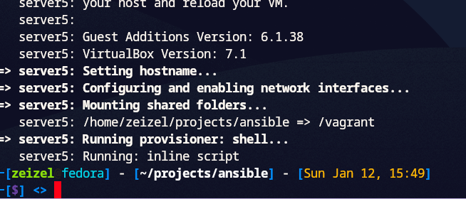

> [!seealso] Если мы поднимаем вагрант из под WSL, то нам нужно:
>
> 1. Хранить папку проекта на диске c Windows (не в директории linux `~/`)
> 2. Разрешить Vagrant обращаться к Windows из под WSL через: `export VAGRANT_WSL_ENABLE_WINDOWS_ACCESS="1"`

> [!attention] Если выходит эта ошибка, то нужно удалить папку `.vagrant`
> The VirtualBox VM was created with a user that doesn't match the current user running Vagrant. VirtualBox requires that the same user be used to manage the VM that was created. Please re-run Vagrant with that user. This is not a Vagrant issue. The UID used to create the VM was: 1000 Your UID is: 0

Теперь мы можем подключиться к любому нашему серверу

```bash
ssh vagrant@127.0.0.1 -p 2223
```

> [!note] желательно сразу подключиться к каждому серверу и прописать `yes` при подключении к ssh

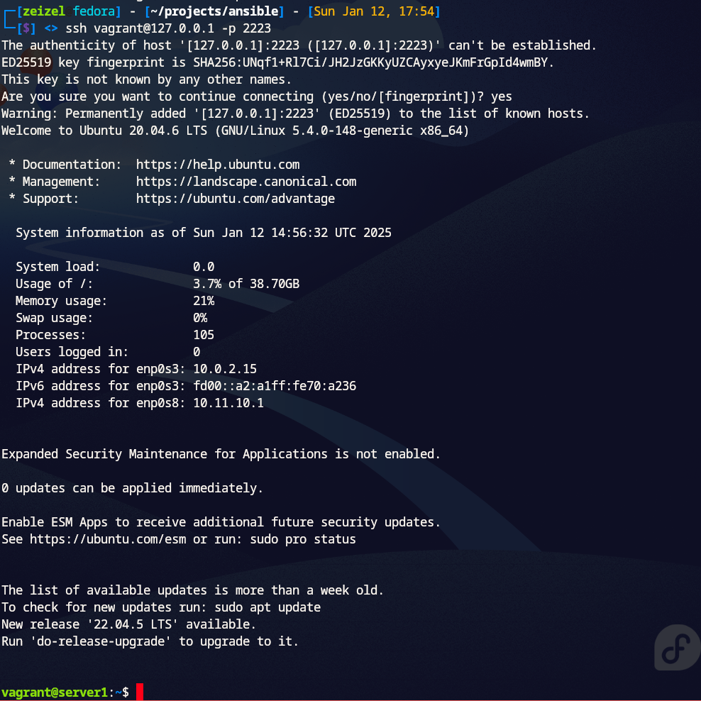

#### Troubleshooting

##### Отклонение подключения

Так же подключение может быть отклонено, если есть мусор в файле хостов Для решения проблем, нужно перейти в указанный файл

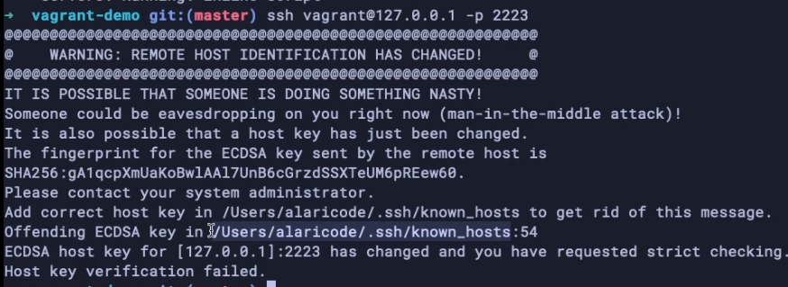

И удалить эти строки подключений к серверам

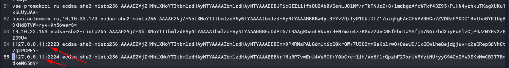

##### У меня Arm

Самый лёгкий способ - это найти в [поисковике боксов](https://portal.cloud.hashicorp.com/vagrant/discover?architectures=arm64&query=ubuntu) для вагранта нужный образ, например, `bento/ubuntu-24.04` и в `web.vm.box` использовать его


### Подготовка серверов

Обновляем инвентарь нашими серверами, поднятыми вагрантом

`inventory / cluster`

```ini
[cluster]  
server1 ansible_host=127.0.0.1 ansible_user=vagrant ansible_port=2223  
server2 ansible_host=127.0.0.1 ansible_user=vagrant ansible_port=2224  
server3 ansible_host=127.0.0.1 ansible_user=vagrant ansible_port=2225  
server4 ansible_host=127.0.0.1 ansible_user=vagrant ansible_port=2226  
server5 ansible_host=127.0.0.1 ansible_user=vagrant ansible_port=2227
```

И в плейбуке поменять имя хостов

`config.yml`

```YML
---  
- name: Preconfig  
  hosts: cluster  
  tasks:
```

И запускаем наш плейбук

```bash
ansible-playbook -i inventory config.yml -K
```


---

## Docker Swarm


## Ansible - продвинутые темы


## Deploy приложения на кластер


---

## Troubleshooting

[Setup VM's Ubuntu](https://gist.github.com/anupkrbid/e894af7df2d43a4e253fc252251dd7fe)

### Установка Docker на виртуальную машину на MacOS

```bash
# 1. Удалим текущий GPG-ключ и источник
sudo rm -f /etc/apt/keyrings/docker.gpg
sudo rm -f /etc/apt/sources.list.d/docker.list

# 2. Установим GPG-ключ заново
sudo mkdir -p /etc/apt/keyrings
curl -fsSL https://download.docker.com/linux/ubuntu/gpg | \
    sudo gpg --dearmor -o /etc/apt/keyrings/docker.gpg
sudo chmod a+r /etc/apt/keyrings/docker.gpg

# 3. Добавим репозиторий как `jammy` (вместо noble!)
echo \
  "deb [arch=$(dpkg --print-architecture) \
  signed-by=/etc/apt/keyrings/docker.gpg] \
  https://download.docker.com/linux/ubuntu jammy stable" | \
  sudo tee /etc/apt/sources.list.d/docker.list > /dev/null

# 4. Обновим apt и установим Docker
sudo apt update
sudo apt install -y docker-ce docker-ce-cli containerd.io \
                    docker-buildx-plugin docker-compose-plugin
```

```bash
sudo systemctl start docker
```

```bash
sudo systemctl enable docker
```
