---
tags:
  - typescript
  - javascript
  - decorators
  - generics
  - infer
  - tsconfig
---

## Введение

#### Основные проблемы JavaScript:

1. Отсутствие Type Safety: Невозможность проверки корректности типов данных, что ведет к ошибкам.
2. Динамические типы: Возможность выполнять операции с разными типами данных без явного преобразования.
3. Отсутствие автокомплита: IDE предоставляют недостаточную поддержку для JavaScript, ограничивая помощь при написании кода.
4. Сложности с рефакторингом: Изменения в коде могут влечь за собой множество неожиданных ошибок из-за динамической типизации.
5. Невозможность понять структуру данных: Работать со структурами данных и понимать их структуру без явного указания типов бывает сложно.

#### Примеры проблем JS

- Отсутствие проверки существования переменных во время компиляции.
- Ошибки из-за неправильного использования типов данных.
- Сложности в работе с объектами и методами без указания их структуры.


#### Почему TypeScript:

- **TypeScript** - это надмножество JavaScript, разрабатываемое Microsoft.
- Предлагает строгую типизацию, улучшая безопасность и качество кода.
- Упрощает рефакторинг и повышает читаемость кода, предоставляя автокомплит и поддержку IDE.
- Поддержка TypeScript широко распространена среди фреймворков и библиотек (Angular, React, Node.js и др.)

#### Преимущества использования TypeScript:

- Улучшенный процесс разработки благодаря типам данных и поддержке в IDE.
- Возможность быстрого и безопасного рефакторинга.
- Легкость в поддержке и расширении кодовой базы приложений.
- Высокая популярность и поддержка в современных фреймворках.
- Возможность использования в разработке полноценных front-end и back-end приложений.


#### Поддержка и Интеграция:

TypeScript полностью совместим с JavaScript и поддерживается всеми современными инструментами разработки.

Применяется TS во всех JS-технологиях, включая: веб-фронтенд (Angular, React), серверный бэкенд (Node.js, Next.js), мобильные приложения (React Native) и другие.


---
## Основные типы

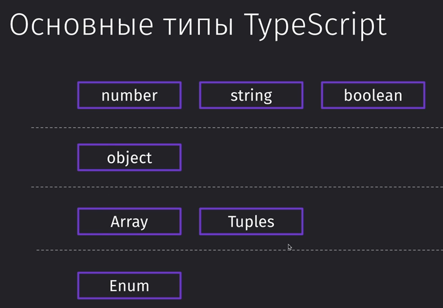

### Подготовка проекта

Команды для подключения и запуска ТСки:

```bash
npm i -g typescript // устанавливаем ТС глобально

mkdir ts // создание папки с именем «ts»

cd ts // переход в данную папку

tsc --init // инициализация ТС в нашем проекте (пока находимся в нём)
```

И с помощью команды `tsc` мы будем компилировать наш ТС-файл в нативный JS


### Использование типов

Собственно, запись различных типов на примере нативного JS

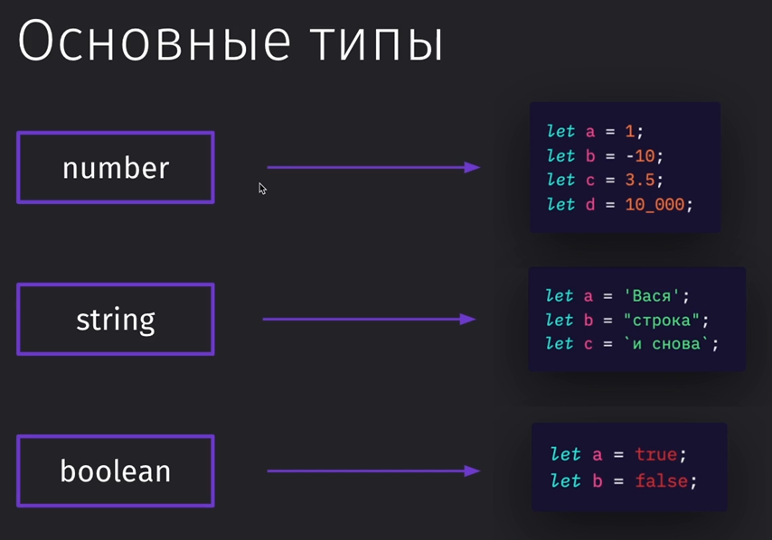

И, как можно увидеть, так как ТС – это надстройка, то и писать можно в нём спокойно по правилам JS

`tsc` – сначала всегда компиляция

`node app.js` – запустит конкретный файл в консоли (запускаем только скомпилированный JS файл)

```TS
const salary = 1000;
const prem = 1500;

console.log(salary + prem);
```

Нативный JS так же позволяет нам сложить строку с числом и это приведёт к очевидной конкатенации строк, что нам не нужно

```TS
const salary: number = 1000;
const prem = "500";
let res = salary + prem; // 1000500

console.log(res);
```

Если в качестве результата укажем, что мы должны всегда получать число, то тут у нас встанет проблема, потому что одно из значений не является `number` и потому результат присваивается в строковую переменную


Если указать типы вообще всем переменным, то мы увидим, что ошибка находится уже на уровне создания самой переменной

```TS
const salary: number = 1000;
const prem: number = "500"; // error
let res: number = salary + prem;

console.log(res);
```

### Типы в функциях

Изначально мы обязаны писать типы для функции. По умолчанию компилятор предлагает нам устанавливать `any` на все переменные, которые мы не протипизировали 


Чтобы `any` стоял по умолчанию, мы можем в конфиге раскомментировать данную строку:

`tsconfig.json`
```JSON
"noImplicitAny": false
```

И теперь ошибок нет- мы можем не подписывать `any`

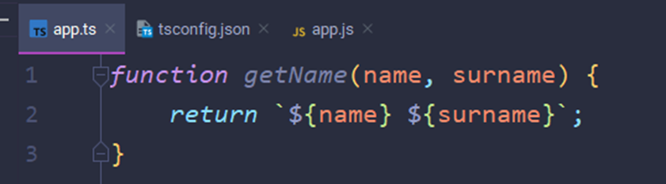

В обычной ситуации мы можем указать типы как для аргументов, так и для самой функции после объявления аргументов

Запись типов для стрелочной функции выглядит так же

```TS
function getName(name: string, surname: string): string {
	return `${name} ${surname}` 
}

const getNameArrow = (name: string, surname: string): string {
	return `${name} ${surname}` 
}
```

Если убрать типы, то у нас будет работать динамическая типизация по умолчанию

```TS
function getName(name, surname) {
	return `${name} ${surname}` 
}

console.log(getName(true, false)); // выйдет строка true false
```

Однако стоит прописать типы и уже мы не сможем передать другие типы в тут обозначенную строку

```TS
function getName(name: string, surname: string): string {
	return `${name} ${surname}` 
}

console.log(getName('Valery', true)); // Error
```

### Объекты

При обработке объекта мы можем указать типы данных на получаемые строки из этого объекта


А если мы попытаемся обратиться к свойству, которого нет в объекте, то мы получим ошибку, что позволяет нам обезопасить обращение к получаемому объекту

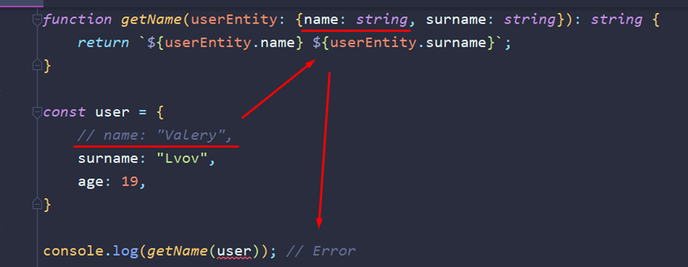

### Упражнение - Типизируем объект

При получении объекта с сервера, мы можем указать его типы заранее до получения, чтобы знать, какой тип данных мы будем получать. И тут показана типизация всего объекта и его получение

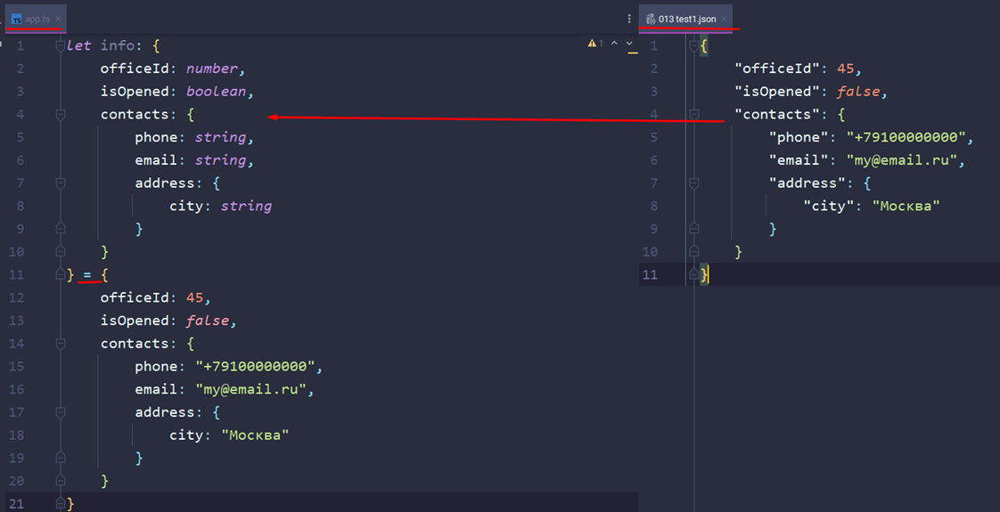

### Массивы

Массивы указываются как обычные типы, но с квадратными скобками. Так же можно увидеть, что редактор нам отображает типы, с которыми мы работаем (как можно увидеть в редьюсе). Так же можно задать самостоятельно типы для аргументов (только тогда аргумент нужно писать обязательно в скобочках)


Если мы дальше по массиву вернём число (мэп вернёт числа в массив), то это число будет работать и дальше. В консоль выйдет строка «2»

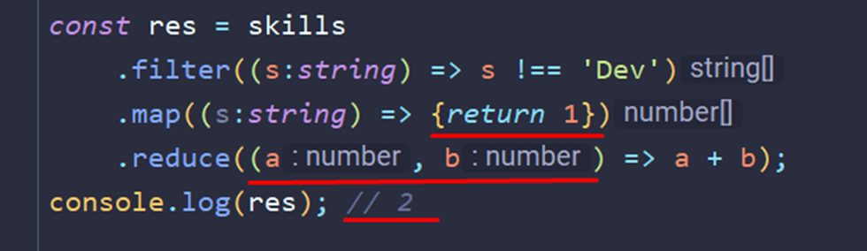

### Tuples

Tuples или кортежи – это массивы, которым мы задали определённый список на типы данных

1) Массив без определённого типа данных – можно поместить всё
2) Массив из одного элемента (можно через запятую указывать какие типы данных будет иметь каждая позиция)
3) Массив с определённым типом данных
4) Юнион – он хранит определённый разрез типов данных (тут на примере вмещает в себя и стрингу, и число)

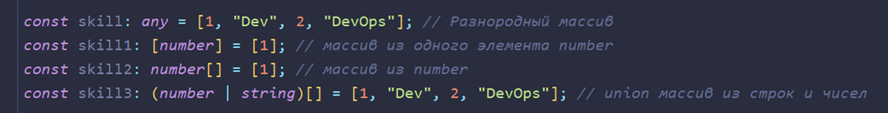

Конкретно тут был создан ограниченный массив из числа и строки – больше вписать в него не получится. Мы можем получить эти значения. Однако, если мы захотим получить ещё один элемент сверх указанной нормы, то у нас ничего не получится


Запушить новый объект в массив мы сможем (так как в процессе работы массив спокойно может получать новые значения), а получить их напрямую не получится

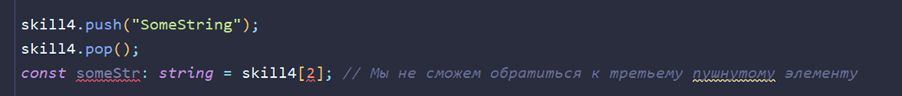

Более короткий формат записи создания и получения сразу нескольких переменных по значениям массива

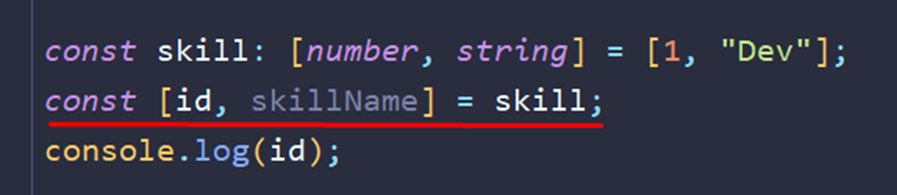

В таплах можно задать как массивы определённых типов, так и добавить этот массив со спредом (чтобы просто вписывать значения массива без вложения его в массив внутри)

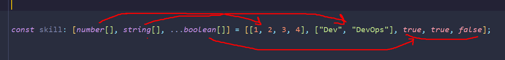

### Readonly

Кратко опишем проблему. Когда мы пытаемся поменять значение у константы, JS нас бьёт по рукам и запрещает это делать. Когда мы меняем значения под индексами у массивов, то мы спокойно это можем сделать, потому как мы в качестве константы устанавливаем ссылку на массив


Однако на массив мы можем установить модификатор ридонли и будем получать по рукам при попытке изменения этого массива


И вот примерно так выглядят массивы с ридонли

1) Тут представлен обычный массив строк
2) Тут уже массив строк, который изменять нельзя. Сколько будет и какие будут базовые значения, такими они и останутся – изменить нельзя
3) Тут показан пример создания массива строк через дженерик. Он работает аналогично первому примеру
4) Это дженерик ридонли массива `<строкового>`. Как видно, запушить в него новое значение так же нельзя и изменять тоже. Это просто ещё одна вариация записи ридонли массива через дженерик


### Enums

Представим такую ситуацию. Мы проверяем запрос от сервера и при успешном выполнении мы должны выполнить определённую логику. Проблема заключается в том, что мы можем допустить ошибку в записи результата объекта и получить неверную логику выполнения программы

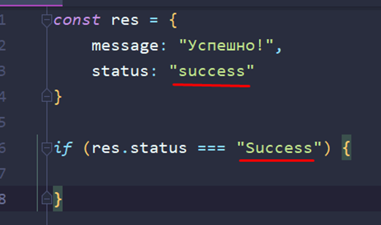

Более правильным вариантом в нативке будет использование отдельной константы


И для решения этой проблемы в ТС используют енамы. Это определённые объектоподобные конструкции, которые хранят в себе фиксированные значения. Тут мы задаём наши параметры статуса и можем спокойно их использовать в любом удобном для нас месте

Хочется дополнить, что енамы активно используются в очень маленьких либо монолитных проектах


Есть множество вариантов записи и задания значений для наших енамов. Можно оставить их по умолчанию и тогда присвоение будет идти с 0. Можно начать со своего числа. Можно задать свои значения разным свойствам. Можно задать строковые значения (но это уже будет неудобно)


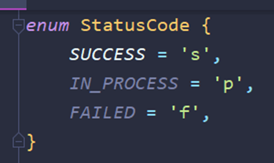

Так же енам может быть гетерогенным и вполне себе состоять из чисел и строк

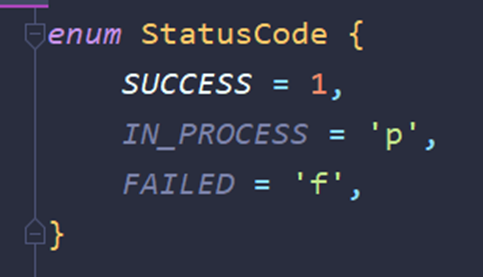

Так же можно в качестве типа данных указать наш енам, чтобы функция могла принять только его. Тут стоит указать такую особенность, что гетерогенный енам (который указан чуть выше) из-за того, что имеет в себе числа до сих пор ведёт себя как числовой, поэтому мы не сможем передать текст, который был присвоен для значения енама

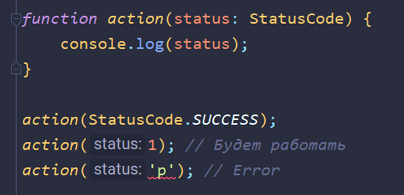

В качестве значений для енама можно присваивать спокойно результаты математических вычислений. Однако не стоит использовать для них функции, которые могут отправлять запросы на сервер, так как код может не успеть выполниться и вернуть `undefined`

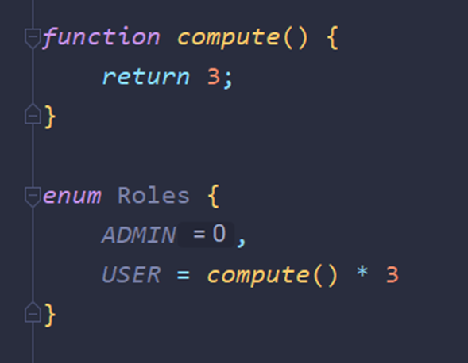

Енамы могут вести себя похоже на объекты

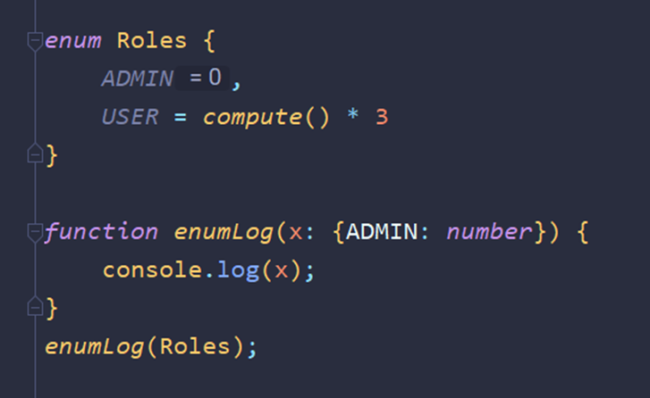

Так же нужно отметить, что енамы в рабочем проекте существуют ровно до рантайма (так как они находятся только в пределах тайпскрипта, который компилируется в JS). Уже в сам JS они переходят в виде IIFE-функций

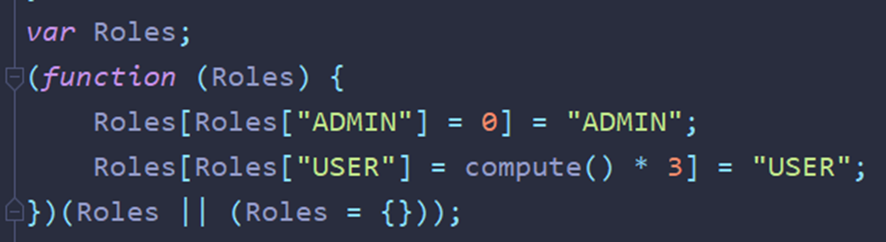

Однако, если мы объявим enumn в виде константы, то компилятор будет искать все вхождения enum в код и приравнивать только их. То есть мы отказываемся от функкции, которая может замедлить наш код

```TS
const enum Roles {
	ADMIN, // = 0
	USER = 3
}

const adming = Roles.ADMIN
// либо
const adming = 0 /** Roles.ADMIN */
```

### Упражнение - Типизируем функцию

Сейчас нужно немного разобрать монстра типизации, который за счёт неё съел пространства больше, чем сама функция. Конкретно тут нам показан код, который представляет из себя: мы получили данные -> это должно выйти из полученных данных

Заранее нужно упомянуть, то все такие большие типизации убираются в интерфейсы и типы, а затем уже вызываются отдельно, чтобы не перепрописывать постоянно так много кода.

Так же когда мы в качестве типа указываем енам, нам нужно поставить после имени ключа оператор «?», который скажет, что может быть несколько значений енама

Итак. Первым делом тут описан статус, который может иметь три позиции. Дальше типизируем получаемые данные, которые представляют из себя два свойства: топик и статус. Потом типизируем функцию. Её тип будет сформирован дженериком `Promise<{}[]>` - то есть это будет массив объектов. Объекту мы внутри описали все типы. В идеале эту структуру изнутри промиса нужно описать и для нашей выводимой даты


---
## Продвинутые типы

### Union

Юнион – это способ определения типа данных, когда мы в переменную можем поместить один из перечисленных через «`|`» типов данных

Сразу хочется отметить, что при использовании такого типа данных, в обычных условиях, компилятор не понимает, что в нём находится и не предлагает нормальный автокомплит


Сужение типов. Для того, чтобы использовать методы строк, или чисел, или булеана, нам нужно сузить типы, с которыми мы работаем (потому что юнион объект – это ни рыба, ни мясо)

Сузить можно через условие, в котором мы пропишем, что оно будет срабатывать при равности типа указанному


Так же можно увидеть, что мы исключили возможность того, что тип может быть строчным и компилятор нам показывает, что нынешний аргумент у нас либо число, либо булеан значение


Больше примеров богу примеров. Это пример выборки либо строки, либо массива из передаваемых типов


А вот уже пример с типизацией объектов. Тут мы можем проверить в придачу в принципе наличие определённого ключа в объекте + его типа и обработать это всё


Ну и так же мы можем проверять два разных типа на разные действия при их соответствии

```TS
function sumOrConcatenation(a: string | number, b: string | number) {
	if (a === b) {
		console.log(a + b)
	}
}
```

### Literal Types

Литеральные типы данных – это типы данных, которые выражаются в определённых значениях. Эти типы определяют, что будет находиться в этой переменной. По умолчанию константы имеют тип данных равный значению. Если let присвоить литеральный тип данных (например, 1), то и хранить сможет только число «1»


Используются литеральные типы, чтобы не делать на каждый чих енамы


Литеральные типы принимают в себя только значения, которые мы зададим для этих значений. Так же мы можем задать фиксированные значения на получения таковых из функции


Однако тут нужно так же и помнить, что при отправке тех же данных в функцию, где аргумент имеет литеральный тип, может привести к неочевидным результатам. Если мы захотим отправить не чистый аргумент, а переменную, объявленную через let, то мы словим приколыч, так как у нас сравниваюся типы при отправке (аргумент ведь имеет только два типа – тут пост и гет). Лет тут является стрингой, а стринга не является постом или гетом


Чтобы исправить ситуацию, нужно будет поменять лет на конст и тогда значение автоматом присвоится в тип данных переменной


Либо можно кастануть переменную и задать ей определённый тип данных. Это уже стоит делать только в том случае, если мы данные получаем не из переменной, а из объекта. Делается каст через оператор `as`


Однако берём в учёт, что мы не должны использовать каст в роли фикса от ТСки. Используем только по надобности, когда нет возможности привести типы


### Type Aliases

И вот пример тайп элиаса (псевдонима). Через ключевое слово «type» мы можем как обычную переменную задать любой тип и использовать этот псевдоним


Элиасы позволяют сократить достаточно сильно код и делать свои шаблоны типизированных объектов. На первом примере стандартное объявление одного объекта. На втором примере можно увидеть тайп элиас (с помощью которого можно объявить сразу несколько новых объектов)


Так же есть и интерсекшн типы. На первом скрине можно увидеть, как были соединены два типа через юнион «`|`» и теперь мы можем запихнуть в объект либо первый тип, либо второй, либо все вместе. Уже оператор «`&`» определяет интерсекшн, который говорит нам, что в данной переменной должны находиться сразу оба типа вместе и никак иначе

Интерсекшн откидывает повторяющиеся поля


### Interfaces

Интерфейсы – это технология, которая позволяет записать типизацию объекта в виде подобным классам. Так же интерфейсы экстендятся как классы (в тайпах нужно было использовать интерсекшн)


Пометочка: функции так же можно вписывать и в тайпах


Уже таким образом мы можем создать объект-словарь

1) Неопределённое количество свойств – `[наименование: тип]`
2) Значение – тут Юзер

Однако словари создаются обычно через третью запись (дженерик)


### Types или Interfaces

Первой отличительной особенностью интерфейсов является их возможность мёрджа. Если мы объявим два одинаковых интерфейса, то они слипнутся и будут себя вести как один интерфейс


Так же тайпы крайне просто работают с простыми типами и позволяют их быстро задать. Интерфейсы же подходят только для работы с объектами


Если подытожить, то для создания объектов стоит использовать интерфейсы. Они чаще используются так же вместе с классами. Тайпы стоит использовать для простых типов и быстрой реализации

### Optional

Оператор «`?`», который мы пишем сразу после наименований ключей, свойств, аргументов и так далее говорит нам о том, что этот параметр не обязателен.

Конкретно в примере с интерфейсом нам не обязательно теперь в объекте подобного типа указывать свойство пароля. И, как можно было подумать, записать без «`?`», но пометить, что свойство должно быть андефайндом мы не можем (в объекте придётся явно указать, что значением будет андефайнд)

В функции же «`?`» говорит, что нам необязательно передавать такой аргумент. Однако в функции мы уже можем указать, что второй аргумент может быть неопределённым типом и это будет работать подобно «`?`»


Так же нужно упомянуть, что при обращении к свойству объекта с «`?`», нам нужно обязательно прописывать опциональный чейн, так как значения может и не быть (ТС выдаст ошибку в компайл-тайме)


«`!`» – этот оператор, в свою очередь, говорит, что мы точно знаем, что вернётся не `undefined`, а именно наше значение, которое было задано нашему объекту


Так же мы можем устроить проверку и через короткую запись


«`??`» - оператор, который проверяет на `null` или `undefined`. Конкретно тут используется такая конструкция, так как парам – это опциональный аргумент и его мы можем не передать, а значить проверить на его наличие нам нужно


### Упражнение - Типизируем ответ сервера

Это первый способ типизации. Он имеет небольшие минусы в виде того, что нам нужно будет как-то разделять успешный запрос от безуспешного


Это уже более удачный вариант запроса, который поделен на два разных интерфейса


И вот примерно так реализуется вывод удачного и неудачного запроса на сервер (функция возвращает объекты по типу этих двух интерфейсов)


### Void

`void` – это особый тип данных, который нам говорит, что функция ничего не возвращает. Функция может возвращать какое-либо значение, но мы ни в коем случае не будем его принимать и не будем ничего возвращать. 

> `void != undefined`

Конкретно в этом случае, константа «`а`» будет иметь тип `void`


А уже в этом примере вернётся хотя бы `undefined`


### Unknown

`unknown` – это более строгий тип `any`. Он запрещает себя присваивать в другие типы, которые не являются такими же `unknown` или `any`. Используется этот тип в тех случаях, когда мы не знаем, что за тип нам предстоит получить в переменную. И вообще, когда не понятно, что мы получаем, этот тип стоит вставлять


Привычное сужение типов указать для переменной не получится (в одном условии получится указать тип, но в остальных так же останется `unknown`)


Ну и дальше идёт кейс по ошибкам. Раньше еррор имел тип эни, но с версии «4.4», `error` – это непонятный тип. Теперь чтобы работать с ошибкой, нужно добавлять дополнительную конструкцию, которая будет проверять нам, что мы работаем конкретно с ошибкой

1) Проверяем ошибку по инстансу объекта
2) Делаем проверку через присваивание переменной к ошибке (не самый лучший вариант)


И тут нужно пояснить, что или «`|`» выбирает тип для переменной из более общего значения (всегда будет `unknown`), а «`&`» выбирает самое меньшее (`string` более конкретный тип данных)


### Never

И как можно увидеть по первым примерам, тип данных `never` говорит нам, что функция никогда не возвращает значение. Объекты с таким типом абсолютно никогда ничего не возвращают и ничего возвращать нельзя


Если `void` вполне себе может хранить `undefined`, так как `void` – это отсутствие значения, то `never` запрещает возвращать значение


И вот первый кейс, где можно использовать тип `never`. Он позволяет показать, что программа не заходит в данную ветку

Тут нужно пометить, что если константу назвать «`_`», то компилятор не будет ругаться на то, что в ней нет значений


И тут представлен пример, когда мы явно задаём аргументу типы строки и числа. На выходе мы должны получить `boolean` значение. Внутри функции мы проверили получаемое значение и видим, что компилятор говорит нам, что может вернуться из функции `undefined` (если нет `return`, то функция возвращает `undefined`, тут - третий `return`)


Однако, если мы добавим срабатывание функции, которая будет иметь тип невер (никогда ничего не возвращается), то наш третий андефайн будет закрыт этой функцией


> `never` используется для явной блокировки определённых веток выполнения программы

### Null

Первым делом нужно отметить, что в ТС нельзя (в отличие от нативного JS) присвоить любому типу `null`. Мы это можем сделать только изначально `null` или для `any`.


Однако это спокойно настраивается из под настроек компилятора ТС


Однако эту проверку убирать не стоит. Она может во многом помочь.

Конкретно в данном коде мы возвращаем с вероятностью в 50% либо пустое значение, либо объект (который возвращаем в качестве юзера, так как мы не задали тип для функции)


Однако стоит разграничить между друг другом эти понятия: null и undefined. Первый мы используем осознанно (подставляем самостоятельно) и не можем получить в результате выполнения кода JS. Второй же мы можем получить в результате выполнения кода JS

И примерно так уже должна выглядеть правильное написание кода, когда мы точно знаем, что можем не вернуть значение и впоследствии проверяем на это


### 031 Приведение типов

Обычное приведение типов в нативке


Тут нужно отметить, что при создании новой переменной через интерфейс конструктора, тип данных будет не «`string`», а «`String`»


Типизирование объекта тремя способами:

Последний способ лучше не использовать – он будет конфликтовать с Реактом


И так же тут представлен пример создания отдельного пользователя через деструктуризацию прошлого объекта. Однако тут у нас получится объект шире, чем изначальный


Рекомендуется возвращать объекты через функцию (тогда в админе останутся только данные свойства)


### 032 Type Guard

Это представлено обычное сужение типов, через которое мы можем обратиться к нужному нам типу определённого значения


Тут уже показана реализация тайпгуарда. Он всегда возвращает нужный нам тип объекта (проводит проверку на тип). По сути своей он заменяет нам работу булеана на более прозрачную и показывает нам точно, что должна вернуть такая проверка


И вот пример, где мы создали гуардиана для более сложного типа данных


А уже тут проверка идёт через присвоение юзера к админу и если у юзера имеется нужное нам свойство (не = `undefined`), то вернётся админ (нужный интерфейс)


### Asserts

Представим, что нам нужна функциональность проверки соответствия объекта определённым параметрам. Если он не соответствует, то мы должны выкинуть ошибку и остановить выполнение кода.

В классическом варианте с Type Guard, нам нужно будет сделать проверку и исполнять код прямо внутри условного блока, потому что по-другому TG не работает.

```TS
interface User {
    name: string;
}

const a = {};

function assertUser(obj: unknown): obj is User {
    return typeof obj === 'object' && !!obj && 'name' in obj;
}

if (assertUser(a)) {
    console.log('That\'s is user: ', a.name)
}
```

Если вынести вне statement-блока, то у нас будет сохраняться ошибка


Но если мы добавим ключевое слово `asserts` и прокинем ошибку в случае отпавшего гуарда, то дальше наш код будет исполняться без ошибки компиляции

```TS
interface User {
    name: string;
}

const a = {};

function assertUser(obj: unknown): asserts obj is User {
    if (typeof obj === 'object' && !!obj && 'name' in obj) return; 
    throw new Error('Это не пользователь');
}

assertUser(a)

console.log('That\'s is user: ', a.name)
```


>[!success] Это полезно когда: 
> - Нам не нужна огромная вложенность if
> - Когда нам нужно сделать сразу несколько проверок подряд

Примерно такой же подход используется в тестах с `expect()`

### Упражнение - Делаем typeguard ответа

Отправная точка написания кода

```TypeScript
interface IPayment {  
   sum: number;  
   from: number;  
   to: number;  
}  
  
enum PaymentStatus {  
   Success = 'success',  
   Failed = 'failed',  
}  
  
interface IPaymentRequest extends IPayment { }  
  
interface IDataSuccess extends IPayment {  
   databaseId: number;  
}  
  
interface IDataFailed {  
   errorMessage: string;  
   errorCode: number;  
}  
  
interface IResponseSuccess {  
   status: PaymentStatus.Success;  
   data: IDataSuccess;  
}  
  
interface IResponseFailed {  
   status: PaymentStatus.Failed;  
   data: IDataFailed;  
}
```

Задание. Написать функцию, которая будет возвращать число (`id` ответа от респонса)

```TypeScript
type f = (res: IResponseSuccess | IResponseFailed) => number;
```

Решение. Сразу хочется сказать, что это излишний код для проверки свойства

```TypeScript
type res = IResponseSuccess | IResponseFailed;  
function responseChecker(res: res): number {  
   if (responseGuard(res)) {  
      return res.data.databaseId; // в фейле нет свойства databaseId  
   } else {  
      throw new Error(res.data.errorMessage); // только в фейле есть свойство ошибки  
   }  
}  
  
function responseGuard(res): res is IResponseSuccess {  
   if (res.data === "IDataFailed") {  
      return true;  
   }  
   return false;  
}
```


---
## Классы

### Вводное видео - немного об ООП

ООП подход хорошо реализован в ТС. Он предлагает нам работать с объектами на основе реальной жизни. Делать связи между определёнными сущностями и описывать для них функционал


- Принципы ООП:
	- **Абстракция** - написание реальной сущности, абстрагируясь от его реальных свойств и качеств
	- **Инкапсуляция** - обеспечивает присвоение данных и функций к определённому объекту и сокрывает его данные от внешних изменений
	- **Полиморфизм** - один интерфейс - множество абстракций (реализаций)
	- **Наследование** - делегирование кода дочерним элементам объекта


**Класс** - это чертёж объекта. Он определяет структуру будущего инстанса. 
Класс пользователь содержит функционал и начертания того, что будет хранить пользователь. При регистрации нового пользователя, мы создаём инстанс юзера и присваиваем ему свои данные, сохраняя методы и свойства оригинального класса (родителя)


### Создание класса

Синтаксис классов очень похож на стоковый JS. Дополнительно только в самом классу прописываем поля с типами и в конструкторе вписываем их. 

```TS
class User {  
    name: string;  
    surname: string;  
  
    constructor(name: string, surname: string) {  
        this.name = name;  
        this.surname = surname;  
    }  
}  
  
const user = new User("Вася", "Пупкин");
```

Для расширения функционала классов, нам стоит поставить данную настройку в фолс. Теперь нам можно создавать классы без инициализации через конструктор.
Обычно в реальных проектах именно так и используют подобный функционал

```TS
"strictPropertyInitialization": false,
```

И теперь мы можем использовать классы в качестве конструктора. Так же такой функционал расширяют декораторы

```TS
class Admin {  
    role: number;  
}  
const admin = new Admin();  
admin.role = 1;
```

Однако, если мы хотим оставить настройку инициализации, то мы можем поставить "!" после ключа в классе. Это так же говорит ТС, что мы знаем, что делаем и не потребует инициализации данного поля

```TS
"strictPropertyInitialization": true,
```

```TS
class Admin {  
    role!: number; // "Отстань, я знаю, что делаю"
}  
const admin = new Admin();  
admin.role = 1;
```

### Конструктор

- Что такое конструктор?
	- Нужно сразу сказаать, что конструктор триггерится при написании оператора `new`. 
	- Так же конструктор всегда возвращает свой объект (это функция, которая возвращает свой класс)
	- Следующее идёт из прошлого. Мы не можем типизировать возврат конструктора
	- Конструктор не может принимать дженерики. Их может принять только класс
	- Так же конструктору можно описать некоторый оверлоад (с дополнительными сигнатурами). Например, можно добавить необязательные поля

```TS
class User {  
    name: string;  
  
    constructor(name: string) { // function(name:string): User
        this.name = name;  
    }  
}
```

И далее попробуем реализовать класс, который должен нормально работать и без передачи аргументов (чтобы у нас была возможность передать параметр и не передать его)

```TS
class User {  
    name: string;  
  
    constructor();  
    constructor(name: string) {  
        this.name = name;  
    }  
}
```

И тут мы можем увидеть подобную ошибку. Тут уже нужно остановиться на самих типах конструкторов.


Это конструктор реализации (имплементации)

```TS
constructor(name: string)
```

А это уже внешний конструктор, который мы вызываем

```TS
constructor();
```

И чтобы у нас была возможность вызвать пустой конструктор, мы должны описать все конструкторы. То есть первые два конструктора - являются внешними и позволяют описать разную логику поведения нашего основного конструктора (конструктора реализации). **Все внешние конструкторы должны быть совместимыми с конструктором реализации!**
Для конструктора реализации нам нужно указать, что те параметры, которые отсутствуют в одном из конструкторов - необязательны (через "`?`"). Так же, чтобы всё работало, нужно реализовать сужение типов (так как при вызове первого внешнего конструктора будет `undefined`, а при вызове второго - `string`)

```TS
class User {  
    name: string;  
  
    constructor();  
    constructor(name: string);  
    constructor(name?: string) {  
        if (typeof name === 'string') {  
            this.name = name;  
        }    }  
}  
  
const user = new User("Вася");  
const user2 = new User();
```

Преймущество использования такого подхода заключается в том, что мы можем описывать совершенно различные конструкторы, скрывая логику применения внутри них

Например, мы хотим реализовать теперь конструктор, который будет принимать в себя либо имя, либо возраст. 
Создаём третий внешний конструктор, который будет принимать в себя только число. И теперь далее в конструкторе реализации мы будем принимать не просто имя, а в переменную может попасть либо имя, либо число. В самом конструкторе реализации нужно будет продолжить сужение типов (стринга - число)

```TS
class User {  
    name: string;  
    age: number;  
  
    constructor();  
    constructor(name: string);  
    constructor(age: number);  
    constructor(ageOrName?: string | number) {  
        if (typeof ageOrName === 'string') {  
            this.name = ageOrName;  
        } else if (typeof ageOrName === 'number') {  
            this.age = ageOrName;  
        }    }  
}  
  
const userName = new User("Вася");  
const userNull = new User();  
const userAge = new User(33);
```

А теперь мы реализовали ввод сразу и имени, и возраста в конструктор

```TS
class User {  
    name: string;  
    age: number;  
  
    constructor();  
    constructor(name: string);  
    constructor(age: number);  
    constructor(name: string, age: number);  
    constructor(ageOrName?: string | number, age?: number) {  
        if (typeof ageOrName === 'string') {  
		    this.name = ageOrName;  
		} else if (typeof ageOrName === 'number') {  
		    this.age = ageOrName;  
		}  
		  
		if (typeof age === 'number') {  
		    this.age = age;  
		}
}  
  
const userName = new User("Вася");  
const userNull = new User();  
const userAge = new User(33);  
const userNameAndAge = new User("Вася", 33);
```

Однако тут нужно объяснить одну простую истину: **делать конструкторы более чем с 3-4 перегрузками - уже нечитабельно и так делать некруто**. 
Чтобы нормально реализовать более громоздкую реализацию класса, нужно делать статичные методы

### Методы

Методы - это свойства объекта, значениями которых является функция. 
Конкретно в классе объект записывается как функция, но без ключевого слова `function`

```TS
enum PaymentStatus {  
    SUCCESS,  
    HOLD,  
    REVERSED,  
    FAILED  
}  
  
class Payment {  
    id: number;  
    status: PaymentStatus;  
    createdAt: Date;  
    updatedAt: Date;  
  
    constructor(id: number) {  
        this.id = id;  
        this.status = PaymentStatus.HOLD;  
        this.createdAt = new Date();  
    }  
  
    getPaymentLifeTime(): number {  // !
        return new Date().getTime() - this.createdAt.getTime();  
    }  
  
    unholdPayment(): void {  // !
        if (this.status === PaymentStatus.SUCCESS) {  
            throw new Error("Платёж уже совершён успешно!");  
        }        this.status = PaymentStatus.REVERSED;  
        this.updatedAt = new Date();  
    }  
}  
  
const payment = new Payment(1);  
const paymentTime = payment.getPaymentLifeTime();  // !
payment.unholdPayment(); // !
```

Метод `getTime()` возвращает значение времени в миллисекундах

```TS
return new Date().getTime() - this.createdAt.getTime();
```

Так же мы можем немного улучшить код, присвоив дефолтные значения для `this.полей` класса прямо при их инициализации, а не в конструкторе

```TS
class Payment {  
    id: number;  
    status: PaymentStatus = PaymentStatus.HOLD; // Таким образом
    createdAt: Date = new Date(); // ! 
    updatedAt: Date;  
  
    constructor(id: number) {  
        this.id = id;  
    }
}
```

### Упражнение - Перегрузка методов

И сейчас опять взглянем на полиморфизм - реализуем перегрузку, при которой мы сможем поместить либо один навык пользователя, либо массив навыков. 

```TS
class User {  
    skills: string[];  
  
    addSkill(skill: string): void; // !
    addSkill(skills: string[]): void; // !
    addSkill(skillOrSkills: string | string[]): void {  
        if (typeof skillOrSkills === "string") {  
            this.skills.push(skillOrSkills);  
        } else {  
            this.skills.concat(skillOrSkills);  
        }    }  
}  
  
const user1 = new User().addSkill("technoPunk"); // !
const user2 = new User().addSkill(["write", "slept"]); // !
```

Так же перегрузку можно реализовать и для функции (внутри ТС, конечно же)

```TS
function run(info: string): void;  
function run(info: number): void;  
function run(info: string | number): void {  
    if (typeof info === "string") {  
        console.log(info);  
    } else {  
        info++;  
    }  
}
```

Однако для сигнатуры перегрузки мы можем записать тип возвращаемого значения отличный от реализации функции

```TS
function run(info: string): string;  // !
function run(info: number): number;  // !
function run(info: string | number): string | number {  // !
    if (typeof info === "string") {  
        return info;  // !
    } else {  
        return info++;  // !
    }  
}
```

### Getter и Setter

Методы, которые мы инициализируем через `get` и `set`, реализуют функционал вывода/задания значения. Обычно их реализую для возможности просматривать или изменять приватные поля класса. 
- Особенности геттеров и сеттеров:
	- Тип данных сеттера по умолчанию равен типу, который возвращает геттер.
	- Геттеры и сеттеры не могут быть асинхронными

```TS
class User {  
    _login: string;  
    _password: string;  
  
    set login(login: string) {  
        this._login = login;  
    }  
  
    get login() {  
        return this._login;  
    }  
}  
  
const user = new User();  
user.login = "user";  
console.log(user.login);
```

Дополним, что если у поля есть геттер или сеттер, то работаем с этим полем только через геттер или сеттер. Напрямую обращаться к полю не надо. Поэтому, если у нас присутствует только геттер, то поле становится ридонли (можно только прочесть)
Однако мы до сих пор можем поменять значение внутри инстанса через прямое обращение к полю

```TS
class User {  
    _login: string;  
    _password: string;  
  
    get login() {  
        return this._login;  
    }  
}  
  
const user = new User();  
user.login = "user";  
console.log(user.login);
```

`get`/`set` синхронны, как описывалось выше, поэтому они останаливают основной поток программы для выполнения своих функций.
Для асинхронных функций (например, если нам нужно получить зашифрованный пароль) нам нужно использовать методы. 

```TS
async getPassword(p: string) {  
    return await "crypted" + this._password;  
}
```

### Implements

Имплементация  - это сигнатура, которая позволяет нам реализовать класс по определённой абстракции. То есть мы создаём прообраз для нашего класса. Реализуется такой подход через интерфейсы и ключевое слово  `implements`.

Конкретно тут мы реализовали имплементацию методов в класс от интерфейса

```TS
interface ILogger {  
    log: (...args: any[]) => void; // Первая реализация метода 
    error(...args: any[]): void;  // Вторая
}  
  
class Logger implements ILogger {  
    log (...args: any[]): void {  
        console.log(...args);  
    }  
    error(...args: any[]): void {  
        console.log(...args);  
    }  
}
```

Уже тут реализована имплементация, при которой мы в классе должны иметь обязательный метод `pay` и необязательное поле `price` (так как оно с "`?`")

```TS
interface IPayment {  
    pay: (paymentID: number) => void;  
    price?: number; // необязательное поле  
}  
  
class User implements IPayment{  
    pay (paymentID: number | string) : void {  
        console.log(paymentID);  
    }  
  
    // price?: number | undefined;  
}  
  
new User().pay("StringA");
```

Конкретно в данном случае, в функции класса, аргумент paymentID должен иметь всегда тип либо шире, чем в интерфейсе (`union` либо `any`), либо иметь тот же тип (`number`)

```TS
class User implements IPayment{  
    pay (paymentID: string) : void {  // Ошибка
        console.log(paymentID);  
    }
}
```

```TS
class User implements IPayment{  
    pay (paymentID: number | string) : void {  // Так уже можно
        console.log(paymentID);  
    }
}
```

>[!Note] Использовать имплементацию нужно:
>1) Для отделения реализации от абстракции
>2) Для обязательного наделения свойствами какого-либо класса (например, для нужно всем классам присваивать методы, обязательные для связи с API)


### Extends

`Extends` - реализует зависимость одного класса от другого, при этом принимая все его свойства и методы.
Таким наследованием нельзя злоупотреблять, так как код будет сильно связан и его сложно будет размонолитить

```TS
type PaymentStatus = "new" | "paid";  
  
class Payment {  
    id: number;  
    status: PaymentStatus = "new";  
  
    constructor(id: number) {  
        this.id = id;  
    }  
  
    pay() {  
        this.status = "paid";  
    }  
}  
  
class PersistentPayment extends Payment { // Расширяем родителем
    dataId: number;  
    paidAt: Date;  
  
    constructor() {  
        const id = Math.random();  
        super(id);  
    }  
}  
  
new PersistentPayment().pay();
```

Через `extends` мы передали всё, что было в родительском классе и теперь в через дочерний класс мы можем вызвать методы родительского и обратиться к свойствам, которые не прописаны в дочернем классе (однако они принадлежат дочернему элементу)


Через метод `super()` мы вызываем конструктор родительского класса. Его обязательно вызвать при переопределении конструктора в дочернем классе. Однако его не нужно писать, если новый конструктор мы не пишем в дочернем классе


Чтобы переопределить метод в дочернем классе, нужно его переписать так, чтобы он был расширением для метода родителя (чтобы его можно было вызвать так же как родителя).
Так же и тут нужно воспользоваться супером, чтобы перенести логику метода в дочерний объект

```TS
pay(date?: Date) {  
    super.pay();  
    if (date) {  
        this.paidAt = new Date();  
    }
}
```

И тут нужно упомянуть один очень важный модификатор *`override`*. В чём заключается его задача? Он указывает нам на то, что он переопределяет родительский метод. Это сильно обезопасит наш код, так как теперь мы будем видеть ошибку, если в родительском классе мы, например, удалим этот метод

```TS
override pay(date?: Date) {  
    super.pay();  
    if (date) {  
        this.paidAt = new Date();  
    }
}
```

### Особенности наследования

Порядок вызова конструкторов
Конкретно в этом случае, мы увидим - `user`. Дело в том, что у нас вызывается сначала родительский класс и его конструктор, а уже затем вызывается дочерний 

```TS
class User {  
    name: string = "User";  
    constructor() {  
        console.log(this.name);  
    }  
}  
  
class Admin extends User {  
    name: string = "Admin";  
}  
  
new Admin(); // Выйдет User
```

А уже в таком блоке кода выйдут оба наименования: `User` и `Admin`

```TS
class User {  
    name: string = "User";  
  
    constructor() {  
        console.log(this.name);  
    }  
}  
  
class Admin extends User {  
    name: string = "Admin";  
  
    constructor() {  
        super();  
        console.log(this.name);  
    }  
}  
  
new Admin(); // Выйдет User Admin
```

А уже таким образом сделать нельзя. Метод супер должен всегда идти первым, если мы обращаемся к свойствам класса

```TS
constructor() {  
    console.log(this.name);  
    super();  // Error
}
```

Так же мы можем спокойно экстендиться от встроенных классов, которые мы уже имеем в системе. Так же вызвать `super` и как-то модифицировать логику выполнения 

```TS
class HttpError extends Error {  
    code: number;  
  
    constructor(message: string, code?: number) {  
        super();  
        this.code = code ?? 500;  
    }  
}
```

### Композиция против наследования

Тут мы описали класс пользователя, которого мы создаём с именем. Дальше уже у нас идёт класс, который экстендится от дженерика Массива<Пользователь>, что даёт нам возможность создавать массив (+ методы массива) пользователей (+ класс Юзер) 
Однако мы сталкиваемся с такой проблемой, что у нас могут появиться множество ненужных нам методов в списке комплита. Для бизнес-сущностей - это плохой вариант и уже стоит переписать логику для этих методов (а именно заоверрайдить их)
Конкретно тут метод toString() переписали таким образом, что теперь он выводит строкой массив элементов с разделителем в виде "`,`" (`join` - соединяет объекты)
*Тут показан механизм наследования*


А уже в данном примере мы скрыли реализацию обычного пуша в метод `push()`. Конкретно в примере добавления пользователей через такой внутренний массив - это более приоритетный вариант, чем тот, что выше 
*Тут уже показан механизм композиции*

```TS
class UserList {  
    name: string[];  
    push (u: string) {  
        this.name.push(u);      
	} 
}
```

И вот более удачный пример композиции.
Нам нужно реализовать класс Пользователь и Оплата. Конкретно тут два варианта реализации - один плохой, другой хороший. 
В первом варианте мы жёстко связываем сущности юзера и пеймента, что может привести к конфликтам свойств классов.
Во втором случае, мы абстрагировали две сущности друг от друга, что позволит нам спокойно расширять объект в частностях

```TS
class User {  
    name: string = "User";  
  
    constructor() {  
        console.log(this.name);  
    }  
}  
  
class Payment {  
    payment: Date;  
}  
  
class UserWithPaymentBad extends Payment {  
    name: string;  
}  
  
class UserWithPaymentGood {  
    user: User;  
    payment: Payment;  
  
    constructor(user: User, payment: Payment) {  
    }
}
```


> [!Note] Когда что лучше использовать?
> 1) Наследование используем, когда нам нужно расширяться в рамках одной доменной области (Гость - Юзер - Админ) 
> 2) Композицию используем, когда мы пересекаем доменные области. Пример выше - нам нужно связать пользователя и платежи каким-то одним интерфейсом.

### Видимость свойств

Видимость и доступность свойств в ТС определяется модификаторами доступа *`public`*, *`private`* и *`protected`*. Все они выполняют функцию определённой инкапсуляции свойств класса. 

Как можно увидеть на примере, свойство `nums` мы не можем вызвать вне класса, так как оно скрыто от внешнего воздействия. Уже публичное свойство `name` мы можем увидеть и изменить. 


И теперь мы можем увидеть классический пример реализации класса с полноценной инкапсуляцией, когда мы можем поменять значение нужного нам свойства только через сеттер или метод и просмотреть свойство через геттер

```TS
class Vehicle {  
    public name: string = "BMW";  
    private _driver: string = "Alesha";  
    private _nums: string[] = ["ao123k"];  
  
    get driver() {  
        return this._driver;  
    }  
  
    set driver(carDriver: string) {  
        this._driver = carDriver;  
    }  
  
    addNums(num: string) {  
        this._nums.push(num);  
    }  
}
```

Так же приватные поля нам доступны только внутри объекта, внутри которого мы создали эти поля. 
Конкретно в данном примере, мы можем получить доступ только к родительскому свойству `name`, так как оно публично


Уже поле `protected` отличается от поля `private` тем, что оно наследуется к остальным экземплярам класса (но так же инкапсулирует как `private`) 

```TS
class Vehicle {  
    public name: string = "BMW";  
    private _driver: string = "Alesha";  
    protected run: number;
}  
  
class Truck extends Vehicle {  
    setRun(run: number) {  
        this.run = run;  
    }  
}  
new Truck().setRun(30000);
```

Хочется сказать, что "`#`" сохраняет свою силу и в нативном JS, а модификаторы доступа работают только внутри ТС.
Решётку не стоит использовать для написания бэка (приват в ТС для этого достаточно). Уже во фронте, если нужно ограничить переменную от экстеншенов браузера, то можно будет её так скрыть через "`#`"


Так же никто нам не мешает сделать приветным метод класса

```TS
class Truck extends Vehicle {  
    private setRun(run: number) {  
        this.run = run;  
    }  
}  
new Truck().setRun(30000); // Error - нет доступа к методу
```

### Упражнение - Делаем корзину товаров

> [!Note] Задание: 
> Необходимо сделать корзину (`Cart`) на сайте,  
которая имееет список продуктов (`Product`), добавленных в корзину  и переметры доставки (`Delivery`). Для Cart реализовать методы:  
> - Добавить продукт в корзину  
> - Удалить продукт из корзины по ID  
> - Посчитать стоимость товаров в корзине 
> - Задать доставку  
> - `Checkout` - вернуть что всё ок, если есть продукты и параметры доставки  
> `Product: id`, название и цена  
> `Delivery`: может быть как до дома (дата и адрес) или до пункта выдачи (дата = Сегодня и `Id` магазина)

*Одна интересная особенность*: если в конструкторе записать аргументы с модификатором `public`, то эти аргументы сразу станут свойствами класса (к которым обращаемся через `this`) и их не надо будет объявлять и указывать им типы

```TS
class Product {  
    constructor(  
        public id: number,  
        public name: string,  
        public price: number  
    ) {  }  
}
```

И вот пример реализации поставленной задачи:

```TS
class Product {  // Сам продукт
    constructor(  
        public id: number,  
        public name: string,  
        public price: number  
    ) {  }  
}  
  
class Delivery {  // Родительский класс доставки
    constructor(  
        public date: Date  
    ) {  
    }
}  
  
class HomeDelivery extends Delivery {  // Доставка домой
    constructor(date: Date, public address: string) {  
        super(date);  
    }  
}  
  
class ShopDelivery extends Delivery {  // Доставка в магазин
    constructor( public shopID: number) {  
        super(new Date());  
    }  
}  
  
type deliveryOptions = HomeDelivery | ShopDelivery; // И далее доставка может быть одного из двух типов
  
class Cart {  // Корзина
    private products: Product[] = []; // Продукты
    private delivery: deliveryOptions; // Тип доставки
  
    public addProduct(product: Product): void {  
        this.products.push(product); // Добавляем продукт
    }  
  
    public deleteProductByID(productID: number): void {  
        this.products = this.products.filter((p: Product) => p.id !== productID);  // Удаляем продукт
    }  
  
    public getSum(): number { // Получаем сумму цены товара
        return this.products  
            .map((p: Product) => p.price)  
            .reduce((p1: number, p2: number) => p1 + p2);  
    }  
  
    public setDelivery(delivery: deliveryOptions): void {  
        this.delivery = delivery; // Определяем тип доставки
    }  
  
    public checkOut() { // Состояние заказа 
        if (this.products.length == 0) {  
            throw new Error("Нет товаров в корзине");  
        }        if (!this.delivery) {  
            throw new Error("Не указан способ доставки");  
        }  
        return {success: true}  
    }  
}  
  
const cart = new Cart();  

// Добавляем товары
cart.addProduct(new Product(1, "Печенье", 10)); 
cart.addProduct(new Product(2, "Торт", 30));  
cart.addProduct(new Product(3, "Шоколад", 20));  

// Удаляем товары
cart.deleteProductByID(1);  

// Определяем тип доставки
cart.setDelivery(new HomeDelivery(new Date(), "some home"));  
  
console.log(cart.getSum()); // = 50  
console.log(cart.checkOut()); // success: true
```

### Статические свойства

Модификатор static создаёт нам статическое свойство, которое можно использовать без инстанациирования объекта класса через `new`

```TS
class UserService {  
    static db: any;  
}  
  
UserService.db = 4;
```

Так же мы можем сделать статичным и метод класса и можем этот метод вызывать тоже без инстанциирования класса через `new`, а просто через наименование класса и вызов метода
В примере второй метод нестатичен и его уже вызвать без инстанциирование класса не получится

```TS
class UserService {  
    private static db: any;  
  
    static getUserByID(id: number) { // 1  
        return this.db.findById(id);  
    }  
    create() { // 2  
    }  
}  
  
UserService.getUserByID(1); // 1  
new UserService().create(); // 2
```

И так же нужно сказать, что из инстанциированных объектов у нас нет доступа к статичным свойствам и методам класса


Так же стоит упомянуть, что правильнее в статичных полях использовать обращение не через `this`, а через имя (статического) класса 

```TS
class UserService {  
    private static db: any;  
  
    static getUserByID(id: number) {
        return UserService.db.findById(id);  
    }  
  
    create() {
        UserService.db;  
    }  
}  
  
const inst = new UserService().create();
```

При инициализации инстанса класса через `new` вызывается конструктор класса. И так же при вызове статического класса вызывается поле статик вместо конструктора.

```TS
class UserService {  
    public static db: number;   
      
	constructor(id: number) {  }    
    
    static {  }  
}  
  
new UserService(1);  
UserService.db = 1;
```

Асинхронные функции внутри статика работать не будут

```TS
class UserService {  
    public static db: number;  
        
    static {  
	    await new Promise() // Error
    }  
}  
```

А вот уже статичные методы могут быть асинхронными

```TS
class UserService {  
    private static db: any;  
  
    static async getUserByID(id: number) {
        return UserService.db.findById(id);  
    }  
}  
```

Однако класс статичным быть не может (чтобы весь его функционал внутри был статичным)

```TS
static class UserService { // Error  
}  
```

Так же нужно упомянуть, что статичные функции и свойства считаются встроенными в данный класс.
У класса `UserService` уже есть зарезервированное свойство `name`, поэтому переопределить её не получится (свойство прототипа объекта)

```TS
class UserService {  
    static name: string = 'UserService'; // Error  
}  
  
UserService.name;
```

### Работа с this

Хочется немного поговорить про контекст вызова `this`. А именно про его использование вовне.
Конкретно в нашем примере, мы можем увидеть, что если мы вызовем функцию из инстанса класса, то получим нормальную дату. Получим нормальную дату, *потому что мы обратились ко внутреннему свойству класса*
Когда мы будем вызвать эту же функцию из объекта, то мы получим `undefined`. Получим мы неопределённое значение ровно потому, что мы потеряем контекст вызова. Вызывая из объекта, контекстом вызова у нас будет наш объект `user`

```TS
class Payment {  
    private date: Date = new Date();  
  
    getDate() {  
        return this.date;  
    }  
}  
  
const p = new Payment();  
console.log(p.getDate()); // Получим нашу дату  
  
const user = {  
    id: 1,  
    paymentDate: p.getDate,  
}  
console.log(user.paymentDate()); // undefined
```

Однако, если мы используем функцию `bind()`, то мы сохраним контекст вызова нашего объекта

```TS
const user = {  
    id: 1,  
    paymentDate: p.getDate.bind(p),  
}  
console.log(user.paymentDate()); // дата
```

Так же мы можем явно указать нашему ТС, что в методе мы всегда обязаны вызывать именно определённый контекст указание в методе аргумента `this: Payment`.
И если сейчас мы не используем `bind`, то мы получим ошибку, так как контекст вызова перешёл на user

```TS
class Payment {  
    private date: Date = new Date();  
  
    getDate(this: Payment) {  // !
        return this.date;  
    }  
}  
const p = new Payment();   

const user = {  
    id: 1,  
    paymentDate: p.getDate,  
}  

console.log(user.paymentDate()); // Error
```

Однако мы можем сохранить контекст и без биндинга. Сделать нам это позволит стрелочная функция, так как она сохраняет контекст вызова

```TS
class Payment {  
    private date: Date = new Date();  
  
    getDateArrow = () => {  // !
        return this.date;  
    }  
}  
  
const p = new Payment();  
console.log(p.getDate());  
  
const user = {  
    id: 1,  
    paymentDate: p.getDateArrow,  // !
}  
console.log(user.paymentDate()); // Вернёт дату
```

И сейчас мы увидим одну очень интересную особенность стрелочных функций. А именно - **стрелочные функции не находятся в прототипе объекта**.

То есть в первом случае, у нас вызывается обычная функция родителя. Обращение к ней идёт из `PaymentPersistence` через прототип родителя `Payment`.

```TS
class PaymentPersistence extends Payment {  
    save() {  
        super.getDate();  
    }  
}  
console.log(new PaymentPersistence().save()); // Получим дату
```

Во втором случае, мы уже пытаемся обратиться к стрелочной функции, которая отсутствует в прототипе объекта и поэтому получаем ошибку

```TS
class PaymentPersistence extends Payment {  
    save() {  
        super.getDateArrow();  
    }  
}  
console.log(new PaymentPersistence().save()); // Получим Error в рантайме, так как данный метод не является функцией
```

Однако, если мы обратимся через `this`, то мы непосредственно вызовем унаследованную функцию от родителя, которая уже имеется в дочернем классе

```TS
class PaymentPersistence extends Payment {  
    save() {  
        this.getDateArrow();  
    }  
}  
console.log(new PaymentPersistence().save()); // Выведет дату
```

### Типизация this


То есть по сути функция возвращает `UserBuilder`, а именно в качестве типа наш класс

```TS
class UserBuilder {  
    private name: string;  
  
    setName(name: string): UserBuilder {  // !
        this.name = name;  
        return this;  
    }  
}  
  
const user = new UserBuilder().setName("Олек");
```

Однако, если мы будем возвращать конкретно наш класс, то мы можем получить определённые коллизии, поэтому стоит указать в качестве возвращаемого типа `this`

```TS
class UserBuilder {  
    private name: string;  
  
    setName(name: string): this {  // !
        this.name = name;  
        return this;  
    }  
}  
  
const user = new UserBuilder().setName("Олек");
```

Коллизии эти могут выглядеть следующим образом:

Когда мы ссылаемся на `this`, наш первый `res` и `res2` имеют свои типы данных (`UserBuilder` и `AdminBuilder` соответственно)


А теперь наша функция возвращает `UserBuilder` и наш новосозданный инстанс `AdminBuilder` будет иметь тип `UserBuilder` 


Так же мы можем реализовать `typeguard` через `this`. В данном тайпгуарде мы возвращаем `boolean` проверки, что данный класс является админом. В условии, если `true`, то мы попадём в ветку, где юзер является админом

```TS
class UserBuilder {  
    private name: string;  
  
    setName(name: string): UserBuilder {  
        this.name = name;  
        return this;  
    }  
  
    isAdmin(): this is AdminBuilder {  // !
        return this instanceof AdminBuilder; // !  
    }  
}  
  
class AdminBuilder extends UserBuilder {  
    roles: string[];  
}  
  
let user: UserBuilder | AdminBuilder = new UserBuilder(); // !  
  
if (user.isAdmin()) {  
    console.log(user); // AdminBuilder  
} else {  
    console.log(user); // UserBuilder  
}
```

Однако, если мы не будем иметь никакой новой логики в дочернем классе, то родительский и дочерний классы будут идентичны по своей структуре и тайпгард работать не будет (так как оба класса одинаковы)


А остальных случаев уже не будет (что делит тайпгуард на 0)


### Абстрактные классы

Абстрактные классы представляют собой схемы будущих классов, которые мы будем наследовать от этих абстракций. В абстрактном классе мы описываем методы и свойства, которые обязательно должны находиться в наследниках. Притом сами абстрактные классы инстанциировать мы не можем. 
В примере мы создали абстрактный класс с абстрактным методом. Далее создали его дочерний элемент, в котором обязательно нужно создать метод handler.
Сразу стоит упомянуть, что абстрактные методы нельзя создать в неабстрактном классе

```TS
abstract class Controller {  // !
    abstract handler(req: number): void;  
}  
  
class userController extends Controller {  
    handler(req: number) {  
    }
}  
  
// new Controller(); - error  
new userController();
```

Так же нужно сказать, что мы можем написать обычный метод в абстрактном классе  и этот функционал перейдёт в дочерний класс. 
Нужно отметить одну особенность, что мы можем вызвать абстрактный класс внутри обычного класса. Это реализовано за счёт того, что хэндлер мы обязуемся реализовать в дочернем классе абстрактного (берётся внутренняя реализация из дочернего класса)

```TS
abstract class Controller {  
    abstract handler(req: number): void;  
  
    log(req: any): void {  // !
        console.log("Start");  
        this.handler(req);  // !
        console.log("End");  
    }  
}
```

### Упражнение - Делаем абстрактный logger

>[!Note] Задание
Необходимо реализовать абстрактный класс Logger с 2-мя методами  
абстрактным - `log(message): void`  
`printDate` - выводящий в log дату  
К нему необходимо сделать реальный класс, который бы имел метод: `logWithDate`,  
выводящий сначала дату, а потом заданное сообщение

И вот реализация задания:

```TS
abstract class Logger {  
    abstract log(message: string): void;  
  
    printDate(date: Date) {  
        this.log(date.toString());  
    }  
}  
  
class MyLogger extends Logger {  
    log(message: string): void {  
        console.log(message);  
    }  
  
    logWithDate(message: string) {  
        this.printDate(new Date());  
        this.log(message);  
    }  
}  
  
const logger = new MyLogger();  
logger.logWithDate("Моё сообщение"); // Дата \t Сообщение
```


---
## Компилятор TS

### 051 Вводное видео

Сама архитектура ТС:


### 052 Включение и исключение файлов

Нужно упомянуть, что мы можем сами выбирать, какие файлы мы можем компилировать

```bash
tsc // скомпилирует весь проект
tsc имя_файла1 имя_файла2 // скомпилирует определённые файлы
```

Так же нужно упомянуть, что файл *tsconfig* - олицетворяет для ТС проект и его удаление приведёт к ошибке компиляции 

И тут уже стоит пойти про модификацию тсконфига. Первым делом нужно сказать, что внутри конфига (вне опций компилятора) мы можем определять, какие файлы будут подлежать компиляции. Свойство `files` принимает в себя массив значений, которые будем компилировать


Уже `include` поддерживает паттерны, через которые можно определить, какие файлы мы будем компилировать


`exclude` исключает из компиляции те указанные файлы в `include` и в `files`


Данный параметр позволяет нам дополнить наш основной конфиг другим *tsconfig* (дополнение и переопределение существующих параметров внешним)

```JSON
"extends": "",
```

Так же нужно упомянуть полезные параметры внутри опций компилятора. Они позволяют аккуратно переводить старый проект на нативном JS в TS и делать его проверки


### 053 Вывод компиляции

Первым делом нужно разобрать отдел `Emit` в настройках компиляции. Он отвечает за вывод компиляции

Первый параметр - `outDir`. Он определяет папку вывода компиляции. 
Уже `outFile` используют куда реже, так как те же модули не получится через него скомпилировать


```JSON
{
	"removeComments": true, // ремувнет комментарии в выводимом файле
	"noEmit": true, // позволяет проверить файлы, но не выводить их куда-либо
	"noEmitOnError": true, // запрещает компиляцию при ошибке в коде
	"importHelpers": true, // импортирует хелперы один раз для всего проекта. Позволяет уменьшить размер файла
	// Хелперы - это дополнительные функции из ТС-либы, которые выступают полифиллами между ТС и JS 
	"noEmitHelpers": true, // не компилирует хелперы ТС. 
	"importsNotUsedAsValues": "remove", // удаляет импорты типов из JS (будущая тема). Есть исключения, когда их нужно сохранить, но это бывает редко
	"sourceMap": true // связывает JS-файлы с TS файлами (генерирует вместе с обычным JS файлом ".map", который и реализует связь)
}
```


`"inlineSourceMap": true` - заменяет стоковый сурсмап на инлайновый, но уже внутри скомпилированного JS (использовать можно только прошлую настройку, либо эту - вместе они не работают)

```JS
"use strict";  
//# sourceMappingURL=data:application/json;base64,eyJ2ZXJzaW9uIjozLCJmaWxlIjoiYXBwMi5qcyIsInNvdXJjZVJvb3QiOiIiLCJzb3VyY2VzIjpbIi4uLy4uL3RzL2FwcDIudHMiXSwibmFtZXMiOltdLCJtYXBwaW5ncyI6IiJ9
```

```JSON
{
	"inlineSources": true, //  впишет вообще весь сурс-код ТС в компилируемый файл (в виде инлайн-строки). Эта настройка больше актуальна для бэка
	"sourceRoot": "",      // будет искать сурс по определённому пути
	"mapRoot": ""          // будет искать мапу по нужному пути
}
```

`"declaration": true` - создаёт файл, где будет показана декларация всех интерфейсов и классов (без определённой реализации)


`"emitDeclarationOnly": true` - компилирует только декларации ТС
`"declarationDir": "./types/"` - сохраняет декларации по определённому пути


`"stripInternal": true`- не компилирует модуль, который был помечен комментарием - `/ * @internal * / `

```TS
/* @internal */  
class Delivery {  
    constructor(  
        public date: Date  
    ) {  
    }
}
```

`"preserveConstEnums": true` - сохраняет отдельно код `enum` в виде объекта констант в JS

### 054 Язык и окружение

Блок настроек язык и окружение отвечает за общую внешнюю работу компилятора 

В таргете мы указываем в какую версию JS мы компилируем файл


Настройка `lib` хранит в себе массив тех библиотек, которые будут подключены к TS. Изначально библиотека с консолью или Math уже подключены к нашему файлу, но если нам нужно будет немного обособить среду или добавить свои полифиллы, то нам нужно будет самостоятельно подключить все нужные библиотеки к нашей среде


Ниже идут настройки непосредственно jsx компиляции ТС

```JSON
{
	"jsx": "preserve",
	"jsxFactory": "",                               
	"jsxFragmentFactory": "",                      
	"jsxImportSource": "",
	"noLib": true, // отключает все библиотеки в ТС
	"useDefineForClassFields": true // включение использования ECMAScript формата классов (эни компилируется в объект с defineProperty)
}
```

### **055 Модули**

Блок настроек *Modules* определяет как будет компилироваться проект из модулей относительно друг друга

```JSON
{
	"module": "commonjs", // способ модулирования (стандартный)
	"rootDir": "./", // расположение компиляции всего проекта
	"baseUrl": "./", // базовый url для резолва модулей. Часто комбинируется с путями
	"paths": {} // пути. Позволяют задать алиасы для путей в проектах, где используются модули и репозитории. Очень удобно использовать, чтобы не переписывать постоянно длинные пути
}
```

```JSON
"baseUrl": "./",
"paths": {  
	// ключ - алиас, значение - путь
	"@lib": ["./lib/lib-path"]  
},
```

```TS
import {} from "@lib/файл.js";
```

```JSON
{
	"rootDirs": [], //используется замен рутдира для объединения проекта в одну дирректорию
	"typeRoots": [], //ищет дополнительные типы для библиотек, которые будем устанавливать
	"resolveJsonModule": true // позволяет импортировать JSON в ТС, конвертировать его в объект и сразу с ним работать. Используется опция для работы с конфигурациями
}
```

### 056 Strict режим

```JSON
/* Type Checking */  
"strict": true, 
 "noImplicitAny": true,  
 "strictNullChecks": true, 
 "strictFunctionTypes": true,   
 "strictBindCallApply": true,  
 "strictPropertyInitialization": false,
```

```JSON
{
	"noImplicitAny": true, // запрещаем неявно задавать any (автоматическая подстановка any). Желательно  закомментировать в новых ТС проектах либо поставить true. Мы сможем как и прежде использовать any, но мы будем знать, что мы не смогли типизировать объект 
	"strictNullChecks": true // позволяет избегать неявного возвращения из функции null или undefined.
}
```


`"strictFunctionTypes": true` - проверяет вкладываемые типы в функцию
Вот пример, когда мы присваиваем функцию в определённый тайп с выключенной настройкой


А вот с включённой настройкой


`"strictBindCallApply": true` - отвечает за типизацию тех же тестов в ТС и их корректность

```TS
test.apply(undefined, [1, 3]); // Error
```

`"strictPropertyInitialization": false` - обязует инициализировать свойства классов. Обычно ставят false для использования контрактной системы и классов в качестве интерфейсов

`"noImplicitThis": true` - проверяет переменные контекста this
Конкретно в данном случае, запись функции через function() определяет контекст вызова внутри себя (свои переменные) \


`"useUnknownInCatchVariables": true` - определяет современное поведение error (он имеет тип unknown). Стоит всегда оставлять true, так как еррор приобретёт тип any. Данный тип, например, позволит обратиться error.massage, а тот, в свою очередь, не всегда будет содержать ошибку

`"alwaysStrict": true` - добавляет дирриктиву стрикта в JS  

### 057 Проверки кода

`"noUnusedLocals": true` - подсвечивает объявленные, но не прочитанные свойства (помогает избавиться от лишних переменных)
`"noUnusedParameters": true` - подсвечивает аргументы функции, которые мы не используем в самой функции

Так же у нас имеется `@ts-ignore`, который игнорирует ошибки в одной следующей строке после комментария

```TS
// @ts-ignore  
const defualtUser = new User("Defult");
```

Так же нужно упомянуть, что мы можем сократить запись конструктора и сразу создать внутреннее свойство - публичный нейм, добавить его в конструктор и присвоить при инициализации

```TS
class User {  
    name: string;  
  
    constructor(name: string) {  
        this.name = name;  
    }  
}
```

```TS
class User {  
    constructor(public name: string) {  
        this.name = name;  
    }  
}
```

Однако, если мы с настройкой `noUnusedParameters` попробуем записать приватное поле сразу в конструкторе, то опять получим ошибку (так как параметр не получится присвоить и он будет пустой)

```TS
class User {  
    constructor(private name: string) {  // Error
        this.name = name;  
    }  
}
```

`"exactOptionalPropertyTypes": true` - запрещает присваивать опциональным свойствам класса значение `undefined`


`"noFallthroughCasesInSwitch": true` - не выполняет следующий кейс, если мы не написали `break` или `return` (без настройки в данном примере выполнились бы сразу оба кейса)


`"allowUnreachableCode": true` - код, который не получится достичь и выполнить, будет подсвечиваться как недостижимый


`"noUncheckedIndexedAccess": true` - если мы будем обращаться к объекту, интерфейс которого нечётко задан, мы можем позволить себе вернуть undefined

В этот интерфейс попадает любой объект со свойством строка и значением булеан. Конкретно тут со включенной настройкой, мы получим юнион между `(boolean | undefined)`, что позволит нам избежать ошибок в коде (так как у нас нет свойства `drive` в константе `c`)


`"noPropertyAccessFromIndexSignature": true` - запрещает обращаться к несуществующему ключу объекта через точечную запись (не создаст новый ключ при обращении).
Требует использования обращения через 

```TS
c["имя_ключа"]
```

`"noImplicitOverride": true` - заставляет всегда явно задавать `override` при наследовании (стоит всегда включать)


---
## Generics

### Вводное видео

**Дженерики** - это определённая функция с плейсходлдером, в которую мы можем подставить определённый тип. Он позволяет сохранить типовую динамичность функции (как в нативном JS) и сохраняет type safety в проектах. 
Мы используем дженерики для эффективного переиспользования кода.


### Пример встроенных generic

Встроенные дженерики в ТС отчётливо показывают нам, какие типы должны возвращать и хранить объекты. Если создать тот же массив чисел мы можем через `number[]`, то уже определить возвращаемый из промиса тип у нас просто так не получится. 
Чтобы реализовать типизацию у промиса, можно прописать `Promise<возвращаемый_тип>`

```TS
const numArr: Array<number> = [1, 2, 3];  
  
async function promiseFrom() {  
    const promiseA = await new Promise<number>((resolve, reject) => {  
        resolve(1);  
    })  
}
```

И вот пример создания записной книжки через объект (а не интерфейс), которая принимает в себя ключ(строку) - значение(булеан). 

```TS
 const recorder: Record<string, boolean> = {  
    drive: true,  
    ride: true  
}
```

### Пишем функцию с generic

Дженерики могут нам пригодиться ровно в тех случаях, когда нам нужно реализовать функцию, которая в себя может принять и обработать любой тип данных (либо какие-то определённые)
Конкретно в этом случае, мы передаём пока один тип значения - дженерик тут не нужен

```TS
function dataMiddleWare(data: string): string {  
    console.log(`Return middleware ${data}`);  
    return data;  
}  
  
const res = dataMiddleWare("str");
```

Но если у нас появится потребность добавить ещё один тип в качестве передаваемого значения, то нам нужно будет реализовывать сужение под каждый из принимаемых типов

```TS
function dataMiddleWare(data: string | number): string | number {  
    console.log(`Return middleware ${data}`);      
if (typeof data === "string") {  
        return data + " string";  
    } else {  
        return data;  
    }  
}  
  
const res = dataMiddleWare("str");
```

И вот на помощь нам приходят дженерики. Они позволяют сделать некую обобщённую функцию, которая позволит работать с любым передаваемым типом 
Главный признак таких функций - *они могут работать с `any`*

```TS
function dataMiddleWare<T>(data: T): T {  
    console.log(`Return middleware ${data}`);  
    return data;  
}  
  
const res = dataMiddleWare("str");
```

И теперь мы видим, что наша функция универсальна для любых типов данных


Так же хочется отметить, что мы можем валидировать типы данных, получаемых из дженериков
Нам нужно получить строку из дженерика - укажем этот тип


Далее нам нужно создать функцию, которая будет принимать в себя массив и возвращать половину от него. 
Создадим обобщённый дженерик и сталкиваемся с проблемой, что компилятор нам говорит - не у всех передаваемых значений будет значение длины (которое нам нужно от массива)
Но тут наша функция не может работать с *`any`* данными

```TS
function getHalfFromMassive<T>(data: T): T {  
    const lengthHalfedMassive = data.length / 2;  // Error
    return data.slice(0, lengthHalfedMassive);   
}
```

А вот уже в данном случае, мы сможем обратиться к свойству массива, так как `data` имеет тип: `Массив<любой_тип_данных>`. И возвращаем тут тоже массив любого типа данных 

```TS
function getHalfFromMassive<T>(data: Array<T>): Array<T> {  
    const lengthHalfedMassive = data.length / 2;  
    return data.slice(0, lengthHalfedMassive);  
}

getHalfFromMassive<number>([1, 2, 3, 4]);
```

Таким образом мы можем записать стрелочную функцию

```TS
const func = <T>(data: Array<T>): Array<T> => { return data; }
```

Так же дженерикам можно задать *значение по умолчанию*

```TS
type Constructor = new (...args: any[]) => {};  
type GConstructor<T = {}> = new (...args: any[]) => T;
```

### Упражнение - Функция преобразования в строку

Нам нужно реализовать функцию `toString`, которая будет выводить либо строку, либо `undefined` (если значение не передано)

```TS
function toString<T>(data: T): string | undefined {  
    if (Array.isArray(data)) {  
        return data.toString();  
    }  
  
    switch (typeof data) {  // на каждый тип - своя реализация
        case "string":  
            return data;  
        case "bigint":  
        case "number":  
        case "boolean":  
        case "function":  
            return data.toString();  
        case "object":  
            return JSON.stringify(data);  
        default:  
            return undefined;  
    }  
}  
  
console.log(toString([1, 2, 3]));  
console.log(toString({ a: 123, b: "Logan"}));  
// можно определить самостоятельно передаваемый тип в <>
console.log(toString<boolean>(true)); 
```

### Использование в типах

Таким образом мы можем присвоить функцию в другую переменную, описав её тип дженериком

```TS
const split: <T>(data: Array<T>) => Array<T> = getHalfFromMassive;
```

Дженерики можно использовать не только в функциях, но и в рамках описания любого типа объектов  в рамках интерфейсов или типов (а так же классов)

```TS
interface ILogLine<T> {  // Interface Generic
    name: string,  
    data: T  
}  
  
type LogLineType<T> = {  // Type Generic
    name: string,  
    data: T  
}  
						  // Тип дженерика интерфейса
const logLineInterface: ILogLine<{a: number}> = {  
    name: "Lossy",  
    data: {  
        a: 19  
    }  
}  
						  // Тип дженерика тайпа
const logLineType: LogLineType<{a: number}> = {  
    name: "Lossy",  
    data: {  
        a: 19  
    }  
}
```

### Ограничение generic

В ТС есть возможность ограничить получаемые значения дженерика через extends этого дженерика типами, классами, интерфейсами или тайпами

```TS
function kmToMiles<T extends Vehicle>(vehicle: T): T { 
```

И тут мы видим пример, когда мы ограничиваем передаваемые типы в дженерик-функцию, тип которой экстендится от класса `Vehicle`

```TS
class Vehicle {  
    run: number;  
}  
  
class SCV extends Vehicle {  
    capacity: number;  
}  
  
function kmToMiles<T extends Vehicle>(vehicle: T): T { // Расширение  
    vehicle.run = vehicle.run / 0.62;  
    console.log(vehicle);  
    return vehicle;  
}  
  
kmToMiles(new Vehicle());  
kmToMiles(new SCV());  
kmToMiles({run: 143});  
  
kmToMiles({a: 123123}); // Error
```


Так же `extends` работает и с интерфейсами

```TS
interface Vehicle {  
    run: number;  
}  
  
interface SCV extends Vehicle {  
    capacity: number;  
}  
  
function kmToMiles<T extends Vehicle>(vehicle: T): T { // Расширение  
    vehicle.run = vehicle.run / 0.62;  
    console.log(vehicle);  
    return vehicle;  
}  
```

Так же дженерики можно экстендить `union`-типами

```TS
function logId(id: number | string) {  
    if (typeof id === 'string') {  
        console.log(id);  
        return id;   
	} else {  
        return id + 302;  
    }    
}
```

```TS
function logId<T extends number | string>(id: T): T {  
    console.log(id);  
    return id;  
}
```

Но так же мы можем добавлять в код сразу несколько дженериков
Например, тут `T` дженерик, ограниченный юнион-типом и `Y` дженерик без ограничения 

```TS
function logId<T extends number | string, Y>(id: T, additionalData: Y): { id: T, data: Y } {  
    console.log(id);  
    return { id, data: additionalData };  
}
```

### Упражнение - Функция сортировки id

Нужно написать функцию, которая будет сортировать любые объекты с `id` по возрастанию и убыванию.

Конкретно тут мы имеем определённые данные. Создаём интерфейс, где говорим, что у нас должно присутствовать свойство `id`. Далее в функции нужно указать, что мы экстендим наш дженерик интерфейсом, который содержит нужное нам свойство. Аргументом и возвращаемым типом является массив от дженерика. Внутри функции реализована сортировка через `switch`, который выбирает реализацию из указанной нами (`asc-desc`)

```TS
const data = [  
    {id: 1, name: 'John'},  
    {id: 1, name: 'Lusy'},  
    {id: 1, name: 'Andrew'},  
];  
  
interface ID {  
    id: number  
}  
  
function sort<T extends ID>(data: T[], type: "asc" | "desc" = "asc"): T[] {  
    return data.sort((a, b) => {  
        switch (type) {  
            case "asc":  
                return a.id - b.id;  
            case "desc":  
                return b.id - a.id;  
        }    
    });  
}  
  
console.log(sort(data));  
console.log(sort(data, "desc"));
```

### Generic классы

Мы можем так же спокойно задавать дженерики для классов. Они будут определять какие типы данных мы будем передавать в конструктор класса.

```TS
class Resp<D, E> {  
    data?: D;  
    error?: E;  
  
    constructor(data?: D, error?: E) {  
        if (data) {  
            this.data = data;  
        }        if (error) {  
            this.error = error;  
        }    
    }  
}  
  
const resp = new Resp<string, number>("data", 0);
```

Однако если мы не передадим второе значение (опциональное) и не определим типы, то второе значение дженерика будет unknown


Так же нужно сказать, что мы не можем напрямую наследоваться от класса с его дженериками. Мы можем наследоваться от класса и определить дженерики конкретными типами


Так же мы можем указать свои дженерики для наследуемого класса. Однако именам дженериков нельзя совпадать с родительскими

```TS
class HTTPResp<F> extends Resp<string, number> {  
    private _code?: F;  
  
    set code(code: F) {  
        this._code = code;  
    }  
}
```

Дженерики для классов обычно задают, когда у нас свойства зависят от реализации

### Mixins

Три типа наследования: 
- Через `extends`
- Композиция
- Прямое наследование


Это обычный подход при добавлении нового функционала в классы. Им мы обычно и пользуемся. Конкретно в этом примере такой подход оптимален.

```TS
class List {  
    constructor(public items: string[]) {}  
}  
  
type ListType = GConstructor<List>;  
  
class ExtendedListClass extends List {  
    first() {  
        return this.items[0];  
    }  
}
```

И вот пример миксина. Сразу нужно сказать, что миксины используются редко и обычно используются в подходе DCI.
Что из себя представляет миксин? **Миксин** - это функция, которая возвращает класс, который мы расширили нужным нам классом.
Конкретно в нашем примере, TBase (дженерик) мы расширили через `ListType` и этот `TBase` определили как тип значения, которое мы передаём в функцию. ***Аргумент функции** - это класс, которым мы будем расширять возвращаемый из функции класс.* 

```TS
type Constructor = new (...args: any[]) => {};  
type GConstructor<T = {}> = new (...args: any[]) => T;  
  
class List {  
    constructor(public items: string[]) {}  
}  
  
type ListType = GConstructor<List>;  
  
class ExtendedListClass extends List {  
    first() {  
        return this.items[0];  
    }  
}  
  // И вот реализация миксина
function ExtendedList<TBase extends ListType>(Base: TBase) {  
    return class ExtendedList extends Base {  
        first() {  
            return this.items[0];  
        }    
    }  
}
```

Чтобы воспользоваться данной конструкцией, нам нужно сначала присвоить класс какой-то переменной, потом из этой переменной инстанциировать класс

```TS
const list = ExtendedList(List);  
const res = new list(["first---", "second"]);  
console.log(res.first()); // first---
```

Так же главной фишкой такого подхода является то, что мы можем заэкстендить дженерик сразу от нескольких тайпов
Связующим звеном для использования является `AccordionList` - он содержит конструктор `List` и свойство `isOpen` (делается это так из-за того, что нам нужно передать класс, который имеет реализацию обоих тайпов -> которые были сделаны из этих классов)

```TS
type Constructor = new (...args: any[]) => {};  
type GConstructor<T = {}> = new (...args: any[]) => T;  // Тайп-Дженерик-Конструктор
  
class List {  // Класс
    constructor(public items: string[]) {}  
}  
  
class Accordion {  // Класс
    isOpen: boolean;  
}  
  
type ListType = GConstructor<List>; // Тайп из класса
type AccordionType = GConstructor<Accordion>;  // Тайп из класса
  
class ExtendedListClass extends List {  
    first() {  
        return this.items[0];  
    }  
}  
  
//                              Собственно, экстенд тайпов:  
function ExtendedList<TBase extends ListType & AccordionType>(Base: TBase) {  
    return class ExtendedList extends Base {  
        first() {  
            this.isOpen = true;  
            return this.items[0];  
        }    }  
}  

// Класс, который имеет в себе реализацию обоих классовых тайпов
class AccordionList { // Для связки двух тайпов  
    isOpen: boolean;  
    constructor(public items: string[]) {}  
}  
  
const list = ExtendedList(AccordionList);  
const res = new list(["first", "second"]);  
console.log(res.first() + " " + res.isOpen);
```

>[!info] Преймущества миксинов:
> 1) Он позволяет перенести функциональность сразу нескольких классов в один
> 2) Позволяет примиксовать так же функциональность к исходному классу
> 3) Тайпчекинг экстендедов класса

>[!important] Когда использовать миксины?
Обычно миксины не используются и вместо них применяют композицию, чтобы перенести функциональность из класса в класс. Однако, если нам нужно будет перенести и функциональность из нескольких классов и свойства этих классов, то тут уже нужно будет использовать миксины


---
## Манипуляции с типами

### 068 Keyof

`keyof` говорит нам, что мы берём от определённого объекта только ключи. 
Конкретно тут в примере, в константу `key` мы можем положить только ключи интерфейса `IUser`

```TS
interface IUser {  
    name: string;  
    age: number;  
}  
  
type keyOfUser = keyof IUser;  
  
const key: keyOfUser = "name"; // or "age"
```

И вот пример, в котором мы хотим получить в константе `userName` имя пользователя, но встречаемся с такой проблемой, что можем написать в качестве аргумента любое значение и не увидим ошибки от компилятора

```TS
interface IUser {  
    name: string;  
    age: number;  
}  
  
type keyOfUser = keyof IUser;  
  
function getValue(obj, key) {  
    return obj[key];  
}  
  
const user: IUser = {  
    name: 'John',  
    age: 23  
}  
  
const userName = getValue(user, 'names'); // Error
```

И теперь, используя дженерики, мы можем обозначить, что наша функция должна принимать в себя первое значение - типа `T`, и второе - типа `K`. Второе значение (`K`) будет расширяться ключами, содержащимися в типе `T`.

Конкретно в эту функцию мы первым аргументом передаём объект (ключи: name, age) и вторым аргументом мы должны передать один из ключей объекта (name или age). И функция нам по-итогу вернёт значение ключа нужного нам объекта (тут - `user[name] -> return 'John'`)

В данном случае, компилятор нам будет явно указывать, что при вызове метода `getValue()`, второе значение обязательно должно быть одним из ключей первого аргумента

```TS
interface IUser {  
    name: string;  
    age: number;  
}  
  
type keyOfUser = keyof IUser;  
  
function getValue<T, K extends keyof T>(obj: T, key: K): T[K] {  // !
    return obj[key];  
}  
  
const user: IUser = {  
    name: 'John',  
    age: 23  
}  
  
const userName = getValue(user, 'name'); // 'John'
```

### 069 Упражнение - Пишем функцию группировки

Необходимо написать функцию группировки, которая принимает массив объектов и его ключ, производит группировку по указанному ключу и возвращает сгруппированный объект.

Пример:

```js
[
    { group: 1, name: 'a' },
    { group: 1, name: 'b' },
    { group: 2, name: 'c' },
];
```

При группироке по `group`:

``` js
{
    '1': [ { group: 1, name: 'a' }, { group: 1, name: 'b' } ],
    '2': [ { group: 2, name: 'c' } ]
}
```

```TS
// Начальные условия  
interface Data {  
    group: number;  
    name: string;  
}  
  
const data: Data[] = [  
    {group: 1, name: 'a'},  
    {group: 1, name: 'b'}, // key  
    {group: 2, name: 'c'},  
];  
  
// Реализация  
interface IGroup<T> {  
    [key: string]: T[]; // Создаём мапу свойств объекта  
}  
  
type key = 'string' | 'number' | 'symbol';  
  
function group<T extends Record<key, any>>(array: T[], key: keyof T): IGroup<T> {  
    return array.reduce<IGroup<T>>((map: IGroup<T>, item) => {  
        const itemKey = item[key];  
        let currentEl = map[itemKey];  
        if (Array.isArray(currentEl)) {  
            currentEl.push(item);  
        } else {  
            currentEl = [item];  
        }        map[itemKey] = currentEl;  
        return map;  
    }, {});  
}  
  
const res = group<Data>(data, 'group');  
console.log(res);
```


### 070 `Typeof`

Тут сразу нужно сказать, что компилятор ТС, когда мы пишем юнион тип данных покажет нам, что тип юнион. Однако уже внутри других структур (например, условий) мы явно увидим тип переменной (от значения внутри)

```TS
let strOrNum: string | number = 5; // string | number  
  
if (strOrNum) { // number  
}
```

Стоковый `typeof` из JS выполняет для нас операцию проверки типа данных в переменной. Однако есть и `typeof`, который используется в типах и он уже имеет свою реализацию только в ТС

```TS
let strOrNum: string | number; // string | number  
  
if (Math.random() > 0.5) { // number  
    strOrNum = 5;  
} else {  
    strOrNum = "str";  
}  
  
if (typeof strOrNum === "string") {  
    console.log(strOrNum + " some way of");  
} else {  
    console.log(strOrNum);  
}
```

Типовый `typeof` внутри ТС позволяет задать тип одной переменной отталкиваясь от другой переменной

```TS
let date: string | number;  
let birthDate: typeof date; // string | number
```

И обычно используется `typeof` в паре с `keyof`. В примерах ниже мы получаем типы наших объектов. Конкретно мы можем достать в качестве типа ключ объекта. Обычный `keyof` достанет только само наименование ключа из объекта, а не тип.

```TS
const user = {  
    name: 'John',  
}  
  
type userName = keyof typeof user; // "name"
```
```TS
enum Direction {  
    Up,   
	Down  
}  

type direction = keyof typeof Direction; // "Up" | "Down"
```

### 071 Indexed Access Types

Мы имеем в основе своей два компонента ТС: то, что попадает непосредственно в рантайм после компиляции

```TS
// Попадаает в рантайм JS
interface Role {  // 
    name: string;  
}  
  
interface User {  
    name: string;  
    roles: Role[];  
}  
  
const user: User = {  
    name: 'Вася',  
    roles: []  
}  
  
const nameUser = user['name'];  
const roleNames = 'roles';
```

И то, что не попадает в рантайм (существует только внутри ТС). 
Тут хочется упомянуть, что второй тайп работать не будет, так как тут он принимает в себя не тип, а значение от рантайм-части языка

```TS
const nameUser = user['name']; // 1 
const roleNames = 'roles'; // 2

// Работа с точки зрения типов  
//1
type roleType = User['roles'];  // Получаем тип ролей пользователя
//2
type roleType2 = User[roleNames]; // Error
```

Конкретно в этом примере `roleType2` работать будет, так как мы обращаемся к внутреннему средству языка - типам и через `typeof` получаем тип объекта

```TS
const nameUser = user['name'];  
const roleNames = 'roles';  // === 'roles'
  
type roleType = User['roles'];  
type roleType2 = User[typeof roleNames]; // Ok
```

Тут уже нужно напомнить, что константы принимают в себя литеральные типы данных (тип константы = содержащемуся в ней значению). Однако тот же трюк, что и выше, но с `let` - не пройдёт

```TS
const nameUser = user['name'];  
let roleNames = 'roles';  // ! === 'string'
  
type roleType = User['roles'];  
type roleType2 = User[typeof roleNames]; // Error
```

Однако с `let` получится сделать тайпоф, но нужно будет конкретно задать тип для переменной в виде нашего значения

```TS
let roleNames: 'roles' = 'roles';  
type roleType2 = User[typeof roleNames]; // OK
```

Однако в ТС опять же есть механизм из JS, который применим только для типов.
В обычных условиях `[значения][индекс_значения]` позволяет нам обратиться к значению по индексу во вторых скобках.
Но через `type name = Interface[значения][number]`, где значением является массив - в ТС мы говорим, что обращаемся к ключам объекта массив, которые представляют собой числа (0: значение, 1: значение)

```TS
// Обращаемся к первому элементу  
const userName = user['name'][0]; 
// Обращаемся ко всем элементам, получая тип
type roleType = User['roles'][number]; // === Role
```

Дальше представим, что мы хотим сделать юнион из всех элементов массива внутри константы
Первым делом, мы можем кастануть наш массив как константу, тем самым создав юнион тип у переменной
И дальше в тайпе через тайпоф определим массив нашей константы и будем просить отдельные элементы в качестве юнионов

Такой подход удобен, когда нам нужно проверять тип пользователя, которого мы получаем (например) 


И так же мы можем получать вложенные типы из наших интерфейсов. Наш интерфейс User имеет свойство, которое принимает в себя интерфейс Permission. Сам же Permission представляет из себя объект, который принимает в себя свойство с типом Дата. 
Через тайп `['permissions']['endDate']` мы получаем вложенный внутри свойства permission тип свойства endDate, который уже равен Дате

```TS
interface Role {  
    name: string;  
}  
  
interface Permission {  
    endDate: Date;  
}  
  
interface User {  
    name: string;  
    roles: string[];  
    permissions: Permission;  
}  
  
const user: User = {  
    name: 'Вася',  
    roles: [],  
    permissions: {  
        endDate: new Date(), // === Date  
    }  
}  
  
type roleType = User['roles'][number]; // === roles  
type dateType = User['permissions']['endDate']; // === Date
```

### 072 Conditional Types

*Conditional*-условия нам позволяют в одну строку записать какие-то короткие для выполнения условия
*Conditional* же в типах позволяет нам определить какой тип будет у объекта при определённых вводных. Конкретно в примере, `data` будет иметь тип строки, если в дженерик передали `success`

```TS
// Работа в JS
const a: number = Math.random() > 0.5 ? 1 : 0;  

// Работа в ТС с тайпами
interface HTTPResponse<T extends 'success' | 'failed'> {  
    code: number;  
    data: T extends 'success' ? string : Error;  // !
    data2: T extends 'success' ? string : number;  // !
}
```

И теперь, в зависимости от типа передаваемого дженерика, мы можем определить, какие типы мы можем поместить внутрь производного от интерфейса объекта

```TS
const success: HTTPResponse<'success'> = {  // если success
    code: 200,  
    data: 'success',  
    data2: 'done'  
}  
  
const error: HTTPResponse<'failed'> = {  // если failed
    code: 400,  
    data: new Error(),  
    data2: 0  
}
```

Так же кондишенелы могут нам пригодиться для упрощения перегрузок больших функций. Конкретно тут в примере, мы проверяем функцию на то, какое значение мы в неё вложили - число или строку

```TS
class User {  
    id: number;  
    name: string;  
}  
  
class UserPersistend {  
    dbId: string;  
}  
  
function getUser(Id: number): User;  
function getUser(dbId: string): UserPersistend;  
function getUser(dbIdOrId: string | number): User | UserPersistend {  
    if (typeof dbIdOrId === 'number') {  
        return new User();  
    } else {  
        return new UserPersistend();  
    }  
}
```

Тут уже приведён пример использования кондишенл типов для проверки возвращаемого типа из тайпа. Данный тайп содержит в себе `generic`, который при расширении от `number` будет возвращать `User`, а в остальных случаях - `UserPersistend`
Однако нам нужно обязательно будет скастовать `return` к нашему возвращаемому типу, так как `type` не работают в рантайме и выдают ошибку

```TS
class User {  
    id: number;  
    name: string;  
}  
  
class UserPersistend extends User {  
    dbId: string;  
}  
  
type UserOrUserPersistend<T extends number | string> = T extends number ? User : UserPersistend; // !  
  
function getUser<T extends number | string>(id: T): UserOrUserPersistend<T> { // !  
    if (typeof id === 'number') {  
        return new User() as UserOrUserPersistend<T>; // !  
    } else {  
        return new UserPersistend() as UserOrUserPersistend<T>; // !  
    }  
}  
  
const res1 = getUser(1);  
const res2 = getUser('sedsafs');
```

### 073 Infer

Представим, что у нас есть определённая транзакция, которая происходит от одного значения к другому

```TS
function runTransaction(transaction: {  
    fromTo: [string, string] // [string, string]  
}) {  
    console.log(transaction);  
}  
  
const transaction = {  
    fromTo: ['1', '2'], // string[]  
}  
  
runTransaction(transaction); // Error
```

Чтобы всё заработало, нужно явно типизировать нашу транзакцию так:

```TS
const transaction: { fromTo: [string, string] } = {  
    fromTo: ['1', '2'],
}  
```

Либо так:

```TS
const transaction = {  
    fromTo: ['1', '2'] as [string, string],
} 
```

`infer` - это ключевое слово, которое выведет нам определённый тип из пока ещё несущестующего.

Тут `infer` занимается псевдообъявлением переменной типа `First` внутри нашего тайпа и позволяет её вытащить в наш возвращаемый тип (использовать в кондишенеле возвращения)

```TS
type getFirstArg<T> = T extends (first: infer First, ...args: any[]) => any ? First : never
```

И чисто фактически мы вытащили тип в возвращаемое значение. В саму переменную транзакции мы запихнём дженерик от функции нашего тайпа. 


`infer` обычно используется в каких-то плохо-типизируемых библиотеках для получения определённого аргумента и использования этого аргумента

### 074 Mapped Types

Мы создали систему, где раздаём пользователям права на редактирование отдельных элементов системы. Где-то пользователь может только читать, где-то изменять или создавать. 
Нам нужно реализовать проверку того, что у пользователя есть определённое право в принципе.

```TS
type Modifier = 'read' | 'update' | 'create';  
  
type UserRoles = {  
    customers?: Modifier,  
    projects?: Modifier,  
    adminPanel?: Modifier,  
}
```

Мы можем задать проверку наличия доступа у пользователя к определённым элементам системы либо так: пишем каждое свойство из объекта и проверяем его через булеан.

```TS
type UserAccess = {  
    customers?: boolean,  
    projects?: boolean,  
    adminPanel?: boolean,  
}
```

Либо так. Конкретно этот тайп говорит нам о том, что каждое свойство в объекте должно иметь boolean-значения.

```TS
// Мапа
type ModifierToAccess<Type> = {  
    [Property in keyof Type]: boolean;  
}

// непосредственное использование
type UserAccess = ModifierToAccess<UserRoles>; 
```

И вот пример использования самого простого мапа, который будет проверять все значения нашего объекта, чтобы они были boolean 


Так же мы можем регулировать необязательность свойств и добавлять модификаторы

```TS
// уберёт необязательность со всех свойств
[Property in keyof Type]-?: boolean;  

// добавить на все свойства необязательность свойств
[Property in keyof Type]+?: boolean; 

// Добавит модификатор ридонли
+readonly [Property in keyof Type]+?: boolean; 
```

Так же через прокаст можно поменять наименование ключей в объекте

```TS
type ModifierToAccess<Type> = {  
    +readonly [Property in keyof Type as `canAccess${string & Property}`]-?: boolean;  
}
```


Так же через синтаксис `Exclude<>` мы можем убрать из маны ненужные нам значения. Первый аргумент - сами принимаемые значения, второй аргумент - то, что мы должны исключить из выборки

```TS
type ModifierToAccess<Type> = {  
    +readonly [Property in keyof Type as Exclude<`canAccess${string & Property}`, 'canAccessadminPanel'>]+?: boolean;  
}
```


Так же через вилку можно добавить ещё значения для исключения из `map`


### 075 Упражнение - Валидация форм

Нам нужно провалидировать форму. Форма в себя обязательно принимает имя и пароль. Мы отдельно создали форму с именем и паролем. 
Дальше нам нужно написать тайп, который будет проверять валидна ли форма. Ключ у нас находится в множестве типа Т. Значением у свойства могут быть два объекта (которые записаны через вилку "`|`")
И уже конечный блок кода выполняет саму валидацию полученных значений

```TS
interface IForm {  // Интерфейс формы
    name: string;  
    password: string;  
}  
  
const form: IForm = {  // Форма
    name: 'Вася',  
    password: '123',  
}  
  
type Validation<T> = {  // Тайп валидации
	[K in keyof T]: {  
	    isValid: true  
	} | {  
	    isValid: false;  
	    errorMessage: string;  
	} 
} 

const formValidation: Validation<IForm> = { // Валидация формы  
    name: { isValid: true },  
    password: { isValid: false,  errorMessage: 'Должен быть длиннее 5 символов' },  
}
```

### 076 Template Literal Types

Шаблоны литеральных типов представляют из себя плэйсхолдеры для других типов, которые позволяют нам модифицировать уже имеющиеся типы под другие сущности

```TS
type ReadOrWrite = 'read' | 'write';  
  
type Access = `can${ReadOrWrite}`;
```


Так же мы можем модифицировать типы внутри этих шаблонов (например, перевести полученные типы в заглавные буквы)

```TS
type ReadOrWrite = 'read' | 'write';  
  
type Access = `can${Uppercase<ReadOrWrite>}`;
```


Дженерик `Capitalize<>` переводит первые буквы в заглавные

```TS
type ReadOrWrite = 'read' | 'write';  
  
type Access = `can${Capitalize<ReadOrWrite>}`;
```


Так же добавив ещё один шаблон, мы увеличим количество типов вдвое (через `Bulk` добавятся неизменные варианты - пустая строка и варианты с `Bulk`)

```TS
type ReadOrWrite = 'read' | 'write';  
type Bulk = 'bulk' | '';  
  
type Access = `access${Capitalize<ReadOrWrite>}${Capitalize<Bulk>}`;
```


Самый простой и частый пример использования таких темплейтов - это задание шаблонов значения для разных типов ответов (например, нам нужно реализовать `error` в *http* и для другой структуры)

Или на том же фронте отделить ==fade-In== и ==fade-Out== через такую конструкцию


Так же мы можем **распаковать наш составной тип** и работать с его изначальным значением. 
То есть в этом примере через `infer` (в `ReadOrWriteBulk`) мы достали значение и и убрали его

```TS
type ReadOrWrite = 'read' | 'write';  
type Bulk = 'bulk' | '';  
  
type Access = `access${Capitalize<ReadOrWrite>}${Capitalize<Bulk>}`;  
  
type ReadOrWriteBulk<T> = T extends `can${infer R}` ? R : never; // !  
  
type T = ReadOrWriteBulk<Access>;
```


---
## Служебные типы


### 077 Вводное видео

Служебные типы - это упрощение тех сложных манипуляций с типами из прошлой главы. Они предоставляют готовый функционал для работы с типами в ТС

### 078 Partial, Required, Readonly

У нас есть есть три дженерика, которые позволяют быстро отредактировать модификаторы доступности и обязательности ключей.
- `Partial` - делает все свойства в объекте необязательными для заполнения
- `Required` - делает все свойства в объекте необязательными для заполнения
- `Readonly` - все свойства объекта можно заполнить только при создании и далее только просматривать
- ==Сочетание дженериков== - можно комбинировать выбранные дженерики, чтобы модифицировать доступность более гибко

```TS
interface User {  
    name: string;  
    age?: number;  
    address: string;  
}  

// Partial
type partial = Partial<User>;  
const personPartial: partial = {}; // Нет обязательных полей  
  

// Required
type required = Required<User>;  
const personRequired: required = {  
    name: 'string',  
    age: 22, // Обязательно  
    address: 'string',  
};  
  

// Readonly
type readonlyP = Readonly<User>;  
const personReadonly: readonlyP = {  
    name: 'string',  
    age: 22,  
    address: 'string',  
}  
personReadonly.name = 'John'; // Error  
  

// Сочетание дженериков
type requiredReadonly = Required<Readonly<User>>;  
const personRequiredReadonly: requiredReadonly = {  
    name: 'string',  
    age: 22, // Обязательно  
    address: 'string',  
};  
personReadonly.name = 'John'; // Error
```

Все данные инструменты построены под капотом на мапах.  Partial представляет из себя мапу, которая на все ключи накидывает необязательность. `Required` делает все ключи обязательными через "`-?`". `Readonly` уже навешивает на все ключи `readonly` модификатор


### 079 Pick, Omit, Extract, Exclude

Первые два дженерика - `Omit` и `Pick` - представляют из себя мапы, которые возвращают нам только нужные значения интерфейса в тип.
- `Omit` - выкидывает ненужное свойство из интерфейса и хранит в тайпе результат модификации 
- `Pick` - берёт только нужные значения из интерфейса

```TS
interface PaymentPersistence {  
    id: number,  
    sum: number,  
    from: string,  
    to: string,  
}  
  
type PaymentWithoutId = Omit<PaymentPersistence, 'id'>; // выкинет свойство id  
type PaymentRequisits = Pick<PaymentPersistence, 'from' | 'to'>; // Берёт только 'from' и 'to'
```


Далее уже идут дженерики, основанные на кондишеналах внутри.
- `Extract` - вытаскивает из вложенного юнион-типа только те свойства, которые удовлетворяют типу данных, который был передан вторым аргументом.
- `Exclude` - исключает из юнион-тайпа все те значения, которые равны указанному типу во втором аргументе

Конкретно в нашем примере, Extract говорит, что нам нужно достать только свойства, тип которых будет строкой 

```TS
interface PaymentPersistence {  
    id: number,  
    sum: number,  
    from: string,  
    to: string,  
}  
  
type PaymentWithoutId = Omit<PaymentPersistence, 'id'>;
type PaymentRequisits = Pick<PaymentPersistence, 'from' | 'to'>;

// sum не попадёт в выборку
type ExtractEx = Extract<'from' | 'to' | PaymentWithoutId, string>; 

// В выборку попадёт только PaymentWithoutId, а 'from' и 'to' будут исключены
type ExcludeEx = Exclude<'from' | 'to' | PaymentWithoutId, string>;
```


И так выглядят эти дженерики под капотом


### 080 ReturnType, Parameters, ConstructorParameters

И дальше у нас идут дженерики, которые позволяют достать типы из функции. 
- `ReturnType<> `- возвращает тип возвращаемого значения из функции
- `Parameters<>` - возвращает кортеж типов аргументов функции

```TS
class User {  
    constructor(  
        public id: number,  
        public name: string  
    ) {  
    }
}  
  
function getData(id: number): User {  
    return new User(id, 'John');  
}  

// Вернёт то, что возвращает функция
type RT = ReturnType<typeof getData>; // User 
type RT2 = ReturnType<() => void>; // void
type RT3 = ReturnType<<T>() => T>; // unknown
type RT4 = ReturnType<<T extends string>() => T>; // string

// Вернёт то, что находится в параметрах функции в виде кортежа
type PT = Parameters<typeof getData>; // === [id:number]
type first = PT[0]; // === number
```


Так же доступна и такая запись для быстрого обращения к первому параметру 
```TS
type PT = Parameters<typeof getData>[0]; 
```

И так же у нас есть подобные дженерики для работы с классами: 
- `ConstructorParameters` - возвращает кортеж параметров конструктора класса
- `InstanceType` - вернёт тип инстанса

```TS
class User {  
    constructor(  
        public id: number,  
        public name: string  
    ) {  
    }
}  

// [id: number, name: string]
type CP = ConstructorParameters<typeof User>;

// User
type IT = InstanceType<typeof User>;
```


### 081 Awaited

Дженерик `Awaited<>` показывает нам полный результат ожидания `Promise` - а именно тот тип, который должен вернуть `Promise`

```TS
type A = Promise<string>; // Promise<string>
type A2 = Awaited<Promise<string>>; // string
type A3 = Awaited<Promise<Promise<string>>>; // string
```

И примерно так выглядит `Awaited` изнутрянки. Тут уже используются вложенные кондишенелы для реализации проверки. Тут уже через условия и рекурсию реализована возможность получать конечный возвращаемый тип промиса и его вложений


Первый кейс использования: нам нужно вернуть с бэка на фронт менюшку и поработать с ней. Конкретно тут удобство заключается в том, что мы можем поработать с этой менюшкой, как с определённым типом данных.
`ReturnType` вернёт нам `Promise<IMenu[]>`, а уже сам `Awaited` вернёт `IMenu[]`

```TS
interface IMenu {
    name: string;
    url: string;
}

async function getMenu(): Promise<IMenu[]> {
    return [
        {
            name: 'Analythics',
            url: 'http...'
        }
    ];
}

type R = Awaited<ReturnType<typeof getMenu>>; // IMenu[]
```

Ну и так же в этом примере представлен второй кейс использования авэйтеда. Он тут в качестве типа подставляется автоматически в качестве указания типа ретёрна из функции. 
Тут возвращается массив результатов асинхронных функций

```TS
async function getArray<T>(x: T) {
    return [await x];
}
```


---
## Декораторы

### Вводное видео

Декораторы используются для некоторого аннотирования классов, методов, свойств, или параметров, чтобы использовать некоторое _метапрограммирование_.   


**Декораторы** - это функции, которые оборачивают нужный нам функционал и обогащают логику работы программы (или данного функционала)


### 083 Паттерн декоратора

Паттерн декоратора - это определённая методология, которая предлагает нам оборачивать методы, классы, свойства и параметры в функции, которые модифицируют поведение этих объектов. При этом можно производить композицию данных декораторов.
Сама функциональность декораторов в языке просто позволяет удобнее использовать данный паттерн.

Паттерн представляет собой использование функции, в которую вкладывается тип объекта (в примере - интерфейс) и ретёрнется этот же объект, но модифицированный.

По сути своей,  работаем извне мы уже над модифицированным объектом 

```TS
interface IUserService {  
    users: number;  
    getUsersInDatabase(): number;  
}  
  
class UserService implements IUserService {  
    public users: number = 1000;  
  
    getUsersInDatabase(): number {  
        return this.users;  
    }  
}  
  
function nullUser(obj: IUserService) {  
    obj.users = 0; // Какая-то логика... 
    return obj;  
}  

// Вывод обычного инстанса
console.log(new UserService().getUsersInDatabase());  
// Вывод задекорированного инстанса
console.log(nullUser(new UserService()).getUsersInDatabase());
```

А вот и объяснение, почему декораторы на классах работают снизу вверх: верхний декоратор покрывает выполнение нижнего

```TS
function logUser(obj: IUserService) {  
    console.log('Users: ' + obj.users);  
    return obj;  
}  
  
console.log(new UserService().getUsersInDatabase());  

console.log(nullUser(new UserService()).getUsersInDatabase());  

console.log(logUser(nullUser(new UserService())).getUsersInDatabase()); // 'Users: 0'
```


Декораторы, в своей роли, выступают некоторым синтаксическим сахаром, который позволяет более удобно реализовывать данный паттерн

### 084 Декоратор класса

Чтобы начать использовать декораторы, нужно включить их в ТС


- Сама функция декоратора принимает в себя таргет, типом которого является функция. 
- Чтобы изменить значения объекта, нужно обратиться к нему через прототип (потому что таргет - это функция)
- Декораторы используются до того, как создастся объект, поэтому если внутри класса будет присвоение числа, то оно сохранится и не изменится декоратором. **Поэтому все изменения и присвоения значений должны происходить внутри декоратора** 

```TS
@nullUser // Объявление декоратора
class UserService implements IUserService {  
    public users: number = 1000;  
  
    getUsersInDatabase(): number {  
        return this.users;  
    }  
}  
  
function nullUser(target: Function) {  // Функция декоратора
    target.prototype.users = 0;  // Изменение значения
}

// Результат = 1000
console.log(new UserService().getUsersInDatabase());
```

```TS
@nullUser // Объявление декоратора
class UserService implements IUserService {  
    public users: number;  
  
    getUsersInDatabase(): number {  
        return this.users;  
    }  
}  
  
function nullUser(target: Function) {  // Функция декоратора
    target.prototype.users = 0;  // Изменение значения
}

// Результат = 0
console.log(new UserService().getUsersInDatabase());
```

Так же у нас есть второй вариант создания функции-декоратора - это объявление конструируемого класса (дженерик T) и возвращение анонимного класса, который расширяется от получаемого класса 
Этот вариант имеет больший приоритет над первым вариантом и оригинальным объектом. Тут мы непосредственно работаем с переменными декорируемого класса и эти изменения будут задаваться даже поверх тех значений, что находятся внутри класса (в отличие от первого способа, где приоритет оригинального класса выше изменения прототипов функции)

```TS
@numUserAdvanced
class UserService implements IUserService {  
    public users: number = 1000;  
  
    getUsersInDatabase(): number {  
        return this.users;  
    }  
}  

function numUserAdvanced<T extends { new(...args: any[]): {} }>(constructor: T) {  
    return class extends constructor {  
        users = 3;  
    }  
}

// Результат = 3
console.log(new UserService().getUsersInDatabase());
```

### 085 Фабрика декораторов

**Фабрика декораторов** - это функция, которая производит нужные нам декораторы.

```TS
@setUsers(2)  // !
class UserService implements IUserService {  
    public users: number;  
  
    getUsersInDatabase(): number {  
        return this.users;  
    }  
}  

function setUsers(users: number) {  // !
    // стрелочная функция, чтобы не терять контекст  
    return (target: Function) => { 
        target.prototype.users = 0;  
    }  
}

console.log(new UserService().getUsersInDatabase()); // = 2
```

Так же в фабрику мы можем превратить нашу функцию для конструирования класса

```TS
// Обычный декоратор
function numUserAdvanced<T extends { new(...args: any[]): {} }>(constructor: T) {  
    return class extends constructor {  
        users = 3;  
    }  
}  

// Фабрика декораторов
function setNumUsersAdvanced(users: number) {  
    return <T extends {new(...args: any[]):{}}> (constructor: T) => {  
        return class extends constructor {  
            users = users;  
        }        
    }  
}
```

```TS
@setNumUsersAdvanced(4)  // !
class UserService implements IUserService {  
    public users: number = 1000;  // !
  
    getUsersInDatabase(): number {  
        return this.users;  
    }  
}

function setNumUsersAdvanced(users: number) {  // !
    return <T extends {new(...args: any[]):{}}>(constructor: T) => {  
        return class extends constructor {  
            users = users;  
        }    
    }  
}  

// Результат 4 
console.log(new UserService().getUsersInDatabase());
```

И тут стоит упомянуть, в каком порядке выполняются декораторы. Порядок инициализации - прямой, а уже исполнение происходит в обратном порядке.

```TS
@setUsers(2)  
@log()  
class UserService implements IUserService {  
    public users: number = 1000;  
  
    getUsersInDatabase(): number {  
        return this.users;  
    }  
}

function setUsers(users: number) {  
    console.log('setUsers init');  
    return (target: Function) => {  
        console.log('setUsers run');  
        target.prototype.users = 0;  
    }  
}  
  
function log() {  
    console.log('log init');  
    return (target: Function) => {  
        console.log('log run');  
        console.log(target);  
    }  
}
```


### 086 Упражнение -  Декоратор CreatedAt

Нам нужно создать декоратор `CreatedAt` который будет добавлять в класс дату создания его инстанса

```TS
interface IUserService {  
    users: number;  
    getUsersInDatabase(): number;  
}  
  
@CreatedAt  
class UserService implements IUserService {  
    users: number;  
  
    getUsersInDatabase(): number {  
        return this.users;  
    }  
}  
  
function CreatedAt<T extends { new (...args: any[]): {} }>(constructor: T) {  
    return class extends constructor {  
        createdAt: Date = new Date();  
    }  
}  

// Выведет количество пользователей и дату
console.log((new UserService());
```

Однако мы можем встретиться с такой проблемой, что обратиться непосредственно к сгенерированному свойству или методу у нас не получится извне (так как ТС ориентируется ещё и на рантайм-код)


Поэтому, чтобы решить проблему с недоступными извне свойствами, нам нужно создать отдельный тайп, который будет явно указывать, что у нас есть нужное нам свойство или метод в инстансе класса

```TS
interface IUserService {  
    users: number;  
    getUsersInDatabase(): number;  
}  
  
type CreatedAt = {  // !
    createdAt: Date;  
}  
  
@CreatedAt  
class UserService implements IUserService {  
    users: number;  
  
    getUsersInDatabase(): number {  
        return this.users;  
    }  
}  
  
function CreatedAt<T extends { new (...args: any[]): {} }>(constructor: T) {  
    return class extends constructor {  
        createdAt: Date = new Date();  
    }  
}  

// !
console.log((new UserService() as IUserService & CreatedAt).createdAt); // OK
```


### 087 Декоратор метода

Структура **декоратора метода** выглядит таким образом:
- Сначала принимает в себя метод
- Потом наименование метода
- Потом дескриптор метода (который хранит всю важную для нас информацию)
- Далее возвращаем дескриптор или войд от декоратора
- И уже дальше можем прописать дополнительную логику, которая должна выполняться до самого метода (выполнится декоратор потом метод)

```TS
class UserService implements IUserService {  
    public users: number = 1000;  
  
    @Log  
    getUsersInDatabase(): number {  
        return this.users;  
    }  
}  
  
function Log(  
	// Объект, к которому относится метод  
    target: Object,
    // Название метода  
    propertyKey: string | symbol, 
    // Дескриптор, который принимает в себя функцию   
    descriptor: TypedPropertyDescriptor<(...args: any[]) => any> 
    // Вот так выглядит корректная типизация декоратора метода:
): TypedPropertyDescriptor<(...args: any[]) => any> | void {  
    console.log(target);  
    console.log(propertyKey);  
    console.log(descriptor);  
}  
```


Что мы можем менять через дескриптор? Мы можем задать модификаторы для метода: его конфигурируемость, читабелность, поменять значения, задать `get`/`set`


Так же мы можем менять логику выполнения функции. Через обращение к значению дескриптора, мы можем задать новое значение для нашей функции и логика выполнения этой функции так же поменяется.
На примере можно увидеть, что теперь вместо `Error` функция выдаёт `'no error'`

```TS
class UserService implements IUserService {  
    public users: number = 1000;  
  
    @Log  
    getUsersInDatabase(): number {  
        throw new Error('Ошибка');  // ! Выкинет ошибку
    }  
}  
  
function Log(  
    target: Object, 
    propertyKey: string | symbol,
    descriptor: TypedPropertyDescriptor<(...args: any[]) => any>
): TypedPropertyDescriptor<(...args: any[]) => any> | void {  
    console.log(target);  
    console.log(propertyKey);  
    console.log(descriptor);  
  
    descriptor.value = () => {  
        console.log('no error');  // ! Заменим функцию на другую
    }  
}
```


Мы можем не только переопределять значения функции, но и дополнять их. Можно заранее сохранить значение дескриптора и вызвать его во время изменения, чтобы дополнить логику нашего метода (а не перетереть её)

```TS
function Log(  
    target: Object, 
    propertyKey: string | symbol,
    descriptor: TypedPropertyDescriptor<(...args: any[]) => any>
): TypedPropertyDescriptor<(...args: any[]) => any> | void {  
    console.log(target);  
    console.log(propertyKey);  
    console.log(descriptor);  

	const oldValue = descriptor.value; // !

    descriptor.value = () => {  
	    oldValue(); // !
        console.log('no error');  // ! Дополним функцию
    }  
}
```

Так же ничто нам не мешает сделать фэктори декоратор и для метода вот таким вот образом:

```TS
class UserService implements IUserService {  
    public users: number = 1000;  
  
    @Log()  
    getUsersInDatabase(): number {  
        throw new Error('Ошибка');  
    }  
}  

// Factoory Decorator
function Log() {  
    return (  
        target: Object,  
        propertyKey: string | symbol,  
        descriptor: TypedPropertyDescriptor<(...args: any[]) => any>  
    ): TypedPropertyDescriptor<(...args: any[]) => any> | void  => {  
        console.log(target);  
        console.log(propertyKey);  
        console.log(descriptor);  
    }   
}
```

### 088 Упражнение - Декоратор перехвата ошибок

Нам нужно создать декоратор, который будет обрабатывать ошибку и выводить её в зависимости от значения аргумента rethrow

```TS
interface IUserService {  
    users: number;  
    getUsersInDatabase(): number;  
}  
  
class UserService implements IUserService {  
    users: number;  
  
    @Catch({rethrow: true})  
    getUsersInDatabase(): number {  
        throw new Error('Ошибка'); // Выводим ошибку
    }  
}  
  
function Catch({ rethrow }: { rethrow: boolean } = {rethrow: false}) {  
    return (  
        target: Object,  
        propertyKey: string | symbol,  
        descriptor: TypedPropertyDescriptor<(...args: any[]) => any>  
    ): TypedPropertyDescriptor<(...args: any[]) => any> | void => {  
        // Сохраняем оригинальный метод
        const method = descriptor.value; 
        // Пишем логику для нового метода 
        descriptor.value = async (...args: any[]) => {  
            try { // Если ошибкинет, то  
	            // Вызываем срабатывание оригинального метода
                return await method?.apply(target, args);  
            } catch(e) {  // Если ошибка есть, то
                if (e instanceof Error) {  // Если е это Error, то
                    console.log(e.message);  // Выводим сообщение
                    // Если rethrow=true, то выводим ошибку
                    if (rethrow) { 
                        throw e;  // Выводим существующую ошибку
                    }  
                }  
            }  
        }  
    }  
}
```

И тут сразу хочется отметить. что если мы оставим `async`/`await`, то у нас в выводе будет фигурировать `Promise`


### 089 Декоратор свойства

**Декораторы свойств** уже представляют из себя функции, которые позволят нам валидировать входящие значения, вводить новые ограничения для свойств, назначать свои геттеры и сеттеры и в принципе дополнять логику для обычных свойств таким образом, чтобы мы могли явно регулировать их.  

Декоратор свойства отличается от декоратора метода только тем, что в него мы уже не передаём дескрипторы (их нужно будет редактировать через `defineProperty`).

Цель такая: нам нужно написать декоратор свойства, который задаст максимальное значение для свойства *= 100*

```TS
interface IUserService {  
    users: number;  
    getUsersInDatabase(): number;  
}  
  
class UserService implements IUserService {  
    @Max(100) // !  
    public users: number = 1000; // !  
  
    getUsersInDatabase(): number {  
        throw new Error('Ошибка');  
    }  
}  
  
function Max(max: number) {  
    return (  
        target: Object, // UserService  
        propertyKey: string | symbol // users  
    ) => {   
    }  
}  
```

Первым делом, нам нужно описать геттеры и сеттеры для свойства, чтобы была возможность регулировать задание нового значения и получение

```TS
function Max(max: number) {  
    return ( target: Object, propertyKey: string | symbol ) => {  
        let value: number;  
  
        const setter = function (newValue: number): void {  
            if (newValue > max) {  
                console.log(`Число не может быть больше ${max}`);  
            } else {  
                value = newValue;  
            }  
        }  
  
        const getter = function (): number {  
            return value;  
        } 
    }  
}  
```

Так же мы можем через defineProperty поменять [дескрипторы](../../frontend/React/_lessons/03%20-%20Дополнительные%20основы%20JavaScript.md#006%20д%20Дескрипторы%20свойств%20и%20полезные%20методы%20объектов) для свойств и заменить стоковые методы (`get`/`set`) и модификаторы (читабельность, изменяемость и так далее) для этих свойств

```TS
function Max(max: number) {  
    return ( target: Object, propertyKey: string | symbol ) => {  
        let value: number;  
          
        const setter = function (newValue: number): void {  
            if (newValue > max) {  
                console.log(`Число не может быть больше ${max}`);  
            } else {  
                value = newValue;  
            }  
        }  
  
        const getter = function (): number {  
            return value;  
        }  

		// ! Переопределение геттеров и сеттеров для свойства
        Object.defineProperty(target, propertyKey, {  
            get: getter,  
            set: setter  
        });  
    }  
}  
```

Теперь мы спокойно можем пользоваться нужным нам функционалом и значение больше 100 задать не сможем - получим предупреждение

```TS
const userService = new UserService(); // Error потому что изначально стоит 1000  
  
userService.users = 1;  
console.log(userService.users); // 1  
  
userService.users = 101;  
console.log(userService.users); // error
```

### 090 Декоратор accessor

**Декоратор accessor** используется не так часто, как другие декораторы. Конкретно он покрывает выполнение геттеров и сеттеров. Нам достаточно написать данный метод один раз над одним аццессором и он будет покрывать сразу оба (на оба навешивать не надо - это будет ошибкой)

```TS
interface IUserService {  
    getUsersInDatabase(): number;  
}  
  
class UserService implements IUserService {  
    private _users: number = 1000;  
  
    @Log()  
    set users(users: number) {  
        this._users = users;  
    }  
  
    get users() {  
        return this._users;  
    }   
}  
  
function Log() {  
    return (  
        target: Object, // UserService  
        _: string | symbol, // users  
        descriptor: PropertyDescriptor //  
    ) => {     
    }  
}  
```

Дескриптор хранит ту же самую информацию, что и дескриптор для методов


И конкретно тут мы описали логику модификации сеттера (геттер работает по прежнему) 
`set?.apply(target, args)` - применяем сеттер на таргете (нашем классе) и вкладываем в качестве аргумента принимаемые значения

```TS
interface IUserService {  
    getUsersInDatabase(): number;  
}  
  
class UserService implements IUserService {  
    private _users: number = 1000;  
  
    @Log()  
    set users(users: number) {  
        this._users = users;  
    }  
  
    get users() {  
        return this._users;  
    }  
  
    getUsersInDatabase(): number {  
        throw new Error('Ошибка');  
    }  
}  
  
function Log() {  
    return (  
        target: Object, // UserService  
        _: string | symbol, // users  
        descriptor: PropertyDescriptor //  
    ) => {  
        // Сохраняем старый сеттер  
        const set = descriptor.set;  
        // Переопределим сеттер, добавив ему логику  
        descriptor.set = (...args: any) => {  
            console.log(args); // [ 1 ]  
            set?.apply(target, args);  // !
        }    
    }  
}  
  
const userService = new UserService();  
userService.users = 10;  
console.log(userService.users); // 1
```


### 091 Декоратор параметра

**Декораторы параметров** зачастую используются для *метапрограммирования*

```TS
interface IUserService {  
    getUsersInDatabase(): number;  
}  
  
class UserService implements IUserService {  
    private _users: number;  
  
    getUsersInDatabase(): number {  
        return this._users;  
    }  
  
    setUsersInDatabase(
	    @Positive() users: number,
	    @Positive() __: number
    ): void {  
        this._users = users;  
    }  
}  
  
function Positive() {  
    return (  
        target: Object, // UserService - класс  
        propertyKey: string | symbol, // setUsersInDatabase - метод  
        parameterIndex: number, // индекс среди аргументов  
    ) => {  
        console.log(target);  
        console.log(propertyKey);  
        console.log(parameterIndex);  
    }  
}  
  
const userService = new UserService();
```


### 092 Метаданные

Для начала нам нужно активировать метаданные в ТС, и уже затем после компиляции мы будем получать нативный JS с метаданными, которые б 


И далее нужно установить саму библиотеку для работы с метаданными

```shell
npm init
npm i reflect-metadata
```

И через `Reflection` мы получаем возможность использовать методы для обработки метаданных. Метод `getOwnMetadata()` принимает в себя три аргумента: тип запрашиваемых метаданных, класс и наименование метода внутри этого класса.  Типы метаданных мы можем найти в документации.
Используется для валидации типов или для связывания компонентов (dependency injection)

```TS
import 'reflect-metadata';  // !
  
interface IUserService {  
    getUsersInDatabase(): number;  
}  
  
class UserService implements IUserService {  
    private _users: number;  
  
    getUsersInDatabase(): number {  
        return this._users;  
    }  
  
    setUsersInDatabase(@Positive() users: number): void {  
        this._users = users;  
    }  
}  

// MetaProgramming
function Positive() {  
    return (  
        target: Object, // UserService - класс  
        propertyKey: string | symbol, // setUsersInDatabase - метод  
        parameterIndex: number, // 0 - первый среди аргументов  
    ) => {  
    
    // !
        console.log(Reflect.getOwnMetadata('design:type', target, propertyKey));  
        console.log(Reflect.getOwnMetadata('design:paramtypes', target, propertyKey));  
        console.log(Reflect.getOwnMetadata('design:returntype', target, propertyKey));  
    }  
}  
//

const userService = new UserService();  
console.log(userService);
```


Метод `Positive` навешивает в метаданные каждого аргумента метку, что значение позитивно и оно нам подходит 

```TS
function Positive() {  
    return (  
        target: Object, // UserService - класс  
        propertyKey: string | symbol, // setUsersInDatabase - метод  
        parameterIndex: number, // 0 - первый среди аргументов  
    ) => {  
        // Добавляем символ позитивности в метаданных для аргументов  
        let existParams: number[] = Reflect.getOwnMetadata(POSITIVE_METADATA_KEY, target, propertyKey) || [];  
        existParams.push(parameterIndex);  
        Reflect.defineMetadata(POSITIVE_METADATA_KEY, existParams, target, propertyKey)  
    }  
}
```

И тут уже показана реализация валидации аргументов метода. Сначала мы присваиваем марку валидируемости для одного значения, а уже через `Validate` делаем общую проверку валидных значений

```TS
import 'reflect-metadata';  
  
const POSITIVE_METADATA_KEY = Symbol('POSITIVE_METADATA_KEY');  
  
interface IUserService {  
    getUsersInDatabase(): number;  
}  
  
class UserService implements IUserService {  
    private _users: number;  
  
    getUsersInDatabase(): number {  
        return this._users;  
    }  
  
    @Validate()  // !
    setUsersInDatabase(@Positive() users: number): void {  // !
        this._users = users;  
    }  
}  
  
function Positive() {  // 1
    return (  
        target: Object, // UserService - класс  
        propertyKey: string | symbol, // setUsersInDatabase - метод  
        parameterIndex: number, // 0 - первый среди аргументов  
    ) => {  
        console.log(Reflect.getOwnMetadata('design:type', target, propertyKey));  
        console.log(Reflect.getOwnMetadata('design:paramtypes', target, propertyKey));  
        console.log(Reflect.getOwnMetadata('design:returntype', target, propertyKey));  
  
        // Добавляем символ позитивности в метаданных для аргументов  
        let existParams: number[] = Reflect.getOwnMetadata(POSITIVE_METADATA_KEY, target, propertyKey) || [];  
        existParams.push(parameterIndex);  
        Reflect.defineMetadata(POSITIVE_METADATA_KEY, existParams, target, propertyKey)  
    }  
}  
  
function Validate() {  // !
    return (  
        target: Object,  
        propertyKey: string | symbol,  
        descriptor: TypedPropertyDescriptor<(...args: any[]) => any>  
    ) => {  
        // Уже тут валидируем, помеченные как позитивные, данные  
        let method = descriptor.value;  
        descriptor.value = (...args: any) => {  
            let positiveParams: number[] = Reflect.getOwnMetadata(POSITIVE_METADATA_KEY, target, propertyKey) || [];  
            if (positiveParams) {  
                for (let index of positiveParams) {  
                    if (args[index] < 0 ) {  
                        throw new Error('Number must be bigger then 0');  
                    }  
                }  
            }  
            return method?.apply(this, args);  
        }    }  
}  
  
const userService = new UserService();  
console.log(userService.setUsersInDatabase(10));  
console.log(userService.setUsersInDatabase(-1));
```

### 093 Порядок декораторов

- Первыми у нас всегда срабатывают свойства (вне зависимости от положения в коде). 
- Дальше срабатывает инициализация метода и его параметров. А уже вызов происходит в обратном порядке.
- Дальше происходит тот же самый порядок со статиками.
- И уже в конце инициализируется класс с его параметром. В обратном порядке они выполняются

Порядок расположения кода влияет только на одинаковые уровни инициализации - они выполняются по порядку в коде

```TS
function Uni(name: string): any {  
    console.log(`Инициализация: ${name}`);  
    return function () {  
        console.log(`Вызов: ${name}`);  
    }  
}  
  
@Uni('Класс')  
class MyClass {  
    @Uni('Свойство')  
    props?: any;  
  
    @Uni('Статическое свойство')  
    static prop?: any;  
  
    @Uni('Метод')  
    method(@Uni('Параметр') _: string) {  }  
  
    @Uni('Статический метод')  
    static methodStatic(@Uni('Параметр статического метода') _: string) {  }  
  
    constructor(@Uni('Параметр конструктора') _: string) {  
    }
}
```


### Декораторы 5.0

С переходом на Stage 3 декораторов, были [определены новые подходы в описании декораторов TS](https://devblogs.microsoft.com/typescript/announcing-typescript-5-0/#what’s-new-since-the-beta-and-rc). Декораторы немного подрезали, уменьшили количество необходимых данных для их описания и убрали декораторы параметров. 

#### Включаем декораторы

Для запуска декораторов, нам нужно выключить `experimentalDecorators` и пользоваться нативными

`tsconfig.json`
```JSON
{
  "compilerOptions": {
		"outDir": "./dist",
		"target": "es2024",
		"experimentalDecorators": false,
		"useDefineForClassFields": false,
	}
}
```

#### Использование

Примерно так будут выглядеть новые декораторы: 

```TS
// Декораторы методов
function MethodDec<
    // текущий объекта
    This,
    // аргументы
    Args extends any[],
    // возвращаемый тип
    Return
    >(
    // цель для вызова
    target: (this: This, ...args: Args) => Return,
    // контекст декоратора
    context: ClassMethodDecoratorContext<This, (this: This, ...args: Args) => Return>
) {
    console.log('Init method');
    return function (this: This, ...args: Args): Return {
        console.log('Inner decorator call');
        const res = target.call(this, ...args);
        return res;
    };
}

function Max(num: number) {
    return function <
        This,
        Args extends any[],
        Return
    >(
        target: (this: This, ...args: Args) => Return,
        context: ClassMethodDecoratorContext<This, (this: This, ...args: Args) => Return>
    ) {
        return function (this: This, ...args: Args): Return {
            // обрабатываем ошибку внутри декоратора
            if (args[0] > num) {
                throw new Error(`Значение больше ${num}`);
            }
            const res = target.call(this, ...args);
            return res;
        };
    }
}

// Декораторы классов
function ClassDec<
    This,
    Args extends any[]
>(
    target: new (...args: Args) => This,
    context: ClassDecoratorContext<new (...args: Args) => This>
) {
    // тело исполнения и сбора данных для декоратора класса
    console.log('Class Init');
}

// Декоратор поля
function FieldDec<
    This,
    Arg
>(
    target: undefined,
    context: ClassFieldDecoratorContext<This, Arg>
) {
    return function (value: Arg) {
        return value;     
    }
}

// Декоратор Accessor - Setter Decorator
function IsString<
    This,
    Arg
>(
    target: (this: This, arg: Arg) => void,
    context: ClassSetterDecoratorContext<This, (this: This, arg: Arg) => void>
) {
    console.log('[context]', context);
    context?.addInitializer(() => {
        console.log('[addInitializer]: Init set');
    })

    return function (this: This, arg: Arg): void {
        if (typeof arg !== 'string') {
            throw new Error('Переданное значение не является строкой');
        }
        target.call(this, arg);
    };
}

@ClassDec
class Demo {
    @FieldDec
    private _name!: string;

    @IsString
    set surname(val: string) {
        this._name = val;
    }

    @MethodDec
    @Max(10)
    exec(a: number) {
        console.log(a);
    }
}

const demo = new Demo();
demo.exec(1);
demo.exec(10);
try {
    demo.exec(11);
} catch (error) {
    console.error('Было передано число больше 10');
}
try {
    demo.surname = 1 as unknown as string;
} catch (error) {
    console.error('Была передана не строка для установки значения');
}
```

- Декораторы методов нам нужны для контроля поведения, валидации, проверки аутентификации перед исполнением
- Декораторы класса позволяют нам получить таргет (текущий класс) и передать его в какой-нибудь DI сборщик зависимостей, чтобы использовать класс не на текущем месте, а вызвать его потом
- Декоратор поля срабатывает только один раз - при инициализации. Он имеет доступ к работе с getter и setter параметров.

#### Context

- `kind` - описание того, что оборачивают
- `name` - имя объекта, которое мы обернули
- `static` - статичный
- `private` - приватный
- `addInitializer` - это функция привязки к инициализации и добавлении дополнительной логики в этот момент жизненного цикла объекта
- `access` - обработка функций получения и установки значения (в декораторах параметров)


---
## Модульность и библиотеки

### Вводное видео


### Namespaces и reference

Сразу нужно сказать, что ==namespace== и ==reference== используются крайне редко. Первый могут использовать в тех же контрактах, а второй используется в том же NextJS во внутрянке фреймворка для реализации использования тайпов.
Однако пространство имён может не поддерживаться разными линтерами и паковщиками и от этого могут быть определённые проблемы.

```TS
namespace A {  
    export const a = 10;  
    export interface b {  
        c: number;  
    }  
}  
  
console.log(A.a); // 10
```

Так же есть альтернативный, старый вариант записи неймспейса (по смыслу он идентичен):

```TS
module A {  
    export const a = 10;  
    export interface b {  
        c: number;  
    }  
}  
```

Чтобы скомпилировать разные ТС файлы в один файл, нужно:


И сразу нужно сказать, что при таком подходе, мы можем писать разные модули где угодно и обращаться к ним откуда угодно, потому что мы пишем всё в "один файл" на выходе


Такой подход опасен тем, что компилятор сваливает всё в один файл и мы будем получать кашу, которая обязательно выдаст ошибку - **так делать нельзя**


Чтобы свалка не образовывалась, нужно явно указывать какой референс будет на что ссылаться. Референсы указываются в комментариях


### Модульность на backend

> **Первый способ:** импорт commonjs

И вот так будет выглядеть любой импорт в ТС


Модульность CommonJS работает со стоковыми настройками:

```JSON
/* Modules */  
"module": "commonjs",

/* Emit */  
"outDir": "./build/",
```

Эта модульность генерирует старый код, который будет валиден для стандартов старее ES5


> **Второй способ**: импорт по стандарту ES6

Так же мы можем компилировать сразу в ES6 модули все наши файлы. Там уже будут работать идентичные импорты и экспорты


И вот так будет выглядеть скомпилированный JS


Так же нужно упомянуть, что мы можем написать в ТС префикс "`.js`" и ТС будет ссылаться на "`.ts`" файл, а не на JS. Сделано это для поддержки нормальной компиляции в нативный JS


### Модульность на frontend

> **Первый способ:** импорт модульного файла

Базовые настройки tsconfig

```JSON
/* Modules */  
"module": "ES6",

/* Emit */  
"outDir": "./build/",
```


Далее нам нужен сервер, который запустит наш сайт (можно воспользоваться npm-пакетом)

```bash
npm i -g serve

serve .
```

И при подключении JS к HTML нам нужно будет указать не только сам файл, но и то, что он модульный 

```HTML
<script src="build/app.js" type="module"></script>
```

> **Второй способ:** импорт JS скомпилированного в один файл

При таком способе, нам нужно будет импортировать так же и инструменты, которые обеспечивают импорты

```JSON
/* Modules */  
"module": "AMD", // Или System

/* Emit */  
"outFile": "./", // outDir комментируем
```

> **Третий способ:** компиляция ТС и связка через ==WebPack/Rollup==

> **Четвёртый способ:** самый простой. При использовании различных фреймворков или библиотек (реакт, ангуляр), ТС уже настроен из коробки

### Import и export

Экспортировать и импортировать мы можем любые объекты ТС

```TS
export interface G {  
    name: string;  
}   
export type T = string | number;  
  
export function run() {  
    console.log('run');  
}  
  
export const c: number = 10;

export class Test {  }
```

Совершать `export default` мы можем только с объектами, которые мы можем увидеть в нативном JS. Дефолтно экспортнуть те же типы - нельзя 
Так же можно совершить `export default` только с ==одним== объектом 

```TS
export default type T = string | number; // Error  
  
export default function run() { // Ok  
    console.log('run');  
}
```

Первое значение импортируется через обычный `export`, а функция run импортируется дефолтно, поэтому её можно вызывать без скобок


Основным отличием `export default` является не только то, что она экспортируется только одна, а ещё и то, что мы при импорте можем задать дефолтной функции любое имя

```TS
import running from './ts/app2.js';  
  
running();
```

Так же данный синтаксис позволит нам импортировать всё из прошлого файла

```TS
import * as all from './ts/app2.js';  

console.log(all.c);
```


Мы можем совершить вызов дефолтной функции и остальных обычных экспортов одной инструкцией

```TS
import run, {A, G} from './ts/app2.js';  
  
console.log(A.a);  
run();
```

1) Мы можем менять имена объектов при импорте через прокаст
2) Мы можем импортировать и JS объекты и типы ТС одной инструкцией

```TS
import { Test as TClass, G } from './ts/app2.js';  
  
const obj: G = {  
    name: 'test',  
}  
  
new TClass();
```

Так же в ТС присуствует возможность указывать явно, что мы импортируем тип, написав `import type { типы }`. Делается это для явного указания сборщикам и компиляторам, что это типы

```TS
import type { G, T } from './ts/app2.js';  
  
const obj: G = {  
    name: 'test',  
}  
  
const num: T = 10;
```

Либо мы можем обозначать, что мы импортируем тип прямо внутри деструктуризированного вызова, указывая `type` до написания импортируемого типа

```TS
import { Test as TClass, type G, type T } from './ts/app2.js';  
  
const obj: G = {  
    name: 'test',  
}  
  
const num: T = 10;  
  
new TClass();
```

### Типизация сторонних библиотек

Сразу нужно сказать, что у нас есть деление библиотек на два лагеря: те, которые имеют типы и будут использоваться правильно в ТС и те, которые придётся немного дорабатывать из-за отсутствия типизации ТС


Если значок такой, то тайпсы есть для проекта, но они находятся в отдельном пакете. То есть нужно будет установить пакет дважды - ориг и отдельно тайпы


*И сейчас попробуем решить проблему с типизацией данной библиотеки*


```bash
npm i really-relaxed-json
```

> **Первый вариант:** мы можем использовать таблетку, которая снимет симптомы, но не устранит проблему  - `//@ts-ignore`. Этот комментарий заставит игнорировать ошибку ТС в следующей строке

```TS
//@ts-ignore  
import {toJson} from 'really-relaxed-json'  // Not typed
const rjson = '[ one two three {foo:bar} ]'  
const json = toJson(rjson)  
  
console.log(json);
```

> **Второй вариант:** мы можем в папке с нашим ТС файлом создать файл `types.d.ts` и внутри него продекларировать нужные нам функции из библиотеки самостоятельно


```TS
declare module 'really-relaxed-json' {  
    export function toJson(rjsonString: string, compact: boolean = true): string;  
}
```

## Порождающие паттерны

#Patterns #Factory #Singleton #Builder 

### Сами порождающие паттерны

- ==Factory== - определяет какой-то суперкласс, который внутри позволяет порождать объекты разных классов, что удобно для переиспользования в огромных приложениях
- ==Singleton== - обеспечивает нам создание единственного класса и его инстанса на всё приложение, откуда бы мы к нему не обращались, что удобно для переиспользования данных внутри или переиспользования всего инстанса
- ==Prototype== - предлагает делать нам клонирование одного объекта в другой без вдавания во внутреннюю реализацию
- ==Builder== - говорит нам создавать сложные объекты поэтапно

### 101 Factory Method

В первую очередь - это универсальный паттерн, который позволяет разделять логику тех же выходных данных без перелапачивания всей системы

Пример: мы страховая компания, которая принимает определённые данные про пользователя и должны в определённом виде отдать эти данные определённым образом в API нашей компании. И тут перед нами встаёт задача реализовать передачу данных не только одной нашей страховой компании, но и другой организации, которая имеет другой формат получения данных


Правильная реализация фабрики выглядит следующим образом:
Мы создаём общий интерфейс, который хранит в себе интерфейс самой страховки. И создаём фабрику, которая хранит в себе логику под каждый вид отдаваемых данных


И вот представление реализации фабрики:

```TS
// Статус запроса
enum Status {  
    SUCCESS,
    EXPECTATION,  
    DENY
}  

// Базовая реализация страховки
interface IInsurance {  
    id: number;  
    status: Status;  
    setVehicle(vehicle: any): void;  
    submit(): Promise<boolean>;  
}  

// Реализация конкретной страховки
class TFInsurance implements IInsurance {  
    id: number;  
    status: Status;  
    private vehicle: any;  
  
    setVehicle(vehicle: any): void {  
        this.vehicle = vehicle;  
    }  
  
    async submit(): Promise<boolean> {  
        const res = await fetch('tf', {  
            method: 'POST',  
            body: JSON.stringify({ vehicle: this.vehicle }),  
        });  
  
        const data = await res.json();  
        return data.isSuccess;  
    }  
}  

// Реализация конкретной страховки
class ABInsurance implements IInsurance {  
    id: number;  
    status: Status;  
    private vehicle: any;  
  
    setVehicle(vehicle: any): void {  
        this.vehicle = vehicle;  
    }  
  
    async submit(): Promise<boolean> {  
        const res = await fetch('ab', {  
            method: 'POST',  
            body: JSON.stringify({ vehicle: this.vehicle }),  
        });  
  
        const data = await res.json();  
        return data.yes;  
    }  
}  
  
// Реализация фабрики  -------------
// Создаём абстрактный класс для отображения самой фабрики
abstract class InsuranceFactory {  
    db: any; // данные  

	// Создаём нужную страховку по интерфейсу
    abstract createInsurance(): IInsurance;  

	// Сохраняем данные страховки
    saveHistory(ins: IInsurance) {  
        this.db.save(ins.id, ins.status);  
    }  
}  

// Создаём класс для отделения фабрики одной страховки  
class TFInsuranceFactory extends InsuranceFactory {  
    createInsurance(): TFInsurance {  
        return new TFInsurance();  
    }  
}  

// И другой страховки
class ABInsuranceFactory extends InsuranceFactory {  
    createInsurance(): ABInsurance {  
        return new ABInsurance();  
    }  
}  

// Использование
const tfInsuranceFactory = new TFInsuranceFactory();  
const ins = tfInsuranceFactory.createInsurance();
tfInsuranceFactory.saveHistory(ins);
```

Либо мы можем сделать такую реализацию (немного не ООП):
Тут мы в класс createInsurance передаём один из ключей, которые представляют из себя типы страховок. Получая этот тип страховки по ключу, мы возвращаем этот тип и определяем его реализацию 
Хоть тут и гораздо более компактное представление фабрики, однако тут мы теряем возможность дописывать отдельно функциональность для каждого типа страховок

```TS
const INSURANCE_TYPE = {  
    tf: TFInsurance,  
    ab: ABInsurance  
}  
  
type IT = typeof INSURANCE_TYPE;  
  
class InsuranceFactoryAlt {  
    db: any;  
  
    createInsurance<T extends keyof IT>(type: T): IT[T] {  
        return INSURANCE_TYPE[type];  
    }  
  
    saveHistory(ins: IInsurance) {  
        this.db.save(ins.id, ins.status);  
    }  
}
```

### 102 Singleton

У нас есть одно хранилище и от него нам нужно создать только один инстанс класса - и не давать создавать другие. 


По итогу мы имеем сервисы, которые представляют из себя шину для работы с данными, которые находятся внутри хранилища данных

```TS
class MyMap {  
    // Тут храним инстанс, созданный один раз  
    private static instance: MyMap;  
  
    map: Map<number, string> = new Map();  
  
    // Запрещаем создание инстансов через конструктор  
    private constructor() {}  
  
    // Очистка мапы  
    clean() {  
        this.map = new Map();  
    }  
  
    public static get(): MyMap {  
        if (!MyMap.instance) {  
            MyMap.instance = new MyMap();  
        }        
        
        return MyMap.instance;  
    }  
}  
  
class Service1 {  
    // Добавляем значение в мапу  
    addMap(key: number, value: string): void {  
        const myMap = MyMap.get();  
        myMap.map.set(key, value); // сетим значения  
    }  
}  
  
class Service2 {  
    // Получаем значение из мапы  
    getKeys(key: number): void {  
        const myMap = MyMap.get();  
        console.log(myMap.map.get(key)); // выводим мапу  
        myMap.clean(); // очищаем мапу  
        console.log(myMap.map.get(key)); // выводим очищенную мапу  
    }  
}  
  
new Service1().addMap(1, 'Работает!'); // ввели значение  
new Service2().getKeys(1); // Работает - undefined
```

### 103 Prototype

Данный паттерн эксплуатирует возможности JS, а именно его прототипирование. 
Используется, когда нам нужно склонировать объект и все его данные, изменив внутри только небольшую часть данных

То есть обеспечением клонирования объекта занимается какой-то один метод ==clone()==


Вот пример, где мы создали копию одного и того же пользователя, но с разными почтами

```TS
interface Prototype<T> {  
    clone(): T;  
}  
  
class UserHistory implements Prototype<UserHistory> {  
    createdAt: Date;  
  
    constructor(public email: string, public name: string) {  
        this.createdAt = new Date();  
    }  
  
    clone(): UserHistory {  
        let target = new UserHistory(this.email, this.name);  
        target.createdAt = this.createdAt;  
        return target;  
    }  
}  
  
let user = new UserHistory('a@a.ru', 'Антон');  
console.log(user);  
  
let user2 = user.clone();  
user2.email = 'b@b.ru';  
console.log(user2);
```

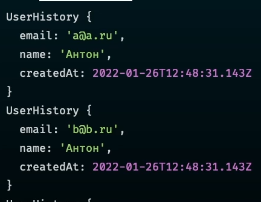

### 104 Builder

Паттерн билдера часто используется, например, в контрактах, когда нам нужно передать от пользователя параметры на изображение (тип фото, высота, ширина) и получить от системы фотографию в нужном формате. 

Основным отличием метода билдера является то, что он чейнебл - его можно вызвать много раз друг за другом. То есть объект вызывает метод build и возвращает изменённого себя


И вот пример билдера, который всегда подгоняет данные под нужную структуру объекта. Это даёт нам возможность создать объект, который мы можем спокойно передавать через АПИ.

```TS
// Форматы изображений
enum ImageFormat {  
    PNG = 'png',  
    JPEG = 'jpeg',  
}  

// Параметры изображений
interface IResolution {  
    width: number,  
    height: number  
}  

// Объединение формата и разрешения изображений
interface IImageConversion extends IResolution {  
    format: ImageFormat  
}  

// Класс для создания объекта
class ImageBuilder {  
    // Создаём переменные, которые будут хранить параметры изображений и сразу присваиваем им массив, чтобы мы могли запушить в них данные извне
    private formats: ImageFormat[] = [];  
    private resolutions: IResolution[] = [];  

	// Реализация для PNG
    addPng() {  
        // includes - >ES2016  
        if (this.formats.includes(ImageFormat.PNG)) {  
            return this;  
        }        
        this.formats.push(ImageFormat.PNG);  
        return this;  
    }  

	// Реализация для JPEG
    addJpeg() {  
        if (this.formats.includes(ImageFormat.JPEG)) {  
            return this;  
        }        
        this.formats.push(ImageFormat.JPEG);  
        return this;  
    }  

	// Добавляет для изображений параметры размеров
    addResolution(width: number, height: number) {  
        this.resolutions.push({ width, height });  
        return this;  
    }  

	// Конечный метод, который преобразует наши данные в нужный формат
    build(): IImageConversion[] {  
        const res: IImageConversion[] = [];  
        for (const r of this.resolutions) {  
            for (const f of this.formats) {  
                res.push({  
                    format: f,  
                    height: r.height,  
                    width: r.width  
                });  
            }  
        }  
        return res;  
    }  
}  

// Вызов создания объекта
console.log(  
    new ImageBuilder()  
        .addJpeg()  
        .addPng()  
        .addResolution(100, 50)  
        .addResolution(200, 100)  
        .build()  
)
```


>[!info] Когда использовать паттерн?
>- Всегда, когда нам нужно создать сложный объект и не задумываться над его обязательными свойствами (чтобы, например, передать его через АПИ на бэк или фронт)
>- При тестировании приложения 

## Структурные паттерны

#Patterns #Bridge #Facade #Adapter #Proxy #Composite

### 105 Вводное видео

- ==Мост== - построение мостов между двумя различными типизациями классов
- ==Фасад== - скрывает реализацию за собой
- ==Адаптер== - позволяет вставить новый объект в существующий код
- ==Прокси== - позволяет добавить логику перед нашим классом
- ==Композит== - упрощает работу с древовидными структурами кода
- ==Декоратор==

### 106 Bridge

Проблема: 
Нам нужно реализовать уведомления, которые будут приходить либо в телегу, либо в whatsapp. Так же уведомления могут быть мгновенные, либо отложенные. Расширение логики приведёт к тому, что классов для реализации функционала придётся делать больше в геометрической прогрессии


Мы имеем основной класс `NotificationSender` и через метод `provider` взаимодействуем с интерфейсом `IProvider`, который уже влияет на провайдеров. Это позволяет через композицию решить проблему с реализацией взаимодействия


И вот пример реализации паттерна, где у нас в отправителе сообщений присутствует метод-мост, который опирается на интерфейс провадера. Мы можем обращаться к любому провайдеру ровно потому, что уже имеем определённый интерфейс, через который будет осуществляться взаимодействие

```TS
// Интерфейс провайдера, через который будет осуществляться взаимодействие между сендером и провайдерами
interface IProvider {  
    sendMessage(message: string): void;  
    connect(config: unknown): void;  
    disconnect(): void;  
}  
  
// Реализация двух провайдеров  
class TelegramProvider implements IProvider {  
    sendMessage(message: string): void {  
        console.log(message);  
    }  
  
    connect(config: string): void {  
        console.log(config);  
    }  
  
    disconnect(): void {  
        console.log('Disconnected TG');  
    }  
}  
  
class WhatsUpProvider implements IProvider {  
    sendMessage(message: string): void {  
        console.log(message);  
    }  
  
    connect(config: string): void {  
        console.log(config);  
    }  
  
    disconnect(): void {  
        console.log('Disconnected WU');  
    }  
}  
  
// Реализация класса по отравке сообщения  
class NotificationSender {  
    // Принимает определённого провайдера, которые реализованы выше  
    constructor(private provider: IProvider) {  
    }  
    send() {  
        // И пользуется методами этого провайдера  
        this.provider.connect('connect');  
        this.provider.sendMessage('message');  
        this.provider.disconnect();  
    }  
}  
  
// Реализация отложенного отправления сообщения  
class DelayNotificationSender extends NotificationSender {  
    constructor(provider: IProvider) {  
        super(provider);  
    }  

	// Отправка с задержкой
    sendDelayed() {  
    }
}  
  
// Вызов сендеров  
const senderTG = new NotificationSender(new TelegramProvider());  
senderTG.send();  
  
const senderWU = new NotificationSender(new WhatsUpProvider());  
senderWU.send();
```


### 107 Facade

У нас есть реализация большого количества действий при отправке того же сообщения: отправка сообщения на сервер, запись в БД, логирование сообщения, отправка уведомления пользователю


Чтобы легко реализовывать определённые задачи и каждый раз не прописывать все действия вручную, можно создать класс, который скроет всю реализацию и станет прослойкой для реализации быстрой отправки того же сообщения


Реализация паттерна фасада, где класс композиционирует все остальные класса, чтобы предоставить пользователю единый интерфейс для реализации нужной задачи

```TS
// Класс, который отвечает за оповещение
class Notify {  
    send(template: string, to: string) {  
        console.log(`Отправляю ${template} к ${to}`)  
    }  
}  

// Логирование
class Log {  
    log(message: string) {  
        console.log(message);  
    }  
}  

// Шаблонизатор  
class Template {  
	// Хранилище шаблонов (БД)
    private templates = [  
        { name: 'other', template: '<h1>Шаблон</h1>>' },  
    ];  

	
    getByName(name: string) {  
        return this.templates.find(t => t.name === name);
    }  
}  

// И сам фасад, который скрывает все остальные методы, чтобы с ними не работать
class NotificationFacade {  
    private notify: Notify;  
    private logger: Log;  
    private template: Template;  
  
    constructor() {  
        this.notify = new Notify();  
        this.template = new Template();  
        this.logger = new Log();  
    }  
  
    send(to: string, templateName: string) {  
        const data = this.template.getByName(templateName);  
        if (!data) {  
            this.logger.log('Не найден шаблон');  
            return;  
        }        
        this.notify.send(data.template, to);  
        this.logger.log('Шаблон отправлен');  
    }  
}  

// Использование  
const s = new NotificationFacade();  
s.send('a@a.ru', 'other'); // Есть только этот метод
```


### 108 Adapter

Паттерн ==Адаптер== позволяет подготовить сходу неподходящий объект к использованию в нашем коде. 
Самый простой пример из жизни: нам нужно воткнуть USB 3.0 в Type-C. Сделать это просто так не получится и поэтому нам нужно использовать переходик - адаптер.

Пример: нам нужно адаптировать все вызовы KVDatabase к персистентной БД


Решается проблема через адаптор, который расширяется от нашей БД и через конструктор прокидывается к нашей персистентной БД 

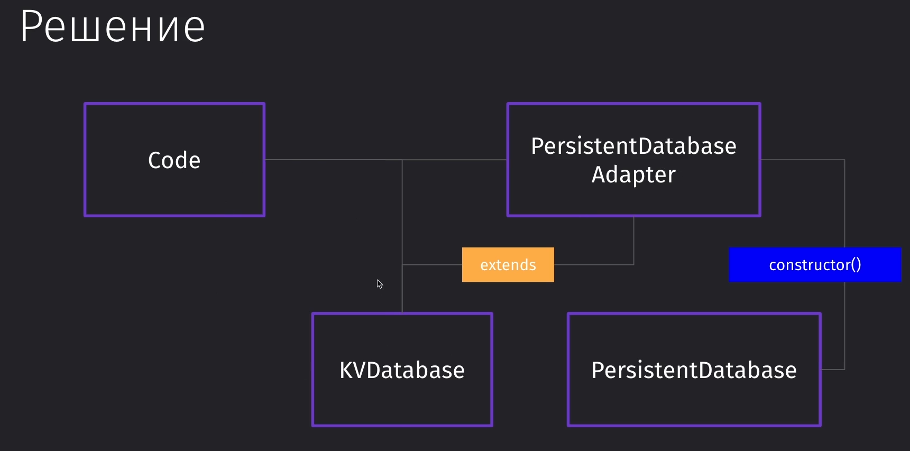

```TS
class KVDatabase {  
    private db: Map<string, string> = new Map();  
  
    save(key: string, value: string) {  
        this.db.set(key, value);  
    }  
}  
  
class PersistentDB {  
    savePersistent(data: Object) {  
        console.log(data);  
    }  
}  
  
// Сам адаптер  
class PersistentDBAdapter extends KVDatabase {  
    // Конструктор принимает в себя ту ДБ, под которую мы адаптируемся  
    constructor(public database: PersistentDB) {  
        super();  
    }  
  
    override save(key: string, value: string): void {  
        this.database.savePersistent({ key, value});  
    }  
}  
  
// Создаём функцию, которая умеет работать только с KVDatabase  
function run(base: KVDatabase) {  
    base.save('key', 'myValue')  
}  
  
// Код работает, так как PersistentDBAdapter экстендит PersistentDB  
run(new PersistentDBAdapter(new PersistentDB()));
```


>[!info] Этот паттерн используется для адаптации приложения к работе с другими, внешними, полезными библиотеками, которые приложение по умолчанию не сможет поддерживать

### 109 Proxy

Паттерн прокси позволяет нам настроить доступность к определённым участкам кода и к определённой функциональности.

У нас есть определённое АПИ для работы с платежами. Мы можем с ним работать из кода. Однако перед нами встаёт задача, что нам нужно ограничить возможность работы с АПИ, чтобы управлять доступом к нему.

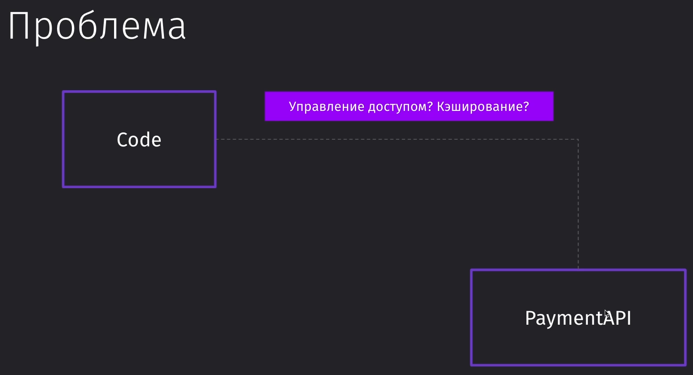

Решить проблему мы можем через внедрение зависимости от PaymentAPIProxy и влиять на АПИ платежей через этот прокси. И в этом прокси мы можем кэшировать запросы, проверять доступ к этим запросам и т.д.

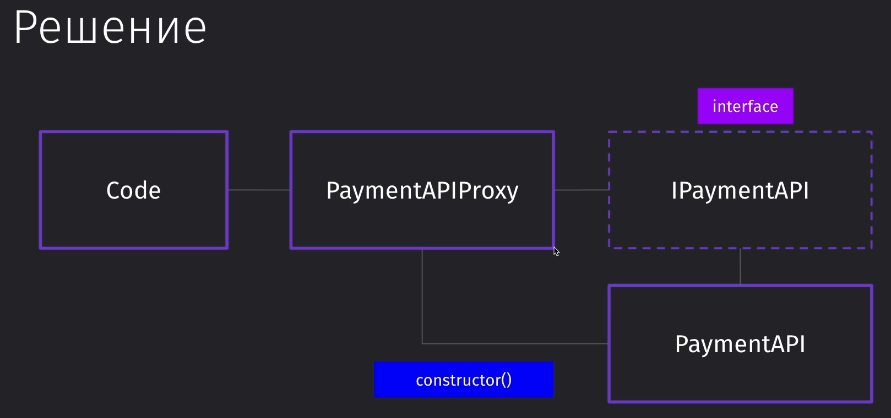

```TS
// Интерфейс АПИ оплаты
interface IPaymentAPI {  
    getPaymentDetail(id: number): IPaymentDetail | undefined;  
}  

// Интерфейс данных оплаты
interface IPaymentDetail {  
    id: number;  
    sum: number;  
}  
  
// АПИ оплаты  
class PaymentAPI implements IPaymentAPI {  
    private data = [{ id: 1, sum: 10000}];  
  
    // Кэширование  
    getPaymentDetail(id: number): IPaymentDetail | undefined {  
        return this.data.find(d => d.id === id);  
    }  
}  
  
// Это прокси, который ограничит получение данных  
class PaymentAccessProxy implements IPaymentAPI {  
    constructor(private api: PaymentAPI, private userId: number) {  
    }  
    // Получение данных о платеже  
    getPaymentDetail(id: number): IPaymentDetail | undefined {  
        if (this.userId === 1) {  
            return this.api.getPaymentDetail(id);  
        }        
        console.log('Попытка получить данные платежа!');  
        return undefined;  
    }  
}  
  
// Пользователь, который может получить данные  
const proxyAccess = new PaymentAccessProxy(new PaymentAPI(), 1);  
console.log(proxyAccess.getPaymentDetail(1));  
  
// И пользователь, которому уже не доступны данные  
const proxyUnaccess = new PaymentAccessProxy(new PaymentAPI(), 2);  
console.log(proxyUnaccess.getPaymentDetail(1));
```


>[!info] Этот паттерн может быть полезен, когда нам нужно добавить дополнительные настройки логики над существующим функционалом в программе

### 110 Composite

Паттерн композит позволяет нам объединить большие блоки кода в такую последовательность, где мы сможем от родителей элементов проводить воздействие на эти компоненты

Пример: нам нужно получить общую стоимость товаров. В магазине может быть как один небольшой товар, так и сразу группа товаров


Решить нашу проблему мы можем через создание отдельного интерфейса, который будет хранить в себе общие методы для получения информации из всех элементов. То есть он нам даст одинаковые функции получения стоимости для всех сущностей-родителей


```TS
// Наш абстрактный класс, который определяет методы всем его дочерним элементам  
abstract class DeliveryItem {  
    // Массив корзины  
    item: DeliveryItem[] = [];  
  
    // Добавить элемент в корзину   
	addItem(item:DeliveryItem) {  
        this.item.push(item);  
    }  
  
    // Получение цены из корзины  
    getItemPrices(): number {  
        return this.item.reduce((acc: number, item: DeliveryItem) => {  
            return acc += item.getPrice()  
        }, 0);  
    }  
  
    // У каждого элемента своя реализация получения цены  
    abstract getPrice(): number;  
}  
  
// Магазин  
class DeliveryShop extends DeliveryItem {  
    constructor(private deliveryFee: number) {  
        super();  
    }  
  
    getPrice(): number {  
        return this.getItemPrices() + this.deliveryFee;  
    }  
}  
  
// Упаковка для товаров - корзина  
class Package extends DeliveryItem {  
    getPrice(): number {  
        return this.getItemPrices();  
    }  
}  
  
// Единичный продукт  
class Product extends DeliveryItem {  
    // В который передаём цену  
    constructor(private price: number) {  
        super();  
    }  
  
    // И который возвращает цену в родительский элемент  
    getPrice(): number {  
        return this.price;  
    }  
}  
  
// Создаём магазин товаров  
const shop = new DeliveryShop(100);  
shop.addItem(new Product(1000));  
  
// Создаём первую корзину товаров  
const pack1 = new Package();  
pack1.addItem(new Product(200));  
pack1.addItem(new Product(300));  
shop.addItem(pack1);  
  
// Создаём вторую корзину товаров const pack2 = new Package();  
pack2.addItem(new Product(30));  
shop.addItem(pack2);  
  
// И просто аккумулируем все цены в одном магазине  
console.log(shop.getPrice()); // 1630
```

>[!info] Данный паттерн используется тогда, когда нам нужно работать с древовидными структурами, вложенными друг в друга

## Поведенческие паттерны

#Patterns #Mediator #ChainOfCommand #Command #Strategy #Iterator #TemplateMethod #Observer 

### 111 Вводное видео

Поведенческие паттерны решают проблемы взаимодействия элементов внутри системы

==Chain of Command== - построение цепочки команд, которые обрабатывают полученное значение и передают его друг за другом
==Mediator== - организация взаимодействия между несколькими компонентами, которые должны быть сильно связаны друг с другом и позволяет модерировать эти взаимодействия
==Command== - позволяет вывести часть логики в команды. Организует работу объектов не напрямую друг на другом, а в команде 
==State== - позволяет работать с состоянием объекта
==Strategy== - реализация наборов стратегий, которые взаимозаменяются на лету
==Iterator== - позволяет реализовать итерирование по древовидным структурам
==Template Method== - задание шаблонного метода с набором последовательных шагов, которые потом могут применяться к различным схожим системам
==Observer== - мы подписываемся на определённый элемент в коде и получаем уведомление об его изменении

### 112 Chain of Command

Это паттерн, который разбивает логику выполнения промежуточных и необязательных команд на отдельную функциональность. 

Мы внешний запрос, который приходит к нам в обработчик. Мы понимаем, что нам нужно произвести авторизацию данных, а затем ещё и валидацию получаемых данных

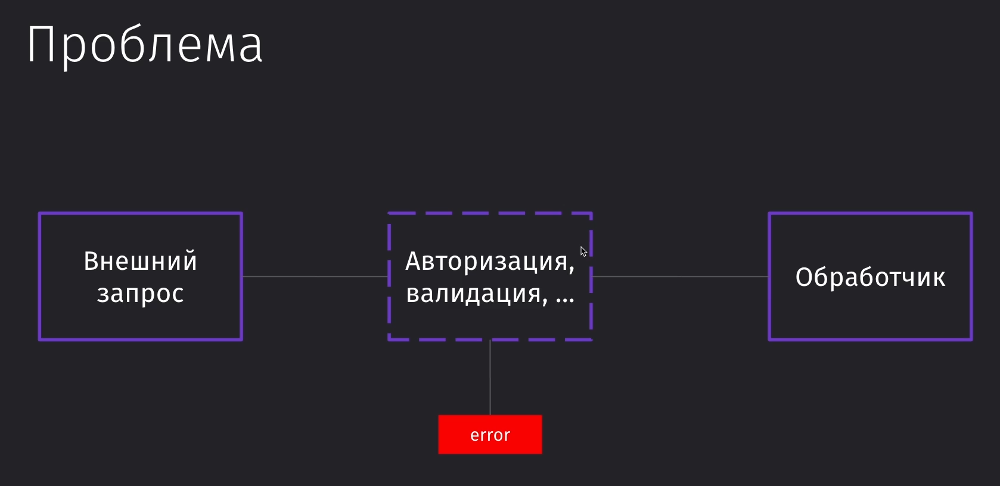

Решение представляет из себя реализацию middleware компонентов, которые будут обрабатывать получаемые данные


```TS
interface IMiddleware {  
    next(mid: IMiddleware): IMiddleware;  
    handle(request: any): any;  
}  
  
abstract class AbstractMiddleware implements IMiddleware {  
    private nextMiddleware: IMiddleware;  
  
    next(mid: IMiddleware): IMiddleware {  
        this.nextMiddleware = mid;  
        return mid;  
    }  
  
    handle(request: any): any {  
        if (this.nextMiddleware) {  
            return this.nextMiddleware.handle(request);  
        }        
        return;
    }  
}  
  
// Первый обработчик для авторизации  
class AuthMiddleware extends AbstractMiddleware {  
    override handle(request: any): any {  
        console.log('AuthMiddleware');  
        if (request.userId === 1) {  
            return super.handle(request);  
        }       
        return { error: 'Вы не авторизованы' };  
    }  
}  
  
// Второй обработчик для валидации  
class ValidateMiddleware extends AbstractMiddleware {  
    override handle(request: any): any {  
        console.log('ValidateMiddleware');  
        if (request.body) {  
            return super.handle(request);  
        }        
        return { error: 'Нет body' };  
    }  
}  
  
// Ну и сам контроллер, который будет возвращать сообщение об успешном запросе  
class Controller extends AbstractMiddleware {  
    override handle(request: any): any {  
        console.log('Controller');  
        return { success: request };  
    }  
}  
  
const controller = new Controller();  // Контроллер
const validate = new ValidateMiddleware();  // Валидация
const auth = new AuthMiddleware();  // Аутентификация

// Раздельный вызов нужных нам запросов
auth.next(validate).next(controller);  
  
console.log(auth.handle({  
    userId: 3 // Вы не авторизованы  
})); // Вызов без body  
  
console.log(auth.handle({  
    userId: 1,  
    body: 'I am OK!',  
})); // Успешный вызов
```


>[!info] Стоит такой подход использовать, если нам нужно сделать код более модульным и разделить обязанности выполнения внутри него (если нам будет не нужен определённый функционал)

### 113 Mediator

Данный паттерн встречается в основном на фронте, чтобы два разрозненных компонента могли знать друг о друге 

`EventHandler` должен знать о `Notification`. `Notification` должен уметь логировать и кешировать. В свою очередь, кэширование должно знать о логах.  


Медиатор (посредник) представляет из себя управляющего оркестром, при котором все элементы знают друг о друге


И вот реализация композиции медиатора:

```TS
// Представление медиатора  
interface Mediator {  
    notify(sender: string, event: string): void;  
}  
  
// Представление медиатора  
abstract class Mediated {  
    mediator: Mediator;  
    setMediator(mediator: Mediator) {  
        this.mediator = mediator;  
    }  
}  
  
// Уведомление  
class Notifications {  
    send() {  
        console.log('Отправляю уведомление')  
    }  
}  
  
// Логирование  
class Log {  
    log(message: string) {  
        console.log(message);  
    }  
}  
  
class EventHandler extends Mediated {  
    myEvent() {  
        this.mediator.notify('EventHandler', 'myEvent');  
    }  
}  
  
// Медиатор уведомления  
class NotificationMediator implements Mediator {  
    // Объединяет в композицию все остальные элементы  
    constructor(  
        public notifications: Notifications,  
        public logger: Log,  
        public handler: EventHandler  
    ) {  
    }
    
    notify(sender: string, event: string): void {  
        switch (event) {  
            case 'myEvent':  
                this.notifications.send(); // Отправляю уведомление  
                this.logger.log('Отправлено'); // Отправлено  
	            break;  
        }    
    }  
}  
  
const handler = new EventHandler(); // Инициализируем наш хэндлер  
const logger = new Log(); // Инициализируем логгер  
const notifications = new Notifications(); // Инициализируем уведомления  
  
// Создаём композицию медиатора со всеми компонентами  
const mediator = new NotificationMediator(  
    notifications,  
    logger,  
    handler  
);  
handler.setMediator(mediator); // Устанавливаем в хэндлер медиатор  
handler.myEvent(); // Уведомление
```

### 114 Command

Это один из самых частоиспользуемых паттернов в программировании как фронта (смена стейтов), так и в бэке (CQRS)

Мы имеем контроллер, сокеты и сихронизацию, которые каждый раз дёргают UserService. Однако нам нужно реализовать логирование, откат пользователей, очередь определённых задач или отложенное добавление данных (чтобы не перенагружать сервис). Чтобы сделать это, мы могли бы добавить часть этой реализации в каждый из классов

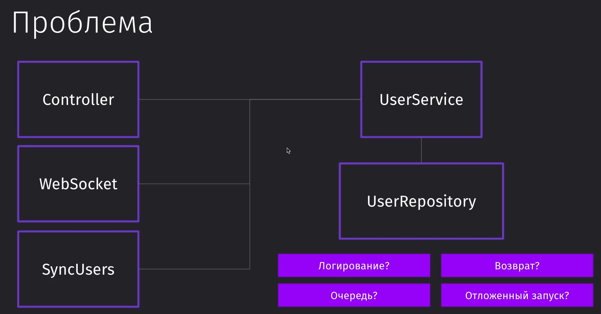

Однако можно воспользоваться более простым способом решения проблемы: создать один класс, который выполнял бы все задачи


И вот так реализуется паттерн команды

```TS
// Самый обычный пользователь - абстрактные данные  
class User {  
    constructor(public userId: number) {  
    }
}  
  
// Класс, который отвечает за сохранение команд в историю  
class CommandHistory {  
    // БД истории  
    public commands: Command[] = [];  
  
    // Пуш в историю  
    push(command: Command) {  
        this.commands.push(command);  
    }  
  
    // И удаление команды из истории  
    remove(command: Command) {  
        this.commands = this.commands.filter(
	        c => c.commandId !== c.commandId
	    );  
    }  
}  
  
// Абстрактная команда  
abstract class Command {  
    // Идентификатор команды  
    public commandId: number;  
  
    // Присвоение команды в историю для возможности отката  
    constructor(public history: CommandHistory) {  
        this.commandId = Math.random();  
    }  
  
    // Проводит операцию над пользователем  
    abstract execute(): void;  
}  
  
// Команда для добавления пользователей  
class AddUserCommand extends Command {  
    constructor(  
        private user: User, // Сам пользователь  
        private receiver: UserService, // Получатель  
        public history: CommandHistory // Хранилище истории  
    ) {  
        super(history);  
    }  
  
    execute(): void {  
        this.receiver.saveUser(this.user); // Сохранение пользователя  
        this.history.push(this); // Пуш в историю  
    }  
  
    // Отмена добавления пользователя  
    undo() {  
        this.receiver.deleteUser(this.user.userId);  
        this.history.remove(this);  
    }  
}  
  
class UserService {  
    saveUser(user: User): void {  
        console.log(`Сохраняю пользователя с ID ${user.userId}`);  
    }  
  
    deleteUser(userId: number): void {  
        console.log(`Удаляю пользователя с ID ${userId}`);  
    }  
}  
  
class Controller {  
    receiver: UserService;  
    history: CommandHistory = new CommandHistory();  
  
    // Добавление получателя отправляемых данных  
    addReceiver(receiver: UserService) {  
        this.receiver = receiver;  
    }  
  
    // Запуск контроллера передачи данных  
    run() {  
        const addUserCommand = new AddUserCommand(  
            new User(1),  
            this.receiver,  
            this.history  
        );  
        addUserCommand.execute(); // Выполнение команды  
        console.log(addUserCommand.history);  
        addUserCommand.undo(); // Откат только что выполненного действия  
        console.log(addUserCommand.history);  
    }  
}  
  
const controller = new Controller();  
controller.addReceiver(new UserService()); // Получатель данных  
controller.run(); // Запуск обработки команды
```


>[!info] Это самый рекомендуемый паттерн к использованию, так как его часто можно встретить в высоконагруженных сервисах.

### 115 State

Паттерн State определяет, как мы можем работать с состоянием определённой логики в приложении. 

Тут показан пример реализации состояний прямо внутри документа и подобное представление в CRM


Вместо того, чтобы хранить все состояния внутри нашего документа, мы можем в документ добавить ссылку на текущее состояние. Логика переходов между состояниями реализуется в самих классах состояния элемента


Так выглядит реализация состояний документа в процессе жизненного цикла статей

```TS
// Сам наш документ  
class DocumentItem {  
    public text: string; // Текст документа  
    private state: DocumentItemState; // Статус документа  
  
    // При создании документ попадает в драфт    
    constructor() {  
        this.setState(new DraftDocumentItemState());  
    }  
  
    // Получение статуса документа  
    getState() {  
        return this.state;  
    }  
  
    // Установка статуса документа  
    setState(state: DocumentItemState) {  
        this.state = state;  
    }  
  
    // Публикация документа  
    publishDoc() {  
        this.state.publish(); // Публикуем документ  
        // Нужно указать контекст для DocumentItem, чтобы оно нормально работало        
        this.state.setContext(this);  
    }  
  
    // Удаление документа  
    deleteDoc() {  
        this.state.delete();  
    }  
}  
  
// Абстрактное представление статуса документа  
abstract class DocumentItemState {  
    public name: string;  
    public item: DocumentItem;  
  
    public setContext(item: DocumentItem) {  
        this.item = item;  
    }  
  
    public abstract publish(): void;  
    public abstract delete(): void;  
}  
  
// Статус документа - драфт  
class DraftDocumentItemState extends DocumentItemState{  
    constructor() {  
        super();  
        this.name = "DraftDocument";  
    }  
  
    // Публикация переведёт документ в статус опубликованного  
    publish(): void {  
        console.log(`На сайт отправлен текст ${this.item.text}`);  
        this.item.setState(new PublishDocumentItemState());  
    }  
  
    // Удаление драфта  
    delete(): void {  
        console.log('Документ удалён');  
    }  
}  
  
// Статус документа - опубликовано  
class PublishDocumentItemState extends DocumentItemState{  
    constructor() {  
        super();  
        this.name = "PublishDocument";  
    }  
  
    // Нельзя опубликовать опубликованный документ  
    publish(): void {  
        console.log('Нельзя опубликовать дважды');  
    }  
  
    // Удаление переводит документ в драфт  
    delete(): void {  
        console.log('Снято с публикации');  
        this.item.setState(new DraftDocumentItemState());  
    }  
}  
  
const item = new DocumentItem(); // Создаём документ  
item.text = 'Мой пост'; // Заполняем текстом  
console.log(item.getState()); // Драфт  
item.publishDoc(); // Публикуем документ  
console.log(item.getState()); // Опубликован  
item.deleteDoc(); // Удаляем документ  
console.log(item.getState()); // Удалён (переведён в драфт)
```


### 116 Strategy

Стратегия подразумевает под собой поиск похожих алгоритмов внутри программы и выделение их в отдельные классы, взаимозаменяя друг друга

Конкретно тут в качестве примера для применения стратегии выделяется ситуация, когда нам нужно реализовать авторизацию. У нас была сначала регистрация через JWT, а потом нам сказали сделать через GitHub, а уже потом добавить через гугл и фэйсбук. Логика авторизации примерно похожа, поэтому нам её нужно собирать.


Решить проблему мы можем через создание интерфейса для определения стратегии и выбора стратегии в этой аутентификации


```TS
// Создаём пользователя с токенами от разных систем
class User {  
    githubToken: string;  
    jwtToken: string;  
}  

// Интерфейс определения стратегии
interface AuthStrategy {  
    auth(user: User): boolean;  
}  

// 
class Auth {  
    constructor(private strategy: AuthStrategy) {  
    }  
    
    // Определение атуентификации
    setStrategy(strategy: AuthStrategy) {  
        this.strategy = strategy;  
    }  

	// Аутентификация пользователя по стратегии
    public authUser(user: User): boolean {  
        return this.strategy.auth(user);  
    }  
}  

//   Стратегия для аутентификации через JSWT
class JSWTStrategy implements AuthStrategy {  
    auth(user: User): boolean {  
        if (user.jwtToken) {  
            return true;  
        }        return false;  
    }  
}  

// Стратегия для аутентификации через GitHub
class GithubStrategy implements AuthStrategy {  
    auth(user: User): boolean {  
        if (user.githubToken) {  
            return true;  
        }        return false;  
    }  
}  

//  
const user = new User();  // Создание пользователя
user.jwtToken = 'token';  // Определение токена
const auth = new Auth(new JSWTStrategy()); // Аутентификация по стратегии 
console.log(auth.authUser(user)); 
auth.setStrategy(new GithubStrategy());  // Меняем стратегию
console.log(auth.authUser(user));
```

### 117 Iterator

Паттерн итератор позволяет нам выполнять определённые задачи по определённому нами приоритету

Мы имеем систему, в которой мы имеем определённые задачи, которые нужно решать по степени их важности и, желательно, связанно друг с другом


Решить проблему мы можем через явное задание тасклиста, который содержит в себе таски. К тасклисту будет обращаться итератор и выполнять сначала приоритетные таски, а затем малоприоритетные (в позиции по убыванию)


```TS
// Отдельная задача  
class Task {  
    constructor(public priority: number) {  
    }
}  
  
// Список отдельных задач  
class TaskList {  
    private tasks: Task[] = [];  

	// Сортировка тасков по приоритету
    public sortByPriority() {  
        this.tasks = this.tasks.sort((a, b) => {  
             if (a.priority > b.priority) {  
                 return 1;  
             } else if (a.priority === b.priority) {  
                 return 0;  
             } else {  
                 return -1;  
             }  
        });  
    }  

	// Добавление таска
    public addTask(task: Task): void {  
        this.tasks.push(task);  
    }  

	// Получение таска
    public getTask(): Task[] {  
        return this.tasks;  
    }  

	// Количество тасков
    public count(task: Task): number {  
        return this.tasks.length;  
    }  

	// Создание итератора тасков
    public getIterator() {  
        return new PriorityTaskIterator(this);  
    }  
}  
  
// Интерфейс итератора с его методами  
interface IIterator<T> {  
    current(): T | undefined;  
    next(): T | undefined;  
    prev(): T | undefined;  
    index(): number;  
}  
  
// Итератор тасков по приоритету  
class PriorityTaskIterator implements IIterator<Task> {  
    private position: number = 0; // Индекс элемента  
    private taskList: TaskList; // Ссылка на тасклист  
  
    // Сортирует тасклист по приоритету и сохраняет его в свою логику    
    constructor(taskList: TaskList) {  
        taskList.sortByPriority();  
        this.taskList = taskList;  
    }  
  
    // Выводит нынешний таск  
    current(): Task | undefined {  
        return this.taskList.getTask()[this.position];  
    }  
  
    // Выводит индекс таска  
    index(): number {  
        return this.position;  
    }  
  
    // Выводит следующий таск  
    next(): Task | undefined {  
        this.position += 1;  
        return this.taskList.getTask()[this.position];  
    }  
  
    // Выводит предыдущий таск  
    prev(): Task | undefined {  
        this.position -= 1;  
        return this.taskList.getTask()[this.position];  
    }  
}  
  
// Создание тасклиста  
const taskList = new TaskList();  
// Добавление тасков в тасклист  
taskList.addTask(new Task(8));  
taskList.addTask(new Task(1));  
taskList.addTask(new Task(3));  
// Создание итератора  
const iterator = taskList.getIterator();  
// Результат работы итератора  
console.log(iterator.current());  
console.log(iterator.next());  
console.log(iterator.next());  
console.log(iterator.prev());  
console.log(iterator.index());
```


### 118 Template Method

Паттерн шаблона говорит нам об абстрагировании повторяющейся логики

Конкретно мы имеем такую проблему: нам из формы нужно отправить данные в два разных АПИ, логика которых схожа, но немного отличается


Чтобы не городить дублирование кода в самой форме, мы можем сделать отдельный абстрактный класс, который будет за нас хранить в себе логику отправки данных на разные АПИ. Единственное, что нужно будет сделать из формы - это вызвать SaveForm, что крайне удобно 


```TS
// Сама форма с данными  
class Form {  
    constructor(public name: string) {  
    }
}  
  
// Абстрактный класс, который опишет логику поведения работы с АПИ  
abstract class SaveForm<T> {  
    public save(form: Form) {  
        const res = this.fill(form);  
        this.log(res);  
        this.send(res);  
    }
    protected abstract fill(form: Form): T;  
    protected log(data: T): void {  
        console.log(data);  
    }  
    protected abstract send(data: T): void;  
}  
  
// Первое АПИ  
class FirstAPI extends SaveForm<string> {  
    protected fill(form: Form): string {  
        return form.name;  
    }  
  
    protected send(data: string): void {  
        console.log(`Отправляем ${data}`);  
    }  
}  
  
// Второе АПИ  
class SecondAPI extends SaveForm<{fio: string}> {  
    protected fill(form: Form): {fio: string} {  
        return { fio: form.name };  
    }  
  
    protected send(data: {fio: string}): void {  
        console.log(`Отправляем ${data}`);  
    }  
}  
  
const form1 = new FirstAPI(); // Создаём новую форму  
form1.save(new Form('Алек')); // Помещаем в неё данные  
  
const form2 = new SecondAPI(); // Инициализируем второе АПИ  
form2.save(new Form('Алек')); // Вкладываем в него форму
```


>[!info] Используем этот паттерн, когда мы имеем одинаковые шаги в логике, но они отличаются немного в реализации

### 119 Observer

Паттерн обсёрвера подразумевает под собой то, что мы создаём класс, который уведомляет другую логику о том, что ей нужно выполниться (например, выполнять функцию при срабатывании ивентлистенера) 

Конкретно тут нужно сделать так, чтобы лид сервис отправлял уведомления пользователю о новых действиях лида 


Решить проблему можно через создание отдельных обсёрверов со своим нотифаем под каждый сервис. А так же нужно задать нашего лида в качестве субъекта


```TS
// Это интерфейс объекта, который на что-то подписался  
interface Observer {  
    // Это метод, который срабатывает каждый раз, когда его дёрнули  
    update(subject: Subject): void;  
}  
  
// Субъект эммитит события и на него можно подписаться  
interface Subject {  
    // Подписка на событие  
    attach(observer: Observer): void;  
  
    // Отписка  
    detach(observer: Observer): void;  
  
    // Уведомление - его вызывает внешний код при срабатывании  
    notify(): void;  
}  
  
// Это новый пользователь  
class Lead {  
    constructor(public name: string, public phone: string) {  
    }
}  
  
// Это наш конкретный субъект  
class NewLead implements Subject {  
    private observers: Observer[] = []; // Подписчики  
    public state: Lead;
    
    attach(observer: Observer): void {  
        if (this.observers.includes(observer)) {  
            return;  
        }        
        this.observers.push(observer);  
    }  
  
    detach(observer: Observer): void {  
        const observerIndex = this.observers.indexOf(observer);  
        if (observerIndex !== -1) return;  
        this.observers.splice(observerIndex, 1);  
    }  
  
    notify(): void {  
        for (const observer of this.observers) {  
            // Передаём this, чтобы передать как стейт, так и сабджект  
            observer.update(this);  
        }    
    }  
}  
  
// Сервис уведомления пользователя  
class NotificationService implements Observer {  
    update(subject: Subject): void {  
        console.log(`NotificationService получил уведомление: ${subject}`);  
    }  
}  
  
// Уведомление сервиса  
class LeadService implements Observer {  
    update(subject: Subject): void {  
        console.log(`LeadService получил уведомление: ${subject}`);  
    }  
}  
  
const subject = new NewLead(); // Создание субъекта  
subject.state = new Lead('Антон', '00000'); // В него помещаем сам объект  
const sub1 = new NotificationService(); // Первый сервис уведомления  
const sub2 = new LeadService(); // Второй сервис уведомления  
  
subject.attach(sub1); // Подписка  
subject.attach(sub2); // Подписка  
  
subject.notify(); // Уведомление  
subject.detach(sub1); // Отписка  
subject.notify(); // Уведомление
```


## Проект - утилита выполнения команд

### 120 Вводное видео

С помощью [FFmpeg](https://ffmpeg.org/) будет реализована утилита для конвертирования видео в нужный формат

### 121 Обзор проекта

Основная проблема: чтобы написать конфиг для рендера видео в нужный нам формат, нужно потратить крайне много времени и сил


Поэтому хочется сделать простой интерфейс, в который мы зададим только основные параметры и получим на выходе нужное нам видео


И так же в самом перспективном варианте нужно будет сделать так, чтобы приложение под капотом выполняло и другие задачи пользователя по выбору (от других инструментов)


### 122 Наивная реализация

Первым делом нужно добавить библиотеку, которая позволит реализовать вывод нужных нам вопросов в консоль и получить эти данные

```bash
npm i inquirer
npm i @types/inquirer
```

И вот представлен пример реализации программы в 43 строчки кода. Это функция, которая принимает в себя в первой части ввод пользовательских данных, во второй выполняет саму внутреннюю логику, а в третьей выдаёт логи о результатах выполнения. 

Однако нужно ещё и сказать про большое количество неудобств, вызыванных такой быстрой реализацией:
1) У нас ограниченный набор настроек . В `res` мы задали их только под один конкретный случай - выбор разрешения у видео (без возможностей добавить то же сжатие)
2) Разделение зависимостей прямо внутри программы. У нас она состоит из получения данных от пользователя, обработки этих данных и логов
3) Изменение этих зависимостей. Если нам нужно изменить или дополнить логику для них (например, добавить уведомление в телеграм)

```TS
import { spawn } from 'child_process';  
import inquirer from 'inquirer';  
  
(async function convert() {  
    // ! Первая часть - пользовательский ввод  
    // Спросит про ввод ширины  
    const { result: width } = await inquirer.prompt([{  
        type: 'number',  
        name: 'result',  
        message: 'Ширина'  
    }]);  
    // Спросит про ввод высоты  
    const { result: height } = await inquirer.prompt([{  
        type: 'number',  
        name: 'result',  
        message: 'Высота'  
    }]);  
    // Вводим путь  
    const { result: path } = await inquirer.prompt([{  
        type: 'input',  
        name: 'result',  
        message: 'Путь'  
    }]);  
    // Спросит про название выходного файла  
    const { result: name } = await inquirer.prompt([{  
        type: 'input',  
        name: 'result',  
        message: 'Название'  
    }]);  
  
    // ! Вторая часть - логика программы  
    // Генерация самой команды для ffmpeg  
    // Spawn - нод-утилита для генерации процесса  
    const res = spawn('ffmpeg', [  
        '-i', path,  
        '-c:v', 'libx264',  
        '-s', `${width}x${height}`,  
        path + name + '.mp4'  
    ]);  

	// ! Третья часть - обработка параметров
    // Получаем чанк данных и выводим их в консоль  
    res.stdout.on('data', (data: any) => {  
        console.log(data.toString());  
    });  
    // Выводит сообщение об ошибке  
    res.stderr.on('data', (data: any) => {  
        console.log(data.toString());  
    });  
    // Выводит сообщение об окончании процесса  
    res.on('close', () => {  
        console.log('Готово');  
    });  
}());
```

>[!warning] Однако, если посмотреть на эту программу с точки зрения микросервиса, то нам будет просто необходимым добавление абстракций, потому что расширять проект будет просто невозможно без них

### 123 Старт приложения

>[!note] Если в голову сразу не приходит архитектура приложения, то сначала можно написать наивную реализацию этого приложения 

Будем использовать Template Method для реализации однотипных задач - работа с Ansible, FFmpeg и т.д.
Построение команды - builder


И на изображении показана структура проекта и его разделения. Всё будет собираться под одной оболочкой - App.


Создаём проект
```bash
mkdir command-executer // создаём папку
cd command-executer // переходим в неё

npm init // инициализируем проект в ноде

npm i -g typescript // устанавливаем ТС
tsc --init // инициализируем ТС

git init // Инициализируем гит
```
Добавляем гитигнор
```gitignore
/build  
/node_modules
```
Настраиваем пути компиляции
```json
//tsconfig
"rootDir": "./src",
"outDir": "./dist",
```
Устанавливаем пакет для работы с запросами
```bash
npm i inquirer
npm i -D @types/inquirer
```
Примерно так выглядит пакет


### 124 Обработка ввода

Примерно так выглядит проект на данном этапе реализации программы


И вот внутренний код

```TS
// prompt.types.ts
// Тут мы храним типы, которые будут использоваться в наших сервисах
export type PromptType = 'input' | 'number' | 'password';

// prompt.service.ts
// Тут мы будем реализовывать логику сервиса ввода данных 
import inquirer from 'inquirer';  
import { PromptType } from "./prompt.types";  
  
export class PromptService {  
	// Инпут делаем дженериком, чтобы мы могли точно сразу определить тип того значения, которое мы передаём в данную функцию
    public async input<T>(message: string, type: PromptType) {  
        const { result } = await inquirer.prompt<{ result: T }>([  
            {  
                type,  
                name: 'result',  
                message  
            }  
        ]);  
        return result;  
    }  
}


// App.ts
// Конкретно тут мы собираем всю нашу логику приложения и запускаем его
import { PromptService } from "./core/prompt/prompt.service";  
  
export class App {  
    async run() {  
        const result = await (new PromptService()).input<number>('Число', 'number');  
        console.log(result);  
    }  
}  
  
const app = new App();  
app.run();
```

### 125 Обработка вывода

Нам нужны типы ==node.js==

```bash
npm i -D @types/node
```

Код самого ввода:

```TS

// stream-logger.interface.ts
// Хранит интерфейс логгера потоков
export interface IStreamLogger {  
    log(...args: any[]): void;  
    error(...args: any[]): void;  
    end(): void;  
}

// stream.handler.ts
// Реализация ввода данных через node.js

import { IStreamLogger } from "./stream-logger.interface";  
import {ChildProcessWithoutNullStreams} from "child_process";  
  
export class StreamHandler {  
    constructor(private logger: IStreamLogger) {  }  

	// Конкретно тут поток имеет тип из ноды, а именно поток без отсутствующих значений
    processOutput(stream: ChildProcessWithoutNullStreams) {  
        stream.stdout.on('data', (data: any) => {  
            this.logger.log(data);  
        })  
  
        stream.stdout.on('data', (data: any) => {  
            this.logger.error(data);  
        })  
  
        stream.on('close', () => {  
            this.logger.end();  
        });  
    }  
}
```

### 126 Упражнение - Консольный вывод

Реализация консольного вывода в приложении. Тут так же можно дорасширить его, добавив вывод в телеграмме

```TS
import { IStreamLogger } from "../../core/handlers/stream-logger.interface";  
  
// Реализация вывода в приложении - реализован через синглтон  
export class ConsoleLogger implements IStreamLogger {  
    // Хранит инстанс класса  
    private static logger: ConsoleLogger;  
    // Возвращает инстанс класса  
    public static getInstance(): ConsoleLogger {  
        // Если его нет, то создаёт  
        if (!ConsoleLogger.logger) {  
            ConsoleLogger.logger = new ConsoleLogger();  
        }        // Если есть, то вернёт имеющийся  
        return ConsoleLogger.logger;  
    }  
  
    // Выводы результатов запросов:  
    end(): void {  
        console.log('Готово');  
    }  
  
    error(...args: any[]): void {  
        console.log(...args);  
    }  
  
    log(...args: any[]): void {  
        console.log(...args);  
    }  
  
}
```

### 127 Упражнение - Шаблонный метод исполнителя

Нам нужно реализовать абстрактный ==Command Executor==, который последовательно должен представлять выполнение четырёх действий: ввод, построение команды, запуск потока, обработка потока 

```TS
// command.types.ts
// Интерфейс комманд
export interface ICommandExec {  
    command: string;  
    args: string[];  
}

// command.executer.ts

import {IStreamLogger} from "../handlers/stream-logger.interface";  
import {ChildProcessWithoutNullStreams} from "child_process";  
import {ICommandExec} from "./command.types";  
  
export abstract class CommandExecutor<Input> {  
    constructor(private logger: IStreamLogger) {  
    }  
    public async execute() {  
        const input = await this.prompt();  
        const command = this.build(input);  
        const stream = this.spawn(command);  
        this.processStream(stream, this.logger);  
    }  
  
    protected abstract prompt(): Promise<Input>;  
  
    protected abstract build(input: Input): ICommandExec;  
  
    protected abstract spawn(command: ICommandExec): ChildProcessWithoutNullStreams;  
  
    protected abstract processStream(stream: ChildProcessWithoutNullStreams, logger: IStreamLogger): void;  
}

```

### 128 Упражнение - Builder для ffmpeg

Конкретно тут мы должны будем реализовать команду, которая будет содержать финализированный набор наших опций для отдельного элемента - ffmpeg-рендера

Конкретно нам нужно построить команду, которая будет хранить статичное значение и вводимые нами данные 


В конфиге тайпскрипта нам нужно отключить необходимость инициализировать значения через конструктор (для использования паттерна билдер)

```JSON
// typescript.config
"strictPropertyInitialization": false,
```

Этот класс будет отвечать за создание билдера запроса в ffmpeg на рендер видео

```TS
// ffmpeg.builder.ts
export class FfmpegBuilder {  
    private inputPath: string;  
    private options: Map<string, string> = new Map();  
  
    constructor() {  
        this.options.set('-c:v', 'libx264');  
    }  
  
    input(inputPath: string): this {  
        this.inputPath = inputPath;  
        return this;  
    }  
  
    setVideoSize(width: number, height: number): this {  
        this.options.set('-s', `${1920}x${1080}`);  
        return this;  
    }  
  
    output(outputPath: string): string[] {  
        if (!this.inputPath) {  
            throw new Error('Не задан input');  
        }        const args: string[] = ['-i', this.inputPath];  
        this.options.forEach((value, key) => {  
            args.push(key);  
            args.push(value);  
        });  
        args.push(outputPath);  
        return args;  
    }  
}
```

И в теории можно вызвать этот код так:

```TS
new FfmpegBuilder()  
    .input('')  
    .setVideoSize(1920, 1080)  
    .output('///');
```

### 129 Работа с файлами

Дальше нам нужно реализовать код, который будет выполнять сбор путей, их билд и спавн. 
Дальше мы сможем окончательно дореализовать ffmpeg

```TS
// file.service.ts

import { join, dirname, isAbsolute } from "path";  
import {promises} from "fs";  
  
export class FileService {  
    private async isExist(path: string): Promise<boolean> {  
        try{  
            await promises.stat(path);  
            return true;  
        } catch {  
            return false;  
        }    
    }  
  
    public getFilePath(path: string, name: string, extension: string): string {  
        if (!isAbsolute(path)) {  
            path = join(__dirname + '/' + path);  
        }        return join(dirname(path) + '/' + name + '.' + extension);  
    }  
  
    async deleteFileIfExists(path: string, name: string) {  
        if (await this.isExist(path)) {  
            promises.unlink(path);  
        }    
    }  
}
```

### 130 Упражнение - Ffmpeg executor

И дальше нам нужно реализовать executer, который будет исполнять наши логи

```TS
// ffmpeg-types.ts
import {ICommandExec} from "../../core/executor/command.types";  
  
export interface IFfmpegInput {  
    width: number;  
    height: number;  
    path: string;  
    name: string;  
}  
  
export interface ICommandExecFfmpeg extends ICommandExec {  
    output: string;  
}


// ffmpeg.executer.ts

import {CommandExecutor} from "../../core/executor/command.executor";  
import {IFfmpegInput, ICommandExecFfmpeg} from "./ffmpeg-types";  
import {IStreamLogger} from "../../core/handlers/stream-logger.interface";  
import {FileService} from "../../core/files/file.service";  
import {PromptService} from "../../core/prompt/prompt.service";  
import {ChildProcessWithoutNullStreams, spawn} from "child_process";  
import {FfmpegBuilder} from "./ffmpeg.builder";  
import {StreamHandler} from "../../core/handlers/stream.handler";  
  
export class FfmpegExecutor extends CommandExecutor<IFfmpegInput> {  
    private fileService: FileService = new FileService();  
    private promptService: PromptService = new PromptService();  
  
    constructor(logger: IStreamLogger) {  
        super(logger);  
    }  
  
    // Вызов ввода  
    protected async prompt(): Promise<any> {  
        const width = await this.promptService.input<number>('Ширина', 'number');  
        const height = await this.promptService.input<number>('Высота', 'number');  
        const path = await this.promptService.input<string>('Путь до файла', 'input');  
        const name = await this.promptService.input<string>('Имя файла', 'input');  
  
        return {width, height, path, name};  
    }  
  
    protected build({ width, height, path, name }: IFfmpegInput): ICommandExecFfmpeg {  
        const output = this.fileService.getFilePath(path, name, 'mp4');  
        const args = (new FfmpegBuilder())  
            .input(path)  
            .setVideoSize(width, height)  
            .output(output);  
        return { command: 'ffmpeg', args, output }  
    }  
    protected spawn({ output, command, args}: ICommandExecFfmpeg): ChildProcessWithoutNullStreams {  
        this.fileService.deleteFileIfExists(output);  
        return spawn(command, args);  
    }  
  
    protected processStream(stream: ChildProcessWithoutNullStreams, logger: IStreamLogger): void {  
        const handler = new StreamHandler(logger);  
        handler.processOutput(stream);  
    }  
}
```

### 131 Финал проекта

Вот так в конечном итоге выглядит архитектура проекта:


Это структура нашего проекта:
- Все вызываемые команды (ffmpeg, dir) находятся в commands
- Вся основная реализация проекта (идентичная для всех команд) находится в папке ==core== 
- В ==out== располагается инструмент вывода у программы
- Через ==App.ts== у нас идёт запуск проекта (==App.js== нужно врубать в консоли)


Вот так выглядит ==App.ts==, через который вызывается весь наш проект:

```TS
// App.ts
import {FfmpegExecutor} from "./commands/ffmpeg/ffmpeg.executor";  
import {ConsoleLogger} from "./out/console-logger/console-logger";
  
  
export class App {  
    async run() {  
        await new FfmpegExecutor(ConsoleLogger.getInstance()).execute(); 
        }  
}  
  
const app = new App();  
app.run();
```


Так же очень легко можно дописать дополнительную реализацию Dir-утилиты

```TS
// dir.types.ts

export interface DirInput {  
    path: string;  
}

// dir.builder.ts

export class DirBuilder {  
    private options: Map<string, string> = new Map();  
  
    detailOutput() {  
        this.options.set('-l', '');  
        return this;  
    }  
  
    output(): string[] {  
        const args: string[] = [];  
        this.options.forEach((value, key) => {  
            args.push(key);  
            args.push(value);  
        });  
        return args;  
    }  
}

// dir.executor.ts

import {CommandExecutor} from "../../core/executor/command.executor";  
import {DirInput} from "./dir.types";  
import {PromptService} from "../../core/prompt/prompt.service";  
import {IStreamLogger} from "../../core/handlers/stream-logger.interface";  
import {ICommandExec} from "../../core/executor/command.types";  
import {ChildProcessWithoutNullStreams, spawn} from "child_process";  
import {DirBuilder} from "./dir.builder";  
import {StreamHandler} from "../../core/handlers/stream.handler";  
  
export class DirExecutor extends CommandExecutor<DirInput> {  
    private promptService: PromptService = new PromptService();  
  
    constructor(logger: IStreamLogger) {  
        super(logger);  
    }  
  
    protected build({path}: DirInput): ICommandExec {  
        const args = (new DirBuilder()).detailOutput().output();  
        return { command: 'ls', args: args.concat(path) };  
    }  
  
    protected processStream(stream: ChildProcessWithoutNullStreams, output: IStreamLogger): void {  
        const handler = new StreamHandler(output);  
        handler.processOutput(stream);  
    }  
  
    protected async prompt(): Promise<DirInput> {  
        let path = await this.promptService.input<string>('Путь', 'input');  
        return { path };  
    }  
  
    protected spawn({command: command, args}: ICommandExec): ChildProcessWithoutNullStreams {  
        return spawn(command, args);  
    }  
}
```

Вот так выглядит изменённый ==App.ts==, в котором находится вызов теперь не FFmpeg, а Dir-утилиты

```TS
// App.ts
import {ConsoleLogger} from "./out/console-logger/console-logger";  
import {DirExecutor} from "./commands/dir/dir.executor";  
  
  
export class App {  
    async run() {  
        // Либо мы можем подставить реализацию другой логики при первой необходимости  
        await new DirExecutor(ConsoleLogger.getInstance()).execute();  
    }  
}  
  
const app = new App();  
app.run();
```

И вот так коротко выглядят эти различные команды:


## Типизация в библиотеках

#React #TypeScript 

### React + TS

#### Первый компонент. Типизация пропсов. Interface CardProps

Для типизации пропсов создаётся отдельный файл, в котором находятся все типы компонента

Конкретно тут мы описываем тот объект с пропсами, который попадает в наш компонент с помощью интерфейса

Для описания того объекта, который передаётся между тегами (`<Tag>Этот объект</Tag>`) используется типизация свойства `children`, который имеет тип `ReactNode` 

`components > Card > CardProps.ts`
```TS
import { ReactChild, ReactNode } from 'react';

export interface ICardProps {
	children: ReactNode | ReactChild;
	width: string;
	height: string;
}
```

Далее при создании компонента нужно просто тому объекту, который передаётся деструктуризированным в качестве пропса присвоить тип в виде имени интерфейса

`components > Card > Card.tsx`
```TSX
import React from 'react';
import { ICardProps } from './CardProps';

const Card = ({ children, width, height }: ICardProps) => {
	return (
		<div style={{width, height, backgroundColor: 'cyan'}}>
			{children}
		</div>
	);
};

export default Card;
```

И теперь компилятор будет подсказывать, какие свойства обязательно должны быть переданы в компонент

`components > App > App.tsx`
```TSX
import React from 'react';
import Card from '../Card/Card';

const App = () => {
	return (
		<div>
			<Card width={'400px'} height={'400px'}>
				<button>Workink!</button>
			</Card>
		</div>
	);
};

export default App;
```


#### React.FunctionComponent. React.FC

Если передаваемое свойство пропса имеет всего несколько фиксированных значений, то под них стоит выделить `enum` (перечисление). 

Типизация пропса-функции выглядит просто как: `(arg: type) => returnType`

`components > Card > CardProps.ts`
```TS
import { ReactChild, ReactNode } from 'react';

export enum CardVariant {
	OUTLINED = 'outlined',
	PRIMARY = 'primary',
}

export interface ICardProps {
	children: ReactNode | ReactChild;
	width: string;
	height: string;
	variant: CardVariant;
	onClick: () => void;
}
```

И более правильным вариантом для типизации самой функции и пропса, который она принимает, является использование `FunctionComponent<IПропс>` - эта запись покажет, что константа хранит функцию компонента с дженериком в виде его пропсов

`components > Card > Card.tsx`
```TSX
import React, { FunctionComponent } from 'react';
import { CardVariant, ICardProps } from './CardProps';

const Card: FunctionComponent<ICardProps> = ({ children, width, height, variant, onClick }) => {
	return (
		<div
			style={{
				width,
				height,
				backgroundColor: variant === CardVariant.OUTLINED ? 'lightgray' : 'cyan',
				border: variant === CardVariant.OUTLINED ? '1px solid black' : 'none',
			}}
			onClick={onClick}
		>
			{children}
		</div>
	);
};

export default Card;
```

Так же `FunctionComponent` имеет сокращённый вариант записи в виде `FC<>`

Ну и так же сама функция возвращает `JSX.Element` - это тоже можно указать

`components > App > App.tsx`
```TSX
import React from 'react';
import Card from '../Card/Card';
import { CardVariant } from '../Card/CardProps';

const App: FC = (): JSX.Element => {
	return (
		<div>
			<Card
				width={'400px'}
				height={'400px'}
				variant={CardVariant.OUTLINED}
				onClick={() => console.log('Card')}
			>
				<button>Workink!</button>
			</Card>
		</div>
	);
};

export default App;
```


#### Компонент UserList. IUser, IAddress

Так же все глобальные сущности, которые используются сразу в нескольких компонентах, принято выносить отдельно в папку `types` 

`types > index.ts`
```TS
export interface IAddress {
	street: string;
	city: string;
	zipcode: string;
}

export interface IUser {
	id: number;
	name: string;
	email: string;
	address: IAddress;
}
```

И в одних интерфейсах спокойно можно использовать другие интерфейсы для описания принимаемых значений

`components > UserList > UserListProps.ts`
```TS
import { IUser } from '../../types';

export interface IUserList {
	users: IUser[];
}
```

И так выглядит вывод нескольких персонажей

`components > UserList > UserList.tsx`
```TSX
import React, { FC } from 'react';
import { IUserList } from './UserListProps';

const UserList: FC<IUserList> = ({ users }) => {
	return (
		<div>
			{users.map((user) => (
				<div key={user.id} style={{ padding: 15, border: '1px solid gray' }}>
					{user.id}. {user.name} ({user.email}) проживает в {user.address.city}/
					{user.address.street}
				</div>
			))}
		</div>
	);
};

export default UserList;
```

А тут происходит передача моковых данных в компонент списка пользователей

`components > App > App.tsx`
```TSX
import React, { useState } from 'react';
import Card from '../Card/Card';
import { CardVariant } from '../Card/CardProps';
import UserList from '../UserList/UserList';
import { IUser } from '../../types';

const App: FC = (): JSX.Element => {
	const users: IUser[] = [
		{
			id: 1,
			name: 'Antony',
			email: 'slice@ya.ru',
			address: { city: 'Penza', street: 'Value Street', zipcode: '123' },
		},
		{
			id: 2,
			name: 'Alexy',
			email: 'alexy.su@ya.ru',
			address: { city: 'Penza', street: 'Value Street', zipcode: '321' },
		},
	];

	return (
		<div>
			<Card
				width={'400px'}
				height={'400px'}
				variant={CardVariant.OUTLINED}
				onClick={() => console.log('Card')}
			>
				<button>Workink!</button>
			</Card>
			<UserList users={users} />
		</div>
	);
};

export default App;
```


#### Компонент UserItem.

Тут мы создаём отдельный `UserItem`, который используется для вывода в `UserList`

`components > UserItem > UserItemProps.tsx`
```TS
import { IUser } from '../../types';

export interface IUserItemProps {
	user: IUser;
}
```

`components > UserItem > UserItem.tsx`
```TSX
import React, { FC } from 'react';
import { IUserItemProps } from './UserItemProps';

const UserItem: FC<IUserItemProps> = ({ user }) => {
	return (
		<div key={user.id} style={{ padding: 15, border: '1px solid gray' }}>
			{user.id}. {user.name} ({user.email}) проживает в {user.address.city}/
			{user.address.street}
		</div>
	);
};

export default UserItem;
```

`components > UserList > UserList.tsx`
```TSX
const UserList: FC<IUserList> = ({ users }) => {
	return (
		<div>
			{users.map((user) => (
				<UserItem user={user} />
			))}
		</div>
	);
};
```

#### Типизация запроса axios. Типизация хука useState()

Все запросы axios типизируются через дженерик `axios.get<Тип>()`

Примерно таким же образом выглядит типизация хука состояния, однако тут ещё в него нужно заранее поместить смежный с данными тип (`null`, `[]`): `useState<IUsers[]>([])`

`components > App > App.tsx`
```TSX
import React, { FC, useEffect, useState } from 'react';
import Card from '../Card/Card';
import { CardVariant } from '../Card/CardProps';
import UserList from '../UserList/UserList';
import { IUser } from '../../types';
import axios from 'axios';

const App: FC = (): JSX.Element => {
	const [users, setUsers] = useState<IUser[]>([]);

	async function fetchUsers() {
		try {
			const response = await axios.get<IUser[]>('https://jsonplaceholder.typicode.com/users');
			setUsers(response.data);
		} catch (e) {
			console.error(e);
		}
	}

	useEffect(() => {
		fetchUsers();
	}, []);

	return (
		<div>
			<Card
				width={'400px'}
				height={'400px'}
				variant={CardVariant.OUTLINED}
				onClick={() => console.log('Card')}
			>
				<button>Workink!</button>
			</Card>
			<UserList users={users} />
		</div>
	);
};

export default App;
```


#### Переиспользуемый компонент List. Generics, Обобщенные типы в typescript

Создадим ещё один глобальный интерфейс тудушки

`types > index.ts`
```TS
export interface ITodo {
	id: number;
	title: string;
	completed: boolean;
}
```

И создадим общий компонент, который будет принимать в себя массив элементов динамического типа `<T>` и будет принимать в себя функцию для рендера одного элемента 

Данный компонент `List` будет рендерить любой массив элементов, который в него передали. Таким образом, мы создаём компонент с использованием обобщённых типов

`components > List > ListProps.ts`
```TS
import { ReactNode } from 'react';

export interface IListProps<T> {
	items: T[];
	renderItem: (item: T) => ReactNode;
}
```

`components > List > List.tsx`
```TSX
import React, { FC } from 'react';
import { IListProps } from './ListProps';

export default function List<T>(props: IListProps<T>) {
	return <div>{props.items.map(props.renderItem)}</div>;
}
```

Тут мы создаём компонент с отдельной тудушкой

`components > TodoItem > TodoItemProps.tsx`
```TS
import { ITodo } from '../../types';

export interface ITodoItemProps {
	todo: ITodo;
}
```

`components > TodoItem > TodoItem.tsx`
```TSX
import React, { FC } from 'react';
import { ITodoItemProps } from './TodoItemProps';

const TodoItem: FC<ITodoItemProps> = ({ todo }) => {
	return (
		<div>
			<input type='checkbox' checked={todo.completed} />
			{todo.id}. {todo.title}
		</div>
	);
};

export default TodoItem;
```

А тут уже подставляем компонент `List` для обоих массивов списков (персонажей и тудушек)

`components > App > App.tsx`
```TSX
import React, { FC, useEffect, useState } from 'react';
import Card from '../Card/Card';
import { CardVariant } from '../Card/CardProps';
import { ITodo, IUser } from '../../types';
import axios from 'axios';
import List from '../List/List';
import UserItem from '../UserItem/UserItem';
import TodoItem from '../TodoItem/TodoItem';
import './App.css';

const App: FC = (): JSX.Element => {
	const [users, setUsers] = useState<IUser[]>([]);
	const [todos, setTodos] = useState<ITodo[]>([]);

	async function fetchUsers() {
		try {
			const response = await axios.get<IUser[]>('https://jsonplaceholder.typicode.com/users');
			setUsers(response.data);
		} catch (e) {
			console.error(e);
		}
	}

	async function fetchTodos() {
		try {
			const response = await axios.get<ITodo[]>(
				'https://jsonplaceholder.typicode.com/todos?_limit=10',
			);
			setTodos(response.data);
		} catch (e) {
			console.error(e);
		}
	}

	useEffect(() => {
		fetchUsers();
		fetchTodos();
	}, []);

	return (
		<div className={'wrapper'}>
			<Card
				width={'400px'}
				height={'400px'}
				variant={CardVariant.OUTLINED}
				onClick={() => console.log('Card')}
			>
				<button>Workink!</button>
			</Card>
			<List
				items={users}
				renderItem={(user: IUser) => <UserItem user={user} key={user.id} />}
			/>
			<List
				items={todos}
				renderItem={(todo: ITodo) => <TodoItem todo={todo} key={todo.id} />}
			/>
		</div>
	);
};

export default App;
```


#### Типизация событий. MouseEvents, DragEvents, ChangeEvents

>[!warning] Очень важно в начале указать, что все ивенты нужно доставать из **React**, потому что зачастую по умолчанию они достаются из **DOM**

Для атрибута `onChange` в TS присвоен тип `ChangeEvent<T>`, который в качестве дженерик-типа принимает тот тег, к которому применяется типизация

Для всех событий drag и drop используется один тип:
- `onDrag` - `DragEvent`
- `onDrop` - `DragEvent`
- `onDragOver` - `DragEvent`
- `onDragLeave` - `DragEvent`

`components > EventsEx > EventsEx.tsx`
```TSX
import React, { ChangeEvent, EventHandler, FC, useState } from 'react';

const EventsEx: FC = (): JSX.Element => {
	const [value, setValue] = useState<string>('');
	const [isDrag, setIsDrag] = useState<boolean>(false);

	// будет записывать в стейт значение из инпута
	const changeHandler = (e: React.ChangeEvent<HTMLInputElement>) => {
		setValue(e.target.value);
	};

	// будет выводить стейт в консоль
	const clickHandler = (e: React.MouseEvent<HTMLButtonElement>) => {
		console.log(value);
	};

	// при попытке драга, будет выводиться лог в консоль
	const dragHandler = (e: React.DragEvent<HTMLDivElement>) => {
		console.log('DRAG');
	};

	// будет срабатывать при 
	const dropHandler = (e: React.DragEvent<HTMLDivElement>) => {
		e.preventDefault();
		setIsDrag(false);
		console.log('DROP');
	};

	const leaveHandler = (e: React.DragEvent<HTMLDivElement>) => {
		e.preventDefault();
		setIsDrag(false);
		console.log('LEAVE');
	};

	const dragWithPreventHandler = (e: React.DragEvent<HTMLDivElement>) => {
		e.preventDefault();
		setIsDrag(true);
		console.log('DRAG OVER');
	};

	return (
		<div>
			<input type='text' value={value} onChange={changeHandler} />
			<button onClick={clickHandler}>Button</button>
			<div
				onDrag={dragHandler}
				draggable
				style={{
					width: 200,
					height: 200,
					backgroundColor: 'pink',
					margin: '15px 0px 15px 0px',
				}}
			></div>
			<div
				// сработает при попытке дропа в блок
				onDrop={dropHandler}
				// сработает, когда мы покинем блок
				onDragLeave={leaveHandler}
				// при нахождении внутри блока
				onDragOver={dragWithPreventHandler}
				style={{ width: 200, height: 200, backgroundColor: isDrag ? 'pink' : 'blue' }}
			></div>
		</div>
	);
};

export default EventsEx;
```

Введённая строка из инпута при нажатии на кнопку попадает в консоль


А уже тут при драге первого блока на второй меняется цвет последнего 


#### Типизация хука useRef. Неуправляемый компонент

`useRef` принимает внутрь дженерика тип элемента, с которым он взаимодействует

`components > EventsEx > EventsEx.tsx`
```TSX
import React, { ChangeEvent, EventHandler, FC, useRef, useState } from 'react';

const EventsEx: FC = (): JSX.Element => {
	const [value, setValue] = useState<string>('');
	const [isDrag, setIsDrag] = useState<boolean>(false);

	const inputRef = useRef<HTMLInputElement>(null);

	// будет выводить стейт в консоль
	const clickHandler = (e: React.MouseEvent<HTMLButtonElement>) => {
		console.log(inputRef.current?.value);
	};

	/// CODE ...

	return (
		<div>
			<input ref={inputRef} type='text' placeholder={'Неуправляемый'} />
			<input type='text' value={value} onChange={changeHandler} placeholder={'Управляемый'} />
			
			/// CODE ...

		</div>
	);
};
```


### Типизация react-router-dom. UseHistory, useParams, BrowserRouter

Далее нам нужно будет реализовать многостраничность с помощью `react-router-dom` библиотеки

Для начала, нужно в `UserItem` установить обязательным наличие функции `onClick`, с помощью которой дальше мы будем навигироваться через `useNavigate` и переходить на страницу отдельного пользователя

`components > UserItem > UserItemProps.ts`
```TSX
import { IUser } from '../../types';

export interface IUserItemProps {
	user: IUser;
	onClick: (user: IUser) => void;
}
```

`components > UserItem > UserItem.tsx`
```TSX
import React, { FC } from 'react';
import { IUserItemProps } from './UserItemProps';

const UserItem: FC<IUserItemProps> = ({ user, onClick }) => {
	return (
		<div
			onClick={() => onClick(user)}
			key={user.id}
			style={{ padding: 15, border: '1px solid gray' }}
		>
			{user.id}. {user.name} ({user.email}) проживает в {user.address.city}/
			{user.address.street}
		</div>
	);
};

export default UserItem;
```

Это главная страница, с которой можно перейти на нужные ссылки

`components > pages > MainPage.tsx`
```TSX
import React, { FC } from 'react';
import { Link } from 'react-router-dom';

const MainPage: FC = () => {
	return (
		<div>
			<Link to={'/users'}>Пользователи</Link>
			<Link to={'/todos'}>Тудушки</Link>
		</div>
	);
};

export default MainPage;
```

Это компонент страницы с тудушками

`components > pages > TodosPage.tsx`
```TSX
import React, { FC, useEffect, useState } from 'react';
import { ITodo } from '../../types';
import axios from 'axios';
import TodoItem from '../TodoItem/TodoItem';
import List from '../List/List';

const TodosPage: FC = () => {
	const [todos, setTodos] = useState<ITodo[]>([]);

	async function fetchTodos() {
		try {
			const response = await axios.get<ITodo[]>(
				'https://jsonplaceholder.typicode.com/todos?_limit=10',
			);
			setTodos(response.data);
		} catch (e) {
			console.error(e);
		}
	}

	useEffect(() => {
		fetchTodos();
	}, []);

	return (
		<List items={todos} renderItem={(todo: ITodo) => <TodoItem todo={todo} key={todo.id} />} />
	);
};

export default TodosPage;
```


Это компонент списка пользователей

Тут уже задаём при клике по элементу списка навигирование на отдельную страницу с данными по пользователю 

`components > pages > UsersPage.tsx`
```TSX
import React, { FC, useEffect, useState } from 'react';
import axios from 'axios';
import { IUser } from '../../types';
import UserItem from '../UserItem/UserItem';
import List from '../List/List';
import { useNavigate } from 'react-router-dom';

const UsersPage: FC = () => {
	const [users, setUsers] = useState<IUser[]>([]);

	const navigate = useNavigate();

	async function fetchUsers() {
		try {
			const response = await axios.get<IUser[]>('https://jsonplaceholder.typicode.com/users');
			setUsers(response.data);
		} catch (e) {
			console.error(e);
		}
	}

	useEffect(() => {
		fetchUsers();
	}, []);

	return (
		<List
			items={users}
			renderItem={(user: IUser) => (
				<UserItem onClick={() => navigate(`${user.id}`)} user={user} key={user.id} />
			)}
		/>
	);
};

export default UsersPage;
```

Это компонент отдельной страницы пользователя

`components > pages > UserItemPage.tsx`
```TSX
import React, { FC, useEffect, useState } from 'react';
import { IUser } from '../../types';
import axios from 'axios';
import { Link, useNavigate, useParams } from 'react-router-dom';

interface IUserItemPageParams {
	id: string;
}

const UserItemPage: FC = () => {
	const [user, setUser] = useState<IUser | null>(null);

	// получаем параметры из ссылки
	const params = useParams<keyof IUserItemPageParams>();
	// получаем доступ к функции назначения ссылок на переходы в браузере
	const navigate = useNavigate();

	async function fetchUser() {
		try {
			const response = await axios.get<IUser>(
				'https://jsonplaceholder.typicode.com/users/' + params.id,
			);
			setUser(response.data);
		} catch (e) {
			console.error(e);
		}
	}

	useEffect(() => {
		fetchUser();
	}, []);

	return (
		<div>
			{/* устанавливаем ссылку для возвращения по кнопке */}
			<button onClick={() => navigate('/users')}>back</button>
			<h1>Страница пользователя {user?.name}</h1>
			<h4>Проживает в {user?.address.city}</h4>
		</div>
	);
};

export default UserItemPage;
```

Тут нужно сказать, что `useParams` в дженерик принимает строку с тем ключом, который к нему придёт, поэтому выше используется `keyof` от интерфейса

```TS
type Params = 'a' | 'b' | 'c';
// ...
const params = useParams<Params>();
```

Тут мы уже должны реализовать пути перехода ссылок в приложении

`components > App > App.tsx`
```TSX
import React, { FC } from 'react';
import './App.css';
import { BrowserRouter, Route, Routes } from 'react-router-dom';
import TodosPage from '../pages/TodosPage';
import UsersPage from '../pages/UsersPage';
import MainPage from '../pages/MainPage';
import UserItemPage from '../pages/UserItemPage';
import TodoItemPage from '../pages/TodoItemPage';

const App: FC = (): JSX.Element => {
	return (
		<BrowserRouter>
			<div>
				<Routes>
					<Route path={'/'} element={<MainPage />} />
					<Route path={'/todos'} element={<TodosPage />} />
					<Route path={'/users'} element={<UsersPage />} />
					<Route path={'/users/:id'} element={<UserItemPage />} />
					<Route path={'/todos/:id'} element={<TodoItemPage />} />
				</Routes>
			</div>
		</BrowserRouter>
	);
};

export default App;
```

На главной странице мы имеем две ссылки на разные списки:


Первая ссылка переводит на список пользователей

По каждому отдельному пользователю можно нажать и перейти на его страницу


После перехода на страницу появится краткая информация по пользователю. Кнопка *back* вернёт обратно на список пользователей


---
### Типизация Redux Toolkit / React-Redux

Типизации в индексном файле почти нет

`index.tsx`
```TSX
import React from 'react';
import ReactDOM from 'react-dom/client';
import './index.css';
import App from './App';
import reportWebVitals from './reportWebVitals';

import { Provider } from 'react-redux';
import store from './store';

const root = ReactDOM.createRoot(document.getElementById('root') as HTMLElement);
root.render(
	<Provider store={store}>
		<App />
	</Provider>,
);

reportWebVitals();
```

В самом `store` нужно будет только создать два типа, которые будут переиспользоваться внутри приложения (внутри кастомных хуков, которые будут типизировать стандартные функции `react-redux`)

`store > index.ts`
```TS
import { configureStore } from '@reduxjs/toolkit';
import todoReducer from './todoSlice';

const store = configureStore({
	reducer: {
		todos: todoReducer,
	},
});

export default store;

// RootState будет равен возвращаемому типу из store.getState
// то есть RootState будет принимать в себя ровно тот тип, который хранит объект хранилища
export type RootState = ReturnType<typeof store.getState>;

// тут мы определяем тип диспетча
export type AppDispatch = typeof store.dispatch;
```

Типизация `useDispatch` и `useSelector` занимает достаточно приличное время, и чтобы не типизировать каждый раз хуки из `react-redux`, можно сделать свои кастомные типизированные хуки

`hooks > index.ts`
```TS
// импортируем хуки для создания кастомных хуков
import { useDispatch, useSelector, TypedUseSelectorHook } from 'react-redux';

// импортируем типы из стора
import type { AppDispatch, RootState } from '../store';

// принято добавлять App в кастомные хуки, заменяющие оригинальные хуки библиотеки
export const useAppDispatch = () => useDispatch<AppDispatch>();

// теперь useSelector будет знать всё о структуре нашего приложения
export const useAppSelector: TypedUseSelectorHook<RootState> = useSelector;
```

Так выглядит нетипизированный срез:

`store > todoSlice.js`
```JS
import { createSlice } from '@reduxjs/toolkit';

const todoSlice = createSlice({
	name: 'todos',
	initialState: {
		todos: [],
	},
	reducers: {
		addTodo(state, action) {
			state.todos.push({
				id: new Date().toISOString(),
				title: action.payload.text,
				completed: false,
			});
		},
		toggleComplete(state, action) {
			const toggledTodo = state.todos.find((todo) => todo.id === action.payload.id);
			toggledTodo.completed = !toggledTodo.completed;
		},
		removeTodo(state, action) {
			state.todos = state.todos.filter((todo) => todo.id !== action.payload.id);
		},
	},
});

export const { addTodo, toggleComplete, removeTodo } = todoSlice.actions;

export default todoSlice.reducer;
```

Таким образом мы типизируем срез:

С помощью `PayloadAction` мы можем задать тип приходящего значения в `payload` 

`store > todoSlice.ts`
```TS
import { createSlice, PayloadAction } from '@reduxjs/toolkit';

// типизация addTodo пуша
type Todo = {
	id: string;
	title: string;
	completed: boolean;
};

// типизация initialState
type TodosState = {
	list: Todo[];
};

const initialState: TodosState = { list: [] };

const todoSlice = createSlice({
	name: 'todos',
	initialState,
	reducers: {
		// добавление тудушки
		addTodo(state, action: PayloadAction<string>) {
			state.list.push({
				id: new Date().toISOString(),
				title: action.payload,
				completed: false,
			});
		},
		// переключение выполненности
		toggleComplete(state, action: PayloadAction<string>) {
			const toggledTodo = state.list.find((todo) => todo.id === action.payload);
			// только если элемент toggledTodo не undefined, то поменяем состояние выполненности
			if (toggledTodo) toggledTodo.completed = !toggledTodo.completed;
		},
		// удаление тудушки по id, который приходит в виде строки
		removeTodo(state, action: PayloadAction<string>) {
			state.list = state.list.filter((todo) => todo.id !== action.payload);
		},
	},
});

export const { addTodo, toggleComplete, removeTodo } = todoSlice.actions;

export default todoSlice.reducer;
```

И теперь рут будет всегда знать, что должно находиться внутри него  


Используем вместо хука `useDispatch` наш кастомный типизированный `useAppDispatch()`

`components > TodoItem.tsx`
```TSX
import { useAppDispatch } from '../hooks';
import { toggleComplete, removeTodo } from '../store/todoSlice';
import { FC } from 'react';

interface ITodoItemProps {
	id: string;
	title: string;
	completed: boolean;
}

const TodoItem: FC<ITodoItemProps> = ({ id, title, completed }) => {
	const dispatch = useAppDispatch();

	return (
		<li>
			<input
				type='checkbox'
				checked={completed}
				onChange={() => dispatch(toggleComplete(id))}
			/>
			<span>{title}</span>
			<span onClick={() => dispatch(removeTodo(id))}>&times;</span>
		</li>
	);
};

export default TodoItem;
```

И так же используем вместо `useSelector` типизированную версию `useAppSelector()`

`components > TodoList.tsx`
```TSX
import TodoItem from './TodoItem';  
import { FC } from 'react';  
import { useAppSelector } from '../hooks';  
  
const TodoList: FC = () => {  
   const todos = useAppSelector((state) => state.todos.list);  
  
   return (  
      <ul>{todos.map((todo) => (  
            <TodoItem key={todo.id} {...todo} />  
         ))}  
      </ul>   
	);  
};  
  
export default TodoList;
```

И благодаря тому, что `useAppSelector` знает, что находится внутри стора, то мы всегда можем получить актуальное значение из него (работает автокомплит, видны типы)


Ну и простая типизация компонента:

`components > NewTodoForm.tsx`
```TSX
import { FC } from 'react';

interface INewTodoItemProps {
	value: string;
	updateText: (arg: string) => void;
	handleAction: () => void;
}

const NewTodoForm: FC<INewTodoItemProps> = ({ value, updateText, handleAction }) => {
	return (
		<label>
			<input
				placeholder='new todo'
				value={value}
				onChange={(e) => updateText(e.target.value)}
			/>
			<button onClick={handleAction}>Add todo</button>
		</label>
	);
};

export default NewTodoForm;
```

Тут так же нужно будет передать `payload` вне скобок `{}` и использовать `useAppDispatch()`

`App.tsx`
```TSX
import { useState } from 'react';

import { addTodo } from './store/todoSlice';
import NewTodoForm from './components/NewTodoForm';
import TodoList from './components/TodoList';

import './App.css';
import { useAppDispatch } from './hooks';

function App() {
	const [text, setText] = useState<string>('');
	const dispatch = useAppDispatch();

	const handleAction = () => {
		if (text.trim().length) {
			dispatch(addTodo(text));
			setText('');
		}
	};

	return (
		<div className='App'>
			<NewTodoForm value={text} updateText={setText} handleAction={handleAction} />
			<TodoList />
		</div>
	);
}

export default App;
```

И теперь тудушка работает так, как должна


---
#### Типизация асинхронного Redux Toolkit

Стандартный Thunk в [проекте](https://github.com/michey85/redux-toolkit-todo/blob/asyncthunk/src/store/todoSlice.js) выглядел подобным образом:

`store > todoSlice.js`
```JS
/// CODE ...

export const fetchTodos = createAsyncThunk(
    'todos/fetchTodos',
    async function(_, {rejectWithValue}) {
        try {
	        // делаем запрос на сервер
            const response = await fetch('https://jsonplaceholder.typicode.com/todos?_limit=10');

			// если ответ не океюшный, то выплёвываем ошибку
            if (!response.ok) {
                throw new Error('Server Error!');
            }

			// это наши данные
            const data = await response.json();

			// возвращаем данные
            return data;
        } catch (error) {
	        // в противном случае выплёвываем ошибку
            return rejectWithValue(error.message);
        }
    }
);

/// CODE ...

const todoSlice = createSlice({
    name: 'todos',
    initialState: {
        todos: [],
        status: null,
        error: null,
    },
    reducers: {
        addTodo(state, action) {
            state.todos.push(action.payload);
        },
        toggleComplete(state, action) {
            const toggledTodo = state.todos.find(todo => todo.id === action.payload.id);
            toggledTodo.completed = !toggledTodo.completed;
        },
        removeTodo(state, action) {
            state.todos = state.todos.filter(todo => todo.id !== action.payload.id);
        }
    },
    extraReducers: {
        [fetchTodos.pending]: (state) => {
            state.status = 'loading';
            state.error = null;
        },
        [fetchTodos.fulfilled]: (state, action) => {
            state.status = 'resolved';
            state.todos = action.payload;
        },
        [fetchTodos.rejected]: setError,
        [deleteTodo.rejected]: setError,
        [toggleStatus.rejected]: setError,
    },
});
```

И тут уже типизируем все асинхронные функции редакса:

`store > todoSlice.tsx`
```TSX
import { AnyAction, createAsyncThunk, createSlice, PayloadAction } from '@reduxjs/toolkit';
import { stat } from 'fs';

type Todo = {
	id: string;
	title: string;
	completed: boolean;
};

type TodosState = {
	list: Todo[];
	loading: boolean;
	error: string | null;
};

// запрос на сервер на получение списка задач
// дженерик - то, что получаем с сервера / первый аргумент функции (опции) / типизируем второй аргумент функции Thunk'а (чтобы они были не unknown)
export const fetchTodos = createAsyncThunk<Todo[], undefined, { rejectValue: string }>(
	'todos/fetchTodos',
	async function (_, { rejectWithValue }) {
		const response = await fetch('https://jsonplaceholder.typicode.com/todos?_limit=10');

		if (!response.ok) {
			return rejectWithValue('Server Error!');
		}

		const data = await response.json();

		return data;
	},
);

// удаление задачи
export const deleteTodo = createAsyncThunk<string, string, { rejectValue: string }>(
	'todos/deleteTodo',
	async function (id, { rejectWithValue }) {
		const response = await fetch(`https://jsonplaceholder.typicode.com/todos/${id}`, {
			method: 'DELETE',
		});

		if (!response.ok) {
			return rejectWithValue("Can't delete task. Server error.");
		}

		return id;
	},
);

// переключение статуса задачи
export const toggleStatus = createAsyncThunk<
	Todo,
	string,
	{ rejectValue: string; state: { todos: TodosState } }
>('todos/toggleStatus', async function (id, { rejectWithValue, dispatch, getState }) {
	const todo = getState().todos.list.find((todo) => todo.id === id);

	if (todo) {
		const response = await fetch(`https://jsonplaceholder.typicode.com/todos/${id}`, {
			method: 'PATCH',
			headers: {
				'Content-Type': 'application/json',
			},
			body: JSON.stringify({
				completed: !todo.completed,
			}),
		});

		if (!response.ok) {
			return rejectWithValue("Can't toggle status. Server error.");
		}

		return (await response.json()) as Todo;
	}

	return rejectWithValue('No such todo in list');
});

// добавление нового todo
export const addNewTodo = createAsyncThunk<Todo, string, { rejectValue: string }>(
	'todos/addNewTodo',
	async function (text, { rejectWithValue, dispatch }) {
		const todo = {
			title: text,
			userId: 1,
			completed: false,
		};

		const response = await fetch('https://jsonplaceholder.typicode.com/todos', {
			method: 'POST',
			headers: {
				'Content-Type': 'application/json',
			},
			body: JSON.stringify(todo),
		});

		if (!response.ok) {
			return rejectWithValue("Can't add task");
		}

		// Возвратом от сервера будет одна задача из списка
		return (await response.json()) as Todo;
	},
);

const initialState: TodosState = { list: [], loading: false, error: null };

const todoSlice = createSlice({
	name: 'todos',
	initialState,
	reducers: {},
	// сюда уже стоит передать наши асинхронные редьсюеры
	// тут уже стоит использовать не объект для реализации функций редьюсера, а builder
	extraReducers: (builder) => {
		builder
			.addCase(fetchTodos.pending, ({ error, loading }, action) => {
				loading = true;
				error = null;
			})
			.addCase(fetchTodos.fulfilled, (state, action) => {
				state.list = action.payload;
				state.loading = false;
			})
			.addCase(fetchTodos.rejected, (state, action) => {
				state.loading = false;
				state.error = 'Error';
			})
			.addCase(addNewTodo.pending, (state, action) => {
				state.loading = true;
				state.error = null;
			})
			.addCase(addNewTodo.fulfilled, (state, action) => {
				state.list.push(action.payload);
			})
			.addCase(toggleStatus.fulfilled, (state, action) => {
				const toggleTodo = state.list.find((todo) => todo.id === action.payload.id);
				if (toggleTodo) {
					toggleTodo.completed = !toggleTodo.completed;
				}
			})
			.addCase(deleteTodo.fulfilled, (state, action) => {
				state.list = state.list.filter((todo) => todo.id === action.payload);
			})
			// реализуем reject для всех состояний
			.addMatcher(isError, (state, action: PayloadAction<string>) => {
				state.loading = false;
				state.error = action.payload;
			});
	},
});

// эта функция будет проверять, прилетела ли нам ошибка
function isError(action: AnyAction) {
	return action.type.endsWith('rejected');
}

export default todoSlice.reducer;
```

- Первый тип - это возвращаемое значение из функции
- Второй тип - это тот `action.payload`, который попадает в функцию 
- Третий тип - это те функции, которые мы вытаскиваем из Thunk'а


Теперь нужно тут заменить старый функционал на `toggleStatus` и `deleteTodo`

`components > TodoItem.tsx`
```TSX
import { useAppDispatch } from '../hooks';
import { toggleStatus, deleteTodo } from '../store/todoSlice';
import { FC } from 'react';

interface ITodoItemProps {
	id: string;
	title: string;
	completed: boolean;
}

const TodoItem: FC<ITodoItemProps> = ({ id, title, completed }) => {
	const dispatch = useAppDispatch();

	return (
		<li>
			<input
				type='checkbox'
				checked={completed}
				onChange={() => dispatch(toggleStatus(id))}
			/>
			<span>{title}</span>
			<span onClick={() => dispatch(deleteTodo(id))}>&times;</span>
		</li>
	);
};

export default TodoItem;
```

И тут добавляем новые функции запроса на сервер для получения задач `fetchTodos` и добавления новых задач `addNewTodo`

`App.tsx`
```TSX
import { useEffect, useState } from 'react';

import { fetchTodos, addNewTodo } from './store/todoSlice';
import NewTodoForm from './components/NewTodoForm';
import TodoList from './components/TodoList';

import './App.css';
import { useAppDispatch, useAppSelector } from './hooks';
import { useSelector } from 'react-redux';

function App() {
	const [text, setText] = useState<string>('');
	const { loading, error } = useAppSelector((state) => state.todos);
	const dispatch = useAppDispatch();

	useEffect(() => {
		dispatch(fetchTodos());
	}, [dispatch]);

	const handleAction = () => {
		if (text.trim().length) {
			dispatch(addNewTodo(text));
			setText('');
		}
	};

	return (
		<div className='App'>
			<NewTodoForm value={text} updateText={setText} handleAction={handleAction} />

			{loading && <h2>Loading...</h2>}
			{error && <h2>An error occurred: {error}</h2>}

			<TodoList />
		</div>
	);
}

export default App;
```

И теперь наше приложение полностью построено на асинхронных функциях


