---
tags:
  - edge
---
#Tools #Webpack

## Теги

#полныйконфиг - полная версия конфига ==webpack==

## Написание базового приложения

Этот скрипт реализует функционал отправки сообщения в JSON-формате

`Post.js`

```JS
export default class Post {
   constructor(title, img) {
      this.title = title;
      this.img = img;
      this.date = new Date();
   }

   toString() {
      return JSON.stringify({
         title: this.title,
         date: this.date.toJSON(),
         img: this.img,
      });
   }
}
```

Этот скрипт инициализирует новую отправку сообщения и вывод в консоль

`index.js`

```JS
const post = new Post("Webpack Post Title");

console.log("post to string", post.toString);
```

Уже этот скрипт не связан с работой самого сайта - он считает клики на странице и позволяет нам их вывести в нужный момент

`Analytics.js`

```JS
function createAnalytics() {
   let counter = 0;
   let isDestroyed = false;

   const listener = () => counter++;

   document.addEventListener("click", listener);

   return {
      destroy() {
         document.addEventListener("click", listener);
         isDestroyed = true;
      },
      getClicks() {
         if (isDestroyed) {
            return "Analytics is destroyed";
         }
         return counter;
      },
    };
}

window.analytics = createAnalytics();
```

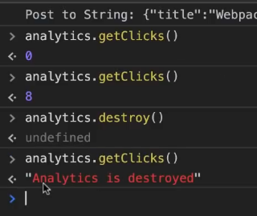

Тут уже в ==правильном порядке== подключаем скрипты и создаём основу сайта

`index.html`

```HTML
<!DOCTYPE html>
<html lang="en">

<head>
   <meta charset="UTF-8">
   <meta http-equiv="X-UA-Compatible" content="IE=edge">
   <meta name="viewport" content="width=device-width, initial-scale=1.0">
   <title>Webpack</title>
   <script src="analytics.js"></script>
</head>

<body>
   <div class="container">
      <h1>WP Course</h1>
   </div>

   <script src="Post.js"></script>
   <script src="index.js"></script>
</body>

</html>
```

> [!warning] А теперь попробуем понять, что с этим приложением не так:
>
> - Нам нужно подключать очень много скриптов в наш `index.html`
> - Нам нужно обязательно учитывать последовательность подключенных скриптов к странице (потому что в неправильном порядке вылезет ошибка)

## Инициализация приложения

Инициализируем ==node==, через который и установим в дальнейшем ==Webpack==

```bash
npm init
```

## Установка Webpack

Устанавливаем ==webpack== для разработки (`-D`)

```bash
npm install -D webpack webpack-cli
```

- webpack

- это
- webpack-cli - это его команды в консоли

## Базовая настройка Webpack

Это минимальный конфиг для запуска webpack

#полныйконфиг
`webpack.config.js`

```JS
// Это модуль, который хранит в себе путь до нашего проекта
const path = require("path");

// WP принимает в себя те опции, которые мы сюда вставим и по ним будет собирать наш проект
module.exports = {
   // Указываем начальный файл нашего проекта, в который и будет всё импортироваться
   entry: "./src/index.js",
   // Параметры вывода webpack
   output: {
      // Имя выводимого файла
      filename: "bundle.js",
      // тут уже указываем: путь до проекта и имя папки, в которую будут компилироваться файлы
      path: path.resolve(__dirname, "dist"), //__dirname - системная переменная, которая указывает на текущее положение
   },
};
```

Команда для единоразового вызова компиляции ==webpack==

```bash
webpack
```

И теперь после подключения выходного файла к `index.html` webpack скомпилирует файл со всеми экспортами и импортами. Первыми в выходном файле всегда идут иммитации экспортов и импортов и сами exports/imports, которые мы делали. Уже только потом идёт сам код.

`index.html`

```HTML
<script src="bundle.js"></script>
```

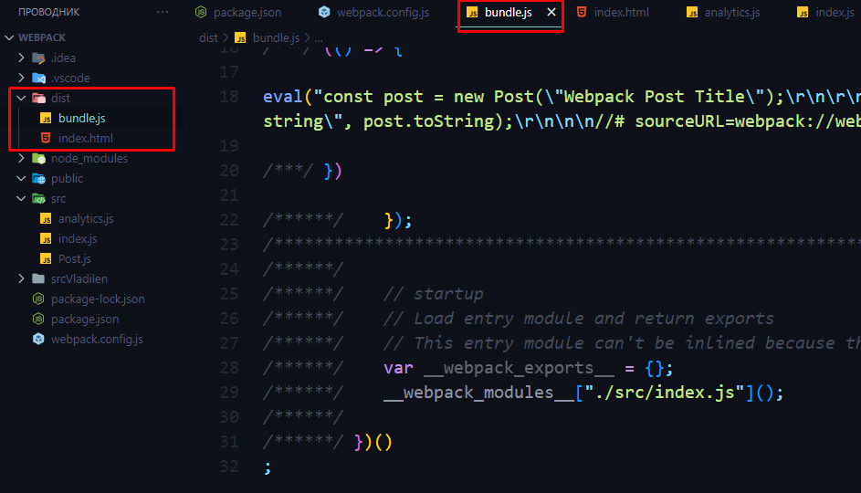

## Паттерны

Но в прошлом варианте у нас выпадал файл `Analytics.js`, так как он не был никак связан через импорты с основной точкой входа. Чтобы исправить ситуацию, можно назначить несколько точек входа (определить несколько чанков) и задать паттерн для имени выводимых файлов

`webpack.config.js`

```JS
module.exports = {
   mode: "development",
   entry: {
      // так же может быть несколько точек входа в приложение
      main: "./src/index.js", // основной чанк
      analytics: "./src/analytics.js", // побочный чанк
   },
   output: {
		// Тут уже задаётся паттерн [name]
		filename: "[name].bundle.js",
		path: path.resolve(__dirname, "dist"),
   },
};
```

И так же нужно будет немного подправить импорты скриптов в HTML-файл

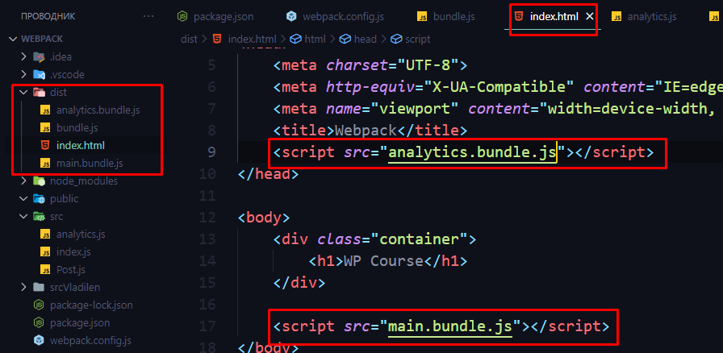

Однако мы можем столкнуться с той проблемой, что мы обновили скрипт, а он со своим именем уже захэшировался у пользователя в браузере и уже не обновляется - это может привести к неожиданным поломкам, поэтому стоит добавить ещё один паттерн, который будет основываться на внутреннем содержимом файла

`[contenthash]` - будет давать имя, основываясь на его хэше

`webpack.config.js`

```JS
output: {
   filename: "[name].[contenthash].js",
   path: path.resolve(__dirname, "dist"),
},
```

И теперь при каждом обновлении мы будем получать новый файл

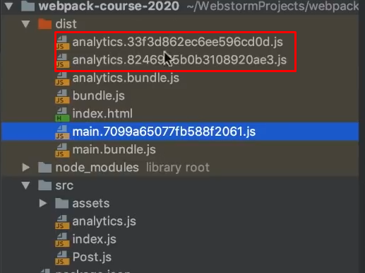

## Плагины

Для примера установим плагин, который позволяет вебпаку компилировать не только JS-файлы, но и HTML со всеми нужными входными данными

Установка плагина:

```bash
npm install -D html-webpack-plugin
```

Подключение плагина:
`webpack.config.js`

```JS
const path = require("path");

// подключение плагина в вебпак
const HTMLWebpackPlugin = require("html-webpack-plugin");

module.exports = {
   mode: "development",
   entry: {
      // так же может быть несколько точек входа в приложение
      main: "./src/index.js", // основной чанк
      analytics: "./src/analytics.js", // побочный чанк
   },
   output: {
      filename: "[name].[contenthash].js",
      path: path.resolve(__dirname, "dist"),
   },
   // Здесь мы задаём список плагинов, которые мы подключаем в вебпак
   plugins: [
      new HTMLWebpackPlugin() // инициализируем плагин в вебпаке
   ]
};
```

Как можно увидеть, сам плагин генерирует новый `index.html` из имеющегося в `src` и подставляет все нужные импорты скриптов, которые в свою очередь компилируются со своим хешем

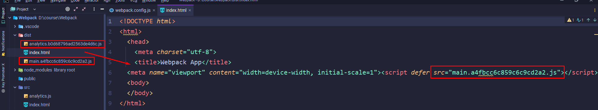

Так же мы можем настраивать внутренности тегов в HTML

`webpack.config.js`

```JS
plugins: [
   new HTMLWebpackPlugin({
      title: 'webpack valery' // дали тайтл
   })
]
```

## Работа с HTML

Так же мы можем указать плагину, который компилирует HTML, какой файл будет являться для него темплейтом, который будет являться отображением сайта.
Свойство `template` определяет, на примере какого файла генерировать основной HTML. _Так же в основной HTML будут вложены все нужные импорты_

`webpack.config.js`

```JS
const path = require("path");
const HTMLWebpackPlugin = require("html-webpack-plugin");

module.exports = {
   mode: "development",
   entry: {
      main: "./src/index.js",
      analytics: "./src/analytics.js",
   },
   output: {
      filename: "[name].[contenthash].js",
      path: path.resolve(__dirname, "dist"),
   },
   plugins: [
      new HTMLWebpackPlugin({
         template: "./src/index.html", // можем указать основной HTML
      })
   ]
};
```

Оригинальный HTML в `src` (без каких-либо импортов)

```HTML
<!DOCTYPE html>
<html lang="en">
<head>
   <meta charset="UTF-8">
   <meta http-equiv="X-UA-Compatible" content="IE=edge">
   <meta name="viewport" content="width=device-width, initial-scale=1.0">
   <title>Webpack</title>
</head>
<body>
   <div class="container">
      <h1>WP Course</h1>
   </div>
</body>
</html>
```

То , что сгенерировал ==webpack== (вебпак сам добавил импорты на актуальные скрипты)

```HTML
<!DOCTYPE html>
<html lang="en">
<head>
   <meta charset="UTF-8">
   <meta http-equiv="X-UA-Compatible" content="IE=edge">
   <meta name="viewport" content="width=device-width, initial-scale=1.0">
   <title>Webpack</title>
<script defer src="main.a4fbcc6c859c6c9cd2a2.js"></script><script defer src="analytics.b0d68796ad2563de4d6c.js"></script></head>
<body>
   <div class="container">
      <h1>WP Course</h1>
   </div>
</body>
</html>
```

## Очистка папки проекта

Устанавливаем плагин, который чистит проект от неиспользуемых файлов

```bash
npm i -D clean-webpack-plugin
```

Подключаем его

`webpack.config.js`

```JS
const path = require("path");
const HTMLWebpackPlugin = require("html-webpack-plugin");

// подключаем плагин-очиститель
const {CleanWebpackPlugin} = require("clean-webpack-plugin");

module.exports = {
   mode: "development",
   entry: {
      main: "./src/index.js",
      analytics: "./src/analytics.js",
   },
   output: {
      filename: "[name].[contenthash].js",
      path: path.resolve(__dirname, "dist"),
   },
   plugins: [
      new HTMLWebpackPlugin({
         template: "./src/index.html",
      }),
      // Новый плагин
      new CleanWebpackPlugin(), // инициализируем плагин
   ]
};
```

И теперь в папке проекта чистятся неиспользуемые файлы

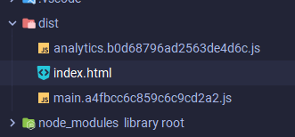

## Сборка проекта

Так же мы можем задать свои собственные консольные команды, которые мы можем забиндить под короткие алиасы. Конкретно в файле `package.json` мы можем в свойстве `"scripts"` задать свои алисасы и им присвоить консольную команду

`package.json`

```JS
"scripts": {
	"dev": "webpack --mode development",
	"build": "webpack --mode production"
},
```

И через команду `npm run` мы вызываем запуск определённого скрипта (тут - компиляция в `development` режиме)

```bash
npm run dev
```

#автоматическаякомпиляция
Так же мы можем задать автоматическую компиляцию изменений в файлах

```JSON
"scripts": {
  "dev": "webpack --mode development",
  "build": "webpack --mode production",
  // создаём команду, которая будет постоянно смотреть и компилировать файлы
  "watch": "webpack --mode development --watch"
},
```

## Контекст

Конкретно свойство `context` позволяет нам указать самостоятельно, от какой точки будет идти ориентирование в проекте. По умолчанию вебпак ориентируется от начальной папки нашего проекта. Если мы добавим контекст, то все пути, нам нужно будет прописывать относительно этого контекста. Это удобно, так как почти все пути до файлов мы прописываем внутри той же папки `src`

`webpack.config.js`

```JS
const path = require("path");
const HTMLWebpackPlugin = require("html-webpack-plugin");
const {CleanWebpackPlugin} = require("clean-webpack-plugin");

module.exports = {
   // говорит, где находятся исходники
   context: path.resolve(__dirname, "src"),
   mode: "development",
   entry: {
      main: "./index.js",
      analytics: "./analytics.js",
   },
   output: {
      filename: "[name].[contenthash].js",
      path: path.resolve(__dirname, "dist"),
   },
   plugins: [
      new HTMLWebpackPlugin({
         template: "./index.html",
      }),
      new CleanWebpackPlugin(),
   ]
};
```

## CSS-лоадеры

Лоадеры - это сущноси, которые добавляют дополнительный функционал вебпаку, который позволяет работать с другими видами файлов

Устанавливаем первым делом два лоадера

- `css-loader` позволяет импортировать стили в ==JS==
- `style-loader` добавляет стили в секцию `HEAD` в ==HTML==

```bash
npm i -D style-loader css-loader
```

`webpack.config.js`

```JS
module.exports = {
   context: path.resolve(__dirname, "src"),
   mode: "development",
   entry: {
      main: "./index.js",
      analytics: "./analytics.js",
   },
   output: {
      filename: "[name].[contenthash].js",
      path: path.resolve(__dirname, "dist"),
   },
   plugins: [
      new HTMLWebpackPlugin({
         template: "./index.html",
      }),
      new CleanWebpackPlugin(),
   ],

   // Задаём лоадеры
   module: {
      rules: [
         {
			// Тут задаётся паттерн поиска файла
            // если нам попадаются файлы с таким расширением
            test: /\.css$/,
            // то нам нужно использовать такие лоадеры
            // лоадеры срабатывают справа-налево
            // первый лоадер позволяет импортировать стили, второй добавляет стили в секцию HEAD в HTML
            use: ['style-loader', 'css-loader'],
         }
      ],
   }

};
```

`index.html`

```JS
import Post from './Post';
import './styles/style.css';  // подключение стилей

const post = new Post("Webpack Post Title");

console.log("post to string", post.toString);
```

`style.css`

```CSS
.container {
    padding-top: 2rem;
    max-width: 1000px;
    margin: 0 auto;
}

h1 {
    text-align: center;
    color: red;
    font-weight: 700;
    font-size: 60px;
}
```

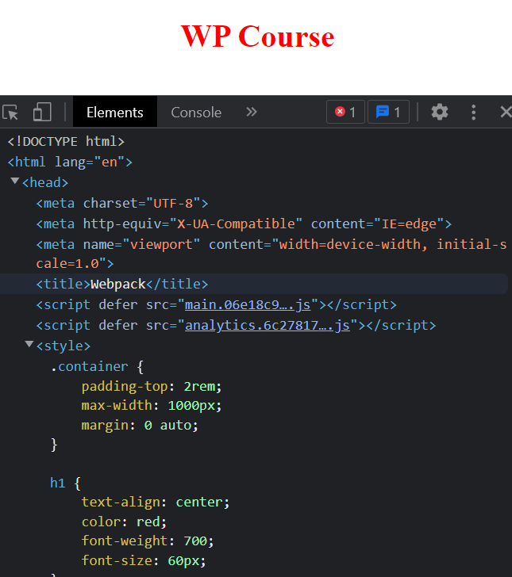

## Работа с JSON

WP позволяет нам подключать json-файлы без дополнительных запросов обычным импортом

```JS
// Подключение JSON-файла
import json from './assets/json.json';
console.log('json: ', json);
```

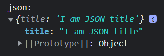

## Работа с файлами

Во-первых, нужно установить новый лоадер, который обрабатывает файлы

```bash
npm install file-loader -g
```

Во-вторых, нужно описать для него правила. В правилах мы укажем варианты расширений изображений, которые могут встречаться в нашем проекте

`webpack.config.js`

```JSON
module: {
   rules: [
      {
         test: /\.css$/,
         use: ['style-loader', 'css-loader'],
      },
      // Описываем новый лоадер для WP
      {
		// при работе с файлами расширений:
         test: /\.(png|svg|jpg|gif)$/,
         // использовать:
         use: ['file-loader']
      }
   ],
}
```

Использование в JS

```JS
import WebpackLogo from './assets/webpack-logo.png';

const post = new Post("Webpack Post Title", WebpackLogo);
```

Использование в CSS (создаст в `dist` отдельный файл с изображением)

```CSS
.logo {
    background-image: url("../assets/webpack-logo.png");
    background-size: cover;
    height: 200px;
    width: 200px;
    margin: 0 auto;
}
```

```HTML
<div class="logo"></div>
```

## Работа со шрифтами

Дополнение конфига для работы со шрифтами:
`webpack.config.js`

```JSON
rules: [
   {
      test: /\.css$/,
      use: ['style-loader', 'css-loader']
   },
   {
      test: /\.(png|jpe?g|gif)$/i,
      use: ['file-loader'],
   },
   // Тут нужно прописать правила работы file-loader со шрифтами
   {
	   // типы шрифтов
      test: /\.(ttf|eot|woff|woff2)$/,
      use: ['file-loader']
   }
],
```

Подключаем стили с нашего компьютера
`font.css`

```CSS
@font-face {
    font-family: 'Roboto';
    src: url('../assets/fonts/Roboto-Regular.ttf') format('truetype');
}
```

Импортим файл в наш основной. Импорты работают почти так же как и в WP
`style.css`

```CSS
@import "font.css";

body {
    font-family: 'Roboto', sans-serif;
}
```


## Подключение CSS-библиотек

Попробуем установить библиотеку для ==css==. Это нормализатор стилей под разные браузеры.

```bash
npm install normalize.css
```

Подключаем модуль так же через импорт.
`~` в начале имени модуля говорит нам о том, что модуль нужно искать в папке: `node_modules`

```CSS
@import "~normalize.css";
```

## Защита от публикации пакета

Стандартно наш пакет имеет основную входную точку, которая определена в `package.json`, однако, чтобы защититься от публикации нам нужно заменить одну строчку

`package.json`

```JSON
{
  "name": "webpack",
  "version": "1.0.0",
  "description": "",
  "main": "index.js",  // Это свойство нужно для публичных пакетов
  "scripts": {
    "dev": "webpack --mode development",
    "build": "webpack --mode production",
    "watch": "webpack --mode development --watch"
  },
```

А сейчас наш пакет будет защищён от публикации

```JSON
{
  "name": "webpack",
  "version": "1.0.0",
  "description": "",
  "private": true,  // Это свойство делает наш пакет приватным
  "scripts": {
    "dev": "webpack --mode development",
    "build": "webpack --mode production",
    "watch": "webpack --mode development --watch"
  },
```

## Работа с XML-файлами

Установка лоадера ==XML==

```bash
npm install -D xml-loader
```

Добавление правил на ==XML==

`webpack.config.js`

```JS
module: {
   rules: [
      {
         test: /\.css$/,
         use: ['style-loader', 'css-loader']
      },
      {
         test: /\.(png|jpe?g|gif)$/i,
         use: ['file-loader'],
      },
      {
         test: /\.(ttf|eot|woff|woff2)$/,
         use: ['file-loader']
      },
      // настройки для xml-loader
      {
         test: /\.xml$/,
         use: ['xml-loader']
      }
   ],
}
```

Вывод в консоль и подключение

`index.js`

```JS
import json from './assets/json.json';
import xml from './assets/data.xml';

console.log('json: ', json);
console.log('XML: ', xml);
```

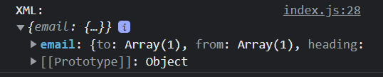

## Работа с CSV-файлами

`papaparse` нужен для работы с парсингом файлов
`csv-loader` лоадер, который умеет обрабатывать ==csv== формат файлов

```bash
npm i -d papaparse
npm i -D csv-loader
```

`webpack.config.js`

```JS
{
   test: /\.csv$/,
   use: ['csv-loader'],
}
```

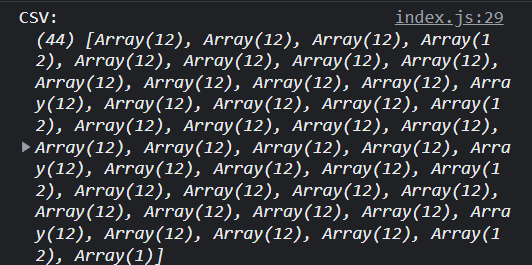

## Дополнительные настройки

Свойство `resolve` позволяет нам определить для ==Webpack==, что ему нужно искать по умолчанию.
То есть, если вложенное свойство `extensions` будет пустое, то мы должны будем всегда прописывать в `import` расширения файлов. Если мы добавим расширения в массив, то ==WP== будет искать файл с подходящим расширением, даже если в импорте мы его не укажем

```JS
module.exports = {
   context: path.resolve(__dirname, "src"),
   mode: "development",
   entry: {
      main: "./index.js",
      analytics: "./analytics.js",
   },
   output: {
      filename: "[name].[contenthash].js",
      path: path.resolve(__dirname, "public"),
   },
   resolve: {
      // Тут мы должны сказать WP, какие расширения нужно понимать по умолчанию
      extensions: ['.js', '.json', '.png'],
   },
   devServer: {
      static: {
         directory: path.join(__dirname, 'public'),
      },
      compress: true,
      port: 9000,
      open: true
   },
// ....
```

С настройками выше наши импорты будут работать без указания расширения

```JS
import Post from './Post';  // .js
import json from './assets/json';  // .json
import WebpackLogo from './assets/webpack-logo'; // .png
```

Так же присутствует свойство `alias`, которое позволяет задать псевдоним для путей в наших импортах

```JS
resolve: {
   extensions: ['.js', '.jsx', '.ts', '.tsx'],
   alias: {
      '@': path.resolve(__dirname, "src"),
      '@components': path.resolve(__dirname, 'src/components'),
      '@utilities': path.resolve(__dirname, 'src/utilities'),
      '@modules': path.resolve(__dirname, 'src/modules')
   }
},
```

```JS
// и теперь можно задать относительный путь
import sayHi from './models/script';
// или через алиасы сгенерировать абсолютный путь
import sayHic from '@models/script';
// @ заменит src - так же сделает абсолютный путь
import sayHic from '@/models/script';
```

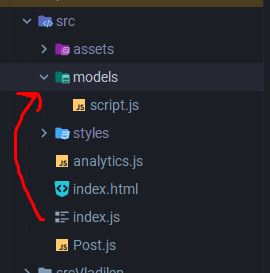

## Подключение JS-библиотек

```bash
npm i -S jquery
```

`index.js`

```JS
import * as $ from 'jquery';
$('pre').html(post.toString());
```

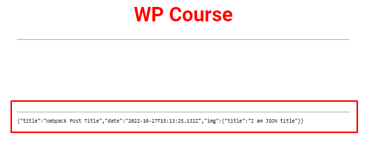

```JS
export default class Post {
   constructor(title, img) {
      this.title = title;
      this.img = img;
      this.date = new Date();
   }

   toString() {
      return JSON.stringify({
         title: this.title,
         date: this.date.toJSON(),
         img: this.img,
      }, null, 2); // так же можно передать сюда параметры формата
   }
}
```

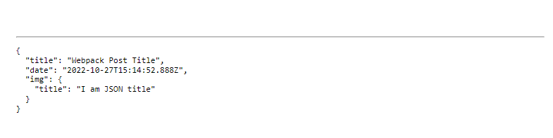

## Оптимизация

Представим, что у нас есть два файла, которые импортируют в себя ==jquery==. Мы столкнёмся с проблемой, что оба этих файла будут в себя отдельно импортировать библиотеку. Это приведёт к дополнительным прибавкам к весу файлов

`index.js`

```JS
import * as $ from 'jquery';
$('pre').html(post.toString());
```

`analytics.js`

```JS
import * as $ from 'jquery';

function createAnalytics() {
   let counter = 0;
   let isDestroyed = false;

   const listener = () => counter++;

   $(document).on("click", listener);

   return {
      destroy() {
         $(document).off("click", listener);
         isDestroyed = true;
      },

      getClicks() {
         if (isDestroyed) {
            return "Analytics is destroyed";
         }
         return counter;
      },
   };
}

window.analytics = createAnalytics();
```

Поэтому в WP есть свойство, которое позволяет настроить оптимизацию работы проекта. В нём мы можем объединять общие импорты в отдельные чанки, которые будут служить своего образа библиотеками (у нас будет один js, который будет хранить jquery)

```JS
module.exports = {
   context: path.resolve(__dirname, "src"),
   mode: "development",
   entry: {
      main: "./index.js",
      analytics: "./analytics.js",
   },
   // Параметр оптимизации
   optimization: {
      splitChunks: {
         chunks: 'all'
      }
	},
// ....
```

## Webpack-dev-server

`devServer` вебпака собирает наш проект так же как и при обычной сборке, но складывает все собранные файлы в оперативную память, что позволяет ему не обновляя страницу обновлять все модули и отображать изменения. Поэтому сервер WP используется только в режиме разработки.
Чтобы получить конечный билд, нужно запустить `production` сборку вебпака.

Если не будет работать, то вместо `-D` нужно попробовать `-g`

```bash
npm i webpack-dev-server -D
```

Создаём новую команду для запуска

`package.json`

```JSON
"scripts": {
  "dev": "webpack --mode development",
  "build": "webpack --mode production",
  "watch": "webpack --mode development --watch",
  // Команда стартует сервер вебпака
  "start": "webpack serve"
},
```

Тут уже достаточно для запуска будет вписать такую команду:

```bash
npm start
```

Чтобы остановить работу процесса, достаточно нажать `ctrl+c`

`webpack.config.js`

```JS
module.exports = {
   context: path.resolve(__dirname, "src"),
   mode: "development",
   entry: {
      main: "./index.js",
      analytics: "./analytics.js",
   },
   output: {
      filename: "[name].[contenthash].js",
      path: path.resolve(__dirname, "public"),
   },
   // Сюда вставляем активацию работы плагина devServer
   devServer: {
      static: {
         directory: path.join(__dirname, 'public'),
      },
      compress: true,  // Если нужно компрессия файла
      port: 9000,  // Определяем порт
      open: true // Автоматически запускает страницу в браузере
   },
   plugins: [
      new HTMLWebpackPlugin({
         template: "./index.html",
      }),
      new CleanWebpackPlugin(),
   ],
   module: {
      rules: [
         {
            test: /\.css$/,
            use: ['style-loader', 'css-loader']
         },
         {
            test: /\.(png|jpe?g|gif)$/i,
            use: ['file-loader'],
         },
         {
            test: /\.(ttf|eot|woff|woff2)$/,
            use: ['file-loader']
         },
         {
            test: /\.xml$/,
            use: ['xml-loader']
         }
      ],
   }
};
```

## Копирования статических файлов

Так же мы можем указать нашему ==WP== куда копировать статические файлы (которые мы, например, подключили только в ==HTML==)

```bash
npm i -D copy-webpack-plugin
```

```HTML
<head>
   <meta charset="UTF-8">
   <meta http-equiv="X-UA-Compatible" content="IE=edge">
   <meta name="viewport" content="width=device-width, initial-scale=1.0">
   <title>Webpack</title>
   <link rel="stylesheet" href="styles/style.css">
   <!--добавляем фавиконку-->
   <link rel="icon" href="favicon.ico" type="image/icon">
</head>
```

`webpack.config.js`

```JS
// подключаем плагин
const CopyWebpackPlugin = require("copy-webpack-plugin");

// ....

plugins: [
   new HTMLWebpackPlugin({
      template: "./index.html",
   }),
   new CleanWebpackPlugin(),
   // И теперь этот плагин перенесёт фотографию в выводимую папку
   new CopyWebpackPlugin({
      patterns: [
         {
            from: path.resolve(__dirname, 'src/favicon.ico'),
            to: path.resolve(__dirname, 'dist')
         }
      ],
   }),
],

// ....
```

Как итог, можно увидеть фавиконку, которую мы напрямую подключили в HTML

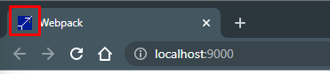

## Сжатие CSS, HTML, JS

**Минификация CSS**
Данный плагин будет выводить отдельные CSS файлы и нормально их компилировать

```bash
npm install --save-dev mini-css-extract-plugin
```

Производим небольшие настройки и добавляем плагин в конфиг

`webpack.config.js`

```JS
const MiniCSSExtractPlugin = require("mini-css-extract-plugin");

// ....

plugins: [
   new HTMLWebpackPlugin({
      template: "./index.html",
   }),
   new CleanWebpackPlugin(),
   new CopyWebpackPlugin({
      patterns: [
         {
            from: path.resolve(__dirname, 'src/favicon.ico'),
            to: path.resolve(__dirname, 'dist')
         }
      ],
   }),
   // Добавляем плагин, который будет минифицировать CSS
   new MiniCSSExtractPlugin({
      // копируем из output путь и меняем расширение на '.css'
      filename: "[name].[contenthash].css",
}),
],
module: {
   rules: [
      {
         test: /\.css$/,
         // Меняем 'style-loader' на лоадер минификатора
         use: [MiniCSSExtractPlugin.loader, 'css-loader']
      },
      {
         test: /\.(png|jpe?g|gif)$/i,
         use: ['file-loader'],
      },
      {
         test: /\.(ttf|eot|woff|woff2)$/,
         use: ['file-loader']
      },
      {
         test: /\.xml$/,
         use: ['xml-loader']
      },
      {
         test: /\.csv$/,
         use: ['csv-loader'],
      }
   ],
}
```

Убираем из подключений ==CSS==, так как теперь он будет подключаться самостоятельно

```HTML
<head>
   <meta charset="UTF-8">
   <meta http-equiv="X-UA-Compatible" content="IE=edge">
   <meta name="viewport" content="width=device-width, initial-scale=1.0">
   <title>Webpack</title>
   <!--добавляем фавиконку-->
   <link rel="icon" href="favicon.ico" type="image/icon">
</head>
```

Вот так выглядит выходной HTML-файл

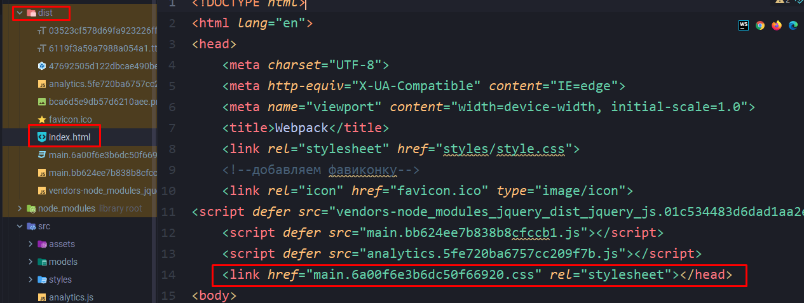

Тут мы дополнили

1. как сам плагин, потому что в него можно передать объект с параметрами
2. так и реализовали проверку режима для наших компонентов и если мы находимся в режиме разработки, то у нас будет активна смена модулей без перезагрузки страницы

`webpack.config.js`

```JS
// Эта переменная будет хранить в себе значение состояния, в котором находится сайт во время разработки
const isDev = process.env.NODE_ENV === "development";

// ...

devServer: {
   static: {
      directory: path.join(__dirname, 'dist'),
   },
   compress: true,
   port: 9000,
   open: true,
   // перезагружает страницу если находимся в режиме разработчика
   hot: isDev,
},

module: {
   rules: [
      {
         test: /\.css$/,
        // Так же можно более детально настроить плагин, так как первым параметром он позволяет в себя положить объект с самим лоадером и его опциями
         use: [{
            loader: MiniCSSExtractPlugin.loader,
            options: {
		// hot module reload - меняет сущности без перезагрузки
	    // Если находимся в режиме разработчика, то будет активно
               hmr: isDev,
               reloadAll: true
            }
         }, 'css-loader']
      },

// ....
```

Чтобы проверить работу смены окружений, нужно воспользоваться пакетом для их смены:

```bash
npm i -G cross-env
```

Строчками `cross-env NODE_ENV=development` мы определяем среду нашей разработки (продакшен или разработка). Этот код в скриптах позволит нам всегда контролировать среду, в которой мы находимся и определять работу некоторых наших функций вебпака

`package.json`

```JSON
"scripts": {
  "dev": "cross-env NODE_ENV=development webpack --mode development",
  "build": "cross-env NODE_ENV=production webpack --mode production",
  "watch": "cross-env NODE_ENV=development webpack --mode development --watch",
  "start": "cross-env NODE_ENV=development webpack serve"
},
```

_Сам плагин для минификации CSS:_

```bash
npm install css-minimizer-webpack-plugin --save-dev
```

```JS
const MiniCSSExtractPlugin = require("mini-css-extract-plugin");
const CssMinimizerPlugin = require("css-minimizer-webpack-plugin");

// Эта переменная будет хранить в себе значение состояния, в котором находится сайт во время разработки
const isDev = process.env.NODE_ENV === "development";
const isProd = process.env.NODE_ENV === "production";

const optimization = () => {
   const config = {
      splitChunks: {
         chunks: 'all'
      }   }

   // Если режим продакшена
   if (isProd) {
	   // то нужно добавить свойство minimizer с плагином минификации
      config.minimizer = [
         new CssMinimizerPlugin() // сам минификатор CSS
      ]
   }

   return config;
}

// ....

module.exports = {
   context: path.resolve(__dirname, "src"),
   mode: "development",
   entry: {
      main: "./index.js",
      analytics: "./analytics.js",
   },
   // Тут нужно вложить функцию, которая сгенерирует наш объект оптимизации
   optimization: optimization(),

// ....
```

**Минификация JS**

```bash
npm install terser-webpack-plugin --save-dev
```

`webpack.config.js`

```JS
// Подключаем минификатор JS
const TerserPlugin = require("terser-webpack-plugin");

// Эта переменная будет хранить в себе значение состояния, в котором находится сайт во время разработки
const isDev = process.env.NODE_ENV === "development";
const isProd = process.env.NODE_ENV === "production";

const optimization = () => {
   const config = {
      splitChunks: {
         chunks: 'all'
      }   }

   if (isProd) {
      config.minimizer = [
         new TerserPlugin(), // Подключаем минификатор JS
         new CssMinimizerPlugin(),
      ]
   }

   return config;
}
```

**Минификация HTML**
Уже этот код будет минифицировать ==HTML== код при работе в режиме продакшена

`webpack.config.js`

```JS
// Если работаем в продакшн режиме...
const isProd = process.env.NODE_ENV === "production";

// ....

plugins: [
   new HTMLWebpackPlugin({
	   template: "./index.html",
	   // Тут уже настраиваем минификацию
	   minify: {
		   // ...то сжимаем все пробелы в коде
	      collapseWhitespace: isProd
	   }
	}),

// ...
```

## Компиляция Less и Sass

Устанавливаем сам ==less==, ==sass== и их его лоадеры в наш проект

```bash
npm install less less-loader --save-dev
npm install sass-loader sass webpack --save-dev
```

Далее подключаем правило, которое будет компилировать ==less== и ==sass==

#полныйконфиг
`wenpack.config.js`

```JS
const path = require("path");
const HTMLWebpackPlugin = require("html-webpack-plugin");
const {CleanWebpackPlugin} = require("clean-webpack-plugin");
const CopyWebpackPlugin = require("copy-webpack-plugin");
const MiniCSSExtractPlugin = require("mini-css-extract-plugin");
const CssMinimizerPlugin = require("css-minimizer-webpack-plugin");
const TerserPlugin = require("terser-webpack-plugin");

// Эта переменная будет хранить в себе значение состояния, в котором находится сайт во время разработки
const isDev = process.env.NODE_ENV === "development";
const isProd = process.env.NODE_ENV === "production";

const optimization = () => {
   const config = {
      splitChunks: {
         chunks: 'all'
      }   }

   if (isProd) {
      config.minimizer = [
         new TerserPlugin(),
         new CssMinimizerPlugin(),
      ]
   }

   return config;
}

// эта функция будет генерировать наименование файла
const filename = ext => isDev ? `[name].${ext}` : `[name].[hash].${ext}`;

module.exports = {
   context: path.resolve(__dirname, "src"),
   mode: "development",
   entry: {
      main: "./index.js",
      analytics: "./analytics.js",
   },
   optimization: optimization(),
   output: {
      filename: filename('js'),
      path: path.resolve(__dirname, "dist"),
   },
   resolve: {
      extensions: ['.js', '.jsx', '.ts', '.tsx'],
      alias: {
         '@': path.resolve(__dirname, "src"),
         '@components': path.resolve(__dirname, 'src/components'),
         '@utilities': path.resolve(__dirname, 'src/utilities')
      }
   },
   devServer: {
      static: {
         directory: path.join(__dirname, 'dist'),
      },
      compress: true,
      port: 9000,
      open: true,
      hot: isDev, // перезагружает страницу если находимся в режиме разработчика
   },
   plugins: [
      new HTMLWebpackPlugin({
         template: "./index.html",
         minify: {
            collapseWhitespace: isProd
         }
      }),
      new CleanWebpackPlugin(),
      new CopyWebpackPlugin({
         patterns: [
            {
               from: path.resolve(__dirname, 'src/favicon.ico'),
               to: path.resolve(__dirname, 'dist')
            }
         ],
      }),
      new MiniCSSExtractPlugin({
         // копируем из output
         filename: filename('css'),
      }),
   ],
   module: {
      rules: [
         {
            test: /\.css$/,
            use: [MiniCSSExtractPlugin.loader, 'css-loader']
         },
         // Тут подключаем SASS/SCSS
         {
            test: /\.s[ac]ss$/i,
            use: [
               "style-loader", // или MiniCSSExtractPlugin.loader
               "css-loader",
               "sass-loader",
            ],
         },
         // А тут подключаем LESS
         {
            test: /\.less$/i,
            use: [
               // compiles Less to CSS
               "style-loader", // или MiniCSSExtractPlugin.loader
               "css-loader",
               "less-loader",
            ],
         },
         {
            test: /\.(png|jpe?g|gif)$/i,
            use: ['file-loader'],
         },
         {
            test: /\.(ttf|eot|woff|woff2)$/,
            use: ['file-loader']
         },
         {
            test: /\.xml$/,
            use: ['xml-loader']
         },
         {
            test: /\.csv$/,
            use: ['csv-loader'],
         }
      ],
   }
};
```

Стили Less

```LESS
@border: 1px solid #ccc;

.box {
  padding: 1rem;
  border-radius: 5px;
  margin-top: 1rem;
  border: @border;

  h2 {
    text-align: center;
    color: darkblue;
  }
}
```

Стили SCSS

```SCSS
$border: 1px solid #ccc;

.card {
  padding: 1rem;
  border-radius: 5px;
  margin-top: 1rem;
  border: $border;

  h2 {
    text-align: center;
    color: darkred;
  }
}
```

подключаем стили в файл скрипта
`index.js`

```JS
import './styles/style.css';
import './styles/less.less';
import './styles/scss.scss';
```

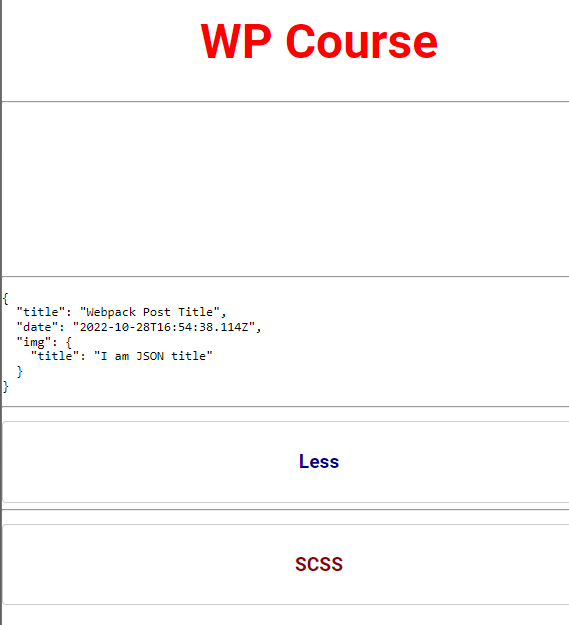

## Оптимизация

Чтобы сократить повторяющийся код, можно вынести его в отдельные функции, в которые будем вкладывать изменения

#полныйконфиг
`webpack.config.js`

```JS
const path = require("path");
const HTMLWebpackPlugin = require("html-webpack-plugin");
const {CleanWebpackPlugin} = require("clean-webpack-plugin");
const CopyWebpackPlugin = require("copy-webpack-plugin");
const MiniCSSExtractPlugin = require("mini-css-extract-plugin");
const CssMinimizerPlugin = require("css-minimizer-webpack-plugin");
const TerserPlugin = require("terser-webpack-plugin");

// Эта переменная будет хранить в себе значение состояния, в котором находится сайт во время разработки
const isDev = process.env.NODE_ENV === "development";
const isProd = process.env.NODE_ENV === "production";

const optimization = () => {
   const config = {
      splitChunks: {
         chunks: 'all'
      }   }

   if (isProd) {
      config.minimizer = [
         new TerserPlugin(),
         new CssMinimizerPlugin(),
      ]
   }

   return config;
}

// Эта функция будет возвращать значение конфига в свойство, которое хранит сведения о лоадерах для определённых файлах
const cssLoaders = (extra) => {
   const loader = [
      MiniCSSExtractPlugin.loader,
      'css-loader',
   ];

	// если дополнение есть, то пушим его в массив
   if(extra) loader.push(extra);

   return loader;
}

// эта функция будет генерировать наименование файла
const filename = ext => isDev ? `[name].${ext}` : `[name].[hash].${ext}`;

module.exports = {
   context: path.resolve(__dirname, "src"),
   mode: "development",
   entry: {
      main: "./index.js",
      analytics: "./analytics.js",
   },
   optimization: optimization(),
   output: {
      filename: filename('js'),
      path: path.resolve(__dirname, "dist"),
   },
   resolve: {
      extensions: ['.js', '.jsx', '.ts', '.tsx'],
      alias: {
         '@': path.resolve(__dirname, "src"),
         '@components': path.resolve(__dirname, 'src/components'),
         '@utilities': path.resolve(__dirname, 'src/utilities')
      }
   },
   devServer: {
      static: {
         directory: path.join(__dirname, 'dist'),
      },
      compress: true,
      port: 9000,
      open: true,
      hot: isDev, // перезагружает страницу если находимся в режиме разработчика
   },
   plugins: [
      new HTMLWebpackPlugin({
         template: "./index.html",
         minify: {
            collapseWhitespace: isProd
         }
      }),
      new CleanWebpackPlugin(),
      new CopyWebpackPlugin({
         patterns: [
            {
               from: path.resolve(__dirname, 'src/favicon.ico'),
               to: path.resolve(__dirname, 'dist')
            }
         ],
      }),
      new MiniCSSExtractPlugin({
         // копируем из output
         filename: filename('css'),
      }),
   ],
   module: {
      rules: [
         {
            test: /\.css$/,
            // тут уже мы просто вызваем функцию, которая будет вставлять нужный конфиг
            use: cssLoaders(),
         },
         {
            test: /\.s[ac]ss$/i,
            // тут уже мы просто вызваем функцию, которая будет вставлять нужный конфиг и передавать параметр
            use: cssLoaders('sass-loader'),
         },
         {
            test: /\.less$/i,
            // тут уже мы просто вызваем функцию, которая будет вставлять нужный конфиг и передавать параметр
            use: cssLoaders('less-loader'),
         },
         {
            test: /\.(png|jpe?g|gif)$/i,
            use: ['file-loader'],
         },
         {
            test: /\.(ttf|eot|woff|woff2)$/,
            use: ['file-loader']
         },
         {
            test: /\.xml$/,
            use: ['xml-loader']
         },
         {
            test: /\.csv$/,
            use: ['csv-loader'],
         }
      ],
   }
};
```

## Babel

Устанавливаем нужные компоненты ==babel==

```bash
npm install -D babel-loader @babel/core @babel/preset-env webpack
```

Так же нужно установить полифилы, которые будут переводить современные функции (async/await, get/set) под старые стандарты

```bash
npm install --save @babel/polyfill
```

Ну и добавим новые правила для активации работы ==babel== внутри ==webpack==

`webpack.config.js`

```JS
// ....

module.exports = {
   context: path.resolve(__dirname, 'src'),
   mode: 'development',
   entry: {
	   // тут как точку входа определяем массив, первым значением которого будут являться полифилы babel
      main: ['@babel/polyfill', './index.js'],
      analytics: './analytics.js',
   },

// ....

{
	// обрабатываем js-файлы
	test: /\.m?js$/,
	// исключаем нод-модули из компиляции
	exclude: /node_modules/,
	use: {
		// используем лоадер babel
		loader: "babel-loader",
		options: {
			// в опциях определяем пресеты
			presets: ['@babel/preset-env']
		}
	}
}
```

`package.json`

```JSON
{
  "name": "webpack",
  // компилировать так, чтобы не поддерживали только 0,25% браузеров, а все остальные - поддерживались
  "browserList": ">0.25%, not dead",
  "version": "1.0.0",
  "description": "",
// ...
```

## Добавление плагинов для Babel

```bash
npm install --save-dev @babel/plugin-proposal-class-properties
```

```JS
{
   test: /\.m?js$/,
   exclude: /node_modules/,
   use: {
      loader: 'babel-loader',
      options: {
         presets: ['@babel/preset-env'],
         plugins: [
            '@babel/plugin-proposal-class-properties',
         ]
      },
   },
},
```

```JS
class Util {
   static id = Date.now();
}

console.log(Util.id); // выведет дату
```

> [!note] Приведённый в примере плагин уже входит в `preset-env`

## Компиляция TypeScript

Для начала компиляции нужно установить пресет на ТС

```bash
npm install --save-dev @babel/preset-typescript
```

Дальше нужно подправить конфиг

```JS
// ...

module.exports = {
   context: path.resolve(__dirname, 'src'),
   mode: 'development',
   entry: {
      main: ['@babel/polyfill', './index.js'],
      // тут в качестве второй точки входа поставить ts (так как этот файл мы переименовали в ts из js)
      analytics: './analytics.ts',
   },

// ...

// Это уже правила для компиляции ts
{
   test: /\.ts$/,
   exclude: /node_modules/,
   use: {
      loader: 'babel-loader',
      options: {
         presets: [
            '@babel/preset-env',
            // добавляем пресет на ts
            '@babel/preset-typescript',
         ],
      },
   },
},

// ...
```

Это сама аналитика, переделанная в ==TS==

```TS
import * as $ from 'jquery';

function createAnalytics(): Object {
   let counter = 0;
   let isDestroyed: boolean = false;

   const listener = (): number => counter++;

   $(document).on('click', listener);

   return {
      destroy() {
         $(document).off('click', listener);
         isDestroyed = true;
      },

      getClicks() {
         if (isDestroyed) {
            return 'Analytics is destroyed';
         }
         return counter;
      },
   };
}

window['analytics'] = createAnalytics();
```

Так же как и в прошлых случаях, тут можно оптимизировать конфиг

```JS
// Это опции под типы пресетов babel
const babelOptions = (ext) => {
   const options = {
      presets: [
         '@babel/preset-env',
      ],
   }
   if (ext) options.presets.push(ext);
   return options;
}

// ...

{
   test: /\.m?js$/,
   exclude: /node_modules/,
   use: {
      loader: 'babel-loader',
      options: babelOptions(),
   },
},
{
   test: /\.ts$/,
   exclude: /node_modules/,
   use: {
      loader: 'babel-loader',
      options: babelOptions('@babel/preset-typescript'),
	},
},
```

## Компиляция React JSX

```bash
npm install --save-dev @babel/preset-react
```

```bash
npm i react react-dom
```

`webpack.config.js`

```JS
entry: {
	// точку входа в вебпаке нужно поменять на '.jsx'
   main: ['@babel/polyfill', './index.jsx'],
   analytics: './analytics.ts',
},

// ....
// Это правила для работы и компиляции JSX
{
   test: /\.jsx$/,
   exclude: /node_modules/,
   use: {
      loader: 'babel-loader',
      // Устанавлвиаем пресет
      options: babelOptions('@babel/preset-react'),
   },
},
```

`index.jsx`

```JSX
import './babel';

import './styles/style.css';
import './styles/less.less';
import './styles/scss.scss';

import React, { Component } from 'react';
import ReactDOM from 'react-dom/client';


class App extends Component {
   render() {
      return (
         <div className='container'>
            <h1>WP Course</h1>
            <hr />
            <div className='logo' />
            <hr />
            <hr />
            <pre />
            <hr />
            <div className='box'>
               <h2>Less</h2>
            </div>
            <hr />
            <div className='card'>
               <h2>SCSS</h2>
            </div>
         </div>
      );
   }
}

const root = ReactDOM.createRoot(document.getElementById('app'));
root.render(
   <React.StrictMode>
      <App />
   </React.StrictMode>,
);
```

## Devtool

Так же в WP можно настроить режимы компиляции по огромной таблице значений

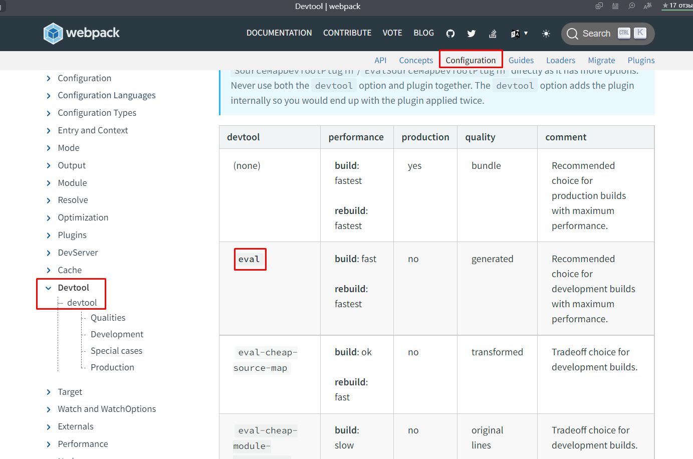

В конфиг WP нужно вписать свойство `devtool`, которому по условию можно назначить определённый тип компайла карт

`webpack.config.js`

```JS
module.exports = {
   context: path.resolve(__dirname, 'src'),
   mode: 'development',
   // тут уже в режиме разработчика будем генерировать карты
   devtool: isDev ? 'source-map' : 'eval-cheap-source-map',
```

И теперь карты показывают, в каком файле были созданы стили и на какой строке они располагаются (конкретно позволяет работать с файлами специфических расширений из браузера)

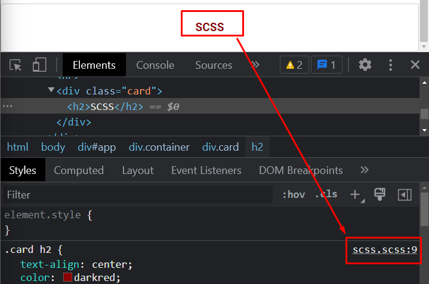

И так же показывает исходник в самом браузере

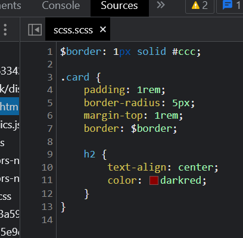

## ESLint

Устанавливаем сам `eslint` и `babel`-парсер для еслинта

```bash
npm i -D eslint-loader

npm i -D babel-eslint
```

Добавим функцию, которая будет добавлять дополнительные лоадеры для ==JS== и закинем `eslint-loader` в компиляцию ==JS==

`webpack.config.js`

```JS
// будет добавлять указанные лоадеры
const jsLoaders = ext => {
   const loaders = [
      {
         loader: ['babel-loader'],
         options: babelOptions(),
      },
   ];

   if (ext) loaders.push(ext);

   return loaders;
};

// ....

{
   test: /\.js$/,
   exclude: /node_modules/,
   use: jsLoaders('eslint-loader'),
},
```

`babel.js` - создадим для примера одну неиспользуемую переменную

```JS
const unused = 10;
```

`.eslintrc` - создаём в корне проекта

```JSON
{
	// Назначим парсер под бэйбель
  "parser": "babel-eslint",
  // Скажем, чтобы выпадали варнинги, если будут обнаружены неиспользуемые переменные
  "rules": {
    "no-unused-vars": "warn"
  },
  // активируем поддержку ES6
  "env": {
    "es6": true,
    "browser": true
  },
  "extends": [
    "eslint:recommended"
  ]
}
```

## Динамические импорты

Библиотека простых функций

```bash
npm i -D lodash
```

Динамические импорты позволяют нам вставить библиотеку в любом участке кода и сразу же её использовать

`babel.js`

```JS
import('lodash').then(_ => {
   console.log('Lodash: ', _.random(10, 11, true));
});
```

## Анализ финальной сборки

```bash
npm i webpack-bundle-analyzer -D
```

```JS
// ....

// импортируем функцию анализирования конфига
const {BundleAnalyzerPlugin} = require('webpack-bundle-analyzer');

// Это список наших плагинов, который будет зависеть от
const plugins = () => {
   const base = [
      new HTMLWebpackPlugin({
         template: './index.html',
         minify: {
            collapseWhitespace: isProd,
         },
      }),
      new CleanWebpackPlugin(),
      new CopyWebpackPlugin({
         patterns: [
            {
               from: path.resolve(__dirname, 'src/favicon.ico'),
               to: path.resolve(__dirname, 'dist'),
            },
         ],
      }),
      new MiniCSSExtractPlugin({
         // копируем из output
         filename: filename('css'),
      }),
   ];

   if (isProd) base.push(new BundleAnalyzerPlugin());

   return base;
};

// ....

module.exports = {
   plugins: plugins(),

// ....
```

И теперь тут можно увидеть, сколько занимают места разные библиотеки в нашем проекте

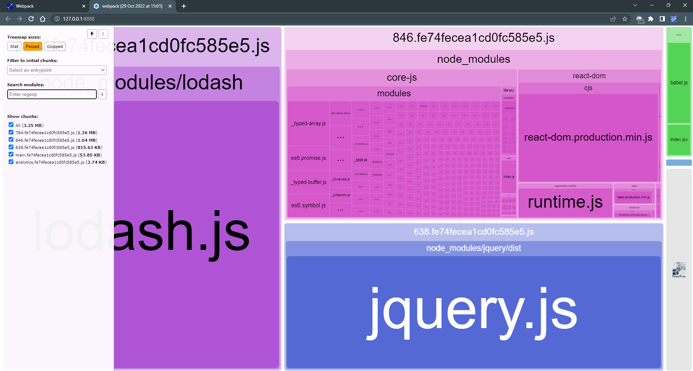

Либо можно записать выполнение этого плагина через скрипт

`package.json`

```JSON
"scripts": {
  "stats": "webpack --json > stats.json && webpack-bundle-analyzer stats.json"
```

## Полный конфиг сборки

Папка проекта:

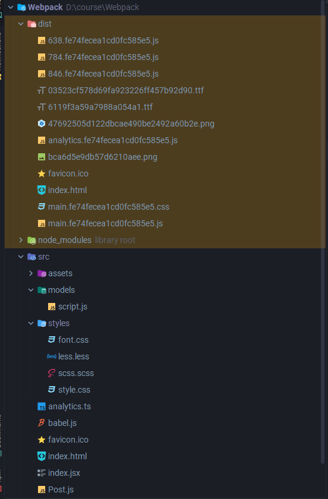

Конфиг:

```JS
const path = require('path');
const HTMLWebpackPlugin = require('html-webpack-plugin');
const { CleanWebpackPlugin } = require('clean-webpack-plugin');
const CopyWebpackPlugin = require('copy-webpack-plugin');
const MiniCSSExtractPlugin = require('mini-css-extract-plugin');
const CssMinimizerPlugin = require('css-minimizer-webpack-plugin');
const TerserPlugin = require('terser-webpack-plugin');

const { BundleAnalyzerPlugin } = require('webpack-bundle-analyzer');

// Эта переменная будет хранить в себе значение состояния, в котором находится сайт во время разработки
const isDev = process.env.NODE_ENV === 'development';
const isProd = process.env.NODE_ENV === 'production';

// эта функция определяет под каждый тип разработки свою минификацию файлов
const optimization = () => {
   const config = {
      splitChunks: {
         chunks: 'all',
      },
   };

   if (isProd) {
      config.minimizer = [new TerserPlugin(), new CssMinimizerPlugin()];
   }

   return config;
};

// эта функция генерирует опции лоадеров
const cssLoaders = extra => {
   const loader = [MiniCSSExtractPlugin.loader, 'css-loader'];

   if (extra) loader.push(extra);

   return loader;
};

// Это опции под типы пресетов babel
const babelOptions = ext => {
   const options = {
      presets: ['@babel/preset-env'],
   };

   if (ext) options.presets.push(ext);

   return options;
};

// будет добавлять указанные лоадеры
// const jsLoaders = ext => {
//     const loaders = [
//        {
//           loader: ['babel-loader'],
//           options: babelOptions(),
//        },
//     ];
//
//     if (isDev) loaders.push(ext);
//
//     return loaders;
// };

// эта функция будет генерировать наименование файла
const filename = ext => (isDev ? `[name].${ext}` : `[name].[hash].${ext}`);

const plugins = () => {
   const base = [
      new HTMLWebpackPlugin({
         template: './index.html',
         minify: {
            collapseWhitespace: isProd,
         },
      }),
      new CleanWebpackPlugin(),
      new CopyWebpackPlugin({
         patterns: [
            {
               from: path.resolve(__dirname, 'src/favicon.ico'),
               to: path.resolve(__dirname, 'dist'),
            },
         ],
      }),
      new MiniCSSExtractPlugin({
         // копируем из output
         filename: filename('css'),
      }),
   ];

   if (isProd) base.push(new BundleAnalyzerPlugin());

   return base;
};

module.exports = {
   context: path.resolve(__dirname, 'src'),
   mode: 'development',
   devtool: isDev ? 'source-map' : 'eval-cheap-source-map',
   entry: {
      main: ['@babel/polyfill', './index.jsx'],
      analytics: './analytics.ts',
   },
   optimization: optimization(),
   output: {
      filename: filename('js'),
      path: path.resolve(__dirname, 'dist'),
   },
   resolve: {
      extensions: ['.js', '.jsx', '.ts', '.tsx'],
      alias: {
         '@': path.resolve(__dirname, 'src'),
         '@components': path.resolve(__dirname, 'src/components'),
         '@utilities': path.resolve(__dirname, 'src/utilities'),
      },
   },
   devServer: {
      static: {
         directory: path.join(__dirname, 'dist'),
      },
      compress: true,
      port: 9000,
      open: true,
      hot: isDev, // перезагружает страницу если находимся в режиме разработчика
   },
   plugins: plugins(),
   module: {
      rules: [
         {
            test: /\.js$/,
            exclude: /node_modules/,
            use: {
               loader: 'babel-loader',
               options: babelOptions(),
            },
         },
         {
            test: /\.ts$/,
            exclude: /node_modules/,
            use: {
               loader: 'babel-loader',
               options: babelOptions('@babel/preset-typescript'),
            },
         },
         {
            test: /\.jsx$/,
            exclude: /node_modules/,
            use: {
               loader: 'babel-loader',
               options: babelOptions('@babel/preset-react'),
            },
         },
         {
            test: /\.css$/,
            use: cssLoaders(),
         },
         {
            test: /\.s[ac]ss$/i,
            use: cssLoaders('sass-loader'),
         },
         {
            test: /\.less$/i,
            use: cssLoaders('less-loader'),
         },
         {
            test: /\.(png|jpe?g|gif)$/i,
            use: ['file-loader'],
         },
         {
            test: /\.(ttf|eot|woff|woff2)$/,
            use: ['file-loader'],
         },
         {
            test: /\.xml$/,
            use: ['xml-loader'],
         },
         {
            test: /\.csv$/,
            use: ['csv-loader'],
         },
      ],
   },
};
```
