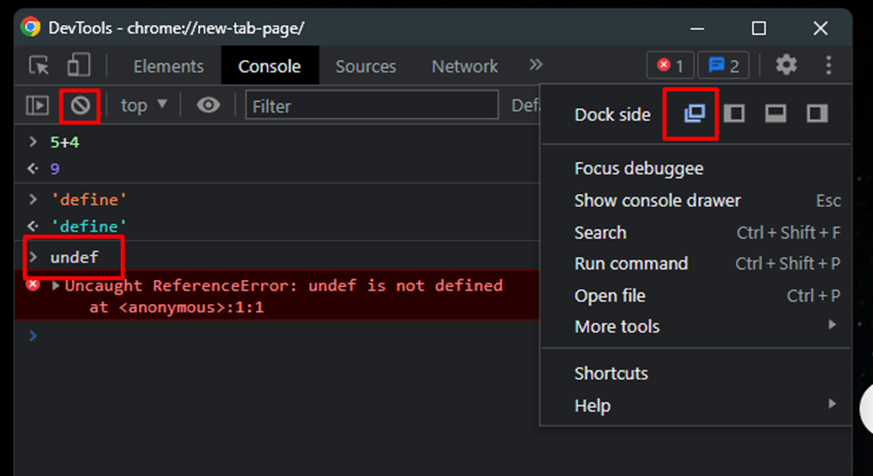
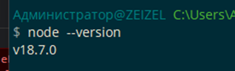
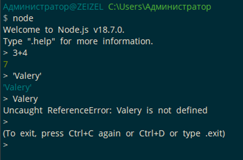
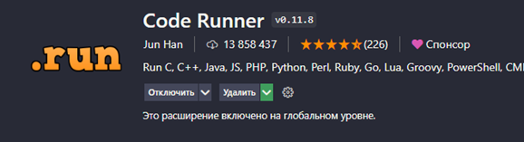
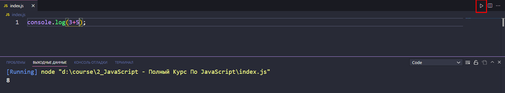

Ради удобства можно вывести инструменты разработчика в отдельное окно. 
Так же здешний интерпретатор спокойно возвращает значения введённого кода. Однако, когда мы пишем строку без кавычек, он пытается искать переменные и если их не находит, то выдаёт ошибку



Данная команда позволит проверить версию ноды

```bash
node --version
```



Командой `node` мы можем запустить интерпретатор внутри нашей консоли



Так же можно выводить результаты операций прямо в VS Code с помощью раннера

