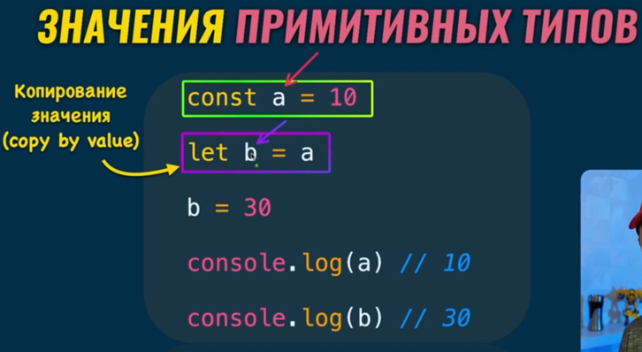
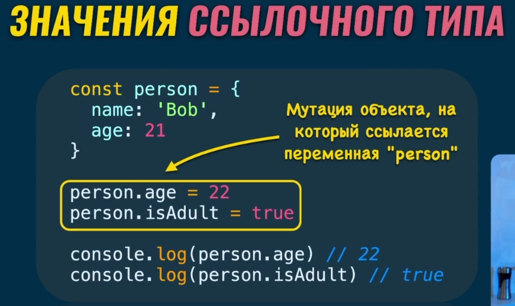
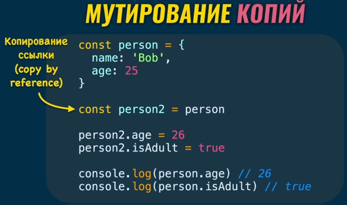
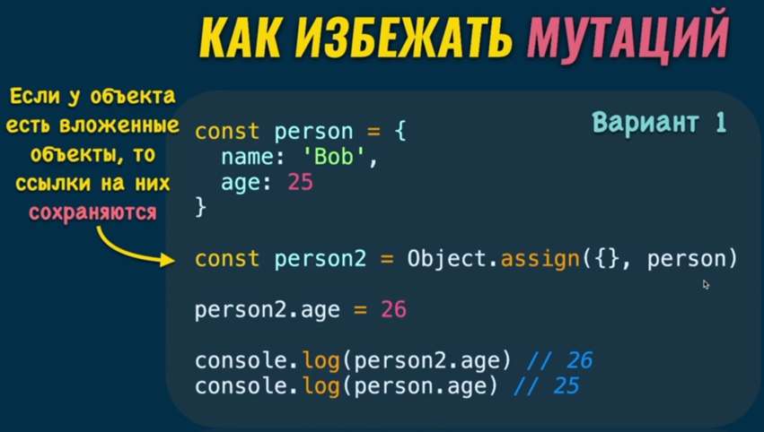
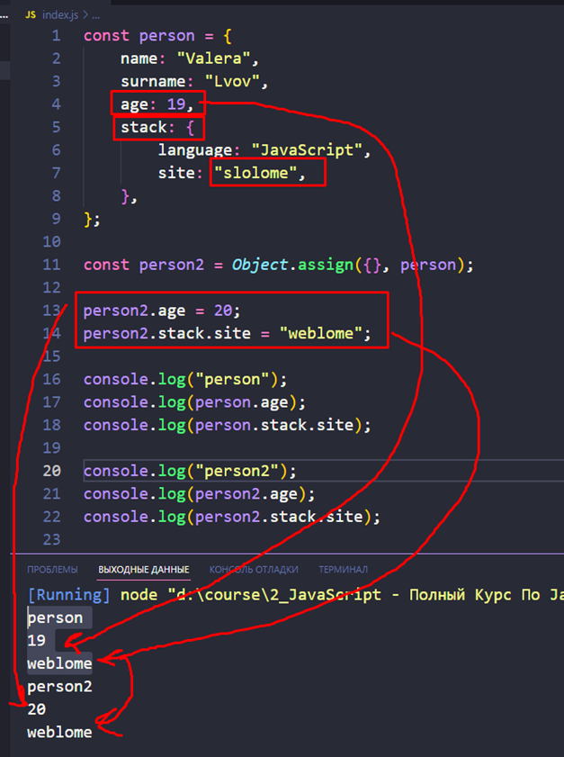
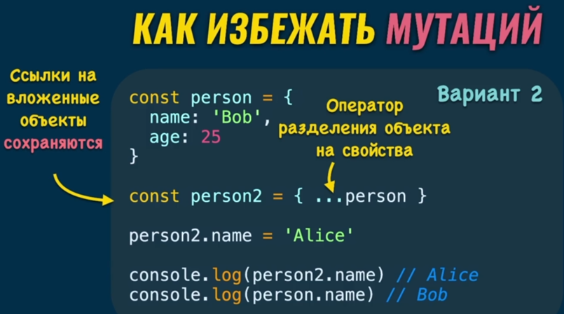
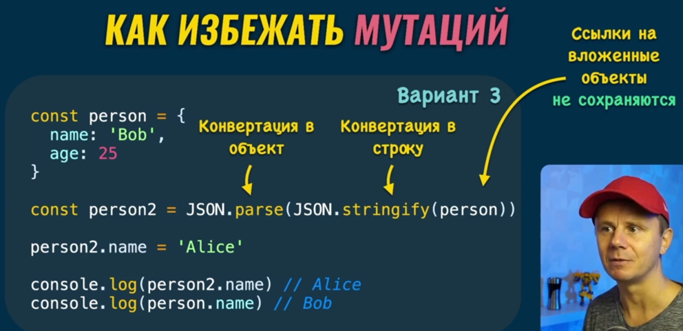
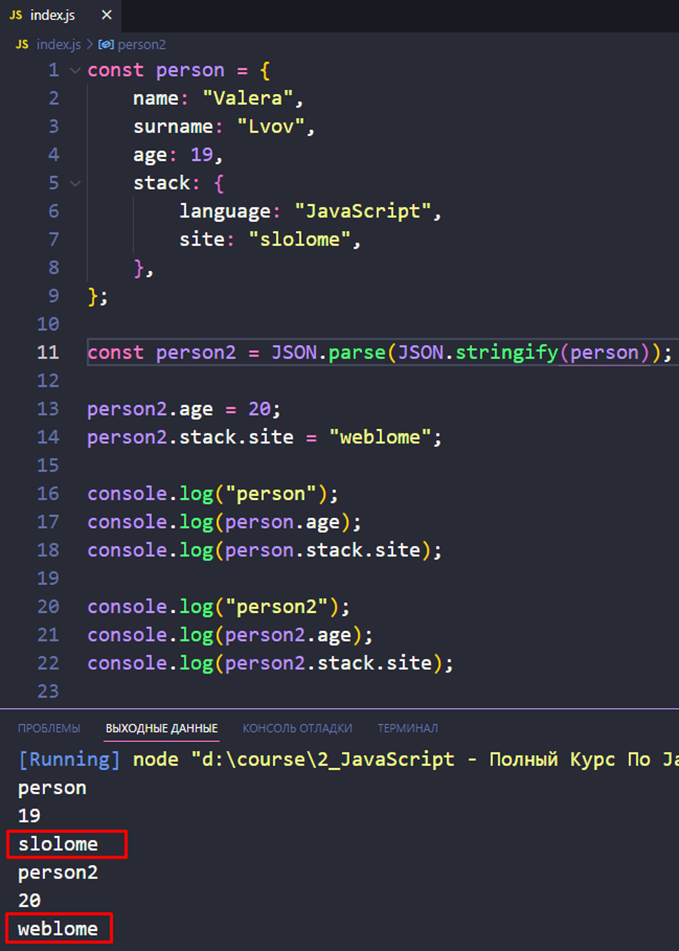

### 001 Мутация в JavaScript

Мутация представляет из себя изменение значений посредством переназначения переменной другого значения

Изменение значения свойства и добавление нового свойства

Тут описано изменение оригинала через копию объекта

### 002 Как избежать мутаций объектов

Первый способ избежать мутаций – это использовать `Object.assign({}, имя_объекта)`. Этот способ позволит избежать мутаций объекта без вложенных структур. На примере можно увидеть, что данные возраста остались разными, так как они находились в первой ступени объекта. Уже на второй ступени объекта ссылки в переменных всё так же продолжили ссылаться на один участок памяти

Так же вот второй вариант создания копии объекта – через оператор `spread` (`…`) и сборку его свойств через `{}`. То есть, оператор `…` разбивает объект на отдельные свойства, а `{ }` собирает эти свойства опять воедино и таким сбором создаётся новый объект. Однако проблема из прошлого варианта остаётся и ссылка на вложенный объект остаётся та же

И вот третий способ, который позволяет скопировать объект без шанса на мутацию. Мы парсим объект в строку и потом перепарсим в объект, что позволяет избавиться от ссылок на объект и спокойно им пользоваться

