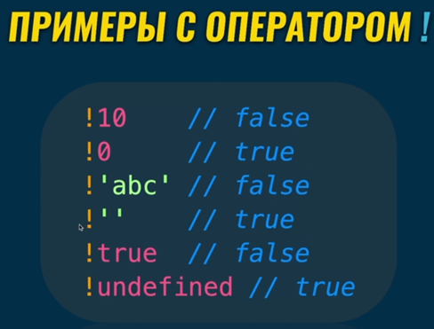
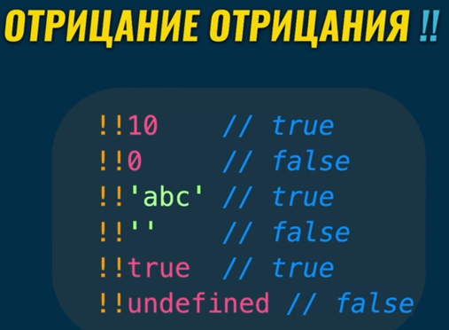
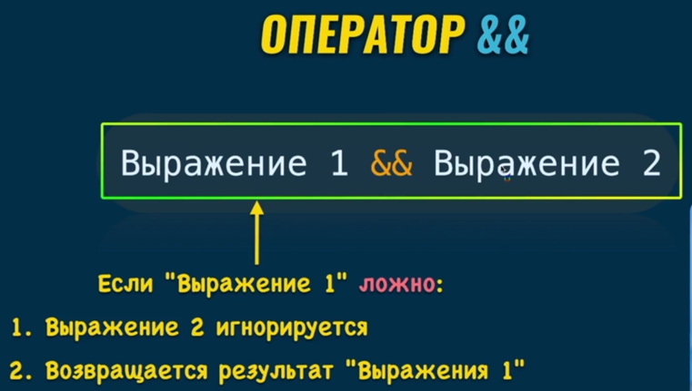
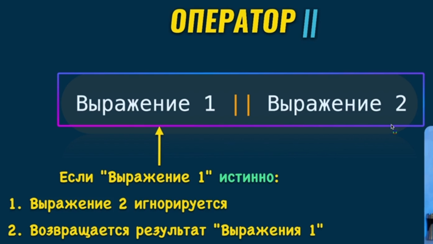
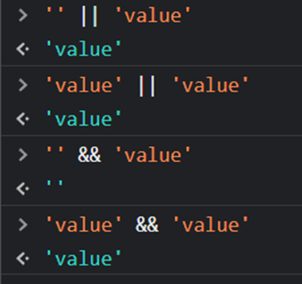
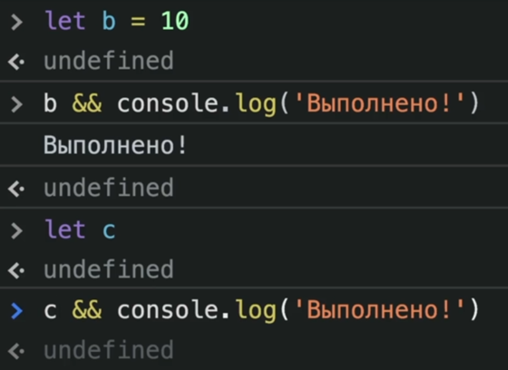

### 001 Оператор НЕ

Оператор отрицания переворачивает значение (было `true` стало `false` и наоборот). Двойное отрицание используется для проверки значения на `true/false` (например, нам нужно быстро проверить переменную на ложность значения, а не писать большую конструкцию `Boolean()`)

### 002 Оператор короткого замыкания И

Оба этих оператора возвращают _значения одного из аргументов_

Оператор сокращённого И позволяет не проверять второе выражение, если первое выдало `false`

### 003 Оператор короткого замыкания ИЛИ

### 004 Трюк с оператором И и вызовом функции

Так же есть трюк, который часто используют в JS. Если первый операнд у «сокращённого И» = `false`, то проверка и выполнение второй операции не будет проведено (пример из второй половины рисунка). А если первый операнд = `true`, то выполнение второго операнда тоже произойдёт, так как оператор `&&` его проверит.

Таким образом можно заменить несколько строчек `if` и в зависимости от правдивости первого операнда вызывать и свои функции, поставленные в качестве второго операнда

### 005 Цепочки выражений с операторами И и ИЛИ

И тут точно такая же логика работы операторов, как и при их парном прописывании. В первом случае на первом `false` выполнение прекратится. Во втором случае поиск `true` будет идти до самого конца, если первые три значения - `false`

