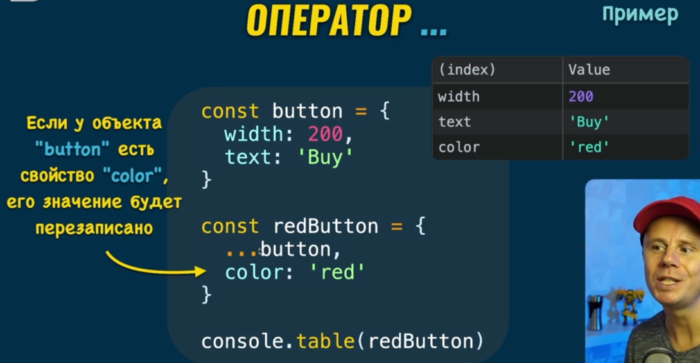
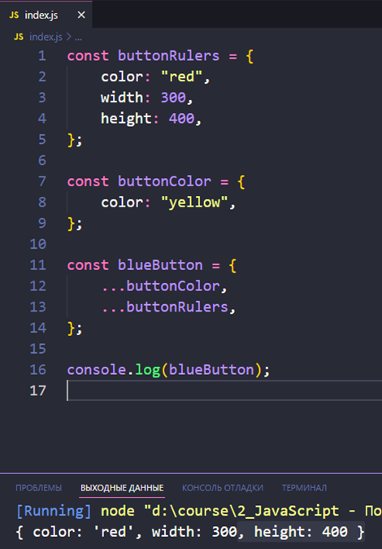
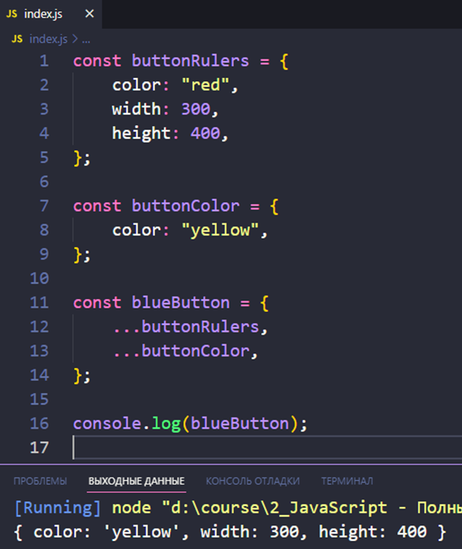

### 001 Оператор разделения объекта на свойства

Тут представлен оператор разделения на свойства в виде `...`. Он разделяет цельный объект на отдельные свойства внутри него находящиеся.

То есть если вставить внутри второго – первый объект и разделить его на свойства, то получится, что во втором объекте будут присутствовать свойства первого.

Так же стоит упомянуть, что если свойство `color` присутствовало бы в первом объекте, то оно бы было перезаписано свойством, которое находится внизу на то, что находится во втором (например, в `button{color:”yellow”}` – в данном случае, свойство заменится на `“red”`)

Вот пример, где свойства перезатираются тем, что находится ниже

Поэтому **порядок разделения на свойства – важен. Так же есть особенности работы с вложенными объектами**

