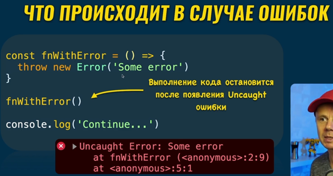
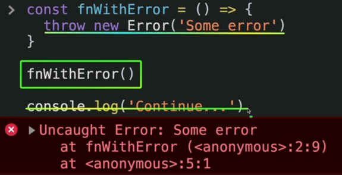
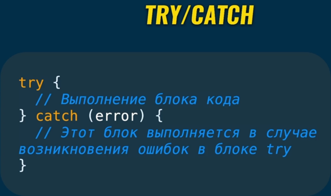
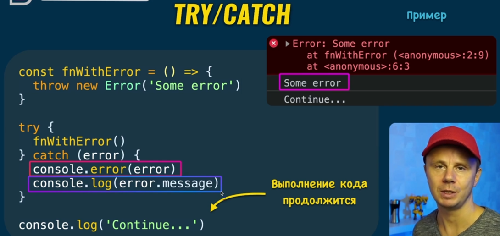

### 001 Обработка ошибок

В случае ошибок, у нас появляется в консоли сообщение об ошибке и выполнение кода останавливается (тут у нас не словленная (`uncaught`) ошибка)

Для исправления ситуации, чтобы код выполнялся, нужно воспользоваться конструкцией `try/catch`

Тут представлен пример, где мы создали ошибку и запихнули выполнение ошибки в `try`. Когда в `try` выполняется ошибка, мы сразу же перескакиваем в блок `catch` (в скобках мы именуем переменную с ошибкой как `error` или так далее), где мы выполняем определённые действия:

`console.error(error)` – выводит целую ошибку

`console.log(error.message)` – выводит только сообщение ошибки

Самый основной плюс использования `try/catch` – это продолжение работы кода после данного блока

