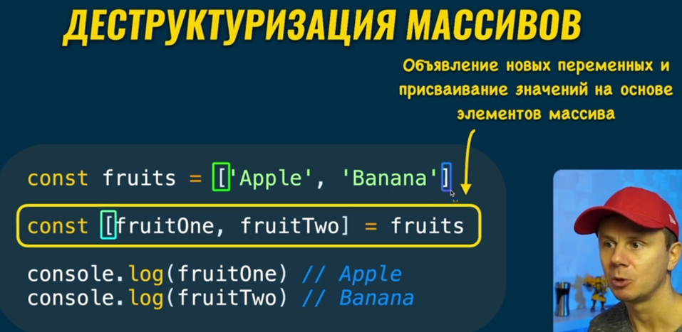
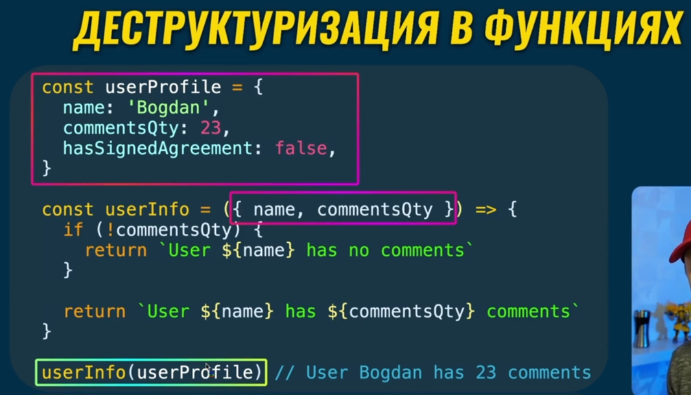
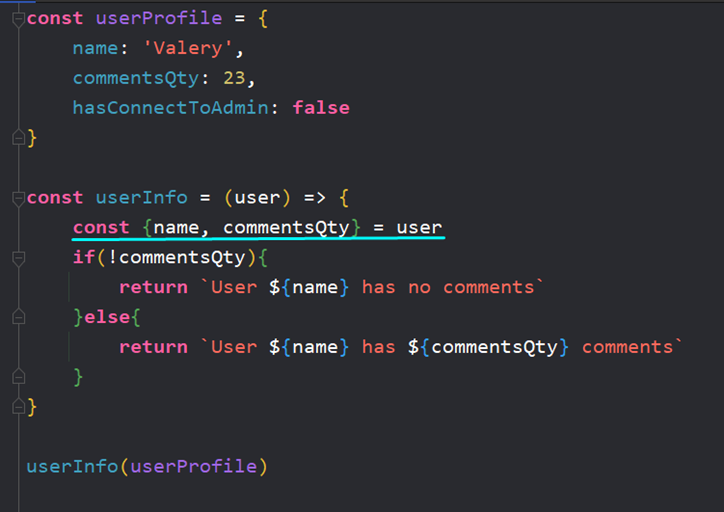

### 001 Деструктуризация объектов

Деструктуризация объектов позволяет создать в глобальной области видимости переменные с такими же именами, как свойства объекта

`const {name, commentsQty} = userProfile` – мы хотим создать две переменные, которые мы описали между «`{}`» с такими же значениями, как и в объекте `userProfile`

### 002 Деструктуризация массивов

Если при создании объекта не было разницы, в каком порядке мы создаём переменные, то уже тут при создании переменных будут подставляться значения по значениям с 0 индекса массива - поэтому порядок важен

### 003 Деструктуризация параметров функции

Уже в данном примере мы можем увидеть определённую структуру:

Мы имеем объект `userProfile`, в функцию `userInfo` кладём целый объект и в самой функции, в скобках аргументов «`()`» вкладываем оператор деструктуризации «`{}`» и внутри него вставляем нужные нам названия свойств из объекта. Это позволяет нам спокойно работать с нужными для нас данными

Так же нам ничто не мешает провести деструктуризацию внутри функции, но это всего лишь дополнительные строчки кода

