### 001 Условные инструкции

Есть 4 основных видов конструкций условных операторов

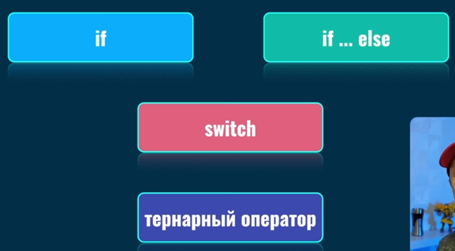

Так выглядит стоковый `if`

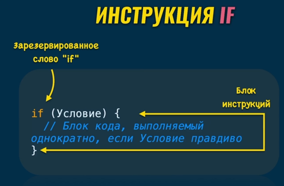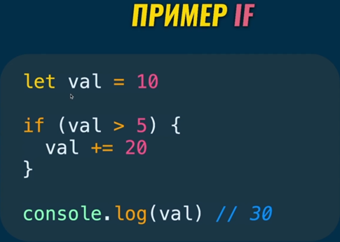

Тут мы проверяем в принципе наличие определённого свойства в объекте

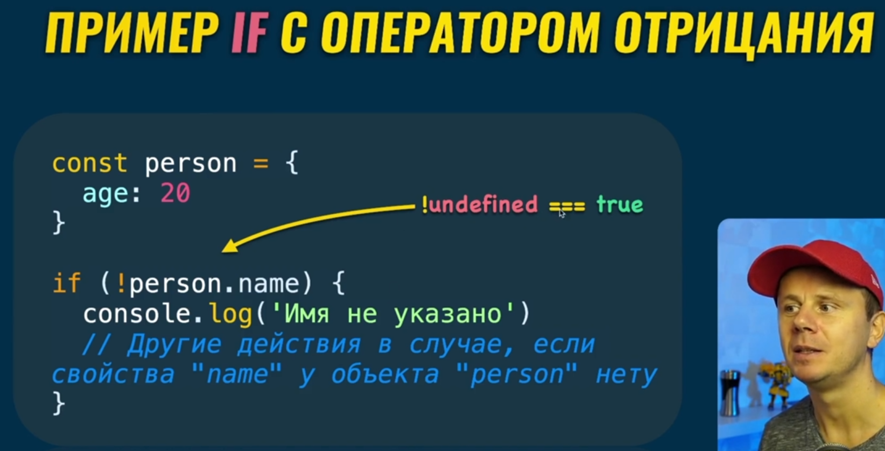

### 002 Условная инструкция `if else`

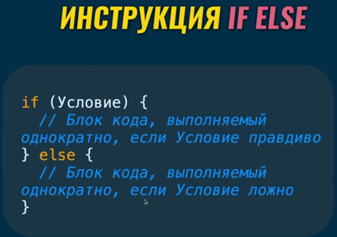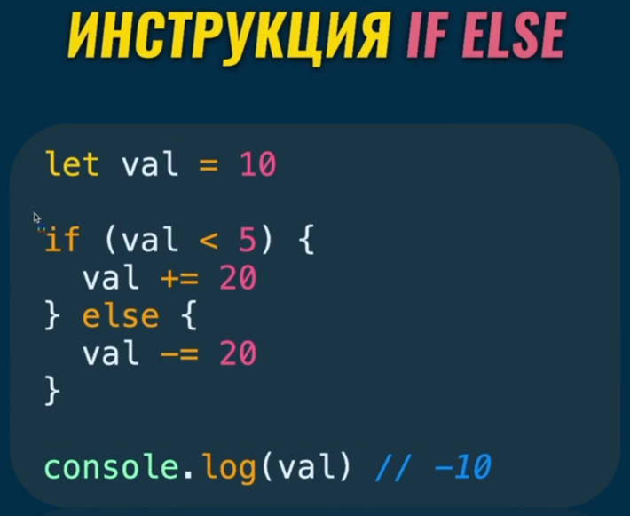

### 003 Условная инструкция `if else if`

Более предпочтительным вариантом их данных примеров является второй. Однако при втором подходе нужно учитывать, что нам не нужно выполнять прошлые условные конструкции (потому что тут они могут выполниться все сразу)

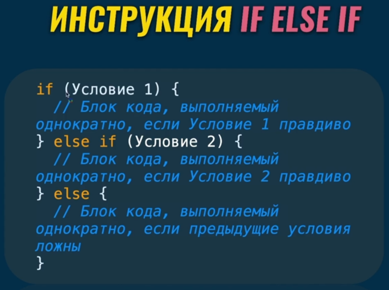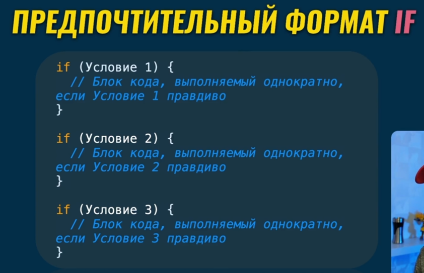

И вот пример разбиения условия на несколько отдельных условий:

```JS
const age = 7;

if (age > 18) {
	console.log('Adult');
} else if (age >= 12) {
	console.log('Teenager');
} else {
	console.log('Child');
}
```

```JS
const age = 25;

if (age > 18) {
	console.log('Adult');
}

if (age >= 12 && age < 18) {
	console.log('Teenager');
}

if (age < 12) {
	console.log('Child');
}
```

### 004 Использование `if` в функциях

И тут мы видим две проверки внутри функции. Тут стоит напомнить, что после написания оператора `return` выполнение функции останавливается и она сразу выдаёт результат.

Тут мы сначала проверяем даны ли нам в качестве аргументов числа, далее идёт проверка на отрицательность чисел, а уже только затем они складываются

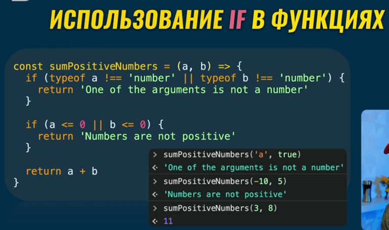

### 005 Инструкция `switch`

Тут уже можно задать множество значений для функции

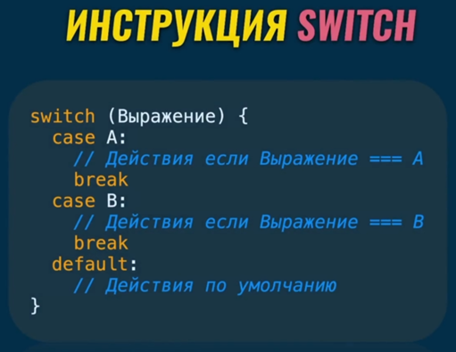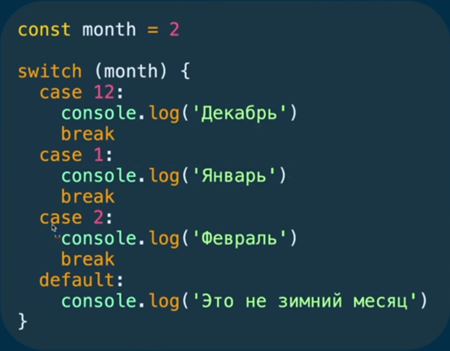
