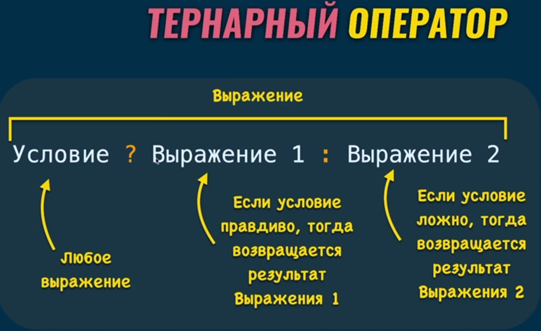
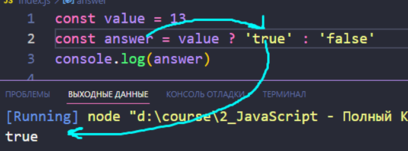
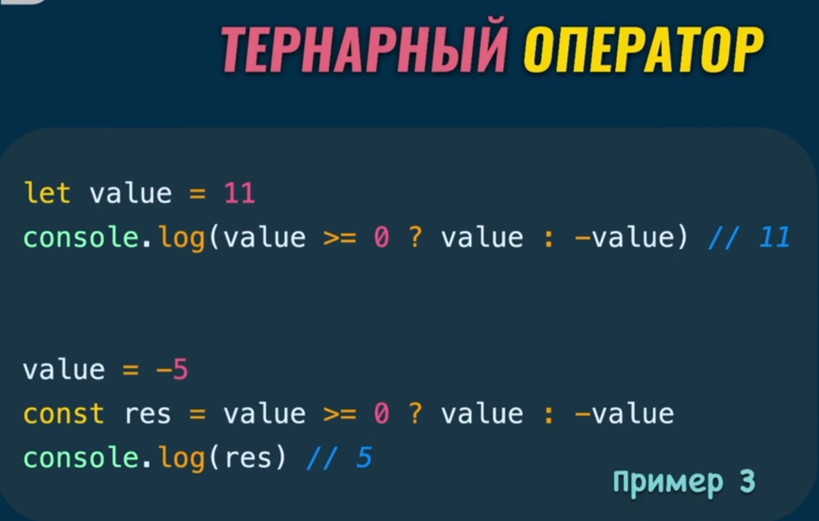

### 001 Тернарный оператор

**Тернарный оператор** – это оператор условия. Самое его главное отличие от стандартного условия заключается в том, что это **выражение**. А сами выражения можно, в свою очередь, присваивать переменным.

 

В данном случае, оператор вернёт `undefined`, так как `console.log()` это **инструкция** (выполнится в результате тернарного оператора функция консоли, но она не сможет присвоиться в переменную ответа). Во втором случае (когда мы оставили только строки), наша переменная получит значение **выражения**

Тут мы получаем результаты функций (так как результат функции – это выражение)

Тут мы можем вывести как сам тернарный оператор в консоли (так как он выдаст результат данного выражения) либо присвоить ТО в переменную (так как он, опять же, является выражением)

