### 001 Модули

Модули позволяют подразделить проект на несколько разных файлов

То есть мы можем вывести функцию в отдельный модуль и уже вызывать этот модуль в другом модуле

Так выглядят две основных инструкции, которые отвечают за импорт и экспорт

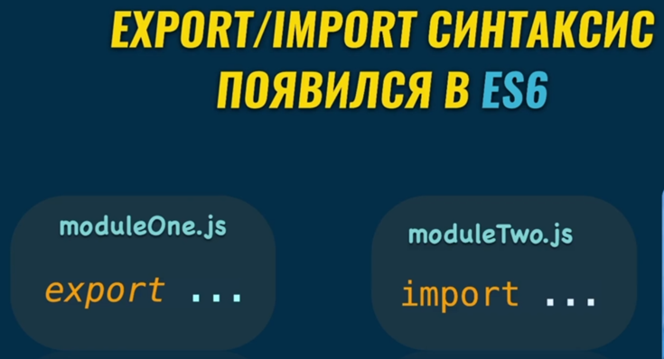

Ну и так выглядит экспорт одной функции из первого во второй модуль. Так как экспортируется у нас дефолтная функция, то во втором файле мы можем дать её любое имя.

- `./` говорит нам о том, что файл нужно искать в одной папке с данным документом
- `../` - выводит на одну дирректорию вверх

### 002 Создание и запуск модулей с помощью Node

И должна выполняться ещё одна главная особенность – файлы должны именоваться не `js`, а `.mjs`

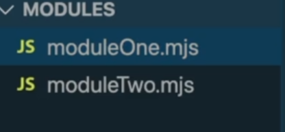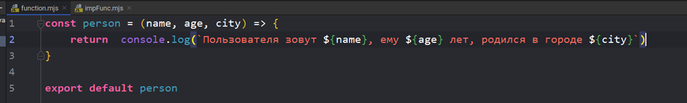
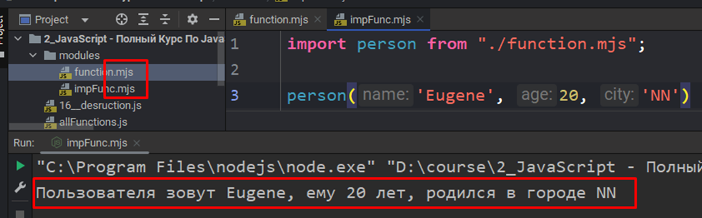

### 003 Несколько экспортов

Так же тут показана реализация импорта сразу нескольких функций, объектов, переменных и т.д. через передачу их наименований между `{}`

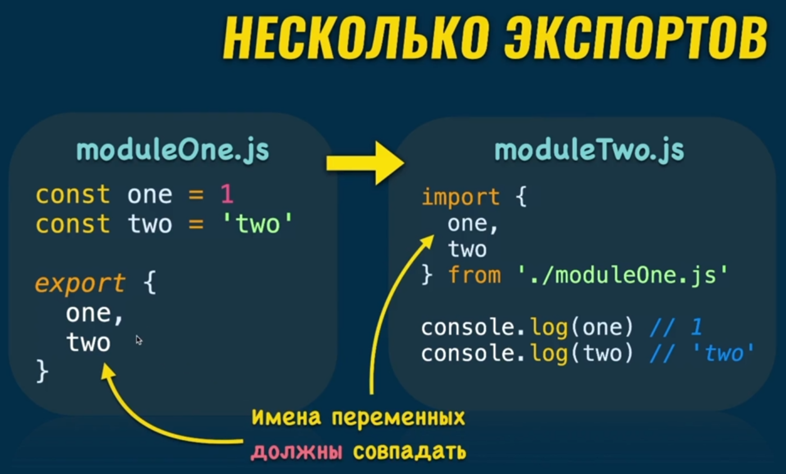

Так же крайне просто реализован синтаксис переименования переменных при импорте

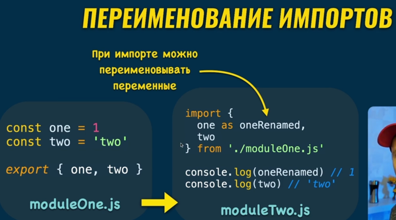

### 004 Правила работы с модулями

Стоит делать модули небольшими, чтобы была возможность пользоваться `export default`. Так же если мы пользуемся импортом модулей того же ==React==, то сначала вставляем модули фреймворков, а уже затем вставляем свои модули

### 005 Практика по созданию нескольких экспортов

Тут хочется отметить, что так же можно вызывать срабатывание файла через терминал (там нужно использовать ноду)

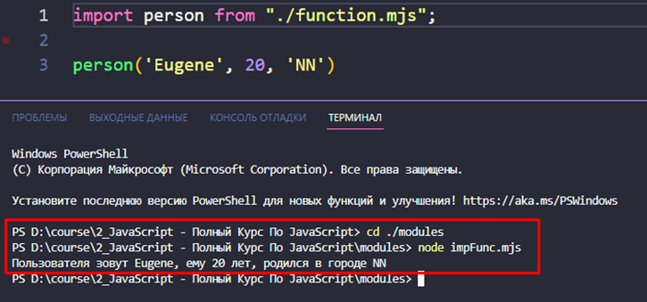

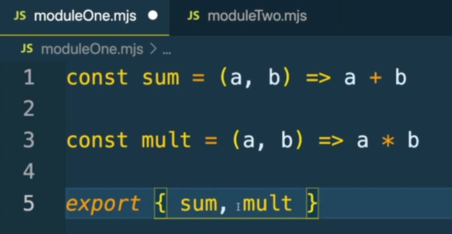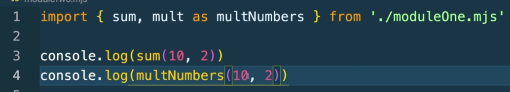

### 006 Как используются модули в React

Во-первых, нужно упомянуть, что ==npm== – это ==node.js package manager==. С помощью него мы можем выполнять определённые команды по типу генерации шаблонных проектов

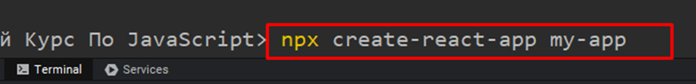

И тут мы видим, что у реакта импортируется всего один модуль (без `{}`), хотя у него копируется огромное количество пакетов. Импортируются они без «`/`», так как импорт идёт из внешнего модуля. А уже `App` импортируется из файла с нашим приложением, поэтому тут ставится «`./`». Так же нужно упомянуть, что `.js` (расширение файла) можно опускать при написании импорта

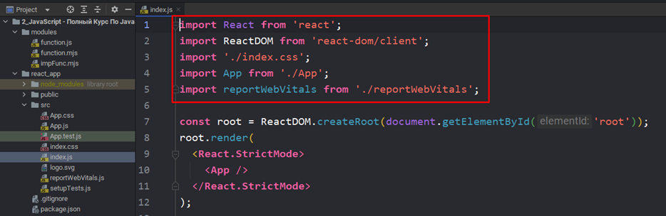
