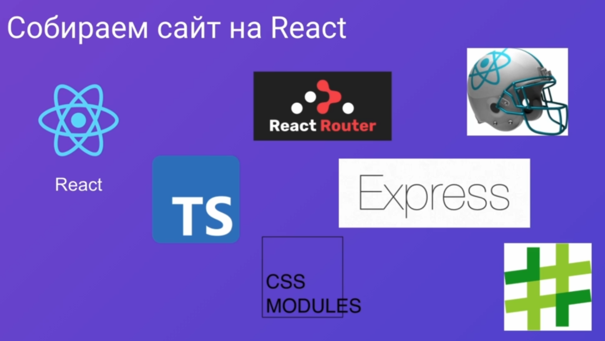

### 001 Преимущества NextJS

Чтобы собрать современный сайт на React, нужно использовать крайне много сторонних фреймворков и библиотек, которые будут у нас реализовывать SSR, роутинг, модульность и так далее.

Однако можно выбрать один из фреймворков, который заменит нам огромную кучу сторонних технологий. Конкретно у нас есть два фреймворка, которые используются для разных случаев. 
Первый фреймворк используется на статичных сайтах, которые редко обновляются. 
Второй фреймворк уже используется на динамических сайтах для подхватывания данных и для их обновления в реальном времени

Преймущества Некста

