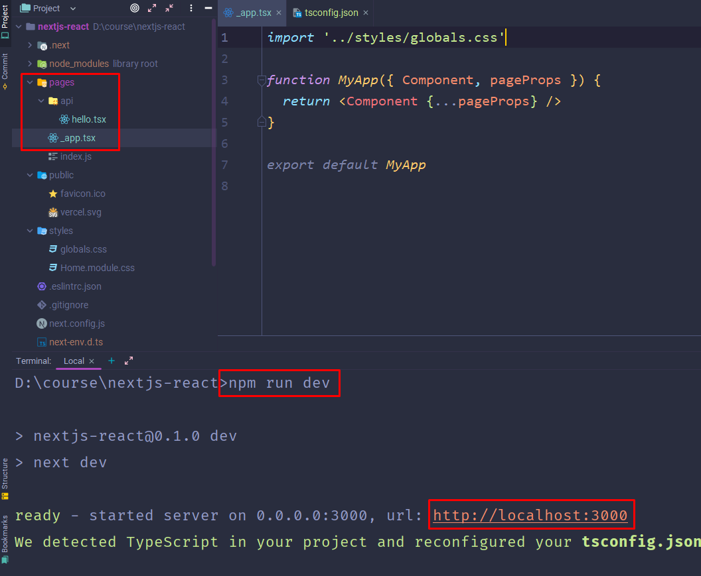
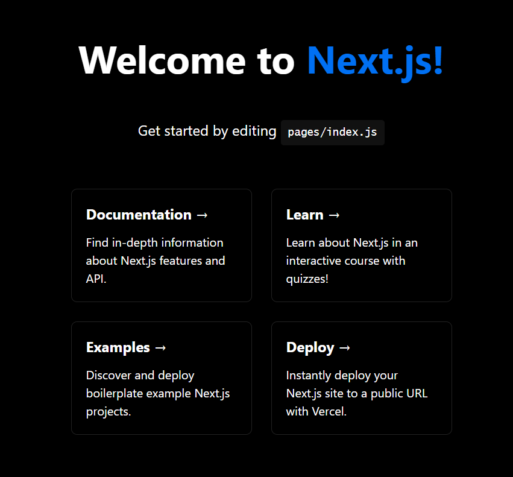
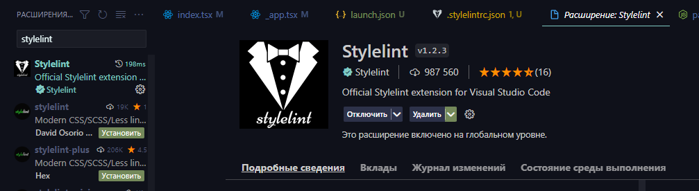
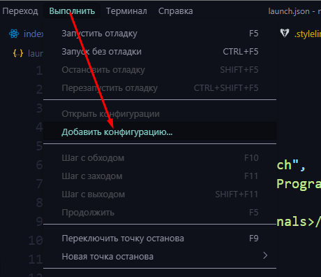
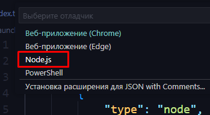
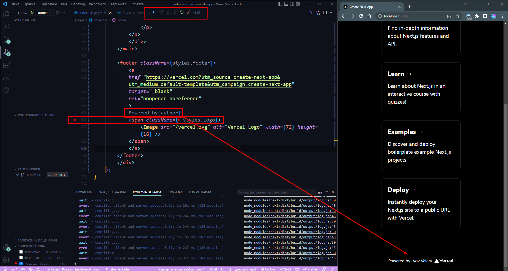
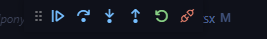
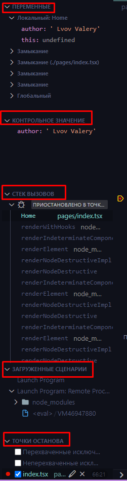
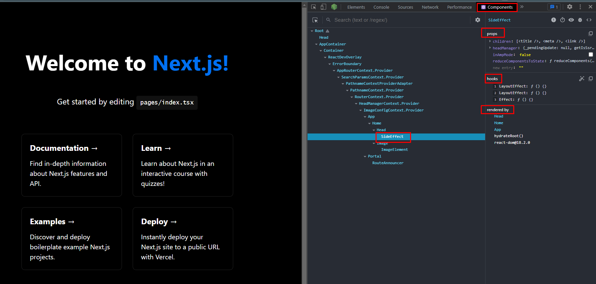

### 002 Развертка проекта

**Стандартная установка NEXT проекта + TS**
Через терминал выше корневой папки проекта:

1. Мы должны через исполнитель npm пакетов (npx) создать проект, где будет использоваться npm
2. Дальше переходим в папку с проектом
3. Инициализируем ТС
4. Устанавливаем сами тайпы и dev dependencies к ним (нужный тайпы на реакт и ноду, так как они используются как в самом нексте, так и в проекте)
5. Запускаем компилятор

```bash
npx create-next-app <имя_проекта> --use-npm

cd <имя_проекта>

tsc --init

npm i -D typescript @types/react @types/node

npm run dev
```

Компилятор выдаст ссылку, по которой можно будет открыть разрабатываемый проект
Так же абсолютно все скрипты в папке pages можно переименовать в ==tsx==




**Установка через готовый шаблон**

```bash
npx create-next-app@latest <имя_проекта> --ts
npm run build
npm run start
```

### 003 Структура проекта

В папке `.next` содержатся все скомпилированные файлы.
В папке `pages` хранятся все страницы, по которым будет производиться роутинг по нашему сайту. Тут будут храниться только конкретные страницы без всяких отдельных компонентов.
В папке `public` содержатся все элементы для сёрвинга на сайте (манифесты, фавиконы, изображения).
Папка `styles` хранит в себе стили

Так же вот те 4 команды, которые определяют, что будет выполняться:

- dev - это компиляция и авторефреш страницы
- билд/старт - собирает проект на продакшн и даёт его запустить

```JSON
"scripts": {
  "dev": "next dev",
  "build": "next build",
  "start": "next start",
  "lint": "next lint"
},
```

Так же произведём небольшие изменения в ТСконфиге:

- Включаем строгий режим
- Отключаем обязательность инициализации свойства класса
- Отключаем принятие чистого JS в файлах

```JSON
"strict": true,
"strictPropertyInitialization": false,
"skipLibCheck": true,
"allowJs": false,
```

### 004 Настройка eslint

Устанавливается `eslint` таким образом:

```bash
npm i -D eslint @typescript-eslint/parser @typescript-eslint/eslint-plugin
```

А тут правила, которые запретят использовать пустые интерфейсы (кроме тех, которые имплиментируются) и будет указывать варном, что на стоят типы и `;`

`.eslintrc`

```JSON
{
	"root": true,
	"parser": "@typescript-eslint/parser",
	"plugins": [
		"@typescript-eslint"
	],
	"rules": {
		"semi": "off",
		"@typescript-eslint/semi": [
			"warn"
		],
		"@typescript-eslint/no-empty-interface": [
			"error",
			{
				"allowSingleExtends": true
			}
		]
	},
	"extends": [
		"eslint:recommended",
		"plugin:@typescript-eslint/eslint-recommended",
		"plugin:@typescript-eslint/recommended"
	]
}
```

### 005 Настройка stylelint

Устанавливаем зависимости

```bash
npm i -D stylelint stylelint-config-standard stylelint-order stylelint-order-config-standard
```

Устанавливаем плагин стайллинта в наш редактор



Далее копируем настройки

`.stylelintrc.json`

```JSON
{
	"extends": [
		"stylelint-config-standard",
		"stylelint-order-config-standard"
	],
	"plugins": [
		"stylelint-order"
	],
	"rules": {
		"indentation": [
			"tab"
		],
		"color-hex-case": "upper"
	}
}
```

Запуск линта можно забиндить в скрипт нашего основного пэкеджа

`package.json`

```JSON
"scripts": {
    "dev": "next dev",
    "build": "next build",
    "start": "next start",
    "lint": "next lint",
    "stylelint": "stylelint \"**/*.css\" --fix"
  },
```

### 006 Отладка в VSCode

Первым делом нам нужно создать файл отладки ноды (так как некст простроен на ноде)



`.vscode > launch.json`

```JSON
{
	"version": "0.2.0",
	"configurations": [
		{
			"type": "node",
			"request": "attach",
			"name": "Launch Program",
			"skipFiles": [
				"<node_internals>/**"
			],
			"port": 9229
		}
	]
}
```

Далее нам нужна утилита для смены окружения

```bash
npm i cross-env
```

Добавляем скрипт в консоль

`package.json`

```JSON
"scripts": {
    "dev": "next dev",
    "debug": "cross-env NODE_OPTIONS='--inspect' next dev",
    "build": "next build",
    "start": "next start",
    "lint": "next lint",
    "stylelint": "stylelint \"**/*.css\" --fix"
  },
```

Далее пишем эту команду в терминале и в ==VSCode== нажимаем `F5`

```bash
npm run debug
```

И теперь мы имеем доступ к отладке нашего приложения из VSCode



Тут мы можем продолжить выполнение программы, перескочить сразу на следующую контрольную точку, войти в функцию, выйти из неё, перезапустить программу и отцепиться от дебага



Далее слева мы видим

- переменные нашей программы
- значения, которые применяются и изменяются в процессе работы приложения
- стек вызовов, который привел нас к этой точке, на которой мы находимся
- скрипты, которые сейчас используются
- и сами точки останова



### 007 React Dev Tools

Устанавливается через магазин ==google chrome extensions==. Тут мы можем посмотреть сами компоненты, кем они зарендерены, какие в них используются хуки и какие пропсы он имеет


