### 001 React Hooks

В обычной жизни, когда нам нужно просто вывести компонент без изменения его жизненного цикла, состояния и прочих вводных - мы можем пользоваться просто функциональными компонентами. В старом реакте нельзя было пользоваться функциональными компонентами, если мы хотели менять его состояние во времени.

На данный момент после версии ==React 16.8== мы наконец можем пользоваться хуками, которые позволяют изменять состояние функциональных компонентов без использования классов и их возможностей.

На данный момент классовым компонентом обязательно является только `Error Boundaries`


Сейчас рекомендуется использовать только функциональные компоненты, так как они упрощают разработку веб-приложения - облегчают визуальное представление и разбиение кода на компоненты

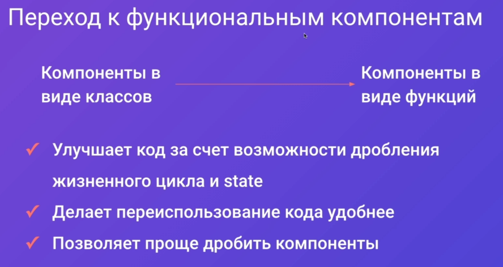

Всего имеются 3 основных компонента:

- `useState` - позволяет работать с состоянием компонента
- `useEffect` - позволяет подписаться на изменение жизненного цикла объекта и производить изменения. Может, например, срабатывать при изменении пропса компонента
- `useContext` - позволяет использовать глобальный контекст (записывать в него значение и читать)

И 7 дополнительных:

- `useReducer` - позволяет контролировать состояние объекта, как и `useState`, но больше подходит под стиль работы ==Redux==
- `useCallback` - позволяет выполнить функцию при изменении входящих параметров
- `useMemo` - позволяет запомнить результат функции и не будет требовать перерендера компонента при изменении входящих параметров
- `useRef` - отвечает за получение ссылки с компонента на имя в дом-дереве
- `useLayoutEffect` - это эффект, который триггерится после построения дом-дерева (не стоит использовать, так как он может затормозить все анимации)
- `useImperativeHandle` - позволяет прокидывать на родительские компоненты какие-либо референсы
- `useDebugValue` - позволяет отображать в ==DevTools== какую-либо величину для дебага

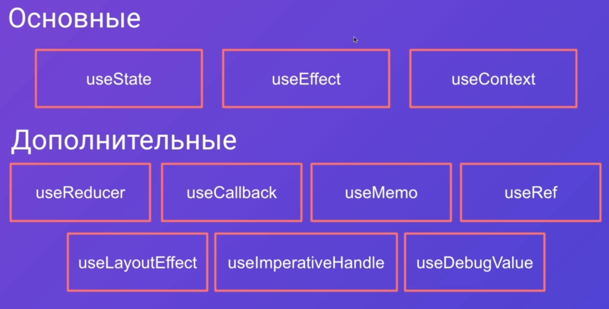

### 002 useState

Данная функция позволяет управлять состоянием объекта и менять его.

Она возвращает tuple из _самого значения состояния_ и _функции, которая позволяет менять данное состояние_.

Сама функция принимает в себя любое значение. В дженерике находится передаваемый в неё тип данных


Состояний в одном компоненте может быть сколько угодно - деструктуризация на плечах программиста

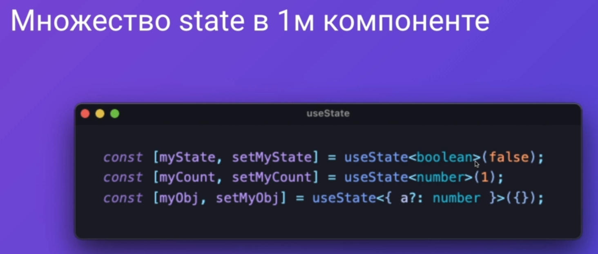

Возвращать мы всегда должны абсолютно новый объект, который будет иметь полностью тот же вид, но другое значение. _Мутировать объекты - нельзя_

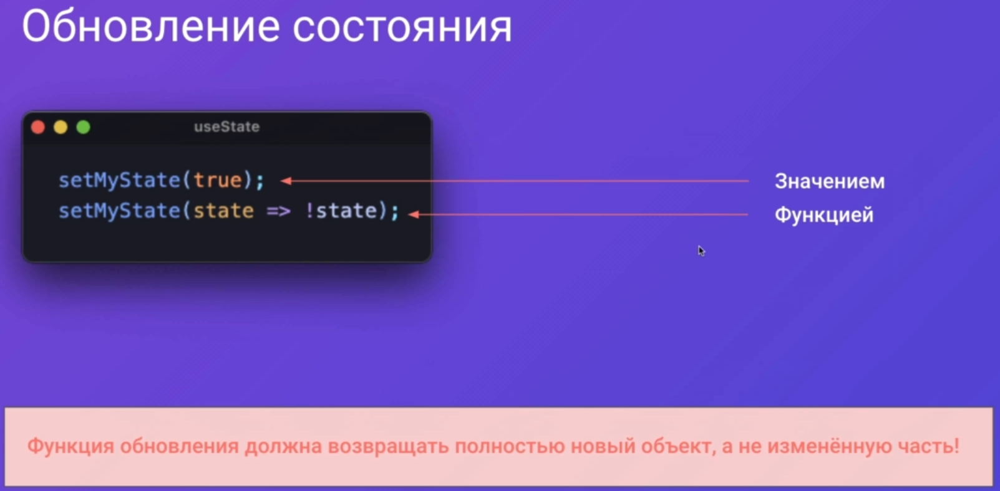

Так же мы можем для инициализации нового состояния (со своим значением) определить функцию, которая вернёт уже готовое значение состояния

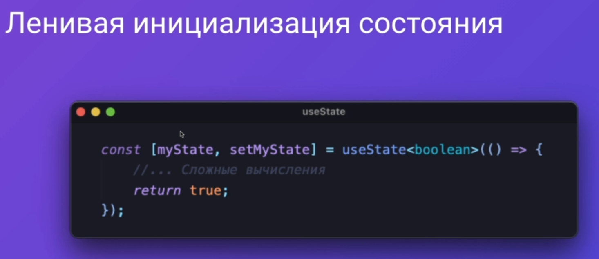

Добавим небольшой код, в котором мы определим состояние счётчика и будем имеющимися двумя кнопками менять это состояние.
Конкретно функция `setCounter()` позволяет нам поменять внутри себя значение `counter`. Данная функция принимает в себя значение состояния и возвращает всегда новый объект (старое значение состояния утилизируется)

`index.tsx`

```JSX
import { useState } from 'react';
import { Button, Htag, Paragraph, Tag } from '../components';

export default function Home(): JSX.Element {
	const [counter, setCounter] = useState<number>(0);

	return (
		<>
			<Htag tag="h1">{counter}</Htag>
			<Button appearance="primary" arrow="right" onClick={() => setCounter((x)=>++x)}>
				Кнопка прибавления числа
			</Button>
			<Button appearance="ghost" arrow="down" onClick={() => setCounter((x) => --x)}>
				Кнопка убавления числа
			</Button>
			<Paragraph size="l">БОЛЬШОЙ: Текста очень много</Paragraph>
			<Paragraph size="m">СРЕДНИЙ: Текста очень много</Paragraph>
			<Paragraph size="s">МАЛЕНЬКИЙ: Текста очень много</Paragraph>
			<Tag color="green" size="m">
				-10000
			</Tag>
			<Tag size="m" color="primary" href="www.google.com">
				Google
			</Tag>
		</>
	);
}
```

И теперь можно покликать на кнопки, что позволит уменьшить и увеличить значение данного счётчика

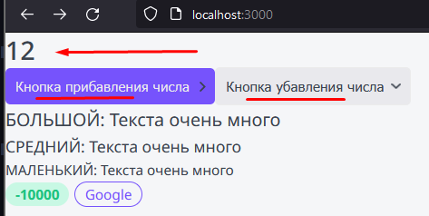

Если вместо `useState` мы попытаемся использовать обычное изменение значения, то у нас ничего не получится. Дело будет заключаться в том, что хук даёт распоряжение реакту перерендерить само значение и связанные с ним компоненты и поэтому они на странице обновятся. При обычном изменении значения реакт не будет знать, что страницу нужно перерендерить и значение не будет перед нами меняться

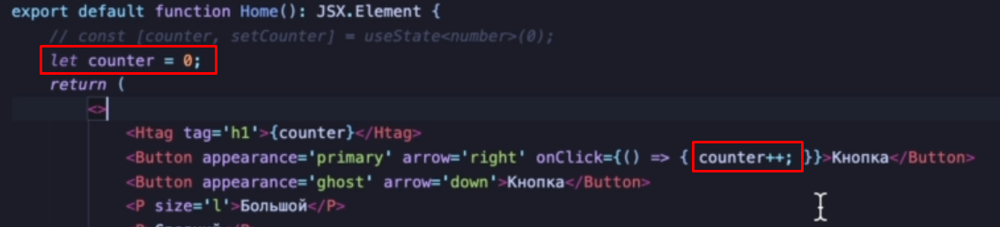

### 003 useEffect

Функция `useEffect` выполняется сразу после изменение какой-любо величины, которую мы определили в качестве зависимости. Сама функция внутри себя выполняет определённую логику (на эффект на странице). И далее по желанию можно вернуть функцию, которая будет что-то выполнять.

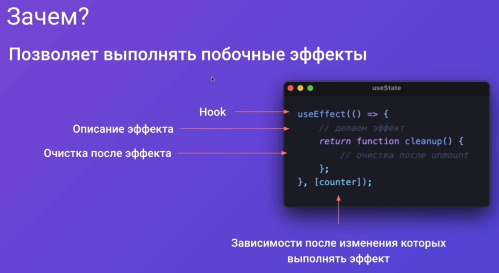

1. Если мы передадим пустой массив зависимостей, то функция выполнится один раз ровно во время первого появления компонента на странице
2. Во втором случае функция будет выполняться каждый раз, когда будет выполняться любой перерендер страницы (эта функция будет происходить асинхронно и рендер не будет ждать выполнения этого эффекта)
3. Если мы выполняем какую-то функцию и возвращаем другую функцию и так же мы подписаны на пустой массив, то эффект будет срабатывать только при исчезновении компонента со страницы
4. Самый частый. Выполняется только при изменении параметра, на который подписан `useEffect`

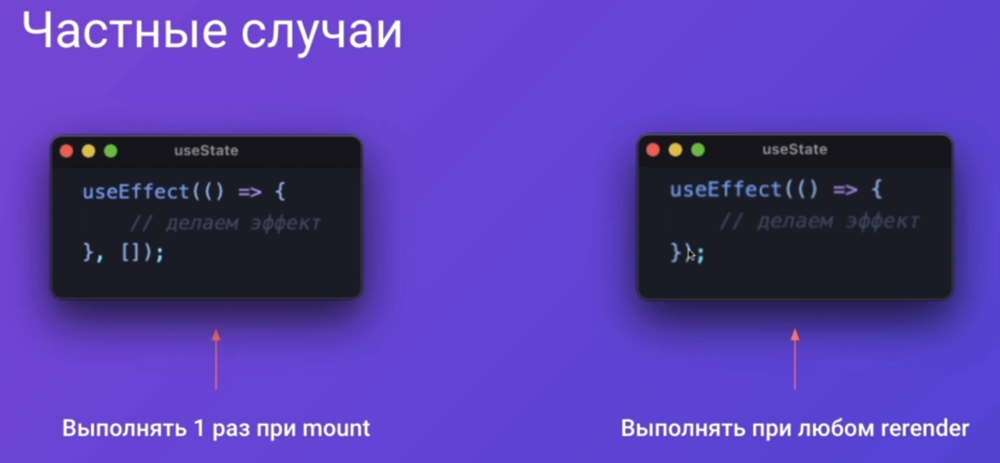
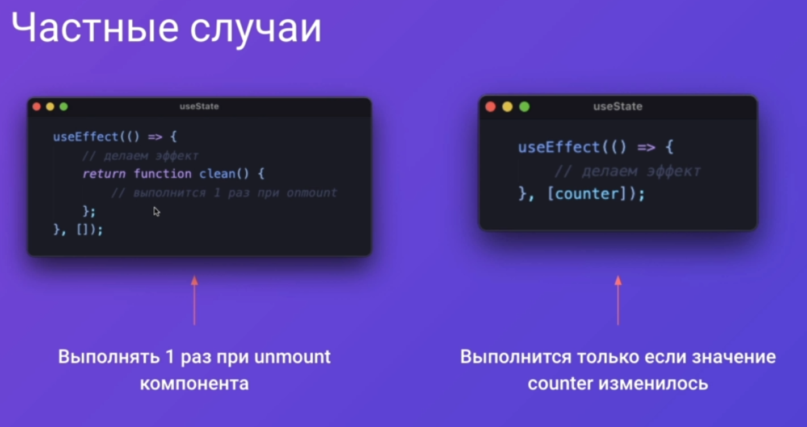

Тут эффект срабатывает при каждом нажатии и при размонитровке компонента

`index.tsx`

```TSX
const [counter, setCounter] = useState<number>(0);

useEffect(() => {
	console.log('Counter ' + counter);
	return function cleanup() {
		console.log('Umount');
	};
});
```

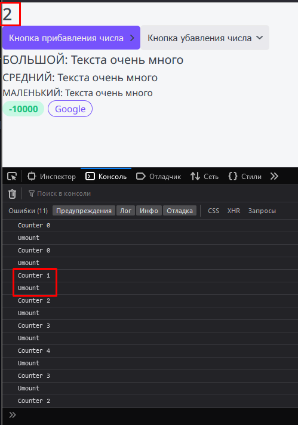

Тут эффект сработает только один раз

`index.tsx`

```TSX
useEffect(() => {
	console.log('Counter ' + counter);
	return function cleanup() {
		console.log('Umount');
	};
}, []);
```

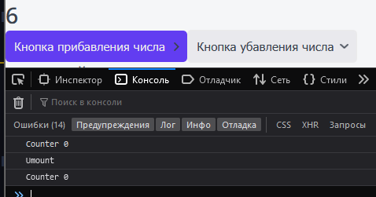

Так же можно использовать сразу несколько `useEffect`.И теперь у нас можно увидеть, когда компонент смонитровался и появился.

`index.tsx`

```TSX
useEffect(() => {
	console.log('Counter ' + counter);
	return function cleanup() {
		console.log('Umount');
	};
}, []);

useEffect(() => {
	console.log('Mounted');
}, []);
```

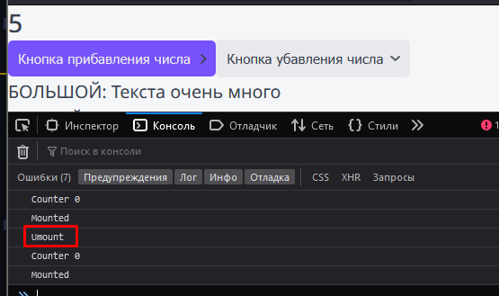

### 004 Правила использования Hooks

1. Все хуки нужно вызывать как из самого компонента либо из пользовательских компонентов. Тем самым мы обеспечиваем выполнение хуков в течение жизненного цикла компонента.
2. Так же хуки всегда должны использоваться только на верхнем уровне компонента. Вкладывание хуков - запрещено. Пример снизу показывает неправильную реализацию работы хука:
   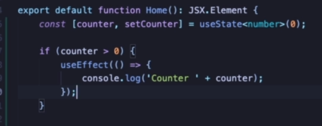
   Тут уже представлен правильный пример, где условие находится внутри хука:
   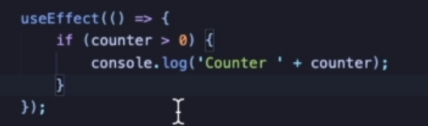

Установим дополнительно плагин еслинта для реакт-хуков

```bash
npm install eslint-plugin-react-hooks --save-dev
```

Добавляем данную строчку

```JSON
{
	"extends": [
		"plugin:react-hooks/recommended"
	]
}
```

С такими настройками нам теперь нельзя вкладывать хуки в другие вложения

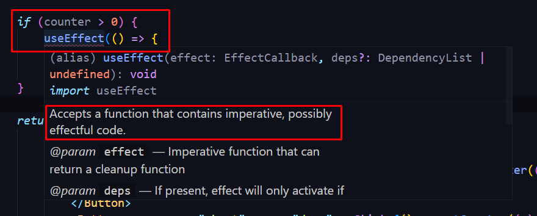

### 005 Архитектура компонента рейтинга

Рейтинг будет на входе получать значение рейтинга. На него будет воздействовать наведение мышкой. На выходе будет управляться установкой нового рейтинга и функциями при нажатии.

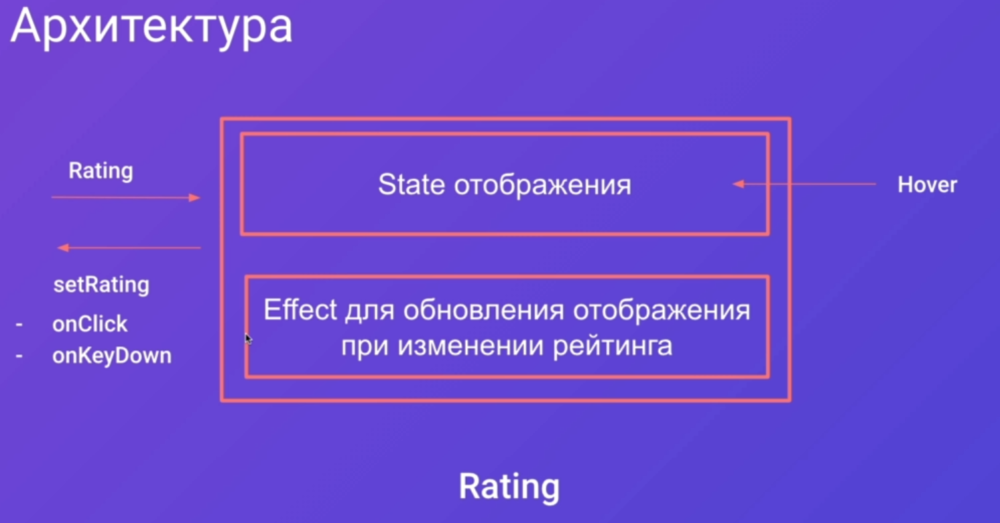

### 006 Компонент рейтинга

Так выглядит структура рейтинга:

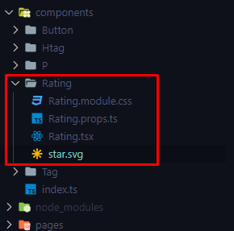

Добавим в вебпак возможность парсить svg иконки, которые были добавлены прямо в `jsx` файлы

`next.config.js`

```JS
module.exports = {
	images: {
		domains: ['courses-top.ru']
	},
	webpack(config, options) {
		config.module.rules.push({
			loader: '@svgr/webpack',
			issuer: /\.[jt]sx?$/,
			options: {
				prettier: false,
				svgo: true,
				svgoConfig: {
					plugins: [{
						name: 'preset-default',
						params: {
							override: {
								removeViewBox: false
							}
						}
					}],
				},
				titleProp: true,
			},
			test: /\.svg$/,
		});

		return config;
	},
};
```

Пропсы будут в себя принимать проверку на то, изменяемый ли это рейтинг, само число рейтинга и возможность установки своего рейтинга

`Raiting.props.ts`

```TS
import { DetailedHTMLProps, HTMLAttributes } from 'react';

export interface RatingProps
	extends DetailedHTMLProps<HTMLAttributes<HTMLDivElement>, HTMLDivElement> {
	isEditable?: boolean;
	rating: number;
	setRating?: (rating: number) => void;
}
```

Стили для иконки рейтинга (тут стили сделаны с учётом того, что иконка находится внутри `<span>`):

`Raiting.module.scss`

```SCSS
.filled svg {
	fill: var(--primary);
}

.star svg {
	margin-right: 5px;
}

.editable {
	cursor: pointer;
}
```

Сам компонент будет через `useState` хранить в себе элементы рейтинга, а `useEffect` будет триггерить создание массива рейтинга.

`Raiting.tsx`

```TSX
import { RatingProps } from './Rating.props';
import styles from './Rating.module.css';
import cn from 'classnames';
import StarIcon from './star.svg';
// нужно обратить внимание, что у реакта есть свой ивент на нажатие клавиш и пользоваться тут нужно им
import { useEffect, useState, KeyboardEvent } from 'react';

export const Rating = ({ isEditable = false, rating, setRating, ...props }: RatingProps): JSX.Element => {
	// заполняем массив пустыми JSX-элементами
	const [ratingArray, setRatingArray] = useState<JSX.Element[]>(new Array(5).fill(<></>));

	// вызвать срабатывание генерации массива звёздочек будет useEffect
	useEffect(() => {
		constructRating(rating);
	}, [rating]);

	// тут мы конструируем новый массив с текущим количеством звёзд
	const constructRating = (currentRating: number) => {
		// это новый массив из элементов со звёздочкой
		const updatedArray = ratingArray.map((r: JSX.Element, i: number) => {
			return (
				<span
					className={cn(styles.star, {
						// завёздочки заполняются до i, пока он не б
						[styles.filled]: i < currentRating,
						[styles.editable]: isEditable
					})}
					// фукнция при наведении мыши
					onMouseEnter={() => changeDispay(i + 1)}
					// функция, которая сработает при уходе мыши - покажет исходный рейтинг
					onMouseLeave={() => changeDispay(rating)}
					// при клике рейтинг установится в данное число, которое мы выбрали
					onClick={() => onClick(i + 1)}
				>
					<StarIcon
						{/* устанавливаем индекс таба для его нормальной работы */}
						tabIndex={isEditable ? 0 : -1}
						{/* при нажатии кнопки, если компонент редактируемый, то у нас срабатывает функция хэндла пробела */}
						onKeyDown={(e: KeyboardEvent<SVGElement>) => isEditable && handleSpace(i + 1, e)}
					/>
				</span>

			);
		});

		// устанавливаем обновлённый массив в рейтинг
		setRatingArray(updatedArray);
	};

	// функция изменения отображения
	const changeDispay = (i: number) => {
		// Если компонент не редактируется, то просто возвращаемся
		if (!isEditable) {
			return;
		}

		// перестраиваем рейтинг, если он редактируемый
		constructRating(i);
	};

	// эта фукнция будет отвечать за установку рейтинга
	const onClick = (i: number) => {
		// если рейитнг нередактируемый и у него нет установки рейтинга, то ничего не далаем
		if (!isEditable || !setRating) {
			return;
		}
		// в противном случае - устанавливаем новый рейтинг
		setRating(i);
	};

	// эта функция позволит нам переходить внутри рейтинга по табу и выбираать нужное значение через пробел
	const handleSpace = (i: number, e: KeyboardEvent<SVGElement>) => {
		// если нажали не space, то выходим из функции
		if (e.code != 'Space' || !setRating) {
			return;
		}

		// в противном случае, нам нужно будет установить новый рейтинг
		setRating(i);
	};

	// и тут мы возвращаем массив звёздочек рейтинга
	return (
		<div {...props}>
			{ratingArray.map((r, i) => (<span key={i}>{r}</span>))}
		</div>
	);
};
```

Добавили мы `<StarIcon/>` внутрь `<span><span/>` для того, чтобы курсор поинтер оставался на протяжении всего хождения по рейтингу (если оставить просто иконки, то поинтер будет спадать в марджинах между иконками)

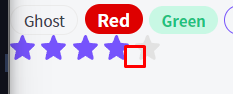

Экспортируем наш рейтинг из индекс-файла, чтобы до него можно было ближе достать из страниц некста

`index.ts`

```TS
export * from './Htag/Htag';
export * from './Button/Button';
export * from './P/P';
export * from './Tag/Tag';
// добавляем рейтинг
export * from './Rating/Rating';
```

И мы должны расположить компонент рейтинга на основной странице приложения

`index.tsx`

```TSX
export default function Home(): JSX.Element {
	// установим изначальное состояние для рейтинга
	const [rating, setRating] = useState<number>(4);

	return (
		<>
			<Htag tag='h1'>Заголовок</Htag>
			<Button appearance='primary' arrow='right'>Кнопка</Button>
			<Button appearance='ghost' arrow='down'>Кнопка</Button>
			<P size='l'>Большой</P>
			<P>Средний</P>
			<P size='s'>Маленький</P>
			<Tag size='s'>Ghost</Tag>
			<Tag size='m' color='red'>Red</Tag>
			<Tag size='s' color='green'>Green</Tag>
			<Tag color='primary'>Green</Tag>

			{/* вставляем рейтинг на основную страницу */}
			<Rating rating={rating} isEditable setRating={setRating} />
		</>
	);
}
```

Теперь мы имеем рейтинг, который изначально = 4, и который мы можем спокойно менять

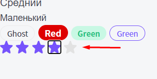
