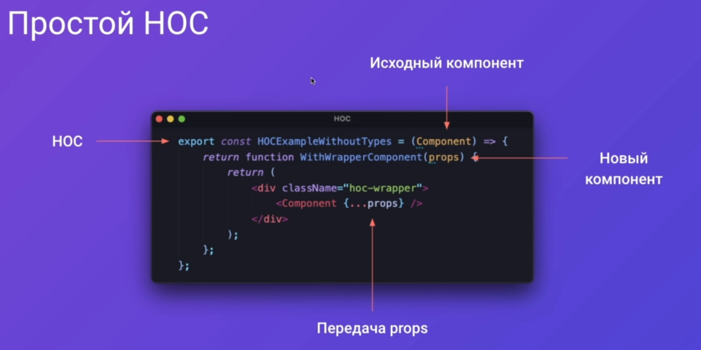
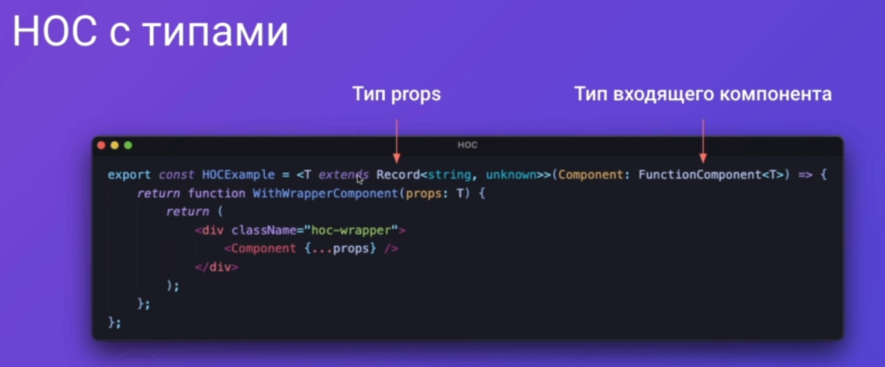
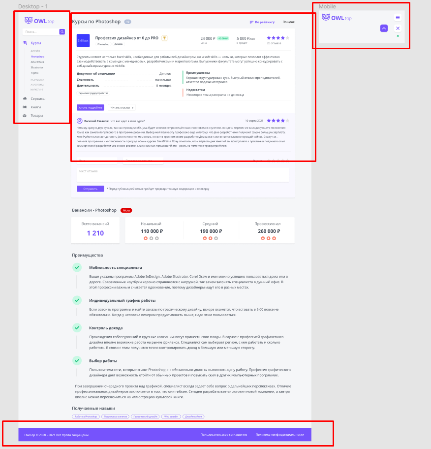
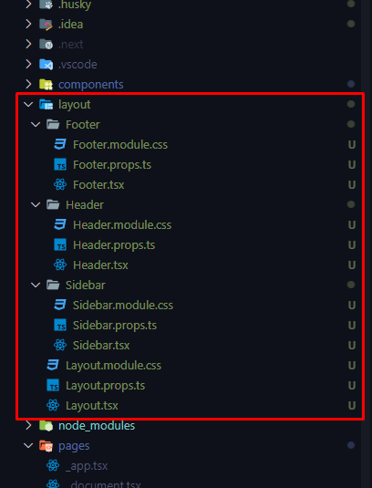
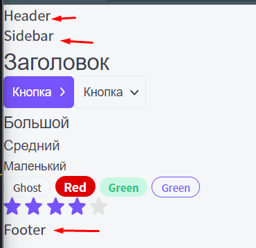

#HOC #React

## 001 Что такое HOC

==HOC== - ==High order component== - это компонент, который принимает в себя компонент и возвращает новый компонент


Простой `HOC` принимает в себя в качестве пропса другой компонент и возвращает из себя модифицированный компонент (по желанию с пропсами)



И примерно так выглядит `HOC` с использованием типов



> [!Warning] Важно!
>
> - Менять сам компонент нельзя
> - Всегда нужно передавать `props` внутрь оборачиваемого компонента
> - Необходимо для отладки задавать `displayName`
> - Нельзя использовать `HOC` внутри отрисовки

## 002 Layout

Определимся с тем, что у нас есть макете:

- Боковая панель (которая скрывается на мобильной версии сайта)
- основная контентная панель
- Футер
- Хедер (который показывается на мобилке)

Чтобы поддерживать одинаковый макет на всех страницах, мы можем создать отдальный компонент, который будет определять, как уже будет выглядеть наш макет. Конкретно: он отобразит, как элементы должны будут располагаться на странице.



Элементы лейаута можно расположить в отдельной папке, а не складировать вместе с компонентами



Так выглядят компоненты, которые будут располагаться на странице:

- Футер
- Хедер
- Сайдбар

Отдельно для них были сделаны стили, которые впоследствии уже определят расположение элементов на странице

```TSX
/// Footer props
import { DetailedHTMLProps, HTMLAttributes, ReactNode } from 'react';

export interface IFooterProps
	extends DetailedHTMLProps<HTMLAttributes<HTMLDivElement>, HTMLDivElement> {}

/// Footer .tsx
import React from 'react';
import styles from 'Header.module.css';
import cn from 'classnames';
import { IFooterProps } from './Footer.props';

export const Footer = ({ ...props }: IFooterProps) => {
	return <div {...props}>Footer</div>;
};


/// Header props
import { DetailedHTMLProps, HTMLAttributes, ReactNode } from 'react';
export interface IHeaderProps
	extends DetailedHTMLProps<HTMLAttributes<HTMLDivElement>, HTMLDivElement> {}

/// Header .tsx
import React from 'react';
import styles from 'Header.module.css';
import cn from 'classnames';
import { IHeaderProps } from './Header.props';

export const Header = ({ ...props }: IHeaderProps) => {
	return <div {...props}>Header</div>;
};


/// Sidebar props
import { DetailedHTMLProps, HTMLAttributes, ReactNode } from 'react';

export interface ISidebarProps
	extends DetailedHTMLProps<HTMLAttributes<HTMLDivElement>, HTMLDivElement> {}

/// Sidebar .tsx
import React from 'react';
import styles from 'Sidebar.module.css';
import cn from 'classnames';
import { ISidebarProps } from './Sidebar.props';

export const Sidebar = ({ ...props }: ISidebarProps) => {
	return <div {...props}>Sidebar</div>;
};
```

А уже так выглядит сам `Layout`:

Экстендить данные пропсы див-элементами мы не будем, чтобы сохранять относительную прозрачность данного компонента

`Layout.props.ts`

```TS
import { ReactNode } from 'react';

export interface ILayoutProps {
	children: ReactNode;
}
```

Конкретно тут в качестве параметра `children` будут приниматься все компоненты и вставляться в `div`

`Layout.tsx`

```TSX
import React from 'react';
import styles from 'Layout.module.css';
import cn from 'classnames';
import { ILayoutProps } from './Layout.props';
import { Header } from './Header/Header';
import { Footer } from './Footer/Footer';
import { Sidebar } from './Sidebar/Sidebar';

export const Layout = ({ children }: ILayoutProps) => {
	return (
		<>
			<Header />
			<div>
				<Sidebar />
				<div>{children}</div>
			</div>
			<Footer />
		</>
	);
};
```

И теперь мы можем обернуть наш основной код в `Layout` компонент, который принимает в себя все остальные компоненты системы

`index.tsx`

```TSX
export default function Home(): JSX.Element {
	const [rating, setRating] = useState<number>(4);

	return (
		<Layout>
			<Htag tag='h1'>Заголовок</Htag>
			<Button appearance='primary' arrow='right'>
				Кнопка
			</Button>
			<Button appearance='ghost' arrow='down'>
				Кнопка
			</Button>
			<P size='l'>Большой</P>
			<P>Средний</P>
			<P size='s'>Маленький</P>
			<Tag size='s'>Ghost</Tag>
			<Tag size='m' color='red'>
				Red
			</Tag>
			<Tag size='s' color='green'>
				Green
			</Tag>
			<Tag color='primary'>Green</Tag>
			<Rating rating={rating} isEditable setRating={setRating} />
		</Layout>
	);
}
```



## 003 Пишем HOC withLayout

Теперь уже будет писаться сам `HOC` компонент, который будет дополнять наш макет дополнительным функционалом.

Конкретно сейчас будем экспортировать компонент `withLayout`, который в себя принимает другой компонент `Component` и рендерит его внутри `Layout`

`Layout.tsx`

```TSX
import React, { FunctionComponent } from 'react';
import styles from 'Layout.module.css';
import cn from 'classnames';
import { ILayoutProps } from './Layout.props';
import { Header } from './Header/Header';
import { Footer } from './Footer/Footer';
import { Sidebar } from './Sidebar/Sidebar';

const Layout = ({ children }: ILayoutProps) => {
	return (
		<>
			<Header />
			<div>
				<Sidebar />
				<div>{children}</div>
			</div>
			<Footer />
		</>
	);
};

export const withLayout = <T extends Record<string, unknown>>(Component: FunctionComponent<T>) => {
	return function withLayoutComponent(props: T): JSX.Element {
		return (
			<Layout>
				<Component {...props} />
			</Layout>
		);
	};
};
```

==Как было:==

Мы оборачивали все внутренности компонента `Home` внутрь `Layout`

_Тут изначально мы экспортируем дефолтно нашу функцию, которая рендерится первой (ввиду того, что она индексная)._

`pages > index.tsx`

```TSX
import React, { useState } from 'react';
import { Button, Htag, P, Rating, Tag } from '../components';
import { Layout } from '../layout/Layout';

export default function Home(): JSX.Element {
	const [rating, setRating] = useState<number>(4);

	return (
		<Layout>
			<Htag tag='h1'>Заголовок</Htag>
			<Button appearance='primary' arrow='right'>
				Кнопка
			</Button>
			<Button appearance='ghost' arrow='down'>
				Кнопка
			</Button>
			<P size='l'>Большой</P>
			<P>Средний</P>
			<P size='s'>Маленький</P>
			<Tag size='s'>Ghost</Tag>
			<Tag size='m' color='red'>
				Red
			</Tag>
			<Tag size='s' color='green'>
				Green
			</Tag>
			<Tag color='primary'>Green</Tag>
			<Rating rating={rating} isEditable setRating={setRating} />
		</Layout>
	);
}
```

==Как стало:==
Сейчас мы рендерим дефолтно нашу функцию, которая была вложена в другой `HOC`-компонент.
Тут мы вкладываем сам компонент в `HOC`, а не его внутренности в другой такой же компонент (не в обычный функциональный, а в `HOC`)

```TSX
import React, { useState } from 'react';
import { Button, Htag, P, Rating, Tag } from '../components';
import { withLayout } from '../layout/Layout';

function Home(): JSX.Element {
	const [rating, setRating] = useState<number>(4);

	return (
		<>
			<Htag tag='h1'>Заголовок</Htag>
			<Button appearance='primary' arrow='right'>
				Кнопка
			</Button>
			<Button appearance='ghost' arrow='down'>
				Кнопка
			</Button>
			<P size='l'>Большой</P>
			<P>Средний</P>
			<P size='s'>Маленький</P>
			<Tag size='s'>Ghost</Tag>
			<Tag size='m' color='red'>
				Red
			</Tag>
			<Tag size='s' color='green'>
				Green
			</Tag>
			<Tag color='primary'>Green</Tag>
			<Rating rating={rating} isEditable setRating={setRating} />
		</>
	);
}

export default withLayout(Home);
```
