#SSR #NextJS

## 001 Переменные окружения

Переменные окружения хранят в себе значения, к которым мы можем получить доступ как из фронта, так и из бэка.
Данные переменные могут хранить разные значения, например, домен. Домен для тестов, бека и фронта может быть разный и поэтому мы можем хранить разные значения.


Внутри переменных окружения можно использовать другие переменные


Типы `.env` файлов

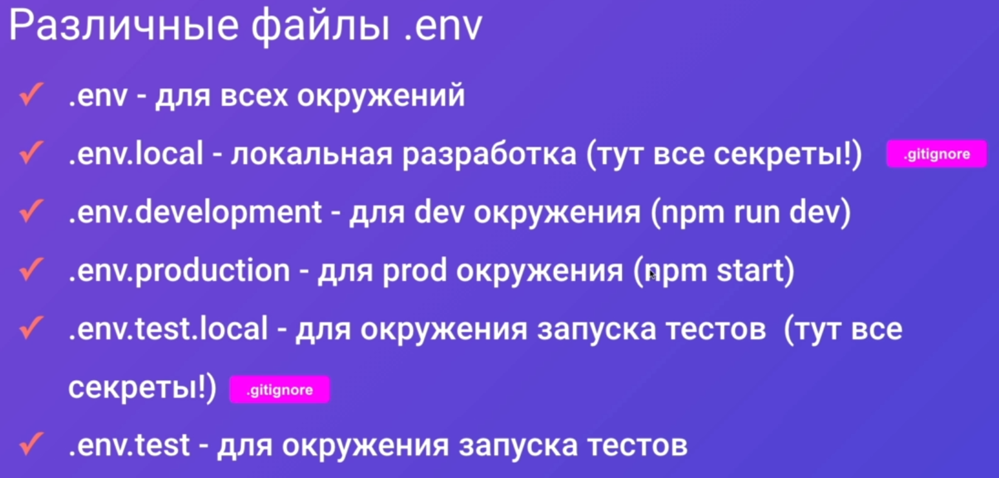

Доступны переменные на сервере и доступны на фронте с приставкой `NEXT_PUBLIC_`

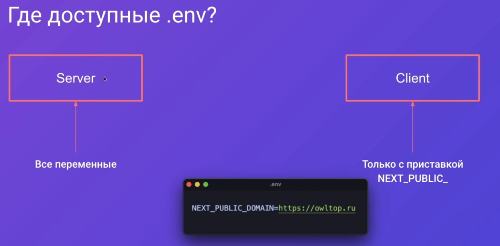

Так же в нексте существуют отдельные функции для работы с переменными окружения

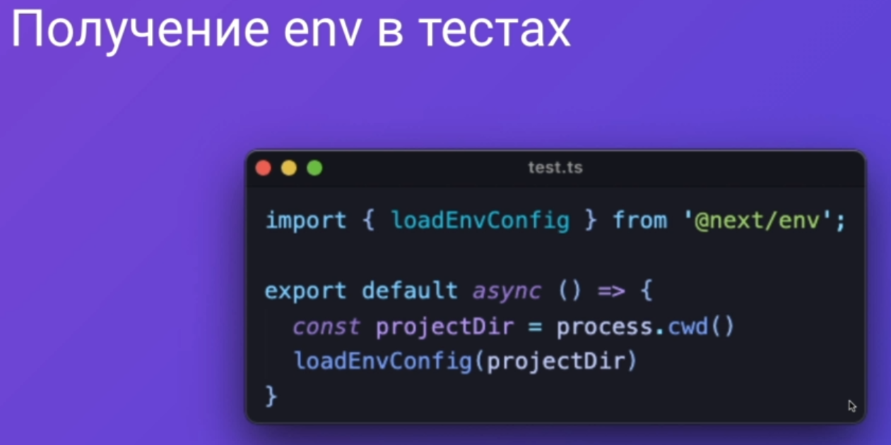

Создадим файл с локальными данными окружения и запишем в него домен, по которому будем получать нужные для нас данные с сервера

`.emv.local`

```env
NEXT_PUBLIC_DOMAIN=https://courses-top.ru
```

## 002 Как работает SSR

Стандартно процесс рендеринга страницы начинается с прогрузки `HTML` затем `CSS` и уже только после `JS`


В текущих реалиях использования SPA, у нас грузится сначала всегда наш JS код, который и формирует приложение


`Client-side Rendering` представляет из себя стандартную модель рендеринга страницы, которая отправляет клиенту весь код и собирает страницу на его ПК.
`Server-side Rendering` представляет из себя более прогрессивный способ генерации приложения, который позволяет рендерить страницу для каждого пользователя отдельно.
Плюсом является то, что `SSR` позволяет гораздо быстрее загрузить страницу, но так же он и нагружает сильно сервер, так как мы рендерим страницу для каждого пользователя на каждый его запрос

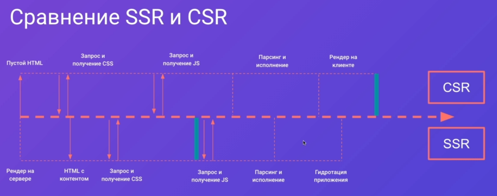

==Гидратация== - это процесс, во время которого `JS` проходится по `HTML` и добавляет в него все недостающие элементы (обработчики, методы, элементы), не меняя структуру страницы, которую уже имеет пользователь.
Зачастую гидратация происходит на базе `nodeJS` - конкретно на движке `V8`

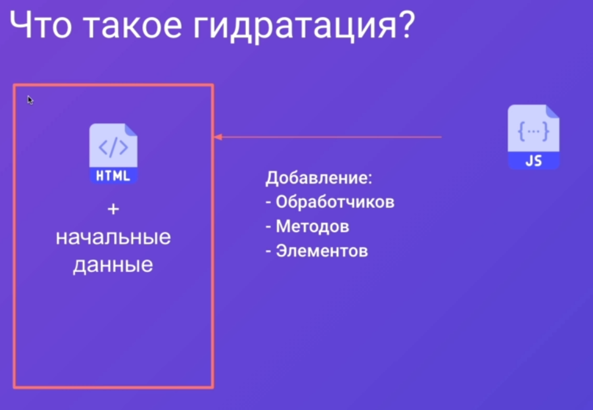

> [!warning] Минусы SSR:
>
> - Первым делом, что нужно отметить, так это то, чтобы сохранить мощности сервера, зачастую используется кеширование данных, которые сервер уже успел отрендерить и отдать клиенту
> - Приложение становится интерактивным только после гидратации
> - Рендеринг на сервере очень сложно реализуемая процедура, которую настроить самому будет затратно по времени. Вместо этого используются фреймворки по типу `NextJS` и `NuxtJS`
>
> 

> [!info] Преймущества, которые даёт SSR:
>
> - Огромный прирост к SEO
>     -   - к производительности
>     - Лучше ответ от сервера
>     - Отсутствие костылей в индексации SPA
> - Конечный пользователь видит первую отрисовку намного быстрее
> - Нагрузка от слабых устройств переходит на сильный сервер
>
> 

Если мы работаем с `CSR`, то наша структура для оптимизации SEO выглядит так:

- Запрос отправляется на NGINX
- NGINX определяет бот это или пользователь
- Если пользователь, то ему грузится SPA
- Если бот, то отправляется запрос в prerender
- prerender отправляет запрос на генерацию HTML в SPA и тот возвращает сгенерированный код

Главный минус такого подхода заключается в том, что на все запросы и пререндереры тратится достаточно большое количество времени (4-5 секунд) и поэтому обычно на него делается кеширование

В `SSR` неважно от кого придёт запрос он всегда отрендерит страницу и вернёт сгенерированное приложение с данной страницей

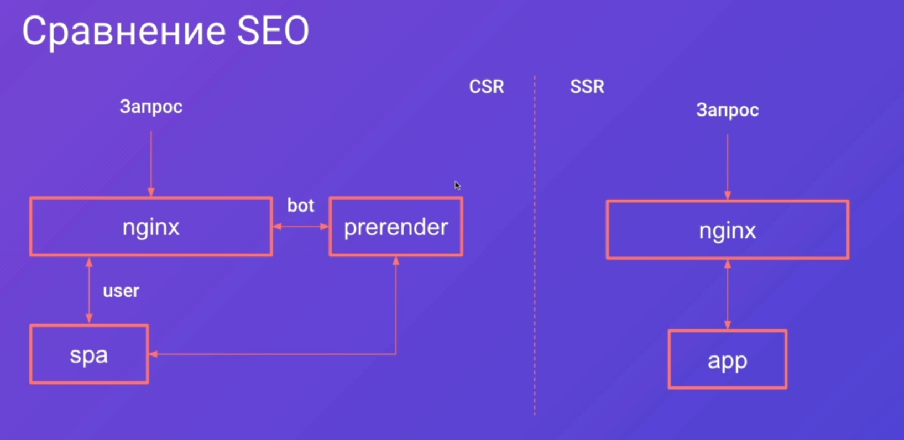

Что делает некст?

- Отправляется запрос от клиента
- Некст его обрабатывает
- Если у нас `SSR`, то он сгенерирует код и отправит его пользователю
- Если у нас `CSR`, то он достанет основные данные со всех роутов и закинет их в кеш браузера, чтобы страницы быстро подгружались (зачастую куда выгоднее, чем `SSR` ввиду отсутствия частых перезагрузок)

Так же если на сайте появились изменения, то некст осуществляет инвалидацию кеша - проверяет его, и если данные не совпадают с сервером, то он перезагружает невалидные данные

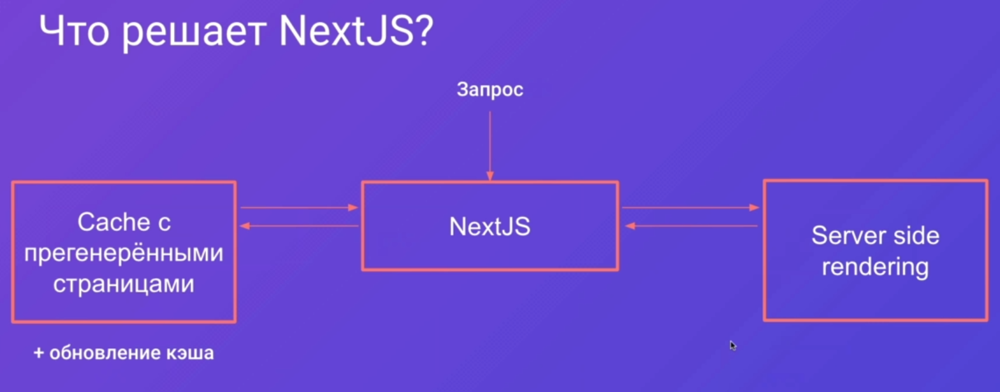

Приложение на `SSR` на десктопе имеет самую высокую производительность. Уже без `SSR` она падает сильно.
Уже на мобильных устройствах с ==3G== мы видим самую сильную просадку при загрузке ==SPA==. Телефоны - это самая уязвимая группа для таких приложений.

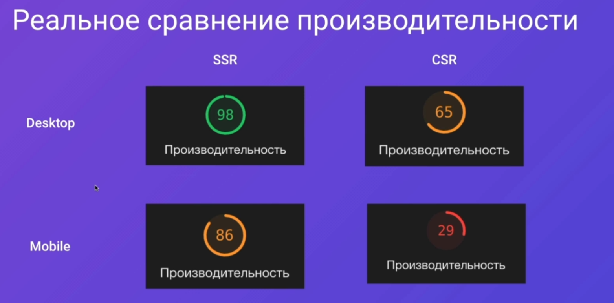

Реальные метрики, из чего складывается производительность:

- Самый важный показатель - ==Time to Interactive== показывает нам, сколько времени нужно ожидать, чтобы начать пользоваться страницей.
- ==Total Blocking Time== на `SSR` имеет меньшее время, так как клиент получает готовую страницу и у него происходит только гидратация, чтобы обогатить страницу
- Последний показатель ==Layout Shift== показывает нам, насколько сдвигаются блоки на странице при её загрузке. На `SSR`, показатель минимален, так как сразу получаем готовую страницу

Тут стоит сразу сказать, что если мы создаём какое-то клиентское приложение, то для него лучше использовать `SSR`. Если мы строим графики, дэшборды, показываем сложные анимации и всё остальное, то тут стоит использовать `CSR`.

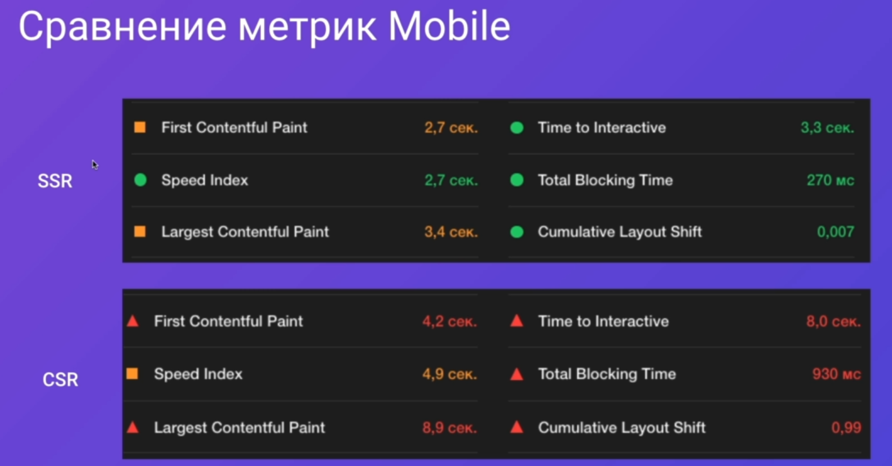

## 003 SSR в NextJS

В нексте есть две формы пререндера:

- Статическая генерация
- Рендеринг на сервере

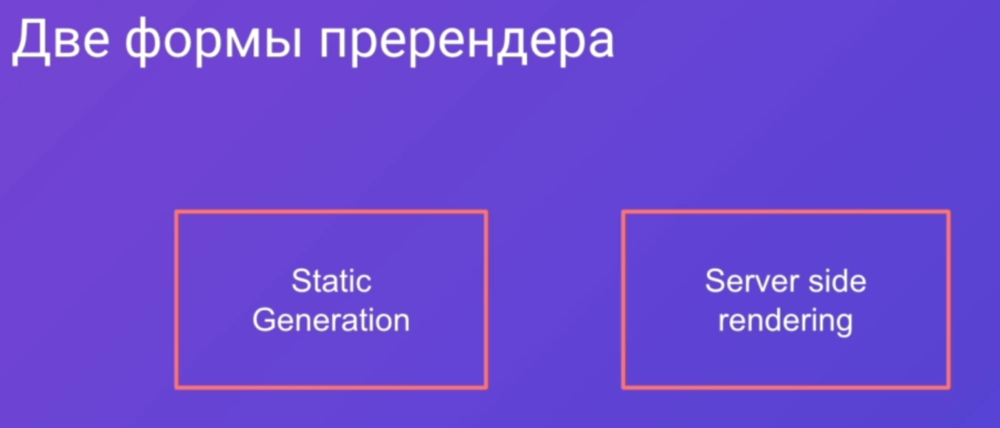

У нас имеются три метода, которые иcпользуются для получения данных SSR и CSR

- Они используются только на сервере
- Они могут применяться только на страницах (не на компонентах и нигде-либо ещё - это специфика ==NextJS==)

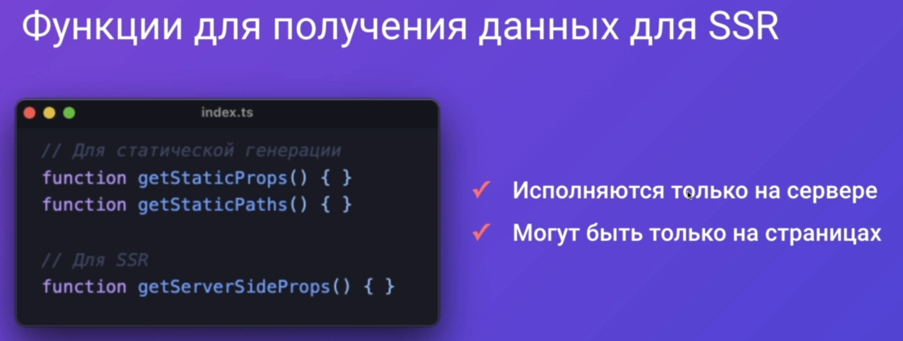

###### getStaticProps

Функцию `getStaticProps` мы используем, когда:

- Данные для страницы уже имеются на этапе сборки
- Данные не представляют из себя персональные и могут быть доступны любому пользователю
- Страница доступа для индексирования сайтами


Примерно так выглядит данная функция:

- Вверху располагается сама страница, которая у нас рендерится
- Далее мы экспортируем `getStaticProps`, которая возвращает полученные статические пропсы (которые можно определить по интерфейсу, который передаётся в дженерике)
- На вход эта функция принимает в себя ==контекст==
- Далее мы отправляем запрос на бэк
- Получаем результат
- Возвращаем результат, удовлетворяя интерфейсу

В результате мы получаем пропсы, которые в результате передаются на нашу страницу:
Страница `Page` получает пропс `res` из функции `getStaticProps`

Так же в самом низу указан тип пропсов - это мы делаем для того, чтобы всегда работала проверка на типы

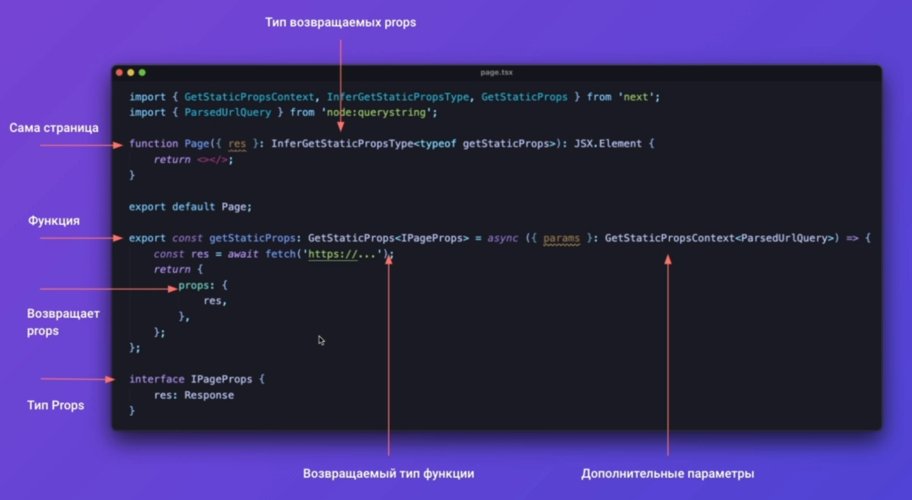

Данные, которые мы можем передать в контекст:

- `params` - это те параметры, которые могут быть переданы для генерации определённой страницы
- `preview` позволяет нам отобразить определённые изменения на странице, но без генерации этой страницы (`previewData` - это уже сами данные для превью режима)
- Локали уже позволяет адаптировать страницу под разные языки. Пример: `/ru` или `/en` у сайтов.

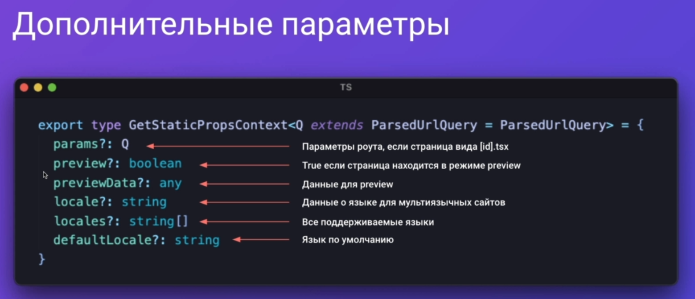

Так же мы можем возвращать разные данные в функции `getStaticProps`:

- `props` - возвращает сами данные для генерации страницы
- `revalidate` - определяет количество времени, после которого страница будет сгенерирована заново (генерируется заново она статически)
- `redirect` - позволяет перенаправлять пользователя на определённый `destination`. Так же можно перенаправлять по определённому условию `premanent` (всегда перенаправлять или нет)
- `notFound` - позволяет вывести страницу 404, если мы, например, не получили данные при запросе на нужную для нас апишку

==Ревалидация== - ==Инкрементальная статическая генерация== - после выкладки приложения, страницы с заданным временем ревалидации будут генерироваться заново (или первый раз, если ранее страницы не было), подтягивая новый контент.

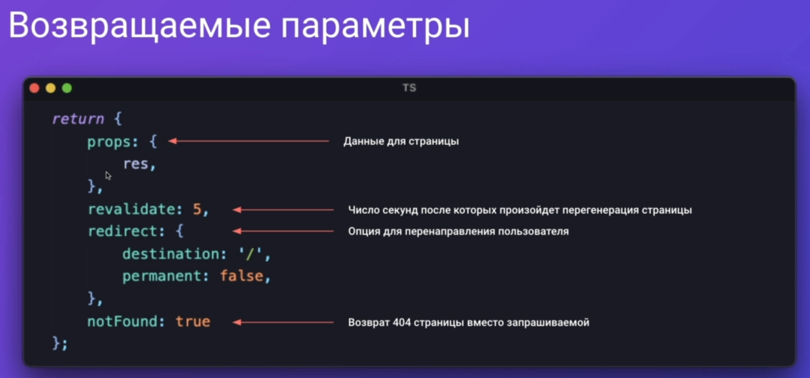

###### getStaticPaths

Данная функция позволяет получить пути страниц для генерации этих пропсов.
В результате действия этой функции мы должны получить все доступные id для рендера страниц с динамическими адресами _(пример: `[id].tsx`)_.


В результате своей работы эта функция должна вернуть все пути до страниц в параметре `paths`
_Например, мы посылаем запрос на проход в базу товаров и получаем все возможные значения страниц -> возвращаем массив всех возможных id товаров._
Это позволяет нексту на этапе билда определить по каким страницам ему нужно пройтись для предгенерации страницы и положить в статическую генерацию

Второй параметр `fallback` используется, когда мы добавили, например, новую позицию товара на страницу, и, если её вызвал пользователь, то некст будет перегенерировать страницу и докладывать новый товар в кеш.
То есть некст позволяет добавить статическую генерацию на страницу даже если её ещё не было на этапе билда.
Если добавить в качестве значения `blocking`, то он будет ожидать рендера не сервере и только потом вернёт страницу

Так же мы можем вернуть не просто роуты до наших страниц, но ещё и объекты, которые будут хранить сразу несколько параметров для наших объектов (у товара есть _id_ и _категория_)

Эта особенность работы `revalidate` и `fallback` позволяет нам создавать сайт с неограниченным количеством страниц, которых даже нет на этапе сборки

Так же хорошей практикой будет ограничить начальное количество значений `paths`, чтобы билд сайта не занимал по 20-30 минут

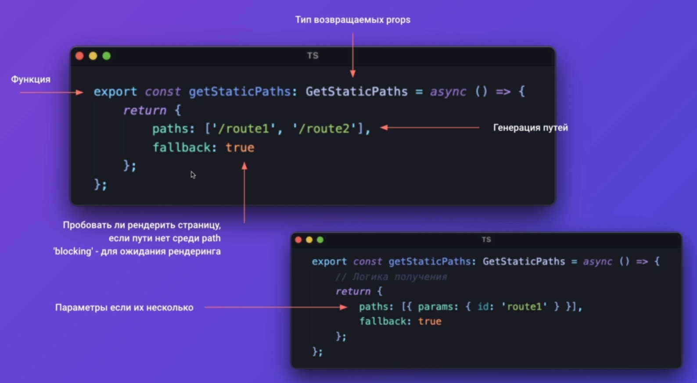

###### getServerSideProps

Данная функция выполняет пререндер каждого запроса на сервере
Используется в тех случаях, когда нужно зарендерить на сервере страницу, которая зависит от входных каких-то персональных данных.

_Например, у пользователя есть JWT токен и под него нужно сделать персональную подборку товара_


Функция в себя принимает контекст, который мы можем расширить на наше усмотрение. Дальше мы передаём те же самые параметры, что в клиент-пропсах.
Использовать данную функцию - это достаточно дорогостоящая операция, поэтому стоит от этого отказаться, если на то есть возможность и производить эту персонализацию на клиенте.

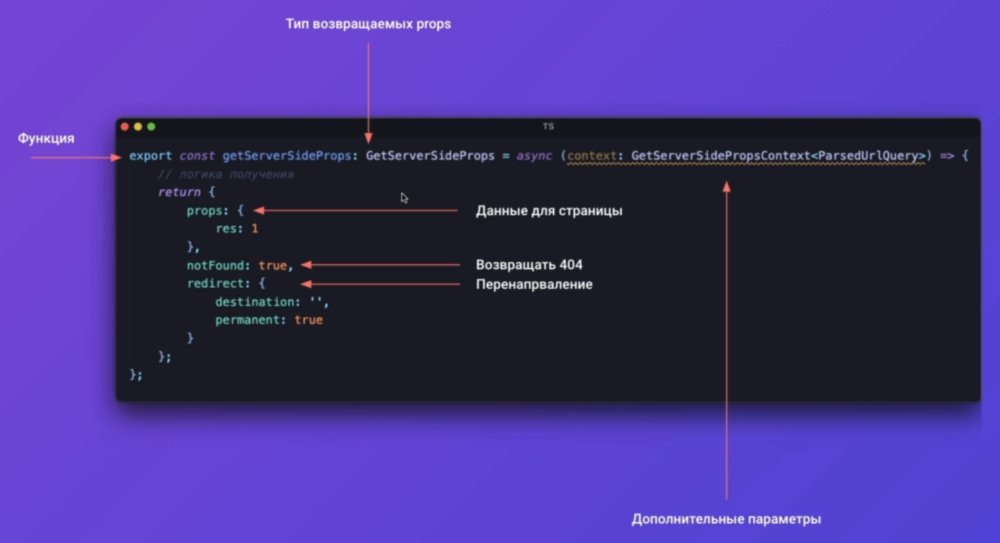

Контекст запроса немного расширен, чтобы была возможность работы с персональными данными. Благодаря возможности доступа к полному объекту запроса, можно сделать более полную генерацию страницы.

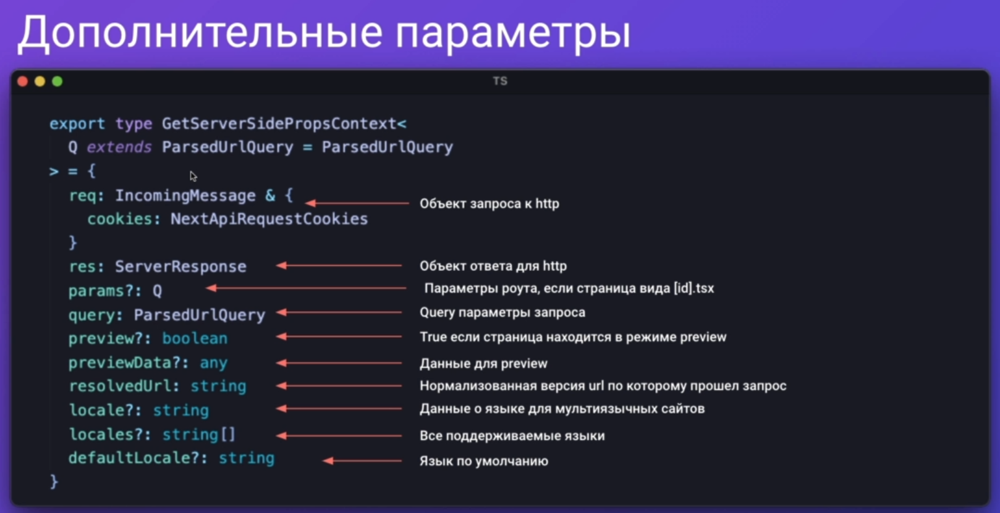

## 004 Использование getStaticProps

Нужно написать `getStaticProps`, который бы получал элементы меню и дал нам их вывести

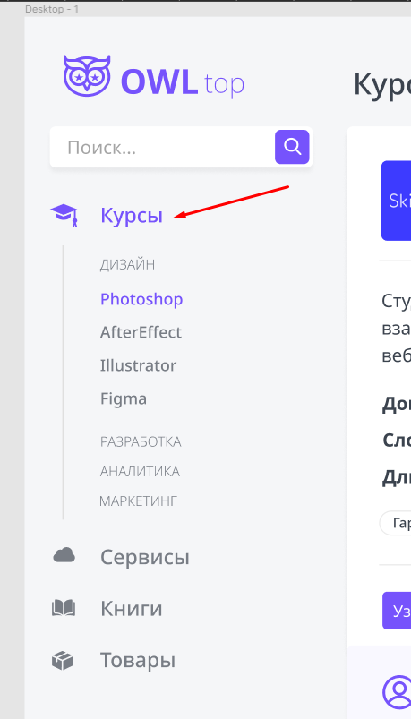

Элементы меню располагаются на сервере и по запросу возвращаются нам

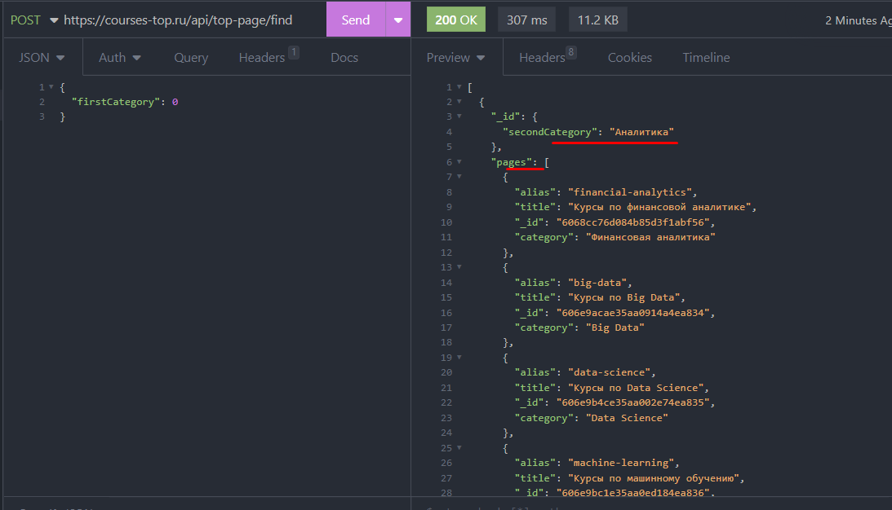

Первым делом, нужно установить модуль, который будет осуществлять запросы на сервер

```bash
npm i axios
```

_Примечание_: можно написать интерфейсы для описания меню так:

`src / interfaces / menu.interface.ts`

```TS
export interface Id {
	secondCategory: string;
}

export interface Page {
	alias: string;
	title: string;
	_id: string;
	category: string;
}

export interface RootObject {
	_id: Id;
	pages: Page[];
}
```

А можно убрать дополнительный уровень вложенности и не возиться с ним

`src / interfaces / menu.interface.ts`

```TS
export interface Page {
	alias: string;
	title: string;
	_id: string;
	category: string;
}

export interface RootObject {
	_id: {
		secondCategory: string;
	};
	pages: Page[];
}
```

На нашей главной странице создаём функцию `getStaticProps`, которая будет получать с сервера по определённому запросу тела нужные нам значения.
Так же определим интерфейс `HomeProps`, который будет представлять пропсы главной страницы а также будет использоваться для дженерика функции `getStaticProps`.
Далее на главной странице через функцию `map()` нужно вывести наши элементы меню

`index.tsx`

```TSX
import { GetStaticProps } from 'next';
import React, { useState } from 'react';
import { Button, Htag, P, Rating, Tag } from '../components';
import { withLayout } from '../layout/Layout';
import axios from 'axios';
import { MenuItem } from '../interfaces/menu.interface';

// 3
// сюда передаём пропсы, которые получили из гетСтатикПропсов
function Home({ menu }: HomeProps): JSX.Element {
	const [rating, setRating] = useState<number>(4);

	return (
		<>
			<Htag tag='h1'>Заголовок</Htag>
			<Button appearance='primary' arrow='right'>Кнопка</Button>
			<Button appearance='ghost' arrow='down'>Кнопка</Button>
			<P size='l'>Большой</P>
			<P>Средний</P>
			<P size='s'>Маленький</P>
			<Tag size='s'>Ghost</Tag>
			<Tag size='m' color='red'>Red</Tag>
			<Tag size='s' color='green'>Green</Tag>
			<Tag color='primary'>Green</Tag>
			<Rating rating={rating} isEditable setRating={setRating} />

			{/* Тут уже будет производиться вывод элементов меню, полученных с сервера через гетСтатикПропс */}
			<ul>
				{menu.map(m => (<li key={m._id.secondCategory}>{m._id.secondCategory}</li>))}
			</ul>
		</>
	);
}

export default withLayout(Home);

// 1
// функция getStaticProps имеет тип GetStaticProps
// GetStaticProps<тип> принимает в себя тип пропсов, которые принимает компонент Home
export const getStaticProps: GetStaticProps<HomeProps> = async () => {

	// запомним индекс первой категории`
	const firstCategory = 0;

	// тут сразу переименуем полученную data в menu
	const { data: menu } = await axios.post<MenuItem[]>(process.env.NEXT_PUBLIC_DOMAIN + '/api/top-page/find', {
		firstCategory
	});

	// вернём меню
	return {
		props: {
			menu,
			firstCategory
		}
	};
};

// 2
// чтобы не было ошибки, нужно добавить екстенд от рекорда
interface HomeProps extends Record<string, unknown> {
	menu: MenuItem[];
	firstCategory: number;
}
```

По итогу мы получаем страницу, на которую мы выводим наши пункты меню


Тут уже находятся исходные данные, которые после отработки JS позволяют провести гидратацию


## 005 Использование getStaticPaths

Далее нужно реализовать страницу, которая будет получать данные для этой страницы


Далее определимся с теми запросами, которые мы можем подать на сервер, чтобы получить нужные нам данные

- findPage - выводит доступные страницы (алиасы)
- getPageByAlias - мы можем отправить запрос на получение определённой страницы по её названию (алиасу)
- findProduct - позволяет найти продукт по алиасу и определить максимальное количество значений


Чтобы мы могли получить нужный нам курс по ссылке `site.com/courses/Photoshop`, то нам нужно создавать эту страницу в одноимённой папке.
Если мы пишем название страницы в скобках `[]`, то это скажет нексту, что название будет генерироваться автоматически


Чтобы быстро перевести ответ от сервера в интерфейсы TS, можно поискать сайты _"JSON to TS"_


Примерно таким способом:


Интерфейс для описания данных, которые принимает в себя страница, которая генерируется под определённый алиас

`src / interfaces / page.interface.ts`

```TS
// перечисления для значения firstCategory (по которой выводятся категории)
export enum TopLevelCategory {
	Courses,
	Services,
	Books,
	Products
}

export interface TopPageAdvantage {
	_id: string;
	title: string;
	description: string;
}

// Данные с хедхантера
export interface HhData {
	_id: string;
	count: number;
	juniorSalary: number;
	middleSalary: number;
	seniorSalary: number;
	updatedAt: Date;
}

// Модель страницы
export interface TopPageModel {
	tags: string[];
	_id: string;
	secondCategory: string;
	alias: string;
	title: string;
	category: string;
	seoText: string;
	tagsTitle: string;
	metaTitle: string;
	metaDescription: string;
	firstCategory: TopLevelCategory;
	advantages: TopPageAdvantage[];
	createdAt: Date;
	updatedAt: Date;
	hh: HhData;
}
```

Далее представлен интерфейс продукта

`src / interfaces / product.interface.ts`

```TS
// характеристика продукта
export interface ProductCharacteristic {
	value: string;
	name: string;
}

// Модель обзора продукта (отзыв на курс)
export interface ReviewModel {
	_id: string;
	name: string;
	title: string;
	description: string;
	rating: number;
	createdAt: Date;
}

// Модель продукта
export interface ProductModel {
	_id: string;
	categories: string[];
	tags: string[];
	title: string;
	link: string;
	price: number;
	credit: number;
	oldPrice: number;
	description: string;
	characteristics: ProductCharacteristic[];
	createdAt: Date;
	updatedAt: Date;
	__v: number;
	image: string;
	initialRating: number;
	reviews: ReviewModel[];
	reviewCount: number;
	reviewAvg?: number;
	advantages?: string;
	disAdvantages?: string;
}
```

И тут уже представлен код, который позволит нам переходить по ссылкам продуктов и получать разные результаты.

Функция `getStaticProps` возвращает нам данные по страницам, на которые мы заходим и по продуктам, которые мы ищем.

Функция `getStaticPaths` сгенерирует статичные пути для всех курсов, которые может вернуть нам сервер

`pages / courses / [alias].tsx`

```TSX
import { GetStaticPaths, GetStaticProps, GetStaticPropsContext } from 'next';
import React, { useState } from 'react';
import { withLayout } from '../../layout/Layout';
import axios from 'axios';
import { MenuItem } from '../../interfaces/menu.interface';
import { TopPageModel } from '../../interfaces/page.interface';
import { ParsedUrlQuery } from 'node:querystring';
import { ProductModel } from '../../interfaces/product.interface';

const firstCategory = 0;

function Course({ menu, page, products }: CourseProps): JSX.Element {
	return <>{products && products.length}</>;
}

export default withLayout(Course);

// Чтобы некст понял, какие пути ему нужно резолвить, мы должны добавить статичные пути
export const getStaticPaths: GetStaticPaths = async () => {
	// получаем меню с сервера
	const { data: menu } = await axios.post<MenuItem[]>(
		process.env.NEXT_PUBLIC_DOMAIN + '/api/top-page/find',
		{
			firstCategory,
		},
	);

	// возвращаем пути
	return {
		// функция flatMap создаст плоский массив [] с ссылками: [/courses/[alias], /courses/[alias]...]
		paths: menu.flatMap((m) => m.pages.map((p) => '/courses/' + p.alias)),
		fallback: true,
	};
};

export const getStaticProps: GetStaticProps<CourseProps> = async ({
	params,
}: GetStaticPropsContext<ParsedUrlQuery>) => {
	// если параметры не были получены, то страница не выведится
	if (!params) return { notFound: true };

	// получаем меню с сервера
	const { data: menu } = await axios.post<MenuItem[]>(
		process.env.NEXT_PUBLIC_DOMAIN + '/api/top-page/find',
		{
			firstCategory,
		},
	);

	// получаем данные для меню с сервера
	const { data: page } = await axios.get<TopPageModel>(
		// сюда мы передаём алиас страницы, чтобы мы смогли её найти
		process.env.NEXT_PUBLIC_DOMAIN + '/api/top-page/byAlias/' + params.alias,
	);

	// получаем данные продуктов (курсов)
	const { data: products } = await axios.post<ProductModel[]>(
		process.env.NEXT_PUBLIC_DOMAIN + '/api/product/find',
		{
			category: page.category,
			limit: 10,
		},
	);

	return {
		props: {
			menu,
			firstCategory,
			page,
			products,
		},
	};
};

interface CourseProps extends Record<string, unknown> {
	menu: MenuItem[];
	firstCategory: number;
	page: TopPageModel;
	products: ProductModel[];
}
```

И по переходу по нужному нам курсу, мы получим количество его продуктов


Чтобы можно было сгенерировать сайт заранее и выдавать именно кеш, то можно вписать данные строчки:

```bash
npm run build

npm run start
```
