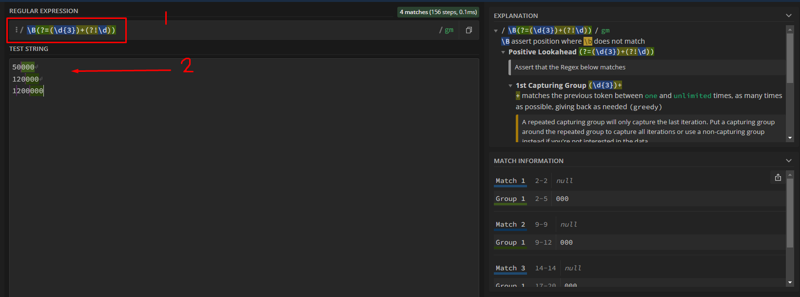

## 001 Компоненты страниц

Сейчас нам нужно немного переверстать страницу в целях оптимизации переписываемого кода:
- Сейчас наша страница сделана только под курсы, а не под все виды материалов (книги, сервисы и товары)
- Если мы оставим так как есть, то мы должны будем стили для страницы добавить в папку `styles`

Создадим структуру, где мы разместим компонент основной страницы.


Компонент страницы будет принимать в себя первую категорию меню, пропс страницы и продукты

`page-components / TopPageComponent / TopPageComponent.props.ts`
```TS
import { TopLevelCategory, TopPageModel } from '../../interfaces/page.interface';
import { ProductModel } from '../../interfaces/product.interface';

export interface TopPageComponentProps {
	firstCategory: TopLevelCategory;
	page: TopPageModel;
	products: ProductModel[];
}
```

Перенесём вывод длинны с алиаса в компонент страницы. Тут пропмы будут принимать от алиаса пропс страницы, продукта и выбранной категории меню

`page-components / TopPageComponent / TopPage.component.tsx`
```TSX
import styles from './TopPageComponent.module.css';
import { TopPageComponentProps } from './TopPageComponent.props';

export const TopPageComponent = ({
	page,
	products,
	firstCategory,
}: TopPageComponentProps): JSX.Element => {
	return <>{products && products.length}</>;
};
```

Далее, для сокращения пути, экспортируем компонент из папки с компонентами страниц

`page-components / index.ts`
```TS
export * from './TopPageComponent/TopPage.component';
```

Данные изменения нужно будет внести в алиас, где будем возвращать сразу компонент страницы, который в себя будет принимать нужные нам значения

`pages / [type] / [alias].tsx`
```TSX
/// CODE ...

function TopPage({ page, products, firstCategory }: TopPageProps): JSX.Element {
	return <TopPageComponent 
				page={page} 
				firstCategory={firstCategory} 
				products={products} 
			/>;
}

/// CODE ...

interface TopPageProps extends Record<string, unknown> {
	menu: MenuItem[];
	firstCategory: TopLevelCategory; // меняем тип на тот, что в интерфейсе
	page: TopPageModel;
	products: ProductModel[];
}

/// CODE ...
```

Можно увидеть, что отображение страницы никак не изменилось


## 002 Вёрстка страницы продуктов

###### Вёрстка страницы располагается тут: [Вёрстка страницы продуктов](_code/Вёрстка%20страницы%20продуктов.md)

В процессе была замечена такая ошабка, что `display: none` покрывался свойством `display: grid`. 


Чтобы исправить ошибку, нужно воспользоваться директивой CSS `!important`, которая делает выбранный нами стиль - главным

`Layout.module.css`
```CSS
@media (max-width: 765px) {
	.wrapper {
		grid-template-columns: minmax(320px, 1fr);
		grid-template-areas:
			"header"
			"body"
			"footer";
	}

	.sidebar {
		display: none !important;
	}

	.header {
		display: block;
	}
}
```

И теперь сайдбар скрыт.


## 003 Regex отображения цены

Чтобы нормально написать регулярное выражение, можно воспользоваться сторонними ресурсами, которые помогают заранее определиться с делением строк и чисел - [RegEx](https://regex101.com/)

1) Мы должны выбрать строки `\B`
2) Мы должны найти те строки, которые удовлетворяют условию `(?=)` 
3) Где идут цифры `\d` в количестве трёх штук `{3}`
4) Таких групп может быть несколько `+`
5) После этих групп больше не идёт никаких цифр `(?!\d)`

*Примечание:* 
1. Сам RegExp
2. Наш набор шаблонных данных



В данном примере мы используем функцию `replace()`, которая изменяет выбранную нами строку, принимая в себя следующие параметры:
- `/\B(?=(\d{3})+(?!\d))/g` - само регулярное выражение. `/RegExp/g` - глобальный поиск определённого шаблона
- `' '` - строка, на которую мы меняем найденные значения

Функция `concat()` объединяет строки, и в данном случае она просто добавит в конец зарплат знак рубля

`helpers / helpers.tsx`
```TSX
export const priceRu = (price: number): string =>
	price
		.toString()
		.replace(/\B(?=(\d{3})+(?!\d))/g, ' ')
		.concat(' Р');
```

Остаётся только добавить функцию `priceRu(зарплата)` в компонент `HhData` 

`components / HhData / HhData.tsx`
```TSX
<div>
	<div className={styles.title}>Профессионал</div>
	<div className={styles.salaryValue}>{priceRu(seniorSalary)}</div>
	<div className={styles.rate}>
		<RateIcon className={styles.filled} />
		<RateIcon className={styles.filled} />
		<RateIcon className={styles.filled} />
	</div>
</div>
```

Так выглядит итоговая страница после изменения значений зарплат


## 006 Вставка HTML

Задача: нужно перевести html-код, получаемый с сервера, в обычную вёрстку


Есть два варианта:
1) Более качественный. Использовать модуль `html-react-parser`, который безопасно переведёт полученную вёрстку в реакт элементы
2) Менее безопасный. Запихнуть весь полученный код в `<div>`. Если у нас используется небезопасный доступ (`http`) или мы получаем вёрстку от пользователя, то им не стоит пользоваться.

Воспользуемся небезопасным способом. В этом случае, нам нужно воспользоваться атрибутом `dangerouslySetInnerHTML`, который позволит в качестве объекта вставить определённую верстку сразу на страницу.

`TopPageComponent.tsx`
```TSX
{/* тут уже будем выводить сео-текст */}
{page.seoText && (
	<div
		className={styles.seo}
		dangerouslySetInnerHTML={{ __html: page.seoText }}
	/>
)}
```

Его стили: можем стилизовать все пришедшие блоки через обращение к классу `.seo`

```CSS
.seo h1 {
	font-weight: 500;
	font-size: 26px;
	line-height: 35px;

	margin: 0;
}

.seo h2 {
	font-weight: 500;
	font-size: 22px;
	line-height: 30px;

	margin-top: 50px;
	margin-bottom: 25px;
}

.seo h3 {
	font-weight: 600;
	font-size: 20px;
	line-height: 27px;

	margin: 0;
}
```

## 007 useReducer

`useReducer` используется, когда у нас детерминированное число переходов между состояниями. Его можно использовать вместо `useState`, когда мы чётко понимаем, какие состояния будет иметь определённый компонент. 

Последовательность описания:
1) Описываем действия, которые будут выполняться и их payload 
2) Типизируем состояние reducer
3) Описываем сам reducer


Использование в компоненте:
1) Передаём в `useReducer` первым параметром функцию, которая должна выполнять определённую операцию и вторым параметром самое значение, которое нужно изменить.
2) Далее данная функция возвращает `touple`, из состояния reducer'а и дополнительной функции, которая принимает аргументы на изменение состояния.
3) Для изменения состояния используем функцию `dispatch`


## 008 Компонент сортировки

Наш компонент в качестве пропсов будет в себя принимать сам тип сортировки (который определён в `SoortEnum`) и функцию, которая будет устанавливать сортировку 

`components / Sort / Sort.props.ts`
```TS
import { DetailedHTMLProps, HTMLAttributes, ReactNode } from 'react';

export interface SortProps
	extends DetailedHTMLProps<HTMLAttributes<HTMLDivElement>, HTMLDivElement> {
	sort: SortEnum;
	setSort: (s: SortEnum) => void;
}

export enum SortEnum {
	Rating,
	Price,
}
```

Дальше мы можем столкнуться с такой проблемой, что наш текст может переходить с одной строчки на другую при переклике. Мы можем исправить это двумя способами: 
1) `&nbsp;` - это значение неразрывного пробела, которое связывает два слова так, чтобы они не переносились внутри вёрстки (пример на скринах) (`По&nbsp;цене`) - плохая практика
2) Подстраивать сетку под классы активности (ниже сделано так)

 

В центральном диве находится два спана, которые отдельно хранят в себе текст и иконку. Иконка изначально скрыта стилями и будет появляться, если спан будет иметь класс `active`

`components / Sort / Sort.tsx`
```TSX
export const Sort = ({ sort, setSort, children, className, ...props }: SortProps): JSX.Element => {
	return (
		<div className={cn(styles.sort, className)} {...props}>
			<span
				onClick={() => setSort(SortEnum.Rating)}
				className={cn({ [styles.active]: sort === SortEnum.Rating })}
			>
				<SortIcon className={styles.sortIcon} /> По рейтингу
			</span>
			<span
				onClick={() => setSort(SortEnum.Price)}
				className={cn({ [styles.active]: sort === SortEnum.Price })}
			>
				<SortIcon className={styles.sortIcon} /> По цене
			</span>
		</div>
	);
};
```

Тут прописываем появление иконки, когда висят классы `.active` и `.sortIcon`, а по дефолту скрываем и выравниваем текст относительно друг друга.
Комментариями указан выход из той проблемы, что текст скачет.

`components / Sort / Sort.module.css`
```CSS
.sortIcon {
	display: none;
}

.active {
	font-weight: bold;
	color: var(--primary);
}

.active .sortIcon {
	display: block;
	margin-right: 8px;
}

.sort {
	display: grid;
	/* делаем автоматическое расползание, чтобы текст занимал полностью представленное под него пространство автоматически */
	grid-template-columns: auto auto;
	gap: 40px;
}

.sort span {
	display: grid;
	grid-template-columns: 20px 1fr;
	align-items: center;
	gap: 8px;

	cursor: pointer;
}

/* если спан неактивен, то перестроим сетку под одну колонку для него */
.sort span:not(.active) {
	grid-template-columns: 1fr;
}
```

Сокращаем путь до компонента

`components / index.ts`
```TS
export * from './Sort/Sort';
```

Вставляем компонент сортировки в компонент страницы

`page-components / TopPageComponent / TopPageComponent.tsx`
```TSX
export const TopPageComponent = ({
	page,
	products,
	firstCategory,
}: TopPageComponentProps): JSX.Element => {
	return (
		<div className={styles.wrapper}>
			<div className={styles.title}>
				<Htag tag={'h1'}>{page.title}</Htag>
				{products && (
					<Tag color='grey' size='m'>
						{products.length}
					</Tag>
				)}


				{/* И здесь будет находиться компонент сортировки */}
				<Sort sort={SortEnum.Rating} setSort={() => {}} />
			</div>

			/// CODE ...

		</div>
	);
};
```

Так выглядит результат:

 

## 009 Reducer сортировки

Создадим в папке компонента страницы отдельный файл, в котором будет находиться редьюсер сортировки со всеми нужными методами

`page-components / TopPageComponent / sort.reducer.ts`
```TS
import { SortEnum } from '../../components/Sort/Sort.props';
import { ProductModel } from '../../interfaces/product.interface';

// опишем типы для экшенов
export type SortActions = { type: SortEnum.Rating } | { type: SortEnum.Price };

// опишем сам стейт
export interface SortReducerState {
	sort: SortEnum;
	products: ProductModel[];
}

// сама функция редьюсера
export const sortReducer = (state: SortReducerState, action: SortActions): SortReducerState => {
	switch (action.type) {
		// если передана сортировка по рейтингу
		case SortEnum.Rating:
			return {
				sort: SortEnum.Rating,
				// тут мы производим сортировку продуктов по рейтингу через функцию sort()
				// если рейтинг продукта а больше продукта б, то возвращаем -1, если нет, то возвращаем 1
				products: state.products.sort((a, b) =>
					a.initialRating > b.initialRating ? -1 : 1,
				),
			};
			break;
		// если передана сортировка по цене
		case SortEnum.Price:
			return {
				sort: SortEnum.Price,
				products: state.products.sort((a, b) => (a.price > b.price ? 1 : -1)),
			};
			break;
		default:
			throw new Error('Передан неверный тип сортировки');
	}
};
```

Далее вносим изменения в основной компонент страницы для добавления функционала сортировки 

`page-components / TopPageComponent / TopPageComponent.tsx`
```TSX
import styles from './TopPageComponent.module.css';
import { TopPageComponentProps } from './TopPageComponent.props';
import { Advantages, HhData, Htag, Sort, Tag } from '../../components';
import { TopLevelCategory } from '../../interfaces/page.interface';
import { SortEnum } from '../../components/Sort/Sort.props';
import { useReducer } from 'react';
import { sortReducer } from './sort.reducer';

export const TopPageComponent = ({
	page,
	products,
	firstCategory,
}: TopPageComponentProps): JSX.Element => {
	// первым аргументом получаем состояние - из него нам нужны только продукты, которые переименуем в отсортированные продукты
	// второй аргумент будет изменять наше состояние
	// useReducer получит нашу функцию сортировки и аргументы для это функции
	const [{ products: sortedProducts, sort }, dispatchSort] = useReducer(sortReducer, {
		products,
		sort: SortEnum.Rating,
	});

	// эта функция будет вызывать функцию сортировки из useReducer
	const setSort = (sort: SortEnum) => {
		dispatchSort({ type: sort });
	};

	return (
		<div className={styles.wrapper}>
			<div className={styles.title}>
				<Htag tag={'h1'}>{page.title}</Htag>
				{products && (
					<Tag color='grey' size='m'>
						{products.length}
					</Tag>
				)}

				{/* сюда мы передаем sort, который получили из useReducer */}
				<Sort sort={sort} setSort={(sort: SortEnum) => setSort(sort)} />
			</div>

			{/* тут мы будем выводить уже отсортированные продукты */}
			<div>{sortedProducts && sortedProducts.map(p => <div key={p._id}>{p.title}</div>)}</div>

			<div className={styles.hhTitle}>
				<Htag tag={'h2'}>Вакансии - {page.category}</Htag>
				<Tag color={'red'} size={'m'}>
					hh.ru
				</Tag>
			</div>

			{firstCategory == TopLevelCategory.Courses && page.hh && <HhData {...page.hh} />}
			{page.advantages && page.advantages.length > 0 && (
				<>
					<Htag tag={'h2'}>Преимущества</Htag>
					<Advantages advantages={page.advantages} />
				</>
			)}
			{page.seoText && (
				<div className={styles.seo} dangerouslySetInnerHTML={{ __html: page.seoText }} />
			)}
			<Htag tag={'h2'}>Получаемые навыки</Htag>
			{page.tags.map(t => (
				<Tag key={t} color={'primary'}>
					{t}
				</Tag>
			))}
		</div>
	);
};
```

И далее мы можем увидеть, что сортировка происходит нормально


