#NextJSImage

## 001 Компонент Input

Компонент будет получать пропсы типа `HTMLInputElement`

`components / Input / Input.props.ts`

```TS
import { DetailedHTMLProps, InputHTMLAttributes } from 'react';

export interface InputProps
   extends DetailedHTMLProps<InputHTMLAttributes<HTMLInputElement>, HTMLInputElement> {}
```

Тут мы просто передаём пропсы и добавляем свои и передаваемые классы со стилями

`components / Input / Input.tsx`

```TSX
export const Input = ({ className, ...props }: InputProps): JSX.Element => {
	return <input className={cn(className, styles.input)} {...props} />;
};
```

Стилизуем элемент. Обязательно указываем свойство `outline`, которое позволяет ориентироваться табами по странице (можем даже для этого пойти не по макету)

`components / Input / Input.module.css`

```CSS
.input {
	padding: 7px 15px; /* отступ от внутреннего контента */

	color: var(--black);
	border: none;
	outline-color: var(--black); /* аутлайн обязательно нужен, так как он позволяет навигироваться по инпутам */
	background: var(--white);

	box-shadow: 0px 4px 4px rgba(0, 0, 0, 0.05);
	border-radius: 5px;

	font-family: var(--font-family); /* в инпуте нужно насильно указать наш шрифт */
	font-size: 16px;
	line-height: 22px;
}

.input::placeholder {
	color: var(--gray);
}
```

Сокращаем путь до компонента

`components / index.ts`

```TS
export * from './Input/Input';
```

Так мы его добавляем на страницу

`pages / index.tsx`

```TSX
<Input placeholder={'Тест'} />
```

И так выглядит итоговый инпут

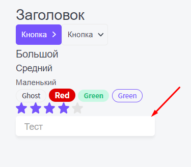

## 002 Упражнение - Компонент Textarea

Тут мы создаём компонент `textarea`, который принимает в себя все пропсы и стили (кастом + пропсы)

`components / Textarea / Textarea.tsx`

```TSX
export const Textarea = ({ className, ...props }: TextareaProps): JSX.Element => {
	return <textarea className={cn(className, styles.input)} {...props} />;
};
```

Представленный компонент будет в себя принимать те же пропсы, что и `HTMLTextAreaElement` и атрибуты `TextareaHTMLAttributes`

`components / Textarea / Textarea.props.ts`

```TS
import { DetailedHTMLProps, TextareaHTMLAttributes } from 'react';

export interface TextareaProps
   extends DetailedHTMLProps<TextareaHTMLAttributes<HTMLTextAreaElement>, HTMLTextAreaElement> {}
```

Стили остаются те же самые, что и у инпута

`components / Textarea / Textarea.module.css`

```CSS
.input {
	padding: 7px 15px; /* отступ от внутреннего контента */

	color: var(--black);
	border: none;
	outline-color: var(--black); /* аутлайн обязательно нужен, так как он позволяет навигироваться по инпутам */
	background: var(--white);

	box-shadow: 0px 4px 4px rgba(0, 0, 0, 0.05);
	border-radius: 5px;

	font-family: var(--font-family); /* в инпуте нужно насильно указать наш шрифт */
	font-size: 16px;
	line-height: 22px;
}

.input::placeholder {
	color: var(--gray);
}
```

Далее сокращаем путь к компоненту

`components / index.ts`

```TS
export * from './Textarea/Textarea';
```

И используем компонент `Textarea`

`pages / index.tsx`

```TSX
<Textarea placeholder={'Вводим текст'} />
```

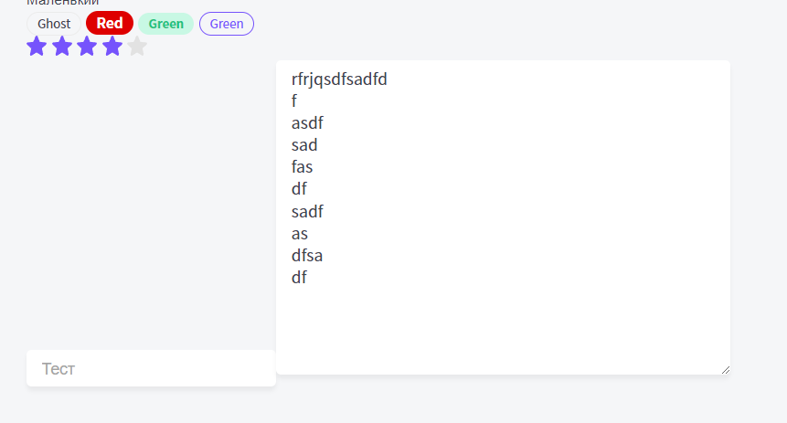

## 003 Компонент поиска

В качестве пропсов поиск будет принимать атрибуты дива

`components / Search / Search.props.ts`

```TS
import { DetailedHTMLProps, HTMLAttributes } from 'react';

export interface SearchProps extends DetailedHTMLProps<HTMLAttributes<HTMLDivElement>, HTMLDivElement> {}
```

Так выглядит сам компонент поиска, который ищет значения по определённому `url` и генерит под результаты поиска отдельный роут

`components / Search / Search.tsx`

```TSX
import { useState } from 'react';
import cn from 'classnames';
import { SearchProps } from './Search.props';
import styles from './Search.module.css';
import { Input } from '../Input/Input';
import { Button } from '../Button/Button';
import GlassIcon from './glass.svg';
import { useRouter } from 'next/router';

export const Search = ({ className, ...props }: SearchProps): JSX.Element => {
	const [search, setSearch] = useState<string>('');
	const router = useRouter();

	// функция перехода по нужному нам url
	const goToSearch = () => {
		// метод push позволяет запушить новое значение url в состояние
		router.push({
			pathname: '/search',
			query: {
				q: search,
			},
		});
	};

	// данная функция будет триггерить выполнение поиска на клавишу
	const handleKeyDown = (e: KeyboardEvent) => {
		// при клике на enter...
		if (e.key == 'Enter') {
			// ... будет выполняться поиск
			goToSearch();
		}
	};

	return (
		<div className={cn(className, styles.search)} {...props}>
			{/*
			 * Изначальное значение поиска = state
			 * Каждый раз, когда мы что-то вводим, это значение будет записываться в стейт
			 */}
			<Input
				className={styles.input}
				placeholder={'Поиск...'}
				// значением будет начальное значение стейта
				value={search}
				// при изменении
				onChange={e => setSearch(e.target.value)}
				// при нажатии на клавишу
				onKeyDown={handleKeyDown}
			/>
			<Button appearance={'primary'} className={styles.button} onClick={goToSearch}>
				<GlassIcon />
			</Button>
		</div>
	);
};
```

Поиск делаем релативным, а уже кнопку делаем с абсолютным позиционированием, чтобы она была на уровне поиска

`components / Search / Search.module.css`

```CSS
.search {
	position: relative;
	width: 100%;
}

.input {
	width: 100%;
}

.button {
	position: absolute;
	top: 3px;
	right: 3px;

	width: 30px;
	height: 30px;

	padding: 8px;
}
```

Добавляем поиск в сайдбар

`layout / Sidebar / Sidebar.tsx`

```TSX
export const Sidebar = ({ className, ...props }: SidebarProps): JSX.Element => {
	return (
		<div className={cn(className, styles.sidebar)} {...props}>
			<Logo className={styles.logo} />
			<Search />
			<Menu />
		</div>
	);
};
```

Сокращаем путь до импорта

`components / index.ts`

```TS
export * from './Search/Search';
```

И примерно так выглядит поиск на странице

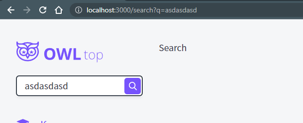

## 004 Компонент продукта - планирование

Далее нам нужно сверстать компонент с достаточно сложной сеткой. Чтобы упростить себе немного работу стоит сделать скриншот данного макета и попробовать разбить его сеткой


Плюсы:

1. Тут используется всего одна сетка
2. Теги курса и {цена, кредит и отзывы} находятся в одной строке, что позволит нам не выравнивать их друг относительно друга

Минусы:

1. Придётся использовать отрицательные марджины, чтобы прибивать элементы к нужным нам местам

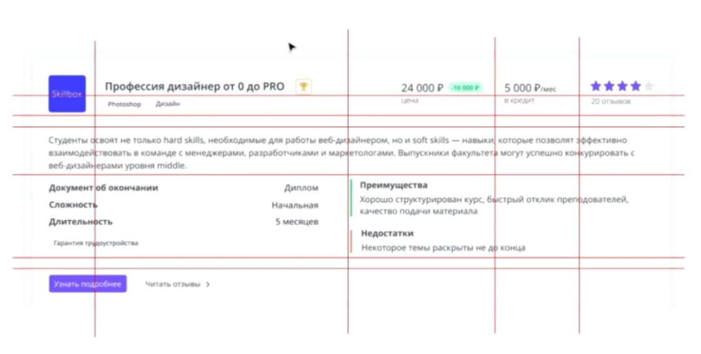

Плюсы:

1. Упрощается вёрстка каждой сетки

Минусы:

1. Сеток 3
2. Нужно выравнивать элементы из разных сеток друг под друга

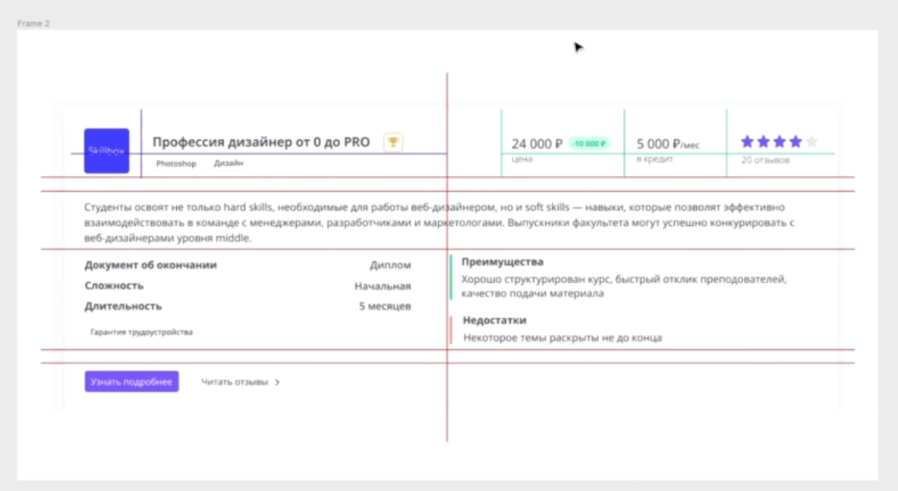

Плюсы:

1. Позволит точно сверстать компонент

Минусы:

1. Вёрстка будет сложной
2. Используется 9 колонок

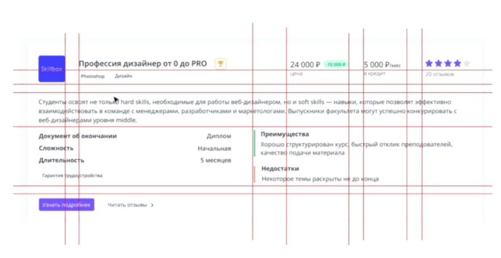

Первым делом нужно определить получаемые пропсы компонентом: это пропсы компонента

`layout / Product / Product.module.ts`

```TS
import { DetailedHTMLProps, HTMLAttributes } from 'react';
import { ProductModel } from '../../interfaces/product.interface';

export interface ProductProps
	extends DetailedHTMLProps<HTMLAttributes<HTMLDivElement>, HTMLDivElement> {
	product: ProductModel;
}
```

Далее нужно создать компонент продукта

`layout / Product / Product.tsx`

```TSX
export const Product = ({ product }: ProductProps): JSX.Element => {
	return <div>{product.title}</div>;
};
```

Сокращаем путь до компонента

`components / index.ts`

```TS
export * from './Product/Product';
```

И далее вставляем компонент `<Product>` в компонент страницы

`page-components / TopPageComponent / TopPage.component.tsx`
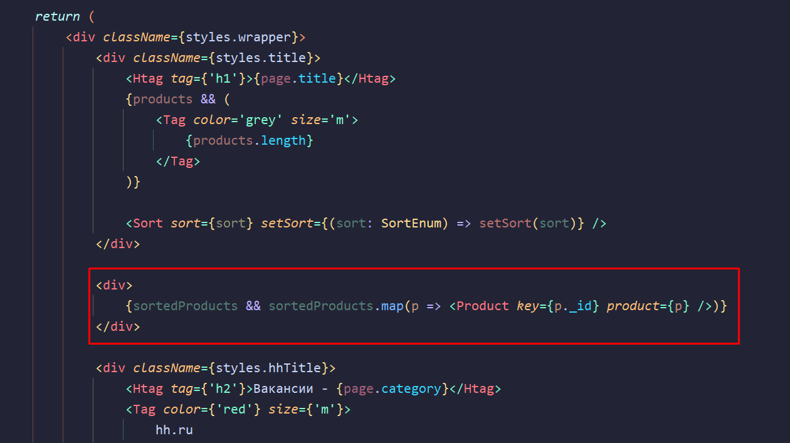

## 005 Компонент продукта

Первым делом, нужно создать компонент разделителя `<hr />`

`components / Divider / Divider.props.ts`

```TS
import { DetailedHTMLProps, HTMLAttributes } from 'react';

export interface DividerProps
	extends DetailedHTMLProps<HTMLAttributes<HTMLHRElement>, HTMLHRElement> {}
```

Вот так выглядит его компонент:

`components / Divider / Divider.tsx`

```TSX
export const Divider = ({ className, ...props }: DividerProps): JSX.Element => {
	return <hr className={cn(className, styles.hr)} {...props} />;
};
```

Стили разделителя

`components / Divider / Divider.module.css`

```CSS
.hr {
	width: 100%;
	height: 1px;

	margin: 20px 0 20px 0;

	border: none;
	background: #C1C1C1;
}
```

Сокращаем путь до компонента:

`components / index.ts`

```TS
export * from './Divider/Divider';
```

Сам компонент продукта:

`components / Product / Product.tsx`

```TSX
import { ProductProps } from './Product.props';
import styles from './Product.module.css';
import cn from 'classnames';
import { Card } from '../Card/Card';
import { Rating } from '../Rating/Rating';
import { Tag } from '../Tag/Tag';
import { Button } from '../Button/Button';
import { priceRu } from '../../helpers/helpers';
import { Divider } from '../Divider/Divider';

export const Product = ({ product }: ProductProps): JSX.Element => {
	return (
		/* обернём продукт в карточку */
		<Card className={styles.product}>
			<div className={styles.logo}>
				
			</div>
			<div className={styles.title}>{product.title}</div>

			{/* блок цены */}
			<div className={styles.price}>
				{priceRu(product.price)}

				{/* если имеется старая цена, то высчитаем скидку и добавим с ней тег */}
				{product.oldPrice && (
					<Tag className={styles.oldPrice} color={'green'}>
						{priceRu(product.price - product.oldPrice)}
					</Tag>
				)}
			</div>

			{/* стоимость продукта по кредиту */}
			<div className={styles.credit}>
				{priceRu(product.credit)}/<span>мес.</span>
			</div>

			{/* Выводим рейтинг. Если reviewAvg отсутствует, то выведем initialRating */}
			<div className={styles.rating}>
				<Rating rating={product.reviewAvg ?? product.initialRating} />
			</div>

			{/* Выведем категории через теги */}
			<div className={styles.tags}>
				{product.categories.map(c => (
					<Tag key={c} color={'ghost'} className={styles.category}>
						{c}
					</Tag>
				))}
			</div>
			<div className={styles.priceTitle}>цена</div>
			<div className={styles.creditTitle}>кредит</div>
			<div className={styles.rateTitle}>{product.reviewCount} отзывов</div>

			{/* компонент-разделитель */}
			<Divider className={styles.hr} />

			<div className={styles.description}>{product.description}</div>
			<div className={styles.feature}>фичи</div>

			{/* блок с преимуществами и недостатками */}
			<div className={styles.advBlock}>
				{/* отображать блоки будем, если преимущества и недостатки придут к нам на фронт */}
				{product.advantages && (
					<div className={styles.advantages}>
						<div className={styles.advTitle}>Преимущества</div>
						<div>{product.advantages}</div>
					</div>
				)}
				{product.disAdvantages && (
					<div className={styles.disAdvantages}>
						<div className={styles.advTitle}>Недостатки</div>
						<div>{product.disAdvantages}</div>
					</div>
				)}
			</div>

			<Divider className={styles.hr} />

			{/* тут будут находиться кнопки */}
			<div className={styles.actions}>
				<Button appearance={'primary'}>Узнать подробнее</Button>
				<Button appearance={'ghost'} arrow={'right'} className={styles.review}>
					Читать отзывы
				</Button>
			</div>
		</Card>
	);
};
```

Стили компонента:

`components / Product / Product.module.css`

```CSS
/*
* GRID-разметка
*/

.product {
	display: grid;
	/* почему -100px? потому что первые две колонки в общей сумме отъели 100px */
	grid-template-columns: [start] 70px [logoend] 30px [titlestart] calc(50% - 100px) [middle] 1fr
	[pricestart] auto [priceend] 40px [creditstart] auto [creditend] 40px [ratestart] auto [end];
	margin-bottom: 30px;
	padding: 30px;
}

.logo {
	grid-column: start / logoend;
	grid-row: 1 / span 2;
}

.title, .tags {
	grid-column: titlestart / middle;
}

.price, .priceTitle {
	grid-column: pricestart / priceend;
}

.credit, .creditTitle {
	grid-column: creditstart / creditend;
}

.rating, .rateTitle {
	grid-column: ratestart / end;
}

.hr, .description, .actions {
	grid-column: start / end;
}

.feature {
	grid-column: start / middle;
}

.advBlock {
	grid-column: middle / end;
}

/*
* Стилизация блоков
*/

.logo img {
	border-radius: 5px;
}

.category {
	margin-top: 7px;
}

.title {
	/* он сам себя должен прибить к низу */
	align-self: flex-end;

	font-weight: 600;
	font-size: 20px;
	line-height: 27px;
}

.price, .credit {
	align-self: flex-end;

	font-size: 20px;
	line-height: 27px;
}

.credit span {
	font-weight: 400;
	font-size: 14px;
	line-height: 19px;
}

.rating {
	align-self: flex-end;
}

.description {
	margin-bottom: 15px;

	font-size: 16px;
	line-height: 24px;
}

.review {
	margin-left: 20px;
}

.creditTitle,
.rateTitle,
.priceTitle {
	font-weight: 300;
	font-size: 14px;
	line-height: 19px;
}

.oldPrice {
	margin-left: 5px;
}

.advBlock {
	font-size: 16px;
	line-height: 22px;
}

.advTitle {
	margin-bottom: 5px;

	font-weight: bold;
	font-size: 16px;
	line-height: 22px;
}

.advantages {
	border-left: 2px solid var(--green);
	padding-left: 15px;
	margin-bottom: 15px;
}

.disAdvantages {
	border-left: 2px solid var(--red);
	padding-left: 15px;
}
```

Так выглядит итоговый компонент продукта:

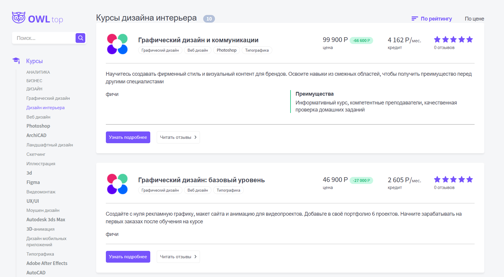

###### Примечания

1. если у нас создаётся вертикальный `<hr>`, когда мы используем его в гриде, то можно положить его в `<div>`, чтобы он стал горизонтальным

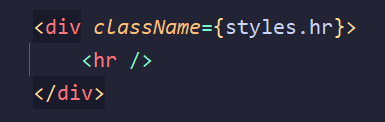

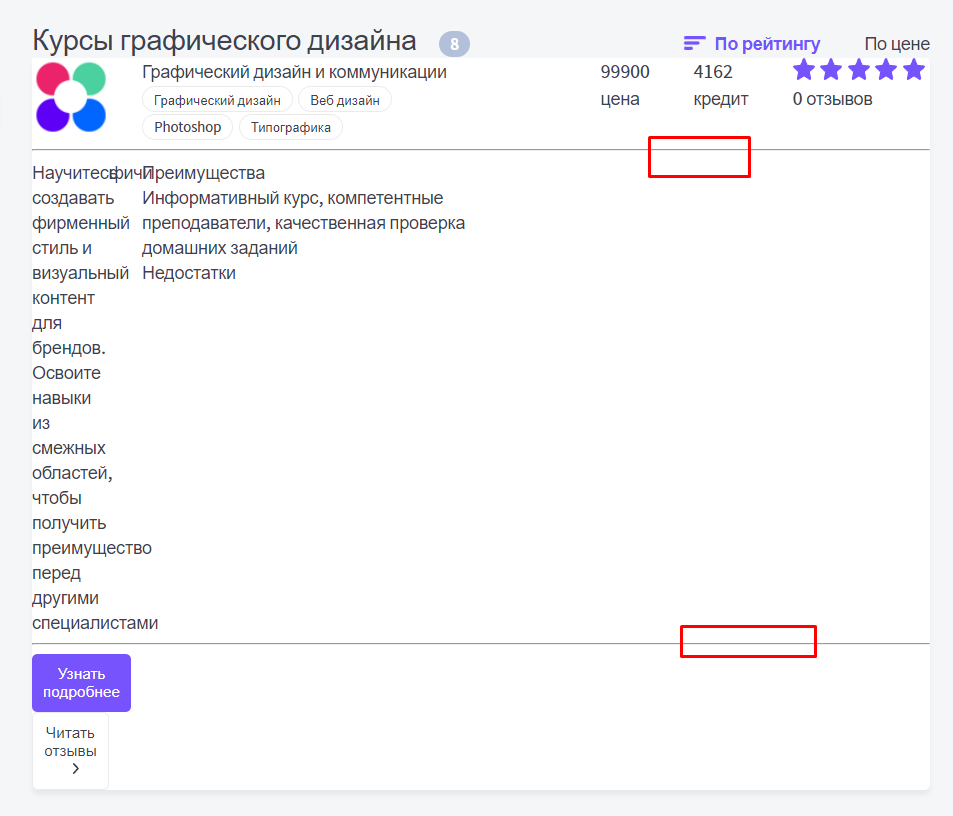

## 007 Склонение слов

Напишем хелпер, который в зависимости от передаваемого числа будет возвращать слово с определённым окончанием

`helpers / helpers.tsx`

```TSX
// сюда мы передаём число отзывов и окончания 			-ыв,   -ыва, 	-ов
export const declOfNumber = (number: number, titles: [string, string, string]) => {
	/*
	 * Тут мы создали массив определённых кейсов:
	 * индекс 0 - 0 отзыв-ОВ - берём элемент из массива окончаний под индексом 2
	 * индекс 1 - 1 отз-ЫВ - берём элемент из массива окончаний под индексом 0
	 * */
	const cases = [2, 0, 1, 1, 1, 2];

	/*
	 * Тут мы возвращаем из массива переданных окончаний лишь одно:
	 * если число > 4 и < 20 (и так же его целый остаток при делении на 100), то возвращаем окончание -ов (третий элемент массива)
	 * в остальных случаях будем сравнивать полученное значение из массива наших кейсов
	 *  */
	return titles[
		number % 100 > 4 && number % 100 < 20 ? 2 : cases[number % 10 < 5 ? number % 10 : 5]
	];
};
```

И далее нужно просто добавить этот хелпер в наш код

`components / Product / Product.tsx`

```TSX
<div className={styles.rateTitle}>
	{product.reviewCount}{' '}
	{declOfNumber(product.reviewCount, ['отзыв', 'отзыва', 'отзывов'])}
</div>
```

И сейчас можно увидеть, что окончание подстраивается под количество отзывов

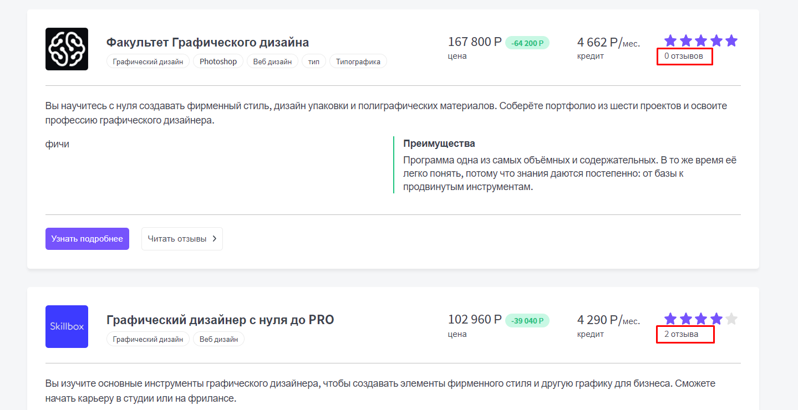

И теперь вместо слова **_фичи_** воткнём вывод характеристик продукта. Для этого мы в `<span>` закинем имя характеристики, точки и значение

`components / Product / Product.tsx`

```TSX
<div className={styles.feature}>
	{product.characteristics.map(c => (
		<div className={styles.characteristics} key={c.name}>
			<span className={styles.characteristicsName}>{c.name}</span>
			<span className={styles.characteristicsDots}></span>
			<span className={styles.characteristicsValue}>{c.value}</span>
		</div>
	))}
</div>
```

Тут нужно сказать, что мы накидываем сетку на каждый элемент списка отдельно. Делаем линию с помощью бордера в виде `dashed`. Чтобы выравнять точки относительно, используем нижний марджин и выравнивание элементов относительно `baseline`

`components / Product / Product.module.css`

```CSS
.characteristics {
   display: grid;
   grid-template-columns: auto 1fr auto;
   align-items: baseline;
   gap: 10px;

   padding-right: 60px;

   font-size: 16px;
   line-height: 32px;
}

.characteristicsName {
   font-weight: bold;
}

.characteristicsDots {
   border-bottom: 1px dashed var(--gray);
   margin-bottom: 8px;
}
```

Итог:

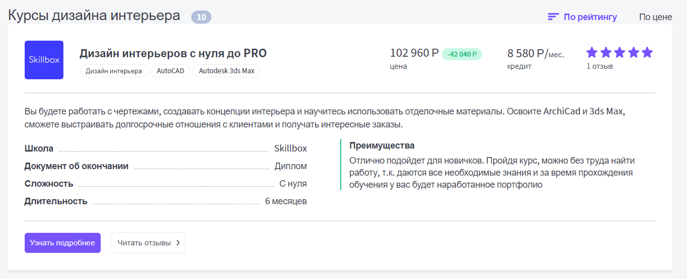

## 008 Компонент Image

В нексте присутствует удобный компонент `Image`. В первую очередь он не просто выводит изображение, а так же несёт под собой дополнительный функционал:

- Кеширует и генерирует файл. То есть он получает изображение, конвертирует его в нужный формат изображения, закидываем в кеш и далее может брать его из кеша.

Свойства:

- `quality` - определяет качество сжатия
- `priority` - позволяет произвести предзагрузку, если изображение важное
- `src` - путь до изображения
- `width` / `height` - ширина / высота - их мы задаём, если `layout` в позиции `fixed`. Если `filled`, то не нужно указывать
- `layout` - определяет поведение расположения и заполнения изображения внутри своего контейнера
- `objectFit` - определяет поведение картинки (_работает как в стилях CSS_)
- `objectPosition` - определяет позиционирование картинки (_работает как в стилях CSS_)
- `loading` - определяет поведение загрузки изображения. `lazy` загружает изображение только тогда, когда оно близко вьюпорту
- `unoptimized` - определяет то, будет ли оптимизироваться изображение
- `loader` - тут уже можно определить свой загрузчик изображений

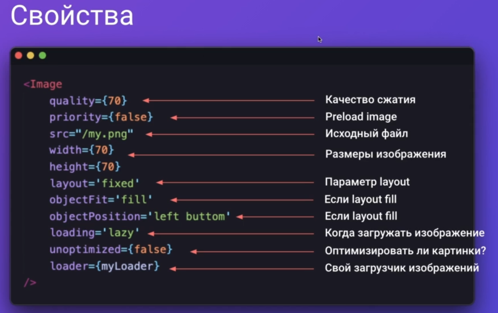

- `fixed` - размер изображения не будет изменяться при изменении размера адаптивной сетки
- `intrinsic` - генерит при сжатии более оптимизированные маленькие картинки
- `responsive` - сжимает и растягивает изображение для разных размеров
- `fill` - полностью заполняет родительский элемент

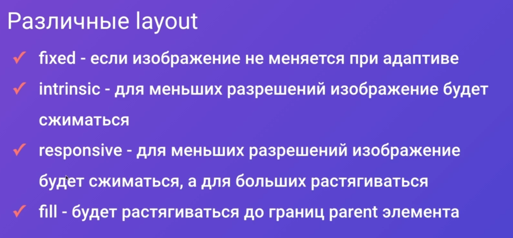

Так же мы можем написать свой сервис, который по определённым переданным вводным будет генерировать нужное изображение и этот сервис уже можно будет вставить в загрузчик изображения

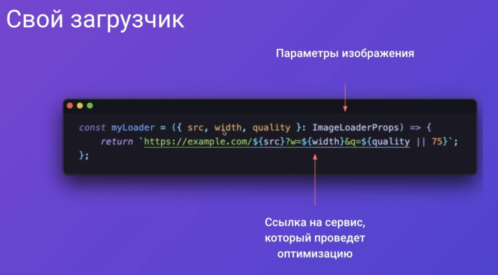

Так же, когда мы работаем с размером изображений, мы можем сказать, что нам нужно генерировать изображения под определённую ширину девайса, генерировать определённого размера изображения и выбрать доступные домены для загрузки
Данные настройки нужно вносить в `next.config.js`

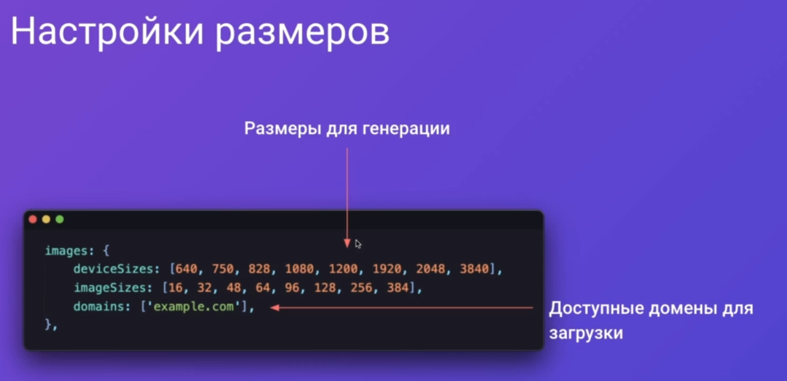

Меняем стандартный тег `img` на `Image` и вставляем те же атрибуты добавляя размер изображения

`components / Product / Product.tsx`

```TSX
<div className={styles.logo}>
	<Image
		src={process.env.NEXT_PUBLIC_DOMAIN + product.image}
		alt={product.title}
		width={70}
		height={70}
	/>
</div>
```

Далее, чтобы мы смогли загрузить изображение со стороннего домена, нужно добавить этот домент в доступные внутри конфига некста

`next.config.js`

```JS
module.exports = {
	images: {
	  domains: ['courses-top.ru'],  // определяем домены
	},
	webpack(config, options) {
	  /// CODE ...
	});
	  return config;
	},
};
```

И на выходе мы получаем изображения, которые подгружаются локально с нашего хоста

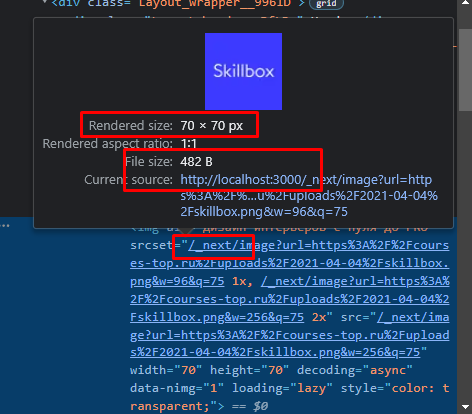

Так же изображения автоматически конвертируются в ==webp==, что сильно урезает их размер

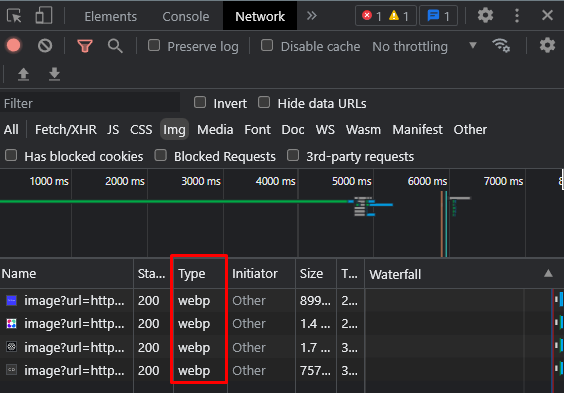

Но если добавить в тег атрибут `layout={'responsive'}`, то сгенерируется изображение под каждое из разрешений

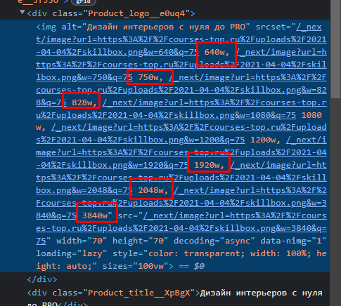

## 009 Компонент продукта - адаптив

Для второго разделителя добавим класс `hr2`, чтобы его можно было отделить в классах

`components / Product / Product.tsx`

```TSX
<Divider className={cn(styles.hr, styles.hr2)} />
```

Далее нам предстоит долгая работа с `grid-template-areas`, в котором нужно будет указать наименования колонок и их занимаемое пространство на макете

`components / Product / Product.module.css`

```CSS
@media (max-width: 1320px) {
	.product {
		grid-template-columns: 70px 30px auto 40px auto 40px 1fr;
		grid-template-areas:
		"logo . title title title title title"
		"logo . tags tags tags tags tags"
		"price price price . credit . rating"
		"priceTitle priceTitle priceTitle . creditTitle . rateTitle"
		"hr hr hr hr hr hr hr"
		"description description description description description description description"
		"feature feature feature feature feature feature feature"
		"advBlock advBlock advBlock advBlock advBlock advBlock advBlock"
		"hr2 hr2 hr2 hr2 hr2 hr2 hr2"
		"actions actions actions actions actions actions actions"
		;
	}

	.description {
		grid-area: description;
	}

	.logo {
		grid-area: logo;
		margin-bottom: 20px;
	}

	.feature {
		grid-area: feature;
		margin-bottom: 20px;
	}

	.advBlock {
		grid-area: advBlock;
	}

	.actions {
		grid-area: actions;
	}

	.title {
		grid-area: title;
	}

	.priceTitle {
		grid-area: priceTitle;
	}

	.creditTitle {
		grid-area: creditTitle;
	}

	.rateTitle {
		grid-area: rateTitle;
	}

	.tags {
		grid-area: tags;
		margin-bottom: 20px;
	}

	.price {
		grid-area: price;
	}

	.credit {
		grid-area: credit;
	}

	.rating {
		grid-area: rating;
	}

	.hr2 {
		grid-area: hr2;
	}
}

@media (max-width: 640px) {
	.product {
		grid-template-columns: 70px 30px 1fr;
		grid-template-areas:
		"logo . title"
		"logo . tags"
		"priceTitle priceTitle price"
		"creditTitle creditTitle credit"
		"rateTitle rateTitle rating"
		"hr hr hr"
		"description description description"
		"feature feature feature"
		"advBlock advBlock advBlock"
		"hr2 hr2 hr2"
		"actions actions actions"
	;
	}

	.price {
		margin-bottom: 10px;
	}

	.credit {
		margin-bottom: 10px;
	}

	.rating {
		margin-bottom: 10px;
	}
}

@media (max-width: 480px) {
	.product {
		grid-template-columns: 1fr;
		grid-template-areas:
		"logo"
		"title"
		"tags"
		"price"
		"priceTitle"
		"credit"
		"creditTitle"
		"rating"
		"rateTitle"
		"hr"
		"description"
		"feature"
		"advBlock"
		"hr2"
		"actions"
	;
	}
}
```

И тут поправим поведение заголовка страницы, чтобы она была в две колонки

`TopPageComponent.module.css`

```CSS
.title {
   display: grid;
   grid-template-columns: auto 1fr auto;

   margin-bottom: 30px;

   align-items: baseline;
   justify-items: left;
   gap: 20px;
}

@media (max-width: 640px) {
	.title {
		grid-template-columns: auto 1fr;
	}
}
```

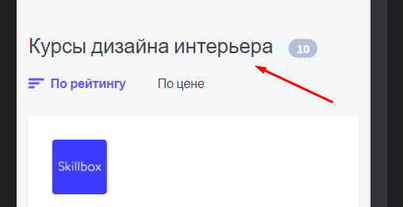

###### Итог:

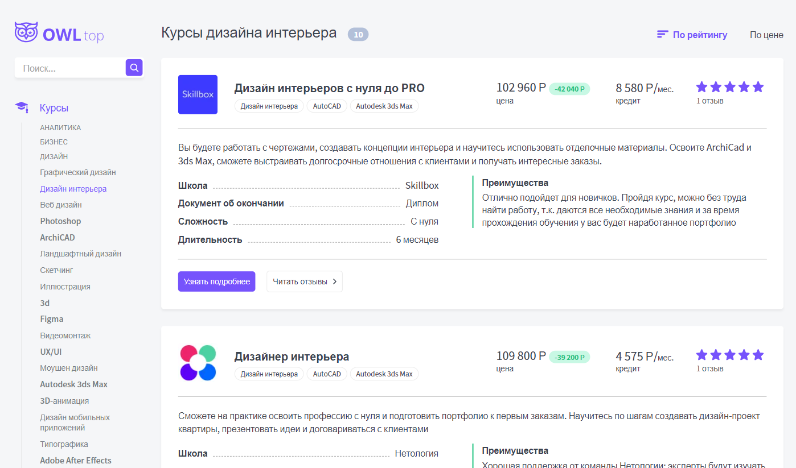


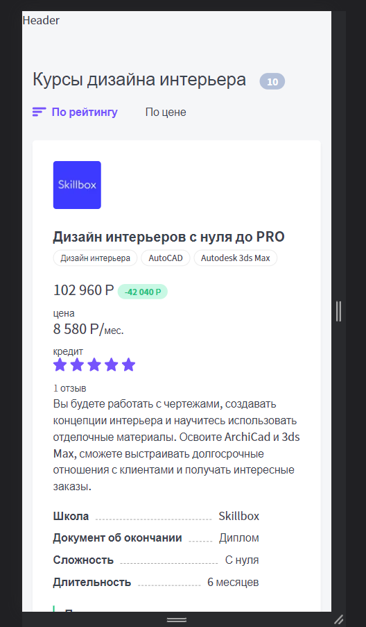

###### Примечание

Чтобы убрать перескакивание некоторых элементов, можно в стилях запретить такое поведение через свойство `white-space`

`components / Product / Product.module.css`

```CSS
.price, .priceTitle {
   grid-column: pricestart / priceend;
   white-space: nowrap;
}

.credit, .creditTitle {
   grid-column: creditstart / creditend;
   white-space: nowrap;
}

.rating, .rateTitle {
   grid-column: ratestart / end;
   white-space: nowrap;
}
```


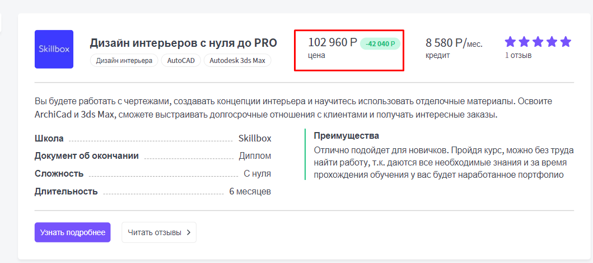
