#FramerMotion

## 001 Вводное видео

Мы имеем несколько самых популярных библиотек анимаций для реакта:

- react-sptring
- Framer Motion - очень похож по синтаксису на прошлую библиотеку, но имеет полную поддержку жестов, как на мобилаках / так же он хорошо работает с SSR / так же он умеет использовать CSS-переменные
- React Transition Group - очень простая библиотека, которая позволит быстро добавить анимации на страницу
- React-Motion - предлагает очень качественные физические анимации
- Reac Move - позволяет сделать любые сложные анимации, но чаще всего используется в графиках

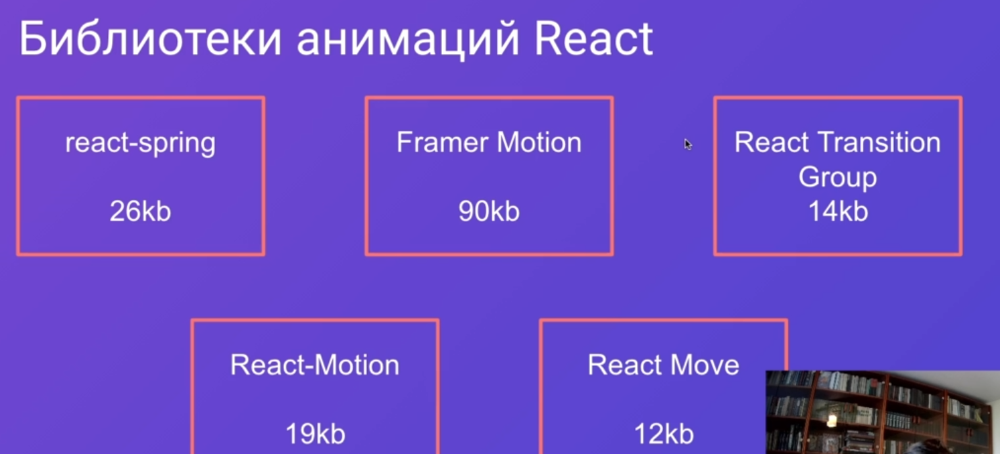

Из основных преимуществ Framer Motion можно выделить:

- Интеграцию с плагином Framer из Figma
- Обработка всех сложных событий (drag&drop и так далее)
- Анимация SVG-объектов
- Декларативность анимации (мы указываем, что мы хотим в итоге видеть)
- Поддерживает SSR из чего следует, что у нас анимации кешируются и у нас отсутствуют скачки при начале использования страницы
- Анимации работают очень плавно за счёт использования средств видеокарты

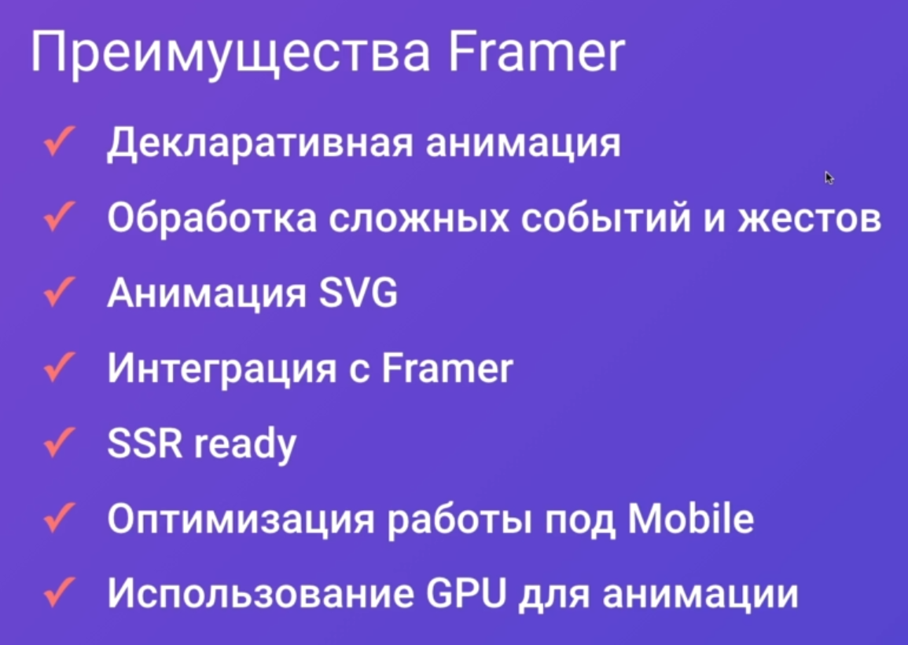

## 002 Принципы анимации

Чтобы начать писать свою анимацию, нужно написать элемент дом дерева, начиная с `<motion.элемент>`. После оборота элемента в моушн, нам становятся доступны атрибуты анимации

- `initial` - начальное состояние элемента
- `transition` - информация о переходе (в примере: тип и длительность)
- `animate` - конечное состояние элемента

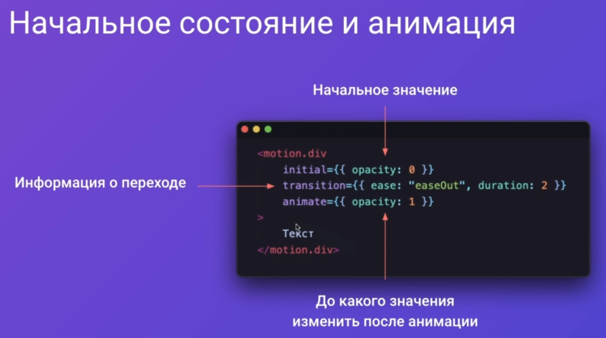

Так же можно настроить анимацию более детально с помощью **keyframes**

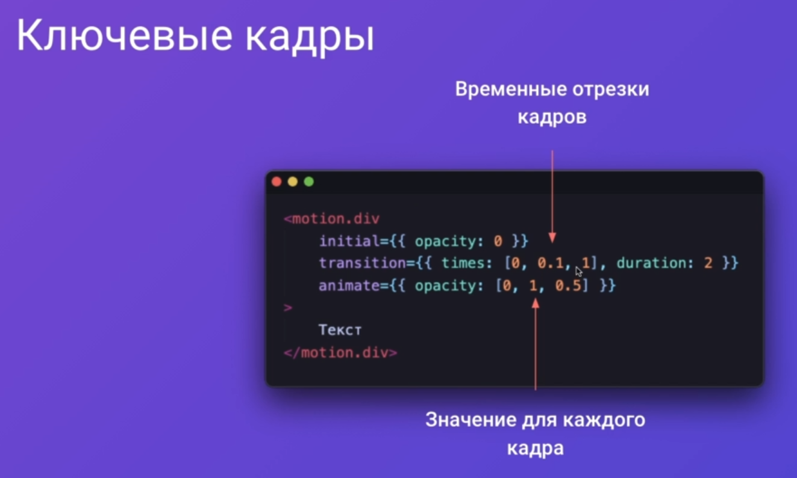

Так же мы можем указать отдельный блок состояний элемента, который позволит использовать определённые варианты, подставляя значения в атрибуты.

Такой подход позволит менять состояние элемента через стейты.

Так же нужно отметить, что нужно менять только атрибут `animate`, так как `initial` отвечает только за начальное состояние на странице

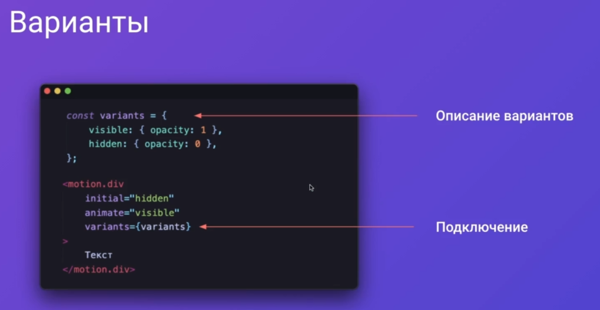

Так же если в моушен-родителе есть моушн-дочерние-элементы, то дочерние элементы унаследуют анимацию инишела и анимэйта

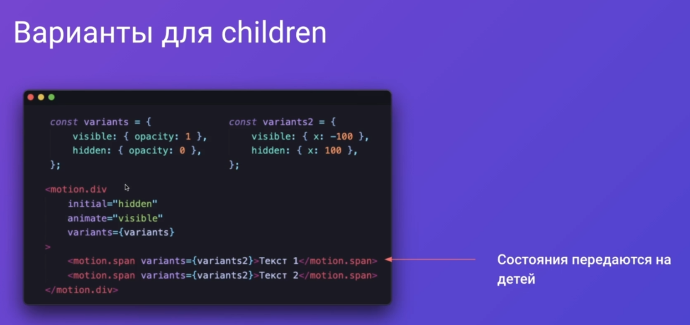

Так же мы можем определённым образом оркестрировать анимации. То есть мы можем указать, когда нам нужно производить ту или иную анимацию на странице

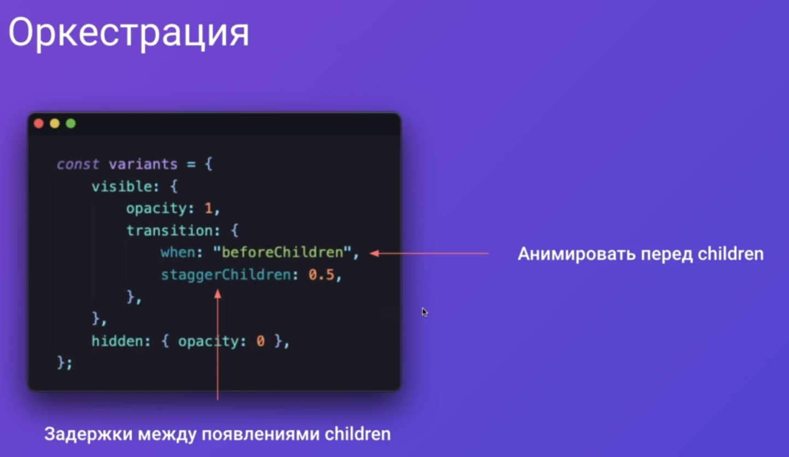

Атрибут `layout` будет говорить элементу анимации, чтобы он анимировался каждый раз, как меняется лейаут этого элемента (например, если он куда-либо двигается)

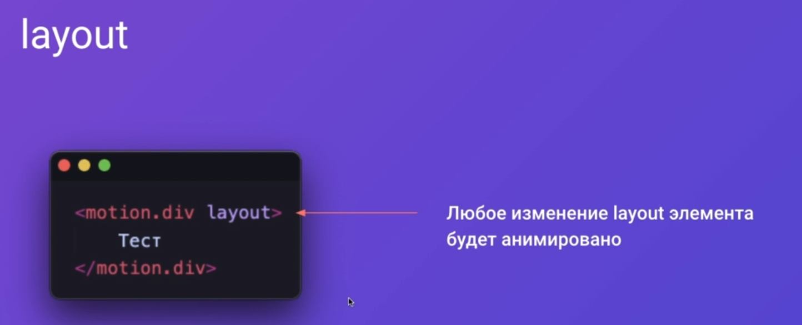

## 003 Анимация меню

Первым делом, установим фреймер-моушн

```bash
npm i framer-motion
```

Сейчас уже нам нужно изменить второй уровень:

- уберём раскрытие элемента списка по классу (если бы мы пытались анимировать список через CSS, то нужно было бы делать меню в 100вх и потом переводить в 0, но тут мы будем использовать фреймер)
- добавим на него моушн
- далее нужно описать варианты анимаций для родительского элемента и дочернего элемента
- далее в родительском элементе указываем варианты анимаций, инишл, анимэйт и лейаут
- Далее дочерний элемент ссылки оборачиваем в `<motion.div>` и ему просто указываем варианты анимаций (они унаследуются от родительского элемента)

`layout / Sidebar / Sidebar.tsx`

```TSX
export const Menu = (): JSX.Element => {
   const { menu, setMenu, firstCategory } = useContext(AppContext);
   const router = useRouter();

   // варианты анимаций
   const variants = {
      // скрыт
      hidden: {
         marginBottom: 0,
      },
      // видимый
      visible: {
         // накидываем стили
         marginBottom: 20,
         // условия внутри анимации
         transition: {
            when: 'beforeChildren', // перед дочерними элементами
            staggerChildren: 0.1, // с определённым оффсетом
         },
      },
   };

   const variantsChildren = {
      hidden: { opacity: 0, height: 0 },
      visible: { opacity: 1, height: 29 },
   };

   /// CODE ...

   const buildSecondLevel = (menuItem: FirstLevelMenuItem) => {
      return (
         <div className={styles.secondBlock}>
            {menu.map(m => {
               if (m.pages.map(p => p.alias).includes(router.asPath.split('/')[2])) {
                  m.isOpened = true;
               }
               return (
                  <div key={m._id.secondCategory}>
                     <div
                        className={styles.secondLevel}
                        onClick={() => openSecondLevel(m._id.secondCategory)}
                     >
                        {m._id.secondCategory}
                     </div>

                     {/* родительский элемент для третьего уровня меню */}
                     <motion.div
	                    {/* срабатывает анимация при изменении лейаута */}
                        layout
                        {/* начальное состояние анимации */}
                        initial={m.isOpened ? 'visible' : 'hidden'}
                        {/* изменение стилей в зависимости от состояния стейта */}
                        animate={m.isOpened ? 'visible' : 'hidden'}
                        {/* варианты анимаций */}
                        variants={variants}
                        className={cn(styles.secondLevelBlock)}
                     >
                        {buildThirdLevel(m.pages, menuItem.route)}
                     </motion.div>
                  </div>
               );
            })}
         </div>
      );
   };

   const buildThirdLevel = (pages: PageItem[], route: string) => {
      return pages.map(p => (
		 {/* тут мы закидываем просто варианы состояний */}
         <motion.div variants={variantsChildren} key={p._id}>
            <Link
               href={`/${route}/${p.alias}`}
               className={cn(styles.thirdLevel, {
                  [styles.thirdLevelActive]: `/${route}/${p.alias}` == router.asPath,
               })}
            >
               {p.category}
            </Link>
         </motion.div>
      ));
   };

   return <div className={styles.menu}>{buildFirstLevel()}</div>;
};
```

Тут нужно сразу описать проблему, с которой мы можем столкнуться, если не укажем `overflow: hidden`. При нажатии на элемент второго уровня, мы тыкнем на самом деле на другой элемент, который мы не видим, но располагается над требуемым для нас элементом (непрозрачность для третьего уровня стоит в 0)


`layout / Sidebar / Sidebar.module.css`

```CSS
.secondLevelBlock {
   overflow: hidden;
}
```

И теперь можно увидеть последовательную анимацию на странице, которая проходит оффсетом через JS


## 004 Анимация сортировки

Чтобы функциональный компонент можно было начать использовать для моушена, нужно обернуть сам компонент в `forwardRef()` и уже потом всю эту конструкцию обернуть в `motion()`

`components / Product / Product.tsx`

```TSX
import { motion } from 'framer-motion';

// сначала продукт оборачиваем в forwardRef, а потом оборачиваем в motion
export const Product = motion(
   forwardRef(
      (
         { product, className, ...props }: ProductProps,
         ref: ForwardedRef<HTMLDivElement>,
      ): JSX.Element => {

		/// CODE ...

         // Тут передаём в корень компонента ссылку на ref
         return (
            <div ref={ref} className={className} {...props}>
               /// CODE ...
            </div>
         );
      },
   ),
);
```

И далее на самом компоненте мы можем вызвать атрибуты присущие компонентам `motion`. Тут нам нужно установить анимацию при изменении `layout`

`page-components / TopPageComponent / TopPageComponent.tsx`

```TSX
<div>
   {sortedProducts &&
      sortedProducts.map(p => <Product layout key={p._id} product={p} />)}
</div>
```

И теперь наши карточки красиво заанимированы на перемещение между друг другом при изменении сортировки продуктов

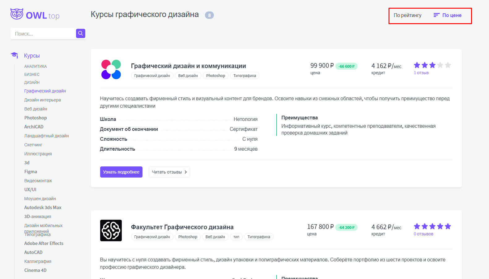

## 005 Пишем свой hook

Все хуки переносим в папку `hooks`. Именуются все хуки с `use`.

Сейчас нам нужно сделать хук, который будет вычислять наше положение на странице по оси Y для того, чтобы сделать в будущем стрелку скролла обратно вверх страницы.

`hooks / useScrollY.ts`

```TS
import { useEffect, useState } from 'react';

export const useScrollY = (): number => {
   // чтобы сделать привязку к window, нужно понимать, где мы сейчас находимся
   // данная переменная будет отмечать то, где мы находимся, и будет true только тогда, когда мы в браузере   const isBrowser = typeof window !== 'undefined';

   const [scrollY, setScrollY] = useState<number>(0);

   // эта функция будет отслеживать смещение по Y в браузере
   const handleScroll = () => {
      // если мы в браузере, то возвращаем смещение по Y. Если нет, то возвращаем 0.
      const currentScrollY = isBrowser ? window.scrollY : 0;
      setScrollY(currentScrollY);
   };

   // данная функция подписывается на событие, а потом
   useEffect(() => {
      // подписываемся на скролл
      window.addEventListener('scroll', handleScroll, { passive: true });

      // и отписываемся при анмаунте
      return () => window.removeEventListener('scroll', handleScroll);
   }, []);

   return scrollY;
};
```

И теперь мы можем отслеживать скролл на странице

 

## 006 useAnimation

Хук `useAnimation` пришёл из `framer-motion` и он возвращает контрол, благодаря которому можно стартовать анимации относительно какого-то состояния определённого `motion`-элемента


Так же сам контрол возвращает `Promise`, благодаря чему можно будет построить сложные анимации, зависящие друг от друга


Далее нужно будет реализовать кнопку, которая будет поднимать пользователя в самый верх страницы:

- получаем контрол
- получаем положение по `y`
- `useEffect` будет менять анимацию кнопки, которая висит на `controls`
- функция `scrollToTop` будет возвращать пользователя на самый верх страницы
- далее делаем вёрстку моушн-кнопки, в начале которая будет невидимой. Присваиваем ей `controls` в качестве анимации. И так же навешиваем возвращение в самый верх страницы

`components / Up / Up.tsx`

```TSX
export const Up = (): JSX.Element => {
   const controls = useAnimation();
   const Y = useScrollY();

   useEffect(() => {
      controls.start({ opacity: Y / document.body.scrollHeight });
   }, [Y, controls]);

   // функция прокрутки в самый верх
   const scrollToTop = () => {
      // тут мы имеем спокойный доступ к window, так как он вызывается непосредственно на самой странице
      window.scrollTo({
         top: 0,
         behavior: 'smooth',
      });
   };

   return (
      <motion.button
         className={styles.up}
         onClick={scrollToTop}
         animate={controls}
         initial={{ opacity: 0 }}
      >
	      <UpIcon />
      </motion.button>
   );
};
```

Стили кнопки:

`components / Up / Up.module.css`

```CSS
.up {
   position: fixed;
   bottom: 30px;
   right: 30px;

   display: flex;
   justify-content: center;
   align-items: center;

   width: 40px;
   height: 40px;

   border: none;
   border-radius: 10px;

   background: var(--primary);
   box-shadow: 0px 4px 4px rgba(0, 0, 0, 0.05);

   cursor: pointer;

   transition: all .2s;
}

.up:hover {
   background: var(--primary-hover);
}

.up:active {
   transform: translate(0px, 4px);
}
```

Сократим путь экспорта до элемента

`components / index.ts`

```TS
export * from './Up/Up';
```

Добавим кнопку в лейаут страницы

`layout / Layout.tsx`

```TSX
const Layout = ({ children }: LayoutProps): JSX.Element => {
   return (
      <div className={styles.wrapper}>
         <Header className={styles.header} />
         <Sidebar className={styles.sidebar} />
         <div className={styles.body}>{children}</div>
         <Footer className={styles.footer} />
         <Up />
      </div>
   );
};
```

Данная кнопка выглядит примерно таким образом:

 

## 007 Упражнение - Анимация отзывов

Когда мы будем пытаться анимировать саму карточку, мы можем столкнуться с проблемой, что у нас будет схлопываться только сама карточка, а пэддинги останутся, что создаст много проблем со скачущей анимацией (если мы попытаемся анимировать пэддинги). Поэтому лучше сейчас в моушн-див обернуть всю карточку


Оборачиваем карточку в `motion.div` и анимации через классы `close` и `open` убираем. Анимации мы зададим через варианты, где и укажем стили

`components / Product / Product.tsx`

```TSX
export const Product = motion( forwardRef( ( { product, className, ...props }: ProductProps, ref: ForwardedRef<HTMLDivElement> ): JSX.Element => {

         /// CODE ....

         // варианты конечного вида карточки
         const variants = {
            visible: { opacity: 1, height: 'auto' },
            hidden: { opacity: 0, height: 0 },
         };

         // Тут передаём в корень компонента ссылку на ref
         return (
            <div ref={ref} className={className} {...props}>


				/// CODE ....


               {/* моушн-див с карточкой */}
               <motion.div
                  variants={variants}
                  initial={'hidden'}
                  animate={isReviewOpened ? 'visible' : 'hidden'}
               >
                  <Card ref={reviewRef} color='blue' className={styles.reviews}>
                     {product.reviews.map(r => (
                        <div key={r._id}>
                           <Review review={r} />
                           <Divider />
                        </div>
                     ))}
                     <ReviewForm productId={product._id} />
                  </Card>
               </motion.div>
            </div>
         );
      },
   ),
);
```

Тут мы вместо `close` и `open` оставим один класс `reviews`, который и будет скрывать все элементы внутри себя и будет иметь пэддинги

```CSS
.reviews {
   overflow: hidden;
   padding: 30px;
}
```

## 008 Динамическая иконка

Сейчас нужно реализовать компонент, который в зависимости от переданного текста будет определять нужную иконку и подставлять её.

Типизация компонента не самая обычная и будет представлена таким образом:

`components / ButtonIcon / ButtonIcon.props.ts`

```TS
import { ButtonHTMLAttributes, DetailedHTMLProps } from 'react';
import menu from './menu.svg';
import up from './up.svg';
import close from './close.svg';

// этот объект будет хранить в себе иконки, которые мы импортировали в пропсы
export const icons = {
   menu,
   up,
   close,
};

// тут мы создадим типы по ключам, которые находятся в объекте
export type iconName = keyof typeof icons;

export interface ButtonIconProps
   extends DetailedHTMLProps<ButtonHTMLAttributes<HTMLButtonElement>, HTMLButtonElement> {
   appearance: 'primary' | 'white';
   // тут будут доступными значениями ключи объекта с иконками
   icon: iconName;
}
```

И теперь мы получили типы по названию ключей

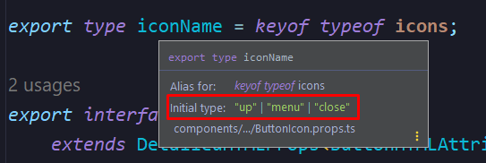

Так будет выглядеть сам компонент выбора иконки:

- Мы получаем иконки из объекта, который указали в `ButtonIcon.props.ts` по ключу имени иконки
- Вставляем данную иконку в вёрстку

`components / ButtonIcon / ButtonIcon.tsx`

```TSX
import styles from './ButtonIcon.module.css';
import { ButtonIconProps, icons } from './ButtonIcon.props';
import cn from 'classnames';

export const ButtonIcon = ({
   appearance,
   icon,
   className,
   ...props
}: ButtonIconProps): JSX.Element => {
   // берём из объекта с иконками в пропсах нужное нам значение по ключу
   const IconComponent = icons[icon];

   return (
      <button
         className={cn(styles.button, className, {
            [styles.primary]: appearance == 'primary',
            [styles.white]: appearance == 'white',
         })}
         {...props}
      >
	      <IconComponent />
      </button>
   );
};
```

Тут мы опишем стили для иконок

`components / ButtonIcon / ButtonIcon.module.css`

```CSS
.button {
   width: 40px;
   height: 40px;

   border: none;
   border-radius: 10px;

   box-shadow: 0px 4px 4px rgba(0, 0, 0, 0.05);

   cursor: pointer;
}

.primary {
   background-color: var(--primary);
}

/* у svg и всех вложенных элементов */
.primary svg * {
   fill: var(--white);
}

.primary:hover {
   background-color: var(--primary-hover);
}

.white {
   background-color: var(--white);
}

.white svg * {
   fill: var(--primary);
}

.white:hover {
   background-color: var(--primary);
}

.white:hover svg * {
   fill: var(--white);
}
```

И теперь нам нужно просто перенести иконку с изображением в компонент `Up`. В него мы вставим `ButtonIcon` и перенесём событие `onClick` на эту иконку (так как она внутри реализована как кнопка)

`components / Up / Up.tsx`

```TSX
export const Up = (): JSX.Element => {

   // CODE ...

   return (
      <motion.div className={styles.up} animate={controls} initial={{ opacity: 0 }}>
         <ButtonIcon icon={'menu'} appearance={'white'} onClick={scrollToTop} />
      </motion.div>
   );
};
```

Итог: мы имеем настраиваемое изображение на иконках

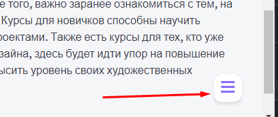

## 009 Мобильное меню

`Layout / Header / Header.tsx`

```TSX
export const Header = ({ className, ...props }: HeaderProps): JSX.Element => {
   // это состояние открытости меню
   const [isOpened, setIsOpened] = useState<boolean>(false);

   // тут мы получаем роутер по страницам
   const router = useRouter();

   // при изменении роута (при выборе страницы из меню), скрывается меню
   useEffect(() => {
      setIsOpened(false);
   }, [router]);

   // варианты анимаций
   const variants = {
      opened: {
         opacity: 1,
         x: 0,
         transition: {
            stiffness: 90,
         },
      },
      closed: {
         opacity: 0,
         x: '100%',
      },
   };

   return (
      <header className={cn(className, styles.header)} {...props}>
         <Logo />
         <ButtonIcon icon={'menu'} appearance={'white'} onClick={() => setIsOpened(true)} />
         <motion.div
            className={styles.mobileMenu}
            variants={variants}
            initial={'closed'}
            animate={isOpened ? 'opened' : 'closed'}
         >
            <Sidebar />
            <ButtonIcon
               className={styles.menuClose}
               icon={'close'}
               appearance={'white'}
               onClick={() => setIsOpened(false)}
            />
         </motion.div>
      </header>
   );
};
```

Стили для хедера:

- Переносим скрытие хедера из стилей лейаута в стили хедера
- стилизуем состояние самого хедера, показанного меню и скрытого меню

`Layout / Header / Header.module.css`

```CSS
/* обычно хедер скрыт */
.header {
   display: none;
}

.mobileMenu {
   position: fixed;
   top: 0;
   bottom: 0;
   left: 0;
   right: 0; /* чтобы меню растянулось на всю ширину */
   z-index: 10;

   padding: 20px 10px;

   /* чтобы меню можно было пролистывать вниз и вверх */
   overflow-y: scroll;

   background: #F5F6F8;
}

.menuClose {
   position: fixed;
   z-index: 11;
   top: 15px;
   right: 15px;
}

/* показываем хедер на мобильном разрешении */
@media (max-width: 765px) {
   .header {
      display: grid;
      grid-template-columns: 1fr 40px;
      gap: 10px;
      padding: 15px 15px 0 15px;
   }
}
```

Итог: так выглядит интерфейс мобильного меню и хедера

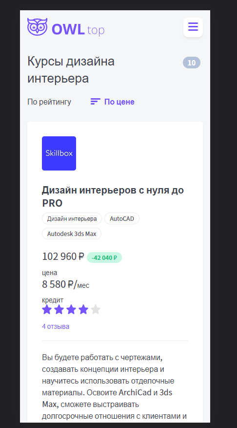 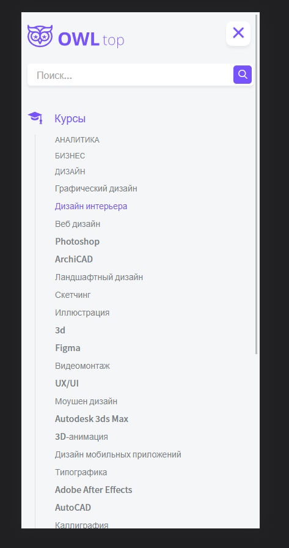

## 010 Жесты и MotionValues

[Жесты](https://www.framer.com/motion/gestures/) во `framer-motion` описываются достаточно просто и все они делятся на несколько групп:

- `hover`
- `focus`
- `tap`
- `pan`
- `drag`

Например, при наведении элемент будет увеличиваться, а при нажатии - уменьшаться

```TSX
<motion.button
  whileHover={{
    scale: 1.2,
    transition: { duration: 1 },
  }}
  whileTap={{ scale: 0.9 }}
/>
```

[Motion values](https://www.framer.com/motion/motionvalue/) - это подписки на величины анимаций, которые у нас изменяются

Например, мы можем подписаться на изменение определённого значения и выполнить определённую анимацию

```TSX
import { motion, useMotionValue } from "framer-motion"

export function MyComponent() {
  const x = useMotionValue(0)
  return <motion.div style={{ x }} />
}
```

Заранее, чтобы можно было обернуть логику в моушн-кнопку, нужно исключить из пропсов 5 атрибутов, которые конфликтуют с моушн-кнопкой. Исключить определённые свойства можно через `Omit<>`

`components / Button / Button.props.ts`

```TS
import { ButtonHTMLAttributes, DetailedHTMLProps, ReactNode } from 'react';

export interface ButtonProps
   extends Omit<
      DetailedHTMLProps<ButtonHTMLAttributes<HTMLButtonElement>, HTMLButtonElement>,
      'onAnimationStart' | 'onDragStart' | 'onDragEnd' | 'onDrag' | 'ref'
   > {
   children: ReactNode;
   appearance: 'primary' | 'ghost';
   arrow?: 'right' | 'down' | 'none';
}
```

Далее уже тут оборачиваем логику в `<motion.div>` и навешиваем атрибут `whileHover`, который сработает при наведении на кнопку

`components / Button / Button.tsx`

```TSX
import styles from './Button.module.css';
import { ButtonProps } from './Button.props';
import ArrowIcon from './arrow.svg';
import cn from 'classnames';
import { motion } from 'framer-motion';

export const Button = ({
   appearance,
   arrow = 'none',
   children,
   className,
   ...props
}: ButtonProps): JSX.Element => {
   return (
      <motion.button
         className={cn(styles.button, className, {
            [styles.primary]: appearance == 'primary',
            [styles.ghost]: appearance == 'ghost',
         })}
         whileHover={{ scale: 1.02 }}
         {...props}
      >
	     {children}
         {arrow != 'none' && (
            <span
               className={cn(styles.arrow, {
                  [styles.down]: arrow == 'down',
               })}
            >
	            <ArrowIcon />
            </span>
         )}
      </motion.button>
   );
};
```

Так реализуется подписка на изменение определённого значения анимации

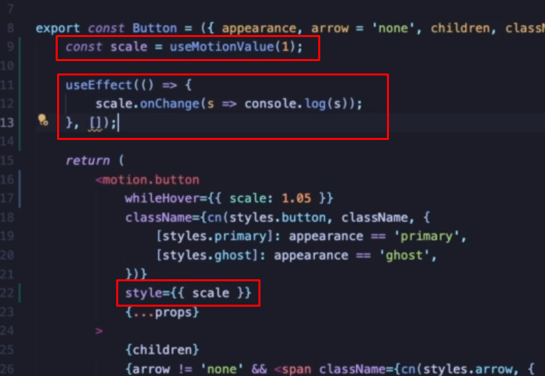

И теперь при изменении объекта, на каждый кадр будет показано наше изменение размера объекта

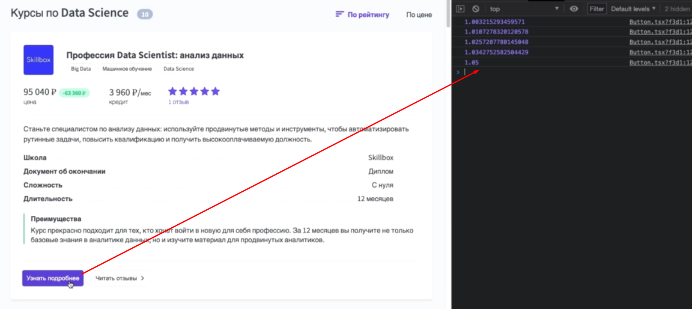

## 011 Производительность

Протестировать сайт можно в ==Android Studio== или ==XCode==
