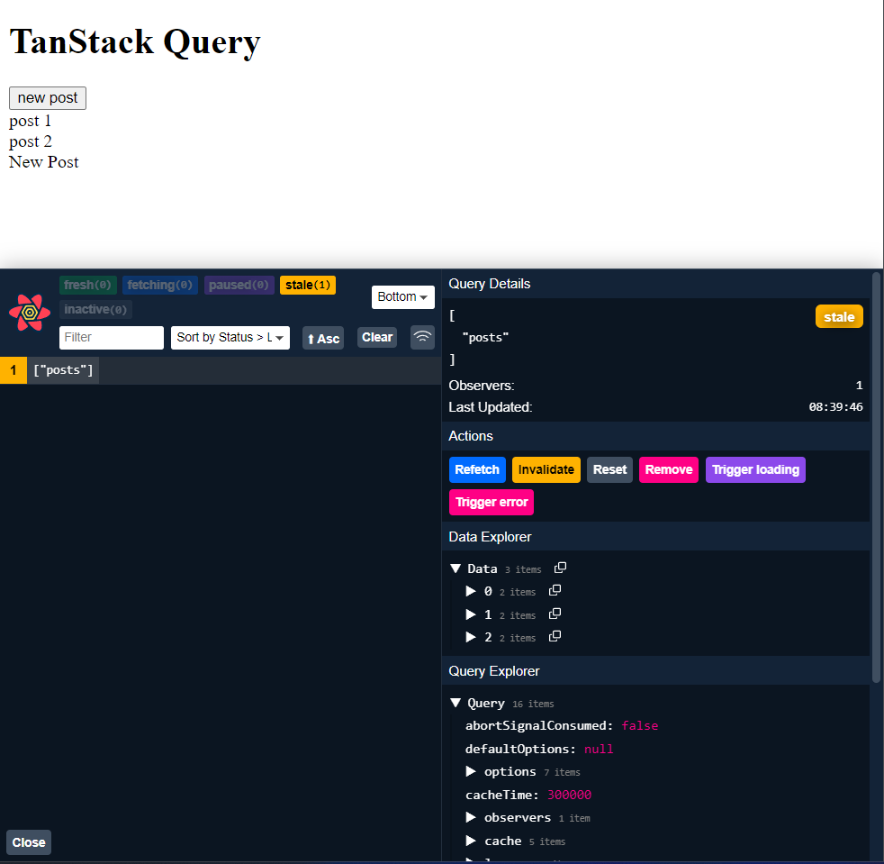
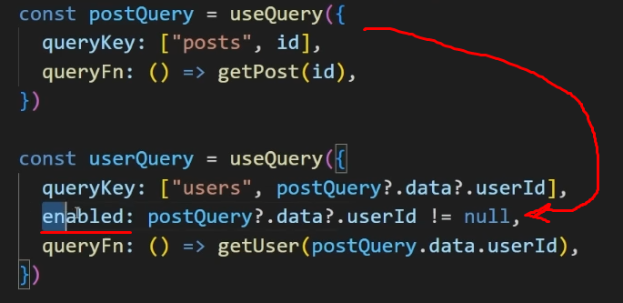
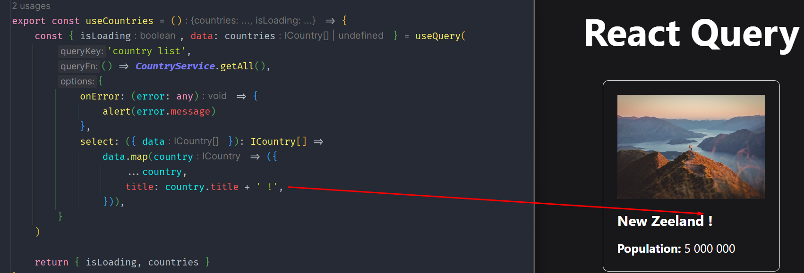
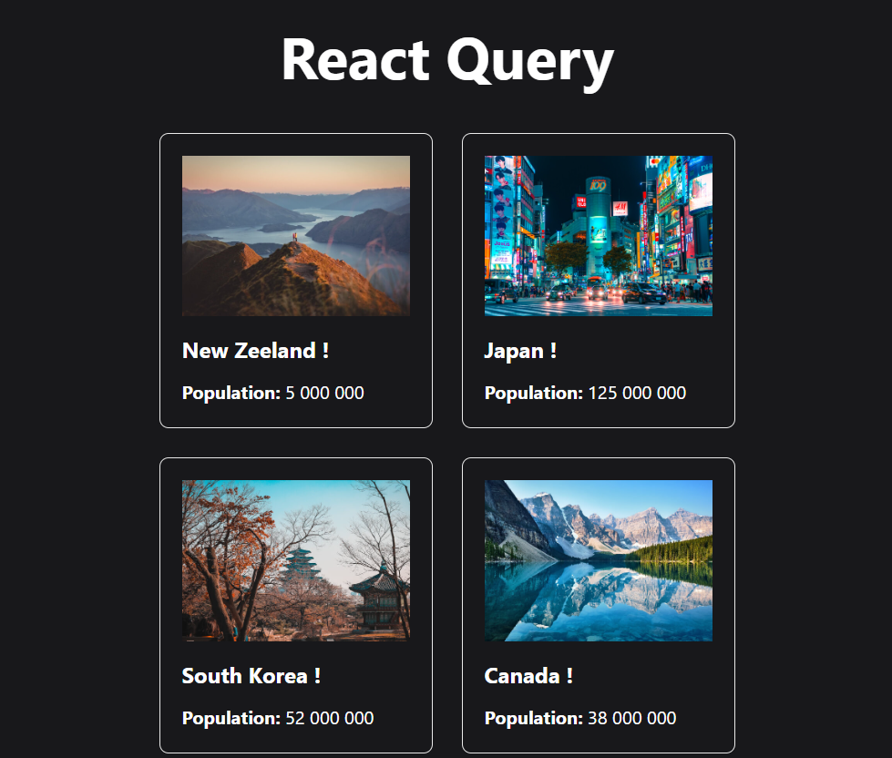
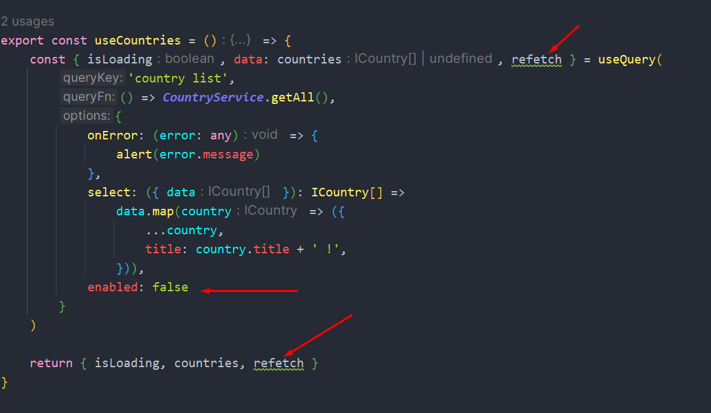

#ReactQuery #React

TanStack Query - это библиотека для управления стейтом и кэширования данных в приложении React. Она предоставляет набор хуков, которые помогают работать с асинхронными запросами и кэшированием данных.

Вот перечень основных хуков TanStack Query:

- `useQuery`: позволяет получить данные из асинхронного источника (например, API) и автоматически кэширует их. Этот хук также обрабатывает ошибки и отменяет запросы при размонтировании компонента.
- `useMutation`: позволяет отправлять асинхронные запросы для создания/обновления/удаления данных на сервере. Возвращает объект с методом `mutate`, который можно вызвать для выполнения запроса.
- `usePaginatedQuery`: позволяет загружать данные постранично. Возвращает объект со страницами данных и методами для переключения между страницами.
- `useInfiniteQuery`: позволяет загружать данные пачками (например, при бесконечной подгрузке новых записей). Похож на `usePaginatedQuery`, но загружает данные динамически по мере прокрутки.
- `useQueryClient`: позволяет получить экземпляр клиента TanStack Query, который содержит информацию о кэшах, запросах и других внутренних состояниях.
- `useIsFetching`: позволяет отслеживать количество активных запросов на странице.

## Setup

Для начала нам нужно установить сам модуль и его девтулзы, которые позволят детально отследить его работу

```bash
npm i @tanstack/react-query
npm i @tanstack/react-query-devtools
```

Далее нам нужно обернуть в данный модуль всё приложение, чтобы оно отслеживало запросы

Так же добавим `ReactQueryDevtools`, который предоставит возможность отслеживать данные внутри приложения

`index.ts`

```TSX
import React from 'react';
import ReactDOM from 'react-dom/client';
import { QueryClient, QueryClientProvider } from '@tanstack/react-query';
import App from './App';

const queryClient = new QueryClient();

const root = ReactDOM.createRoot(document.getElementById('root') as HTMLElement);
root.render(
	<React.StrictMode>
		<QueryClientProvider client={queryClient}>
			<App />
			<ReactQueryDevtools />
		</QueryClientProvider>
	</React.StrictMode>,
);
```

## Basic Example

Далее создадим приложение, которое будет выводить посты. Посты мы храним прямо в компоненте. Так же мы создали функцию `wait()`, которая через определённое ожидание будет возвращать промис и выполнять определённое действие.

Первым делом мы запросим данные по постам через `useQuery`, который принимает `queryKey` (ключ для создания уникального запроса), `queryFn` (функцию запроса данных с сервера)

Далее для изменения данных используется `useMutation`, который принимает `mutationFn` (функция отправки запроса и мутации данных на сервере) и свойство, которое будет выполнять логику при успешном запросе `onSuccess`. В последнее свойство мы поместим метод клиента запросов `invalidateQueries()`, который обновит пришедшие посты

`App.tsx`

```TSX
import React from 'react';
import { useMutation, useQuery, useQueryClient } from '@tanstack/react-query';

const posts = [
	{ id: '1', title: 'post 1' },
	{ id: '2', title: 'post 2' },
];

function App() {
	// получаем возможность управлять клиентом
	const queryClient = useQueryClient();

	// запрос на получение
	const postsQuery = useQuery({
		// уникальный ключ запроса
		queryKey: ['posts'],
		// функция, которая будет выполняться при запросе
		queryFn: () => wait(1000).then(() => [...posts]),
	});

	// запрос на создание нового поста
	const createPostMutation = useMutation({
		// функция мутации данных
		mutationFn: (title: string) =>
			wait(1000).then(() => posts.push({ id: crypto.randomUUID(), title: title })),
		// при успешном запросе мы аннулируем данные, чтобы их перезагрузить
		onSuccess: () => {
			queryClient.invalidateQueries(['posts']);
		},
	});

	if (postsQuery.isLoading) return <h1>Loading...</h1>;

	if (postsQuery.isError) return <h1>Error 404</h1>;

	return (
		<div className='App'>
			<h1>TanStack Query</h1>
			<button
				disabled={createPostMutation.isLoading}
				onClick={() => createPostMutation.mutate('New Post')}
			>
				new post
			</button>
			<div>
				{postsQuery.data.map((post) => (
					<div key={post.id}>{post.title}</div>
				))}
			</div>
		</div>
	);
}

async function wait(duration: number) {
	return new Promise((resolve) => setTimeout(resolve, duration));
}

export default App;
```



## Глобальные настройки

Глобальные настройки задаются внутри `QueryClient`, который мы задаём в корневом компоненте. Мы можем задавать опции для `queries` и `mutations`.

`_app.tsx`

```TSX
import { ReactQueryDevtools } from 'react-query/devtools'

const queryClient = new QueryClient({
	defaultOptions: {
		queries: {
			refetchOnWindowFocus: false,
		},
	},
})

function MyApp({ Component, pageProps }: AppProps) {
	return (
		<QueryClientProvider client={queryClient}>
			<Component {...pageProps} />
			<ReactQueryDevtools initialIsOpen={false} />
		</QueryClientProvider>
	)
}
```

## useQuery

Первым делом стоит сказать, что функция запроса по умолчанию в себя принимает объект, который содержит некоторые метаданные и ключи, которые могут пригодиться в запросе

```TSX
const postsQuery = useQuery({
	queryKey: ['posts'],
	queryFn: (obj) =>
		wait(1000).then(() => {
			console.log(obj);
			return [...posts];
		}),
});
```


Мы можем проверить статус так же здесь


Так же все запросы, на которые мы получили ответ, будут кешироваться в памяти и при перезагрузке страницы сначала отобразятся закешированные данные, а уже потом, в фоне, будут подгружаться новые данные, которые затем отобразятся


Чтобы данные оставались актуальными нужное нам количество времени (например, перезагружать список постов только раз в 5 минут, а не каждый раз при переходе на страницу), то можно указать, как для всего приложения время устаревания данных:

`index.tsx`

```TSX
const queryClient = new QueryClient({
	defaultOptions: {
		queries: {
			staleTime: 1000 * 60 * 5,
		},
	},
});
```

Так и указать время устаревания для отдельного хука запроса с помощью `staleTime`:

`App.tsx`

```TSX
const postsQuery = useQuery({
	queryKey: ['posts'],
	queryFn: (obj) =>
		wait(1000).then(() => {
			console.log(obj);
			return [...posts];
		}),
	staleTime: 1000
});
```

Так же с помощью `refetchInterval` мы можем явно указать раз в какое время нужно заново загружать данные:

`App.tsx`

```TSX
const postsQuery = useQuery({
	queryKey: ['posts'],
	queryFn: (obj) =>
		wait(1000).then(() => {
			console.log(obj);
			return [...posts];
		}),
	staleTime: 1000,
	refetchInterval: 5000,
});
```

Свойство `enabled` останавливает (если `false`) или выполняет (если `true`) запрос на получение данных. Может помочь, если требуется отображать данные, если подгрузились другие данные или просто совершать подгрузку по условию



Тут показаны самые частые данные, которые берутся из запроса

```TSX
	const { data, isError, isLoading, isSuccess, isFetching, refetch, status} = useQuery();
```

## Настройки проекта, типизация с Typescript

Изначально стоит забиндить сервис, который будет работать с запросами в приложении

`app > services > country.service.ts`

```TS
import axios from 'axios'

// дефолтный url для запросов
const API_URL = 'http://localhost:3004'

// устанавливаем в аксиос базовый url для запросов
axios.defaults.baseURL = API_URL

// опишем интерфейс приходящих данных, который подхватится и TanStack Query
export interface ICountry {
	id: number
	title: string
	population: string
	image: string
}

// методы запросов
export const CountryService = {
	async getAll() {
		return axios.get<ICountry[]>('/countries')
	},
	async getById(id: string) {
		return axios.get<ICountry>(`/countries/${id}`)
	},
	async create(data: ICountry) {
		return axios.post('/countries', data, {
			headers: { 'Content-Type': 'application/json' },
		})
	},
}
```

## События onSuccess, onError

Так же события `onSuccess` и `onError` очень удобно использовать внутри query для реагирования на получение или на ошибку, так как эту логику взаимодействия мы описываем прямо внутри TanStack запросов

```TSX
const [arrayCountries, setArrayCountries] = useState<ICountry[]>([]);

const { data } = useQuery(
'countries',
() => CountryService.getAll(), {
	onSuccess: ({ data }) => {
		setArrayCountries(data);
	},
	onError: (error) => alert(error?.message),
});
```

## Трансформация данных (select)

`select` позволяет изменить уже существующие данные и обработать их нужным для нас образом

```TSX
const { isLoading, data: countries } = useQuery(
	'country list',
	() => CountryService.getAll(),
	{
		onError: (error: any) => {
			alert(error.message)
		},
		select: ({ data }): ICountry[] =>
			data.map(country => ({
				...country,
				title: country.title + ' !',
			})),
	}
)
```



## Кастомный хук

Так же хорошей практикой является реализация хуков для получение определённых данных через `react-query`

`app > hooks > useCountries.ts`

```TSX
import { useQuery } from 'react-query'
import { CountryService, ICountry } from '../services/country.service'

export const useCountries = () => {
	const { isLoading, data: countries } = useQuery(
		'country list',
		() => CountryService.getAll(),
		{
			onError: (error: any) => {
				alert(error.message)
			},
			select: ({ data }): ICountry[] =>
				data.map(country => ({
					...country,
					title: country.title + ' !',
				})),
		}
	)

	return { isLoading, countries }
}
```

Использование:

`pages > index.tsx`

```TSX
const Home: NextPage = () => {
	const { isLoading, countries } = useCountries();

	return (
		<div className={styles.container}>
			<main className={styles.main}>
				<h1 className={styles.title}>React Query</h1>

				{isLoading ? (
					<div>Loading...</div>
				) : countries?.length ? (
					<div className={styles.grid}>
						{countries.map(country => (
							<div className={styles.card} key={country.id}>
								<Image
									alt={country.title}
									width={294}
									height={208}
									src={country.image}
								/>
								<h2>{country.title}</h2>
								<p>
									<b>Population:</b> {country.population}
								</p>
							</div>
						))}
					</div>
				) : (
					<div>Elements not found</div>
				)}
			</main>
		</div>
	);
};
```



## Передать аргумент в useQuery (подгрузка по ID)

Уже таким образом будет выглядеть хук с передачей в него `id`

`app > hooks > useCountry.ts`

```TSX
import { useQuery } from 'react-query'
import { CountryService, ICountry } from '../services/country.service'

// внутрь хука передаём id искомого элемента
export const useCountry = (id?: string) => {
	const { isLoading, data: country } = useQuery(
		// сюда передаём id вторым аргументом
		['country list', id],
		() => CountryService.getById(id || ''),
		{
			onError: (error: any) => {
				alert(error.message)
			},
			select: ({ data }): ICountry => data,
			// будем совершать поиск элемента только если у него есть id
			enabled: !!id,
		}
	)

	return { isLoading, country }
}
```

И так выглядит использование хука с передачей аргумента

`pages > country > [id].tsx`

```TSX
import { NextPage } from 'next'
import Image from 'next/image'
import { useRouter } from 'next/router'
import { useCountry } from '../../app/hooks/useCountry'

import styles from '../../styles/Home.module.css'

const Country: NextPage = () => {
	const { query } = useRouter()

	const { country, isLoading } = useCountry(String(query?.id))

	return (
		<div className={styles.container}>
			{isLoading ? (
				<div>Loading...</div>
			) : (
				<main className={styles.main}>
					<h1 className={styles.title}>{country?.title}</h1>
					<div className={styles.grid}>
						<div className={styles.card}>
							<Image
								alt={country?.title}
								width={294}
								height={208}
								src={country?.image || ''}
							/>
							<h2>{country?.title}</h2>
							<p>
								<b>Population:</b> {country?.population}
							</p>
						</div>
					</div>
				</main>
			)}
		</div>
	)
}

export default Country
```


## GET запрос по кнопке "refetch"

Если мы хотим реализовать переполучение данных, чтобы пользователь сам запрашивал их по своему усмотрению, то из query можно вытащить метод `refetch`, который можно передать в качестве onClick в кнопку



## Devtools

Девтулзы позволяют нам запросить данные заново, сделать их неактуальными, сбросить или удалить - справа в блоке с самими данными. Так же они показывают свежие данные, запросы в данный момент времени, старые данные и неактивные запросы - слева вверху в блоке со всеми запросами


## useMutation

Для совершения мутации используется хук `useMutation`, который отправляет запросы на изменение данных на сервере

`pages > create-country.tsx`

```TSX
import { NextPage } from 'next'
import { useRouter } from 'next/router'
import { useState } from 'react'
import { useMutation } from 'react-query'

import styles from '../styles/Home.module.css'
import { CountryService, ICountry } from '../app/services/country.service'

const CreateCountry: NextPage = () => {
	// начальные данные для формы
	const [data, setData] = useState<ICountry>({
		id: 5,
		image: '/images/new-zeeland.jpeg',
		population: '',
		title: '',
	} as ICountry);

	// тут берём метод переадресации
	const { push } = useRouter();

	// тут мы пользуемся запросом на мутацию данных - добавление новой страны
	const { isLoading, mutateAsync } = useMutation(
		'create country',
		// сюда мы можем спокойно передать нужные данные
		(data: ICountry) => CountryService.create(data),
		{
			onSuccess: () => {
				push('/'); // переадресация на главную
			},
			onError: (error: any) => {
				alert(error.message);
			},
		}
	);

	// тут мы будем вызывать запрос на мутацию данных при отправке формы
	const handleSubmit = async (e: any) => {
		e.preventDefault()
		await mutateAsync(data)
	};

	return (
		<div className={styles.container}>
			<main className={styles.main}>
				<h1 className={styles.title}>Create country</h1>
				<div className={styles.grid}>
					<div className={styles.card}>
						<form onSubmit={handleSubmit}>
							<input
								placeholder='Enter id'
								value={data.id}
								onChange={e =>
									setData({
										...data,
										id: +e.target.value,
									})
								}
							/>
							<input
								placeholder='Enter image'
								value={data.image}
								onChange={e =>
									setData({
										...data,
										image: e.target.value,
									})
								}
							/>
							<input
								placeholder='Enter title'
								value={data.title}
								onChange={e =>
									setData({
										...data,
										title: e.target.value,
									})
								}
							/>
							<input
								placeholder='Enter population'
								value={data.population}
								onChange={e =>
									setData({
										...data,
										population: e.target.value,
									})
								}
							/>
							{/* блокируем кнопку, пока идёт загрузка */}
							<button disabled={isLoading}>Create</button>
						</form>
					</div>
				</div>
			</main>
		</div>
	)
}

export default CreateCountry
```
