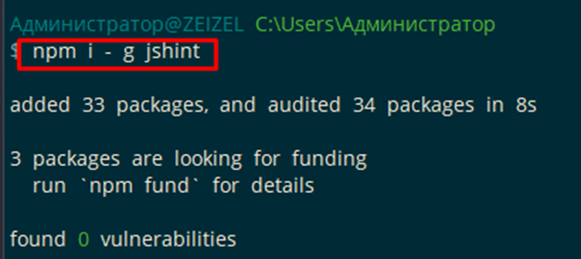
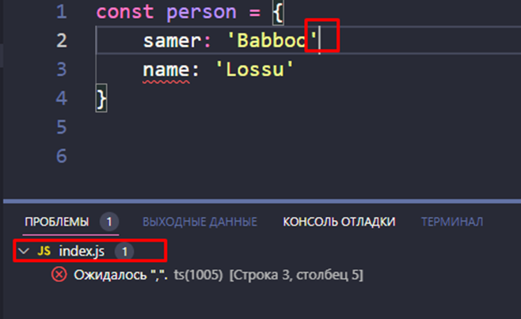
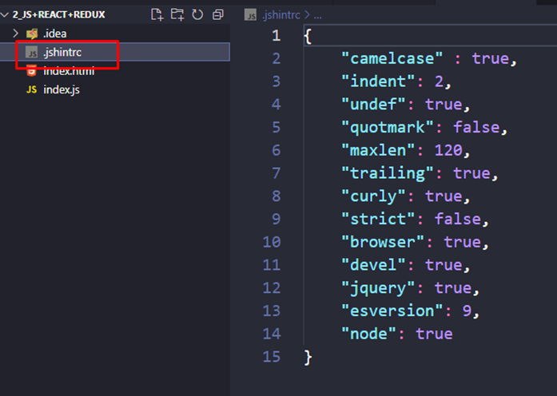

## **01 - Подготовка к работе**

### **006 Как работать с JSHint**

Устанавливаем сначала плагин в вс коде, а потом через нпм

видим, что плагин показывает нам ошибки JS

Так же стоит закинуть данный файлик в самую основную папку с проектами (если закинуть как тут внутрь проекта, то файлик будет работать только на данный проект)

